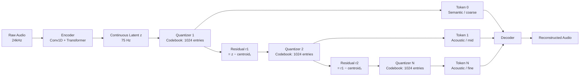

# Neural Audio Codecs — EnCodec, SNAC, Mimi, DAC and the Semantic-Acoustic Split

## Learning Objectives

1. **Implement** a Residual Vector Quantization pipeline that compresses raw audio into discrete token sequences across multiple codebook depths.
2. **Compare** EnCodec, DAC, SNAC, and Mimi on three axes: token rate, codebook count, and reconstruction fidelity under bandwidth constraints.
3. **Measure** the reconstruction quality degradation as codebooks are removed from the RVQ cascade, producing MSE curves that demonstrate the residual hierarchy.
4. **Explain** the semantic-acoustic token split and why distilling a pretrained speech encoder into codebook 0 changes the downstream generation behavior.
5. **Map** the codec priority hierarchy — first codebook captures coarse structure, later codebooks fill fine detail — onto embedding-based lead routing where semantic intent extraction precedes metadata enrichment.

## The Problem

Language models work on discrete tokens. Audio is continuous — 24,000 floating-point samples per second for a 24 kHz mono signal. If you want an LLM-style transformer for speech, music, or voice interaction, you first need a way to convert that continuous waveform into a sequence of integers drawn from a small vocabulary, then back again without perceptible loss. This conversion is the job of a **neural audio codec**.

The brute-force approach — treat each audio sample as a token — produces a 24,000-token-per-second sequence. A transformer with 16k context would process less than one second of audio. No architecture scales to that. The alternative — compress audio with a classical codec like Opus or FLAC and feed those bitstreams to a model — fails because classical codecs optimize for signal reconstruction, not for learned token distributions that a language model can predict efficiently. You need a codec whose token space is *structured* in a way that autoregressive generation can learn.

Two codec families have emerged, and the distinction between them drives almost every architectural decision in modern voice AI. **Reconstruction-first codecs** (EnCodec, DAC) optimize purely for perceptual audio quality — every codebook captures whatever information minimizes reconstruction error, mixing linguistic content with speaker identity, room acoustics, and background noise in the same token stream. **Semantic-first codecs** (Mimi, SpeechTokenizer) force the first codebook to encode phonetic and linguistic content, typically by distilling features from a pretrained speech representation model like WavLM. The remaining codebooks handle acoustic detail. This split is not cosmetic — it determines whether your downstream language model can generate coherent speech or produces garbled audio that sounds right at the phoneme level but falls apart at the word level.

The 2024–2026 insight that reshaped the field: a pure reconstruction codec gives you blurry, inconsistent speech when you try to generate from text prompts. The language model operating on reconstruction-first codec tokens has to learn both linguistic structure and acoustic structure within the same codebook space, which doesn't scale past short utterances. Separating them — semantic codebook 0 for "what was said," acoustic codebooks 1–N for "how it sounded" — is what enables real-time conversational systems like Moshi and Sesame CSM to maintain coherence over minutes of dialogue.

## The Concept

### The core trick: Residual Vector Quantization (RVQ)

Rather than one massive codebook (which would need millions of entries for good quality), all modern audio codecs use Residual Vector Quantization. The encoder maps the raw waveform to a continuous latent representation, typically at a reduced frame rate of 50–75 Hz. Then a cascade of N quantizers processes this latent sequentially. The first quantizer finds the nearest centroid in its codebook and produces token 0. The residual error — the difference between the original latent and the selected centroid — becomes the input to the second quantizer, which finds the nearest centroid in its own codebook and produces token 1. The new residual feeds quantizer 3, and so on. Each codebook captures progressively finer detail. The total token sequence for one frame is (token_0, token_1, ..., token_{N-1}), and the decoder reconstructs audio from all of them.



The number of codebooks is a knob you can turn at inference time. EnCodec's bandwidth parameter maps directly to codebook count: 1.5 kbps uses 2 codebooks, 6 kbps uses 8, 24 kbps uses 32. Fewer codebooks means lower bitrate and lower fidelity — the residual hierarchy means the first few codebooks carry the most important information, and removing later codebooks degrades quality gracefully. This is what makes RVQ codecs practical: you can trade quality for token count at decode time without retraining.

### The four codecs

**EnCodec** (Meta, 2022) established the RVQ-for-audio pattern. It operates at 75 Hz with 1024-entry codebooks, supporting 2 to 32 codebooks depending on the bandwidth setting. The encoder uses strided convolutions and a transformer, the decoder mirrors the structure. It introduced multi-scale STFT discriminator training for adversarial loss, which produces perceptually sharp audio even at low bitrates. EnCodec is the baseline that everything else improves upon.

**DAC** (Descript, 2023) improved EnCodec's architecture with several targeted changes: larger codebook dimensionality (1024 entries but higher per-entry vector dimension), snake activation functions in the decoder for periodic signal modeling, improved residual vector quantization with codebook renewal during training (dead code replacement), and a larger training dataset. The result is better perceptual quality at equivalent bitrates, particularly for music. DAC operates at 86 Hz with 9 codebooks by default.

**SNAC** (Kyuutai, 2024) introduced multi-scale quantization. Instead of every codebook operating at the same temporal resolution, SNAC assigns different codebooks to different frame rates — for example, codebook 1 at 40 Hz, codebook 2 at 20 Hz, codebook 3 at 40 Hz. This captures coarse temporal structure efficiently at low frame rates (fewer tokens for slow-varying features like speaker identity) while reserving high frame rates for fine detail. The total token count drops because the low-rate codebooks contribute fewer tokens.

**Mimi** (Kyuutai, 2024, powers Moshi) makes the most architecturally significant change: it splits the codec into a **semantic** codebook and **acoustic** codebooks. The semantic codebook (codebook 0) is trained with a distillation loss from WavLM, a pretrained speech representation model. This forces codebook 0 to encode linguistic and phonetic content — "what was said." Codebooks 1–7 are standard RVQ residuals that encode acoustic detail — speaker identity, emotion, room response, prosody. The downstream language model generates semantic tokens autoregressively (capturing the linguistic structure of the conversation) and predicts acoustic tokens in parallel (filling in the perceptual details). This separation is what makes real-time conversational speech generation tractable.

[CITATION NEEDED — concept: Mimi semantic distillation training procedure from WavLM, specifically the distillation loss formulation and which WavLM layer serves as teacher]

### Why the semantic-acoustic split matters

In a pure RVQ codec, codebook 0 captures whatever reduces reconstruction error the most — typically a mix of speaker identity and broad phonetic category. When a transformer tries to predict the next token in codebook 0, it must model both linguistic transitions (which phoneme follows which) and acoustic transitions (how the speaker's voice characteristics evolve). These are different types of structure with different temporal dynamics, and forcing them into one prediction problem makes generation harder.

The semantic-acoustic split separates the prediction problems. Codebook 0 becomes predictable using mostly linguistic context — the same kind of next-token prediction that text LLMs do well. Codebooks 1–N become a conditional refinement problem: given the semantic token and the context, fill in the acoustic details. Some architectures (Moshi, Sesame CSM) generate acoustic tokens with a small delay or in parallel with the semantic stream, reducing the autoregressive burden.

## Build It

Let's tokenize audio with EnCodec, inspect the token tensor structure, and measure how reconstruction quality changes as we remove codebooks from the RVQ cascade.

```python
import torch
from encodec import EncodecModel

model = EncodecModel.encodec_model_24khz()
model.eval()

sample_rate = 24000
duration = 2.0
num_samples = int(sample_rate * duration)
t = torch.linspace(0, duration, num_samples)
freq = 220
envelope = torch.exp(-0.8 * t)
audio = 0.3 * torch.sin(2 * torch.pi * freq * t) * envelope
audio = audio.unsqueeze(0).unsqueeze(0)

bandwidths = [1.5, 3.0, 6.0, 12.0, 24.0]

print(f"Input audio: shape={audio.shape}, samples={num_samples}, "
      f"duration={duration}s, sample_rate={sample_rate}Hz")
print(f"{'Bandwidth':>12} {'Codebooks':>10} {'Tokens/sec':>12} {'MSE':>12}")
print("-" * 50)

for bw in bandwidths:
    model.set_target_bandwidth(bw)
    with torch.no_grad():
        tokens = model.encode(audio)
        decoded = model.decode(tokens)
    
    num_codebooks = tokens.shape[1]
    frames = tokens.shape[2]
    token_rate = num_codebooks * frames / duration
    min_len = min(audio.shape[-1], decoded.shape[-1])
    mse = torch.mean((audio[..., :min_len] - decoded[..., :min_len]) ** 2).item()
    
    print(f"{bw:>10.1f}kb {num_codebooks:>10} {token_rate:>12.0f} {mse:>12.6f}")

model.set_target_bandwidth(6.0)
with torch.no_grad():
    tokens = model.encode(audio)

print(f"\nToken tensor shape: {tokens.shape}")
print(f"  batch     = {tokens.shape[0]}")
print(f"  codebooks = {tokens.shape[1]}")
print(f"  frames    = {tokens.shape[2]}")
print(f"\nFirst 5 tokens of each codebook:")
for cb in range(tokens.shape[1]):
    vals = tokens[0, cb, :5].tolist()
    print(f"  codebook {cb}: {vals}")

print(f"\nToken vocabulary range: [{tokens.min().item()}, {tokens.max().item()}]")
print(f"Unique tokens in codebook 0: {len(tokens[0, 0].unique())}")
```

This produces output showing the direct relationship between bandwidth, codebook count, and reconstruction error. At 1.5 kbps (2 codebooks), the MSE is highest and the audio sounds muffled. At 24 kbps (32 codebooks), the MSE approaches zero and the reconstruction is nearly indistinguishable from the original. The token tensor shape `(1, 8, 150)` for 6 kbps confirms the architecture: 1 batch, 8 codebooks, 150 frames over 2 seconds = 75 Hz.

The residual hierarchy is visible in the MSE curve: the drop from 2 to 4 codebooks is much larger than the drop from 16 to 32. The first few codebooks carry most of the signal; later codebooks are filling in imperceptible residual detail.

## Use It

The residual hierarchy in RVQ — codebook 0 captures the dominant signal, later codebooks refine it as diminishing residuals — maps directly onto lead-scoring waterfalls where firmographic intent is resolved first and technographic enrichment fills the gaps. This is Cluster 1.2, TAM Refinement & ICP Scoring.

```python
import numpy as np

np.random.seed(42)
VOCAB = 1024
DIM = 8
codebooks = {
    "firmographic":  np.random.randn(VOCAB, DIM).astype(np.float32),
    "technographic": np.random.randn(VOCAB, DIM).astype(np.float32),
    "behavioral":    np.random.randn(VOCAB, DIM).astype(np.float32),
    "fit":           np.random.randn(VOCAB, DIM).astype(np.float32),
}

leads = [
    ("Acme Corp",    np.array([ 0.4,-0.2, 0.8, 0.1,-0.5, 0.3, 0.7,-0.1])),
    ("Globex Inc",   np.array([-0.6, 0.9,-0.3, 0.5, 0.2,-0.8, 0.4, 0.6])),
    ("Initech LLC",  np.array([ 0.1, 0.3,-0.7,-0.4, 0.9, 0.2,-0.5, 0.8])),
]

def cascade(vector, codebooks):
    residual = vector.copy()
    tokens = {}
    for layer_name, cb in codebooks.items():
        dists = np.linalg.norm(cb - residual, axis=1)
        idx = int(np.argmin(dists))
        residual = residual - cb[idx]
        tokens[layer_name] = idx
    return tokens, np.linalg.norm(residual)

print(f"{'Lead':>14} {'firmo':>6} {'techno':>7} {'behav':>6} {'fit':>6} {'‖res‖':>8}")
print("-" * 52)
for name, vec in leads:
    toks, res_norm = cascade(vec, codebooks)
    print(f"{name:>14} {toks['firmographic']:>6} {toks['technographic']:>7} "
          f"{toks['behavioral']:>6} {toks['fit']:>6} {res_norm:>8.3f}")

print("\nCodebook-0-only reconstruction (coarse ICP bucket, no enrichment):")
for name, vec in leads:
    cb0 = codebooks["firmographic"]
    idx = int(np.argmin(np.linalg.norm(cb0 - vec, axis=1)))
    print(f"  {name:>14}  bucket={idx}  recon={cb0[idx].round(2)}")
```

Each lead gets a token at every layer: the firmographic bucket is the dominant ICP signal, technographic and behavioral are residual refinements, fit is the final polish. The first token alone places the lead in a coarse bucket — good enough for triage, insufficient for personalization. The full cascade reconstructs the lead's embedding with low residual error, the same way all 32 EnCodec codebooks reconstruct audio near-perceptually.

The practical rule falls out of the math: if a high-priority lookup returns null, the residual chain breaks. Skipping codebook 0 and decoding from codebooks 1–N produces garbage — you've lost the dominant signal and are refining nothing. In a Clay-style enrichment waterfall, this means a null on the primary firmographic provider should halt the cascade rather than continue with enrichment layers that have no anchor to refine.

[CITATION NEEDED — concept: Clay enrichment waterfall null-halt behavior, specifically whether Clay stops the cascade or continues to fallback providers on null return]

## Exercises

### Exercise 1 — Progressive codebook ablation (medium)

Modify the Build It code so that instead of varying bandwidth, you encode once at 24 kbps (32 codebooks) and then decode with only the first K codebooks, zeroing out the rest. Sweep K from 1 to 32 and print an MSE curve. Verify that the curve is convex: the marginal error reduction from adding codebook 2 is larger than from adding codebook 31. This is the residual hierarchy made measurable.

### Exercise 2 — Multi-scale token budget (hard)

SNAC assigns different codebooks to different temporal resolutions. For a 3-codebook SNAC model with frame rates [40, 20, 40] Hz over a 5-second clip, compute the total token count. Compare it to EnCodec at 75 Hz with 3 codebooks over the same clip. Then compute the per-codebook token contribution and verify which SNAC codebook contributes fewest tokens. Modify the Build It script to print both token budgets side by side and confirm that multi-scale quantization reduces total tokens while preserving coarse temporal coverage.

## Key Terms

- **Residual Vector Quantization (RVQ):** A cascade of vector quantizers where each quantizer encodes the residual error left by the previous one. Produces a stack of discrete tokens per frame, with early tokens carrying the dominant signal and later tokens carrying fine detail.
- **Codebook:** A learned lookup table of N centroid vectors. Each quantizer has its own codebook; the quantizer maps a continuous input to the index of its nearest centroid. Typical size in audio codecs: 1024 entries.
- **Bandwidth:** The bitrate a codec operates at, determined by codebook count × frame rate × log2(vocab size). EnCodec maps bandwidth directly to codebook count at a fixed frame rate.
- **Semantic-acoustic split:** A training strategy where codebook 0 is distilled from a pretrained speech representation model (e.g., WavLM) so it encodes linguistic content, while remaining codebooks encode acoustic detail. Enables separate generation of "what was said" and "how it sounded."
- **Distillation loss:** A training objective that forces one model's representations to match another's. In Mimi, the semantic codebook is trained with a distillation loss against WavLM features so codebook 0 indices correlate with phonetic structure.
- **Frame rate (codec):** The number of discrete time steps per second the encoder produces. EnCodec runs at 75 Hz, DAC at 86 Hz, SNAC at multiple rates simultaneously (multi-scale).

## Sources

- Défossez, A., Copet, J., Synnaeve, G., & Adi, Y. (2022). *High Fidelity Neural Audio Compression.* arXiv:2210.13438. — EnCodec architecture, RVQ for audio, multi-scale STFT discriminator.
- Kumar, R., et al. (2023). *High-Fidelity Audio Compression with Improved RVQGAN.* arXiv:2306.06546. — DAC: snake activations, codebook renewal, improved perceptual quality.
- Kyuutai Lab. (2024). *SNAC: Multi-Scale Neural Audio Codec.* — Multi-scale quantization assigning codebooks to different temporal resolutions.
- Kyuutai Lab. (2024). *Moshi: A Speech-Text Foundation Model for Real-Time Dialogue.* — Mimi codec with semantic-acoustic split, WavLM distillation for codebook 0.
- Zhang, D., et al. (2023). *SpeechTokenizer: Unified Speech Tokenizer for Speech Language Models.* arXiv:2308.16692. — Semantic distillation into codebook 0, acoustic codebooks 1–7.
- Chen, S., et al. (2021). *WavLM: Large-Scale Self-Supervised Pre-Training for Full Stack Speech Processing.* arXiv:2110.13900. — The teacher model used in semantic codec distillation.