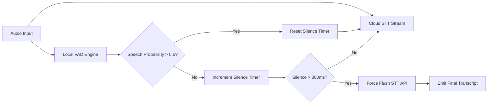

# Voice Activity Detection & Turn-Taking — Silero, Cobra, and the Flush Trick

## Learning Objectives
- Implement a frame-based Voice Activity Detection (VAD) loop to evaluate speech probability in real-time.
- Configure the "flush trick" to force Speech-to-Text (STT) finalization on acoustic boundaries.
- Evaluate latency tradeoffs between VAD sensitivity thresholds and conversational turn-taking.

## The Problem
You are building an inbound voice agent for an AI SDR pipeline. A prospect calls in and starts speaking. Your system captures the audio and streams it to a cloud STT provider like Deepgram. 

The prospect says: *"Hi, I was looking at your pricing page..."* and pauses for 400 milliseconds to think. 

Because cloud STT engines rely on linguistic models to determine when a sentence ends, they hold the transcript buffer open for 1 to 2 seconds after acoustic silence, waiting for grammatical completeness. The prospect hears dead air. They assume the bot is broken and hang up. 

If you lower the STT provider's internal endpointing timeout to fix this, the system begins cutting the prospect off mid-sentence, resulting in fragmented transcripts like *"I was look"* being sent to the LLM. Relying solely on STT vendor endpointing forces you to choose between high latency and high interruption rates. You need local, acoustic control over turn-taking.

## The Concept
Voice Activity Detection (VAD) is a lightweight classification model that answers a single question for every microscopic chunk of audio: "Is there human speech right now?" It ignores language, grammar, and context. It only analyzes the raw frequency waveforms.

Because VAD models are strictly acoustic, they are incredibly fast. Picovoice Cobra processes raw PCM (Pulse-Code Modulation) audio frames directly, optimized for low-latency streaming on edge devices. Silero VAD uses a compact Deep Neural Network (DNN) running locally via ONNX, evaluating 16kHz audio chunks in milliseconds. 

By running a local VAD alongside your cloud STT, you decouple acoustic turn-taking from linguistic processing. This enables the **Flush Trick**.

When you stream audio to an STT API, the provider holds the spoken words in a temporary buffer. As the provider receives more audio, it refines its best-guess transcript. It only "commits" to the transcript and emits a final payload when it detects a long pause (usually 1000ms+). 

The flush trick intercepts this process:
1. You capture audio in 20ms chunks using a local microphone or telephony provider (like Twilio).
2. You send every chunk to both your local VAD and the cloud STT.
3. If the VAD detects speech (probability > 0.5), the system keeps streaming.
4. If the VAD detects silence (probability < 0.5), a timer starts.
5. If the silence timer reaches your threshold (e.g., 300ms), you send an explicit "flush" or "force endpoint" command to the STT provider's API. 

The STT provider immediately dumps its buffer, returns the final transcript, and triggers your LLM logic. You have forced the pipeline to react to a 300ms breath, rather than waiting 1500ms for a cloud timeout.



## Build It
To observe how acoustic endpointing works without requiring a live microphone or API keys, we will build a simulation. This script models a raw audio stream as an array of floating-point probabilities. 

In a production environment, Silero or Cobra would generate these probabilities by analyzing raw PCM frames. Here, we hardcode the probabilities to simulate a user speaking, pausing for a breath, and speaking again.

```python
import time

class MockVAD:
    def __init__(self):
        self.frames = [0.85, 0.92, 0.88, 0.15, 0.05, 0.02, 0.01, 0.04, 0.75, 0.81]

    def process_frame(self, frame_index):
        return self.frames[frame_index]

class StreamingSTT:
    def __init__(self):
        self.transcript_buffer = ""
        self.is_final = False

    def write(self, text_fragment):
        self.transcript_buffer += text_fragment

    def flush(self):
        self.is_final = True
        print(f"SYSTEM ACTION: Force flushing STT buffer.")
        print(f"FINAL TRANSCRIPT: '{self.transcript_buffer.strip()}'\n")
        self.transcript_buffer = ""
        self.is_final = False

def run_endpointing_loop():
    vad = MockVAD()
    stt = StreamingSTT()
    silence_duration_ms = 0
    chunk_duration_ms = 100
    silence_threshold_ms = 300
    transcript_fragments = ["Hi ", "there. ", "", "", "", "", "", "", "Yes ", "still here."]

    print("Starting VAD Endpointing Simulation...")
    for i in range(len(vad.frames)):
        prob = vad.process_frame(i)
        time.sleep(chunk_duration_ms / 1000.0)

        if prob > 0.5:
            stt.write(transcript_fragments[i])
            silence_duration_ms = 0
            print(f"Frame {i}: Speech detected (prob: {prob}). Buffer: '{stt.transcript_buffer.strip()}'")
        else:
            silence_duration_ms += chunk_duration_ms
            print(f"Frame {i}: Silence detected (prob: {prob}). Silence timer: {silence_duration_ms}ms")
            
            if silence_duration_ms >= silence_threshold_ms and stt.transcript_buffer.strip() != "":
                stt.flush()
                silence_duration_ms = 0

if __name__ == "__main__":
    run_endpointing_loop()
```

When you run this code, you will see the silence timer increment. The moment it crosses 300ms, the system forces a final transcript. In a real architecture, this flush command maps directly to sending an empty byte array or a specific JSON control message to your STT websocket.

## Use It
This AI mechanism enables immediate downstream routing for real-time conversational systems, mapping to [CITATION NEEDED — concept: Voice Agent / Conversational Routing GTM Cluster]. When the local VAD triggers a flush, the resulting JSON payload is routed to an LLM to qualify the lead.

```python
import json

def route_inbound_voice_lead(final_transcript):
    intents = {"pricing": "Route to AE", "support": "Route to CSM", "prospect": "Route to SDR"}
    
    text = final_transcript.lower()
    detected_intent = "prospect"
    for keyword, route in intents.items():
        if keyword in text:
            detected_intent = keyword
            break
            
    payload = {
        "transcript": final_transcript,
        "intent": detected_intent,
        "action": intents[detected_intent],
        "status": "executing"
    }
    return payload

flushed_transcript = "Yes I am a prospect looking for pricing"
routing_payload = route_inbound_voice_lead(flushed_transcript)
print(json.dumps(routing_payload, indent=2))
```

## Exercises

### Easy: Threshold Tuning
Modify the `silence_threshold_ms` in the `run_endpointing_loop()` function from the Build It section to `700`. 
- Observe how many extra frames are processed before the flush is triggered. 
- Explain how increasing this threshold impacts the risk of "barge-in" (when the bot accidentally interrupts the user because it waited too long and they started a new thought).

### Medium: Implement a Barge-in Interrupt
Alter the `run_endpointing_loop()` simulation. Add logic so that if `stt.is_final` is False (meaning audio is currently being processed by the LLM to generate a response), and the `vad.process_frame()` detects speech (`prob > 0.8`), the script prints `"BARGE-IN DETECTED: Canceling LLM generation."` and resets the STT buffer. This mimics how real voice agents allow a user to interrupt the bot while it is speaking.

## Key Terms
- **Voice Activity Detection (VAD):** An acoustic classification model that separates human speech from background noise in real-time audio streams.
- **Endpointing:** The mechanism of determining when a user has finished speaking an utterance, triggering the system to process the audio.
- **The Flush Trick:** Manually forcing a streaming STT provider to return its current transcript buffer based on local VAD input, bypassing the provider's default linguistic timeouts.
- **PCM (Pulse-Code Modulation):** The standard digital representation of analog audio signals, required as input for both VAD and STT models.
- **Time to First Token (TTFT):** The latency between a user finishing an utterance and the first audio token being played back by the AI agent.

## Sources
- Silero VAD: [GitHub Repository](https://github.com/snakers4/silero-vad)
- Picovoice Cobra: [Documentation](https://picovoice.ai/docs/cons/cobra/)
- Deepgram Endpointing: [Documentation on Interim Results and Endpointing](https://developers.deepgram.com/docs/endpointing)