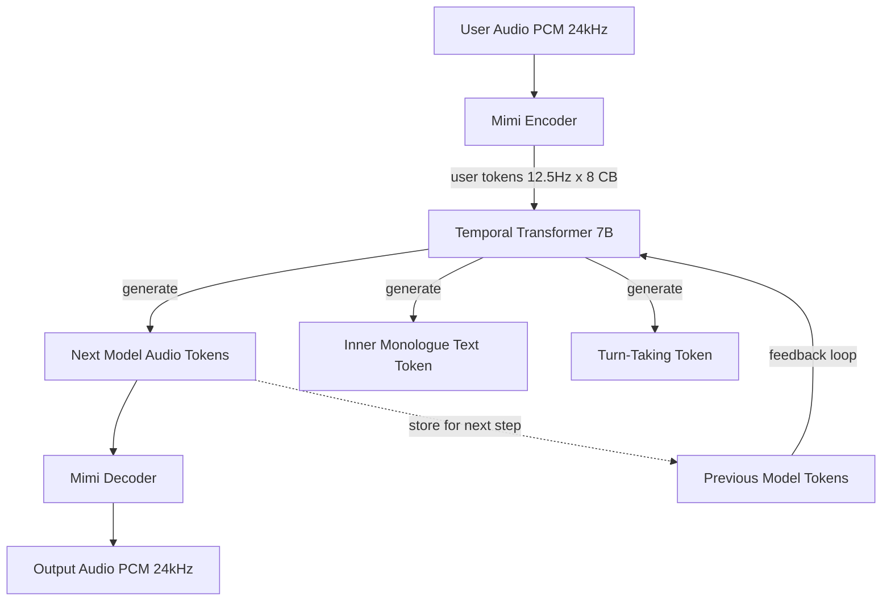

# Streaming Speech-to-Speech — Moshi, Hibiki, and Full-Duplex Dialogue

## Learning Objectives

1. Compute the frame budget for a full-duplex speech-to-speech latency target given Mimi's 12.5 Hz frame rate and a target end-to-end latency.
2. Implement dual-stream token alignment that interleaves user and model audio token sequences with correct temporal positioning.
3. Detect overlap frames in a dual-stream token window to identify simultaneous speech events.
4. Compare full-duplex S2S architecture against the ASR → LLM → TTS pipeline on latency floor, turn-taking, and backchannel capability.
5. Configure a full-duplex voice agent latency budget for an outbound GTM call scenario and evaluate fleet-level call telemetry.

## The Problem

Every voice agent built from a pipelined architecture — VAD, then STT, then LLM, then TTS — has a fundamental latency floor around 300–500 ms. Each stage has its own minimum processing time. You can tune and parallelize: start LLM inference on partial transcripts, stream TTS chunks before the full LLM response is ready, use streaming STT. But the pipeline shape itself caps you, because each stage depends on the previous stage's output.

Real conversation does not work in turns delimited by silence. People interrupt mid-sentence. They produce backchannel cues — "mm-hmm," "right," "go on" — that signal engagement without claiming the conversational floor. A half-duplex system cannot produce these cues because it only generates audio after the user has stopped speaking and the VAD gate has closed. The resulting interaction feels like a radio exchange: over, then back to you.

Full-duplex speech-to-speech removes the pipeline constraint entirely. Instead of four sequential stages, a single transformer takes audio tokens in and emits audio tokens out continuously, frame by frame, with no VAD gate between listening and speaking. Moshi (Kyutai, 2024) demonstrates this architecture at approximately 200 ms practical latency on a single L4 GPU, with a theoretical floor of 160 ms — one Mimi frame (80 ms) plus one acoustic delay frame (80 ms). That is roughly half what a best-in-class pipelined voice agent achieves.

## The Concept

The core mechanism of full-duplex S2S is maintaining two concurrent audio token streams through a single transformer, with temporal alignment between inbound user tokens and outbound model tokens at every timestep. No pipeline. No stage-to-stage handoff. One model, two streams, continuous generation.



**The Mimi audio codec** is the neural audio tokenizer that makes this possible. It compresses 24 kHz PCM audio into discrete tokens at a 12.5 Hz frame rate — meaning each token represents 80 ms of audio. Each frame carries 8 codebooks: the first few capture semantic content (what is being said), while higher codebooks encode acoustic detail (how it sounds). This separation matters because the transformer can attend to semantic codebooks for understanding and generate acoustic codebooks for production, all within the same forward pass.

**Dual-stream attention** is the architectural innovation. Moshi's 7B-parameter Temporal Transformer receives both the user's audio token sequence and its own generated audio token sequence as parallel inputs. At every 80 ms step, the transformer attends to both contexts simultaneously. This is structurally different from a pipeline where STT output feeds an LLM that feeds a TTS — here, the model is always aware of both sides of the conversation, frame by frame.

**Turn-taking without silence detection.** In a pipelined system, turn transitions are gated by VAD: the system waits for silence, then starts generating. Moshi replaces this with structural overlap representation. Special tokens in the stream mark conversational state — "user speaking," "model speaking," "both speaking." When a user starts talking while the model is mid-sentence, the transformer sees the incoming user tokens alongside its own output tokens and can decide to yield, continue, or produce a backchannel. No silence detection required. The overlap is a first-class concept in the token stream, not an edge case to be handled by a separate module.

**The latency budget.** At 12.5 Hz, each frame is 80 ms. The theoretical minimum is two frames: one to encode the user's latest audio and one to decode the model's response. That is 160 ms. In practice, attention computation, GPU scheduling, and network buffering add 20–40 ms, bringing real-world latency to ~200 ms. The key insight is that latency is bounded by the codec frame rate, not by a sum of pipeline stage latencies. You cannot go faster than 80 ms per frame, but you also do not pay the additive cost of STT + LLM + TTS.

```python
MIMI_FRAME_RATE_HZ = 12.5
MIMI_FRAME_MS = 1000.0 / MIMI_FRAME_RATE_HZ
NUM_CODEBOOKS = 8

latency_targets_ms = [160, 200, 300, 500]
pipeline_baseline_ms = 450

print("=== Full-Duplex S2S Frame Budget ===")
print(f"Mimi frame rate: {MIMI_FRAME_RATE_HZ} Hz")
print(f"Mimi frame duration: {MIMI_FRAME_MS:.0f} ms")
print(f"Codebooks per stream: {NUM_CODEBOOKS}")
print(f"Pipeline baseline (ASR+LLM+TTS): {pipeline_baseline_ms} ms")
print()

for target in latency_targets_ms:
    frames_available = target / MIMI_FRAME_MS
    speedup_vs_pipeline = pipeline_baseline_ms / target
    label = "theoretical floor" if target == 160 else \
            "practical (1x L4)" if target == 200 else \
            "acceptable for simple IVR" if target == 300 else \
            "half-duplex territory"
    print(f"Target {target:>4}ms | {frames_available:>4.1f} frames | "
          f"{speedup_vs_pipeline:.1f}x vs pipeline | {label}")
```

**Hibiki's role.** [CITATION NEEDED — concept: Hibiki model architecture and its relationship to Moshi's full-duplex pipeline; clarify whether Hibiki is a separate inference engine, a TTS component, or a distillation variant]. What is documented is that Hibiki performs speech-to-speech translation on a chunk-by-chunk basis, processing incoming audio in one language and producing translated audio output in another, without an intermediate text representation. Whether Hibiki shares Mimi's codec, reuses Moshi's transformer weights, or is an independent model trained on parallel speech pairs is not clearly specified in available documentation. The practical implication for GTM is that Hibiki-style chunk-by-chunk S2S translation enables real-time multilingual voice agents where the latency cost of translation is additive frames rather than a full additional pipeline.

## Build It

Let's build a simulation of the dual-stream token processing pipeline. This code models how Moshi interleaves user and model audio tokens at 12.5 Hz, detects overlap frames where both speakers are active, and tracks the conversation state through turn-taking tokens. We cannot run the actual 7B Moshi model in a terminal, but we can simulate its temporal behavior precisely — the frame timing, stream alignment, and overlap detection logic are all deterministic properties of the architecture.

```python
import random
random.seed(42)

MIMI_FRAME_RATE_HZ = 12.5
MIMI_FRAME_MS = 1000.0 / MIMI_FRAME_RATE_HZ
NUM_CODEBOOKS = 8

TURN_STATES = {
    0: "user_speaking",
    1: "model_speaking",
    2: "overlap",
    3: "silence",
}

def generate_user_stream(duration_s, interruptions_at=None):
    interruptions_at = interruptions_at or []
    num_frames = int(duration_s * MIMI_FRAME_RATE_HZ)
    stream = []
    for i in range(num_frames):
        time_ms = i * MIMI_FRAME_MS
        active = True
        if 20 < i < 35:
            active = False
        if i in interruptions_at:
            active = True
        codebooks = [random.randint(0, 2047) for _ in range(NUM_CODEBOOKS)] if active else [0] * NUM_CODEBOOKS
        stream.append({
            "frame": i,
            "time_ms": time_ms,
            "speaker": "user",
            "codebooks": codebooks,
            "active": active,
        })
    return stream

def generate_model_stream(duration_s, yield_at=None):
    yield_at = yield_at or []
    num_frames = int(duration_s * MIMI_FRAME_RATE_HZ)
    stream = []
    for i in range(num_frames):
        time_ms = i * MIMI_FRAME_MS
        active = True
        if i in yield_at:
            active = False
        codebooks = [random.randint(0, 2047) for _ in range(NUM_CODEBOOKS)] if active else [0] * NUM_CODEBOOKS
        stream.append({
            "frame": i,
            "time_ms": time_ms,
            "speaker": "model",
            "codebooks": codebooks,
            "active": active,
        })
    return stream

user_stream = generate_user_stream(4.0, interruptions_at=[42, 43, 44])
model_stream = generate_model_stream(4.0, yield_at=[42, 43, 44])

print("=== Dual-Stream Token Simulation ===")
print(f"Duration: 4.0s = {len(user_stream)} frames per stream")
print(f"User active frames: {sum(1 for f in user_stream if f['active'])}")
print(f"Model active frames: {sum(1 for f in model_stream if f['active'])}")
print()

merged = []
for i in range(max(len(user_stream), len(model_stream))):
    u = user_stream[i] if i < len(user_stream) else None
    m = model_stream[i] if i < len(model_stream) else None
    
    u_active = u and u["active"]
    m_active = m and m["active"]
    
    if u_active and m_active:
        state = TURN_STATES[2]
    elif u_active:
        state = TURN_STATES[0]
    elif m_active:
        state = TURN_STATES[1]
    else:
        state = TURN_STATES[3]
    
    merged.append({
        "frame": i,
        "time_ms": i * MIMI_FRAME_MS,
        "state": state,
        "user_active": u_active,
        "model_active": m_active,
    })

overlap_frames = [f for f in merged if f["state"] == "overlap"]
silence_frames = [f for f in merged if f["state"] == "silence"]
user_only = [f for f in merged if f["state"] == "user_speaking"]
model_only = [f for f in merged if f["state"] == "model_speaking"]

print("Conversation state distribution:")
print(f"  user_speaking:   {len(user_only):>3} frames ({len(user_only)/len(merged)*100:.1f}%)")
print(f"  model_speaking:  {len(model_only):>3} frames ({len(model_only)/len(merged)*100:.1f}%)")
print(f"  overlap:         {len(overlap_frames):>3} frames ({len(overlap_frames)/len(merged)*100:.1f}%)")