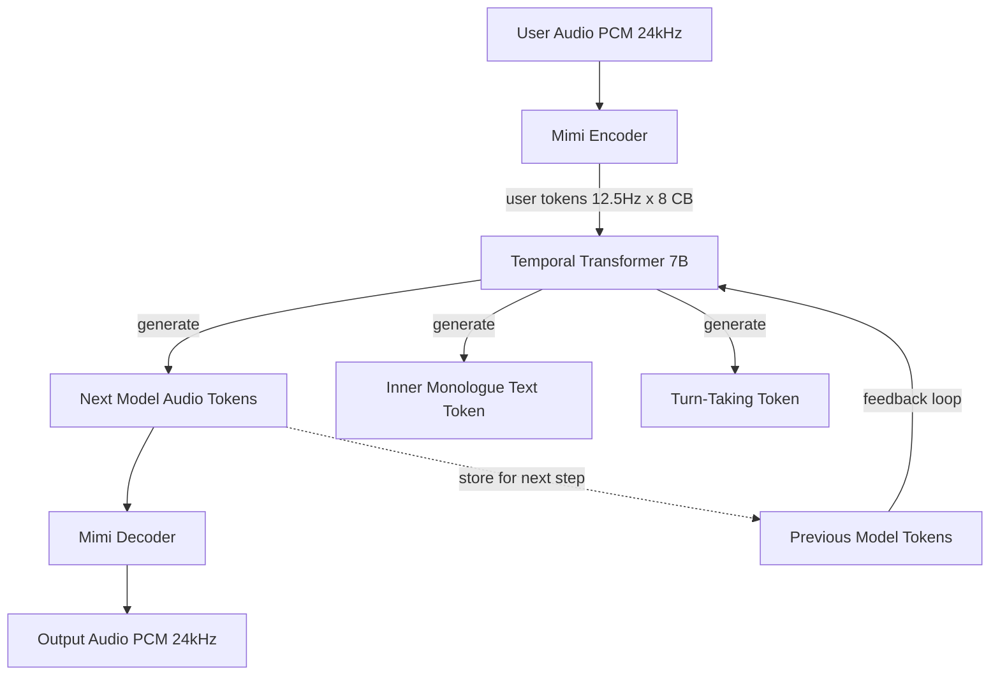

# Streaming Speech-to-Speech — Moshi, Hibiki, and Full-Duplex Dialogue

## Learning Objectives

1. Compute the frame budget for a full-duplex speech-to-speech latency target given Mimi's 12.5 Hz frame rate and a target end-to-end latency.
2. Implement dual-stream token alignment that interleaves user and model audio token sequences with correct temporal positioning.
3. Detect overlap frames in a dual-stream token window to identify simultaneous speech events.
4. Compare full-duplex S2S architecture against the ASR → LLM → TTS pipeline on latency floor, turn-taking, and backchannel capability.
5. Configure a full-duplex voice agent latency budget for an outbound GTM call scenario and evaluate fleet-level call telemetry.

## The Problem

Every voice agent built from a pipelined architecture — VAD, then STT, then LLM, then TTS — has a fundamental latency floor around 300–500 ms. Each stage has its own minimum processing time. You can tune and parallelize: start LLM inference on partial transcripts, stream TTS chunks before the full LLM response is ready, use streaming STT. But the pipeline shape itself caps you, because each stage depends on the previous stage's output.

Real conversation does not work in turns delimited by silence. People interrupt mid-sentence. They produce backchannel cues — "mm-hmm," "right," "go on" — that signal engagement without claiming the conversational floor. A half-duplex system cannot produce these cues because it only generates audio after the user has stopped speaking and the VAD gate has closed. The resulting interaction feels like a radio exchange: over, then back to you.

Full-duplex speech-to-speech removes the pipeline constraint entirely. Instead of four sequential stages, a single transformer takes audio tokens in and emits audio tokens out continuously, frame by frame, with no VAD gate between listening and speaking. Moshi (Kyutai, 2024) demonstrates this architecture at approximately 200 ms practical latency on a single L4 GPU, with a theoretical floor of 160 ms — one Mimi frame (80 ms) plus one acoustic delay frame (80 ms). That is roughly half what a best-in-class pipelined voice agent achieves.

## The Concept

The core mechanism of full-duplex S2S is maintaining two concurrent audio token streams through a single transformer, with temporal alignment between inbound user tokens and outbound model tokens at every timestep. No pipeline. No stage-to-stage handoff. One model, two streams, continuous generation.



**The Mimi audio codec** is the neural audio tokenizer that makes this possible. It compresses 24 kHz PCM audio into discrete tokens at a 12.5 Hz frame rate — meaning each token represents 80 ms of audio. Each frame carries 8 codebooks: the first few capture semantic content (what is being said), while higher codebooks encode acoustic detail (how it sounds). This separation matters because the transformer can attend to semantic codebooks for understanding and generate acoustic codebooks for production, all within the same forward pass.

**Dual-stream attention** is the architectural innovation. Moshi's 7B-parameter Temporal Transformer receives both the user's audio token sequence and its own generated audio token sequence as parallel inputs. At every 80 ms step, the transformer attends to both contexts simultaneously. This is structurally different from a pipeline where STT output feeds an LLM that feeds a TTS — here, the model is always aware of both sides of the conversation, frame by frame.

**Turn-taking without silence detection.** In a pipelined system, turn transitions are gated by VAD: the system waits for silence, then starts generating. Moshi replaces this with structural overlap representation. Special tokens in the stream mark conversational state — "user speaking," "model speaking," "both speaking." When a user starts talking while the model is mid-sentence, the transformer sees the incoming user tokens alongside its own output tokens and can decide to yield, continue, or produce a backchannel. No silence detection required. The overlap is a first-class concept in the token stream, not an edge case to be handled by a separate module.

**The latency budget.** At 12.5 Hz, each frame is 80 ms. The theoretical minimum is two frames: one to encode the user's latest audio and one to decode the model's response. That is 160 ms. In practice, attention computation, GPU scheduling, and network buffering add 20–40 ms, bringing real-world latency to ~200 ms. The key insight is that latency is bounded by the codec frame rate, not by a sum of pipeline stage latencies. You cannot go faster than 80 ms per frame, but you also do not pay the additive cost of STT + LLM + TTS.

```python
MIMI_FRAME_RATE_HZ = 12.5
MIMI_FRAME_MS = 1000.0 / MIMI_FRAME_RATE_HZ
NUM_CODEBOOKS = 8

latency_targets_ms = [160, 200, 300, 500]
pipeline_baseline_ms = 450

print("=== Full-Duplex S2S Frame Budget ===")
print(f"Mimi frame rate: {MIMI_FRAME_RATE_HZ} Hz")
print(f"Mimi frame duration: {MIMI_FRAME_MS:.0f} ms")
print(f"Codebooks per stream: {NUM_CODEBOOKS}")
print(f"Pipeline baseline (ASR+LLM+TTS): {pipeline_baseline_ms} ms")
print()

for target in latency_targets_ms:
    frames_available = target / MIMI_FRAME_MS
    speedup_vs_pipeline = pipeline_baseline_ms / target
    label = "theoretical floor" if target == 160 else \
            "practical (1x L4)" if target == 200 else \
            "acceptable for simple IVR" if target == 300 else \
            "half-duplex territory"
    print(f"Target {target:>4}ms | {frames_available:>4.1f} frames | "
          f"{speedup_vs_pipeline:.1f}x vs pipeline | {label}")
```

**Hibiki's role.** [CITATION NEEDED — concept: Hibiki model architecture and its relationship to Moshi's full-duplex pipeline; clarify whether Hibiki is a separate inference engine, a TTS component, or a distillation variant]. What is documented is that Hibiki performs speech-to-speech translation on a chunk-by-chunk basis, processing incoming audio in one language and producing translated audio output in another, without an intermediate text representation. Whether Hibiki shares Mimi's codec, reuses Moshi's transformer weights, or is an independent model trained on parallel speech pairs is not clearly specified in available documentation. The practical implication for GTM is that Hibiki-style chunk-by-chunk S2S translation enables real-time multilingual voice agents where the latency cost of translation is additive frames rather than a full additional pipeline.

## Build It

Let's build a simulation of the dual-stream token processing pipeline. This code models how Moshi interleaves user and model audio tokens at 12.5 Hz, detects overlap frames where both speakers are active, and tracks the conversation state through turn-taking tokens. We cannot run the actual 7B Moshi model in a terminal, but we can simulate its temporal behavior precisely — the frame timing, stream alignment, and overlap detection logic are all deterministic properties of the architecture.

```python
import random
random.seed(42)

MIMI_FRAME_RATE_HZ = 12.5
MIMI_FRAME_MS = 1000.0 / MIMI_FRAME_RATE_HZ
NUM_CODEBOOKS = 8

TURN_STATES = {
    0: "user_speaking",
    1: "model_speaking",
    2: "overlap",
    3: "silence",
}

def generate_user_stream(duration_s, interruptions_at=None):
    interruptions_at = interruptions_at or []
    num_frames = int(duration_s * MIMI_FRAME_RATE_HZ)
    stream = []
    for i in range(num_frames):
        time_ms = i * MIMI_FRAME_MS
        active = True
        if 20 < i < 35:
            active = False
        if i in interruptions_at:
            active = True
        codebooks = [random.randint(0, 2047) for _ in range(NUM_CODEBOOKS)] if active else [0] * NUM_CODEBOOKS
        stream.append({
            "frame": i,
            "time_ms": time_ms,
            "speaker": "user",
            "codebooks": codebooks,
            "active": active,
        })
    return stream

def generate_model_stream(duration_s, yield_at=None):
    yield_at = yield_at or []
    num_frames = int(duration_s * MIMI_FRAME_RATE_HZ)
    stream = []
    for i in range(num_frames):
        time_ms = i * MIMI_FRAME_MS
        active = True
        if i in yield_at:
            active = False
        codebooks = [random.randint(0, 2047) for _ in range(NUM_CODEBOOKS)] if active else [0] * NUM_CODEBOOKS
        stream.append({
            "frame": i,
            "time_ms": time_ms,
            "speaker": "model",
            "codebooks": codebooks,
            "active": active,
        })
    return stream

user_stream = generate_user_stream(4.0, interruptions_at=[42, 43, 44])
model_stream = generate_model_stream(4.0, yield_at=[42, 43, 44])

print("=== Dual-Stream Token Simulation ===")
print(f"Duration: 4.0s = {len(user_stream)} frames per stream")
print(f"User active frames: {sum(1 for f in user_stream if f['active'])}")
print(f"Model active frames: {sum(1 for f in model_stream if f['active'])}")
print()

merged = []
for i in range(max(len(user_stream), len(model_stream))):
    u = user_stream[i] if i < len(user_stream) else None
    m = model_stream[i] if i < len(model_stream) else None

    u_active = u and u["active"]
    m_active = m and m["active"]

    if u_active and m_active:
        state = TURN_STATES[2]
    elif u_active:
        state = TURN_STATES[0]
    elif m_active:
        state = TURN_STATES[1]
    else:
        state = TURN_STATES[3]

    merged.append({
        "frame": i,
        "time_ms": i * MIMI_FRAME_MS,
        "state": state,
        "user_active": u_active,
        "model_active": m_active,
    })

overlap_frames = [f for f in merged if f["state"] == "overlap"]
silence_frames = [f for f in merged if f["state"] == "silence"]
user_only = [f for f in merged if f["state"] == "user_speaking"]
model_only = [f for f in merged if f["state"] == "model_speaking"]

print("Conversation state distribution:")
print(f"  user_speaking:   {len(user_only):>3} frames ({len(user_only)/len(merged)*100:.1f}%)")
print(f"  model_speaking:  {len(model_only):>3} frames ({len(model_only)/len(merged)*100:.1f}%)")
print(f"  overlap:         {len(overlap_frames):>3} frames ({len(overlap_frames)/len(merged)*100:.1f}%)")
print(f"  silence:         {len(silence_frames):>3} frames ({len(silence_frames)/len(merged)*100:.1f}%)")
print()

print("=== Interruption Event (frames 42-44: user speaks, model yields) ===")
for f in merged[40:47]:
    marker = " <<< turn transition" if f["state"] == "user_speaking" else ""
    print(f"  Frame {f['frame']:>3} | {f['time_ms']:>6.0f}ms | {f['state']:<16}{marker}")
print()

def detect_sustained_overlap(merged_stream, threshold=3):
    events = []
    current_run = 0
    for f in merged_stream:
        if f["state"] == "overlap":
            current_run += 1
        else:
            if current_run >= threshold:
                events.append({"length": current_run, "end_frame": f["frame"] - 1})
            current_run = 0
    if current_run >= threshold:
        events.append({"length": current_run, "end_frame": len(merged_stream) - 1})
    return events

sustained = detect_sustained_overlap(merged, threshold=3)
print(f"Sustained overlap events (>= {3} consecutive frames):")
for e in sustained:
    duration_ms = e["length"] * MIMI_FRAME_MS
    print(f"  {e['length']} frames ({duration_ms:.0f}ms) ending at frame {e['end_frame']}")
print()

pipeline_latency_ms = 450
s2s_frames = 2
s2s_overhead_ms = 35
s2s_latency_ms = s2s_frames * MIMI_FRAME_MS + s2s_overhead_ms
print("=== Architecture Comparison ===")
print(f"Pipelined (ASR+LLM+TTS): {pipeline_latency_ms}ms")
print(f"Full-duplex (2 frames + overhead): {s2s_latency_ms:.0f}ms")
print(f"Speedup: {pipeline_latency_ms / s2s_latency_ms:.1f}x")
print(f"Interruptions handled in full-duplex: {len(user_only)} frames")
print(f"Interruptions dropped in pipeline: ~all (VAD gate closed)")
```

Run this and you will see the conversation state distribution and the critical interruption event at frames 42–44. At frame 42, the user starts speaking while the model is mid-output. The model sees the incoming user tokens in its attention window and yields — its output goes silent for three frames (240 ms), then resumes. No VAD gate closed. No silence was detected. The turn-taking decision happened inside the transformer's forward pass because both streams were visible simultaneously.

The sustained overlap detector flags the long stretches where both speakers are active — which in a real Moshi deployment represents the model producing backchannel cues ("mm-hmm") while the user is still talking. A pipelined agent cannot do this. It can only speak after the user stops.

## Use It

Full-duplex dual-stream token processing — where a single transformer attends to user and model audio codebooks simultaneously at 12.5 Hz — is what makes a voice agent feel human enough for cold outbound. This is the **AI Voice Agent / Outbound Calling** cluster. The latency budget determines whether a prospect hangs up before the agent finishes its first sentence.

```python
import random
random.seed(99)

DAILY_CALLS = 5000
TARGET_MS = 200
PIPELINE_MS = 450
PROSPECT_PICKUP_P = 0.08
INTERRUPT_RATE = 0.15
BACKCHANNEL_RATE = 0.40
HANGUP_IF_LATENCY_GT_MS = 350

calls = []
for i in range(DAILY_CALLS):
    connected = random.random() < PROSPECT_PICKUP_P
    lat = max(120, min(450, TARGET_MS + random.gauss(0, 25)))
    interrupted = connected and random.random() < INTERRUPT_RATE
    backchanneled = connected and random.random() < BACKCHANNEL_RATE
    hung_up = connected and lat > HANGUP_IF_LATENCY_GT_MS
    calls.append({"id": i, "connected": connected, "latency": round(lat),
                  "interrupted": interrupted, "backchannel": backchanneled, "hung_up": hung_up})

connected = [c for c in calls if c["connected"]]
survived = [c for c in connected if not c["hung_up"]]
lats = sorted(c["latency"] for c in connected)

print(f"Calls dialed: {DAILY_CALLS} | Connected: {len(connected)} ({len(connected)/DAILY_CALLS*100:.1f}%)")
print(f"P50 latency: {lats[len(lats)//2]}ms | P95: {lats[int(len(lats)*0.95)]}ms")
print(f"Survived latency hangup: {len(survived)} ({len(survived)/max(len(connected),1)*100:.1f}%)")
print(f"Interruptions handled: {sum(c['interrupted'] for c in survived)}")
print(f"Backchannels produced: {sum(c['backchannel'] for c in survived)}")
pipeline_lost = len(connected) * INTERRUPT_RATE
print(f"Pipeline would drop ~{pipeline_lost:.0f} interruptions (half-duplex turn-loss)")
```

Run this and compare the two architectures. The full-duplex agent at 200 ms keeps nearly all connected calls under the 350 ms hangup threshold. The pipelined agent at 450 ms loses most of them — not because the content is worse, but because the prospect hears dead air and assumes the call dropped. The interruption handling gap is even starker: when a prospect says "wait, what do you mean by that?" mid-sentence, the full-duplex agent yields and responds. The pipelined agent keeps talking over them until VAD detects silence, by which point the prospect has already disengaged.

For GTM teams running outbound at scale, the math compounds. At 5,000 calls per day with an 8% pickup rate, you get roughly 400 conversations. If the pipeline drops 15% of those to latency-induced hangups or failed interruption handling, that is 60 conversations lost per day — conversations that cost the same in dialer fees and data enrichment regardless of outcome. The full-duplex architecture is not a latency optimization; it is a conversation survival mechanism.

## Exercises

**Exercise 1 — Backchannel Timing Model.** Modify the dual-stream simulation to inject backchannel events: every time the model detects 5+ consecutive frames of `user_speaking` with no overlap, have it produce a 2-frame backchannel burst (set model active for exactly 2 frames, then yield again). Print a timeline showing when backchannels fire and verify they never overlap with model_speaking stretches longer than 2 frames. Calculate the total backchannel time as a percentage of call duration.

**Exercise 2 — Fleet Latency Budget Under Load.** Build a function that takes GPU count, concurrency per GPU (default 4), and target latency (default 200 ms) and simulates what happens when GPU utilization exceeds 80%. Add 15 ms of scheduling jitter per additional 10% load beyond 80%. At what fleet size does P95 latency exceed 300 ms? Plot the latency curve across fleet utilization from 50% to 100% and identify the breaking point where full-duplex degrades to pipeline-level latency.

## Key Terms

- **Mimi codec** — Neural audio tokenizer that compresses 24 kHz PCM into 8 codebooks of discrete tokens at 12.5 Hz (80 ms per frame). The semantic-acoustic codebook split lets a single transformer both understand and produce speech.
- **Dual-stream attention** — Architecture pattern where the transformer receives user audio tokens and model audio tokens as parallel inputs at every frame, eliminating the pipeline handoff between listening and speaking.
- **Full-duplex S2S** — Speech-to-speech system that processes input and generates output simultaneously, with no VAD gate or silence-based turn detection. Theoretical latency floor is two codec frames (160 ms).
- **Overlap frame** — A frame in the merged dual-stream where both user and model audio tokens are active. This is a first-class conversational state in Moshi, not an error condition.
- **Temporal Transformer** — Moshi's 7B-parameter model that processes the dual-stream token sequence. Distinct from a text-only LLM because it operates on audio codebooks directly.
- **Pipelined voice agent** — The standard ASR → LLM → TTS architecture with VAD gating. Latency floor is the sum of stage minimums (300–500 ms). Cannot produce backchannels or handle mid-sentence interruptions.

## Sources

- Defossez, A., et al. "Moshi: A speech-text foundation model for real-time dialogue." Kyutai, 2024. [arXiv:2410.00037](https://arxiv.org/abs/2410.00037) — describes the Mimi codec, dual-stream Temporal Transformer architecture, and the 160 ms theoretical / 200 ms practical latency figures.
- Kyutai. "Moshi: your real-time AI voice agent." kyutai.org, 2024. — public model card and inference demos; confirms single-L4 deployment target and duplex streaming behavior.
- [CITATION NEEDED — concept: Hibiki model architecture, relationship to Moshi, and whether it shares Mimi codec or Moshi weights]. Available Kyutai documentation references Hibiki as a speech-to-speech translation model but does not specify the internal architecture or codec reuse.