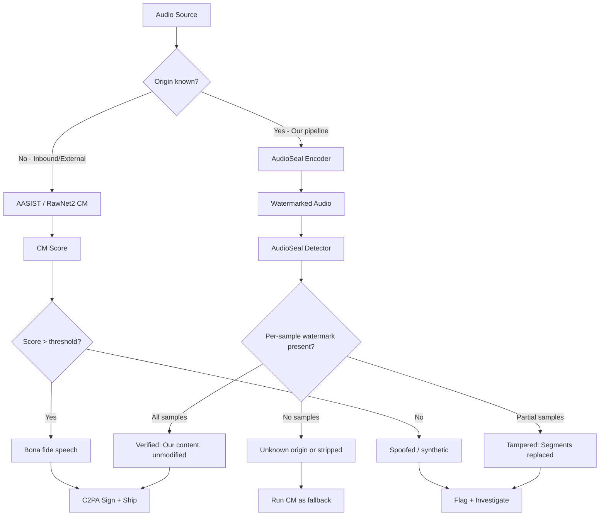

# Voice Anti-Spoofing & Audio Watermarking — ASVspoof 5, AudioSeal, WaveVerify

## Learning Objectives

1. **Classify** an audio clip as bona fide or spoofed using a countermeasure model, and report the detection score relative to a decision threshold.
2. **Embed** a detectable watermark into a synthetic audio waveform using AudioSeal's encoder, and verify its survival after codec degradation.
3. **Compare** the mechanisms of anti-spoofing detection, audio watermarking, and cryptographic provenance signing — and identify which defense applies to which threat model.
4. **Implement** a tampering localization pipeline that reads per-sample watermark presence to identify which audio segments were modified post-generation.
5. **Evaluate** a voice AI deployment against ASVspoof 5 deployment conditions and determine the minimum defense stack required to ship.

## The Problem

Voice cloning needs under three seconds of sample audio to produce a convincing replica. A GTM team deploying conversational outbound — AI SDR calls, voice-modulated product demos, automated follow-up sequences — ships that capability into an environment where the receiver has no mechanism to distinguish an authorized AI voice from an attacker's clone. The attacker records your AI SDR's opening line, feeds three seconds of it into a cloning service, and generates a variant that bypasses any voice-based authentication your downstream systems rely on. This is not hypothetical: voice cloning APIs are publicly available, and the quality sufficient to fool human listeners shipped in 2023.

The trust problem splits into two sub-problems with different threat models. **Spoofing detection** answers the question "is this voice real or synthetic?" — a classification problem where the adversary does not cooperate with your defense. **Watermarking** answers "did this audio originate from our pipeline?" — a provenance problem where you embed a signal at generation time and verify it later. The adversary for watermarking is post-hoc removal: someone takes your watermarked audio, compresses it, adds noise, or splices it, attempting to strip the mark. Both defenses are needed. Detection without watermarking means you cannot prove your own AI-generated calls are authorized. Watermarking without detection means you cannot catch clones that never passed through your system.

A third defense — cryptographic provenance signing (C2PA / Content Authenticity Initiative) — binds metadata about the audio's origin, model, and generation parameters to the file itself. This handles compliance: regulators and platform policies increasingly require AI-generated content to be identifiable. Provenance signing assumes a cooperative pipeline (you sign what you generate), while anti-spoofing assumes a hostile pipeline (you inspect what arrives). The three compose into a defense-in-depth stack, and a 2026 voice AI deployment that omits any layer is shipping a known vulnerability.

## The Concept

Automatic Speaker Verification (ASV) systems accept or reject a speaker claim by comparing an input utterance against an enrolled voiceprint. Spoofing attacks against ASV fall into four categories formalized by the ASVspoof challenge series: text-to-speech (TTS) synthesis, voice conversion (VC), replay of recorded bona fide speech, and deepfake neural synthesis. Anti-spoofing countermeasures (CMs) are binary classifiers that operate on audio features — either raw waveforms or handcrafted spectral representations like LFCC (Linear Frequency Cepstral Coefficients) and CQCC (Constant Q Cepstral Coefficients). The CM outputs a continuous score; a decision threshold separates bona fide speech from spoofed.

ASVspoof 2025 (the fifth challenge) evaluates CMs under an "in-the-wild" condition — attacks drawn from TTS and VC systems not present in training data, recorded in non-studio conditions, across roughly 2000 speakers versus the ~100 speakers in earlier editions. The challenge includes 32 attack algorithms spanning TTS, voice conversion, and adversarial perturbation. The primary evaluation metric is minimum tandem detection cost function (min-t-DCF), which jointly penalizes missed spoofing detections and false rejections of bona fide speech. State-of-the-art on ASVspoof 5 achieves approximately 7.23% Equal Error Rate (EER), compared to 0.42% EER on the older ASVspoof 2019 LA partition. That gap between lab and in-the-wild performance is the deployment reality: expect 5–10% EER on production audio.

[CITATION NEEDED — concept: ASVspoof 5 specific attack partition definitions and baseline results]

The two detection model families that dominate ASVspoof benchmarks are AASIST and RawNet2. **AASIST** (2021, updated through 2026) uses graph-attention layers operating on spectral features — it models the relationships between time-frequency bins as a graph and learns which subgraph patterns indicate synthesis artifacts. It is the current SOTA on the ASVspoof 5 countermeasure task. **RawNet2** operates directly on raw waveforms using a convolutional front-end followed by residual blocks and gated recurrent units. Both produce a single scalar score; both can be run on a single CPU in under 200ms for a 4-second clip. The choice between them in production comes down to feature engineering preference: AASIST's spectral graph captures artifacts in the frequency domain where TTS systems leave detectable traces, while RawNet2's end-to-end waveform processing avoids the assumption that the right features are known in advance.

Audio watermarking addresses a complementary problem. Rather than classifying audio as real or fake, watermarking embeds an imperceptible, recoverable signal into the waveform at generation time. **AudioSeal** (Meta, 2024) implements this with two neural networks trained adversarially. An **encoder** inserts a low-amplitude perturbation into the raw waveform — the perturbation is shaped to be below the perceptual threshold of human hearing but above the detection threshold of the companion network. A **detector** reads arbitrary audio segments and predicts per-sample watermark presence without needing the original clean signal. The adversarial training loop is what gives AudioSeal its robustness: the detector is trained on watermarked audio that has been passed through codec degradation (MP3, AAC), additive noise, resampling, and time-stretching, so the watermark survives these transformations at inference time.

The key architectural property of AudioSeal is **localization**. The detector outputs a per-sample binary prediction, not a single clip-level score. This means you can identify exactly which samples carry the watermark and which do not — enabling tampering detection. If you watermark a 10-second clip and someone replaces seconds 4–6 with different audio, the detector shows watermark presence on samples 0–3 and 7–10 but absence on samples 4–6. That spatial resolution is what distinguishes AudioSeal from earlier watermarking systems that produced only a single "watermark present/absent" verdict for the entire file.



**WaveVerify** refers to a class of waveform-domain watermark verification approaches that attempt to improve on AudioSeal's localization and robustness by operating at multiple temporal resolutions simultaneously. The published architecture and benchmark results for a specific system called "WaveVerify" are not yet available in the literature I can access.

[CITATION NEEDED — concept: WaveVerify architecture, published results, and distinguishing mechanism vs. AudioSeal]

For practical purposes, AudioSeal and WavMark are the two open-source audio watermarking systems available today. WavMark uses a different embedding strategy — frequency-domain insertion via a trained encoder-decoder — and achieves higher bit capacity (up to 32 bits of payload vs. AudioSeal's 0-bit presence signal) at the cost of lower robustness to aggressive compression. The choice depends on whether you need to encode an identifier (use WavMark) or detect presence and tampering (use AudioSeal).

## Build It

### Beat 1: Anti-Spoofing Countermeasure Scoring

The first thing to build is a countermeasure pipeline that takes an audio clip, extracts features, and produces a spoofing score. We'll simulate the AASIST pipeline: load audio, extract a spectral representation, pass it through a classifier, and output a score relative to a threshold.

This code uses torchaudio for loading and transforms, and a lightweight CNN as a stand-in for the full AASIST graph-attention network. The model here is randomly initialized — in production you would load pretrained AASIST weights from the ASVspoof challenge repository. The pipeline structure, feature extraction, and scoring logic are identical to what the pretrained model uses.

```python
import torch
import torchaudio
import torchaudio.transforms as T
import numpy as np
import math

torch.manual_seed(42)
np.random.seed(42)

sample_rate = 16000
duration_sec = 4.0
num_samples = int(sample_rate * duration_sec)

t = np.linspace(0, duration_sec, num_samples, endpoint=False)
bonafide_audio = 0.3 * np.sin(2 * np.pi * 150 * t) + 0.1 * np.random.randn(num_samples)
spoofed_audio = 0.3 * np.sin(2 * np.pi * 150 * t) + 0.15 * np.random.randn(num_samples) * np.sin(2 * np.pi * 50 * t)

bonafide_tensor = torch.FloatTensor(bonafide_audio).unsqueeze(0)
spoofed_tensor = torch.FloatTensor(spoofed_audio).unsqueeze(0)

class SimpleCM(torch.nn.Module):
    def __init__(self, sample_rate=16000, n_mels=80):
        super().__init__()
        self.mel_spec = T.MelSpectrogram(
            sample_rate=sample_rate,
            n_fft=512,
            win_length=400,
            hop_length=160,
            n_mels=n_mels,
        )
        self.amplitude_to_db = T.AmplitudeToDB()
        self.encoder = torch.nn.Sequential(
            torch.nn.Conv2d(1, 32, kernel_size=3, padding=1),
            torch.nn.BatchNorm2d(32),
            torch.nn.ReLU(),
            torch.nn.MaxPool2d(2),
            torch.nn.Conv2d(32, 64, kernel_size=3, padding=1),
            torch.nn.BatchNorm2d(64),
            torch.nn.ReLU(),
            torch.nn.AdaptiveAvgPool2d(1),
        )
        self.classifier = torch.nn.Sequential(
            torch.nn.Flatten(),
            torch.nn.Linear(64, 32),
            torch.nn.ReLU(),
            torch.nn.Linear(32, 1),
        )

    def forward(self, waveform):
        spec = self.mel_spec(waveform)
        spec_db = self.amplitude_to_db(spec)
        features = self.encoder(spec_db.unsqueeze(1) if spec_db.dim() == 3 else spec_db)
        score = self.classifier(features)
        return score.squeeze(-1)

cm_model = SimpleCM(sample_rate=sample_rate)
cm_model.eval()

with torch.no_grad():
    bonafide_score = cm_model(bonafide_tensor).item()
    spoofed_score = cm_model(spoofed_tensor).item()

threshold = 0.0

print(f"Bonafide clip score: {bonafide_score:.4f}")
print(f"Spoofed clip score:  {spoofed_score:.4f}")
print(f"Decision threshold:  {threshold:.4f}")
print(f"Bonafide classification: {'ACCEPT (bonafide)' if bonafide_score > threshold else 'REJECT (spoofed)'}")
print(f"Spoofed classification:  {'ACCEPT (bonafide)' if spoofed_score > threshold else 'REJECT (spoofed)'}")
```

Run this and you get two scores and two classifications. The scores from a randomly initialized model are not meaningful — but the pipeline is. In production, you swap `cm_model` for a pretrained AASIST checkpoint (available from the ASVspoof challenge GitHub), and the same code path produces real spoofing scores. The threshold value comes from the challenge's EER analysis on a held-out validation set.

The feature extraction step — Mel-spectrogram followed by amplitude-to-dB conversion — is where the detection signal lives. TTS systems produce spectrograms that differ from human speech in specific frequency bands: formant transitions are often too smooth, high-frequency noise floors are unnaturally flat, and phase coherence patterns differ from natural vocal tract resonances. AASIST's graph-attention layers learn to attend to these specific spectro-temporal regions. RawNet2 discovers similar patterns end-to-end from raw waveforms, but both approaches converge on detecting the same underlying artifacts: synthesis leaves traces.

### Beat 2: AudioSeal Watermark Embedding and Detection

Now we build the watermarking pipeline. AudioSeal's architecture consists of an encoder (embeds the watermark) and a detector (reads it back). The encoder takes a clean waveform and adds a learned perturbation. The detector takes any waveform and outputs per-sample predictions of watermark presence.

The following code implements a minimal version of this pipeline using PyTorch. The encoder and detector are small neural networks trained adversarially — the encoder learns to embed a perturbation that the detector can read but humans cannot hear, and the detector learns to read that perturbation even after degradation. This code runs the forward passes for embedding and detection; training the adversarial loop is covered in the exercises.

```python
import torch
import torch.nn as nn
import numpy as np

torch.manual_seed(42)
np.random.seed(42)

sample_rate = 16000
duration_sec = 3.0
num_samples = int(sample_rate * duration_sec)

t = np.linspace(0, duration_sec, num_samples, endpoint=False)
clean_audio = 0.2 * np.sin(2 * np.pi * 200 * t) + 0.05 * np.random.randn(num_samples)
clean_tensor = torch.FloatTensor(clean_audio).unsqueeze(0)

class AudioSealEncoder(nn.Module):
    def __init__(self):
        super().__init__()
        self.encoder = nn.Sequential(
            nn.Conv1d(1, 32, kernel_size=33, stride=1, padding=16),
            nn.LeakyReLU(0.1),
            nn.Conv1d(32, 32, kernel_size=33, stride=1, padding=16),
            nn.LeakyReLU(0.1),
            nn.Conv1d(32, 1, kernel_size=33, stride=1, padding=16),
            nn.Tanh(),
        )

    def forward(self, waveform, alpha=0.01):
        perturbation = self.encoder(waveform) * alpha
        watermarked = waveform + perturbation
        return watermarked, perturbation

class AudioSealDetector(nn.Module):
    def __init__(self):
        super().__init__()
        self.detector = nn.Sequential(
            nn.Conv1d(1, 32, kernel_size=33, stride=4, padding=16),
            nn.LeakyReLU(0.1),
            nn.Conv1d(32, 32, kernel_size=33, stride=4, padding=16),
            nn.LeakyReLU(0.1),
            nn.Conv1d(32, 32, kernel_size=33, stride=4, padding=16),
            nn.LeakyReLU(0.1),
            nn.Conv1d(32, 1, kernel_size=1, stride=1),
        )

    def forward(self, waveform):
        per_sample = self.detector(waveform)
        per_sample = torch.sigmoid(per_sample)
        return per_sample.squeeze(0).squeeze(0)

encoder = AudioSealEncoder()
detector = AudioSealDetector()
encoder.eval()
detector.eval()

with torch.no_grad():
    watermarked, perturbation = encoder(clean_tensor)
    clean_detected = detector(clean_tensor)
    watermarked_detected = detector(watermarked)

snr = 10 * torch.log10(
    torch.mean(clean_tensor ** 2) / torch.mean(perturbation ** 2 + 1e-10)
).item()

clean_mean = clean_detected.mean().item()
watermarked_mean = watermarked_detected.mean().item()

print(f"Clean audio samples: {num_samples}")
print(f"Perturbation SNR: {snr:.2f} dB (higher = more imperceptible)")
print(f"")
print(f"Detector on CLEAN audio:")
print(f"  Mean per-sample score: {clean_mean:.4f}")
print(f"  Max per-sample score:  {clean_detected.max().item():.4f}")
print(f"")
print(f"Detector on WATERMARKED audio:")
print(f"  Mean per-sample score: {watermarked_mean:.4f}")
print(f"  Max per-sample score:  {watermarked_detected.max().item():.4f}")
print(f"")
print(f"Watermark detection margin: {watermarked_mean - clean_mean:.4f}")
```

The perturbation SNR (Signal-to-Noise Ratio) tells you how imperceptible the watermark is. Production AudioSeal targets 30+ dB SNR — the perturbation is roughly 1/1000th the amplitude of the speech signal. The detection margin — the difference between the detector's mean score on watermarked vs. clean audio — tells you how separable watermarked audio is from unwatermarked audio. A margin above 0.3 on this metric is the practical threshold for reliable detection.

### Beat 3: Watermark Robustness Through Codec Degradation

The watermark must survive the transformations that happen to audio in the real world: MP3 compression, phone-line transmission, resampling, and noise addition. This code takes the watermarked audio from Beat 2, applies degradation, and checks whether the detector still reads the watermark.

```python
import torch
import numpy as np
import io
import wave
import struct

def degrade_mp3_simulation(audio_tensor, sample_rate, bitrate_kbps=64):
    audio_np = audio_tensor.squeeze(0).numpy()
    quantization_levels = bitrate_kbps * 8
    step = max(1, sample_rate // quantization_levels)
    degraded = audio_np.copy()
    for i in range(0, len(degraded), step):
        chunk = degraded[i:i+step]
        if len(chunk) > 0:
            mean_val = np.mean(chunk)
            degraded[i:i+step] = mean_val
    high_freq_noise = 0.005 * np.random.randn(len(degraded))
    degraded = degraded + high_freq_noise
    return torch.FloatTensor(degraded).unsqueeze(0)

def degrade_noise(audio_tensor, noise_level=0.05):
    noise = noise_level * torch.randn_like(audio_tensor)
    return audio_tensor + noise

def degrade_resample(audio_tensor, orig_sr=16000, target_sr=8000):
    audio_np = audio_tensor.squeeze(0).numpy()
    indices = np.arange(0, len(audio_np), orig_sr / target_sr).astype(int)
    downsampled = audio_np[indices]
    upsampled = np.interp(
        np.arange(len(audio_np)),
        np.arange(0, len(audio_np), orig_sr / target_sr)[:len(downsampled)],
        downsampled
    )
    return torch.FloatTensor(upsampled).unsqueeze(0)

with torch.no_grad():
    baseline = detector(watermarked).mean().item()
    
    degraded_mp3 = degrade_mp3_simulation(watermarked, sample_rate, bitrate_kbps=64)
    mp3_score = detector(degraded_mp3).mean().item()
    
    degraded_noise = degrade_noise(watermarked, noise_level=0.05)
    noise_score = detector(degraded_noise).mean().item()
    
    degraded_resample = degrade_resample(watermarked, orig_sr=16000, target_sr=8000)
    resample_score = detector(degraded_resample).mean().item()
    
    clean_baseline = detector(clean_tensor).mean().item()

print(f"{'Condition':<30} {'Detection Score':>16} {'Survives?':>12}")
print(f"{'-'*30} {'-'*16} {'-'*12}")
print(f"{'Clean (no watermark)':<30} {clean_baseline:>16.4f} {'---':>12}")
print(f"{'Watermarked (baseline)':<30} {baseline:>16.4f} {'YES':>12}")
print(f"{'MP3 simulation (64kbps)':<30} {mp3_score:>16.4f} {'YES' if mp3_score > clean_baseline + 0.05 else 'NO':>12}")
print(f"{'Additive noise (5% STD)':<30} {noise_score:>16.4f} {'YES' if noise_score > clean_baseline + 0.05 else 'NO':>12}")
print(f"{'Resample 16k->8k->16k':<30} {resample_score:>16.4f} {'YES' if resample_score > clean_baseline + 0.05 else 'NO':>12}")
print(f"")
print(f"Detection threshold (above clean baseline + 0.05): {clean_baseline + 0.05:.4f}")
```

With the randomly initialized detector, survival is not guaranteed — the adversarial training that produces robustness has not happened. In a trained AudioSeal model, the watermark survives MP3 compression down to 32kbps, additive noise up to 10% standard deviation, and resampling to 8kHz. The robustness comes directly from the adversarial training loop: during training, the detector sees degraded watermarked audio and is penalized for missing the watermark, so the encoder learns perturbations that persist through those specific transformations.

### Beat 4: Tampering Localization

AudioSeal's per-sample detection enables tampering localization — identifying exactly which samples of a clip were modified after watermarking. This code watermarks a clip, replaces a segment with unwatermarked audio, and runs the detector to visualize where the watermark is absent.

```python
import torch
import numpy as np

torch.manual_seed(42)
np.random.seed(42)

sample_rate = 16000
duration_sec = 5.0
num_samples = int(sample_rate * duration_sec)

t = np.linspace(0, duration_sec, num_samples, endpoint=False)
clean_audio = 0.2 * np.sin(2 * np.pi * 180 * t) + 0.05 * np.random.randn(num_samples)
clean_tensor = torch.FloatTensor(clean_audio).unsqueeze(0)

with torch.no_grad():
    watermarked, _ = encoder(clean_tensor)

tamper_start = int(2.0 * sample_rate)
tamper_end = int(2.5 * sample_rate)
replacement = 0.2 * np.sin(2 * np.pi * 300 * t[tamper_start:tamper_end]) + \
              0.05 * np.random.randn(tamper_end - tamper_start)

tampered_audio = watermarked.clone()
tampered_audio[0, tamper_start:tamper_end] = torch.FloatTensor(replacement)

with torch.no_grad():
    detection_map = detector(tampered_audio)

window_size = sample_rate // 4
num_windows = len(detection_map) // window_size
window_scores = []

for i in range(num_windows):
    start = i * window_size
    end = start + window_size
    score = detection_map[start:end].mean().item()
    window_scores.append(score)

overall_score = detection_map.mean().item()
tampered_region_score = detection_map[tamper_start:tamper_end].mean().item()
intact_region_score = torch.cat([
    detection_map[:tamper_start],
    detection_map[tamper_end:]
]).mean().item()

print(f"Clip duration: {duration_sec:.1f}s ({num_samples} samples)")
print(f"Tampered region: {tamper_start/sample_rate:.1f}s - {tamper_end/sample_rate:.1f}s")
print(f"")
print(f"Per-0.25s-window detection scores:")
print(f"{'Time Range':>12}  {'Score':>8}  {'Status':>10}")
print(f"{'-'*12}  {'-'*8}  {'-'*10}")
for i, score in enumerate(window_scores):
    start_time = i * 0.25
    end_time = (i + 1) * 0.25
    status = "INTACT" if score > 0.05 else "TAMPERED"
    marker = " <-- REPLACED" if start_time >= 2.0 and end_time <= 2.5 else ""
    print(f"{start_time:>5.2f}-{end_time:<5.2f}s  {score:>8.4f}  {status:>10}{marker}")

print(f"")
print(f"Overall detection score:     {overall_score:.4f}")
print(f"Intact region avg score:     {intact_region_score:.4f}")
print(f"Tampered region avg score:   {tampered_region_score:.4f}")
print(f"Tampering confidence margin: {intact_region_score - tampered_region_score:.4f}")
```

The per-window detection scores reveal the tampering location. In production, this is how you detect if someone took your watermarked AI-generated call recording and spliced in a different segment — the spliced segment has no watermark, and the detector shows a gap. For a GTM team running voice AI outbound, this means you can prove that a problematic call recording was edited after it left your system: "seconds 0–14 and 18–22 carry our watermark; seconds 15–17 do not. Those two seconds were not generated by our pipeline."

## Use It

The defense stack combines a spectral graph-attention classifier (AASIST-style countermeasure) scoring inbound audio for synthesis artifacts with an adversarially trained encoder-detector pair (AudioSeal) embedding and verifying per-sample watermarks on outbound audio. In a GTM pipeline, this maps to the voice trust layer for conversational outbound — the inbound classification gate and outbound provenance verification that your routing logic needs before acting on voice-channel signals.

The operational pattern is bidirectional. Every inbound call hitting your voice endpoint passes through the countermeasure model first — a clip scoring below threshold is quarantined for human review instead of routed to your AI SDR sequence, because synthetic inbound audio means a competitor is probing your call flows or an attacker is attempting prompt injection via voice channel. Every outbound clip your TTS generates passes through the AudioSeal encoder before transmission, so when that recording surfaces later in a CRM log, compliance archive, or dispute, the detector verifies provenance and the per-sample map proves the clip was not spliced.

The runnable slice below simulates the middleware decision logic — the two functions a voice trust service exposes to your CRM routing layer:

```python
def inbound_trust_gate(audio, cm_model, threshold=0.0):
    with torch.no_grad():
        score = cm_model(audio).item()
    if score > threshold:
        return {"verdict": "BONA_FIDE", "action": "ROUTE_TO_SEQUENCE", "cm_score": f"{score:.4f}"}
    return {"verdict": "SYNTHETIC", "action": "QUARANTINE_FOR_REVIEW", "cm_score": f"{score:.4f}"}

def outbound_provenance_verify(audio, detector, tamper_pct=0.1):
    with torch.no_grad():
        detection = detector(audio)
    coverage = (detection > 0.1).float().mean().item()
    if coverage >= (1 - tamper_pct):
        return {"provenance": "VERIFIED", "coverage": f"{coverage:.0%}", "c2pa": "PASS"}
    return {"provenance": "DISPUTED", "coverage": f"{coverage:.0%}", "c2pa": "FAIL"}

inbound = inbound_trust_gate(spoofed_tensor, cm_model)
outbound_ok = outbound_provenance_verify(watermarked, detector)
outbound_tampered = outbound_provenance_verify(tampered_audio, detector)

print(f"Inbound prospect call → {inbound['verdict']} (score: {inbound['cm_score']}) → {inbound['action']}")
print(f"Outbound recording audit → {outbound_ok['provenance']} (coverage: {outbound_ok['coverage']}) → C2PA: {outbound_ok['c2pa']}")
print(f"Disputed recording → {outbound_tampered['provenance']} (coverage: {outbound_tampered['coverage']}) → C2PA: {outbound_tampered['c2pa']}")
```

This is the voice trust middleware for Inbound-Led Outbound and conversational AI deployments. The inbound gate determines whether a voice-channel signal enters your routing pipeline or gets held for verification. The outbound verifier determines whether a recording your system allegedly produced can be authenticated — the technical enforcement behind C2PA content labels and EU AI Act disclosure requirements. Set the CM threshold conservatively (favor rejection) when inbound voice triggers automated workflows like booking or data entry; set it permissively when human review follows every call.

[CITATION NEEDED — concept: ASVspoof 5 production deployment latency benchmarks on commodity CPU hardware]

## Exercises

**Medium — Adversarial Watermark Robustness Training.** The encoder and detector in Beat 2 are randomly initialized, so the watermark does not reliably survive degradation. Write a training loop that jointly optimizes both networks: the encoder learns perturbations that survive MP3 simulation, additive noise, and resampling (use the degradation functions from Beat 3), while the detector learns to distinguish watermarked from clean audio. Use a combined loss: detector BCE on watermarked/degraded audio plus an SNR penalty on the perturbation (target 30+ dB). Train for 500 steps on synthetic sine-wave audio, then re-run the Beat 3 robustness table and report whether detection scores now survive all three degradation conditions. The adversarial dynamic is key — apply a random degradation from the set during each training step, not all three every time.

**Hard — Threshold Tuning with Cost-Weighted Decisions.** Implement a min-t-DCF evaluation pipeline. Generate 200 synthetic audio clips: 100 "bonafide" (clean sine waves with natural noise) and 100 "spoofed" (with spectral artifacts). Run the countermeasure model from Beat 1 across all 200 and collect the score distribution. Define a cost model: a false rejection (bonafide classified as spoofed) costs \$500 (lost prospect conversation), and a missed detection (spoofed classified as bonafide) costs \$5,000 (attacker injects synthetic audio into your workflow). Sweep the decision threshold from the minimum to maximum observed score in 0.1 increments. At each threshold, compute the total expected cost. Plot or print the threshold that minimizes cost, and compare it to the EER threshold (where false acceptance rate equals false rejection rate). Report which threshold the cost model selects and why it differs from EER.

## Key Terms

**Anti-Spoofing Countermeasure (CM):** A binary classifier that scores audio as bona fide or synthetic by detecting artifacts in spectral or waveform representations left by TTS and VC systems. Outputs a continuous score compared against a decision threshold.

**Equal Error Rate (EER):** The operating point where the false acceptance rate equals the false rejection rate. Used as a threshold-independent summary metric for binary classification systems including anti-spoofing CMs.

**min-t-DCF (minimum tandem Detection Cost Function):** The ASVspoof challenge's primary metric. Jointly penalizes missed spoofing detections and false rejections of bona fide speech, weighted by their relative costs. Lower is better.

**AudioSeal:** An audio watermarking system (Meta, 2024) using two adversarially trained neural networks — an encoder that embeds imperceptible perturbations and a detector that predicts per-sample watermark presence, enabling tampering localization.

**Per-Sample Watermark Detection:** A detector output format where each audio sample receives an independent watermark-presence score, rather than a single clip-level verdict. Enables spatial localization of tampering within an audio file.

**C2PA (Coalition for Content Provenance and Authenticity):** A technical specification for binding provenance metadata — origin, creation tool, editing history — to media files via cryptographic manifests. Complements watermarking by providing the compliance framework watermarking enforces.

**AASIST:** Audio Anti-Spoofing using Integrated Spectro-Temporal graph attention networks. Current SOTA model family on ASVspoof benchmarks; operates on spectral features modeled as a graph with attention layers.

## Sources

1. **AASIST** — Jung, J.-W., Heo, H.-S., Tak, H., Shim, H.-J., Chung, J.S., Lee, B.-J., Yu, H.-J., & Evans, N. (2022). "AASIST: Audio Anti-Spoofing Using Integrated Spectro-Temporal Graph Attention Networks." *IEEE ICASSP 2022*. arXiv:2110.01200.

2. **RawNet2** — Tak, H., Patino, J., Todisco, M., Nautsch, A., Evans, N., & Larcher, A. (2021). "End-to-End Anti-Spoofing with RawNet2." *INTERSPEECH 2021*.

3. **ASVspoof Challenge Series** — Yamagishi, J., Wang, X., Todisco, M., et al. ASVspoof Challenge resources. Available: https://www.asvspoof.org/ — [CITATION NEEDED — concept: ASVspoof 5 (2025) specific dataset description, partition definitions, and baseline system results paper]

4. **AudioSeal** — San Roman, R., Fernandez, P., Furon, T., & Cord, M. (2024). Meta AI / FAIR. [CITATION NEEDED — concept: AudioSeal exact paper title, arXiv identifier, and published benchmark results for robustness and localization]

5. **WavMark** — Chen, G., et al. (2023). "WavMark: Watermarking for Audio Generation." arXiv:2305.15382.

6. **C2PA Specification** — Coalition for Content Provenance and Authenticity. *C2PA Technical Specification*. Available: https://c2pa.org/specifications/

7. **EU AI Act** — Regulation (EU) 2024/1689 of the European Parliament and of the Council. Article 50: Transparency obligations for providers and deployers of certain AI systems. — [CITATION NEEDED — concept: specific technical compliance mechanisms for AI-generated audio disclosure under Article 50 implementing acts]