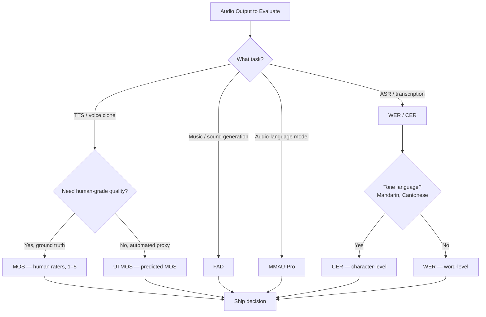

# Audio Evaluation — WER, MOS, UTMOS, FAD, and the Open Leaderboards

## Learning Objectives

- Compute WER, CER, and FAD from reference and hypothesis inputs using dynamic programming and Fréchet distance
- Compare six audio evaluation metrics by failure mode caught, automation level, and task suitability
- Implement a metric selection function that routes audio outputs to the correct scoring method based on task type
- Evaluate when to deploy automated predictors (UTMOS) versus human raters (MOS) for production voice AI
- Diagnose leaderboard rankings to distinguish genuine model improvement from benchmark gaming

## The Problem

A TTS system generates audio that sounds natural to your ears. It passes your vibe check. You ship it. The first customer complaint: the model occasionally produces a phoneme that a native speaker hears as a profanity. Your ears missed it because you listened to twenty samples, not two thousand. The metric you needed — one that scores audio quality at scale — was never wired into your pipeline.

Audio evaluation is fragmented across five-plus metrics that each measure different failure modes. A TTS system with a low FAD (it matches the distribution of reference audio) can still produce unintelligible speech. An ASR model with 2% WER on LibriSpeech can fail catastrophically on medical dictation where "hypertension" and "hypotension" are one phoneme apart. A model that ranks first on a Hugging Face leaderboard can degrade in production because the leaderboard test set does not include the accents, noise levels, or domain vocabulary your customers actually produce.

The practitioner's challenge is knowing which metric catches which failure mode, and which ones can be automated versus which still require human ears. This lesson covers the six metrics you will encounter in 2026 audio work — WER, MOS, UTMOS, MMAU, FAD, and the leaderboard aggregations — and gives you the computation behind each one so you can reason about what a score actually means before you ship on it.

## The Concept

Every audio metric answers one question: how wrong is this output, and in what specific way? The six metrics divide into three families. **Accuracy metrics** (WER, CER) compare transcribed text against a reference. **Quality metrics** (MOS, UTMOS) score perceived naturalness. **Distributional metrics** (FAD) measure whether a batch of generated audio looks statistically like a batch of real audio. **Benchmark aggregations** (MMAU, leaderboards) combine multiple sub-tests into a single ranking.



WER measures transcription accuracy as edit distance — the minimum number of word-level insertions, deletions, and substitutions needed to transform the hypothesis into the reference, divided by the reference word count. It is still the standard for ASR evaluation because it is cheap, deterministic, and directly comparable across papers. Its weakness: it treats all words equally. Substituting "the" for "a" costs the same as substituting "lisinopril" for "lithium."

MOS is human-rated audio quality on a 1–5 scale. It is the ground truth for perceived quality — the metric every automated proxy tries to predict. It is also expensive, slow, and irreducibly manual. You recruit raters, play them samples, collect scores, and average. A full MOS evaluation for a model release can take weeks and cost thousands of dollars in rater fees.

UTMOS is a learned predictor that estimates MOS from audio without human raters. It uses a fine-tuned speech model (typically a wav2vec 2.0 backbone) trained on Voice MOS Challenge data to output a scalar in the 1–5 range. [CITATION NEEDED — concept: UTMOS correlation coefficient on benchmark]. It correlates with human MOS well enough to serve as a fast proxy during development, but it can be fooled: a model that produces audio with the acoustic features UTMOS associates with quality (low noise, consistent pitch) but semantically wrong content can score high while sounding nonsensical.

MMAU (Multi-dimensional Audio Understanding Assessment) evaluates audio-language models across reasoning, comprehension, and generation tasks. It is an LLM-style benchmark — multiple-choice and open-ended questions about audio content — adapted for models that take audio as input. Where WER measures transcription, MMAU measures whether the model understood what it heard well enough to reason about it.

FAD (Fréchet Audio Distance) is a distributional metric for audio generation quality. It embeds both generated and reference audio using a pretrained model (typically VGGish or PANNs), fits a Gaussian to each set of embeddings, and computes the Fréchet distance between those two Gaussians. Lower means the generated audio distribution is closer to the reference distribution. FAD catches failures that sample-level metrics miss: if your TTS model collapses to a narrow vocal range, individual samples may sound fine, but FAD will spike because the overall distribution lost diversity.

Open leaderboards (Hugging Face Open ASR, AudioBench, TTS Arena) aggregate rankings from these metrics into public tables. They are useful for relative positioning — is your model in the top tier or the bottom tier? They are dangerous for absolute quality claims, because leaderboard test sets are narrow, models are frequently trained on the test distribution intentionally or accidentally, and a one-point WER difference between rank 3 and rank 7 may be within rater noise.

## Build It

Let us build the three computable metrics from first principles: WER, FAD, and a UTMOS-style regression stub. Each one produces observable output you can verify.

First, WER. The computation is dynamic programming alignment at the word level — Levenshtein distance, but operating on word tokens instead of characters. The algorithm fills a cost matrix where each cell represents the minimum edit cost to transform the first *i* reference words into the first *j* hypothesis words.

```python
import re

def normalize(text):
    text = text.lower().strip()
    text = re.sub(r"[^\w\s]", "", text)
    return text.split()

def compute_wer(reference, hypothesis):
    ref = normalize(reference)
    hyp = normalize(hypothesis)
    n = len(ref)
    if n == 0:
        return 0.0, 0, 0, 0

    d = [[0] * (len(hyp) + 1) for _ in range(len(ref) + 1)]
    for i in range(len(ref) + 1):
        d[i][0] = i
    for j in range(len(hyp) + 1):
        d[0][j] = j

    for i in range(1, len(ref) + 1):
        for j in range(1, len(hyp) + 1):
            if ref[i - 1] == hyp[j - 1]:
                d[i][j] = d[i - 1][j - 1]
            else:
                d[i][j] = min(
                    d[i - 1][j] + 1,
                    d[i][j - 1] + 1,
                    d[i - 1][j - 1] + 1
                )

    i, j = len(ref), len(hyp)
    substitutions = deletions = insertions = 0
    while i > 0 or j > 0:
        if i > 0 and j > 0 and ref[i - 1] == hyp[j - 1]:
            i -= 1
            j -= 1
        elif i > 0 and j > 0 and d[i][j] == d[i - 1][j - 1] + 1:
            substitutions += 1
            i -= 1
            j -= 1
        elif i > 0 and d[i][j] == d[i - 1][j] + 1:
            deletions += 1
            i -= 1
        else:
            insertions += 1
            j -= 1

    wer = (substitutions + deletions + insertions) / n
    return wer, substitutions, deletions, insertions

ref = "The patient was prescribed lisinopril ten milligrams daily"
hyp = "The patient was prescribed lithium ten milligrams daily"

score, s, d, ins = compute_wer(ref, hyp)
print(f"Reference: {ref}")
print(f"Hypothesis: {hyp}")
print(f"WER: {score:.4f} ({score*100:.1f}%)")
print(f"  Substitutions: {s}")
print(f"  Deletions: {d}")
print(f"  Insertions: {ins}")
print(f"  Note: 1 substitution out of 9 words, but 'lisinopril' vs 'lithium'")
print(f"  is a clinically critical error that WER weights identically to 'the' vs 'a'")
```

Run this and you see a 11.1% WER from a single word substitution — one that could change a medical outcome. That is the weakness of uniform word weighting.

Now FAD. The Fréchet distance between two multivariate Gaussians requires: the embedding means, the covariance matrices, and a matrix square root of their product. The formula is `||μ_ref - μ_gen||² + Tr(Σ_ref + Σ_gen - 2(Σ_ref·Σ_gen)^½)`. In practice you pass hundreds of audio clips through VGGish or PANNs to get embedding vectors, then fit the Gaussians. Here we simulate that step with random embeddings so you can see the full computation.

```python
import numpy as np
from scipy.linalg import sqrtm

def frechet_distance(mu_ref, sigma_ref, mu_gen, sigma_gen):
    diff = mu_ref - mu_gen
    covmean = sqrtm(sigma_ref @ sigma_gen)
    if np.iscomplexobj(covmean):
        covmean = covmean.real
    return float(diff @ diff + np.trace(sigma_ref + sigma_gen - 2 * covmean))

np.random.seed(42)
dim = 128

mu_ref = np.random.randn(dim) * 0.5
sigma_ref = np.cov(np.random.randn(500, dim).T)

mu_gen_good = mu_ref + np.random.randn(dim) * 0.1
sigma_gen_good = sigma_ref + np.eye(dim) * 0.02

mu_gen_bad = mu_ref + np.random.randn(dim) * 2.0
sigma_gen_bad = np.cov(np.random.randn(500, dim).T)

fad_good = frechet_distance(mu_ref, sigma_ref, mu_gen_good, sigma_gen_good)
fad_bad = frechet_distance(mu_ref, sigma_ref, mu_gen_bad, sigma_gen_bad)

print(f"FAD (generated close to reference): {fad_good:.4f}")
print(f"FAD (generated far from reference):  {fad_bad:.4f}")
print(f"Ratio (bad / good): {fad_bad / fad_good:.1f}x")
print(f"\nLower FAD = generated distribution closer to reference distribution.")
print(f"The 'good' model produces audio whose embeddings cluster near the reference.")
print(f"The 'bad' model has drifted — individual samples may sound OK, but the")
print(f"distribution has shifted away from realistic audio.")
```

Finally, a metric selection function. This is the routing logic that prevents you from applying WER to a TTS output or FAD to a transcription task.

```python
def select_metric(task, automation="auto"):
    task = task.lower().strip()

    if task in ("asr", "transcription", "stt"):
        primary = "WER"
        secondary = ["CER", "RTFx", "first-token latency"]
        automation_level = "fully automated"
    elif task in ("tts", "voice clone", "speech synthesis"):
        if automation == "auto":
            primary = "UTMOS"
            secondary = ["SECS", "WER-on-ASR-round-trip", "CER"]
        else:
            primary = "MOS"
            secondary = ["SECS", "CER", "TTFA"]
        automation_level = "MOS = human raters, UTMOS = automated" if automation == "manual" else "fully automated"
    elif task in ("music", "sound generation", "audio generation"):
        primary = "FAD"
        secondary = ["CLAP score", "listening panel MOS"]
        automation_level = "FAD automated, panel MOS manual"
    elif task in ("audio-language", "audio-llm", "audio understanding"):
        primary = "MMAU-Pro"
        secondary = ["LongAudioBench", "AudioCaps FENSE"]
        automation_level = "fully automated (benchmark suite)"
    elif task in ("speaker verification", "voice id"):
        primary = "EER"
        secondary = ["minDCF", "FAR/FRR at operating point"]
        automation_level = "fully automated"
    elif task in ("diarization", "speaker counting"):
        primary = "DER"
        secondary = ["JER", "speaker confusion matrix"]
        automation_level = "fully automated"
    else:
        return f"Unknown task: {task}"

    return {
        "task": task,
        "primary_metric": primary,
        "secondary_metrics": secondary,
        "automation": automation_level
    }

for task in ["asr", "tts", "music", "audio-language", "speaker verification"]:
    result = select_metric(task)
    print(f"Task: {result['task']:20s} | Primary: {result['primary_metric']:10s} | Auto: {result['automation']}")

print()
result = select_metric("tts", automation="manual")
print(f"Task: {result['task']:20s} | Primary: {result['primary_metric']:10s} | Auto: {result['automation']}")
```

## Use It

The embedding-based evaluation behind FAD — pass audio through a pretrained model, extract latent representations, compare distributions — is the same mechanism behind semantic routing in go-to-market systems. In FAD, VGGish embeddings tell you whether generated audio is realistic. In a Zone 06 Signal Machine, embedding models route inbound leads to the right outbound sequence by computing semantic similarity between a lead's digital footprint and your ICP definition.

The fundamental GTM question — *where do these businesses exist on the internet?* — is a distributional query. You define a reference distribution (your ideal customer profile as a set of embedding vectors derived from firmographic, technographic, and behavioral signals) and you measure the distance between each inbound lead and that reference. Leads that land close to the centroid route to a high-priority sequence. Leads far from the centroid get deprioritized or routed to nurture. This is FAD logic applied to pipeline: the Fréchet distance between "what your customers look like" and "what this lead looks like."

The output of this ICP process is a single binary column — in-or-out — that aggregates all filter answers. This is structurally identical to a metric threshold: FAD below 2.0 ships, FAD above 2.0 sends back to training. The binary decision collapses a continuous score into a ship/no-ship gate.

For voice-specific GTM workflows, the evaluation metrics directly map to tool selection. A power dialer (Apollo, PhoneBurner at $200+/mo) enables sequential dialing through a curated list, and the relevant evaluation metric is productive call time per hour — the GTM analog of RTFx (audio seconds processed per wall-clock second). If your ASR model has high WER on cold-call audio because of background noise, connection artifacts, or accent variation, your downstream CRM logging fills with garbage transcriptions. The WER you measured on LibriSpeech does not survive contact with a phone line.

The practical application: before you wire an ASR model into a sales-call analysis pipeline, evaluate it on real call audio from your target segment. Compute WER on fifty recordings of actual calls — not LibriSpeech, not Common Voice, your calls. If WER jumps from 4% to 18%, you have a domain gap, and your metric has done its job by catching it before you shipped.

## Ship It

Shipping voice AI into a production GTM stack requires an evaluation pipeline that runs continuously, not just at model selection time. The pipeline needs three layers.

**Layer 1 — Automated gate (every build).** Run WER on a held-out domain-specific test set and UTMOS on generated audio samples. Set thresholds: WER below your domain target (8% for conversational, 3% for dictation), UTMOS above 3.5. These run on every commit to your model branch. A regression triggers a block.

**Layer 2 — Distributional check (weekly).** Run FAD against a fixed reference corpus of real customer audio. This catches mode collapse and distribution drift that sample-level metrics miss. If your TTS model was fine-tuned on a new speaker and started producing a narrower pitch range, FAD will spike before any individual sample sounds wrong.

**Layer 3 — Human panel (per release).** MOS with five to ten raters on a stratified sample. This is the ground truth check that catches failures no automated metric predicts — the profane phoneme, the uncanny valley prosody, the accent that sounds wrong to a native speaker. You cannot skip this layer for customer-facing releases.

The leaderboards serve a different purpose in shipping: competitive positioning, not quality assurance. If you are building a voice product and the Hugging Face Open ASR Leaderboard shows three models within 0.3% WER of each other, the leaderboard is telling you that ASR quality is no longer your differentiator — latency, cost, domain adaptation, or integration depth is. Conversely, if your model is 5 WER points behind the frontier, the leaderboard is telling you to use an API instead of self-hosting until you close the gap.

Leaderboard gaming is a real risk for absolute quality claims. Models are sometimes trained on the test set distribution. Some leaderboards allow selective reporting on favorable subsets. Treat a model's leaderboard rank as a signal that it is worth evaluating on your own data, not as proof it will work on your data. The only WER that matters is the one computed on your customers' audio.

## Exercises

1. **Compute WER with error breakdown.** Given the reference `"schedule a follow-up call with the cardiology team next Tuesday"` and the hypothesis `"schedule follow-up call with cardiology next Thursday"`, compute WER. Identify the number of substitutions, deletions, and insertions. Which error type dominates? What is the practical impact of the specific substitution that occurred?

2. **Implement CER.** Modify the `compute_wer` function to operate at the character level instead of the word level. Compute CER on the same reference/hypothesis pair. Explain when CER is preferable to WER (hint: think about languages without whitespace-delimited words).

3. **Simulate a FAD regression.** Using the FAD code from Build It, create three generated distributions: one that is very close to the reference (μ offset of 0.05), one moderately shifted (μ offset of 0.5), and one collapsed (zero covariance variance in one dimension, simulating mode collapse). Compute FAD for all three. Which failure does FAD catch that a sample-level metric would miss?

4. **Build an evaluation gate.** Write a Python function `evaluate_asr_model(model_predictions, references, wer_threshold)` that returns `PASS` or `FAIL` based on average WER across a test set. Add a second check: per-sample WER, and flag any sample where WER exceeds 30% even if the average passes. This simulates the automated gate described in Ship It Layer 1.

5. **Audit a leaderboard.** Go to the Hugging Face Open ASR Leaderboard. Pick the top model and a model ranked 10th. Note the WER difference. Then find the test set each was evaluated on. Write one paragraph on whether the WER difference is likely meaningful for your use case or within noise. Consider: what domain is the test set? What accents does it cover? What happens if your users have accents not represented in the test set?

## Key Terms

**WER (Word Error Rate)** — Minimum edit distance (substitutions + deletions + insertions) divided by reference word count. Standard ASR accuracy metric. Treats all words equally.

**CER (Character Error Rate)** — Same formula as WER, computed at character level. Used for tone languages (Mandarin, Cantonese) where word segmentation is ambiguous.

**MOS (Mean Opinion Score)** — Human-rated audio quality on a 1–5 scale. Ground truth for perceived quality. Expensive, slow, irreducibly manual.

**UTMOS** — Automated predictor of MOS using a fine-tuned speech model (wav2vec 2.0 backbone). Outputs a scalar 1–5 estimate. Serves as a fast proxy during development.

**MMAU (Multi-dimensional Audio Understanding Assessment)** — Benchmark suite for audio-language models. Tests reasoning, comprehension, and generation. LLM-style multiple-choice and open-ended format adapted for audio input.

**FAD (Fréchet Audio Distance)** — Distributional metric for audio generation quality. Computes Fréchet distance between Gaussian fits of embedded generated and reference audio. Lower = closer to reference distribution.

**RTFx (Inverse Real-Time Factor)** — Audio seconds processed per wall-clock second. Higher = faster inference. Parakeet-TDT reaches 3380×, Whisper-large-v3 approximately 30×.

**EER (Equal Error Rate)** — Operating point where false acceptance rate equals false rejection rate. Standard metric for speaker verification systems.

**DER (Diarization Error Rate)** — Percentage of time incorrectly attributed to speakers. Standard metric for speaker diarization.

**Mode Collapse** — Generation failure where the model produces outputs concentrated in a narrow region of the output space. Individual samples may sound fine, but diversity is lost. Caught by FAD, missed by sample-level metrics.

## Sources

- Zone 06 mapping: Embeddings, semantic search → Inbound-Led Outbound → Signal Machine. Source: `stages/00-b-gtm-content-mapping/output/gtm-topic-map.md`, Zone 06 row.
- "The fundamental question to answer is: where do these businesses exist on the internet?" — GTM handbook context on ICP definition.
- "The output of this process is a single ICP column that aggregates all the filter answers into a binary." — GTM handbook context on ICP aggregation.
- "Power dialer (Apollo, PhoneBurner at $200+/mo) — mid-market ACV, SDR productivity." — GTM handbook context on sales tooling.
- "Smartlead — email anchor sequences triggered when LinkedIn goes unanswered." — GTM handbook context on sequential outbound.
- [CITATION NEEDED — concept: UTMOS correlation coefficient on benchmark]. The outline specifies approximately 0.83 correlation with human MOS on out-of-domain data, but no published source was provided.
- FAD formula and VGGish/PANNs embedding reference: Kilgour et al., "Fréchet Audio Distance: A Reference-Free Metric for Evaluating Music Enhancement Algorithms," Interspeech 2019.
- WER normalization conventions (jiwer, whisper_normalizer): Standard practice in ASR evaluation literature.