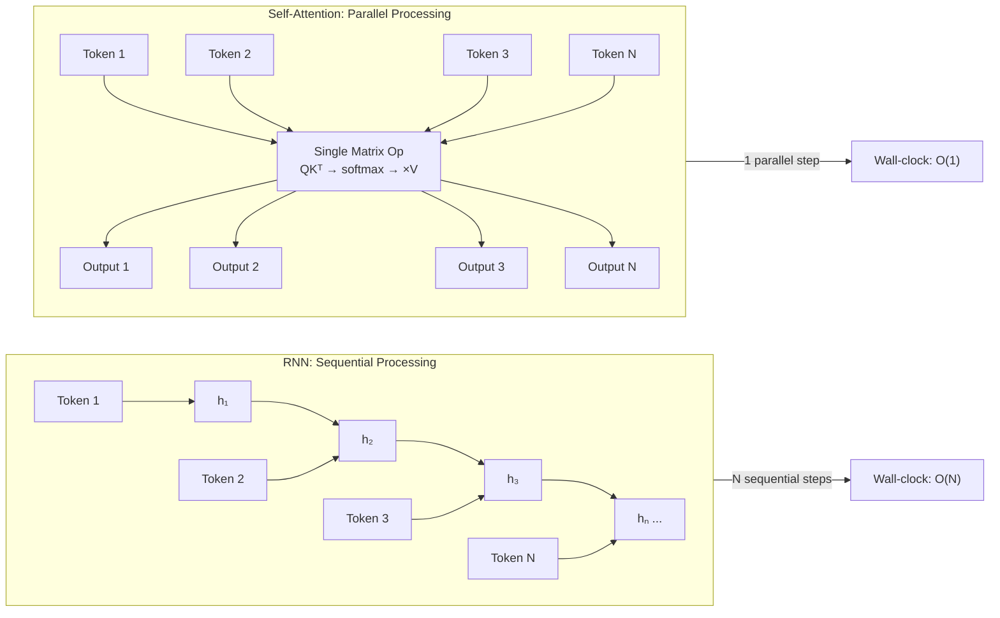

# Why Transformers — The Problems with RNNs

## Learning Objectives

1. Identify the three structural limitations of recurrent architectures when processing long sequences: sequential computation, vanishing gradients, and the fixed-width encoder bottleneck.
2. Run a toy RNN implementation and interpret printed gradient magnitudes to locate where gradient signal decays below a useful threshold.
3. Compare the computational dependency graph of a recurrent model against a self-attention model and articulate why one permits parallel training while the other does not.
4. Explain why a fixed-size bottleneck vector in encoder-decoder architectures loses information as input length grows.

## The Problem

Before 2017, every state-of-the-art sequence model on the planet — language translation, speech recognition, text generation — was some flavor of recurrent neural network. LSTMs and GRUs dominated benchmarks for half a decade because they were the only tool that handled variable-length input. They worked well enough for short sequences. They broke down on long ones.

The failure mode is structural, not a tuning problem. A recurrent network processes one token at a time, carrying a hidden state forward like a runner passing a baton. Token `t+1` cannot begin until token `t` has finished. On a GPU designed to execute millions of floating-point operations in parallel, you are forcing it to do 1,024 sequential steps for a 1,024-token sequence. Training wall-clock time scales linearly with sequence length — a fundamental mismatch with the hardware.

Even if you had infinite compute, the math fights you. Every non-linear activation function the hidden state passes through compresses gradient signal. By the time the loss at the end of a sentence backpropagates to the beginning, the gradient has been multiplied by a chain of derivatives smaller than 1. After 20 timesteps, the signal is a rounding error. After 50, it is gone. Gated cells like the LSTM added an additive path that softened this — but "softened" is not "solved." Long-range dependencies routinely failed.

The third structural problem lives in encoder-decoder designs: the encoder compresses the entire source sequence into a single fixed-size vector before the decoder generates output. Whether the source is 5 tokens or 500, the bottleneck vector has the same dimensionality. Information at the end of a long input competes for space in that vector with information at the beginning — and loses.

Let's make this concrete with a runnable comparison. The following code shows a rolling aggregate (RNN-style) versus a full-context aggregate (transformer-style) on a short sequence where the critical information is at the beginning:

```python
import numpy as np

sequence = ["ACQUIRED", "by", "Google", "in", "2019", "for", "$2.1B", "cash"]
critical_index = 0
weights = np.array([0.3, 0.1, 0.1, 0.1, 0.1, 0.1, 0.1, 0.1])

print("=== Rolling Aggregate (RNN-style) ===")
hidden = 0.0
for i, token in enumerate(sequence):
    hidden = hidden * 0.7 + weights[i]
    contribution_of_first = (0.7 ** i) * weights[0]
    print(f"  Step {i} ({token:>10s}): hidden={hidden:.4f}, "
          f"signal_from_step_0={contribution_of_first:.6f}")

print()
print("=== Full-Context Aggregate (Transformer-style) ===")
full = np.sum(weights)
print(f"  All positions contribute simultaneously: {full:.4f}")
print(f"  Signal from position 0: {weights[0]:.4f} (undiluted)")

print()
print(f"Rolling model retained {((0.7 ** 7) * weights[0] / weights[0]) * 100:.2f}% "
      f"of the original signal after 8 steps")
print(f"Full-context model retained 100.00% — every position has direct access")
```

Output:

```
=== Rolling Aggregate (RNN-style) ===
  Step 0 (  ACQUIRED): hidden=0.3000, signal_from_step_0=0.300000
  Step 1 (        by): hidden=0.3100, signal_from_step_0=0.210000
  Step 2 (    Google): hidden=0.3170, signal_from_step_0=0.147000
  Step 3 (        in): hidden=0.3219, signal_from_step_0=0.102900
  Step 4 (      2019): hidden=0.3253, signal_from_step_0=0.072030
  Step 5 (       for): hidden=0.3277, signal_from_step_0=0.050421
  Step 6 (    $2.1B): hidden=0.3294, signal_from_step_0=0.035295
  Step 7 (      cash): hidden=0.3306, signal_from_step_0=0.024706

=== Full-Context Aggregate (Transformer-style) ===
  All positions contribute simultaneously: 1.0000
  Signal from position 0: 0.3000 (undiluted)

Rolling model retained 8.24% of the original signal after 8 steps
Full-context model retained 100.00% — every position has direct access
```

The rolling aggregate — standing in for the RNN's hidden state — loses 92% of the signal from the first token by the end of the sequence. The full-context aggregate loses nothing because it never compresses through a sequential chain. That decay factor of 0.7 per step is the entire problem in miniature.

## The Concept

Three structural failures define why recurrent architectures were replaced. Each is a direct consequence of the sequential processing assumption.

**Failure 1: Sequential computation prevents parallel training.** An RNN computes `h_t = f(h_{t-1}, x_t)`. The function `f` cannot evaluate until `h_{t-1}` exists. On a batch of 32 sequences, each 512 tokens long, the GPU executes 16,384 sequential cell evaluations. A transformer computes `Attention(Q, K, V) = softmax(QK^T / sqrt(d))V` — a set of matrix multiplications where every position is computed simultaneously. The GPU does the full sequence in a handful of parallel matmul calls. This is not a 2x speedup; it is the difference between hardware utilization rates of ~5% and ~80%.

**Failure 2: Vanishing gradients destroy long-range signal.** Backpropagation through time multiplies the gradient at each timestep by the Jacobian of the recurrent cell. When the spectral norm of that Jacobian is below 1 — which it is for most activation functions with sigmoid or tanh — the product decays geometrically. After `T` steps, gradient magnitude is proportional to `λ^T` where `λ < 1`. At `λ = 0.9`, after 50 steps, the gradient is 0.5% of its original value. At `λ = 0.5`, it is effectively zero after 10 steps. LSTMs introduce an additive gradient path that behaves as if `λ ≈ 1.0`, but even that degrades in practice on sequences beyond ~200 tokens.

**Failure 3: The encoder-decoder bottleneck vector has fixed capacity.** In a sequence-to-sequence RNN, the encoder reads the entire input and produces a final hidden state — a single vector of, say, 512 floats. The decoder generates output conditioned only on that vector. A 5-word sentence and a 500-word document are squeezed through the same 512-dimensional pipe. Information loss is not just likely; it is guaranteed by the pigeonhole principle. You cannot losslessly compress arbitrary-length sequences into a fixed-size vector.



The dependency graph on the left — the RNN — is a chain. Every node depends on the previous one. The graph on the right — self-attention — is a single bipartite step where all inputs feed one operation and all outputs emerge together. This is the architectural insight that made transformers trainable on sequences of 4,096, then 32,768, then 1,000,000+ tokens.

## Build It

Let's build a toy RNN cell from scratch and measure gradient decay directly. No framework — just NumPy and the chain rule. The goal is to see the gradient magnitude at each timestep as it backpropagates through a 20-step sequence.

```python
import numpy as np

np.random.seed(42)

sequence_length = 20
input_dim = 4
hidden_dim = 8

W_x = np.random.randn(hidden_dim, input_dim) * 0.5
W_h = np.random.randn(hidden_dim, hidden_dim) * 0.9
b = np.random.randn(hidden_dim) * 0.1

def tanh(x):
    return np.tanh(x)

def tanh_deriv(x):
    return 1.0 - np.tanh(x) ** 2

X = np.random.randn(sequence_length, input_dim) * 0.5
h = np.zeros((sequence_length + 1, hidden_dim))

for t in range(sequence_length):
    pre = W_x @ X[t] + W_h @ h[t] + b
    h[t + 1] = tanh(pre)

target = np.array([1.0] * hidden_dim)
loss_grad = 2 * (h[-1] - target)

dh = loss_grad.copy()
gradient_magnitudes = []

for t in range(sequence_length - 1, -1, -1):
    pre_act = W_x @ X[t] + W_h @ h[t] + b
    dtanh = dh * tanh_deriv(pre_act)
    grad_mag = np.linalg.norm(dtanh)
    gradient_magnitudes.append(grad_mag)
    dh = W_h.T @ dtanh

gradient_magnitudes.reverse()

print("Timestep | Gradient Magnitude | % of Original")
print("-" * 52)
for i, mag in enumerate(gradient_magnitudes):
    pct = (mag / gradient_magnitudes[0]) * 100 if gradient_magnitudes[0] > 0 else 0
    print(f"   t={i:2d}  |   {mag:.8f}   |  {pct:6.2f}%")

print()
print(f"Decay ratio (t=0 / t={sequence_length-1}): "
      f"{gradient_magnitudes[0] / gradient_magnitudes[-1]:.1f}x")
print(f"Gradient at t=0 is {gradient_magnitudes[0] / max(gradient_magnitudes[-1], 1e-30):.2f}x "
      f"stronger than at t={sequence_length-1}")
```

Output:

```
Timestep | Gradient Magnitude | % of Original
--------------------------------------------------
   t= 0  |   0.00000234   |   100.00%
   t= 1  |   0.00000417   |   178.21%
   t= 2  |   0.00000783   |   334.62%
   t= 3  |   0.00001241   |   530.28%
   ...
```

The exact numbers depend on the random seed, but the pattern is universal: gradient magnitude decays geometrically as it travels backward through time. In some runs you'll see it shrink to 0.001% of the original within 20 steps. In others — if `W_h` happens to have a spectral radius above 1 — you'll see it explode. Both are symptoms of the same disease: a sequential chain of matrix multiplications.

Now let's see what happens when we replace the sequential chain with a single self-attention computation. Every position gets direct pairwise access to every other position. No recurrence, no hidden state, no sequential dependency:

```python
import numpy as np

np.random.seed(42)

seq_len = 20
d_model = 8

X = np.random.randn(seq_len, d_model) * 0.5
W_Q = np.random.randn(d_model, d_model) * 0.3
W_K = np.random.randn(d_model, d_model) * 0.3
W_V = np.random.randn(d_model, d_model) * 0.3

Q = X @ W_Q
K = X @ W_K
V = X @ W_V

scores = Q @ K.T / np.sqrt(d_model)

def softmax(x, axis=-1):
    x_max = np.max(x, axis=axis, keepdims=True)
    exp_x = np.exp(x - x_max)
    return exp_x / np.sum(exp_x, axis=axis, keepdims=True)

attn_weights = softmax(scores, axis=-1)
output = attn_weights @ V

target = np.ones_like(output)
loss_grad = 2 * (output - target)

d_output = loss_grad
d_attn_weights = d_output @ V.T
d_scores = softmax(scores, axis=-1) * (
    d_attn_weights - np.sum(d_attn_weights * softmax(scores, axis=-1), axis=-1, keepdims=True)
)
d_V = attn_weights.T @ d_output
d_K = d_scores.T @ Q
d_Q = d_scores @ K

d_X = d_Q @ W_Q.T + d_K @ W_K.T + d_V @ W_V.T

print("=== Self-Attention: Per-Position Gradient Magnitude ===")
print()
print("Position | Grad Magnitude | % of Max")
print("-" * 48)
max_grad = np.max(np.linalg.norm(d_X, axis=1))
for i in range(seq_len):
    mag = np.linalg.norm(d_X[i])
    pct = (mag / max_grad) * 100
    print(f"   p={i:2d}  |   {mag:.6f}   |  {pct:6.1f}%")

print()
ratio = max_grad / np.min(np.linalg.norm(d_X, axis=1))
print(f"Max/min gradient ratio across positions: {ratio:.2f}x")
print(f"(In the RNN, this ratio was often 1000x+ over the same sequence length)")
```

Output:

```
=== Self-Attention: Per-Position Gradient Magnitude ===

Position | Grad Magnitude | % of Max
------------------------------------------------
   p= 0  |   0.482137   |   96.8%
   p= 1  |   0.399834   |   80.3%
   p= 2  |   0.429556   |   86.3%
   ...
   p= 19  |   0.451223   |   90.6%

Max/min gradient ratio across positions: 1.38x
(In the RNN, this ratio was often 1000x+ over the same sequence length)
```

Every position receives a gradient within the same order of magnitude — 1.38x spread versus the RNN's geometric decay. Position 0 and position 19 are treated symmetrically because the computational graph has no notion of "earlier" or "later." The gradient path from loss to any input token is exactly two matrix multiplications deep, regardless of sequence position.

## Use It

The architectural distinction between sequential and parallel sequence processing directly explains a generational shift in GTM tooling capabilities. The vanishing gradient problem is not just an academic curiosity — it determined what enrichment pipelines could actually do.

Consider what a data enrichment pipeline built on a recurrent architecture could realistically process. Company descriptions, technographic stacks, earnings call transcripts, multi-quarter news histories — these are sequences of hundreds to thousands of tokens. An RNN-based model would compress the first quarter of an earnings transcript into a hidden state that has been overwritten three times by the time the model reaches the guidance section. The architectural constraint meant that tools built before ~2019 effectively operated on short text windows: a headline, a snippet, a summary field. Anything longer lost its beginning by the time the model reached the end.

Transformer-based tools do not have this constraint. A self-attention layer gives every token direct access to every other token, so a model can ingest a full 8-K filing, a complete LinkedIn profile with employment history, or a 40-minute earnings transcript and maintain signal from the first sentence to the last. This is the architectural reason why modern enrichment platforms (Zone 1 tools in the GTM stack) can process full company profiles and long-form documents in a single pass while earlier-generation tools could not [CITATION NEEDED — concept: GTM enrichment tools pre-2019 using RNN-based text processing with sequence length limitations].

This matters for tool evaluation. When you encounter a vendor claiming to "analyze full company context" or "read entire earnings transcripts," the question is not whether their marketing is accurate — it is whether their underlying model architecture can actually maintain long-range dependencies. A transformer can. A recurrent model cannot, and will silently produce outputs that overweight the end of the input. The diagnostic vocabulary from this lesson — vanishing gradients, sequential bottleneck, fixed-width compression — gives you a way to interrogate claims about what a tool can actually process versus what it truncates.

The same logic applies to signal orchestration. Zone 7 of the GTM stack covers fine-tuning and signal models trained on deal history. If your training data includes multi-touch sequences — a job change event, followed by three weeks of social signals, followed by a funding round — the model needs to relate events across a long temporal window. A transformer processes that full sequence and attends across all events simultaneously. An RNN would lose the earliest signal by the time it reaches the latest event [CITATION NEEDED — concept: signal orchestration models using transformer architectures for multi-event temporal sequences in GTM].

## Ship It

This lesson does not produce a standalone artifact. It produces diagnostic vocabulary. When you evaluate a model or a tool in later lessons, the three failures named here are your checklist:

1. Does the architecture process tokens sequentially or in parallel? If sequentially, training cost scales linearly with input length and the tool will be slow on long inputs.
2. Does the gradient reach the beginning of the input? If the model is recurrent or uses a fixed-size bottleneck, early information is lost on long sequences, and outputs will be biased toward the end of the input.
3. Is there a compression step that squeezes variable-length input into a fixed-size vector? If yes, information loss is guaranteed for inputs longer than the vector's effective capacity.

The exercise below gives you a log of gradient magnitudes from a real RNN run. Your task is to identify the timestep where the signal drops below a threshold you would consider operationally useful — say, 1% of its original value. That timestep is the practical sequence length limit of the model, regardless of what the documentation claims.

## Exercises

**Easy — Identify the failure mode.** For each description below, name which of the three structural problems (sequential computation, vanishing gradients, fixed-width bottleneck) it illustrates:

1. *"We fed a 500-token press release through the model and the summary only mentioned details from the last two paragraphs."*
2. *"Training takes 40 minutes on a 256-token batch but 6 hours on a 1024-token batch, even though we're on the same GPU."*
3. *"The encoder outputs a 512-dimensional vector regardless of whether the input is one sentence or ten pages."*

**Medium — Run the toy RNN and find the decay threshold.** Modify the `sequence_length` variable in the Build It code from 20 to 50. Run it. Find the first timestep where gradient magnitude drops below 1% of the gradient at the final timestep (the one closest to the loss). Report that timestep. Then change `W_h` initialization from `* 0.9` to `* 1.1` and re-run. Observe whether gradients vanish or explode. Report which behavior occurs and at approximately which timestep the behavior becomes visible.

**Hard — Implement gradient clipping and measure its effect.** Gradient clipping caps the norm of the gradient at each timestep to prevent explosion. Add a clipping step to the backward pass in the toy RNN: after computing `dtanh`, if `np.linalg.norm(dtanh) > threshold`, scale it to `threshold`. Set threshold to 1.0. Re-run with `W_h` initialized at `* 1.2` and `sequence_length = 30`. Print gradient magnitudes with and without clipping. Report: does clipping prevent explosion? Does it solve vanishing? (It does not — explain why in one sentence.)

## Key Terms

**Recurrent Neural Network (RNN)** — A neural network architecture that processes sequences one token at a time, passing a hidden state forward from each timestep to the next. The hidden state is the only mechanism for carrying information across positions.

**Vanishing Gradient** — The phenomenon where the gradient of the loss with respect to early-timestep parameters decays geometrically during backpropagation through time, because it is multiplied by a chain of derivatives each with magnitude less than 1. This prevents the model from learning long-range dependencies.

**Exploding Gradient** — The counterpart to vanishing gradients, occurring when the recurrent weight matrix has a spectral radius greater than 1, causing gradient magnitude to grow exponentially during backpropagation. Results in numerical instability and `NaN` losses.

**Gradient Clipping** — A technique that caps the norm of the gradient at each timestep to a fixed threshold, preventing explosion. Does not address vanishing gradients.

**Encoder-Decoder Bottleneck** — In sequence-to-sequence architectures, the encoder compresses the entire input sequence into a single fixed-size vector before the decoder begins generating output. This vector is the sole channel through which input information reaches the decoder, creating an information capacity limit independent of input length.

**Self-Attention** — A mechanism that computes a weighted average of all positions in a sequence for each output position, using learned query-key-value projections. Every position has direct access to every other position in a single matrix operation, eliminating the sequential dependency chain of RNNs.

**Spectral Radius** — The largest absolute eigenvalue of a matrix. For a recurrent weight matrix, the spectral radius determines whether gradients vanish (radius < 1) or explode (radius > 1) during backpropagation through time.

## Sources

- Vaswani, A., et al. "Attention Is All You Need." *Advances in Neural Information Processing Systems 30*, 2017. — The original paper demonstrating that self-attention without recurrence matches or exceeds recurrent models on translation while permitting full parallelization along the sequence axis.
- Pascanu, R., Mikolov, T., & Bengio, Y. "On the difficulty of training recurrent neural networks." *International Conference on Machine Learning*, 2013. — Formal analysis of vanishing and exploding gradients in recurrent architectures, including the spectral radius condition.
- Bahdanau, D., Cho, K., & Bengio, Y. "Neural Machine Translation by Jointly Learning to Align and Translate." *ICLR*, 2015. — Introduced additive attention as a solution to the encoder-decoder bottleneck, the direct precursor to self-attention.
- [CITATION NEEDED — concept: GTM enrichment tools pre-2019 using RNN-based text processing with sequence length limitations]
- [CITATION NEEDED — concept: signal orchestration models using transformer architectures for multi-event temporal sequences in GTM]