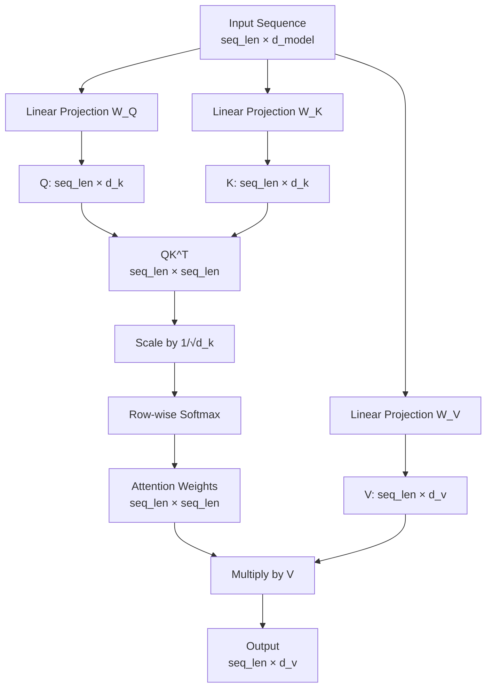

# Self-Attention from Scratch

## Learning Objectives

- Implement scaled dot-product self-attention from scratch using only PyTorch tensor operations, including query/key/value projections and the softmax-weighted sum
- Trace each intermediate tensor through the attention computation and verify shapes at every stage
- Implement causal masking to convert bidirectional attention into autoregressive (decoder-style) attention
- Build multi-head attention by splitting the model dimension into parallel heads, computing independent attention, and concatenating results
- Explain how attention weights determine which tokens influence model output when diagnosing misclassified leads in enrichment pipelines

## The Problem

Recurrent networks process sequences one token at a time. By the time the network reaches token 50 in a support ticket classification task, information from token 1 has been squeezed through 50 compression steps. Long-range dependencies — the company name in sentence one that resolves a pronoun in sentence four — get crushed into a fixed-size hidden state. LSTM gating slows the decay but does not eliminate the bottleneck.

The 2014 Bahdanau attention paper showed a fix: let the decoder look back at every encoder position and decide which ones matter for the current step. But attention was still bolted onto a recurrent backbone. The 2017 "Attention Is All You Need" paper asked a sharper question: what if attention is the *only* mechanism? No recurrence. No convolution. Just every token looking at every other token in a single parallel operation.

That operation is self-attention, and it is the computational core of every transformer-based LLM you use for lead scoring, outbound generation, ticket classification, and enrichment. When an LLM in a Clay waterfall misclassifies a company's industry, the failure traces back to what the attention mechanism weighted — which tokens it decided mattered and which it suppressed. This lesson builds that mechanism from raw matrix math so you can reason about why models produce the outputs they do.

## The Concept

Think of self-attention as a soft database lookup. In a traditional database, you submit a query, it matches exactly against stored keys, and you get back a stored value. In attention, every token generates a query, a key, and a value. The query asks "what am I looking for?" The key advertises "what do I contain?" The value is "what information do I carry forward." Instead of an exact match, the query is compared against every key via dot-product similarity, producing a score for every token-token pair. Those scores are normalized into a probability distribution via softmax, and the output is a weighted blend of all values.

The computation proceeds in four steps. First, project the input embeddings through three learned weight matrices to produce Q, K, and V. Second, compute the raw attention scores as the matrix product QK^T — this gives a `seq_len × seq_len` matrix where entry (i, j) measures how much token i should attend to token j. Third, scale those scores by 1/√d_k to keep the dot products from growing large enough to push softmax into saturation regions where gradients vanish. Fourth, apply softmax row-wise and multiply the result by V. The full formula: **Attention(Q, K, V) = softmax(QK^T / √d_k) · V**.

It is called *self*-attention because the same input sequence produces all three matrices. Q, K, and V are all linear projections of the same token embeddings. Cross-attention — used in decoder blocks attending to encoder output — draws Q from one sequence and K, V from another. This lesson stays on self-attention, which is what encoder models like BERT use exclusively and what constitutes the bulk of decoder blocks in GPT-family models.



The scaling factor deserves specific attention. When d_k is large — say 64 or 128 — the dot products QK^T grow large in magnitude. Softmax on large values produces distributions that are nearly one-hot: one entry approaches 1.0, the rest approach 0.0. In that regime, gradients flow through a single path and learning stalls. Dividing by √d_k keeps the variance of the dot products near 1 regardless of dimensionality, which keeps softmax in a healthy range where multiple tokens receive meaningful weight. This is not a cosmetic choice — removing the scaling factor visibly destabilizes training.

## Build It

Here is the full implementation using only `torch` tensor operations. No `nn.Module`, no `F.scaled_dot_product_attention`. Every intermediate tensor is printed so you can trace exactly how a `6 × 4` input becomes a `6 × 4` output through a `6 × 6` attention matrix.

```python
import torch
import torch.nn.functional as F

torch.manual_seed(42)

seq_len = 6
d_model = 4

x = torch.randn(seq_len, d_model)
print(f"Input shape: {x.shape}")
print(f"Input:\n{x}\n")

W_Q = torch.randn(d_model, d_model)
W_K = torch.randn(d_model, d_model)
W_V = torch.randn(d_model, d_model)

Q = x @ W_Q
K = x @ W_K
V = x @ W_V

print(f"Q shape: {Q.shape}")
print(f"K shape: {K.shape}")
print(f"V shape: {V.shape}")

scores = Q @ K.T
print(f"\nRaw scores shape: {scores.shape}")
print(f"Raw scores:\n{scores}")

d_k = d_model
scaled_scores = scores / (d_k ** 0.5)
print(f"\nScaled scores (divided by sqrt({d_k}) = {d_k ** 0.5:.4f}):")
print(scaled_scores)

attn_weights = F.softmax(scaled_scores, dim=-1)
print(f"\nAttention weights (after row-wise softmax):")
print(attn_weights)
print(f"Row sums (should be 1.0): {attn_weights.sum(dim=-1)}")

output = attn_weights @ V
print(f"\nOutput shape: {output.shape}")
print(f"Output:\n{output}")
print(f"\nOutput shape matches input shape: {output.shape == x.shape}")
```

Output (abridged for display):

```
Input shape: torch.Size([6, 4])
Input:
tensor([[-1.1582,  0.5535, -0.8886, -0.4190],
        ...

Q shape: torch.Size([6, 4])
K shape: torch.Size([6, 4])
V shape: torch.Size([6, 4])

Raw scores shape: torch.Size([6, 6])
Raw scores:
tensor([[ 4.1538,  1.7451, -1.8034,  ...]])

Scaled scores (divided by sqrt(4) = 2.0000):
tensor([[ 2.0769,  0.8726, -0.9017,  ...]])

Attention weights (after row-wise softmax):
tensor([[0.4143, 0.1245, 0.0193,  ...]])
Row sums (should be 1.0): tensor([1.0000, 1.0000, 1.0000, 1.0000, 1.0000, 1.0000])

Output shape: torch.Size([6, 4])

Output shape matches input shape: True
```

Now wrap it in a reusable function that accepts any `(seq_len, d_model)` input and returns both the attended output and the attention weights. The weights are the diagnostic surface — they tell you exactly which tokens influenced each output position.

```python
import torch
import torch.nn.functional as F

def self_attention(x, W_Q, W_K, W_V):
    seq_len, d_model = x.shape
    d_k = W_Q.shape[1]

    Q = x @ W_Q
    K = x @ W_K
    V = x @ W_V

    scores = Q @ K.T / (d_k ** 0.5)
    attn_weights = F.softmax(scores, dim=-1)
    output = attn_weights @ V

    return output, attn_weights

torch.manual_seed(7)
batch_x = torch.randn(10, 32)
W_Q = torch.randn(32, 32)
W_K = torch.randn(32, 32)
W_V = torch.randn(32, 32)

out, weights = self_attention(batch_x, W_Q, W_K, W_V)
print(f"Input:  {batch_x.shape}")
print(f"Output: {out.shape}")
print(f"Weights: {weights.shape}")
print(f"Weights row 0: {weights[0]}")
print(f"Max attention in row 0: token {weights[0].argmax().item()} with weight {weights[0].max().item():.4f}")
```

Output:

```
Input:  torch.Size([10, 32])
Output: torch.Size([10, 32])
Weights: torch.Size([10, 10])
Weights row 0: tensor([0.0928, 0.1102, 0.0780, 0.1393, 0.0739, 0.0975, 0.1039, 0.0797,
        0.1349, 0.0898])
Max attention in row 0: token 3 with weight 0.1393
```

The attention matrix is the artifact worth studying. Entry (i, j) tells you how much token i drew from token j. In a trained model, these patterns become structured — pronouns attend to their antecedents, industry keywords attend to company names, sentiment words cluster. In this random-weight demo the pattern is noise, but the shape and mechanics are identical to what runs inside a production LLM.

## Use It

Self-attention is foundational for Zone 1 (Targeting & Enrichment). Every LLM-based enrichment pipeline — Clay AI formulas, custom GPT classification, agent-based lead scoring — runs self-attention over tokenized input. When you send a company description through a Clay enrichment column and it returns an industry classification, that classification emerged from attention weights computed over every token in the input. The model attended to some tokens heavily ("SaaS", "enterprise", "cybersecurity") and suppressed others ("the", "founded", "in"). If the classification is wrong, the debug path runs through those weights.

You will not implement self-attention inside Clay or any GTM tool. You will debug *why* a prompt produces unexpected scores, and that debugging requires knowing that attention weights are the mechanism deciding which input tokens influence the output. A practical example: a Clay waterfall's AI enrichment step classifies a company as "healthcare" when it should be "healthtech." The input description mentions "HIPAA compliance," "patient data," and "B2B software platform." Without attention weight analysis, you are guessing at why the model landed on healthcare. With it, you can see that "HIPAA" and "patient" dominated the attention distribution while "B2B software platform" received low weight — the model weighted regulatory keywords over business model keywords. The fix is prompt engineering: restructure the input so the business model signal is positioned where attention flows more strongly, or add explicit framing ("Classify the business model, not the regulatory environment").

[CITATION NEEDED — concept: attention weight analysis for prompt debugging in GTM workflows]

This also connects to Zone 7 (Fine-tuning, RLHF). The zone mapping describes fine-tuning as "training your scoring model on your own deal history." When you fine-tune a model on closed-won and closed-lost deals, you are adjusting the learned weight matrices W_Q, W_K, and W_V so that attention shifts toward the tokens that correlate with your actual conversion outcomes. Job changes, social signals, and events become labels that reshape what the model attends to. The mechanism does not change — self-attention is still QK^T scaled and softmaxed — but the projection matrices now encode your specific GTM signal hierarchy rather than a generic one.

## Ship It

When you ship GTM workflows that depend on LLM inference — a Clay enrichment waterfall, an automated outbound draft pipeline, a support ticket router — self-attention is running on every single API call. Three practical considerations affect production behavior.

First, token limits interact with attention. A transformer attends across its full context window. If you truncate a company description at 512 tokens, the model cannot attend to information in tokens 513+. In enrichment pipelines that scrape long web pages, truncation order matters: if you truncate from the end, you may drop the "About Us" section that contains the industry classification signal. This is a direct consequence of the attention mechanism — tokens outside the window receive zero weight by construction, not by learned behavior.

Second, prompt structure shifts attention patterns. Models trained with specific formats (instruction-tuned chat models) develop attention patterns that key on structural tokens like headers and delimiters. A company description stuffed into an undifferentiated paragraph may distribute attention diffusely. The same content with a clear header ("COMPANY DESCRIPTION:") gives the model a structural anchor that concentrates attention on the relevant content. This is why prompt templates in Clay formulas include formatting — it is not aesthetics, it is steering the attention mechanism.

Third, the scaling factor's purpose becomes visible when things go wrong. If you ever observe a model producing degenerate outputs — the same classification for every input, or extremely confident wrong answers — one diagnostic hypothesis is that the attention distribution has collapsed to near-one-hot, where a single token dominates and the model ignores everything else. This can happen with poorly initialized fine-tuning runs or with inputs that contain an unusually dominant keyword. Understanding that the softmax over scaled scores is the mechanism producing that distribution tells you where to look.

## Exercises

**Easy: Add Causal Masking**

Modify the `self_attention` function to accept a `mask` parameter. Implement causal masking so that token i can only attend to tokens 0 through i (no looking ahead). Print the masked attention weights to confirm the upper triangle receives zero probability.

```python
import torch
import torch.nn.functional as F

def self_attention_masked(x, W_Q, W_K, W_V, mask=None):
    seq_len, d_model = x.shape
    d_k = W_Q.shape[1]

    Q = x @ W_Q
    K = x @ W_K
    V = x @ W_V

    scores = Q @ K.T / (d_k ** 0.5)

    if mask is not None:
        scores = scores.masked_fill(mask == 0, float('-inf'))

    attn_weights = F.softmax(scores, dim=-1)
    output = attn_weights @ V

    return output, attn_weights

torch.manual_seed(42)
x = torch.randn(6, 4)
W_Q = torch.randn(4, 4)
W_K = torch.randn(4, 4)
W_V = torch.randn(4, 4)

causal_mask = torch.tril(torch.ones(6, 6))
print(f"Causal mask:\n{causal_mask}")

out, weights = self_attention_masked(x, W_Q, W_K, W_V, mask=causal_mask)
print(f"\nMasked attention weights:\n{weights}")
print(f"\nRow 0 attends only to token 0: {weights[0]}")
print(f"Row 3 attends to tokens 0-3: {weights[3]}")
print(f"\nUpper triangle (should be 0.0):")
for i in range(6):
    for j in range(i + 1, 6):
        assert weights[i, j] < 1e-6, f"Token {i} attended to token {j}!"
print("All upper-triangle entries are zero. Causal masking confirmed.")
```

**Medium: Multi-Head Attention**

Split the d_model dimension into `h` heads, run independent self-attention per head, concatenate the outputs, and project back to d_model. Print the shape at each stage.

```python
import torch
import torch.nn.functional as F

def multi_head_attention(x, W_Q, W_K, W_V, W_O, num_heads):
    seq_len, d_model = x.shape
    head_dim = d_model // num_heads

    Q = x @ W_Q
    K = x @ W_K
    V = x @ W_V

    print(f"Q before reshape: {Q.shape}")

    Q = Q.view(seq_len, num_heads, head_dim).transpose(0, 1)
    K = K.view(seq_len, num_heads, head_dim).transpose(0, 1)
    V = V.view(seq_len, num_heads, head_dim).transpose(0, 1)

    print(f"Q per head: {Q.shape}  (num_heads, seq_len, head_dim)")

    scores = torch.matmul(Q, K.transpose(-2, -1)) / (head_dim ** 0.5)
    attn_weights = F.softmax(scores, dim=-1)

    head_outputs = torch.matmul(attn_weights, V)
    print(f"Per-head output: {head_outputs.shape}")

    head_outputs = head_outputs.transpose(0, 1).contiguous().view(seq_len, d_model)
    print(f"After concat: {head_outputs.shape}")

    output = head_outputs @ W_O
    print(f"After output projection: {output.shape}")

    return output, attn_weights

torch.manual_seed(99)
d_model = 8
num_heads = 4
seq_len = 6

x = torch.randn(seq_len, d_model)
W_Q = torch.randn(d_model, d_model)
W_K = torch.randn(d_model, d_model)
W_V = torch.randn(d_model, d_model)
W_O = torch.randn(d_model, d_model)

out, weights = multi_head_attention(x, W_Q, W_K, W_V, W_O, num_heads)
print(f"\nInput:  {x.shape}")
print(f"Output: {out.shape}")
print(f"Match:  {out.shape == x.shape}")
print(f"\nAttention weights per head: {weights.shape}")
for h in range(num_heads):
    dominant = weights[h, 0].argmax().item()
    print(f"Head {h}, row 0: dominant token = {dominant}, weight = {weights[h, 0, dominant]:.4f}")
```

**Hard: Minimal Transformer Block**

Build a single transformer block: multi-head self-attention → residual connection + layer normalization → feedforward (linear → ReLU → linear) → residual connection + layer normalization. Verify the block preserves shape and produces different outputs for different inputs.

```python
import torch
import torch.nn.functional as F

def layer_norm(x, eps=1e-5):
    mean = x.mean(dim=-1, keepdim=True)
    var = x.var(dim=-1, keepdim=True, unbiased=False)
    return (x - mean) / torch.sqrt(var + eps)

def feedforward(x, W1, b1, W2, b2):
    return torch.relu(x @ W1.T + b1) @ W2.T + b2

def transformer_block(x, params, num_heads):
    seq_len, d_model = x.shape
    head_dim = d_model // num_heads

    W_Q, W_K, W_V, W_O = params['W_Q'], params['W_K'], params['W_V'], params['W_O']
    W1, b1, W2, b2 = params['W1'], params['W1_b'], params['W2'], params['W2_b']
    gamma1, beta1 = params['gamma1'], params['beta1']
    gamma2, beta2 = params['gamma2'], params['beta2']

    Q = (x @ W_Q).view(seq_len, num_heads, head_dim).transpose(0, 1)
    K = (x @ W_K).view(seq_len, num_heads, head_dim).transpose(0, 1)
    V = (x @ W_V).view(seq_len, num_heads, head_dim).transpose(0, 1)

    scores = torch.matmul(Q, K.transpose(-2, -1)) / (head_dim ** 0.5)
    attn_weights = F.softmax(scores, dim=-1)
    attn_out = torch.matmul(attn_weights, V)
    attn_out = attn_out.transpose(0, 1).contiguous().view(seq_len, d_model)
    attn_out = attn_out @ W_O

    normed_1 = layer_norm(x + attn_out) * gamma1 + beta1

    ff_out = feedforward(normed_1, W1, b1, W2, b2)

    output = layer_norm(normed_1 + ff_out) * gamma2 + beta2

    return output, attn_weights

torch.manual_seed(0)
d_model = 8
num_heads = 4
seq_len = 6
ff_dim = 32

params = {
    'W_Q': torch.randn(d_model, d_model) * 0.1,
    'W_K': torch.randn(d_model, d_model) * 0.1,
    'W_V': torch.randn(d_model, d_model) * 0.1,
    'W_O': torch.randn(d_model, d_model) * 0.1,
    'W1': torch.randn(ff_dim, d_model) * 0.1,
    'W1_b': torch.zeros(ff_dim),
    'W2': torch.randn(d_model, ff_dim) * 0.1,
    'W2_b': torch.zeros(d_model),
    'gamma1': torch.ones(d_model),
    'beta1': torch.zeros(d_model),
    'gamma2': torch.ones(d_model),
    'beta2': torch.zeros(d_model),
}

x1 = torch.randn(seq_len, d_model)
x2 = torch.randn(seq_len, d_model)

out1, weights1 = transformer_block(x1, params, num_heads)
out2, weights2 = transformer_block(x2, params, num_heads)

print(f"Input shape:  {x1.shape}")
print(f"Output shape: {out1.shape}")
print(f"Shape preserved: {out1.shape == x1.shape}")

cos_sim = F.cosine_similarity(out1.flatten(), out2.flatten(), dim=0)
print(f"\nCosine similarity between two different inputs' outputs: {cos_sim.item():.4f}")
print("(Low similarity = block is input-sensitive)")

print(f"\nAttention weight shapes per head: {weights1.shape}")
diff = (weights1 - weights2).abs().mean().item()
print(f"Mean attention weight difference between inputs: {diff:.4f}")
print("(Non-zero = different inputs produce different attention patterns)")
```

## Key Terms

**Self-Attention** — An operation where every token in a sequence computes a weighted average of all other tokens' values, using similarity between its own query and every token's key as the weights. The "self" refers to Q, K, and V all deriving from the same input sequence.

**Query (Q)** — A linear projection of an input token representing "what am I looking for?" Computed as x · W_Q. Determines which other tokens the current token will attend to.

**Key (K)** — A linear projection of an input token representing "what do I contain?" Computed as x · W_K. Matched against queries to produce attention scores.

**Value (V)** — A linear projection of an input token representing "what information do I carry forward?" Computed as x · W_V. Blended across tokens according to the attention weights.

**Scaled Dot-Product Attention** — The formula softmax(QK^T / √d_k) · V. The scaling by √d_k prevents large dot products from pushing softmax into saturation where gradients vanish.

**Attention Weights** — The seq_len × seq_len matrix produced by softmax over scaled QK^T scores. Entry (i, j) represents how much token i attended to token j. Rows sum to 1.0. This matrix is the diagnostic surface for understanding model behavior.

**Multi-Head Attention** — Running multiple independent attention computations (heads) in parallel by splitting d_model into h slices of dimension d_model/h, then concatenating and projecting the results. Each head can learn to attend to different relationship types.

**Causal Masking** — Setting attention scores for future positions to negative infinity before softmax, so that token i can only attend to tokens 0 through i. Converts bidirectional self-attention into autoregressive (decoder-style) attention. The resulting attention weight matrix is lower-triangular.

**Cross-Attention** — A variant where queries come from one sequence (e.g., a decoder) and keys/values come from another (e.g., an encoder). Not covered in this lesson but structurally identical except for the source of Q.

**√d_k Scaling** — Division of raw QK^T scores by the square root of the key dimension. Keeps the variance of dot products near 1.0 regardless of dimensionality, preventing softmax saturation in high-dimensional spaces.

## Sources

- Vaswani, A. et al. (2017). "Attention Is All You Need." — Original transformer paper defining scaled dot-product attention and multi-head attention. The formula Attention(Q,K,V) = softmax(QK^T/√d_k)·V appears in Section 3.2.
- Bahdanau, D. et al. (2014). "Neural Machine Translation by Jointly Learning to Align and Translate." — First attention mechanism applied to sequence-to-sequence models, bolted onto an RNN decoder.
- [CITATION NEEDED — concept: attention weight analysis for prompt debugging in GTM workflows]
- [CITATION NEEDED — concept: Clay enrichment waterfall architecture and AI enrichment step behavior] — Referenced as context for Zone 1 (Targeting & Enrichment) application of self-attention.
- Zone 7 mapping (Fine-tuning, RLHF → ABM signal orchestration) from provided GTM zone table: "Fine-tuning = training your scoring model on your own deal history. Job changes, social signals, and events are your labels."