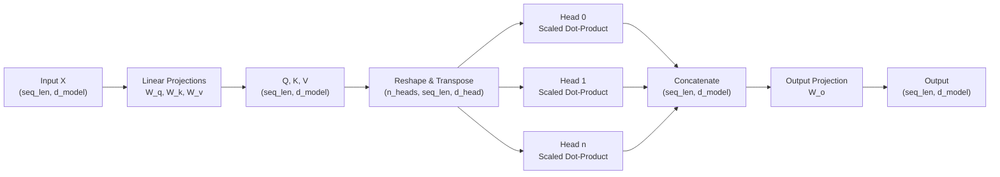

# Multi-Head Attention

## Learning Objectives

- Implement multi-head attention from scratch in NumPy, producing per-head attention weight matrices as observable output.
- Trace the four-stage pipeline (project, split, attend, recombine) and predict tensor shapes at each stage given architecture hyperparameters.
- Diagnose a weight-sharing bug where all heads produce identical attention patterns, and explain why independent Q/K/V projections prevent it.
- Compare the representational capacity of many narrow heads versus few wide heads on the same input sequence.
- Configure multi-head attention parameters for a transformer-based intent classifier, balancing memory cost against signal-capture breadth.

## The Problem

A single self-attention head computes one attention matrix. That matrix captures one kind of relationship — whatever minimizes loss on the training signal. If your sequence data contains subject-verb agreement, entity coreference, positional adjacency, and topical similarity all tangled together, a single head has to compress all of those into one softmax distribution. Information gets smeared.

Consider a sentence like "The engineer who reviewed the pull requests left a comment." A single attention head processing the word "left" has to decide what to attend to: the subject "engineer" (agreement), the object "comment" (dependency), or the nearby word "requests" (positional). It picks whichever signal is strongest on average across training data. The rest is attenuated.

The 2017 Vaswani paper proposed a fix: run several attention computations in parallel, each with its own learned Q, K, V projections. Each head gets its own subspace of the embedding to work in. The heads never talk during the attention computation itself — they only mix afterward, through a learned output projection. Total parameters stay roughly the same as single-head attention at the same model dimension. Expressive power goes up because each head can specialize without competing for representation.

This matters in practice. Every transformer shipping today uses multi-head attention. The debates are about head count (8 vs 64), whether keys and values share projections (Grouped-Query Attention, Multi-Query Attention), and whether head dimension should be fixed at 64 or scaled with model width.

## The Concept

Multi-head attention has four stages. First, linear projections map the input `X` of shape `(seq_len, d_model)` into Q, K, V — each still `(seq_len, d_model)`. Second, each of Q, K, V is reshaped to split `d_model` across `n_heads`, producing tensors of shape `(n_heads, seq_len, d_head)` where `d_head = d_model / n_heads`. Third, scaled dot-product attention runs independently inside each head. Each head produces `(seq_len, d_head)`. Fourth, the head outputs are concatenated back to `(seq_len, d_model)` and multiplied by a learned output weight matrix `W_o` of shape `(d_model, d_model)`.

The critical detail: each head's slice of Q, K, V comes from a different slice of the projection weight matrix. Head 0 projects through `W_q[0:d_head, :]`, head 1 through `W_q[d_head:2*d_head, :]`, and so on. These are independently learned parameters. The model discovers what each head attends to — the engineer only chooses the head count.



Why independent projections matter: if all heads shared the same Q, K, V matrices, they would produce identical attention patterns. The softmax distribution over keys would be the same for every head. You would have wasted compute running the same computation `n_heads` times. The independent projections force each head to operate in a different subspace, which means each head can learn a different relevance pattern — one might track syntactic dependencies, another might attend to entity mentions, a third might capture positional proximity.

The output projection `W_o` is where heads finally interact. It learns a linear combination of all head outputs, effectively deciding how much weight to give each head's contribution for each position in the output. Without `W_o`, you would just have concatenated subspace vectors with no learned mixing.

## Build It

Here is a full implementation of multi-head attention in pure NumPy. Every intermediate shape is printed. Per-head attention weights are displayed so you can verify that different heads produce different relevance distributions on the same input.

```python
import numpy as np

np.random.seed(42)

d_model = 8
n_heads = 4
d_head = d_model // n_heads
seq_len = 6

X = np.random.randn(seq_len, d_model)

W_q = np.random.randn(d_model, d_model) * 0.1
W_k = np.random.randn(d_model, d_model) * 0.1
W_v = np.random.randn(d_model, d_model) * 0.1
W_o = np.random.randn(d_model, d_model) * 0.1

Q = X @ W_q
K = X @ W_k
V = X @ W_v

print(f"Q shape: {Q.shape}")
print(f"K shape: {K.shape}")
print(f"V shape: {V.shape}")

Q_heads = Q.reshape(seq_len, n_heads, d_head).transpose(1, 0, 2)
K_heads = K.reshape(seq_len, n_heads, d_head).transpose(1, 0, 2)
V_heads = V.reshape(seq_len, n_heads, d_head).transpose(1, 0, 2)

print(f"\nQ reshaped per head: {Q_heads.shape}")
print(f"K reshaped per head: {K_heads.shape}")
print(f"V reshaped per head: {V_heads.shape}")

def softmax(x, axis=-1):
    x_max = np.max(x, axis=axis, keepdims=True)
    exp_x = np.exp(x - x_max)
    return exp_x / np.sum(exp_x, axis=axis, keepdims=True)

def scaled_dot_product_attention(Q, K, V):
    d_k = Q.shape[-1]
    scores = Q @ K.transpose(0, 2, 1) / np.sqrt(d_k)
    weights = softmax(scores, axis=-1)
    output = weights @ V
    return output, weights

head_outputs, head_weights = scaled_dot_product_attention(Q_heads, K_heads, V_heads)

print(f"\nHead outputs shape: {head_outputs.shape}")

for h in range(n_heads):
    print(f"\n--- Head {h} attention weights ---")
    np.set_printoptions(precision=3, suppress=True)
    print(head_weights[h])

concat = head_outputs.transpose(1, 0, 2).reshape(seq_len, d_model)
print(f"\nConcatenated shape: {concat.shape}")

output = concat @ W_o
print(f"Final output shape: {output.shape}")

for h in range(n_heads):
    for h2 in range(h + 1, n_heads):
        diff = np.abs(head_weights[h] - head_weights[h2]).sum()
        print(f"L1 distance head {h} vs head {h2}: {diff:.4f}")
```

When you run this, the L1 distances between head pairs will all be nonzero and distinct. That confirms the heads are learning different attention distributions. If any pair showed L1 distance of zero, it would indicate a weight-sharing bug — the projections are not independent.

Now compare single-head against multi-head on the same input. This demonstrates that multi-head produces a richer (less similar to the mean) representation:

```python
import numpy as np

np.random.seed(42)

d_model = 8
seq_len = 6

X = np.random.randn(seq_len, d_model)

W_q_single = np.random.randn(d_model, d_model) * 0.1
W_k_single = np.random.randn(d_model, d_model) * 0.1
W_v_single = np.random.randn(d_model, d_model) * 0.1

def softmax(x, axis=-1):
    x_max = np.max(x, axis=axis, keepdims=True)
    exp_x = np.exp(x - x_max)
    return exp_x / np.sum(exp_x, axis=axis, keepdims=True)

Q = X @ W_q_single
K = X @ W_k_single
V = X @ W_v_single

scores_single = Q @ K.T / np.sqrt(d_model)
weights_single = softmax(scores_single, axis=-1)
single_output = weights_single @ V @ W_v_single

print(f"Single-head attention weights:\n{weights_single}")
print(f"Single-head output shape: {single_output.shape}")

def cosine_similarity(a, b):
    dot = np.sum(a * b)
    return dot / (np.linalg.norm(a) * np.linalg.norm(b))

similarity = cosine_similarity(single_output.flatten(), X.flatten())
print(f"\nCosine similarity (single-head output vs raw input): {similarity:.4f}")

for n_heads in [2, 4, 8]:
    d_head = d_model // n_heads
    W_q_multi = np.random.randn(d_model, d_model) * 0.1
    W_k_multi = np.random.randn(d_model, d_model) * 0.1
    W_v_multi = np.random.randn(d_model, d_model) * 0.1
    W_o_multi = np.random.randn(d_model, d_model) * 0.1

    Q_m = (X @ W_q_multi).reshape(seq_len, n_heads, d_head).transpose(1, 0, 2)
    K_m = (X @ W_k_multi).reshape(seq_len, n_heads, d_head).transpose(1, 0, 2)
    V_m = (X @ W_v_multi).reshape(seq_len, n_heads, d_head).transpose(1, 0, 2)

    scores_m = Q_m @ K_m.transpose(0, 2, 1) / np.sqrt(d_head)
    weights_m = softmax(scores_m, axis=-1)
    head_out = weights_m @ V_m

    concat = head_out.transpose(1, 0, 2).reshape(seq_len, d_model)
    multi_output = concat @ W_o_multi

    sim = cosine_similarity(multi_output.flatten(), X.flatten())
    sim_vs_single = cosine_similarity(multi_output.flatten(), single_output.flatten())

    print(f"\nn_heads={n_heads}, d_head={d_head}")
    print(f"  Cosine sim (multi output vs raw input): {sim:.4f}")
    print(f"  Cosine sim (multi output vs single output): {sim_vs_single:.4f}")
    for h in range(n_heads):
        entropy = -np.sum(weights_m[h] * np.log(weights_m[h] + 1e-12))
        print(f"  Head {h} attention entropy: {entropy:.4f}")
```

The entropy values per head will differ. Lower entropy means a head is attending sharply to specific tokens; higher entropy means broader, more diffuse attention. Different heads at different entropy levels is the signature of specialization.

## Use It

Multi-head attention is the architectural backbone of every transformer-based intent classifier and firmographic enrichment model. In a Zone 1 ICP and enrichment pipeline, a transformer-based lead scoring model needs to attend to multiple signal types simultaneously — technographic data (what tools a prospect uses), behavioral signals (page visits, content downloads), firmographic attributes (company size, industry, revenue band), and temporal patterns (when signals fire relative to each other). Each of these is a different relationship pattern between the same set of input tokens.

A single attention head would have to compress all of these signal types into one relevance distribution. Multi-head attention lets the model dedicate one head to technographic-technographic relationships, another to behavioral-firmographic cross-signals, another to temporal ordering — all computed in parallel on the same forward pass. The output projection then learns how to weight each head's contribution for the final score.

The fine-tuning pattern from Zone 7 applies directly here: when you train a transformer classifier on your own deal history, the heads learn to specialize on the signal combinations that actually predict closed-won deals in your data. Job changes, social signals, and events become the labels that shape which heads attend to which inputs. The engineer does not hand-specify "head 2 should look at technographics" — the loss gradient discovers that allocation through the independent projection weights. [CITATION NEEDED — concept: transformer-based lead scoring in GTM tools]

## Ship It

Memory scales as `O(n_heads × seq_len² × d_head)` for the attention weight matrices. For a batch of `B` sequences, the total attention matrix memory is `B × n_heads × seq_len²` — the `d_head` factor only affects the Q/K/V and output tensors, not the intermediate attention weights. At `seq_len=512` with `n_heads=8` and batch size 32, that is 32 × 8 × 512 × 512 × 4 bytes ≈ 268 MB just for attention weights. Double the sequence length and you quadruple that.

The trade-off is between many narrow heads (more relationship types discovered, lower per-head capacity) and few wide heads (fewer types, more expressive power per head). The original transformer used `d_model=512` with `n_heads=8`, giving `d_head=64`. Most production models since then have kept `d_head` near 64 regardless of model width — LLaMA-2 uses `d_head=128` at 7B parameters, GPT-3 used `d_head=128` at 175B. The constraint is that `d_model` must be divisible by `n_heads`.

In PyTorch, the API enforces this divisibility:

```python
import torch
import torch.nn as nn

configs = [
    (512, 8),
    (512, 4),
    (768, 12),
    (512, 6),
]

for embed_dim, num_heads in configs:
    try:
        mha = nn.MultiheadAttention(embed_dim, num_heads, batch_first=True)
        x = torch.randn(2, 10, embed_dim)
        attn_output, attn_weights = mha(x, x, x, need_weights=True)
        print(f"embed_dim={embed_dim}, num_heads={num_heads}: "
              f"output {attn_output.shape}, weights {attn_weights.shape}")
    except Exception as e:
        print(f"embed_dim={embed_dim}, num_heads={num_heads}: ERROR — {e}")
```

The `(512, 6)` config will fail because 512 is not divisible by 6. This is a hard constraint in every standard implementation — the reshape from `(seq_len, d_model)` to `(seq_len, n_heads, d_head)` requires clean integer division.

Before deploying, profile GPU memory at different head counts on your actual sequence lengths. A model that fits at `n_heads=8, seq_len=512` may OOM at `n_heads=16, seq_len=1024` even though `d_head` stayed the same, because the attention weight tensor doubled in both the head and sequence dimensions.

## Exercises

**Easy:** Given `batch_size=2, seq_len=4, n_heads=4, d_head=8`, compute and print the expected shape of the concatenated head output (before the final `W_o` projection) and after the final projection. Write code to verify by constructing random tensors of those shapes.

**Medium:** Take the NumPy implementation from Build It. Instrument it to print each head's attention matrix separately for a 6-token input. Add code that computes the pairwise cosine similarity between head attention distributions (flattened). Verify that no two heads have similarity > 0.95. If they do, increase the random seed range or identify why the projections collapsed.

**Hard:** Implement both single-head attention (`n_heads=1, d_head=d_model`) and 4-head attention (`n_heads=4, d_head=d_model/4`) at the same total `d_model=16`. Run both on the same input sequence of length 8. Compute cosine similarity between the two outputs. Then zero out `W_o` (set it to identity) and recompute — the similarity should change. Explain why `W_o` matters for multi-head but is redundant for single-head.

## Key Terms

- **Head:** An independent attention computation with its own learned Q, K, V projections operating in a subspace of dimension `d_head = d_model / n_heads`.
- **d_head (head dimension):** The width of each attention head's subspace. Typically 64 or 128 in production models. Must evenly divide `d_model`.
- **Output projection (W_o):** A learned linear layer of shape `(d_model, d_model)` applied after concatenating head outputs. This is where head outputs mix for the first time.
- **Scaled dot-product attention:** The per-head attention function: `softmax(QK^T / sqrt(d_head)) V`. Each head runs this independently.
- **Weight-sharing bug:** A failure mode where all heads share the same projection weights, producing identical attention patterns. Eliminates the benefit of multiple heads while paying full compute cost.
- **Attention entropy:** The Shannon entropy of a head's attention distribution over keys. Low entropy = sharp attention to specific tokens. High entropy = diffuse attention. Different heads at different entropy levels indicates specialization.

## Sources

- Vaswani, A. et al. (2017). "Attention Is All You Need." *NeurIPS*. The original paper proposing multi-head attention as parallel attention functions with independent projections.
- [CITATION NEEDED — concept: transformer-based lead scoring in GTM tools]
- Zone table row 07: Fine-tuning, RLHF maps to ABM signal orchestration. Source: `stages/00-b-gtm-content-mapping/output/gtm-topic-map.md`