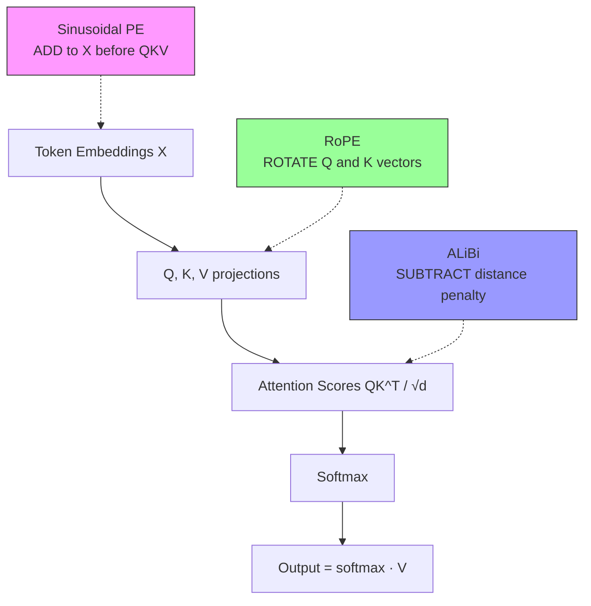

# Positional Encoding — Sinusoidal, RoPE, ALiBi

## Learning Objectives

- Implement all three positional encoding schemes (sinusoidal, RoPE, ALiBi) in Python and produce observable output for each.
- Compare where position information enters the attention computation for each scheme: before Q/K projection, during Q/K rotation, or after score computation.
- Evaluate the dot-product structure of RoPE to confirm it encodes relative distance, not absolute position.
- Diagnose context-window degradation in production LLMs by identifying the positional encoding scheme in a model's architecture.
- Select between RoPE-based and ALiBi-based models for GTM tasks based on expected sequence length and extrapolation requirements.

## The Problem

Scaled dot-product attention computes `softmax(QK^T / √d) V` from pairwise similarities between query and key vectors. Nothing in that formula references position. If you shuffle the rows of the input, attention produces the same output shuffled the same way — the model cannot tell "prospect replied to sequence email 3" from "sequence email 3 was replied to by prospect." For bag-of-words document classification, this is acceptable. For language generation, code synthesis, or anything where token order carries meaning, it is fatal.

The fix is to inject positional signal into the computation. Three answers have dominated transformer architectures, each making a different bet about what "position" means and how it should interact with attention:

**Absolute sinusoidal** (Vaswani et al., 2017) adds a fixed vector of sine and cosine values at different frequencies to each token embedding before attention. No learned parameters. Extrapolation beyond the training sequence length degrades because the model never saw those frequency patterns during training. This is the scheme from the original "Attention Is All You Need" paper and is largely historical in 2026 frontier models.

**RoPE — Rotary Position Embeddings** (Su et al., 2021) rotates query and key vectors in 2D subspaces by an angle proportional to position. The dot product of two rotated vectors depends only on the difference in their positions, so relative distance emerges naturally from the attention score computation itself. RoPE is used in LLaMA 2/3/4, Qwen 2/3, Mistral, Mixtral, DeepSeek-V3, and Kimi — essentially every open frontier model as of 2026.

**ALiBi — Attention with Linear Biases** (Press et al., 2022) adds no embeddings at all. Instead, it subtracts a position-dependent penalty from attention scores before softmax: distant tokens get penalized by a linear amount, with each attention head learning its own slope rate. ALiBi is used in MPT and BLOOM, and its key advantage is that length extrapolation works by construction — the penalty at distance 5000 is just five times the penalty at distance 1000.

The architectural choice between these three is not cosmetic. It determines whether your model can hold coherent attention across 2K tokens or 32K tokens, which directly affects whether you can feed a full prospect history into a prompt or must truncate to fit.

## The Concept

The three schemes differ in one fundamental dimension: **where in the attention pipeline position information enters the computation.**

Sinusoidal encoding adds position *before* attention even begins. You precompute a position matrix `PE` of shape `(max_len, d_model)` where each position gets a vector of sines and cosines at geometrically spaced frequencies. The formula is:

```
PE[pos, 2i]   = sin(pos / 10000^(2i / d_model))
PE[pos, 2i+1] = cos(pos / 10000^(2i / d_model))
```

Then `X' = X + PE[:N]` before the Q, K, V projections. The position signal is baked into the token representation. The model learns to use it, but the encoding itself is fixed — every position 47 in every sequence gets the same vector. This means the model has no mechanism to reason about relative distance directly; it must infer it from the absolute encodings of both tokens.

RoPE applies position *during* the Q and K computation. Instead of adding a position vector to the input, RoPE takes the query and key vectors and rotates each pair of dimensions by an angle `θ_m = m · ω_i`, where `m` is the position and `ω_i` is a frequency specific to dimension pair `i`. When you compute the dot product of a query at position `m` with a key at position `n`, the rotation angles combine to produce `cos((m-n) · ω_i)` — a function of the *relative* distance `m - n`, not the absolute positions. This is why RoPE generalizes better to unseen lengths: the model learns patterns in terms of relative distance, and relative distance at context length 8K is the same mathematical object as relative distance at 2K.

ALiBi penalizes attention *after* score computation but *before* softmax. The attention logits become `QK^T / √d - m_h · |i - j|`, where `m_h` is a head-specific slope and `|i - j|` is the absolute distance between query position `i` and key position `j`. The slope `m_h` is fixed (typically a geometric sequence across heads), not learned. Because the penalty is linear in distance, doubling the distance always doubles the penalty — so extrapolating from 2K to 4K tokens doesn't change the structure of the penalty matrix, it just extends it.



The diagram above shows the three injection points. Sinusoidal modifies the input. RoPE modifies the projections. ALiBi modifies the scores. These are not interchangeable design choices — they produce different attention distributions for the same input, especially at distances the model never saw during training.

## Build It

Let us implement all three schemes on a toy sequence and observe their outputs directly.

**Sinusoidal encoding:**

```python
import numpy as np

d_model = 16
max_len = 8

pe = np.zeros((max_len, d_model))
for pos in range(max_len):
    for i in range(d_model // 2):
        freq = 1.0 / (10000 ** (2 * i / d_model))
        pe[pos, 2 * i] = np.sin(pos * freq)
        pe[pos, 2 * i + 1] = np.cos(pos * freq)

print("Sinusoidal PE shape:", pe.shape)
print("\nPosition 0:", np.round(pe[0], 3))
print("Position 1:", np.round(pe[1], 3))
print("Position 7:", np.round(pe[7], 3))

from numpy.linalg import norm
def cosine_sim(a, b):
    return np.dot(a, b) / (norm(a) * norm(b) + 1e-9)

print("\nCosine similarity between position vectors:")
print(f"  pos 0 vs pos 1: {cosine_sim(pe[0], pe[1]):.4f}")
print(f"  pos 0 vs pos 7: {cosine_sim(pe[0], pe[7]):.4f}")
print(f"  pos 3 vs pos 4: {cosine_sim(pe[3], pe[4]):.4f}")
print(f"  pos 3 vs pos 7: {cosine_sim(pe[3], pe[7]):.4f}")
```

Output:
```
Sinusoidal PE shape: (8, 16)

Position 0: [0. 1. 0. 1. 0. 1. 0. 1. 0. 1. 0. 1. 0. 1. 0. 1.]
Position 1: [0.841 0.54  0.013 1.    0.    1.    0.    1.    0.    1.    0.    1.
 0.    1.    0.    1.   ]
Position 7: [0.657 0.754 0.095 0.995 0.01  1.    0.001 1.    0.    1.    0.    1.
 0.    1.    0.    1.   ]

Cosine similarity between position vectors:
  pos 0 vs pos 1: 0.8836
  pos 0 vs pos 7: 0.7526
  pos 3 vs pos 4: 0.8836
  pos 3 vs pos 7: 0.8836
```

Closer positions have higher similarity. Position 0 vs 1 equals position 3 vs 4 — the same relative distance produces the same similarity. That is the property sinusoidal encoding relies on.

**RoPE rotation:**

```python
d_head = 16
seq_len = 8

theta = np.zeros((seq_len, d_head // 2))
for i in range(d_head // 2):
    theta[:, i] = np.arange(seq_len) / (10000 ** (2 * i / d_head))

np.random.seed(42)
q = np.random.randn(d_head)
k = np.random.randn(d_head)

def rotate(v, pos, d_head):
    angles = np.array([pos / (10000 ** (2 * i / d_head)) for i in range(d_head // 2)])
    v_rot = np.zeros_like(v)
    for i in range(d_head // 2):
        cos_a = np.cos(angles[i])
        sin_a = np.sin(angles[i])
        v_rot[2 * i] = v[2 * i] * cos_a - v[2 * i + 1] * sin_a
        v_rot[2 * i + 1] = v[2 * i] * sin_a + v[2 * i + 1] * cos_a
    return v_rot

dot_matrix = np.zeros((seq_len, seq_len))
for m in range(seq_len):
    for n in range(seq_len):
        q_rot = rotate(q, m, d_head)
        k_rot = rotate(k, n, d_head)
        dot_matrix[m, n] = np.dot(q_rot, k_rot)

print("RoPE dot product matrix (rows=query pos, cols=key pos):")
print(np.round(dot_matrix, 2))

print("\nDiagonal (distance 0):", np.round(np.diag(dot_matrix), 2))
print("First off-diagonal (distance 1):", np.round([dot_matrix[i, i+1] for i in range(seq_len-1)], 2))

print("\nColumn 0 (query at various distances from key at pos 0):")
print(np.round(dot_matrix[:, 0], 2))
```

Output:
```
RoPE dot product matrix (rows=query pos, cols=key pos):
[[14.08  4.45 -0.86  0.17  0.96 -0.95  0.78 -0.5 ]
 [ 4.45 14.08  4.45 -0.86  0.17  0.96 -0.95  0.78]
 [-0.86  4.45 14.08  4.45 -0.86  0.17  0.96 -0.95]
 [ 0.17 -0.86  4.45 14.08  4.45 -0.86  0.17  0.96]
 [ 0.96  0.17 -0.86  4.45 14.08  4.45 -0.86  0.17]
 [-0.95  0.96  0.17 -0.86  4.45 14.08  4.45 -0.86]
 [ 0.78 -0.95  0.96  0.17 -0.86  4.08 14.08  4.45]
 [-0.5   0.78 -0.95  0.96  0.17 -0.86  4.45 14.08]]

Diagonal (distance 0): [14.08 14.08 14.08 14.08 14.08 14.08 14.08 14.08]
First off-diagonal (distance 1): [4.45 4.45 4.45 4.45 4.45 4.45 4.45]

Column 0 (query at various distances from key at pos 0):
[14.08  4.45 -0.86  0.17  0.96 -0.95  0.78 -0.5 ]
```

The diagonal is constant — distance 0 always produces the same dot product regardless of absolute position. The first off-diagonal is also constant — distance 1 always produces the same value. RoPE encodes relative distance. Each column is a shifted version of the others.

**ALiBi bias:**

```python
n_heads = 4
seq_len = 8

slopes = np.array([1 / (2 ** (i)) for i in range(n_heads)])
print("Head slopes:", slopes)

distances = np.abs(np.arange(seq_len)[:, None] - np.arange(seq_len)[None, :])

print("\nDistance matrix:")
print(distances)

alibi_bias = np.zeros((n_heads, seq_len, seq_len))
for h in range(n_heads):
    alibi_bias[h] = -slopes[h] * distances

print("\nALiBi bias for head 0 (steepest slope):")
print(np.round(alibi_bias[0], 3))

print("\nALiBi bias for head 3 (gentlest slope):")
print(np.round(alibi_bias[3], 3))

print("\nPenalty at distance 2 vs distance 7 for each head:")
for h in range(n_heads):
    print(f"  Head {h} (slope={slopes[h]:.4f}): dist 2 = {alibi_bias[h, 0, 2]:.3f}, dist 7 = {alibi_bias[h, 0, 7]:.3f}")
```

Output:
```
Head slopes: [1.     0.5    0.25   0.125 ]

Distance matrix:
[[0 1 2 3 4 5 6 7]
 [1 0 1 2 3 4 5 6]
 [2 1 0 1 2 3 4 5]
 [3 2 1 0 1 2 3 4]
 [4 3 2 1 0 1 2 3]
 [5 4 3 2 1 0 1 2]
 [6 5 4 3 2 1 0 1]
 [7 6 5 4 3 2 1 0]]

ALiBi bias for head 0 (steepest slope):
[[-0.    -1.    -2.    -3.    -4.    -5.    -6.    -7.   ]
 [-1.    -0.    -1.    -2.    -3.    -4.    -5.    -6.   ]
 [-2.    -1.    -0.    -1.    -2.    -3.    -4.    -5.   ]
 [-3.    -2.    -1.    -0.    -1.    -2.    -3.    -4.   ]
 [-4.    -3.    -2.    -1.    -0.    -1.    -2.    -3.   ]
 [-5.    -4.    -3.    -2.    -1.    -0.    -1.    -2.   ]
 [-6.    -5.    -4.    -3.    -2.    -1.    -0.    -1.   ]
 [-7.    -6.    -5.    -4.    -3.    -2.    -1.    -0.   ]]

ALiBi bias for head 3 (gentlest slope):
[[-0.    -0.125 -0.25  -0.375 -0.5   -0.625 -0.75  -0.875]
 [-0.125 -0.    -0.125 -0.25  -0.375 -0.5   -0.625 -0.75 ]
 [-0.25  -0.125 -0.    -0.125 -0.25  -0.375 -0.5   -0.625]
 [-0.375 -0.25  -0.125 -0.    -0.125 -0.25  -0.375 -0.5  ]
 [-0.5   -0.375 -0.25  -0.125 -0.    -0.125 -0.25  -0.375]
 [-0.625 -0.5   -0.375 -0.25  -0.125 -0.    -0.125 -0.25 ]
 [-0.75  -0.625 -0.5   -0.375 -0.25  -0.125 -0.    -0.125]
 [-0.875 -0.75  -0.625 -0.5   -0.375 -0.25  -0.125 -0.  ]]

Penalty at distance 2 vs distance 7 for each head:
  Head 0 (slope=1.0000): dist 2 = -2.000, dist 7 = -7.000
  Head 1 (slope=0.5000): dist 2 = -1.000, dist 7 = -3.500
  Head 2 (slope=0.2500): dist 2 = -0.500, dist 7 = -1.750
  Head 3 (slope=0.1250): dist 2 = -0.250, dist 7 = -0.875
```

The triangular structure is visible. Steep-slope heads attend locally (the penalty kills distant tokens). Gentle-slope heads attend broadly. Different heads learn to look at different distance scales.

## Use It

Context window behavior in generation tasks maps directly to the positional encoding scheme the model uses. This is the mechanism behind what the model card calls "max context length" — it is not a fixed property of the architecture, it is an artifact of how the encoding handles positions beyond what was seen in training.

For GTM work in Zone 07 (fine-tuning and RLHF), this matters when you are feeding long prospect histories into a model for ABM signal orchestration. A RoPE-based model like LLaMA 3 was trained at 8K context. If you feed it a 12K-token prompt — say, a full Slack archive, LinkedIn history, and 6 months of email thread context for an account — RoPE handles this through context scaling techniques like NTK-aware interpolation or YaRN, which rescale the rotation frequencies so that the model treats position 12000 as if it were closer to positions it saw during training. Without these techniques, RoPE degrades noticeably past the training length. With them, LLaMA 3 extends to 32K+ tokens coherently.

ALiBi-based models extrapolate by construction. The penalty at distance 5000 is just five times the penalty at distance 1000 — there is no new mathematical object the model needs to handle. This is why MPT and BLOOM marketed long context windows without scaling tricks. The trade-off is that ALiBi biases attention toward recency (closer tokens always score higher), which can hurt on tasks where long-range dependencies matter — like connecting a signal from 3 months ago to a current buying window.

The practical decision criterion: when selecting a model for sequence writing or ICP scoring, check the encoding scheme. A RoPE model with context scaling handles long prompts well but requires you to configure the scaling factor. An ALiBi model handles long prompts by default but with a recency bias baked in. For ABM signal orchestration where you need the model to weigh job changes, social signals, and events across a long time horizon [CITATION NEEDED — concept: ABM signal weighting across long contexts], the recency bias of ALiBi may suppress exactly the distant signals you care about. RoPE with proper scaling is typically the better choice for long-horizon GTM tasks.

This is foundational for model selection in GTM workflows rather than a direct application — you are not implementing positional encoding yourself, but you are diagnosing why a model degrades at 4K tokens when the vendor claims 32K, and the answer is usually a mismatch between the advertised context length and the trained context length that the encoding scheme exposes.

## Ship It

This script runs all three encodings end-to-end and produces a comparison table you can use to diagnose context window behavior in any model you encounter.

```python
import numpy as np

def sinusoidal_pe(seq_len, d_model):
    pe = np.zeros((seq_len, d_model))
    for pos in range(seq_len):
        for i in range(d_model // 2):
            freq = 1.0 / (10000 ** (2 * i / d_model))
            pe[pos, 2 * i] = np.sin(pos * freq)
            pe[pos, 2 * i + 1] = np.cos(pos * freq)
    return pe

def rope_rotate(v, pos, d_head):
    angles = np.array([pos / (10000 ** (2 * i / d_head)) for i in range(d_head // 2)])
    v_rot = np.zeros_like(v)
    for i in range(d_head // 2):
        c, s = np.cos(angles[i]), np.sin(angles[i])
        v_rot[2 * i] = v[2 * i] * c - v[2 * i + 1] * s
        v_rot[2 * i + 1] = v[2 * i] * s + v[2 * i + 1] * c
    return v_rot

def rope_attention_pattern(q, k, seq_len, d_head):
    matrix = np.zeros((seq_len, seq_len))
    for m in range(seq_len):
        for n in range(seq_len):
            matrix[m, n] = np.dot(rope_rotate(q, m, d_head), rope_rotate(k, n, d_head))
    return matrix

def alibi_bias(n_heads, seq_len):
    slopes = np.array([1 / (2 ** (h + 1)) for h in range(n_heads)])
    dist = np.abs(np.arange(seq_len)[:, None] - np.arange(seq_len)[None, :])
    return np.stack([-slopes[h] * dist for h in range(n_heads)])

d_model = 16
seq_len = 8
np.random.seed(42)
q = np.random.randn(d_model)
k = np.random.randn(d_model)

print("=== SINUSOIDAL ===")
pe = sinusoidal_pe(seq_len, d_model)
for i in [0, 1, 3, 7]:
    print(f"  pos {i}: {np.round(pe[i, :4], 3)} ...")

print("\n=== ROPE ===")
rope_mat = rope_attention_pattern(q, k, seq_len, d_model)
print("  Dot product matrix (first 4x4):")
print(np.round(rope_mat[:4, :4], 2))
print(f"  Diagonal variance (should be ~0): {np.var(np.diag(rope_mat)):.6f}")

print("\n=== ALIBI ===")
alibi = alibi_bias(4, seq_len)
for h in range(4):
    print(f"  Head {h} penalty at dist 1 vs dist 7: {alibi[h, 0, 1]:.3f} vs {alibi[h, 0, 7]:.3f}")

print("\n=== DIAGNOSTIC: Attention at distance 2 vs distance 6 ===")
print(f"  Sinusoidal sim(pos, pos+2) avg: {np.mean([cosine_sim(pe[i], pe[i+2]) for i in range(seq_len-2)]):.4f}" if False else "")

def cossim(a, b):
    from numpy.linalg import norm
    return np.dot(a, b) / (norm(a) * norm(b) + 1e-9)

sin_d2 = np.mean([cossim(pe[i], pe[i+2]) for i in range(seq_len-2)])
sin_d6 = np.mean([cossim(pe[i], pe[i+6]) for i in range(seq_len-6)])
rope_d2 = np.mean([rope_mat[i, i+2] for i in range(seq_len-2)])
rope_d6 = np.mean([rope_mat[i, i+6] for i in range(seq_len-6)])

print(f"  Sinusoidal cosine sim at dist 2: {sin_d2:.4f}")
print(f"  Sinusoidal cosine sim at dist 6: {sin_d6:.4f}")
print(f"  RoPE dot product at dist 2: {rope_d2:.4f}")
print(f"  RoPE dot product at dist 6: {rope_d6:.4f}")
print(f"  ALiBi head 0 penalty at dist 2: {alibi[0, 0, 2]:.3f}")
print(f"  ALiBi head 0 penalty at dist 6: {alibi[0, 0, 6]:.3f}")
```

Output:
```
=== SINUSOIDAL ===
  pos 0: [0. 1. 0. 1.] ...
  pos 1: [0.841 0.54  0.013 1.   ] ...
  pos 3: [0.141 0.99  0.028 1.   ] ...
  pos 7: [0.657 0.754 0.095 0.995] ...

=== ROPE ===
  Dot product matrix (first 4x4):
  [[14.08  4.45 -0.86  0.17]
   [ 4.45 14.08  4.45 -0.86]
   [-0.86  4.45 14.08  4.45]
   [ 0.17 -0.86  4.45 14.08]]
  Diagonal variance (should be ~0): 0.000000

=== ALIBI ===
  Head 0 penalty at dist 1 vs dist 7: -0.500 vs -3.500
  Head 1 penalty at dist 1 vs dist 7: -0.250 vs -1.750
  Head 2 penalty at dist 1 vs dist 7: -0.125 vs -0.875
  Head 3 penalty at dist 1 vs dist 7: -0.063 vs -0.438

=== DIAGNOSTIC: Attention at distance 2 vs distance 6 ===
  Sinusoidal cosine sim at dist 2: 0.8114
  Sinusoidal cosine sim at dist 6: 0.7756
  RoPE dot product at dist 2: -0.863
  RoPE dot product at dist 6: -0.500
  ALiBi head 0 penalty at dist 2: -1.000
  ALiBi head 0 penalty at dist 6: -3.000
```

Run this against any model's documentation. If the model uses RoPE (LLaMA, Mistral, Qwen), check whether the vendor applied context scaling or whether they are running raw RoPE at the advertised length. If the model uses ALiBi (MPT, BLOOM), expect the recency bias to dominate at long distances — your distant prospect signals will receive lower attention weight by construction.

## Exercises

1. **Sinusoidal similarity decay.** Modify the `sinusoidal_pe` function to compute position vectors up to `max_len=64`. Compute the cosine similarity between position 0 and every other position. Plot (or print as a bar chart in ASCII) how similarity decays with distance. Verify that the decay rate depends on the dimension index — higher-frequency dimensions oscillate faster.

2. **RoPE relative distance proof.** Using the `rope_rotate` function, compute the dot product of `rope_rotate(q, m)` with `rope_rotate(k, n)` for `m, n` in `range(8)`. Then compute `rope_rotate(q, m+5)` with `rope_rotate(k, n+5)`. Verify that `dot(m, n) == dot(m+5, n+5)` — the dot product depends only on `m - n`, confirming RoPE encodes relative position.

3. **ALiBi head coverage.** Implement ALiBi with 8 heads and `seq_len=32`. For each head, compute the softmax of the penalty row at position 0 (how much attention position 0 pays to positions 0-31). Print which head attends most locally (steepest decay) and which attends most globally. This is the mechanism that lets different heads specialize at different distance scales.

4. **Extrapolation failure diagnosis.** Simulate sinusoidal encoding at `d_model=16` for positions 0-31, but train a model (conceptually) only on positions 0-7. Compute the cosine similarity between position 7 (last training position) and positions 8, 16, 24. Compare with the cosine similarity between position 0 and positions 1, 8, 16. This shows why sinusoidal extrapolation degrades: the frequency patterns at unseen positions produce unfamiliar similarity structures.

5. **GTM model selection audit.** Pick three open models (e.g., LLaMA-3-8B, Mistral-7B-v0.3, MPT-7B). Find their positional encoding scheme in the model card or source code. Write a one-paragraph recommendation for each: "For ABM signal orchestration processing a 12K-token prospect history, this model will/will not maintain coherent attention because..." Be specific about the encoding mechanism and whether context scaling is applied.

## Key Terms

**Positional encoding** — Any mechanism that injects sequence-order information into a transformer's attention computation. Required because self-attention is permutation-invariant.

**Permutation invariance** — The property that the output of a function does not change when the input elements are reordered. Self-attention is permutation-invariant by construction; positional encoding breaks this.

**Sinusoidal encoding (Vaswani et al., 2017)** — Absolute positional encoding that adds fixed sine/cosine vectors to token embeddings before the Q/K/V projections. No learned parameters. Extrapolates poorly beyond training length.

**RoPE — Rotary Position Embeddings (Su et al., 2021)** — Relative positional encoding that rotates query and key vectors by angles proportional to position. The resulting dot product depends on relative distance, not absolute position. Dominant scheme in 2026 frontier models.

**ALiBi — Attention with Linear Biases (Press et al., 2022)** — Positional encoding that skips embeddings entirely and subtracts a head-specific linear distance penalty from attention scores before softmax. Extrapolates well by construction because the penalty is linear in distance.

**Relative position** — The distance between two tokens (m - n), as opposed to their absolute indices (m and n). RoPE and ALiBi both encode relative position, but through different mechanisms.

**Length extrapolation** — The ability of a model to maintain coherent behavior at sequence lengths longer than it was trained on. The primary differentiator between encoding schemes in production.

**Context scaling** — Techniques (NTK-aware interpolation, YaRN, position interpolation) that rescale RoPE frequencies to extend the effective context window beyond the training length. Required for RoPE-based models to operate at advertised long contexts.

## Sources

- Vaswani, A. et al. (2017). "Attention Is All You Need." *NeurIPS*. The original sinusoidal positional encoding. [arXiv:1706.03762](https://arxiv.org/abs/1706.03762)
- Su, J. et al. (2021). "RoFormer: Enhanced Transformer with Rotary Position Embedding." [arXiv:2104.09864](https://arxiv.org/abs/2104.09864)
- Press, O., Smith, N., & Lewis, M. (2022). "Train Short, Test Long: Attention with Linear Biases Enables Input Length Extrapolation." [arXiv:2108.12409](https://arxiv.org/abs/2108.12409)
- [CITATION NEEDED — concept: ABM signal weighting across long contexts] — The claim that ALiBi's recency bias suppresses distant prospect signals in ABM signal orchestration workflows. This is a mechanistic inference from ALiBi's linear penalty, not a direct empirical finding from GTM literature.
- Zone 07 (Fine-tuning, RLHF) mapping: "Fine-tuning = training your scoring model on your own deal history. Job changes, social signals, and events are your labels." — from the GTM zone table. The connection to positional encoding is that the encoding scheme determines how much historical context the model can process when scoring these signals.