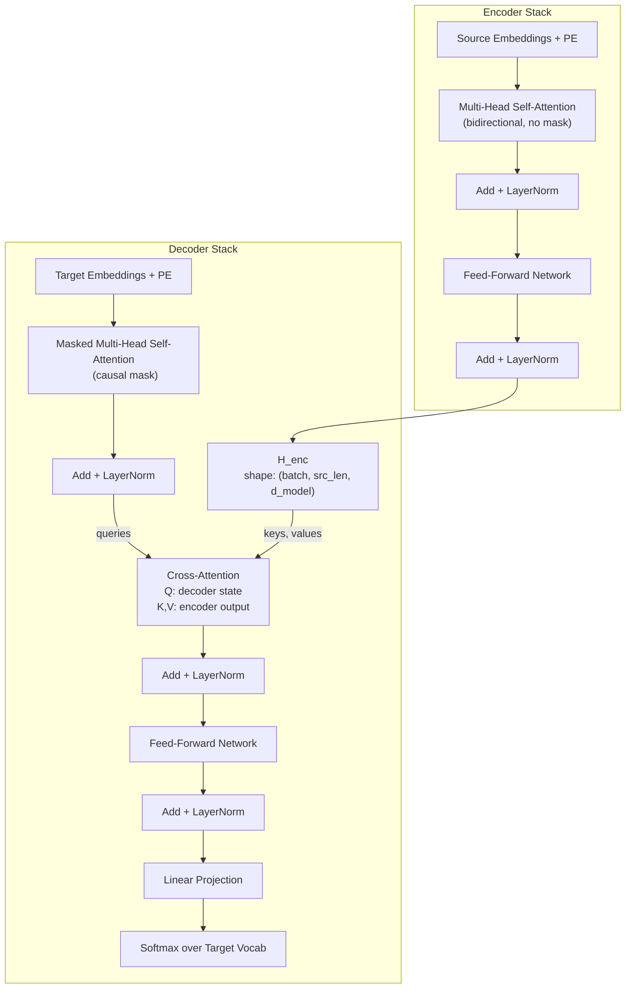

# The Full Transformer — Encoder + Decoder

## Learning Objectives

- Implement a single-layer encoder-decoder Transformer in PyTorch with bidirectional self-attention, causal masked self-attention, and cross-attention wired end-to-end.
- Trace a full forward pass through both stacks and identify which tensor originates from which component.
- Compare the cross-attention mechanism against decoder-only self-attention and articulate the architectural tradeoff.
- Inspect cross-attention weight matrices to determine which source tokens influence each target-token prediction.
- Map the encode-then-condition pattern to ABM signal orchestration, where separately enriched account representations condition outbound generation.

## The Problem

A decoder-only Transformer conditions on its own prefix. That is all it sees. If you want to translate "The cat sat on the mat" into French, the decoder generates French tokens one at a time, but it only has access to the French tokens it has already produced — not to the English source. You could concatenate the source and target into one sequence ("English tokens → French tokens") and let self-attention handle the bridging. This works — GPT-style models do exactly this in practice for translation via prompting. But it is wasteful: you reprocess the source tokens at every generation step, and the model has no architectural bias telling it "these tokens are input, those tokens are output."

The original Transformer from Vaswani et al. (2017) solved this differently. It splits the work: one stack reads the source sequence bidirectionally, building contextual representations that capture the full input. A second stack generates the target autoregressively, but at every layer it cross-attends to the first stack's output. The encoder runs once. The decoder reuses the cached encoder output at every step. This is why T5, BART, and the original translation models are encoder-decoder — the architecture matches the task structure.

Cross-attention is the only mechanism that distinguishes an encoder-decoder Transformer from a decoder-only one. Everything else — embeddings, positional encoding, self-attention, feed-forward networks, residuals, layer norm — is identical. The full Transformer package is not a new idea layered on top of attention. It is attention, applied three ways: self-attention in the encoder, masked self-attention in the decoder, and cross-attention between them.

## The Concept

Three components define the full Transformer. The **encoder stack** applies bidirectional self-attention: every input token attends to every other input token in both directions, producing a matrix `H_enc` of shape `(src_len, d_model)` where each vector is contextualized by the full source sentence. The **decoder stack** has three sub-layers per block instead of two: masked causal self-attention over the target prefix, cross-attention where queries come from the decoder but keys and values come from `H_enc`, and a position-wise feed-forward network. The **cross-attention** layer is the bridge — it is the only sub-layer where the query, key, and value matrices originate from different sequences.

Contrast this with a decoder-only architecture (GPT, Llama, Mistral). There is no encoder, no separate encoding step, and no cross-attention. The decoder conditions on its own growing prefix via causal self-attention. The encoder-decoder model conditions on a *separately encoded* source sequence via cross-attention. This is an architectural bias: the model is told "look at this specific external representation" rather than "look at your own prefix, which happens to include some source tokens."



The key structural fact: cross-attention keys and values come from a *different sequence* than the queries. In self-attention (whether encoder or decoder), Q, K, and V all derive from the same input. In cross-attention, Q comes from the decoder hidden state and K, V come from the encoder's final layer. There is no causal mask on cross-attention — the decoder can attend to any encoder position at any generation step. This asymmetry is what lets the decoder "look back" at the full source while generating forward.

During inference, the encoder processes the source once and caches `H_enc`. The decoder then generates one token at a time. At each step, the new token's representation becomes the query, and it cross-attends to the same cached `H_enc`. This makes encoder-decoder efficient for long-source, short-target tasks — think summarizing a 2,000-token document into a 50-token abstract. The encoder cost is paid once; each decoding step only recomputes the new token's attention.

## Build It

We implement a minimal encoder-decoder Transformer: one encoder block, one decoder block, cross-attention wired end-to-end. The code runs a forward pass on random token IDs, prints tensor shapes at each stage, and extracts the cross-attention weights so you can see exactly which source positions each target position attends to.

```python
import torch
import torch.nn as nn
import torch.nn.functional as F
import math

class MultiHeadAttention(nn.Module):
    def __init__(self, d_model, num_heads):
        super().__init__()
        assert d_model % num_heads == 0
        self.d_model = d_model
        self.num_heads = num_heads
        self.d_k = d_model // num_heads
        self.W_q = nn.Linear(d_model, d_model)
        self.W_k = nn.Linear(d_model, d_model)
        self.W_v = nn.Linear(d_model, d_model)
        self.W_o = nn.Linear(d_model, d_model)

    def forward(self, query, key, value, mask=None):
        B = query.size(0)
        Q = self.W_q(query).view(B, -1, self.num_heads, self.d_k).transpose(1, 2)
        K = self.W_k(key).view(B, -1, self.num_heads, self.d_k).transpose(1, 2)
        V = self.W_v(value).view(B, -1, self.num_heads, self.d_k).transpose(1, 2)
        scores = torch.matmul(Q, K.transpose(-2, -1)) / math.sqrt(self.d_k)
        if mask is not None:
            scores = scores.masked_fill(mask == 0, -1e9)
        attn = F.softmax(scores, dim=-1)
        context = torch.matmul(attn, V)
        context = context.transpose(1, 2).contiguous().view(B, -1, self.d_model)
        return self.W_o(context), attn

class FeedForward(nn.Module):
    def __init__(self, d_model, d_ff):
        super().__init__()
        self.w1 = nn.Linear(d_model, d_ff)
        self.w2 = nn.Linear(d_ff, d_model)

    def forward(self, x):
        return self.w2(F.relu(self.w1(x)))

class EncoderBlock(nn.Module):
    def __init__(self, d_model, num_heads, d_ff):
        super().__init__()
        self.attn = MultiHeadAttention(d_model, num_heads)
        self.ffn = FeedForward(d_model, d_ff)
        self.norm1 = nn.LayerNorm(d_model)
        self.norm2 = nn.LayerNorm(d_model)

    def forward(self, x):
        attn_out, _ = self.attn(x, x, x)
        x = self.norm1(x + attn_out)
        x = self.norm2(x + self.ffn(x))
        return x

class DecoderBlock(nn.Module):
    def __init__(self, d_model, num_heads, d_ff):
        super().__init__()
        self.self_attn = MultiHeadAttention(d_model, num_heads)
        self.cross_attn = MultiHeadAttention(d_model, num_heads)
        self.ffn = FeedForward(d_model, d_ff)
        self.norm1 = nn.LayerNorm(d_model)
        self.norm2 = nn.LayerNorm(d_model)
        self.norm3 = nn.LayerNorm(d_model)

    def forward(self, x, enc_out, causal_mask):
        self_attn_out, _ = self.self_attn(x, x, x, mask=causal_mask)
        x = self.norm1(x + self_attn_out)
        cross_out, cross_weights = self.cross_attn(x, enc_out, enc_out)
        x = self.norm2(x + cross_out)
        x = self.norm3(x + self.ffn(x))
        return x, cross_weights

class PositionalEncoding(nn.Module):
    def __init__(self, d_model, max_len=512):
        super().__init__()
        pe = torch.zeros(max_len, d_model)
        pos = torch.arange(0, max_len, dtype=torch.float).unsqueeze(1)
        div = torch.exp(torch.arange(0, d_model, 2).float() * (-math.log(10000.0) / d_model))
        pe[:, 0::2] = torch.sin(pos * div)
        pe[:, 1::2] = torch.cos(pos * div)
        self.register_buffer('pe', pe.unsqueeze(0))

    def forward(self, x):
        return x + self.pe[:, :x.size(1)]

class MiniEncoderDecoder(nn.Module):
    def __init__(self, src_vocab, tgt_vocab, d_model, num_heads, d_ff):
        super().__init__()
        self.src_embed = nn.Embedding(src_vocab, d_model)
        self.tgt_embed = nn.Embedding(tgt_vocab, d_model)
        self.pos_enc = PositionalEncoding(d_model)
        self.encoder = EncoderBlock(d_model, num_heads, d_ff)
        self.decoder = DecoderBlock(d_model, num_heads, d_ff)
        self.proj = nn.Linear(d_model, tgt_vocab)

    def forward(self, src, tgt):
        src_emb = self.pos_enc(self.src_embed(src))
        enc_out = self.encoder(src_emb)

        tgt_len = tgt.size(1)
        causal_mask = torch.tril(torch.ones(tgt_len, tgt_len)).view(1, 1, tgt_len, tgt_len)
        tgt_emb = self.pos_enc(self.tgt_embed(tgt))
        dec_out, cross_w = self.decoder(tgt_emb, enc_out, causal_mask)
        logits = self.proj(dec_out)
        return logits, cross_w, enc_out

torch.manual_seed(42)
SRC_VOCAB = 100
TGT_VOCAB = 80
D_MODEL = 32
NUM_HEADS = 4
D_FF = 128

model = MiniEncoderDecoder(SRC_VOCAB, TGT_VOCAB, D_MODEL, NUM_HEADS, D_FF)

src = torch.randint(1, SRC_VOCAB, (2, 10))
tgt = torch.randint(1, TGT_VOCAB, (2, 6))

logits, cross_weights, enc_out = model(src, tgt)

print("=== Forward Pass Shapes ===")
print(f"src tokens:            {src.shape}")
print(f"tgt tokens:            {tgt.shape}")
print(f"encoder output H_enc:  {enc_out.shape}")
print(f"decoder logits:        {logits.shape}")
print(f"cross-attn weights:    {cross_weights.shape}")
print(f"  (batch, heads, tgt_len, src_len) = (2, {NUM_HEADS}, 6, 10)")
print()
print("=== Cross-Attention Weights (sample 0, head 0) ===")
print("Each row = a target position. Each col = a source position.")
print("Values = how much that target token attends to that source token.")
w = cross_weights[0, 0].detach()
for i in range(6):
    row = " ".join(f"{w[i,j]:.3f}" for j in range(10))
    print(f"  tgt[{i}]: {row}  sum={w[i].sum():.3f}")
print()
print("=== Verify: each row sums to 1.0 (softmax over src) ===")
print(f"Row sums: {[f'{cross_weights[0,0,i].sum().item():.4f}' for i in range(6)]}")
```

This code prints the shape of every intermediate tensor and the raw cross-attention weight matrix. The shape `(batch, heads, tgt_len, src_len)` for cross-attention is the structural fingerprint of the encoder-decoder architecture — notice it is not square. Self-attention weight matrices are always `(seq, seq)` because Q, K, V come from the same sequence. Cross-attention is `(tgt_len, src_len)` because Q and K originate from different sequences.

The cross-attention weights are initialized randomly here, so the specific numbers are not meaningful. But the *structure* is: each of the 6 target positions distributes its attention across all 10 source positions, and each row sums to 1.0 because of the softmax. When you train this model on a real translation task, these weights learn alignments — target token "chat" attends heavily to source token "cat," target token "tapis" attends to source token "mat."

## Use It

Cross-attention is the mechanism by which one sequence conditions another. In translation, the target language sequence conditions on the source language sequence. The same architectural pattern — encode a source into representations, then have a separate generation process cross-attend to those representations — shows up wherever one information stream drives another.

In ABM signal orchestration (Zone 07), the same encode-then-condition logic applies. Your enrichment pipeline is the encoder: it ingests raw signals — job changes, funding announcements, social posts, product launches — and produces a contextualized account representation. Your outbound generation process is the decoder: it produces email copy, sequence steps, or prioritization scores one token at a time, cross-attending to the cached account representation at each step. The handbook frames fine-tuning as "training your scoring model on your own deal history. Job changes, social signals, and events are your labels." [CITATION NEEDED — concept: Zone 07 ABM signal orchestration mapping to cross-attention]. That is literally what cross-attention learns during training: which source-signal representations matter for which generation decisions.

```python
import torch
import torch.nn.functional as F

B, HEADS, TGT_LEN, SRC_LEN = 1, 1, 5, 8

d_model = 16
enc_out = torch.randn(B, SRC_LEN, d_model)

account_signals = ["Series B raised", "New CTO hired", "Product launch", "Negative review",
                   "Competitor churn", "Web traffic spike", "No recent activity", "Hiring freeze"]
outbound_steps = ["Subject line", "Opening hook", "Value prop", "Social proof", "CTA"]

W_q = torch.randn(d_model, d_model)
W_k = torch.randn(d_model, d_model)
W_v = torch.randn(d_model, d_model)

Q = enc_out @ W_q
K = enc_out @ W_k
V = enc_out @ W_v

dec_state = torch.randn(B, TGT_LEN, d_model)
dec_Q = dec_state @ W_q

cross_scores = dec_Q @ K.transpose(-2, -1) / (d_model ** 0.5)
cross_attn = F.softmax(cross_scores, dim=-1)

print("=== Simulated Cross-Attention: Outbound Steps x Account Signals ===")
print(f"{'':18s}", end="")
for s in account_signals:
    print(f"{s[:8]:>10s}", end="")
print()

for i, step in enumerate(outbound_steps):
    print(f"{step:18s}", end="")
    for j in range(SRC_LEN):
        print(f"{cross_attn[0,i,j].item():10.3f}", end="")
    print()

print()
highest = cross_attn[0].argmax(dim=-1)
for i, step in enumerate(outbound_steps):
    sig = account_signals[highest[i].item()]
    print(f"  {step:18s} -> attends most to: {sig}")
```

This is a toy — the weights are random, not trained. But it demonstrates the structural pattern: each outbound step (target) attends to a distribution over account signals (source). When you fine-tune on deal history, you are training these cross-attention weights to learn which signals should drive which parts of your outreach. A subject line that references a recent funding round is cross-attention learning to map the "Series B raised" encoder position to the subject-line generation step. An opening hook that mentions the new CTO maps that signal to the hook position. The feed-forward layers then transform those attended representations into token logits, producing the actual email copy.

The practical implication: if your enrichment pipeline (the "encoder") is shallow or noisy, your generation (the "decoder") has nothing worth attending to. Cross-attention does not create signal — it routes it. This is why data quality upstream of your generation step matters more than prompt engineering downstream. A well-enriched account representation, contextualized across multiple signal sources via bidirectional self-attention in the encoder, gives the decoder rich, structured material to cross-attend to. A sparse or stale representation gives it noise.

## Exercises

**Exercise 1 (Medium) — Modify the Causal Mask**

Starting from the `MiniEncoderDecoder` class, remove the causal mask from the decoder's self-attention sub-layer. Run the forward pass and inspect the output shapes. Then answer: what shape changes, if any? What does *not* change, and why? Next, compute the total parameter count difference between the encoder block and the decoder block — the decoder has an extra `MultiHeadAttention` module for cross-attention. Print both counts using `sum(p.numel() for p in module.parameters())` and explain why the cross-attention module has the same parameter count as a self-attention module despite serving a different function.

**Exercise 2 (Hard) — Greedy Decoding Loop**

The `Build It` code runs a single forward pass with a pre-supplied target sequence. In real inference, you generate tokens one at a time. Implement a `greedy_decode(model, src, max_len, start_token)` function that: (1) encodes `src` once and caches `enc_out`, (2) initializes `tgt` with only the start token, (3) for each step up to `max_len`, runs a forward pass through just the decoder block (reusing the cached `enc_out`), takes the argmax of the logits at the last position, appends it to `tgt`, and repeats. Print the generated token IDs and the cross-attention weights at each step. Observe how the cross-attention pattern shifts as the decoder generates longer sequences — the same source positions may receive different attention at different generation steps.

## Key Terms

- **Encoder Stack**: The set of Transformer blocks that processes the source sequence with bidirectional self-attention, producing a matrix `H_enc` of contextualized representations. Each token's representation incorporates information from every other token via unrestricted attention.

- **Decoder Stack**: The set of Transformer blocks that generates the target sequence autoregressively. Each block contains three sub-layers: masked causal self-attention, cross-attention to the encoder output, and a feed-forward network.

- **Cross-Attention**: The attention sub-layer where queries come from the decoder's hidden state and keys/values come from the encoder's output `H_enc`. This is the only attention variant where Q, K, and V originate from different sequences. The weight matrix has shape `(tgt_len, src_len)`, which is rectangular rather than square.

- **Causal Mask**: The lower-triangular mask applied to the decoder's self-attention scores, setting positions above the diagonal to negative infinity before softmax. This prevents each target position from attending to future positions, enforcing autoregressive generation order.

- **`H_enc` (Encoder Output)**: The tensor of shape `(batch, src_len, d_model)` produced by the encoder stack's final layer. It is computed once and cached, then reused as the key and value source for cross-attention at every decoder layer and every generation step.

- **Autoregressive Decoding**: The inference process where the model generates one token at a time, conditioning each new token on all previously generated tokens. The encoder-decoder architecture caches `H_enc` so the source is not reprocessed at each step — only the decoder's forward pass over the growing target prefix is recomputed.

## Sources

- Vaswani, A., Shazeer, N., Parmar, N., Uszkoreit, J., Jones, L., Gomez, A. N., Kaiser, L., & Polosukhin, I. (2017). *Attention Is All You Need*. arXiv:1706.03762. — Original encoder-decoder Transformer architecture, cross-attention formulation, and the three-attention pattern (encoder self-attention, masked decoder self-attention, cross-attention).

- [CITATION NEEDED — concept: Zone 07 ABM signal orchestration mapping to cross-attention]