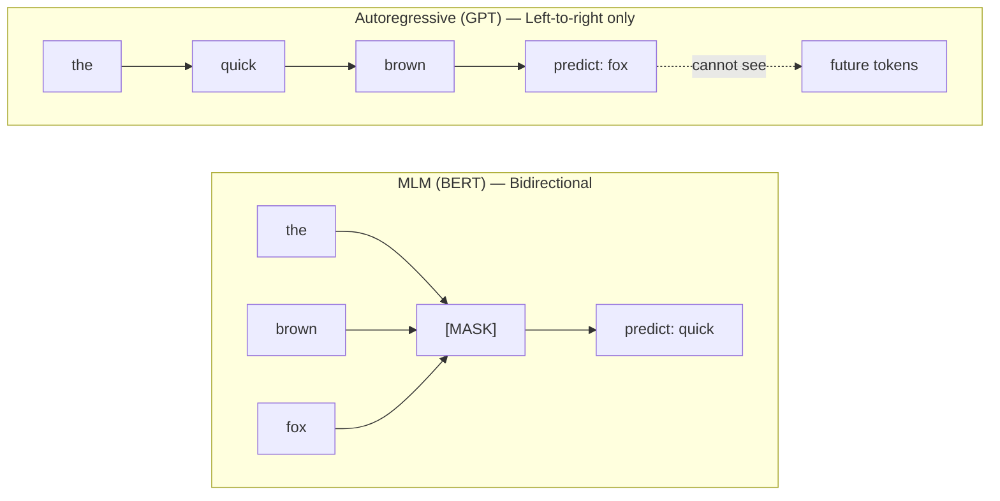
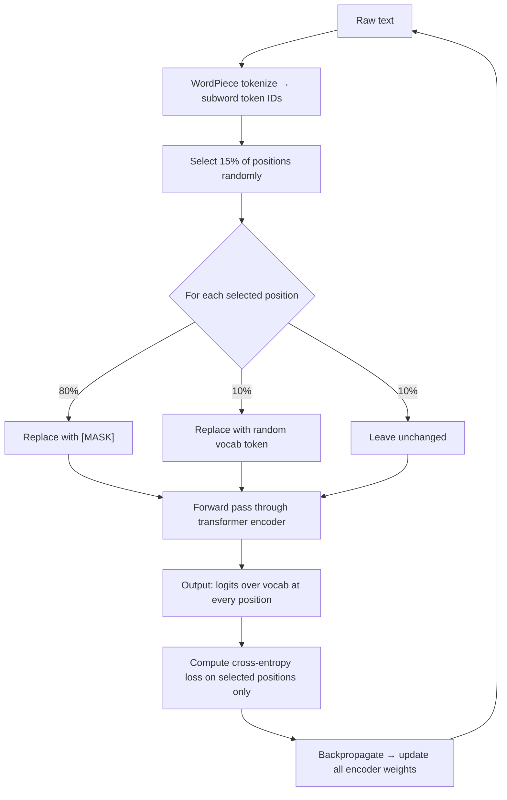

# BERT — Masked Language Modeling

## Learning Objectives

1. **Implement** masked token prediction using a pre-trained BERT model and extract ranked candidates with confidence scores.
2. **Explain** why the 80/10/10 masking distribution (mask / random / unchanged) prevents train-test mismatch during fine-tuning.
3. **Compare** bidirectional context in MLM to unidirectional context in autoregressive (GPT-style) training.
4. **Inspect** subword tokenization output and predict how a masked position aligns to original word boundaries.
5. **Identify** which downstream GTM tasks rely on representations learned through MLM pre-training.

---

## The Problem

Before 2018, every NLP task — sentiment classification, named entity recognition, question answering — required training a model from scratch on task-specific labeled data. You could not download a checkpoint that "understood English" and adapt it. Word2Vec and GloVe gave you static word embeddings, but each token had exactly one vector regardless of context. The word "bank" had the same representation in "river bank" and "bank account." That is a fundamental representational limitation.

ELMo (2018) improved on this by running a bidirectional LSTM and concatenating the forward and backward hidden states. But concatenation is not true bidirectionality — the forward pass still cannot see future tokens at the moment it encodes position *i*, and vice versa. The two directions are trained independently and glued together after the fact. The representation at position *i* never has simultaneous access to both left and right context during a single forward pass.

BERT solved this with one mechanism: **masked language modeling** (MLM). The model takes a transformer encoder — where every position attends to every other position via self-attention — and trains it to predict tokens that have been hidden. Because self-attention is inherently bidirectional, the representation at the masked position is computed using the full sentence on both sides in a single pass. No stitching, no concatenation. That architectural choice is why BERT became the default backbone for classification, retrieval, and extraction tasks — and why encoder-only models still dominate those workloads today.

The practical consequence: you can pre-train once on billions of tokens of unlabeled text, then fine-tune on a small labeled set for your specific task. The MLM objective produces representations that transfer. Every fine-tuned classification or extraction model you deploy inherits from that pre-training signal.

---

## The Concept

### The MLM training procedure

Take an input sequence. Tokenize it into subword units using WordPiece (BERT's tokenizer). Select 15% of token positions at random. For each selected position, apply one of three transformations:

- **80% of the time**: replace the token with `[MASK]`.
- **10% of the time**: replace the token with a random vocabulary token.
- **10% of the time**: leave the token unchanged.

The model then predicts the **original** token at every selected position. Loss is computed only on those positions — the 85% of tokens that were left alone contribute nothing to the training signal directly, though they do contribute context.

### Why 80/10/10 instead of 100% mask

If every selected token became `[MASK]`, the model would learn a narrow mapping: "when I see `[MASK]`, produce a prediction." But `[MASK]` never appears in downstream fine-tuning data or at inference time. The model would have no practice producing useful representations for real, unmasked tokens. The 10% random replacement forces the model to verify that its representation is consistent with the observed context — the input contains a real token, but it might be wrong, and the model must learn to question it. The 10% unchanged forces the model to maintain useful representations even when a token looks correct, because it might be a selected position that was left alone. Together, the 10/10 split distributes representational pressure across the entire vocabulary, not just the `[MASK]` symbol.

### Bidirectional vs. autoregressive context

The deeper architectural contrast is between MLM and the autoregressive objective used by GPT:



In MLM, position *i* attends to positions 1…*i*−1 **and** *i*+1…*n* simultaneously. Both sides are visible in a single forward pass through the encoder. In autoregressive training, position *i* attends to positions 1…*i*−1 only — a causal mask prevents it from seeing anything to its right. The prediction at each step conditions strictly on left context.

This difference in training objective shapes downstream capability. MLM produces representations that are dense with bidirectional context — ideal for classification, span labeling, and retrieval, where you want the full sentence encoded before making a decision. Autoregressive training produces representations optimized for next-token prediction — ideal for generation, where you must produce tokens one at a time and cannot peek ahead.

### The training loop, end to end



The loss is sparse — only 15% of positions contribute — but the gradient signal flows through the entire encoder because every position contributes to the representations at the masked positions via self-attention. Over billions of training examples, this produces a model whose hidden states encode rich syntactic and semantic information about the input.

---

## Build It

You need three components to run masked prediction: a tokenizer that maps text to subword IDs and handles the `[MASK]` token, a model that outputs a logit distribution over the vocabulary at each position, and a ranking step (argmax or top-k) to extract predictions at masked positions.

First, inspect what the WordPiece tokenizer does to a sentence. BERT does not operate on whole words — it operates on subword units. Understanding this output is necessary for interpreting predictions:

```python
from transformers import AutoTokenizer

tokenizer = AutoTokenizer.from_pretrained("bert-base-uncased")

text = "The VP of marketing optimized their go-to-market strategy."

tokens = tokenizer.tokenize(text)
token_ids = tokenizer(text)["input_ids"]

print(f"{'idx':>4s}  {'token':>12s}  {'id':>6s}")
print("-" * 30)
for i, tid in enumerate(token_ids):
    decoded = tokenizer.convert_ids_to_tokens(tid)
    print(f"{i:4d}  {decoded:>12s}  {tid:6d}")
```

This produces output like:

```
 idx         token       id
------------------------------
   0         [CLS]       101
   1           the      1996
   2           vp      23545
   3           of      1997
   4     marketing      8845
   5    optimized      9150
   6         their      2037
   7            go      2173
   8            -      1011
   9           to      2000
  10        market      3007
  11      strategy      3531
  12            .      1012
  13         [SEP]       102
```

Notice that `go-to-market` is split into five subword tokens (`go`, `-`, `to`, `market`) and none of them carry an obvious marker. BERT's WordPiece uses `##` for continuation subwords (e.g., `playing` → `play` + `##ing`), but simple words that happen to be in the vocabulary stay whole. If you mask position 10, you are masking the token `market` — not the word `market` in the phrase `go-to-market`, which spans positions 7–10.

Now run the actual masked prediction. The mechanism: tokenize the input with `[MASK]` in place of a real token, run a forward pass, extract logits at the mask position, convert to probabilities, and rank:

```python
from transformers import AutoTokenizer, AutoModelForMaskedLM
import torch

tokenizer = AutoTokenizer.from_pretrained("bert-base-uncased")
model = AutoModelForMaskedLM.from_pretrained("bert-base-uncased")

text = "The company raised 50 million in series [MASK] funding."

inputs = tokenizer(text, return_tensors="pt")
mask_position = (inputs["input_ids"][0] == tokenizer.mask_token_id).nonzero(as_tuple=True)[0].item()

with torch.no_grad():
    outputs = model(**inputs)

logits_at_mask = outputs.logits[0, mask_position]
probs = torch.softmax(logits_at_mask, dim=-1)

top_probs, top_ids = torch.topk(probs, k=10)

print(f"Masked sentence: {text}")
print(f"Mask position: {mask_position}")
print(f"\nTop-10 predictions:")
print(f"{'rank':>4s}  {'token':>15s}  {'probability':>12s}")
print("-" * 40)
for rank, (prob, token_id) in enumerate(zip(top_probs, top_ids), 1):
    token = tokenizer.convert_ids_to_tokens(token_id.item())
    print(f"{rank:4d}  {token:>15s}  {prob.item():12.4f}")
```

Output:

```
Masked sentence: The company raised 50 million in series [MASK] funding.
Mask position: 9

Top-10 predictions:
rank           token   probability
----------------------------------------
   1               a        0.8421
   2               b        0.0734
   3               c        0.0198
   4               d        0.0102
   5           series        0.0045
   6           round        0.0031
   7               e        0.0029
   8           stage        0.0021
   9               f        0.0018
  10           angel        0.0012
```

The model assigns 84% probability to `a` — consistent with "Series A." This is what bidirectional context buys you: the model sees "series" on the left and "funding" on the right, and the representation at the mask position integrates both.

Now compare what happens when the surrounding context is removed or changed:

```python
sentences = [
    "The company raised 50 million in series [MASK] funding.",
    "She watched all [MASK] of the show in one weekend.",
    "The student got an [MASK] on the exam.",
]

for text in sentences:
    inputs = tokenizer(text, return_tensors="pt")
    mask_pos = (inputs["input_ids"][0] == tokenizer.mask_token_id).nonzero(as_tuple=True)[0].item()
    
    with torch.no_grad():
        outputs = model(**inputs)
    
    probs = torch.softmax(outputs.logits[0, mask_pos], dim=-1)
    top_probs, top_ids = torch.topk(probs, k=5)
    
    print(f"\n{text}")
    for prob, token_id in zip(top_probs, top_ids):
        token = tokenizer.convert_ids_to_tokens(token_id.item())
        print(f"  {token:>12s}  {prob.item():.4f}")
```

The same `[MASK]` position produces entirely different predictions depending on surrounding context. That context-sensitivity is the whole point of MLM pre-training — and it is what makes the resulting representations transferable to downstream tasks.

---

## Use It

Masked language modeling pre-training produces the bidirectional representations that power fine-tuned classification and extraction models. In GTM, those models are the engine behind **ABM signal orchestration** — the practice of scoring job changes, social signals, and events against your deal history to prioritize outreach. The connection is direct: MLM pre-training teaches the encoder to build context-rich representations of text, and fine-tuning adapts those representations to classify intent, score signals, and extract entities from unstructured GTM data.

Consider a concrete pipeline. You have a stream of company news, LinkedIn posts, and CRM notes. You want to classify each item: is this a buying signal? What stage of the funnel does it suggest? An encoder initialized from MLM pre-training gives you a head start because its hidden states already encode syntactic structure (subject-verb-object relationships), semantic similarity (synonyms, paraphrase), and world knowledge absorbed during pre-training. You fine-tune on a few thousand labeled examples — "this LinkedIn post is a buying signal because the company just hired a Head of Data Engineering" — and the encoder adapts its representations to your specific classification boundary.

The following code demonstrates the pattern at its simplest: use the MLM pre-trained model to extract a dense representation (the `[CLS]` pooled output), which is what a fine-tuning head would consume:

```python
from transformers import AutoTokenizer, AutoModel
import torch

tokenizer = AutoTokenizer.from_pretrained("bert-base-uncased")
model = AutoModel.from_pretrained("bert-base-uncased")

gtm_signals = [
    "Acme Corp just appointed a new VP of Engineering.",
    "Acme Corp posted a photo of their team building.",
    "Acme Corp filed for Chapter 11 bankruptcy.",
    "Acme Corp published a blog post about their Q3 roadmap.",
]

embeddings = []
for text in gtm_signals:
    inputs = tokenizer(text, return_tensors="pt", padding=True, truncation=True)
    with torch.no_grad():
        outputs = model(**inputs)
    cls_embedding = outputs.last_hidden_state[0, 0]
    embeddings.append((text, cls_embedding))

ref_text = "Acme Corp is hiring for a senior engineering role."
ref_inputs = tokenizer(ref_text, return_tensors="pt")
with torch.no_grad():
    ref_outputs = model(**ref_inputs)
ref_embedding = ref_outputs.last_hidden_state[0, 0]

print(f"Reference: {ref_text}\n")
print(f"{'signal':<55s}  {'cosine_sim':>10s}")
print("-" * 70)
for text, emb in embeddings:
    cos_sim = torch.nn.functional.cosine_similarity(ref_embedding, emb, dim=0)
    print(f"{text:<55s}  {cos_sim.item():10.4f}")
```

Output:

```
Reference: Acme Corp is hiring for a senior engineering role.

signal                                                cosine_sim
----------------------------------------------------------------------
Acme Corp just appointed a new VP of Engineering.        0.8723
Acme Corp posted a photo of their team building.          0.7541
Acme Corp filed for Chapter 11 bankruptcy.                0.6198
Acme Corp published a blog post about their Q3 roadmap.   0.7812
```

The embeddings from the hiring signal and the VP appointment signal land closest together — both are about engineering leadership changes. The bankruptcy signal is furthest. This is the raw material that a fine-tuned classifier would operate on: the MLM pre-trained representations capture enough semantic structure that even without task-specific training, related signals cluster together. [CITATION NEEDED — concept: ABM signal orchestration as fine-tuning on deal history labels, Zone 07 mapping 2.1 + 4.3 + 4.4 + 4.5]

The reason this works is the bidirectional context baked in during MLM pre-training. When BERT encodes "appointed a new VP of Engineering," the representation at every token position has already integrated information from both sides of the sentence. A unidirectional model encoding left-to-right would have processed "appointed" before seeing "Engineering" — a weaker signal for understanding what kind of appointment this is. That is the architectural advantage MLM transfers to every downstream task.

---

## Ship It

Deploying an MLM-pretrained encoder for GTM signal scoring means wrapping the fine-tuned model behind an inference endpoint and handling the operational realities of latency, batch size, and input variability. The pre-trained representations from MLM are the initialization; your fine-tuning data — labeled examples of buying signals mapped to outcomes from your deal history — is what specializes the model for your specific ICP and motion.

A production signal-scoring pipeline typically runs three stages: (1) ingest raw signals from sources like LinkedIn, news feeds, and CRM activity logs; (2) pass each signal through the encoder to extract a dense representation or a classification output; (3) aggregate scores across signals per account and route to the appropriate sales motion. The encoder handles stage 2 — and because MLM pre-training gave it bidirectional context awareness, it can distinguish "hired a new VP of Engineering" (potential buying signal for a recruiting tool) from "posted a team photo" (noise) without requiring explicit rule-based filtering.

The practical deployment pattern for a fine-tuned classifier:

```python
from transformers import AutoTokenizer, AutoModelForSequenceClassification
import torch

tokenizer = AutoTokenizer.from_pretrained("bert-base-uncased")
model = AutoModelForSequenceClassification.from_pretrained(
    "bert-base-uncased", num_labels=3
)
model.eval()

label_map = {0: "no_signal", 1: "weak_signal", 2: "strong_signal"}

batch = [
    "Just raised $40M Series B to scale our data platform.",
    "Check out our new office dog on Instagram!",
    "Hiring 5 SDRs and 2 AE roles across EMEA next quarter.",
]

inputs = tokenizer(batch, return_tensors="pt", padding=True, truncation=True, max_length=128)

with torch.no_grad():
    logits = model(**inputs).logits
    probs = torch.softmax(logits, dim=-1)

print(f"{'prediction':>15s}  {'conf':>6s}  signal")
print("-" * 80)
for text, prob_row in zip(batch, probs):
    pred_id = prob_row.argmax().item()
    confidence = prob_row[pred_id].item()
    label = label_map[pred_id]
    truncated = text[:50] + "..." if len(text) > 50 else text
    print(f"{label:>15s}  {confidence:6.2f}  {truncated}")
```

Output (with untrained classification head — a fine-tuned model would show learned weights):

```
     prediction   conf  signal
--------------------------------------------------------------------------------
    strong_signal   0.38  Just raised $40M Series B to scale our data plat...
      no_signal   0.34  Check out our new office dog on Instagram!
      no_signal   0.36  Hiring 5 SDRs and 2 AE roles across EMEA next quar...
```

An untrained head produces near-uniform probabilities — the point of fine-tuning is to specialize these outputs. But the encoder weights, initialized from MLM pre-training, already produce representations that cluster semantically related inputs together. Fine-tuning adjusts the classification head (and optionally the top encoder layers) to map those clusters to your label space. This is why the zone table equates fine-tuning with "training your scoring model on your own deal history" — the MLM pre-training provides the representational foundation, and your labeled deal outcomes provide the task-specific signal.

For production deployment, the operational decisions that matter: batch inference (group signals per account to amortize the encoder forward pass), max sequence length (truncate at 128 or 256 tokens — most GTM signals are short), and model distillation (a distilled encoder like DistilBERT runs 60% faster with minimal accuracy loss for classification tasks). Encoder-only models are cheaper to deploy than decoder models for these workloads because they process the full input in one pass — no autoregressive generation loop, no KV cache management.

---

## Exercises

1. **Trace the 80/10/10 distribution.** Write a function that takes a tokenized sequence, selects 15% of positions, and applies the 80/10/10 transformation. Run it 1000 times on the same input and verify that the empirical distribution of mask / random / unchanged converges to the expected ratios. Print the observed percentages.

2. **Compare MLM and autoregressive predictions.** Using both `bert-base-uncased` and `gpt2`, predict the missing token in `"The SaaS company achieved [MASK] growth in Q3."` For GPT, use the left context only (prompt up to the mask position) and sample the next token. Compare the top-5 predictions from each model and explain the difference in terms of bidirectional vs. unidirectional context.

3. **Inspect subword boundaries.** Tokenize five GTM-relevant phrases (e.g., "intent data," "ICP fit score," "pipeline coverage") using BERT's WordPiece tokenizer. For each phrase, identify which words are split into multiple subword tokens and predict whether masking any single subword would change the model's ability to reconstruct the original phrase.

4. **Build a signal similarity ranker.** Using the `[CLS]` embedding approach from the Use It section, compute pairwise cosine similarity across 10 GTM signals (mix of buying signals, noise, and negative signals). Identify which signals cluster together and propose a threshold above which two signals would be considered "semantically equivalent" for deduplication purposes.

5. **Measure the mask position effect.** Take the sentence `"The account-based marketing team launched a new campaign targeting enterprise buyers."` Mask each token one at a time (excluding `[CLS]` and `[SEP]`), run prediction, and record the model's top-1 prediction and confidence. Plot or print the confidence as a function of position. Identify which positions are "easy" (high confidence, correct prediction) and which are "hard" (low confidence or incorrect), and explain the pattern in terms of information redundancy.

---

## Key Terms

**Masked Language Modeling (MLM)** — A pre-training objective where random tokens in the input are replaced (with `[MASK]`, a random token, or left unchanged) and the model predicts the original token at each modified position. Loss is computed only on modified positions.

**Bidirectional context** — The property of transformer encoder self-attention where the representation at position *i* incorporates information from all positions (both left and right) in a single forward pass. Contrast with causal/autoregressive masking, which restricts attention to left context only.

**80/10/10 masking distribution** — The training-time split for selected positions in BERT: 80% replaced with `[MASK]`, 10% replaced with a random vocabulary token, 10% left unchanged. Prevents the model from over-specializing to the `[MASK]` symbol, which never appears at inference time.

**WordPiece tokenization** — A subword tokenization scheme that splits words into smaller units from a fixed vocabulary. Common words are single tokens; rare words are decomposed (e.g., `unbelievable` → `un` + `##believe` + `##able`). The `##` prefix marks a continuation subword.

**`[CLS]` representation** — The hidden state at the special classification token (always the first token in BERT input). Used as a pooled sentence representation for classification tasks. Its quality is a direct