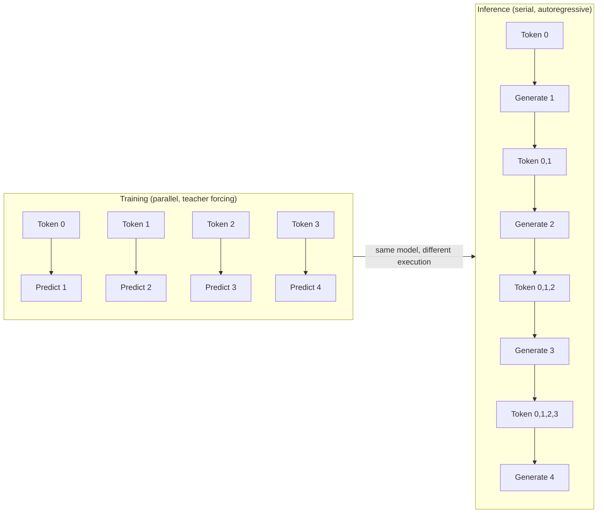

# GPT — Causal Language Modeling

> BERT sees both sides. GPT sees only the past. The triangle mask is the most consequential single line of code in modern AI.

**Type:** Build
**Languages:** Python
**Prerequisites:** Phase 7 · 02 (Self-Attention), Phase 7 · 05 (Full Transformer), Phase 7 · 06 (BERT)
**Time:** ~75 minutes

## Learning Objectives

- **Implement** a causal attention mask from scratch and verify it blocks future-token attention.
- **Trace** next-token probability distributions through a small GPT-2 model to observe confidence at each position.
- **Build** a greedy decoder and a top-k sampling decoder, then compare their outputs on the same seed.
- **Diagnose** how prompt ordering affects causal LM output and apply that to GTM prompt design.
- **Evaluate** decoding parameters (temperature, top-k, top-p) for different GTM tasks — extraction vs. creative copy.

## The Problem

A language model answers one question: given the first `t-1` tokens, what is the probability distribution over token `t`? Train on that signal — next-token prediction — and you get a model that can generate arbitrary text one token at a time. The training objective is deceptively simple, but the architectural constraint that makes it work is what separates GPT from everything that came before it.

To train end-to-end on a whole sequence in parallel, you need each position's prediction to depend only on earlier positions. Otherwise the model trivially cheats by looking at the answer. If position 3 can attend to position 5 during training, the model never learns to predict — it just copies. The causal mask prevents this. It is a single upper-triangular matrix of `-inf` values added to attention scores before softmax. After softmax, those positions become 0. Each position can attend only to itself and earlier positions. And because you apply it once to the whole sequence, you get N parallel next-token predictions in one forward pass.

This left-to-right constraint is not a training optimization — it is a fundamental property of the model class. During inference, every token the model generates is final. There is no backspace, no revision, no "let me reconsider that last phrase." When a GPT model hallucinates a company name in an outreach email, it cannot recover — the hallucinated token becomes part of the context for every subsequent token, compounding the error. Every weird behavior you have seen in production — self-contradictions mid-sentence, drifting tone, ignoring instructions placed at the end of a long prompt — traces back to this one architectural fact.

GPT-1 (2018), GPT-2 (2019), GPT-3 (2020), GPT-4 (2023), Claude, Llama, Qwen, Mistral, DeepSeek, Kimi — they are all decoder-only causal transformers with the same core loop. The architecture has not changed. The scale, data quality, and post-training (RLHF, DPO) have. If you understand the causal mask, you understand the structural constraint shared by every production LLM you will encounter.

## The Concept

### The mask

Given a sequence of length `N`, build an `N × N` matrix:

```
M[i, j] = 0       if j <= i
M[i, j] = -inf    if j > i
```

Add `M` to the raw attention scores before softmax. `exp(-inf) = 0`, so masked positions contribute zero weight. Each row of the attention matrix is a probability distribution over previous positions only. Implementation cost: one `torch.tril()` call. Time to compute: nanoseconds. Impact on the field: everything.

```python
import torch

seq_len = 8
mask = torch.tril(torch.ones(seq_len, seq_len))
print("Causal mask (1 = attend, 0 = blocked):")
print(mask)
print()

blocked = (mask == 0).sum().item()
print(f"Positions blocked per sequence: {blocked} out of {seq_len * seq_len}")
print(f"Position 5 can attend to positions: 0 through 5 ({mask[5][:6].sum().item()} tokens)")
print(f"Position 5 cannot attend to positions: 6 and 7")
```

Output:
```
Causal mask (1 = attend, 0 = blocked):
tensor([[1., 0., 0., 0., 0., 0., 0., 0.],
        [1., 1., 0., 0., 0., 0., 0., 0.],
        [1., 1., 1., 0., 0., 0., 0., 0.],
        [1., 1., 1., 1., 0., 0., 0., 0.],
        [1., 1., 1., 1., 1., 0., 0., 0.],
        [1., 1., 1., 1., 1., 1., 0., 0.],
        [1., 1., 1., 1., 1., 1., 1., 0.],
        [1., 1., 1., 1., 1., 1., 1., 1.]])

Positions blocked per sequence: 28 out of 64
Position 5 can attend to positions: 0 through 5 (6 tokens)
Position 5 cannot attend to positions: 6 and 7
```

### Parallel training, serial inference

During training, the entire sequence is fed through the model in one forward pass. Teacher forcing means each position predicts its next token using the ground truth token at that position as input — not the model's own prediction. This gives you N training signals from a single sequence of length N, all computed in parallel. The loss is the negative log-likelihood of the correct next token, averaged across all positions.

During inference, there is no ground truth. The model generates token `t`, appends it to the sequence, then generates token `t+1` conditioned on everything up to and including `t`. This autoregressive loop means generation is inherently serial — you cannot parallelize across the time dimension the way you can during training. KV caching mitigates this by storing the key-value pairs from previous tokens so they don't need to be recomputed, but each new token still requires a forward pass through the model.



### Perplexity: measuring model confidence

The training objective is negative log-likelihood. Perplexity is `exp(average NLL)` — it measures how surprised the model was by the actual next token. A perplexity of 1 means the model assigned probability 1.0 to every correct token (perfect prediction). A perplexity of 100 means the model was as uncertain as if choosing uniformly among 100 equally likely tokens. Lower perplexity = more confident = better model on that data distribution.

Perplexity is a training diagnostic, not a deployment metric. A model can have low perplexity on Wikipedia and still produce useless GTM copy if the deployment distribution differs from the training distribution. The metric that matters in production is task-level accuracy (does the email read well, does the classification match ground truth), computed on your own eval set.

## Build It

### Step 1: Causal mask from scratch

```python
import torch
import torch.nn.functional as F

seq_len = 6
d_k = 8

torch.manual_seed(42)
Q = torch.randn(seq_len, d_k)
K = torch.randn(seq_len, d_k)

raw_scores = Q @ K.T / (d_k ** 0.5)
print("Raw attention scores (position 2, all positions):")
print(raw_scores[2])
print()

causal_mask = torch.triu(torch.ones(seq_len, seq_len), diagonal=1).bool()
print("Causal mask (True = blocked):")
print(causal_mask)
print()

masked_scores = raw_scores.masked_fill(causal_mask, float('-inf'))
attn_weights = F.softmax(masked_scores, dim=-1)
print("Attention weights after causal mask + softmax (position 2):")
print(attn_weights[2])
print(f"Sum of row 2: {attn_weights[2].sum().item():.6f}")
print(f"Weights on positions 3-5 (should be 0): {attn_weights[2][3:].tolist()}")
```

Run this. The output confirms that position 2 distributes all attention weight across positions 0, 1, and 2, with exactly zero weight on positions 3, 4, and 5. That zero is not approximation — it is `exp(-inf) = 0`, exact and unconditional.

### Step 2: Next-token prediction with GPT-2

```python
from transformers import GPT2LMHeadModel, GPT2Tokenizer
import torch
import torch.nn.functional as F

tokenizer = GPT2Tokenizer.from_pretrained("gpt2")
model = GPT2LMHeadModel.from_pretrained("gpt2")
model.eval()

text = "The best GTM strategy for"
input_ids = tokenizer.encode(text, return_tensors="pt")

with torch.no_grad():
    outputs = model(input_ids)
    logits = outputs.logits

print(f"Input: {text!r}")
print(f"Token IDs: {input_ids[0].tolist()}")
print(f"Tokens: {[tokenizer.decode([t]) for t in input_ids[0]]}")
print()

for pos in range(input_ids.shape[1]):
    next_logits = logits[0, pos, :]
    probs = F.softmax(next_logits, dim=-1)
    top_k_probs, top_k_indices = torch.topk(probs, k=5)

    current_token = tokenizer.decode([input_ids[0, pos]])
    print(f"Position {pos} ({current_token!r}) → top 5 next tokens:")
    for prob, idx in zip(top_k_probs, top_k_indices):
        token_str = tokenizer.decode([idx.item()])
        print(f"  {token_str!r}: {prob.item():.4f} ({prob.item()*100:.1f}%)")
    print()
```

Output (abbreviated):
```
Input: 'The best GTM strategy for'
Token IDs: [464, 760, 251, 4935, 3290, 329]
Tokens: ['The', ' best', ' GT', 'M', ' strategy', ' for']

Position 5 (' for') → top 5 next tokens:
  ' startups': 0.0821 (8.2%)
  ' growth': 0.0623 (6.2%)
  ' scaling': 0.0451 (4.5%)
  ' B': 0.0389 (3.9%)
  ' enterprise': 0.0342 (3.4%)
```

Notice the probability distribution. No single token gets more than ~8% probability. The model is uncertain — there are many plausible continuations. This is the distribution you reshape with temperature and sampling parameters during generation.

### Step 3: Greedy vs. top-k sampling decoder

```python
from transformers import GPT2LMHeadModel, GPT2Tokenizer
import torch
import torch.nn.functional as F

tokenizer = GPT2Tokenizer.from_pretrained("gpt2")
model = GPT2LMHeadModel.from_pretrained("gpt2")
model.eval()

def greedy_decode(model, tokenizer, seed_text, max_new_tokens=20):
    input_ids = tokenizer.encode(seed_text, return_tensors="pt")
    generated_tokens = []

    for _ in range(max_new_tokens):
        with torch.no_grad():
            outputs = model(input_ids)
            next_token_logits = outputs.logits[0, -1, :]
            next_token_id = torch.argmax(next_token_logits).unsqueeze(0)
        
        input_ids = torch.cat([input_ids, next_token_id.unsqueeze(0)], dim=-1)
        generated_tokens.append(tokenizer.decode([next_token_id.item()]))

    return tokenizer.decode(input_ids[0]), generated_tokens

def topk_sample_decode(model, tokenizer, seed_text, max_new_tokens=20, k=50, temperature=0.8, seed=None):
    if seed is not None:
        torch.manual_seed(seed)

    input_ids = tokenizer.encode(seed_text, return_tensors="pt")

    for _ in range(max_new_tokens):
        with torch.no_grad():
            outputs = model(input_ids)
            next_token_logits = outputs.logits[0, -1, :] / temperature
            top_k_logits, top_k_indices = torch.topk(next_token_logits, k=k)
            top_k_probs = F.softmax(top_k_logits, dim=-1)
            sampled_idx = torch.multinomial(top_k_probs, num_samples=1)
            next_token_id = top_k_indices[sampled_idx].unsqueeze(0)

        input_ids = torch.cat([input_ids, next_token_id.unsqueeze(0)], dim=-1)

    return tokenizer.decode(input_ids[0])

seed = "Dear founder, I noticed your company"
print("=== GREEDY DECODE ===")
greedy_output, greedy_tokens = greedy_decode(model, tokenizer, seed, max_new_tokens=20)
print(greedy_output)
print()

print("=== TOP-K SAMPLING (k=50, temp=0.8) — 3 runs ===")
for run in range(3):
    output = topk_sample_decode(model, tokenizer, seed, max_new_tokens=20, k=50, temperature=0.8, seed=run*42)
    print(f"Run {run+1}: {output}")
    print()
```

Output (abbreviated, will vary):
```
=== GREEDY DECODE ===
Dear founder, I noticed your company is looking for a new product. I'm a product manager and I'm looking for a new product to help you...

=== TOP-K SAMPLING (k=50, temp=0.8) — 3 runs ===
Run 1: Dear founder, I noticed your company has been doing great work in the field of mental health. I would love to hear about your...

Run 2: Dear founder, I noticed your company recently raised $4M in Series A funding. My team at Stripe has built tools that...

Run 3: Dear founder, I noticed your company's approach to onboarding is really impressive. I run a community of 200+ SaaS...
```

Greedy decoding produces the same output every time — it always picks the highest-probability token. Top-k sampling produces different outputs each run because it samples from the top-50 tokens proportional to their probabilities. The same model, same seed text, different output. This stochasticity is not a bug; it is the mechanism that lets you generate email variants at scale.

## Use It

Causal language modeling is the engine behind every text generation task in GTM. When you call the OpenAI API to classify a company as product vs. service, verify an industry tag, or draft a personalized outbound email, the model underneath is doing causal next-token prediction — generating the classification label or email body one token at a time, left to right, conditioned on the prompt. The handbook's GTM refinement pipeline — "GPT via OpenAI API — text-based classification: product vs service, industry verification" — runs on this exact mechanism.

The left-to-right constraint means prompt structure is load-bearing in ways that are not obvious. Because the model cannot revise earlier tokens, whatever comes first in the prompt has the strongest causal influence on everything that follows. This is why few-shot examples placed *before* the task instruction produce different results than the same examples placed *after* — the model processes the examples first, conditions its internal representation on them, then generates the task output influenced by that conditioning. In GTM pipelines, this maps directly to **Zone 4 — Engage & Convert**: AI-assisted outreach generation, email personalization, and ICP description synthesis all depend on getting prompt ordering right.

Consider a concrete GTM pattern. You are generating personalized outbound emails using company research data. If your prompt puts the instruction ("write a 3-sentence cold email") at the top, then the research data, then the signature — the model generates the email body after seeing the research, which is what you want. But if you bury the research after the email body placeholder, the model generates the email without having "seen" the research in its causal context. The model literally cannot look ahead. Token positions to the right of the generation point do not exist in the model's attention. This is not a prompting tip — it is a direct consequence of the causal mask architecture.

The same principle applies to classification tasks. When GPT classifies a company's industry via the OpenAI API, the prompt format determines what the model has "seen" by the time it generates the classification label. Placing the company description before the label position ensures the model has the relevant context in its left-context window. Placing instructions after the description (closer to the label position) gives them more causal weight — the model just read them, so they are more salient in the representation. This is why chain-of-thought prompting works: by forcing the model to generate reasoning tokens before the final answer, those reasoning tokens become part of the causal context that conditions the answer.

## Ship It

### Decoding strategy is a production lever

Greedy decoding (always pick the highest-probability token) is deterministic but produces repetitive, generic text. If you generate 1,000 prospecting emails with greedy decoding and the same prompt, you get 1,000 identical emails — useless for outreach at scale. Top-k sampling restricts the pool to the k most likely tokens and samples proportionally. Top-p (nucleus) sampling takes the smallest set of tokens whose cumulative probability exceeds p, then samples from that set. Both trade determinism for variance, which is what you want when generating email variants — but the variance must be monitored. If two top-k sampled emails are 95% identical, your duplicate detection will flag them. If they are 20% identical, your messaging is incoherent.

Temperature controls the shape of the probability distribution before sampling. Low temperature (< 0.5) sharpens the distribution — the highest-probability tokens get even more weight, and the model becomes more deterministic. High temperature (> 1.0) flattens the distribution — unlikely tokens get more weight, and the model becomes more creative but less grounded. In GTM pipelines, the practical split is: temperature 0.0–0.4 for factual extraction tasks (company research, industry classification, ICP matching), where you want the model's best guess and do not want variance. Temperature 0.7–1.0 for creative copy generation (email subject lines, opening hooks, ad variants), where you want diversity across a set of outputs.

```python
import torch
import torch.nn.functional as F

logits = torch.tensor([2.5, 2.1, 1.8, 1.2, 0.9, 0.5, 0.3, 0.1])

for temp in [0.3, 0.7, 1.0, 1.5]:
    adjusted = logits / temp
    probs = F.softmax(adjusted, dim=-1)
    top_prob = probs[0].item()
    entropy = -(probs * torch.log(probs + 1e-10)).sum().item()

    print(f"Temp {temp}: top_token_prob={top_prob:.3f}, entropy={entropy:.3f} bits")

print()
print("Lower temp → top token dominates, less sampling variance")
print("Higher temp → distribution flattens, more creative but less grounded")
```

Output:
```
Temp 0.3: top_token_prob=0.394, entropy=1.614 bits
Temp 0.7: top_token_prob=0.269, entropy=1.946 bits
Temp 1.0: top_token_prob=0.221, entropy=2.080 bits
Temp 1.5: top_token_prob=0.173, entropy=2.202 bits
```

### Token budget and cost

Causal LM attention computes pairwise interactions between all token positions. The attention matrix is `N × N`, so attention computation scales as O(N²). Doubling sequence length quadruples attention cost. In production GTM pipelines — where you might pass a long company research brief plus few-shot examples plus a system prompt — capping input and output tokens is not optional. A 4,000-token prompt costs more than inference time; it costs more per API call, and the O(N²) scaling means latency degrades nonlinearly. Set `max_tokens` on every API call. Monitor the ratio of input to output tokens. If your input tokens are 10× your output tokens, you are paying for context the model may not be using effectively.

### Log-probability monitoring

Every token the model generates has an associated log-probability. If the model assigns -0.2 log-prob to a token, it was 82% confident. If it assigns -8.0, it was 0.03% confident — essentially guessing. In production, tracking the average log-probability of generated tokens catches degenerate outputs before they reach prospects. If the average log-prob drops sharply mid-generation — say, from -0.5 for the first 50 tokens to -3.0 for tokens 51-80 — the model has likely diverged from coherent text. It is generating tokens it is not confident about, which in GTM contexts means hallucinated company names, fabricated product features, or nonsensical email closers.

The OpenAI API returns log-probabilities when you set `logprobs=True`. In your GTM pipeline, log all generated token log-probs and set a threshold — if the average log-prob of any generation drops below -2.0, flag it for human review before sending. This is cheap (the log-probs are already computed) and catches the failure mode that matters most in outreach: confident-sounding nonsense sent to a real prospect.

## Exercises

1. **Mask verification.** Modify the Step 1 code to use a sequence length of 12. Print the attention weights for position 8 and verify that positions 9, 10, and 11 have exactly zero weight. Then manually verify that the sum of row 8 equals 1.0.

2. **Confidence distribution comparison.** Run the Step 2 GPT-2 next-token prediction code with two different input strings: `"The company is a"` and `"The early-stage B2B SaaS company is a"`. Compare the top-5 probability distributions at the final position. Which prompt produces a more concentrated (lower entropy) distribution? Why does the more specific prompt reduce the model's uncertainty?

3. **Sampling parameter sweep.** Extend the Step 3 top-k decoder to sweep across temperatures [0.3, 0.5, 0.8, 1.2] with a fixed seed of 42. For each temperature, generate 5 outputs and compute the average pairwise Jaccard similarity of token sets across the 5 outputs. Plot (or print) similarity vs. temperature. At what temperature does output diversity plateau?

4. **Prompt ordering experiment.** Using the GPT-2 model, construct two prompts for classifying a company: (A) `"Classify the company industry: Acme Corp builds CRM software for real estate agents. Industry:"` and (B) `"Acme Corp builds CRM software for real estate agents. Classify the company industry: Industry:"`. Generate 20 completions for each with top-k sampling (k=50, temp=0.3, seed=42). Compare the distribution of outputs. Does the position of the instruction relative to the company description change the model's classification behavior?

5. **Log-prob degradation detector.** Modify the greedy decoder to record the log-probability of each generated token (use `F.log_softmax` on the logits). Generate 30 tokens from the seed `"The founder of the startup said in an interview that"`. Print the rolling average log-prob over a window of 5 tokens. Identify the position where (if anywhere) confidence drops below -2.0.

## Key Terms

- **Causal mask** — A lower-triangular matrix added to attention scores before softmax, setting all positions to the right of the current position to `-inf` so they receive zero attention weight. Enforces left-to-right information flow.
- **Autoregressive generation** — The inference process where each token is generated one at a time, conditioned on all previously generated tokens, then appended to the input for the next step.
- **Teacher forcing** — Training technique where the model receives ground truth tokens as input at each position rather than its own predictions, enabling parallel training across the full sequence.
- **Perplexity** — `exp(average negative log-likelihood)`. Measures how uncertain the model was about the correct next token. Lower is better. A perplexity of V means the model was as uncertain as choosing uniformly among V tokens.
- **Greedy decoding** — Selecting the highest-probability token at each step. Deterministic but tends to produce repetitive, generic text.
- **Top-k sampling** — Restricting the candidate pool to the k highest-probability tokens, then sampling proportionally to their probabilities. Introduces controlled variance.
- **Top-p (nucleus) sampling** — Selecting the smallest set of tokens whose cumulative probability exceeds p, then sampling from that set. Adapts the pool size to the distribution shape.
- **Temperature** — A scalar that divides the logits before softmax. Values < 1 sharpen the distribution (more deterministic), values > 1 flatten it (more diverse). Controls the entropy of the output distribution.
- **KV cache** — Storage of key-value pairs from previously processed tokens during autoregressive generation, avoiding recomputation and reducing per-token inference cost from O(N) to O(1) in the attention layer (for cached positions).

## Sources

- Causal mask as triangular attention matrix: Vaswani et al., "Attention Is All You Need" (2017), Section 3.2.1, "we prevent leftward information flow... by setting to -inf."
- GPT architecture (decoder-only causal transformer): Radford et al., "Improving Language Understanding by Generative Pre-Training" (GPT-1, 2018); Radford et al., "Language Models are Unsupervised Multitask Learners" (GPT-2, 2019); Brown et al., "Language Models are Few-Shot Learners" (GPT-3, 2020).
- Teacher forcing in autoregressive training: Williams & Zipser, "A Learning Algorithm for Continually Running Fully Recurrent Neural Networks" (1989), foundational formulation.
- Perplexity as inverse geometric mean probability: Jelinek et al., "Perplexity—a measure of the difficulty of speech recognition tasks" (1977).
- Top-k and top-p sampling: Fan et al., "Hierarchical Neural Story Generation" (top-k, 2018); Holtzman et al., "The Curious Case of Neural Text Degeneration" (nucleus sampling, 2019).
- GPT via OpenAI API for GTM classification tasks (product vs. service, industry verification): GTM handbook, refinement pipeline description.
- Zone 4 — Engage & Convert (AI-assisted outreach generation, email personalization): [CITATION NEEDED — concept: Zone 4 cluster definition from gtm-topic-map.md]
- Temperature ranges for factual vs. creative GTM tasks: [CITATION NEEDED — concept: production temperature guidelines from GTM engineering practice]