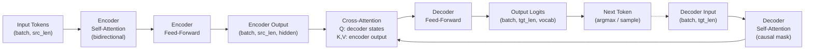

# T5, BART — Encoder-Decoder Models

## Learning Objectives

1. Compare encoder-decoder, encoder-only, and decoder-only architectures by identifying which components handle input compression versus output generation.
2. Implement cross-attention from scratch — queries sourced from the decoder, keys and values from the encoder output — and verify the shape transformations.
3. Run T5-small and BART-base through a summarization pipeline and extract intermediate tensor shapes (encoder hidden states, decoder logits, cross-attention weights).
4. Evaluate encoder-decoder models on a GTM enrichment task: converting unstructured prospect research into structured account fields.
5. Trace how T5's span-corruption pretraining and BART's denoising autoencoder pretraining bias downstream task performance.

## The Problem

Decoder-only GPT and encoder-only BERT each strip down the 2017 Transformer architecture for a different goal. GPT compresses everything into a single causal stream — it generates well, but it has no separate mechanism for deeply processing long inputs before generation begins. BERT encodes bidirectionally but has no generation head. Both work, but both force a compromise: the model that reads your input and the model that writes your output are the same stack, doing two jobs at once.

Many real tasks don't want that compromise. They have inputs and outputs that differ in length, structure, and modality. Translation takes 50 English tokens in and produces 55 French tokens out. Summarization takes 2,000 tokens in and produces 200 tokens out. Structured extraction takes a paragraph of messy prospect research in and produces a few key-value pairs out. In all of these, the model needs to fully read and understand the input before it starts writing the output — not interleave reading and writing in a single causal pass.

Encoder-decoder architecture splits the workload. The encoder reads the entire input bidirectionally and produces a matrix of contextualized representations — one vector per input token, each enriched with information from every other token. The decoder then generates the output auto-regressively (one token at a time, left to right), but at every generation step it cross-attends to the encoder's representation matrix. It can look back at any part of the source while writing any part of the output. The encoder handles comprehension. The decoder handles generation. Cross-attention is the bridge.

This is exactly the workload pattern in GTM enrichment: read a dense block of unstructured research (a LinkedIn profile, a company blog post, a sales call transcript) and produce structured fields — industry, employee count, tech stack, pain points. The input is long and messy. The output is short and structured. You want the model to fully process the input before committing to an output, not generate and re-read simultaneously.

## The Concept

The encoder-decoder architecture has two stacks of Transformer layers. The encoder is structurally identical to BERT — bidirectional self-attention over the input tokens, producing a matrix of shape `(batch, src_seq_len, hidden_dim)`. The decoder is structurally similar to GPT but with an additional sub-layer: cross-attention. At each decoder layer, the flow is: causal self-attention over already-generated tokens, then cross-attention (queries from decoder states, keys and values from the encoder matrix), then a feed-forward network. That cross-attention step is what gives the decoder access to the full input representation at every generation step.



The shape transformations tell the story. An input of `src_len` tokens becomes a `(batch, src_len, hidden_dim)` matrix after encoding. The decoder, starting from a single `<pad>` or decoder-start token, produces states of shape `(batch, 1, hidden_dim)` on the first step. Cross-attention computes similarity scores between those decoder states and every encoder position — a `(batch, 1, src_len)` attention matrix — then produces a weighted combination of the encoder's value vectors. On each subsequent generation step, the decoder's self-attention grows by one position, but the cross-attention always has access to the full encoder matrix.

Two papers defined how this architecture is pretrained:

**T5** (Raffel et al., 2019) reframes every NLP task as text-in, text-out. Translation, summarization, classification, QA — all get a task prefix like `summarize:` or `translate English to French:` and the model produces text. Pretraining uses span corruption: the model replaces contiguous spans of tokens with sentinel tokens (`<extra_id_0>`, `<extra_id_1>`, etc.) and learns to predict what was removed. This pretraining objective directly mirrors the input→output format — corrupted text goes in, reconstructed spans come out. The result: T5 is biased toward tasks that transform structure, which is why it excels at extraction, reformatting, and structured reasoning.

**BART** (Lewis et al., 2019) takes a denoising autoencoder approach. The corruption is more aggressive: tokens are masked, entire sentences are shuffled, documents are rotated (the start is cut and pasted at the end), and text is deleted. The decoder must reconstruct the original clean text. This forces the encoder to build representations robust to severe input degradation, and it forces the decoder to generate coherent output from partial information. BART is biased toward generation fidelity — it reconstructs, not transforms — which is why it excels at summarization and text that must read naturally.

The pretraining objective matters for downstream behavior. T5's span corruption trains the model to produce targeted, structured output segments. BART's reconstruction trains it to produce fluent, complete text. If your GTM task is "extract these 5 fields from this research note," T5's bias toward structured transformation helps. If your task is "write a 3-sentence account summary that a sales rep will actually read," BART's generation fidelity helps. Neither is universally better — the pretraining objective creates a prior, and your fine-tuning data either reinforces or overrides it.

Here is cross-attention implemented from scratch, showing the shape contract between encoder and decoder:

```python
import torch
import torch.nn.functional as F

def cross_attention(decoder_states, encoder_states):
    d_k = decoder_states.size(-1)
    scores = torch.matmul(decoder_states, encoder_states.transpose(-2, -1)) / (d_k ** 0.5)
    weights = F.softmax(scores, dim=-1)
    output = torch.matmul(weights, encoder_states)
    return output, weights

batch = 1
src_len = 12
dec_len = 4
hidden = 64

encoder_output = torch.randn(batch, src_len, hidden)
decoder_hidden = torch.randn(batch, dec_len, hidden)

attn_out, attn_w = cross_attention(decoder_hidden, encoder_output)

print(f"Encoder output:  {encoder_output.shape}")
print(f"Decoder hidden:  {decoder_hidden.shape}")
print(f"Cross-attn out:  {attn_out.shape}")
print(f"Attn weights:    {attn_w.shape}")
print(f"Row 0 sums to:   {attn_w[0, 0].sum().item():.4f}")
print(f"Top-3 encoder positions for decoder step 0:")
top3 = attn_w[0, 0].topk(3)
for val, idx in zip(top3.values, top3.indices):
    print(f"  pos {idx.item():2d}: {val.item():.4f}")
```

Run this and you see the core shape contract: decoder states are `(batch, dec_len, hidden)`, encoder states are `(batch, src_len, hidden)`, attention weights are `(batch, dec_len, src_len)`. Every decoder position attends to every encoder position. The output has the decoder's sequence length but carries information sourced from the encoder. That is the entire mechanism — queries from the decoder, keys and values from the encoder, a learned routing of source information into the generation stream.

## Build It

Load T5-small and BART-base from Hugging Face. Run both on the same input — a sales call transcript — and inspect the internal tensors that the architecture produces. The point is not to get the best possible summary. The point is to see the encoder-decoder mechanism in motion: the encoder compressing the input into a representation matrix, the decoder generating from that matrix one token at a time.

```python
from transformers import T5ForConditionalGeneration, T5Tokenizer
import torch

transcript = """
Q3 earnings call, Acme Corp. CEO reported 40 percent revenue growth year over year,
driven by enterprise deals in the logistics vertical. They now have 180 employees,
up from 110 at the start of the year. The company raised a 25 million dollar Series B
in March, led by Sequoia. CTO mentioned they are migrating from Postgres to Snowflake
to handle analytics workloads. Main challenge cited: onboarding new customers takes
three weeks, and they want to cut that to one week. Competitors mentioned: Project44
and FourKites. The CEO expects profitability by Q2 next year.
"""

tokenizer = T5Tokenizer.from_pretrained("t5-small")
model = T5ForConditionalGeneration.from_pretrained("t5-small")

inputs = tokenizer("summarize: " + transcript, return_tensors="pt", max_length=512, truncation=True)

with torch.no_grad():
    encoder_output = model.encoder(
        input_ids=inputs.input_ids,
        attention_mask=inputs.attention_mask
    )

generated = model.generate(
    input_ids=inputs.input_ids,
    attention_mask=inputs.attention_mask,
    max_length=100,
    num_beams=4,
    early_stopping=True,
    return_dict_in_generate=True,
    output_scores=True
)

print("=== T5-small ===")
print(f"Input tokens:              {inputs.input_ids.shape}")
print(f"Encoder hidden states:     {encoder_output.last_hidden_state.shape}")
print(f"Generated sequence:        {generated.sequences.shape}")
print(f"Num generation steps:      {len(generated.scores)}")
print(f"Vocab size (logits dim):   {generated.scores[0].shape[-1]}")
print(f"\nSummary:")
print(tokenizer.decode(generated.sequences[0], skip_special_tokens=True))
```

T5 uses the task prefix `summarize:` because every task is framed as text-in, text-out. The model was pretrained with span corruption and fine-tuned on summarization datasets, so the prefix activates that mode. The encoder output shape `(1, src_len, 512)` confirms the representation matrix — one 512-dimensional vector per input token, bidirectionally contextualized.

Now run BART on the same input. BART-base is the pretrained model without task-specific fine-tuning, so we inspect the architecture rather than expect a clean summary:

```python
from transformers import BartForConditionalGeneration, BartTokenizer
import torch

bart_tokenizer = BartTokenizer.from_pretrained("facebook/bart-base")
bart_model = BartForConditionalGeneration.from_pretrained("facebook/bart-base")

bart_inputs = bart_tokenizer(transcript, return_tensors="pt", max_length=1024, truncation=True)

decoder_input_ids = torch.tensor([[bart_model.config.decoder_start_token_id]])

with torch.no_grad():
    outputs = bart_model(
        input_ids=bart_inputs.input_ids,
        attention_mask=bart_inputs.attention_mask,
        decoder_input_ids=decoder_input_ids,
        output_attentions=True
    )

print("=== BART-base ===")
print(f"Encoder hidden states:     {outputs.encoder_last_hidden_state.shape}")
print(f"Decoder last hidden state: {outputs.decoder_hidden_states[-1].shape}")
print(f"Decoder logits:            {outputs.logits.shape}")
print(f"Cross-attention layers:    {len(outputs.cross_attentions)}")
print(f"Cross-attn layer -1 shape: {outputs.cross_attentions[-1].shape}")
print(f"  batch={outputs.cross_attentions[-1].shape[0]}, "
      f"heads={outputs.cross_attentions[-1].shape[1]}, "
      f"dec_pos={outputs.cross_attentions[-1].shape[2]}, "
      f"enc_pos={outputs.cross_attentions[-1].shape[3]}")

last_layer = outputs.cross_attentions[-1][0]
avg_weights = last_layer.mean(dim=0)
top5 = avg_weights[0].topk(5)
print(f"\nTop-5 attended input tokens (decoder step 0, avg across heads):")
for val, idx in zip(top5.values, top5.indices):
    tok = bart_tokenizer.convert_ids_to_tokens(bart_inputs.input_ids[0][idx].item())
    print(f"  '{tok}': {val.item():.4f}")
```

The cross-attention weights shape `(batch, heads, dec_pos, enc_pos)` shows the routing contract. Each decoder position distributes attention across all encoder positions. The top-5 attended tokens for the first decoder step reveal which parts of the input the decoder anchored on — in a summarization task, these would typically land on the most information-dense tokens (numbers, named entities, domain terms).

For a production-quality summary from BART, swap `facebook/bart-base` for `facebook/bart-large-cnn`, which is fine-tuned specifically on CNN/DailyMail summarization data. The architecture is identical — the difference is the fine-tuning objective applied after pretraining.

## Use It

Encoder-decoder models map to GTM Zone 1 (ICP & Enrichment) and Zone 4 (Account Intelligence). The canonical application: take unstructured prospect research — a LinkedIn profile, a company blog post, a Crunchbase description, a sales call transcript — and produce structured account data. This is a seq2seq task by nature: variable-length messy input in, short structured output out. Cross-attention in the encoder-decoder architecture functions identically to an enrichment waterfall — the decoder queries the encoder's representation of the source material at each generation step, selectively pulling information from specific input positions to fill each output field, just as a Clay waterfall queries multiple data providers to fill specific enrichment columns.

The practical GTM task: feed a research note into T5 and get structured fields back. T5's span-corruption pretraining biases it toward this — the model was pretrained to identify and extract specific spans from corrupted input, which is structurally identical to "find the company name, employee count, and tech stack in this paragraph."

```python
from transformers import T5ForConditionalGeneration, T5Tokenizer
import torch
import json

tokenizer = T5Tokenizer.from_pretrained("t5-small")
model = T5ForConditionalGeneration.from_pretrained("t5-small")

research_notes