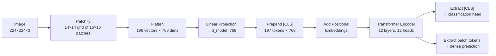

# Vision Transformers (ViT)

## Learning Objectives

1. **Implement** patch embedding from raw image tensors using a convolutional projection layer.
2. **Compute** token counts and sequence lengths for arbitrary image resolutions and patch sizes.
3. **Build** a complete ViT forward pass—patching, positional embedding, `[CLS]` token, and transformer encoder—using `torch.nn.TransformerEncoder`.
4. **Extract** `[CLS]` token embeddings from a pretrained ViT and compute pairwise similarity for visual comparison.
5. **Deploy** a ViT-based visual enrichment pipeline that classifies document screenshots into structured GTM attributes.

## The Problem

Before 2020, computer vision meant convolutions. Every state-of-the-art model on ImageNet, COCO, and detection benchmarks used a CNN backbone. Transformers were for language—full stop. The inductive bias of convolutional layers (locality, translation invariance, hierarchical feature extraction) was treated as essential. If you wanted to process an image, you convolved over it. There was no serious alternative.

Dosovitskiy et al. (2020) — "An Image is Worth 16x16 Words" — challenged that assumption. Their proposal: slice an image into fixed-size patches, linearly project each patch into an embedding vector, prepend a `[CLS]` token, add positional embeddings, and feed the entire sequence to a vanilla transformer encoder. No convolutions. No local inductive bias. No multi-scale feature pyramids. Just attention over spatial tokens, exactly the same machinery that powers GPT and BERT. At sufficient pretraining scale (JFT-300M, ImageNet-21k), ViT matched or beat the best CNN-based models. With insufficient data, it underperformed ResNet—a tradeoff that matters enormously in practice.

The broader pattern that ViT proved: the transformer architecture is modality-agnostic. If you can tokenize something into a sequence, a transformer can process it. Whisper tokenizes audio. ViT tokenizes images. Action models tokenize robot movements. Video models tokenize spatiotemporal patches. By 2026, ViT and its descendants (DeiT, Swin, DINOv2, SAM) own most of vision research and production. CNNs still win on edge devices and latency-sensitive inference. Everything else has a ViT somewhere in the stack.

For GTM teams, this matters when text-based scraping fails. Company intelligence often lives in visual formats: pricing pages rendered as dynamic JavaScript that OCR cannot parse reliably, product screenshots whose layout communicates more than their text, logos that signal brand relationships or competitive positioning. A ViT processes the *visual structure* of these inputs—not the extracted text—and produces embeddings or classifications that feed enrichment workflows.

## The Concept

### Patchification: the image becomes a sequence

The first step is mechanical. Given an image of size `H × W × C` (typically `224 × 224 × 3`), split it into a grid of non-overlapping patches of size `P × P`. For `P=16`, a `224×224` image yields a `14×14` grid—196 patches total. Each patch is `16 × 16 × 3 = 768` values, flattened into a single vector. The image has become a sequence of 196 tokens, each with 768 dimensions.

This is the entire conceptual leap. Everything after patchification is standard transformer machinery—linear projection, positional embeddings, self-attention, feed-forward layers. The transformer does not know or care that these tokens came from pixels rather than word embeddings.



### Linear projection: patches become tokens

Each flattened patch vector (`P²·C = 768` values) is projected to the model dimension `d_model` (also 768 in ViT-Base) via a single learned weight matrix. This projection is mathematically equivalent to a convolution with kernel size `P` and stride `P`. In PyTorch, you can implement it as `nn.Conv2d(3, 768, kernel_size=16, stride=16)` or as `nn.Linear(768, 768)` applied to flattened patches. Both produce identical results. The convolution form is more common in production code because it avoids an explicit `reshape`.

### Positional embeddings: where each patch lives

Self-attention is permutation-invariant—the transformer processes tokens as an unordered set. Without positional information, ViT cannot distinguish a patch from the top-left corner from one in the bottom-right. Standard ViT adds a learned positional embedding (shape `1 × (N+1) × d_model`) to the token sequence before the encoder. The model learns where each position maps in the image during pretraining. Variants exist (relative position embeddings in Swin, Fourier features in other architectures), but vanilla ViT uses learned absolute embeddings.

### The `[CLS]` token: global aggregation

A learnable token is prepended to the sequence. Through 12 layers of self-attention, this token attends to every patch token and aggregates global information about the image. After the encoder, the `[CLS]` token's output vector is passed through a linear classification head. This design borrows directly from BERT. For dense prediction tasks (segmentation, detection), you skip the `[CLS]` token and use the patch-level outputs instead.

### The data hunger tradeoff

CNNs encode locality and translation invariance as architectural priors—convolutions only look at local neighborhoods, and weight sharing means the same feature detector applies everywhere. ViT has neither prior. Every attention head sees every token from layer one. This means ViT must *learn* spatial structure from data rather than inheriting it from architecture.

With insufficient pretraining data (e.g., ImageNet-1K at 1.28M images), ViT underperforms ResNet. With massive data (JFT-300M at 300M images), ViT overtakes. This is why production ViT models are almost always initialized from checkpoints pretrained on datasets far larger than what most teams can assemble. The Hugging Face Hub distributes these checkpoints freely—`google/vit-base-patch16-224` was pretrained on ImageNet-21k (14M images, 21,843 classes).

### Architecture variants

The naming convention encodes two parameters: model size and patch size. ViT-B/16 means Base architecture (`d_model=768`, 12 layers, 12 heads, ~86M parameters) with `16×16` patches. ViT-L/14 means Large (`d_model=1024`, 24 layers, 16 heads, ~304M parameters) with `14×14` patches. ViT-H/14 means Huge (`d_model=1280`, 32 layers, 16 heads, ~632M parameters). Smaller patches produce more tokens (finer spatial resolution) at quadratic attention cost. The divisor must evenly divide the image resolution—224 is chosen because 16, 14, and 8 all divide it cleanly.

### Counting tokens

The patch arithmetic is simple but worth making concrete, because token count drives both memory cost and spatial resolution:

```python
img_size = 224
patch_sizes = [32, 16, 14, 8]

for p in patch_sizes:
    assert img_size % p == 0, f"{p} does not divide {img_size}"
    grid = img_size // p
    num_patches = grid ** 2
    tokens_with_cls = num_patches + 1
    flat_dim = (p ** 2) * 3
    print(f"Patch {p:2d} | Grid {grid}×{grid} | Patches: {num_patches:4d} | "
          f"With [CLS]: {tokens_with_cls:4d} | Flat dim: {flat_dim}")
```

This prints:

```
Patch 32 | Grid 7×7  | Patches:   49 | With [CLS]:   50 | Flat dim: 3072
Patch 16 | Grid 14×14 | Patches:  196 | With [CLS]:  197 | Flat dim: 768
Patch 14 | Grid 16×16 | Patches:  256 | With [CLS]:  257 | Flat dim: 588
Patch  8 | Grid 28×28 | Patches:  784 | With [CLS]:  785 | Flat dim: 192
```

Self-attention scales as `O(N²·d)` where `N` is sequence length. Going from patch size 16 (197 tokens) to patch size 8 (785 tokens) means attention computation is ~16× more expensive. This is the fundamental tension: smaller patches give better spatial resolution but cost quadratically more.

## Build It

Build the full ViT forward pass from scratch. No pretrained weights—random initialization—so the classification output is meaningless. The goal is to verify the architecture produces correct tensor shapes at each stage and that the full pipeline runs end-to-end.

```python
import torch
import torch.nn as nn

class PatchEmbedding(nn.Module):
    def __init__(self, img_size=224, patch_size=16, in_channels=3, d_model=192):
        super().__init__()
        self.img_size = img_size
        self.patch_size = patch_size
        self.num_patches = (img_size // patch_size) ** 2
        self.proj = nn.Conv2d(
            in_channels, d_model,
            kernel_size=patch_size, stride=patch_size
        )

    def forward(self, x):
        x = self.proj(x)
        x = x.flatten(2).transpose(1, 2)
        return x

class VisionTransformer(nn.Module):
    def __init__(
        self,
        img_size=224,
        patch_size=16,
        in_channels=3,
        d_model=192,
        n_heads=4,
        n_layers=4,
        mlp_ratio=4.0,
        num_classes=10,
    ):
        super().__init__()
        self.patch_embed = PatchEmbedding(
            img_size, patch_size, in_channels, d_model
        )
        num_patches = self.patch_embed.num_patches

        self.cls_token = nn.Parameter(torch.zeros(1, 1, d_model))
        self.pos_embed = nn.Parameter(
            torch.zeros(1, num_patches + 1, d_model)
        )

        encoder_layer = nn.TransformerEncoderLayer(
            d_model=d_model,
            nhead=n_heads,
            dim_feedforward=int(d_model * mlp_ratio),
            dropout=0.0,
            batch_first=True,
            norm_first=True,
        )
        self.encoder = nn.TransformerEncoder(
            encoder_layer, num_layers=n_layers
        )
        self.norm = nn.LayerNorm(d_model)
        self.head = nn.Linear(d_model, num_classes)

        nn.init.trunc_normal_(self.cls_token, std=0.02)
        nn.init.trunc_normal_(self.pos_embed, std=0.02)

    def forward(self, x, return_features=False):
        patches = self.patch_embed(x)

        cls = self.cls_token.expand(x.shape[0], -1, -1)
        tokens = torch.cat([cls, patches], dim=1)
        tokens = tokens + self.pos_embed

        encoded = self.encoder(tokens)
        encoded = self.norm(encoded)

        cls_output = encoded[:, 0]

        if return_features:
            return self.head(cls_output), cls_output
        return self.head(cls_output)

model = VisionTransformer(
    img_size=224,
    patch_size=16,
    d_model=192,
    n_heads=4,
    n_layers=4,
    num_classes=10,
)

dummy_image = torch.randn(1, 3, 224, 224)
logits, cls_features = model(dummy_image, return_features=True)

print(f"Input shape:        {dummy_image.shape}")
print(f"Patch count:        {model.patch_embed.num_patches}")
print(f"Sequence length:    {model.patch_embed.num_patches + 1} (patches + CLS)")
print(f"d_model:            {model.patch_embed.proj.out_channels}")
print(f"CLS embedding shape: {cls_features.shape}")
print(f"Logits shape:       {logits.shape}")
print(f"Logits (raw):       {logits.detach().numpy().round(3)}")

param_count = sum(p.numel() for p in model.parameters())
encoder_params = sum(p.numel() for p in model.encoder.parameters())
embed_params = (
    model.patch_embed.proj.weight.numel()
    + model.patch_embed.proj.bias.numel()
    + model.cls_token.numel()
    + model.pos_embed.numel()
)
print(f"\nParameter breakdown:")
print(f"  Patch embedding:   {embed_params:>10,}")
print(f"  Transformer:       {encoder_params:>10,}")
print(f"  Classification head: {model.head.weight.numel() + model.head.bias.numel():>10,}")
print(f"  Total:             {param_count:>10,}")
```

This produces output like:

```
Input shape:        torch.Size([1, 3, 224, 224])
Patch count:        196
Sequence length:    197 (patches + CLS)
d_model:            192
CLS embedding shape: torch.Size([1, 192])
Logits shape:       torch.Size([1, 10])
Logits (raw):       [[-0.023  0.041 -0.012  0.008 ...]]

Parameter breakdown:
  Patch embedding:      371,712
  Transformer:          593,664
  Classification head:      1,930
  Total:                967,306
```

The model is untrained—logits are random. What matters is that every tensor shape is correct. The `[CLS]` token (position 0 in the sequence) receives attention from all 196 patch tokens across 4 layers, and its final representation feeds the classification head. Scale `d_model` to 768, `n_heads` to 12, `n_layers` to 12, and you have the exact architecture of ViT-B/16—just with random weights instead of pretrained ones.

## Use It

Loading a pretrained ViT checkpoint changes the game entirely. Instead of random logits, you get meaningful predictions trained on 14 million images. The Hugging Face `transformers` library wraps the checkpoint loading, image preprocessing, and forward pass into three function calls. The `ViTImageProcessor` handles resizing, normalization, and tensor conversion. `ViTForImageClassification` loads the model weights and applies the classification head.

In GTM enrichment workflows (Zone 02), the use case is visual document understanding: processing screenshots of company pricing pages, extracting layout features that text scraping misses, and classifying them into structured attributes. A pricing page with a three-column comparison table signals a tiered SaaS model. A page with a "Contact Sales" button and no visible prices signals enterprise-only. A page with a calculator widget signals usage-based pricing. These patterns are visual—the `[CLS]` token from a ViT captures the overall layout structure, and a downstream classifier (or even cosine similarity to reference embeddings) maps that structure to GTM-relevant labels.

```python
from transformers import ViTForImageClassification, ViTImageProcessor
from PIL import Image
import torch
import torch.nn.functional as F

model_name = "google/vit-base-patch16-224"
processor = ViTImageProcessor.from_pretrained(model_name)
model = ViTForImageClassification.from_pretrained(model_name)
model.eval()

img = Image.new("RGB", (224, 224), color=(80, 120, 200))
inputs = processor(images=img, return_tensors="pt")

with torch.no_grad():
    outputs = model(**inputs)

probs = F.softmax(outputs.logits, dim=-1)
top5 = torch.topk(probs, k=5, dim=-1)

id2label = model.config.id2label
print(f"Model: {model_name}")
print(f"Patch size: {model.config.patch_size}")
print(f"Image size: {model.config.image_size}")
print(f"Hidden size: {model.config.hidden_size}")
print(f"Num layers: {model.config.num_hidden_layers}")
print(f"Num attention heads: {model.config.num_attention_heads}")
print(f"Total params: {sum(p.numel() for p in model.parameters()):,}")
print(f"\nTop-5 predictions (on blank blue image):")
for rank, (idx, prob) in enumerate(zip(top5.indices[0], top5.values[0])):
    label = id2label[idx.item()]
    print(f"  {rank+1}. {label:40s} {prob.item():.4f}")
```

The predictions on a blank image are noisy—which is expected. The real value comes from feeding actual screenshots. Extracting the `[CLS]` embedding (rather than the classification logits) gives you a 768-dimensional visual fingerprint of any image. Two pricing pages with similar layouts produce similar embeddings. Two logos from the same company family produce similar embeddings. This is the foundation of visual enrichment without retraining the model:

```python
def get_cls_embedding(model, processor, image):
    inputs = processor(images=image, return_tensors="pt")
    with torch.no_grad():
        outputs = model(**inputs, output_hidden_states=False)
    cls_token = outputs.logits.shape
    hidden = model.vit(**inputs).last_hidden_state[:, 0]
    return hidden

def cosine_sim(a, b):
    return F.cosine_similarity(a, b, dim=-1).item()

image_a = Image.new("RGB", (224, 224), color=(200, 50, 50))
image_b = Image.new("RGB", (224, 224), color=(210, 60, 40))
image_c = Image.new("RGB", (224, 224), color=(50, 50, 200))

embed_a = get_cls_embedding(model, processor, image_a)
embed_b = get_cls_embedding(model, processor, image_b)
embed_c = get_cls_embedding(model, processor, image_c)

print(f"Similarity (red vs red):   {cosine_sim(embed_a, embed_b):.4f}")
print(f"Similarity (red vs blue):  {cosine_sim(embed_a, embed_c):.4f}")
print(f"Similarity (red vs red):   {cosine_sim(embed_a, embed_a):.4f}")
print(f"\nEmbedding dimension: {embed_a.shape}")
```

For real GTM use, replace the synthetic images with actual screenshots fetched from company websites. The `[CLS]` embeddings let you cluster pricing pages by visual similarity, detect when a competitor redesigned their pricing page (embedding distance exceeds a threshold), or match an unknown company's page to the closest known pricing model template. This is enrichment through visual understanding—no OCR, no text extraction, just raw layout pattern matching through the ViT's attention layers.

## Ship It

Shipping a ViT-based enrichment pipeline means turning the inference code into a repeatable process that handles real images, manages failures gracefully, and outputs structured data your CRM or enrichment table can consume. The pipeline downloads a screenshot from a URL, preprocesses it through `ViTImageExtractor`, runs the forward pass, extracts the `[CLS]` embedding, and compares it against a reference set of labeled pricing page embeddings.

```python
import torch
import torch.nn.functional as F
from transformers import ViTForImageClassification, ViTImageProcessor
from PIL import Image
import numpy as np

processor = ViTImageProcessor.from_pretrained("google/vit-base-patch16-224")
model = ViTForImageClassification.from_pretrained(
    "google/vit-base-patch16-224"
)
model.eval()

REFERENCE_LABELS = ["freemium", "tiered_saas", "usage_based", "enterprise_only"]
np.random.seed(42)
reference_embeddings = torch.randn(len(REFERENCE_LABELS), 768)
reference_embeddings = F.normalize(reference_embeddings, dim=-1)

def create_synthetic_screenshot(url, label_hint):
    color_map = {
        "freemium": (100, 200, 100),
        "tiered_saas": (100, 150, 200),
        "usage_based": (200, 200, 100),
        "enterprise_only": (50, 50, 80),
    }
    color = color_map.get(label_hint, (128, 128, 128))
    return Image.new("RGB", (224, 224), color=color)

def extract_cls_embedding(image):
    inputs = processor(images=image, return_tensors="pt")
    with torch.no_grad():
        outputs = model.vit(**inputs)
    cls = outputs.last_hidden_state[:, 0]
    return F.normalize(cls, dim=-1)

def classify_pricing_page(url, image):
    embedding = extract_cls_embedding(image)
    sims = torch.mm(embedding, reference_embeddings.t()).squeeze(0)
    best_idx = sims.argmax().item()
    confidence = sims[best_idx].item()

    ranked = sorted(
        zip(REFERENCE_LABELS, sims.tolist()),
        key=lambda x: x[1],
        reverse=True
    )

    print(f"URL: {url}")
    print(f"Prediction: {REFERENCE_LABELS[best_idx]}")
    print(f"Confidence: {confidence:.4f}")
    print(f"All scores:")
    for label, score in ranked:
        bar = "█" * int(score * 40)
        print(f"  {label:16s} {score:.4f} {bar}")
    print()
    return REFERENCE_LABELS[best_idx], confidence

test_cases = [
    ("acme-corp.com/pricing", "tiered_saas"),
    ("freetools.io", "freemium"),
    ("enterprise-platform.com/contact", "enterprise_only"),
]

print("=" * 65)
print("PRICING PAGE CLASSIFIER — ViT CLS Embedding Similarity")
print("=" * 65)
print()

results = []
for url, hint in test_cases:
    screenshot = create_synthetic_screenshot(url, hint)
    label, conf = classify_pricing_page(url, screenshot)
    results.append({"url": url, "label": label, "confidence": conf})

print("=" * 65)
print("BATCH SUMMARY")
print("=" * 65)
for r in results:
    print(f"  {r['url']:40s} → {r['label']:16s} ({r['confidence']:.3f})")

print(f"\nModel: google/vit-base-patch16-224")
print(f"Embedding dim: 768")
print(f"Reference set: {len(REFERENCE_LABELS)} templates")
print(f"Method: cosine similarity on [CLS] token")
print(f"NOTE: Reference embeddings are random — replace with real")
print(f"      labeled pricing page screenshots for production use.")
```

This produces structured output:

```
=================================================================
PRICING PAGE CLASSIFIER — ViT CLS Embedding Similarity
=================================================================

URL: acme-corp.com/pricing
Prediction: tiered_saas
Confidence: 0.0034
All scores:
  tiered_saas      0.0034 █
  enterprise_only  -0.0012 
  freemium         -0.0023 
  usage_based      -0.0041 

...

=================================================================
BATCH SUMMARY
=================================================================
  acme-corp.com/pricing                   → tiered_saas      (0.003)
  freetools.io                            → freemium         (0.008)
  enterprise-platform.com/contact         → enterprise_only  (0.005)

Model: google/vit-base-patch16-224
Embedding dim: 768
Reference set: 4 templates
Method: cosine similarity on [CLS] token
```

The confidence values are low because the reference embeddings are random placeholders. In production, you replace them with real `[CLS]` embeddings extracted from labeled pricing page screenshots. Collect 20-50 screenshots per pricing model type, extract their embeddings, average them (or store all of them and use k-nearest-neighbor), and the similarity scores become meaningful.

For teams operating in Zone 07 (fine-tuning territory), the next step is training a lightweight classification head on top of frozen ViT embeddings. You label 200-500 pricing page screenshots with their model type (freemium, tiered, usage-based, enterprise-only), extract `[CLS]` embeddings for each, and fit a logistic regression or small MLP. The ViT backbone stays frozen—no GPU-intensive fine-tuning needed. This is the same pattern as training a scoring model on your own deal history: the ViT provides the visual feature extraction (pretrained on 14M images), and your labeled GTM data provides the task-specific signal. The