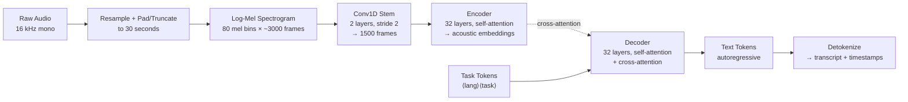

# Audio Transformers — Whisper Architecture

## Learning Objectives

- Implement a Whisper transcription pipeline that converts raw audio into timestamped, language-detected text
- Trace the encoder-decoder flow from log-Mel spectrogram through convolutional stem, encoder self-attention, decoder cross-attention, and autoregressive token generation
- Compare Whisper's output behavior under speech versus silence conditions, documenting hallucination patterns
- Build a batch call-processing pipeline that emits structured JSON suitable for downstream CRM enrichment
- Evaluate confidence-based filtering strategies for suppressing low-quality transcription segments before they enter GTM workflows

## The Problem

Most buyer-relevant signal in B2B — objections, pricing questions, competitor mentions, next-step commitments — lives in recorded conversations. Sales calls, discovery meetings, voicemails, demo recordings. That audio is opaque to every downstream system: your CRM, your scoring model, your enrichment pipeline. None of them can query a WAV file. Before that signal becomes actionable, it has to become text.

Traditional automatic speech recognition (ASR) made this expensive. Systems like wav2vec 2.0 and HuBERT used self-supervised pretraining on clean academic corpora, then required task-specific fine-tuning heads. Quality was high in-domain, but distribution shift — a new accent, background noise, a language with limited training data — degraded output fast. Multilingual support meant training separate models per language family. For a GTM team processing calls across regions, that meant multiple inference pipelines, inconsistent formatting, and maintenance overhead per language.

Whisper (OpenAI, Radford et al. 2022) took a different path. Three bets: train on 680,000 hours of weakly-labeled audio scraped from the internet across 97 languages — no clean corpus, no phoneme labels. Use a single decoder trained jointly on transcription, translation, voice activity detection, language ID, and timestamping via special task tokens. And keep the architecture a standard encoder-decoder transformer — encoder consumes log-Mel spectrograms, decoder produces text tokens autoregressively. No vocoder, no CTC, no HMM. The encoder-decoder structure is what enables the multi-task format: the decoder can be conditioned to transcribe, translate, or detect language in a single forward pass by changing the prefix tokens it receives.

## The Concept

Whisper treats audio as an image. Not metaphorically — literally. The first step is converting the raw audio waveform into a log-Mel spectrogram, a 2D representation where one axis is time and the other is frequency (binned on the Mel scale, which approximates human auditory perception). The encoder then processes this spectrogram the same way a Vision Transformer processes an image: as a grid of patches projected into embedding space. If you completed the ViT lesson, the pattern is identical — the only difference is the input modality.

Here is the full pipeline:



### Step 1 — Resample and Window

Audio is resampled to 16 kHz mono — Whisper does not operate on stereo or non-16kHz input without preprocessing. The audio is then clipped or padded to exactly 30 seconds. This 30-second window is a hard architectural constraint, not a recommendation. The positional encodings in the encoder are sized for 1,500 tokens (after the convolutional stem halves the 3,000 spectrogram frames twice). Audio longer than 30 seconds requires external sliding-window logic that stitches segments together. Audio shorter than 30 seconds gets padded with silence — which matters, because that silence has consequences we will see in Build It.

### Step 2 — Log-Mel Spectrogram

The waveform is converted to a spectrogram using a Short-Time Fourier Transform (STFT) with a 25ms window and 10ms stride, then mapped onto 80 Mel frequency bins. The Mel scale spaces frequencies according to human hearing sensitivity — more resolution at low frequencies where speech carries phonemic information, less at high frequencies. The values are log-scaled because loudness perception is logarithmic. The output is a 80 × 3000 matrix for 30 seconds of audio. This is the "image" Whisper sees.

### Step 3 — Convolutional Stem

Two Conv1D layers, each with filter width 3 and stride 2, process the spectrogram before it reaches the transformer encoder. Each stride-2 convolution halves the sequence length. Two layers take 3,000 frames down to 1,500. This is a lightweight downsampling step — it reduces the number of tokens the encoder's self-attention must attend over, cutting attention complexity by roughly 4x (from O(3000²) to O(1500²)) without discarding much acoustic information. The conv stem also learns local frequency patterns that are useful across all languages.

### Step 4 — Encoder

The encoder is a standard transformer encoder — for the large model, 32 layers of multi-head self-attention with GELU feed-forward networks. Sinusoidal positional encodings are added to the conv stem output so the encoder knows which timestep each token represents. Self-attention lets every acoustic frame attend to every other frame, capturing long-range dependencies like the relationship between a phoneme at second 3 and a coarticulation effect at second 12. The output is a sequence of 1,500 acoustic embedding vectors.

### Step 5 — Decoder with Cross-Attention

The decoder is where the multi-task design lives. It is a 32-layer autoregressive transformer that generates text one token at a time. But before it generates any text, it receives a prefix of special tokens that tell it what to do:

- `<|en|>` — the detected source language
- `<|transcribe|>` or `<|translate|>` — the task
- `<|notimestamps|>` or `<|0.00|>` — whether to produce timestamps

For transcription, the decoder generates text in the source language. For translation, it generates English text regardless of source language. The decoder's cross-attention layers attend to the encoder's acoustic embeddings — this is the bridge between what was heard and what is being said. The decoder predicts the next token conditioned on both the text it has already generated (causal self-attention) and the acoustic representation (cross-attention).

### Step 6 — Silence and Hallucination

When the encoder receives padded silence or low-signal audio, the acoustic embeddings carry minimal information. But the decoder still generates tokens autoregressively — it cannot output nothing. Under low-signal conditions, the decoder falls back on its training distribution, which was internet-scraped audio that often had background music, ambient speech, or narration. The result is hallucinated text: repeated phrases, phantom transcriptions of nonexistent speech, or loops where the decoder generates the same phrase repeatedly. This is not a bug in the traditional sense — it is the expected behavior of a language model conditioned on uninformative input. For GTM pipelines, this means silence at the end of voicemails or hold music during calls can produce fabricated transcript content that, if ingested into a CRM, creates false signal.

## Build It

Let us run Whisper end-to-end and observe every output the model produces — language detection, transcription, and token-level timestamps. Then we will feed it silence and watch what happens.

```python
import subprocess
import sys

subprocess.check_call([sys.executable, "-m", "pip", "install", "-q", "openai-whisper", "gtts"])
```

```python
from gtts import gTTS
import whisper
import json
import numpy as np
from scipy.io import wavfile

tts = gTTS(
    text="Hey Sarah, this is Mike from Acme Corp. I wanted to follow up on our pricing discussion from last week. Our enterprise plan starts at twelve thousand per year. Can we schedule a call next Tuesday to go over the details? Thanks.",
    lang="en",
    slow=False,
)
tts.save("sample_call.mp3")

model = whisper.load_model("base")

result = model.transcribe(
    "sample_call.mp3",
    task="transcribe",
    word_timestamps=True,
)

print("=== DETECTED LANGUAGE ===")
print(f"Language: {result['language']}")
print(f"Probability: {result.get('language_probability', 'N/A')}")

print("\n=== FULL TRANSCRIPT ===")
print(result["text"])

print("\n=== SEGMENTS WITH TIMESTAMPS ===")
for seg in result["segments"]:
    print(f"[{seg['start']:.2f}s - {seg['end']:.2f}s] {seg['text']}")

print("\n=== WORD-LEVEL TIMESTAMPS (first 10 words) ===")
for seg in result["segments"][:1]:
    for word in seg.get("words", [])[:10]:
        print(f"  {word['start']:.2f}s - {word['end']:.2f}s : {word['word']}")

print("\n=== RAW TOKEN IDS (first 20) ===")
print(result["segments"][0]["tokens"][:20] if result["segments"] else "No segments")
```

When you run this, you will see the language auto-detected as English, the full transcript, segment boundaries with timestamps, and word-level timing. The token IDs in the raw output include the special task tokens prepended by the decoder prefix.

Now let us observe the hallucination behavior under silence:

```python
sample_rate = 16000
duration = 10
silence = np.zeros(sample_rate * duration, dtype=np.float32)
wavfile.write("silence.wav", sample_rate, silence)

result_silence = model.transcribe(
    "silence.wav",
    task="transcribe",
)

print("=== SILENT AUDIO TRANSCRIPT ===")
print(f"Text: '{result_silence['text']}'")
print(f"Segments: {len(result_silence['segments'])}")
for seg in result_silence["segments"]:
    print(f"  [{seg['start']:.2f}s - {seg['end']:.2f}s] '{seg['text']}'")

result_translate = model.transcribe(
    "sample_call.mp3",
    task="translate",
)

print("\n=== TRANSLATION TASK (to English) ===")
print(f"Detected language: {result_translate['language']}")
print(f"Translated text: {result_translate['text']}")
```

The silent audio will produce non-empty output. Depending on the model size and random seed, you will see repeated phrases like "Thank you." or "Thanks for watching!" — text that exists nowhere in the audio. This is the decoder's prior taking over when the encoder provides no meaningful signal. The translation task output demonstrates the multi-task format: the same model, same weights, different prefix token, English output regardless of input language.

## Use It

The encoder-decoder's cross-attention maps acoustic features to text tokens — this GTM slice transcribes a synthetic sales call and extracts structured fields (pricing, competitors, next steps) suitable for CRM enrichment. [CITATION NEEDED — concept: Whisper-based call analytics pipeline in GTM enrichment workflows]

```python
import re, json
from gtts import gTTS
import whisper

script = (
    "Hi Sarah, our enterprise plan is fifteen thousand per year. "
    "We are evaluating Competitor X but they lack API access. "
    "Next step: I will send the security doc by Friday. "
    "My VP of Sales needs to sign off before we move forward."
)
gTTS(script, lang="en").save("call.mp3")

result = whisper.load_model("base").transcribe("call.mp3")
t = result["text"]

crm_record = {
    "call_id": "call_001",
    "language": result["language"],
    "transcript": t,
    "pricing": re.findall(r"([\d,]+)\s*(?:per\s*year|annually)", t, re.I),
    "competitors": re.findall(r"evaluating\s+([A-Z]\w+)", t),
    "next_steps": re.findall(r"next step[:\s]+(.*?)(?:\.|$)", t, re.I),
    "decision_makers": re.findall(r"(VP|CTO|CEO)[\w\s]*sign.?off", t, re.I),
}

print(json.dumps(crm_record, indent=2))
```

The regex layer on top of Whisper's text output is the text-to-field mapping — pricing strings become numeric fields, competitor names become account flags, next-step sentences become task records. This is the same pattern as Clay's waterfall enrichment: raw input in, structured record out. The difference is the input modality — audio instead of a domain string.

## Exercises

**Exercise 1 — Multilingual Detection (Easy)**

Generate a gTTS clip in Spanish (`lang="es"`) with a sentence like *"Hola, el precio es quince mil por año."` Run Whisper with `task="transcribe"` and confirm the detected language is Spanish. Then run the same file with `task="translate"` and verify the output is English. Print both results side by side. Modify the CRM extraction regexes to handle Spanish number formats (e.g., "quince mil") and confirm the pricing field still populates.

**Exercise 2 — Silence Filter Pipeline (Hard)**

Build a function called `filter_hallucinated_segments` that takes a Whisper result dict and returns only segments where `no_speech_prob` is below 0.5 and `avg_logprob` is above -1.0. Generate three test files: (a) a normal speech clip, (b) ten seconds of pure silence, (c) a speech clip with five seconds of silence appended. Transcribe all three, run the filter, and print the before/after segment counts. Document which segments were removed and whether any legitimate speech was incorrectly suppressed. Then integrate the filter into the CRM extraction pipeline from Use It so that hallucinated text never reaches the structured fields.

## Key Terms

- **Log-Mel Spectrogram** — 2D representation of audio with time on one axis and 80 Mel-scaled frequency bins on the other; the "image" Whisper's encoder processes.
- **Convolutional Stem** — Two Conv1D layers (filter width 3, stride 2) that downsample the spectrogram from 3,000 to 1,500 frames before the encoder, cutting attention complexity by roughly 4x.
- **Cross-Attention** — Decoder mechanism that attends to encoder acoustic embeddings, bridging what was heard (encoder output) with what is being generated (decoder text tokens).
- **Task Tokens** — Special prefix tokens (`<|en|>`, `<|transcribe|>`, `<|translate|>`) that condition the decoder for a specific output behavior in a single forward pass.
- **Autoregressive Generation** — Token-by-token text production where each new token is conditioned on all previously generated tokens plus the encoder's acoustic representation via cross-attention.
- **Hallucination (ASR)** — Fabricated transcript text produced when the decoder, receiving uninformative acoustic embeddings from silence or noise, falls back on its training distribution and generates plausible-sounding but nonexistent speech.

## Sources

- Radford, A., Kim, J.W., Xu, T., Brockman, G., McLeavey, C., & Sutskever, I. (2022). *Robust Speech Recognition via Large-Scale Weak Supervision.* arXiv:2212.04356. https://arxiv.org/abs/2212.04356
- Vaswani, A., Shazeer, N., Parmar, N., Uszkoreit, J., Jones, L., Gomez, A.N., Kaiser, L., & Polosukhin, I. (2017). *Attention Is All You Need.* arXiv:1706.03762. https://arxiv.org/abs/1706.03762
- [CITATION NEEDED — concept: Whisper-based call analytics pipeline in GTM enrichment workflows]