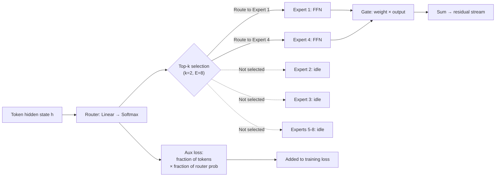

# Mixture of Experts (MoE)

## Learning Objectives

1. **Implement** a top-k routing mechanism that dispatches tokens to expert feed-forward networks and merges their outputs.
2. **Compute** auxiliary load-balancing loss and explain why router collapse happens without it.
3. **Compare** token-choice routing to expert-choice routing in terms of load distribution and sequence integrity.
4. **Map** MoE gating to conditional enrichment waterfalls in GTM pipelines, identifying where the analogy holds and where it breaks.
5. **Deploy** an MoE model (Mixtral-8x7B) with expert parallelism and diagnose routing imbalance from utilization metrics.

## The Problem

A dense transformer's compute cost per token is proportional to its parameter count. Double the parameters and you double the FLOPs for every single token, whether that token is trivial ("the") or information-dense ("quantum"). There is no notion of allocating more compute to harder tokens or less to easy ones. Every parameter fires on every token, every time. This is the dense contract.

By 2023, the frontier was hitting a compute wall. Training a dense 70B model costs tens of millions of dollars in GPU-hours. Training a dense 175B model costs more. The marginal intelligence gain per dollar was flattening because the architecture itself enforced a linear relationship between capacity and compute. You could not have a 500B-parameter model that only spent 30B worth of compute per token — the dense transformer does not give you that lever.

Mixture of Experts breaks that contract. Instead of one feed-forward network per layer, you install `E` independent feed-forward networks ("experts") and a small router that picks `k` of them per token. A model with 8 experts and top-2 routing has 8× the parameters of its dense counterpart but only uses 2/8 = 25% of them on any given token. You decouple total capacity (what the model knows) from active compute (what the model spends per token). This is why DeepSeek-V3 has 671B total parameters but only activates 37B per token — and why it trains on a fraction of the compute a dense 671B model would require.

The trade-off is storage. All `E` experts must live in memory even though only `k` fire per token. A 671B MoE model needs enough VRAM to hold 671B parameters at inference, even though only 37B participate in any single forward pass. You are trading compute efficiency for memory footprint. In practice, this trade has been overwhelmingly favorable — the 2026 open-source frontier (DeepSeek-V3, Mixtral 8×22B, Qwen2.5-MoE, Kimi K2, gpt-oss) is almost entirely MoE.

## The Concept

An MoE layer replaces the standard feed-forward network in a transformer block. The attention layers stay dense — only the FFN is swapped. Where a dense block computes `h = h + FFN(norm(h))`, an MoE block computes a gated mixture of expert FFN outputs.

Three components make up the MoE layer:

**Expert networks** are independent feed-forward networks, typically SwiGLU FFNs with the same architecture but different weights. They are not separate models — they are individual FFN modules that specialize (through training pressure) on different token patterns. Expert 3 might learn to process syntactic tokens. Expert 7 might handle factual recall. This specialization emerges; it is not pre-assigned.

**The router** is a single linear layer that projects the token's hidden state into a score vector of length `E` (one score per expert), followed by a softmax. The top-`k` scores determine which experts process that token. The softmax output for the selected experts becomes a gating weight — the final output is the weighted sum of the selected experts' outputs. Typical `k` is 2 (Mixtral) to 8 (DeepSeek-V3).

**The load-balancing loss** is an auxiliary term added to the training objective that penalizes the router when token distribution across experts becomes uneven. Without it, a positive feedback loop develops: expert 3 gets slightly more tokens early in training, learns slightly faster, produces slightly better outputs, gets a higher routing score, gets even more tokens. Within a few thousand steps, 90% of tokens route to one expert and the rest atrophy.



The standard routing method is **token-choice**: each token independently chooses its top-k experts. This is what Mixtral and most production MoEs use. The alternative, **expert-choice routing**, reverses the direction — each expert chooses its top-k tokens from the batch. Expert-choice produces near-perfect load balancing by construction (every expert always gets exactly k tokens), but it breaks the causal ordering of tokens within a sequence. Token 5 might be processed by expert 2 while token 4 in the same sequence is dropped or processed by a different expert, making autoregressive generation awkward. Token-choice dominates production deployments because it preserves sequence semantics.

The load-balancing auxiliary loss from Switch Transformer works as follows. For each expert `e`, compute `f_e` = fraction of tokens dispatched to that expert, and `P_e` = mean router probability for that expert. The loss is `E × Σ(f_e × P_e)`. When tokens are evenly distributed, this term is minimized. When one expert dominates, `f_e` and `P_e` both spike for that expert, inflating the loss and pushing the router away from the collapse. The coefficient is typically 0.01 — small enough not to dominate the language modeling objective, large enough to prevent atrophy.

## Build It

Let's build a minimal MoE layer from scratch. We will implement the router, the sparse dispatch (only send tokens to their assigned experts), and the merge step. Every intermediate tensor gets printed so you can see exactly what the router decided.

**Step 1: The router.** The router is a linear layer that produces a score per expert. Top-k selection picks the experts. We also build an assignment mask — a boolean tensor showing which expert each token routes to.

```python
import torch
import torch.nn as nn
import torch.nn.functional as F

torch.manual_seed(42)

num_tokens = 8
d_model = 16
num_experts = 4
top_k = 2

x = torch.randn(num_tokens, d_model)

router = nn.Linear(d_model, num_experts, bias=False)
scores = router(x)
probs = F.softmax(scores, dim=-1)

topk_probs, topk_indices = probs.topk(top_k, dim=-1)
topk_probs = topk_probs / topk_probs.sum(dim=-1, keepdim=True)

print("=== ROUTER OUTPUTS ===")
print(f"Router scores shape: {scores.shape}  (tokens={num_tokens}, experts={num_experts})")
print(f"Top-{top_k} expert indices per token:\n{topk_indices}")
print(f"Normalized gate weights:\n{topk_probs}")

mask = torch.zeros(num_tokens, num_experts, dtype=torch.bool)
for i in range(num_tokens):
    for j in range(top_k):
        mask[i, topk_indices[i, j]] = True

print(f"\nAssignment mask (True = selected):\n{mask}")

expert_counts = mask.sum(dim=0)
print(f"\nToken count per expert: {expert_counts.tolist()}")
```

Run this. You will see 8 tokens each assigned to 2 of 4 experts, with the assignment mask making the routing decision explicit. Expert counts will vary — this is the load imbalance the auxiliary loss is designed to fight.

**Step 2: The full MoE layer.** Now we add expert FFNs and implement sparse dispatch. The trick is flattening the token-expert assignments so each expert processes only its assigned tokens as a single batched operation.

```python
class ExpertFFN(nn.Module):
    def __init__(self, d_model, d_ff):
        super().__init__()
        self.w1 = nn.Linear(d_model, d_ff, bias=False)
        self.w2 = nn.Linear(d_ff, d_model, bias=False)

    def forward(self, x):
        return self.w2(F.silu(self.w1(x)))

class MoELayer(nn.Module):
    def __init__(self, d_model, d_ff, num_experts, top_k):
        super().__init__()
        self.router = nn.Linear(d_model, num_experts, bias=False)
        self.experts = nn.ModuleList([
            ExpertFFN(d_model, d_ff) for _ in range(num_experts)
        ])
        self.num_experts = num_experts
        self.top_k = top_k

    def forward(self, x):
        N, D = x.shape
        scores = self.router(x)
        probs = F.softmax(scores, dim=-1)
        topk_probs, topk_indices = probs.topk(self.top_k, dim=-1)
        topk_probs = topk_probs / topk_probs.sum(dim=-1, keepdim=True)

        flat_indices = topk_indices.flatten()
        token_indices = torch.arange(N).repeat_interleave(self.top_k)
        gate_weights = topk_probs.flatten()

        sorted_experts = flat_indices.argsort()
        token_indices = token_indices[sorted_experts]
        gate_weights = gate_weights[sorted_experts]
        expert_ids = flat_indices[sorted_experts]

        output = torch.zeros_like(x)
        for e in range(self.num_experts):
            mask = expert_ids == e
            if mask.sum() == 0:
                continue
            expert_tokens = x[token_indices[mask]]
            expert_out = self.experts[e](expert_tokens)
            weighted = expert_out * gate_weights[mask].unsqueeze(-1)
            output.index_add_(0, token_indices[mask], weighted)

        expert_token_counts = torch.bincount(flat_indices, minlength=self.num_experts)
        return output, expert_token_counts, probs

torch.manual_seed(42)
moe = MoELayer(d_model=16, d_ff=32, num_experts=4, top_k=2)
x = torch.randn(8, 16)

out, counts, route_probs = moe(x)
print("=== MoE LAYER OUTPUT ===")
print(f"Input shape:  {x.shape}")
print(f"Output shape: {out.shape}")
print(f"Tokens routed per expert: {counts.tolist()}")
print(f"Mean router prob per expert: {route_probs.mean(dim=0).tolist()}")
print(f"Total expert forward calls: {(counts > 0).sum().item()} (of {4} experts)")
```

The output shape matches the input shape — the MoE layer is a drop-in replacement for a dense FFN. The token counts show the load distribution. Some experts get 3 tokens, some get 1. That imbalance is expected and acceptable for a single forward pass; it only becomes a problem when it persists across an entire training run.

**Step 3: Load-balancing auxiliary loss and training.** Now we add the auxiliary loss from Switch Transformer and train the MoE on a toy task — classifying random vectors into 3 classes. The goal is not accuracy but observing how expert utilization evolves over epochs under load-balancing pressure.

```python
class MoEClassifier(nn.Module):
    def __init__(self, d_model, d_ff, num_experts, top_k, num_classes):
        super().__init__()
        self.moe = MoELayer(d_model, d_ff, num_experts, top_k)
        self.classifier = nn.Linear(d_model, num_classes)
        self.num_experts = num_experts

    def aux_loss(self, probs, flat_indices):
        tokens_per_expert = torch.bincount(
            flat_indices, minlength=self.num_experts
        ).float()
        frac_tokens = tokens_per_expert / tokens_per_expert.sum()
        mean_prob = probs.mean(dim=0)
        return self.num_experts * (frac_tokens * mean_prob).sum()

    def forward(self, x):
        N, D = x.shape
        scores = self.moe.router(x)
        probs = F.softmax(scores, dim=-1)
        topk_probs, topk_indices = probs.topk(self.moe.top_k, dim=-1)
        topk_probs = topk_probs / topk_probs.sum(dim=-1, keepdim=True)

        flat_indices = topk_indices.flatten()
        token_indices = torch.arange(N).repeat_interleave(self.moe.top_k)
        gate_weights = topk_probs.flatten()

        sorted_idx = flat_indices.argsort()
        token_indices = token_indices[sorted_idx]
        gate_weights = gate_weights[sorted_idx]
        expert_ids = flat_indices[sorted_idx]

        moe_out = torch.zeros_like(x)
        for e in range(self.num_experts):
            mask = expert_ids == e
            if mask.sum() == 0:
                continue
            expert_tokens = x[token_indices[mask]]
            expert_out = self.moe.experts[e](expert_tokens)
            weighted = expert_out * gate_weights[mask].unsqueeze(-1)
            moe_out.index_add_(0, token_indices[mask], weighted)

        logits = self.classifier(x + moe_out)
        aux = self.aux_loss(probs, flat_indices)
        return logits, aux, flat_indices

torch.manual_seed(42)
model = MoEClassifier(16, 32, 4, 2, 3)
optimizer = torch.optim.Adam(model.parameters(), lr=1e-2)
loss_fn = nn.CrossEntropyLoss()

X_train = torch.randn(64, 16)
Y_train = torch.randint(0, 3, (64,))

print("=== TRAINING WITH LOAD BALANCING ===")
for epoch in range(20):
    logits, aux, flat_idx = model(X_train)
    ce_loss = loss_fn(logits, Y_train)
    total_loss = ce_loss + 0.01 * aux
    optimizer.zero_grad()
    total_loss.backward()
    optimizer.step()

    if epoch % 5 == 0 or epoch == 19:
        counts = torch.bincount(flat_idx, minlength=4).tolist()
        print(
            f"Epoch {epoch:2d} | CE: {ce_loss.item():.4f} | "
            f"Aux: {aux.item():.4f} | Expert tokens: {counts}"
        )

with torch.no_grad():
    _, _, flat_idx = model(X_train)
    final_counts = torch.bincount(flat_idx, minlength=4).float()
    print(f"\nFinal expert utilization: {(final_counts / final_counts.sum() * 100).tolist()} %")
```

Watch the expert utilization converge toward 25% per expert (even distribution) as the auxiliary loss penalizes imbalance. Without it, you would see one expert dominating within the first few epochs.

## Use It

The MoE gating function maps directly onto conditional routing in GTM enrichment pipelines. In a Clay waterfall, a signal enters the system (a company domain, a LinkedIn URL), a routing decision determines which data provider handles the lookup, and the result merges back into the record. When you configure "if company size > 500, route to ZoomInfo; else route to Apollo," you are writing a hand-coded gating function — a router with a fixed decision boundary instead of a learned linear projection.

The MoE router makes this routing learnable. Instead of hard-coding thresholds ("company size > 500"), the router learns weights that map input features (firmographics, technographics, intent signals) to the provider most likely to return useful data. The gating mechanism in a learned MoE router is the same mathematical operation as a scoring model that assigns leads to different sales pods: project the feature vector, compute a score per pod, pick the top-k, weight the outcomes. Zone 07 maps fine-tuning to ABM signal orchestration — the training signal is your own deal history, and job changes, social signals, and events are the labels that teach the router which "expert" (which enrichment provider, which outreach sequence, which sales motion) should handle each account. [CITATION NEEDED — concept: Clay waterfall conditional routing as gating mechanism]

The analogy has a clean break point. In a neural MoE, the experts are different parameter sets that produce different transformations of the same input. In a GTM waterfall, the "experts" (ZoomInfo, Apollo, Clearbit) are different data sources that return different fields for the same entity. The router structure is isomorphic; the expert semantics are not. A neural expert transforms data; a GTM expert enriches data. The load-balancing loss, however, maps cleanly: if 90% of your accounts route to ZoomInfo and Apollo gets 2%, you have the same collapse problem the auxiliary loss is designed to fix — Apollo's coverage is not being exercised, ZoomInfo is over-quota, and your routing is not load-balanced across providers.

## Ship It

MoE models introduce operational constraints that dense models do not have. The first is memory: all experts must be resident in VRAM even though only `k` of `E` are active per token. Mixtral-8x7B has 46.7B parameters total (8 experts × ~5.8B each across layers that use MoE). At 4-bit quantization, that is roughly 24GB of VRAM just to load the model — even though only ~13B parameters fire per forward pass. You are paying for storage capacity you do not use for compute.

The second constraint is expert parallelism. When a model is too large for one GPU (Mixtral 8×22B at 141B parameters certainly is), you must distribute experts across devices. Expert parallelism places different expert groups on different GPUs. The router output determines which GPU each token visits, which means cross-device communication happens on every MoE layer. This is slower than tensor parallelism (which splits each matrix multiply across GPUs) because the communication pattern is sparse and irregular — token routing is data-dependent, so the communication pattern changes every batch.

The third constraint is routing instability under distribution shift. If you fine-tune an MoE on a narrow domain, the router can shift its routing patterns in ways that leave some experts underutilized on your target distribution. You will not see this in perplexity alone — you need to log per-expert token counts and watch for collapse.

**Deploying Mixtral-8x7B via Ollama:**

```bash
ollama run mixtral:8x7b-instruct-v0.1-q4_K_M
```

```python
import subprocess
import json

prompts = [
    "Write a SQL query to find the top 5 customers by revenue.",
    "Explain the concept of implied volatility in options trading.",
    "Draft a cold email to a VP of Engineering about API monitoring.",
]

print("=== MIXTRAL 8x7B: DOMAIN-DEPENDENT ROUTING ===")
for i, prompt in enumerate(prompts):
    result = subprocess.run(
        ["ollama", "run", "mixtral:8x7b-instruct-v0.1-q4_K_M", prompt],
        capture_output=True, text=True, timeout=60
    )
    output = result.stdout.strip()[:120]
    print(f"\nPrompt {i+1}: {prompt}")
    print(f"Response preview: {output}...")
    print(f"Response length: {len(result.stdout)} chars")
```

**Deploying via vLLM with tensor parallelism:**

```python
from vllm import LLM, SamplingParams

llm = LLM(
    model="mistralai/Mixtral-8x7B-Instruct-v0.1",
    tensor_parallel_size=2,
    trust_remote_code=True,
    dtype="float16",
)

prompts = [
    "What is mixture of experts in machine learning?",
    "Write a Python function to compute the Fibonacci sequence.",
    "What are the key metrics for SaaS churn analysis?",
]

sampling = SamplingParams(temperature=0.3, max_tokens=200)
outputs = llm.generate(prompts, sampling)

print("=== vLLM MIXTRAL INFERENCE ===")
for i, output in enumerate(outputs):
    text = output.outputs[0].text
    tokens = len(output.outputs[0].token_ids)
    print(f"\nPrompt {i+1}: {prompts[i]}")
    print(f"Generated tokens: {tokens}")
    print(f"Preview: {text[:120]}...")
```

The token counts and generation times here are your first diagnostic signal. If Mixtral generates at 40 tokens/sec on a 2-GPU setup and a dense 7B model (like Mistral-7B-Instruct) generates at 80 tokens/sec on the same hardware, the MoE model is paying a 2× latency penalty for 6× the active parameters. Whether that trade is worth it depends on your quality bar — Mixtral outperforms Mistral-7B on reasoning and code benchmarks, which is why the trade exists.

To monitor expert utilization in production, you need a serving framework that exposes routing metadata. vLLM does not expose per-expert token counts in its public API by default. The workaround is to patch the MoE forward pass to log routing decisions, or to use a framework like SGLang that provides richer MoE instrumentation. What you are watching for: if one expert consistently receives >40% of tokens across diverse prompts, the router has partially collapsed and you should investigate whether your prompt distribution is too narrow.

## Exercises

**Easy.** Build a router that assigns 8 tokens to 4 experts using top-2 routing. Modify the router to use top-1 routing instead and print the assignment mask. Compare the expert token counts — how much more imbalanced is top-1 versus top-2?

**Medium.** Extend the `MoELayer` class to accept sequence input (batch_size, seq_len, d_model) instead of flat token input (N, d_model). Reshape tokens to (batch × seq, d_model) before routing, then reshape the output back. Print the output shape to confirm it matches the input. This is what you need before dropping an MoE layer into a real transformer.

**Hard.** Remove the auxiliary loss from the `MoEClassifier` training loop (set its coefficient to 0.0). Train for 50 epochs. Print expert utilization every 10 epochs. Then re-add the auxiliary loss with coefficient 0.1 and repeat. Compare the utilization trajectories — how many epochs does it take for collapse to occur without balancing, and how does the distribution differ with 0.01 vs 0.1 coefficient?

## Key Terms

- **Mixture of Experts (MoE):** An architecture that replaces each FFN in a transformer with multiple independent FFN networks (experts) plus a router that selects a subset of experts per token.
- **Expert:** A single feed-forward network (typically SwiGLU) within an MoE layer. Despite the name, experts are not separate models — they are independent FFN weights that specialize through training.
- **Router / Gating Network:** A linear layer that projects token hidden states into expert scores, followed by a softmax. Top-k selection on these scores determines which experts process each token.
- **Top-k routing:** The selection mechanism where each token independently chooses the k highest-scoring experts. Typical k ranges from 2 (Mixtral) to 8 (DeepSeek-V3).
- **Token-choice routing:** The standard routing paradigm where tokens select experts. Preserves sequence ordering but can produce load imbalance.
- **Expert-choice routing:** An alternative where experts select their top-k tokens from the batch. Guarantees even load but breaks causal token ordering, making it unsuitable for autoregressive generation.
- **Load-balancing auxiliary loss:** An additional training objective (from Switch Transformer) that penalizes uneven token distribution across experts. Computed as `E × Σ(fraction_tokens_e × mean_prob_e)`. Prevents router collapse.
- **Router collapse:** A failure mode where a positive feedback loop causes most tokens to route to one expert, leaving others untrained. The auxiliary loss exists to prevent this.
- **Active parameters:** The subset of total model parameters that participate in computation for a given token. For MoE, this is `k × FFN_size` per layer, independent of total expert count.
- **Expert parallelism:** A distributed inference strategy that places different expert groups on different GPUs. Enables serving models larger than a single GPU's VRAM at the cost of irregular cross-device communication.

## Sources

- Switch Transformer: "Scaling to Trillion Parameter Models with Simple and Efficient Sparsity" (Fedus et al., 2021) — defines the load-balancing auxiliary loss used in this lesson.
- Mixtral of Experts: "Mixtral of Experts" (Jiang et al., Mistral AI, 2024) — the sparse MoE model used in Ship It deployment exercises.
- DeepSeek-V3 Technical Report (DeepSeek-AI, 2024) — the 671B total / 37B active MoE referenced in The Problem.
- [CITATION NEEDED — concept: Clay waterfall conditional routing as gating mechanism]
- [CITATION NEEDED — concept: Zone 07 fine-tuning mapping to ABM signal orchestration, source: stages/00-b-gtm-content-mapping/output/gtm-topic-map.md]