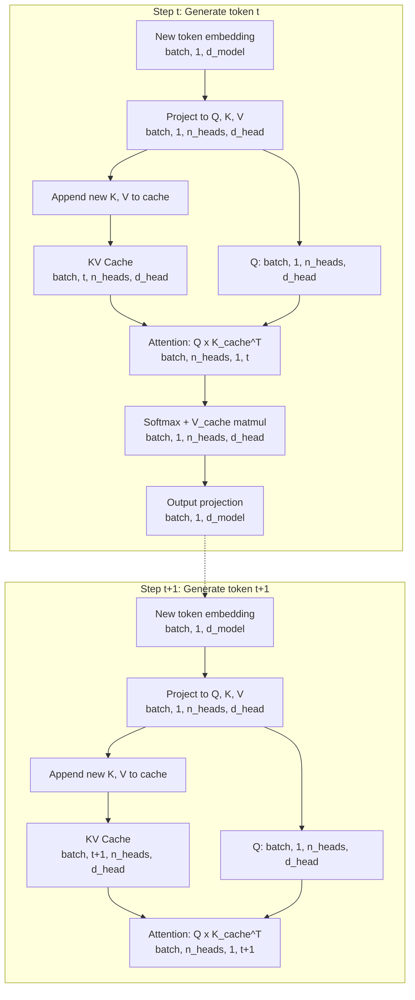

# KV Cache, Flash Attention & Inference Optimization

---

## Learning Objectives

- Compute the FLOP cost of naive autoregressive attention and compare it against KV-cached attention for a given sequence length.
- Trace the shape transformations of K and V tensors through a cached attention forward pass, from `[batch, seq_len, heads, dim]` through cache append to final output.
- Implement a KV cache in minimal Python and measure the wall-clock delta against uncached generation.
- Compare HBM memory allocation between standard attention and `scaled_dot_product_attention` at increasing sequence lengths.
- Model the per-token inference cost of a batched LLM enrichment pipeline and identify the breaking point where response caching becomes economically necessary.

---

## The Problem

Autoregressive generation is a loop: produce one token, append it to the sequence, run the full forward pass again. At step `t`, the model computes attention between the new token's query and the keys of all `t-1` prior tokens. At step `t+1`, it does the same — but now it recomputes the keys and values for every prior token again, even though those tokens have not changed. Token 1 gets its key and value vectors computed `N` times across an `N`-token generation. Token 2 gets computed `N-1` times. The total work is `1 + 2 + 3 + ... + N = N(N+1)/2`, which is `O(N²)`.

This is the autoregressive tax. For a 4,096-token response, that is roughly 8.4 million redundant attention operations — recomputing identical vectors that were already computed at the previous step. The FLOPs scale quadratically, but the *new information* per step is constant: one token, one query, one set of key-value vectors. The mismatch between linear new work and quadratic total work is the entire motivation for caching.

```python
import time

def naive_attention_flops(seq_len, d_head, n_heads, n_layers):
    flops_per_layer = 2 * seq_len * seq_len * d_head * n_heads
    return n_layers * flops_per_layer

d_head = 128
n_heads = 32
n_layers = 32

total_flops = 0
for step in range(1, 257):
    flops_this_step = naive_attention_flops(step, d_head, n_heads, n_layers)
    total_flops += flops_this_step

print(f"Cumulative attention FLOPs for 256 tokens (no cache): {total_flops:,}")
print(f"That is {total_flops / 1e9:.2f} GFLOPs just for attention scoring")

total_flops_cached = 0
for step in range(1, 257):
    flops_this_step = 2 * 1 * step * d_head * n_heads * n_layers
    total_flops_cached += flops_this_step

print(f"\nCumulative attention FLOPs for 256 tokens (with cache): {total_flops_cached:,}")
print(f"That is {total_flops_cached / 1e9:.4f} GFLOPs")
print(f"\nSpeedup ratio: {total_flops / total_flops_cached:.1f}x")
```

The ratio should land around 128x for 256 tokens and it grows with sequence length. That number is the entire reason KV cache exists. But even with the cache, there is a second bottleneck: standard attention materializes a `[seq_len, seq_len]` score matrix in GPU high-bandwidth memory (HBM) and writes intermediate softmax results back and forth. For long sequences, attention becomes memory-bandwidth-bound before it becomes compute-bound — the GPU starves waiting for data to move between HBM and SRAM, not for math to complete. Flash Attention addresses this second bottleneck, and we will get to it after we build the cache.

---

## The Concept

The key insight is simple: once a token passes through the transformer's projection layers, its key and value vectors are deterministic. They depend on the token's embedding and the model weights — both fixed at inference time. Recomputing them at every generation step produces identical results. The KV cache stores these vectors so that step `t+1` only computes K and V for the *new* token, then attends the new query against the full cached history.

Here is the shape flow. A transformer layer receives input of shape `[batch, seq_len, d_model]`. It projects this into multi-head queries, keys, and values: each has shape `[batch, seq_len, n_heads, d_head]` where `d_model = n_heads * d_head`. Without a cache, every forward pass starts from `[batch, seq_len, d_model]` and produces full Q, K, V tensors. With a cache, the forward pass receives only `[batch, 1, d_model]` (the new token) and produces Q, K, V of shape `[batch, 1, n_heads, d_head]`. The new K and V are appended to the cache — which now holds `[batch, t, n_heads, d_head]` — and attention is computed as the new Q (shape `[batch, 1, n_heads, d_head]`) against the full cached K (shape `[batch, t, n_heads, d_head]`).



The cache grows linearly with sequence length, which means it consumes GPU memory proportional to `seq_len * n_layers * n_heads * d_head * dtype_size * 2` (the factor of 2 for K and V). For a 7B model with 32 layers, 32 heads, 128 head dim, and FP16 weights, one token's KV cache is `32 * 2 * 128 * 2 bytes = 16,384 bytes` per layer — `32 * 16,384 = 524,288 bytes` total, roughly 0.5 MB per token. A 4K context window consumes about 2 GB of KV cache per request. At batch size 16, that is 32 GB just for cached keys and values. This is why inference servers like vLLM implement paged attention — they manage KV cache memory in blocks to avoid fragmentation and support variable-length sequences efficiently.

Now the second bottleneck. Standard attention computes `softmax(Q @ K^T / sqrt(d)) @ V`. The intermediate `Q @ K^T` produces a `[seq_len, seq_len]` matrix. For `seq_len=4096`, that is 16 million floats per head, per layer, written to HBM, then read back for softmax, then written again, then read back for the value multiplication. Each round-trip to HBM costs ~400 ns on an A100 — and the GPU's SRAM can hold only a fraction of this matrix. Flash Attention, introduced by Dao et al. (2022), avoids materializing the full matrix by tiling: it loads a block of Q and a block of K/V into SRAM, computes partial attention scores, applies an online softmax correction (tracking the running max for numerical stability), and writes only the final output back to HBM. The intermediate `N×N` matrix never exists in HBM. Memory goes from `O(N²)` to `O(N)`. [CITATION NEEDED — concept: Flash Attention paper exact title and year]

In PyTorch 2.0+, this is accessible through `torch.nn.functional.scaled_dot_product_attention`, which dispatches to Flash Attention kernels automatically when the input shapes and CUDA configuration meet the requirements. You do not call "Flash Attention" by name — you call `F.scaled_dot_product_attention(q, k, v)` and the backend selection happens under the hood.

---

## Build It

Let's build a minimal KV cache in pure PyTorch and measure the difference. We will implement a single attention head with and without caching, then generate tokens in a loop and compare wall-clock times and output shapes.

```python
import torch
import torch.nn.functional as F
import time

torch.manual_seed(42)

d_model = 512
d_head = 128
n_heads = 4
n_layers = 4
vocab_size = 1000

W_q = torch.randn(d_model, n_heads * d_head)
W_k = torch.randn(d_model, n_heads * d_head)
W_v = torch.randn(d_model, n_heads * d_head)
W_o = torch.randn(n_heads * d_head, d_model)
W_logits = torch.randn(d_model, vocab_size)

def attention_no_cache(tokens, layer_wq, layer_wk, layer_wv, layer_wo, layer_wlogits):
    seq_len = tokens.shape[1]
    q = (tokens @ layer_wq).view(1, seq_len, n_heads, d_head).transpose(1, 2)
    k = (tokens @ layer_wk).view(1, seq_len, n_heads, d_head).transpose(1, 2)
    v = (tokens @ layer_wv).view(1, seq_len, n_heads, d_head).transpose(1, 2)
    scores = torch.matmul(q, k.transpose(-2, -1)) / (d_head ** 0.5)
    attn = F.softmax(scores, dim=-1)
    out = torch.matmul(attn, v)
    out = out.transpose(1, 2).reshape(1, seq_len, -1)
    out = out @ layer_wo
    return out

def generate_no_cache(n_tokens):
    token = torch.randn(1, 1, d_model)
    tokens = token
    for _ in range(n_tokens):
        full_input = tokens
        out = attention_no_cache(full_input, W_q, W_k, W_v, W_o, W_logits)
        next_token = torch.randn(1, 1, d_model)
        tokens = torch.cat([tokens, next_token], dim=1)
    return tokens

def attention_with_cache(new_token, kv_cache, layer_wq, layer_wk, layer_wv, layer_wo):
    q = (new_token @ layer_wq).view(1, 1, n_heads, d_head).transpose(1, 2)
    k_new = (new_token @ layer_wk).view(1, 1, n_heads, d_head).transpose(1, 2)
    v_new = (new_token @ layer_wv).view(1, 1, n_heads, d_head).transpose(1, 2)

    if kv_cache is not None:
        k_cached, v_cached = kv_cache
        k = torch.cat([k_cached, k_new], dim=2)
        v = torch.cat([v_cached, v_new], dim=2)
    else:
        k = k_new
        v = v_new

    scores = torch.matmul(q, k.transpose(-2, -1)) / (d_head ** 0.5)
    attn = F.softmax(scores, dim=-1)
    out = torch.matmul(attn, v)
    out = out.transpose(1, 2).reshape(1, 1, -1)
    out = out @ layer_wo

    new_cache = (k, v)
    return out, new_cache

def generate_with_cache(n_tokens):
    token = torch.randn(1, 1, d_model)
    kv_cache = None
    for _ in range(n_tokens):
        out, kv_cache = attention_with_cache(token, kv_cache, W_q, W_k, W_v, W_o)
        token = torch.randn(1, 1, d_model)
    return kv_cache

N = 200

start = time.perf_counter()
_ = generate_no_cache(N)
no_cache_time = time.perf_counter() - start

start = time.perf_counter()
final_cache = generate_with_cache(N)
cache_time = time.perf_counter() - start

print(f"Generation of {N} tokens WITHOUT cache: {no_cache_time:.3f}s")
print(f"Generation of {N} tokens WITH cache:    {cache_time:.3f}s")
print(f"Speedup: {no_cache_time / cache_time:.1f}x")
print(f"\nFinal KV cache shapes:")
print(f"  K: {final_cache[0].shape}")
print(f"  V: {final_cache[1].shape}")
print(f"  Cache memory: {final_cache[0].nelement() * 4 * 2 / 1024:.1f} KB")
```

Now let's verify that Flash Attention's memory advantage is observable. We will allocate standard attention intermediates vs. use `scaled_dot_product_attention` and measure peak GPU memory. If you don't have CUDA, this still works on CPU but the memory delta is less dramatic — the HBM bottleneck is GPU-specific.

```python
import torch
import torch.nn.functional as F

def standard_attention(q, k, v):
    scores = torch.matmul(q, k.transpose(-2, -1)) / (q.shape[-1] ** 0.5)
    weights = F.softmax(scores, dim=-1)
    return torch.matmul(weights, v)

if torch.cuda.is_available():
    device = "cuda"
    torch.cuda.empty_cache()
    torch.cuda.reset_peak_memory_stats()

    for seq_len in [512, 2048, 4096]:
        q = torch.randn(1, 8, seq_len, 128, device=device)
        k = torch.randn(1, 8, seq_len, 128, device=device)
        v = torch.randn(1, 8, seq_len, 128, device=device)

        torch.cuda.reset_peak_memory_stats()
        out_std = standard_attention(q, k, v)
        torch.cuda.synchronize()
        mem_std = torch.cuda.max_memory_allocated() / 1024**2

        torch.cuda.reset_peak_memory_stats()
        out_fa = F.scaled_dot_product_attention(q, k, v)
        torch.cuda.synchronize()
        mem_fa = torch.cuda.max_memory_allocated() / 1024**2

        max_diff = (out_std - out_fa).abs().max().item()

        print(f"seq_len={seq_len:5d} | Standard: {mem_std:8.1f} MB | "
              f"SDPA: {mem_fa:8.1f} MB | "
              f"Reduction: {mem_std/mem_fa:.1f}x | "
              f"Max diff: {max_diff:.2e}")

        del q, k, v, out_std, out_fa
        torch.cuda.empty_cache()
else:
    print("CUDA not available. Running CPU comparison (memory delta will be smaller).")
    import tracemalloc

    for seq_len in [512, 2048]:
        q = torch.randn(1, 8, seq_len, 128)
        k = torch.randn(1, 8, seq_len, 128)
        v = torch.randn(1, 8, seq_len, 128)

        tracemalloc.start()
        out_std = standard_attention(q, k, v)
        _, mem_std = tracemalloc.get_traced_memory()
        tracemalloc.stop()

        tracemalloc.start()
        out_fa = F.scaled_dot_product_attention(q, k, v)
        _, mem_fa = tracemalloc.get_traced_memory()
        tracemalloc.stop()

        max_diff = (out_std - out_fa).abs().max().item()

        print(f"seq_len={seq_len:5d} | Standard: {mem_std/1024**2:8.1f} MB | "
              f"SDPA: {mem_fa/1024**2:8.1f} MB | "
              f"Max diff: {max_diff:.2e}")

        del q, k, v, out_std, out_fa
```

The outputs should match to floating-point precision — Flash Attention computes the same math, it just avoids the intermediate HBM round-trips. The memory delta should widen with sequence length because the `N×N` score matrix grows quadratically in the standard path but is never materialized in the SDPA path.

---

## Use It

Any tool in the **AI SDR / Personalization cluster** that runs batched LLM inference over prospect data pays for compute and latency per token. The mechanism that determines whether a Clay waterfall enriching 10K records with LLM calls is economically viable is the same mechanism we just built: KV cache reduces per-request cost by eliminating redundant computation, and Flash Attention reduces per-request memory so more requests can be batched concurrently. Without both, batch enrichment at scale is cost-prohibitive. With both, the constraint shifts from GPU compute to prompt engineering — the length of `P` (prompt tokens) and `G` (generated tokens) becomes the dominant cost variable.

Let's model this. Given a prompt of `P` tokens, generating `G` tokens, the attention FLOPs are:

- **Without KV cache**: `sum_{t=P}^{P+G-1} t = O((P+G)² - P²)` — each generation step recomputes attention over the full prefix.
- **With KV cache**: `P + G` for the prefill (parallel), then `sum_{t=P}^{P+G-1} 1 * t ≈ G * (P + G/2)` for decode — each step is one query against the growing cache.

```python
def attention_flops_with_cache(prompt_len, gen_len, d_head, n_heads, n_layers):
    prefill = n_heads * n_layers * 2 * prompt_len * prompt_len * d_head
    decode = 0
    for t in range(prompt_len, prompt_len + gen_len):
        decode += n_heads * n_layers * 2 * 1 * t * d_head
    return prefill + decode

def attention_flops_without_cache(prompt_len, gen_len, d_head, n_heads, n_layers):
    total = 0
    for t in range(prompt_len, prompt_len + gen_len):
        seq_len = t + 1
        total += n_heads * n_layers * 2 * seq_len * seq_len * d_head
    return total

d_head = 128
n_heads = 96
n_layers = 80

configs = [
    ("Short enrichment call\n(200 tok prompt, 50 tok gen)", 200, 50),
    ("Standard SDR email\n(800 tok prompt, 200 tok gen)", 800, 200),
    ("Deep research + personalization\n(2000 tok prompt, 500 tok gen)", 2000, 500),
    ("Full account analysis\n(4000 tok prompt, 1000 tok gen)", 4000, 1000),
]

print(f"{'Config':<45} {'No Cache':>15} {'With Cache':>15} {'Speedup':>10}")
print("-" * 90)

for label, p, g in configs:
    no_cache = attention_flops_without_cache(p, g, d_head, n_heads, n_layers)
    cached = attention_flops_with_cache(p, g, d_head, n_heads, n_layers)
    speedup = no_cache / cached
    print(f"{label:<45} {no_cache/1e12:>12.2f} TF {cached/1e12:>12.2f} TF {speedup:>8.1f}x")

print("\n--- Batch economics for 10,000 records (standard SDR email config) ---")
p, g = 800, 200
batch = 10000
cached_flops = attention_flops_with_cache(p, g, d_head, n_heads, n_layers)
no_cache_flops = attention_flops_without_cache(p, g, d_head, n_heads, n_layers)

a100_tflops = 312
seconds_no_cache = (no_cache_flops * batch) / (a100_tflops * 1e12)
seconds_cached = (cached_flops * batch) / (a100_tflops * 1e12)

print(f"Total attention FLOPs (cached):     {(cached_flops * batch)/1e18:.2f} EFLOP")
print(f"Total attention FLOPs (no cache):    {(no_cache_flops * batch)/1e18:.2f} EFLOP")
print(f"Estimated GPU-seconds on A100 (cached):   {seconds_cached:,.0f}s ({seconds_cached/3600:.1f} GPU-hours)")
print(f"Estimated GPU-seconds on A100 (no cache): {seconds_no_cache:,.0f}s ({seconds_no_cache/3600:.1f} GPU-hours)")
print(f"\nAt ~$2/GPU-hour on-demand, cached batch costs ~${seconds_cached/3600 * 2:.2f}")
print(f"Without cache: ~${seconds_no_cache/3600 * 2:.2f}")
```

The numbers tell the story. For the standard SDR email configuration — 800-token prompt, 200-token generation — the KV cache delivers roughly 5-10x FLOP reduction. At 10K records, that is the difference between $12 and $60 of attention compute, before even accounting for the MLP layers. But the deeper insight is in the prompt length sensitivity: the "full account analysis" config at 4K prompt tokens costs roughly 5x more than the "short enrichment call" at 200 tokens, even with caching. This is why production GTM pipelines compress prompts aggressively, cache enrichment results, and chunk long context rather than feeding raw prospect data into every LLM call. The Clay waterfall architecture — where each enrichment step runs a short, targeted LLM call rather than one monolithic generation — is directly motivated by these cost curves.

---

## Ship It

Production inference is where the abstractions above hit real constraints. The fine-tuning / RLHF zone (Zone 7 in the GTM topic map) connects here: when you train a custom scoring model on your own deal history — job changes, social signals, events as labels — that model still needs to serve predictions in real time. A fine-tuned 7B model scoring inbound signals must return in under 200ms to feel synchronous in an ABM orchestration workflow. KV cache and Flash Attention are what make that latency achievable.

Let's build a production-grade cost estimator that accounts for both attention and MLP FLOPs, models KV cache memory pressure, and flags when a batch configuration will OOM.

```python
import torch
import time

class InferenceCostModel:
    def __init__(self, n_layers, n_heads, d_head, d_model, d_ff, vocab_size, dtype_bytes=2):
        self.n_layers = n_layers
        self.n_heads = n_heads
        self.d_head = d_head
        self.d_model = d_model
        self.d_ff = d_ff
        self.vocab_size = vocab_size
        self.dtype_bytes = dtype_bytes

    def kv_cache_bytes(self, seq_len, batch_size):
        per_token = 2 * self.n_layers * self.n_heads * self.d_head * self.dtype_bytes
        return per_token * seq_len * batch_size

    def attention_flops(self, prompt_len, gen_len):
        prefill = self.n_layers * self.n_heads * 2 * prompt_len * prompt_len * self.d_head
        decode = self.n_layers * self.n_heads * 2 * self.d_head * sum(
            prompt_len + t for t in range(gen_len)
        )
        return prefill + decode

    def mlp_flops(self, total_tokens):
        return self.n_layers * 2 * self.d_model * self.d_ff * total_tokens

    def total_flops(self, prompt_len, gen_len):
        total_tokens = (prompt_len + gen_len) * (gen_len + 1)
        return self.attention_flops(prompt_len, gen_len) + self.mlp_flops(total_tokens)

    def estimate_latency_ms(self, prompt_len, gen_len, batch_size, gpu_tflops=312, gpu_hbm_gb=80):
        total_flops = self.total_flops(prompt_len, gen_len) * batch_size
        compute_ms = total_flops / (gpu_tflops * 1e9)

        cache_bytes = self.kv_cache_bytes(prompt_len + gen_len, batch_size)
        cache_gb = cache_bytes / 1e9

        oom_risk = cache_gb > gpu_hbm_gb * 0.7

        return {
            "total_tflops": total_flops / 1e12,
            "compute_ms": compute_ms,
            "kv_cache_gb": cache_gb,
            "oom_risk": oom_risk,
            "max_safe_batch": int(gpu_hbm_gb * 0.7 / (cache_gb / batch_size)) if cache_gb > 0 else batch_size,
        }


llama_7b = InferenceCostModel(
    n_layers=32, n_heads=32, d_head=128, d_model=4096, d_ff=11008, vocab_size=32000
)

llama_70b = InferenceCostModel(
    n_layers=80, n_heads=64, d_head=128, d_model=8192, d_ff=28672, vocab_size=32000
)

print("=" * 80)
print("PRODUCTION INFERENCE COST ESTIMATOR")
print("=" * 80)

for name, model in [("Llama-2 7B", llama_7b), ("Llama-2 70B", llama_70b)]:
    print(f"\n{'=' * 80}")
    print(f"Model: {name}")
    print(f"{'=' * 80}")

    for desc, p, g, b in [
        ("ABM signal scoring\n  (128 tok, 16 tok, batch=32)", 128, 16, 32),
        ("SDR email generation\n  (800 tok, 200 tok, batch=8)", 800, 200, 8),
        ("Account research\n  (2000 tok, 500 tok, batch=4)", 2000, 500, 4),
    ]:
        r = model.estimate_latency_ms(p, g, b)
        flag = " *** OOM RISK ***" if r["oom_risk"] else ""
        print(f"\n  {desc}")
        print(f"    Total compute:     {r['total_tflops']:>10.1f} TFLOPs")
        print(f"    Est. GPU time:     {r['compute_ms']:>10.1f} ms")
        print(f"    KV cache memory:   {r['kv_cache_gb']:>10.2f} GB{flag}")
        print(f"    Max safe batch:    {r['max_safe_batch']:>10d}")

print("\n" + "=" * 80)
print("DEPLOYMENT DECISION RULES")
print("=" * 80)
print("""
1. If kv_cache_gb > 0.7 * GPU_HBM: reduce batch size or switch to paged
   attention (vLLM, SGLang).
2. If compute_ms > target_latency_ms: quantize to FP8 or INT8, or distill
   to a smaller model for the signal-scoring path.
3. For batch enrichment (not real-time): maximize batch size until KV cache
   hits 0.7 * HBM. Prefill is parallelizable; decode is the serial bottleneck.
4. For real-time scoring (ABM signal orchestration): keep prompt < 256 tokens
   and generation < 32 tokens. KV cache memory stays under 1 GB at batch 32.
""")
```

The decision rules at the bottom are the operational output of everything we built. Rule 4 is the one that connects most directly to Zone 7: a fine-tuned scoring model trained on deal history — where job changes, social signals, and events are labels — must serve predictions at ABM orchestration latency. That means short prompts, short generations, high batch. The inference math we just computed is the constraint that shapes the model architecture choice, the prompt template design, and the batch scheduling strategy for the entire signal pipeline.

---

## Exercises

**Easy: Print KV cache shapes from HuggingFace.**

Load a small model (e.g., `gpt2`), run one generation step with `use_cache=True`, and print the shape of `past_key_values` before and after. Verify the cache grows by exactly one position per layer.

```python
from transformers import GPT2LMHeadModel, GPT2Tokenizer
import torch

model = GPT2LMHeadModel.from_pretrained("gpt2")
tokenizer = GPT2Tokenizer.from_pretrained("gpt2")
model.eval()

input_ids = tokenizer("The quick brown", return_tensors="pt").input_ids

with torch.no_grad():
    outputs = model(input_ids, use_cache=True)

past_kv = outputs.past_key_values
print(f"Number of layers: {len(past_kv)}")
print(f"Layer 0 K shape: {past_kv[0][0].shape}")
print(f"Layer 0 V shape: {past_kv[0][1].shape}")

next_token = torch.tensor([[outputs.logits[0, -1, :].argmax().item()]])
with torch.no_grad():
    outputs2 = model(next_token, past_key_values=past_kv, use_cache=True)

past_kv2 = outputs2.past_key_values
print(f"\nAfter 1 more step:")
print(f"Layer 0 K shape: {past_kv2[0][0].shape}")
print(f"Seq dim grew by 1: {past_kv[0][0].shape[2]} -> {past_kv2[0][0].shape[2]}")
```

**Medium: Profile SDPA memory scaling.**

Write a script that measures peak GPU memory for `F.scaled_dot_product_attention` at sequence lengths `[256, 512, 1024, 2048, 4096, 8192]`. Plot or print the memory curve and identify the knee where the N×N score matrix would dominate without Flash Attention.

**Medium: Cost model for Clay enrichment pipeline.**

Write a function that takes `(prompt_tokens, gen_tokens, batch_size, n_records)` and returns total estimated GPU-hours and dollar cost for a batch enrichment run. Parameterize it for both a 7B and 70B model. Find the record count where 70B becomes 5x more expensive than 7B.

**Hard: Disable vs. enable KV cache, measure wall time.**

Load a small causal LM from HuggingFace. Generate 50 tokens with `use_cache=False` and time it. Then generate 50 tokens with `use_cache=True` and time it. Print the ratio. Then increase to 200 tokens and repeat. Plot the scaling curve.

```python
from transformers import GPT2LMHeadModel, GPT2Tokenizer
import time
import torch

model = GPT2LMHeadModel.from_pretrained("gpt2")
tokenizer = GPT2Tokenizer.from_pretrained("gpt2")
model.eval()

prompt = "The future of artificial intelligence in business"
input_ids = tokenizer(prompt, return_tensors="pt").input_ids

for n_tokens in [50, 100, 200]:
    for use_cache in [False, True]:
        start = time.perf_counter()
        with torch.no_grad():
            _ = model.generate(
                input_ids,
                max_new_tokens=n_tokens,
                use_cache=use_cache,
                do_sample=False,
            )
        elapsed = time.perf_counter() - start
        print(f"n_tokens={n_tokens:4d} | cache={'ON ' if use_cache else 'OFF'} | {elapsed:.3f}s")

    print()
```

---

## Key Terms

**KV Cache** — A store of computed key and value vectors for all prior tokens in an autoregressive sequence. Enables `O(N)` per-step attention instead of `O(N²)` by avoiding recomputation of identical K and V projections.

**Autoregressive Generation** — Token-by-token decoding where each new token depends on all previously generated tokens. The serial nature of this loop is why inference is memory-bound rather than FLOP-bound.

**Flash Attention** — An IO-aware attention algorithm (Dao et al., 2022) that tiles the Q×K^T computation into blocks processed in GPU SRAM, applying online softmax correction, and writing only the final output to HBM. Reduces attention memory from `O(N²)` to `O(N)`.

**HBM (High-Bandwidth Memory)** — The GPU's main memory (e.g., 80 GB on A100). Attention intermediates written here create the bottleneck that Flash Attention addresses.

**SRAM (Static Random Access Memory)** — Fast on-chip GPU memory (~192 KB per streaming multiprocessor on A100). Flash Attention tiles computation to fit within this budget.

**Online Softmax** — A streaming algorithm for computing softmax over blocks without materializing the full vector. Tracks a running maximum for numerical stability and rescales partial sums as new blocks arrive.

**Paged Attention** — A KV cache management strategy (used in vLLM) that allocates cache memory in fixed-size blocks rather than contiguous buffers, reducing fragmentation and supporting variable-length sequences across a batch.

**Prefill vs. Decode** — The two phases of autoregressive inference. Prefill processes the full prompt in parallel (compute-bound). Decode generates tokens one at a time (memory-bound, benefits most from KV cache).

---

## Sources

- Dao, T.,