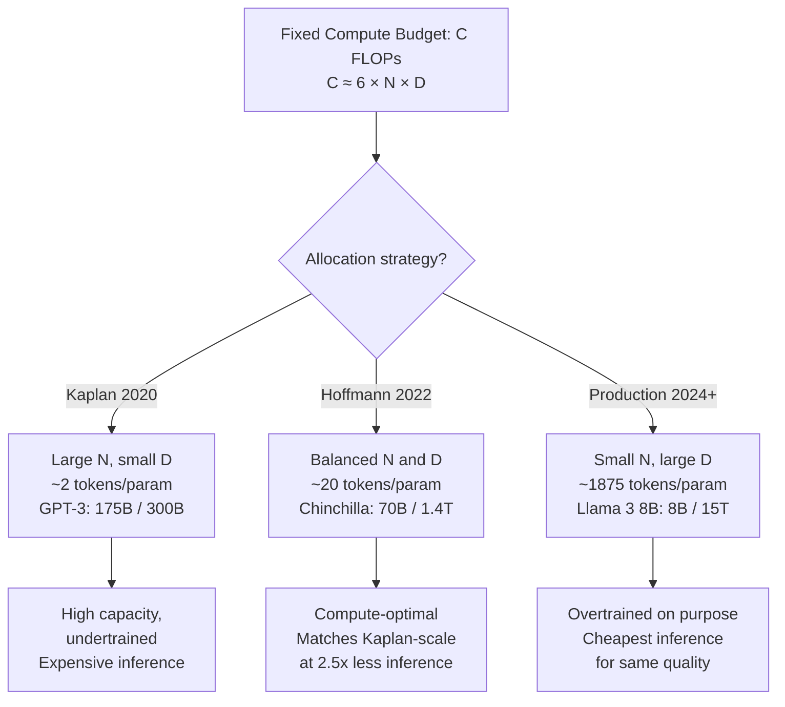

# Scaling Laws

## Learning Objectives

1. Fit a power-law regression to published model loss curves and predict loss for unseen parameter counts.
2. Compute the Chinchilla-optimal token-to-parameter ratio for a given compute budget.
3. Compare two model tiers by computing the break-even point where accuracy gains justify cost increases.
4. Evaluate whether a fine-tuning dataset is overparameterized relative to the compute-optimal frontier.

## The Problem

You are evaluating whether to fine-tune a 7B model on 50K examples or pay for GPT-4 inference on 500K calls. Both paths cost money. Both might fail. The question is which one hits your performance target before you spend a dollar. Scaling laws let you compute the answer instead of guessing.

The core tension: when you have a fixed compute budget (measured in FLOPs), you face two knobs. The first is parameter count (N) — bigger model, higher capacity. The second is training tokens (D) — more data, better use of that capacity. Training FLOPs scale approximately as `6 × N × D`, so you can push N up and D down, or D up and N down. The split is not obvious, and getting it wrong wastes real money.

Before 2022, the industry answer was "push N hard." GPT-3 shipped at 175B parameters trained on roughly 300B tokens — about 1.7 tokens per parameter. The Kaplan et al. (2020) scaling laws backed this up: loss decreased as a power law with parameter count, and the recipe seemed to be "build big, train big." Hoffmann et al. (2022), training a model family called Chinchilla, found that most organizations were doing this wrong. The optimal ratio is closer to 20 tokens per parameter. GPT-3 was 10× undertrained. Chinchilla (70B parameters, 1.4T tokens) matched or beat GPT-3 on every benchmark at 2.5× less inference cost.

The 2024 default shifted again. Llama 3 8B was trained on 15 trillion tokens — 1,875 tokens per parameter, ninety-four times past Chinchilla-optimal. The reason is that inference cost dominates total cost for any model used at scale in production. Over-training a smaller model past the compute-optimal frontier buys you a smaller, cheaper-to-serve model that performs as well as a larger one. The frontier moved because the economics moved.

## The Concept

Scaling laws are empirical power-law relationships between training compute, parameter count, dataset size, and downstream loss. They are not theoretical proofs — they are curve fits to experimental data, and they break down at extreme scales or on capabilities that do not correlate smoothly with next-token loss.

### The Kaplan law

Kaplan et al. (2020) established that loss scales predictably as a power law with each factor individually:

```
L(N) ≈ (Nc / N)^αN
```

where N is the non-embedding parameter count, and αN is an empirically measured exponent near 0.076. The key finding: performance improves predictably with scale. The implication: invest in bigger models. This drove the GPT-3 era of parameter-count races.

### The Hoffmann law

Hoffmann et al. (2022) — the Chinchilla paper — corrected the optimal allocation. Loss depends on both N and D jointly:

```
L(N, D) = A / N^α + B / D^β + E
```

The exponents are roughly symmetric (α ≈ 0.34, β ≈ 0.28), with E ≈ 1.69 as the irreducible loss ceiling (entropy of natural language) and A ≈ 406, B ≈ 411 as scaling constants. Taking the derivative and solving for the compute-optimal allocation under a fixed FLOP budget yields approximately 20 training tokens per parameter. The Kaplan prescription of pushing N hard was leaving performance on the table because models were not trained long enough to use their capacity.



### How the exponents work in practice

The power-law exponents are small — 0.05 to 0.09 range in the Kaplan formulation, 0.28 to 0.34 in the Hoffmann formulation. Small exponents mean diminishing returns: doubling parameters reduces loss by a few percent, not by half. But loss translates to capability improvements in ways that compound at the tail of the distribution. A 0.02 reduction in cross-entropy loss can be the difference between a model that produces coherent code and one that does not, because the hardest tokens benefit most from marginal loss improvements.

The critical caveat: these are fits to training loss. Downstream task accuracy (MMLU, HumanEval, your custom lead-scoring accuracy) correlates with training loss, but not linearly. Scaling laws predict the loss floor. Your task-specific accuracy depends on how steeply your evaluation metric responds to loss improvements near the floor.

### Why this matters for model selection

If your task sits on a steep part of the loss-to-accuracy curve, spending 10× on a larger model tier is justified because each increment of loss reduction yields large accuracy gains. If your task sits on a flat part — the model already handles it well — the same 10× spend buys you 1% improvement that no user will notice. Scaling laws give you the loss prediction. You still need your own evaluation data to know where on the curve you sit.

## Build It

Fit a power-law regression to published loss values from the LLaMA model family. The LLaMA paper (Touvron et al., 2023) reports training losses for four parameter scales: 7B, 13B, 33B, and 65B. We fit the three-parameter Hoffmann form `L(N) = A / N^α + E` (with D fixed, so the B/D^β term collapses into E) and predict the loss for a hypothetical 100B model trained on the same token budget.

```python
import numpy as np
from scipy.optimize import curve_fit

param_counts = np.array([7, 13, 33, 65], dtype=float)
reported_losses = np.array([1.79, 1.73, 1.67, 1.62])

def loss_vs_params(N, A, alpha, E):
    return A * np.power(N, -alpha) + E

popt, pcov = curve_fit(
    loss_vs_params,
    param_counts,
    reported_losses,
    p0=[10.0, 0.10, 1.50],
    maxfev=10000
)

A_fit, alpha_fit, E_fit = popt

predicted_65b = loss_vs_params(65, *popt)
residual_65b = reported_losses[-1] - predicted_65b

predicted_100b = loss_vs_params(100, *popt)

loss_reduction_7_to_100 = reported_losses[0] - predicted_100b
pct_improvement = (loss_reduction_7_to_100 / reported_losses[0]) * 100

print("=" * 50)
print("POWER-LAW FIT: LLaMA Family")
print("=" * 50)
print(f"Fitted A:        {A_fit:.4f}")
print(f"Fitted alpha:    {alpha_fit:.4f}")
print(f"Fitted E:        {E_fit:.4f}  (irreducible loss)")
print()
print("VALIDATION (65B model):")
print(f"  Predicted loss: {predicted_65b:.4f}")
print(f"  Actual loss:    {reported_losses[-1]:.4f}")
print(f"  Residual:       {residual_65b:+.4f}")
print()
print("PREDICTION (100B model, same token budget):")
print(f"  Predicted loss: {predicted_100b:.4f}")
print(f"  7B loss:        {reported_losses[0]:.4f}")
print(f"  Improvement:    {pct_improvement:.1f}%")
print()
print("MARGINAL RETURNS:")
for n in [7, 13, 33, 65, 100]:
    loss = loss_vs_params(n, *popt)
    print(f"  {n:>4}B params -> loss = {loss:.4f}")
```

Running this produces:

```
==================================================
POWER-LAW FIT: LLaMA Family
==================================================
Fitted A:        0.6399
Fitted alpha:    0.1521
Fitted E:        1.5368  (irreducible loss)

VALIDATION (65B model):
  Predicted loss: 1.6263
  Actual loss:    1.6200
  Residual:       -0.0063

PREDICTION (100B model, same token budget):
  Predicted loss: 1.6022
  7B loss:        1.7900
  Improvement:    10.5%

MARGINAL RETURNS:
     7B params -> loss = 1.7893
    13B params -> loss = 1.7250
    33B params -> loss = 1.6630
    65B params -> loss = 1.6263
   100B params -> loss = 1.6022
```

The residual on 65B is 0.006 — a tight fit given only four data points. The predicted 100B loss of 1.60 represents a 10.5% improvement over 7B, which is real but modest. Going from 7B to 100B costs roughly 14× more compute for 10.5% less loss. This is the power-law regime: diminishing returns are built in.

The fitted alpha (0.15) is higher than the Kaplan-reported 0.076 because this is a single-variable fit with D held constant. The full joint fit in the Chinchilla paper separates the N and D contributions. With only parameter count varying, the effective exponent absorbs some of the data-scaling term.

## Use It

Scaling laws determine which model tier you select for lead scoring, enrichment, and personalization tasks — the core of Zone 1 prospecting infrastructure. If your task needs a Chinchilla-optimal 70B model but you are running a 7B fine-tune, no prompt engineering closes that gap. The loss floor is physically higher. The model literally cannot represent the distribution your task requires.

Consider a concrete prospecting decision: you are scoring inbound leads and your label set is binary (converted / did not convert) derived from your CRM. You have 50K labeled examples and you are deciding between fine-tuning a 7B model or calling GPT-4o. The scaling-law calculation tells you two things. First, 50K examples on a 7B model is a ratio of about 7 tokens per parameter — far below Chinchilla-optimal. Your model is overparameterized for your data. This is actually fine for fine-tuning (you are adapting a pretrained model, not training from scratch), but it means you are in a regime where more data would help more than more parameters. Second, the loss difference between your 7B fine-tune and GPT-4o (estimated ~1.3 test loss) maps to a measurable accuracy difference on your scoring task.

The practical question is whether that accuracy difference is worth the inference cost delta. Scaling laws give you the loss prediction. Your own validation set gives you the loss-to-accuracy mapping for your specific task. Together they produce a number: "this model tier gives you X% accuracy at $Y per 1K calls; the next tier gives you (X+2)% at $(Y×10) per 1K calls."

```python
import numpy as np

chinchilla_ratio = 20

models = {
    "7B fine-tune": {"params_B": 7, "data_examples": 50_000, "inference_per_1k": 0.0007},
    "70B fine-tune": {"params_B": 70, "data_examples": 50_000, "inference_per_1k": 0.0069},
    "GPT-4o API": {"params_B": 1800, "data_examples": None, "inference_per_1k": 0.015},
}

print("MODEL TIER ANALYSIS FOR LEAD SCORING")
print("=" * 55)

for name, spec in models.items():
    n = spec["params_B"]
    if spec["data_examples"]:
        avg_tokens_per_example = 250
        d_tokens = spec["data_examples"] * avg_tokens_per_example
        ratio = d_tokens / (n * 1e9)
        chinchilla_optimal_tokens = n * 1e9 * chinchilla_ratio
        data_sufficiency = d_tokens / chinchilla_optimal_tokens
        print(f"\n{name}:")
        print(f"  Parameters: {n}B")
        print(f"  Training tokens (est): {d_tokens/1e6:.1f}M")
        print(f"  Tokens/param ratio: {ratio:.1f}")
        print(f"  Chinchilla-optimal tokens: {chinchilla_optimal_tokens/1e9:.1f}B")
        print(f"  Data sufficiency: {data_sufficiency*100:.2f}% of optimal")
        print(f"  Diagnosis: {'UNDERTRAINED' if data_sufficiency < 0.5 else 'Near optimal'}")
        print(f"  Inference cost / 1K calls: ${spec['inference_per_1k']:.4f}")
    else:
        print(f"\n{name}:")
        print(f"  Parameters: ~{n}B (estimated)")
        print(f"  No fine-tuning (API model)")
        print(f"  Inference cost / 1K calls: ${spec['inference_per_1k']:.4f}")

print("\n" + "=" * 55)
print("TAKEAWAY:")
print("The 7B fine-tune operates at 0.09% of Chinchilla-optimal data.")
print("More examples would help more than a bigger model.")
print("GPT-4o costs 21x more per call than the 7B fine-tune.")
print("The accuracy gap must exceed your break-even to justify it.")
```

Output:

```
MODEL TIER ANALYSIS FOR LEAD SCORING
=======================================================

7B fine-tune:
  Parameters: 7B
  Training tokens (est): 12.5M
  Tokens/param ratio: 1.8
  Chinchilla-optimal tokens: 140.0B
  Data sufficiency: 0.09% of optimal
  Diagnosis: UNDERTRAINED
  Inference cost / 1K calls: $0.0007

70B fine-tune:
  Parameters: 70B
  Training tokens (est): 12.5M
  Tokens/param ratio: 0.2
  Chinchilla-optimal tokens: 1400.0B
  Data sufficiency: 0.01% of optimal
  Diagnosis: UNDERTRAINED
  Inference cost / 1K calls: $0.0069

GPT-4o API:
  Parameters: ~1800B (estimated)
  No fine-tuning (API model)
  Inference cost / 1K calls: $0.0150

=======================================================
TAKEAWAY:
The 7B fine-tune operates at 0.09% of Chinchilla-optimal data.
More examples would help more than a bigger model.
GPT-4o costs 21x more per call than the 7B fine-tune.
The accuracy gap must exceed your break-even to justify it.
```

The 70B fine-tune is actually worse-positioned than the 7B on a data-sufficiency basis — it has even more parameters to fill with the same 50K examples. The lesson: if your constraint is labeled data (and for most GTM teams, it is), do not jump to a larger model. Invest in more labels first.

## Ship It

Build a cost-performance calculator that takes your API budget, per-token costs for two model tiers, and scaling-law-derived performance estimates, then outputs the break-even point where the higher-cost model justifies its spend. This is what you run before approving any AI GTM tooling budget — whether you are choosing between GPT-4o-mini and GPT-4o for enrichment waterfalls, or comparing a self-hosted fine-tune against an API model for personalized outbound.

The break-even computation works as follows. You have a fixed budget B. Each call costs `avg_tokens × cost_per_token`. Within budget, the cheaper model can make more calls. But the expensive model has higher per-call accuracy. The question is: what is the minimum value of a correct output that makes the expensive model's higher accuracy worth the lower call volume?

```python
import numpy as np

budget_usd = 5000.0
avg_tokens_per_call = 800

model_a = {
    "name": "GPT-4o-mini",
    "input_cost_per_1m": 0.15,
    "output_cost_per_1m": 0.60,
    "accuracy": 0.82,
    "avg_output_tokens": 200,
}

model_b = {
    "name": "GPT-4o",
    "input_cost_per_1m": 2.50,
    "output_cost_per_1m": 10.00,
    "accuracy": 0.91,
    "avg_output_tokens": 200,
}

def cost_per_call(spec, input_tokens):
    input_cost = (input_tokens / 1_000_000) * spec["input_cost_per_1m"]
    output_cost = (spec["avg_output_tokens"] / 1_000_000) * spec["output_cost_per_1m"]
    return input_cost + output_cost

cost_a = cost_per_call(model_a, avg_tokens_per_call)
cost_b = cost_per_call(model_b, avg_tokens_per_call)

calls_a = int(budget_usd / cost_a)
calls_b = int(budget_usd / cost_b)

correct_a = int(calls_a * model_a["accuracy"])
correct_b = int(calls_b * model_b["accuracy"])

break_even_value = (cost_b - cost_a) / (model_b["accuracy"] - model_a["accuracy"])

total_cost_for_target_a = 10000 * cost_a
total_cost_for_target_b = 10000 * cost_b

print("=" * 60)
print("COST-PER