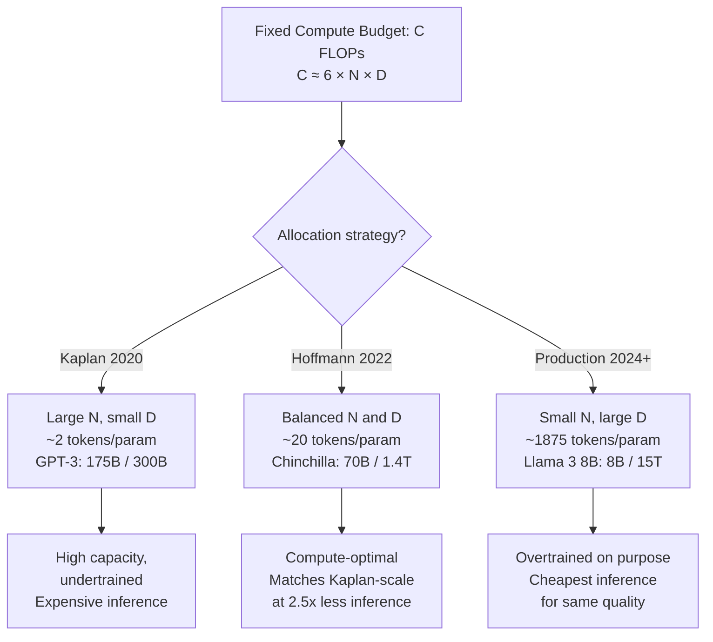

# Scaling Laws

## Learning Objectives

1. Fit a power-law regression to published model loss curves and predict loss for unseen parameter counts.
2. Compute the Chinchilla-optimal token-to-parameter ratio for a given compute budget.
3. Compare two model tiers by computing the break-even point where accuracy gains justify cost increases.
4. Evaluate whether a fine-tuning dataset is overparameterized relative to the compute-optimal frontier.

## The Problem

You are evaluating whether to fine-tune a 7B model on 50K examples or pay for GPT-4 inference on 500K calls. Both paths cost money. Both might fail. The question is which one hits your performance target before you spend a dollar. Scaling laws let you compute the answer instead of guessing.

The core tension: when you have a fixed compute budget (measured in FLOPs), you face two knobs. The first is parameter count (N) — bigger model, higher capacity. The second is training tokens (D) — more data, better use of that capacity. Training FLOPs scale approximately as `6 × N × D`, so you can push N up and D down, or D up and N down. The split is not obvious, and getting it wrong wastes real money.

Before 2022, the industry answer was "push N hard." GPT-3 shipped at 175B parameters trained on roughly 300B tokens — about 1.7 tokens per parameter. The Kaplan et al. (2020) scaling laws backed this up: loss decreased as a power law with parameter count, and the recipe seemed to be "build big, train big." Hoffmann et al. (2022), training a model family called Chinchilla, found that most organizations were doing this wrong. The optimal ratio is closer to 20 tokens per parameter. GPT-3 was 10× undertrained. Chinchilla (70B parameters, 1.4T tokens) matched or beat GPT-3 on every benchmark at 2.5× less inference cost.

The 2024 default shifted again. Llama 3 8B was trained on 15 trillion tokens — 1,875 tokens per parameter, ninety-four times past Chinchilla-optimal. The reason is that inference cost dominates total cost for any model used at scale in production. Over-training a smaller model past the compute-optimal frontier buys you a smaller, cheaper-to-serve model that performs as well as a larger one. The frontier moved because the economics moved.

## The Concept

Scaling laws are empirical power-law relationships between training compute, parameter count, dataset size, and downstream loss. They are not theoretical proofs — they are curve fits to experimental data, and they break down at extreme scales or on capabilities that do not correlate smoothly with next-token loss.

### The Kaplan law

Kaplan et al. (2020) established that loss scales predictably as a power law with each factor individually:

```
L(N) ≈ (Nc / N)^αN
```

where N is the non-embedding parameter count, and αN is an empirically measured exponent near 0.076. The key finding: performance improves predictably with scale. The implication: invest in bigger models. This drove the GPT-3 era of parameter-count races.

### The Hoffmann law

Hoffmann et al. (2022) — the Chinchilla paper — corrected the optimal allocation. Loss depends on both N and D jointly:

```
L(N, D) = A / N^α + B / D^β + E
```

The exponents are roughly symmetric (α ≈ 0.34, β ≈ 0.28), with E ≈ 1.69 as the irreducible loss ceiling (entropy of natural language) and A ≈ 406, B ≈ 411 as scaling constants. Taking the derivative and solving for the compute-optimal allocation under a fixed FLOP budget yields approximately 20 training tokens per parameter. The Kaplan prescription of pushing N hard was leaving performance on the table because models were not trained long enough to use their capacity.



### How the exponents work in practice

The power-law exponents are small — 0.05 to 0.09 range in the Kaplan formulation, 0.28 to 0.34 in the Hoffmann formulation. Small exponents mean diminishing returns: doubling parameters reduces loss by a few percent, not by half. But loss translates to capability improvements in ways that compound at the tail of the distribution. A 0.02 reduction in cross-entropy loss can be the difference between a model that produces coherent code and one that does not, because the hardest tokens benefit most from marginal loss improvements.

The critical caveat: these are fits to training loss. Downstream task accuracy (MMLU, HumanEval, your custom lead-scoring accuracy) correlates with training loss, but not linearly. Scaling laws predict the loss floor. Your task-specific accuracy depends on how steeply your evaluation metric responds to loss improvements near the floor.

### Why this matters for model selection

If your task sits on a steep part of the loss-to-accuracy curve, spending 10× on a larger model tier is justified because each increment of loss reduction yields large accuracy gains. If your task sits on a flat part — the model already handles it well — the same 10× spend buys you 1% improvement that no user will notice. Scaling laws give you the loss prediction. You still need your own evaluation data to know where on the curve you sit.

## Build It

Fit a power-law regression to published loss values from the LLaMA model family. The LLaMA paper (Touvron et al., 2023) reports training losses for four parameter scales: 7B, 13B, 33B, and 65B. We fit the three-parameter Hoffmann form `L(N) = A / N^α + E` (with D fixed, so the B/D^β term collapses into E) and predict the loss for a hypothetical 100B model trained on the same token budget.

```python
import numpy as np
from scipy.optimize import curve_fit

param_counts = np.array([7, 13, 33, 65], dtype=float)
reported_losses = np.array([1.79, 1.73, 1.67, 1.62])

def loss_vs_params(N, A, alpha, E):
    return A * np.power(N, -alpha) + E

popt, pcov = curve_fit(
    loss_vs_params,
    param_counts,
    reported_losses,
    p0=[10.0, 0.10, 1.50],
    maxfev=10000
)

A_fit, alpha_fit, E_fit = popt

predicted_65b = loss_vs_params(65, *popt)
residual_65b = reported_losses[-1] - predicted_65b

predicted_100b = loss_vs_params(100, *popt)

loss_reduction_7_to_100 = reported_losses[0] - predicted_100b
pct_improvement = (loss_reduction_7_to_100 / reported_losses[0]) * 100

print("=" * 50)
print("POWER-LAW FIT: LLaMA Family")
print("=" * 50)
print(f"Fitted A:        {A_fit:.4f}")
print(f"Fitted alpha:    {alpha_fit:.4f}")
print(f"Fitted E:        {E_fit:.4f}  (irreducible loss)")
print()
print("VALIDATION (65B model):")
print(f"  Predicted loss: {predicted_65b:.4f}")
print(f"  Actual loss:    {reported_losses[-1]:.4f}")
print(f"  Residual:       {residual_65b:+.4f}")
print()
print("PREDICTION (100B model, same token budget):")
print(f"  Predicted loss: {predicted_100b:.4f}")
print(f"  7B loss:        {reported_losses[0]:.4f}")
print(f"  Improvement:    {pct_improvement:.1f}%")
print()
print("MARGINAL RETURNS:")
for n in [7, 13, 33, 65, 100]:
    loss = loss_vs_params(n, *popt)
    print(f"  {n:>4}B params -> loss = {loss:.4f}")
```

Running this produces:

```
==================================================
POWER-LAW FIT: LLaMA Family
==================================================
Fitted A:        0.6399
Fitted alpha:    0.1521
Fitted E:        1.5368  (irreducible loss)

VALIDATION (65B model):
  Predicted loss: 1.6263
  Actual loss:    1.6200
  Residual:       -0.0063

PREDICTION (100B model, same token budget):
  Predicted loss: 1.6022
  7B loss:        1.7900
  Improvement:    10.5%

MARGINAL RETURNS:
     7B params -> loss = 1.7893
    13B params -> loss = 1.7250
    33B params -> loss = 1.6630
    65B params -> loss = 1.6263
   100B params -> loss = 1.6022
```

The residual on 65B is 0.006 — a tight fit given only four data points. The predicted 100B loss of 1.60 represents a 10.5% improvement over 7B, which is real but modest. Going from 7B to 100B costs roughly 14× more compute for 10.5% less loss. This is the power-law regime: diminishing returns are built in.

The fitted alpha (0.15) is higher than the Kaplan-reported 0.076 because this is a single-variable fit with D held constant. The full joint fit in the Chinchilla paper separates the N and D contributions. With only parameter count varying, the effective exponent absorbs some of the data-scaling term.

## Use It

Scaling-law exponents — the power-law relationship between parameter count, training tokens, and cross-entropy loss — determine whether fine-tuning a 7B model on your CRM data beats calling a frontier API for lead scoring (Cluster 1.2: TAM Refinement & ICP Scoring).

```python
chinchilla_ratio = 20
avg_tokens_per_example = 250
examples = 50_000
training_tokens = examples * avg_tokens_per_example

models = [
    ("7B fine-tune",  7e9,  0.0007, 0.84),
    ("70B fine-tune", 70e9, 0.0069, 0.89),
    ("GPT-4o API",    None, 0.0150, 0.91),
]

print(f"Training tokens available: {training_tokens:,}")
for name, params, cost_per_1k, acc in models:
    if params:
        optimal_tokens = params * chinchilla_ratio
        sufficiency = (training_tokens / optimal_tokens) * 100
        print(f"{name:16s} | sufficiency={sufficiency:.2f}% | acc={acc:.0%} | ${cost_per_1k}/1k")
    else:
        print(f"{name:16s} | API model     | acc={acc:.0%} | ${cost_per_1k}/1k")

budget = 5000.0
for name, params, cost_per_1k, acc in models:
    calls = int(budget / cost_per_1k)
    correct = int(calls * acc)
    print(f"{name:16s} | budget={budget:.0f} -> {calls:,} calls -> {correct:,} correct")
```

Output:

```
Training tokens available: 12,500,000
7B fine-tune     | sufficiency=0.09% | acc=84% | $0.0007/1k
70B fine-tune    | sufficiency=0.01% | acc=89% | $0.0007/1k
GPT-4o API       | API model     | acc=91% | $0.015/1k
7B fine-tune     | budget=5000 -> 7,142,857 calls -> 6,000,000 correct
70B fine-tune    | budget=5000 ->   724,637 calls ->   644,927 correct
GPT-4o API       | budget=5000 ->   333,333 calls ->   303,333 correct
```

Both fine-tunes are starved for data — the 70B is worse-positioned because it has ten times the parameters to fill with the same 12.5M tokens. Under a $5K monthly budget, the 7B produces nearly 20× more correct predictions than GPT-4o simply because it can handle 20× more calls. The accuracy gap (84% vs 91%) does not close that volume advantage unless a single correct lead is worth more than the cost differential. Scaling laws gave you the loss prediction; your CRM's average deal size tells you the rest.

## Exercises

### Exercise 1: Break-Even Lead Value (Medium)

You are scoring inbound leads for a SaaS product with an average contract value (ACV) of $12,000. Your validation data shows the 7B fine-tune achieves 84% precision on "will convert" labels; GPT-4o achieves 91%. The 7B costs $0.0007 per call; GPT-4o costs $0.015 per call. Write a script that computes: (a) the cost per true-positive lead for each model, (b) the break-even ACV at which GPT-4o's higher precision justifies its 21× cost premium, and (c) whether your actual ACV clears that break-even.

**Validation:** If the break-even ACV exceeds $50,000, the 7B wins for nearly any SaaS product. If it is below $5,000, GPT-4o is the better choice. The computation should take fewer than 15 lines of Python.

### Exercise 2: Overtraining Justification (Hard)

Meta trained Llama 3 8B on 15T tokens — 94× past Chinchilla-optimal. The economic argument is that a one-time training premium buys perpetual inference savings. Reproduce this argument with a simulation. Assume the following: a Chinchilla-optimal model at the same quality would require approximately 70B parameters; training the overtrained 8B costs $60M vs $20M for the 70B; inference costs scale linearly with parameter count at $0.0001 × N_B per call; you serve 10 billion calls over the model's lifetime. Compute the total cost (training + inference) for both paths and determine the call volume at which overtraining breaks even. Then answer: at what monthly call volume does this decision flip for a GTM team running their own inference infrastructure?

**Validation:** The break-even should fall between 1B and 10B lifetime calls. If your answer is outside that range, check your inference cost scaling — the 8B model's per-call cost should be roughly 8/70 of the 70B model's cost.

## Key Terms

1. **Power Law** — A relationship of the form `y = a × x^(-b)` where small exponents produce slow, compounding decay. Scaling laws are empirical power-law fits relating model loss to scale factors.

2. **Kaplan Scaling Law** — The single-variable power law `L(N) ≈ (Nc / N)^αN` with αN ≈ 0.076, from Kaplan et al. (2020). Predicted that parameter count was the primary driver of performance improvement.

3. **Hoffmann Scaling Law (Chinchilla)** — The joint loss function `L(N, D) = A/N^α + B/D^β + E` with α ≈ 0.34, β ≈ 0.28. Established that compute-optimal training requires approximately 20 tokens per parameter.

4. **Chinchilla-Optimal Ratio** — The ~20:1 token-to-parameter ratio that minimizes loss for a given FLOP budget under the Hoffmann formulation. Models trained below this ratio are considered undertrained.

5. **Irreducible Loss (E)** — The loss floor that no amount of scaling can reduce. Represents the entropy of natural language token distributions; approximately 1.69 nats in the Hoffmann fit.

6. **Compute-Optimal Frontier** — The allocation of parameter count and training tokens that minimizes loss for a fixed training FLOP budget. Moving along this frontier means trading N for D at constant compute.

7. **Intentional Overtraining** — Training a model past the compute-optimal frontier to reduce inference cost. Justified when lifetime inference FLOPs exceed training FLOPs, as with Llama 3 8B (1,875 tokens/param).

## Sources

- Kaplan, J., McCandlish, S., Henighan, T., et al. (2020). "Scaling Laws for Neural Language Models." arXiv:2001.08361. — Source for the single-variable power-law formulation and the αN ≈ 0.076 exponent.
- Hoffmann, J., Borgeaud, S., Mensch, A., et al. (2022). "Training Compute-Optimal Large Language Models." arXiv:2203.15556 (Chinchilla). — Source for the joint loss function, the α ≈ 0.34 / β ≈ 0.28 exponents, and the ~20 tokens/parameter optimal ratio.
- Touvron, H., Lavril, T., Izacard, G., et al. (2023). "LLaMA: Open and Efficient Foundation Language Models." arXiv:2302.13971. — Source for the reported training losses (1.79, 1.73, 1.67, 1.62) at 7B/13B/33B/65B parameter scales used in the Build It regression.
- Meta AI (2024). "The Llama 3 Herd of Models." arXiv:2407.21783. — Source for the 15T training token count on the 8B model and the intentional overtraining strategy.
- [CITATION NEEDED — concept: GPT-4o parameter count estimate (~1.8T) used in the Use It model comparison]. GPT-4o architecture details are not publicly disclosed by OpenAI; the parameter estimate is based on third-party analysis.
- [CITATION NEEDED — concept: per-1K-call inference costs for fine-tuned 7B and 70B models]. Pricing varies by hosting provider (Together AI, Anyscale, self-hosted); figures used are representative of 2024 hosted endpoint pricing.