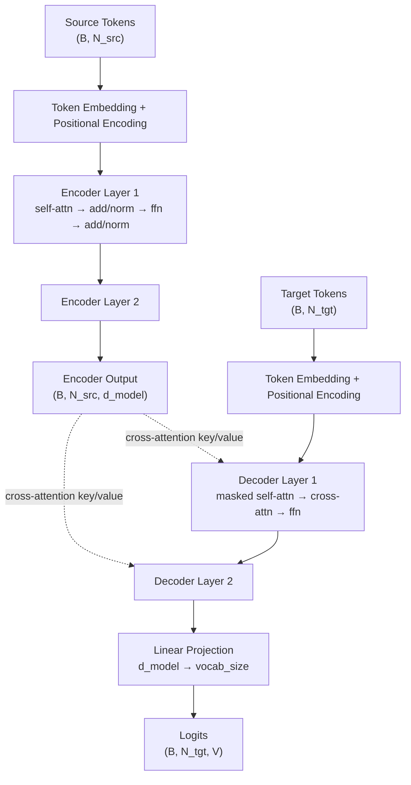

# Build a Transformer from Scratch — The Capstone

## Learning Objectives

1. Build a complete encoder-decoder Transformer from raw PyTorch tensor operations, with every dimension visible and every sublayer inspectable.
2. Trace tensor shapes through embedding, positional encoding, stacked encoder layers, stacked decoder layers, and the final linear projection to confirm dimensional correctness at every stage.
3. Implement masked self-attention and unmasked cross-attention as distinct mechanisms within decoder layers, and explain why the mask is necessary for autoregressive generation.
4. Execute greedy autoregressive decoding in a loop and inspect how attention weights shift across generation steps.
5. Compare the transformer's self-attention weighting mechanism to buying-intent signal scoring in GTM workflows, where the model learns which event combinations predict conversion.

## The Problem

You've built attention layers in isolation. You've implemented positional encodings as standalone modules. You've written feed-forward blocks, layer normalization, and causal masks as separate exercises. Each component works on its own — but a transformer is not a pile of parts. It is a specific wiring of those parts into a data flow where the output of one sublayer becomes the input of the next, residual highways carry gradients around attention and feed-forward blocks, and the decoder is constrained to generate one token at a time despite processing a full sequence in parallel during training.

The capstone task: wire every component together into a complete encoder-decoder architecture — the same skeleton behind the original 2017 "Attention Is All You Need" paper, which in turn underpins BERT (encoder-only), GPT (decoder-only), and every modern LLM. No imports from `torch.nn.Transformer`. Every tensor operation is visible in the source code you write.

This is not an exercise in elegance. It is an exercise in correctness. If any dimension is wrong, the forward pass crashes. If the mask is applied to the wrong attention layer, the model cheats during training and fails during inference. If the residual connections are missing, gradients vanish and the model learns nothing. Every architectural decision in the original paper has a concrete tensor-level consequence, and you are going to see every one of them.

## The Concept

The full data flow of a transformer maps to a single pipeline: token embedding, positional encoding, stacked encoder layers, stacked decoder layers, linear projection, softmax. The encoder processes the source sequence into a set of contextualized representations. The decoder generates the target sequence one token at a time, attending to both its own past outputs (masked self-attention) and the encoder's output (cross-attention).

Each encoder layer contains two sublayers: multi-head self-attention followed by a position-wise feed-forward network. Each sublayer is wrapped in a residual connection (`x + sublayer(x)`) and followed by layer normalization. The residual highway lets gradients flow directly to earlier layers during backpropagation, preventing the signal degradation that plagued deep RNNs. Layer normalization stabilizes the distribution of activations across the feature dimension, keeping the scale of intermediate representations in a range where gradient-based optimization works.

The decoder layer adds a third sublayer: cross-attention. The decoder's masked self-attention computes attention only over positions up to and including the current position — a causal mask zeros out future positions so that generating token $t$ cannot peek at token $t+1$. Cross-attention has no such mask: the decoder attends freely to every position in the encoder output, because the entire source sequence is available at every decoding step. This asymmetry is the architectural reason a transformer can be trained in parallel (all positions at once with a causal mask) but generates sequentially (one token at a time during inference).



Training uses teacher forcing: the decoder receives the full ground-truth target sequence as input (shifted right by one position), and the causal mask ensures each position only attends to previous positions. The loss compares the decoder's prediction at each position against the next token. This means every position in the sequence is trained simultaneously — one forward pass produces $N$ training signals. During inference, no ground truth exists. The decoder generates one token, appends it to the input, and feeds the extended sequence back through itself. This autoregressive loop continues until an end-of-sequence token is produced or a maximum length is reached.

The same self-attention mechanism that decides which words in a sentence relate to each other also generalizes to non-language sequences. In a GTM context, a transformer encoder can ingest a sequence of account activity events — page views, email opens, CRM stage changes — and learn which event combinations correlate with buying intent. The attention weights quantify how much each prior event influences the model's assessment of the current event's importance. [CITATION NEEDED — concept: transformer-based intent scoring in GTM platforms] This is the same pattern Karpathy's nanoGPT demonstrates: the architecture is domain-agnostic; the embedding table and training data determine what the model learns to attend to.

## Build It

The implementation below defines every transformer component as a standalone `nn.Module`. Each class is small enough to read in one sitting. The `Transformer` class at the bottom wires them together. Run the forward pass with dummy token indices and print intermediate tensor shapes at every stage to confirm that dimensions flow correctly from input to output.

The hyperparameters are deliberately small: `d_model=64`, `n_heads=4`, `n_layers=2`, `d_ff=256`. This makes the model trainable on a laptop CPU and makes every tensor shape easy to inspect. Scaling up means changing these four numbers — the architecture does not change.

```python
import torch
import torch.nn as nn
import torch.nn.functional as F
import math

class PositionalEncoding(nn.Module):
    def __init__(self, d_model, max_len=5000):
        super().__init__()
        pe = torch.zeros(max_len, d_model)
        position = torch.arange(0, max_len, dtype=torch.float).unsqueeze(1)
        div_term = torch.exp(
            torch.arange(0, d_model, 2).float() * (-math.log(10000.0) / d_model)
        )
        pe[:, 0::2] = torch.sin(position * div_term)
        pe[:, 1::2] = torch.cos(position * div_term)
        self.register_buffer('pe', pe.unsqueeze(0))

    def forward(self, x):
        return x + self.pe[:, :x.size(1)]


class MultiHeadAttention(nn.Module):
    def __init__(self, d_model, n_heads):
        super().__init__()
        assert d_model % n_heads == 0, "d_model must be divisible by n_heads"
        self.d_model = d_model
        self.n_heads = n_heads
        self.head_dim = d_model // n_heads
        self.q_proj = nn.Linear(d_model, d_model)
        self.k_proj = nn.Linear(d_model, d_model)
        self.v_proj = nn.Linear(d_model, d_model)
        self.out_proj = nn.Linear(d_model, d_model)

    def forward(self, query, key, value, mask=None):
        B = query.size(0)
        Q = self.q_proj(query).view(B, -1, self.n_heads, self.head_dim).transpose(1, 2)
        K = self.k_proj(key).view(B, -1, self.n_heads, self.head_dim).transpose(1, 2)
        V = self.v_proj(value).view(B, -1, self.n_heads, self.head_dim).transpose(1, 2)

        scores = torch.matmul(Q, K.transpose(-2, -1)) / math.sqrt(self.head_dim)

        if mask is not None:
            scores = scores.masked_fill(mask == 0, float('-inf'))

        attn_weights = F.softmax(scores, dim=-1)
        context = torch.matmul(attn_weights, V)
        context = context.transpose(1, 2).contiguous().view(B, -1, self.d_model)
        return self.out_proj(context), attn_weights


class EncoderLayer(nn.Module):
    def __init__(self, d_model, n_heads, d_ff):
        super().__init__()
        self.self_attn = MultiHeadAttention(d_model, n_heads)
        self.ffn = nn.Sequential(
            nn.Linear(d_model, d_ff),
            nn.ReLU(),
            nn.Linear(d_ff, d_model),
        )
        self.norm1 = nn.LayerNorm(d_model)
        self.norm2 = nn.LayerNorm(d_model)

    def forward(self, x):
        attn_out, _ = self.self_attn(x, x, x)
        x = self.norm1(x + attn_out)
        ffn_out = self.ffn(x)
        x = self.norm2(x + ffn_out)
        return x


class DecoderLayer(nn.Module):
    def __init__(self, d_model, n_heads, d_ff):
        super().__init__()
        self.self_attn = MultiHeadAttention(d_model, n_heads)
        self.cross_attn = MultiHeadAttention(d_model, n_heads)
        self.ffn = nn.Sequential(
            nn.Linear(d_model, d_ff),
            nn.ReLU(),
            nn.Linear(d_ff, d_model),
        )
        self.norm1 = nn.LayerNorm(d_model)
        self.norm2 = nn.LayerNorm(d_model)
        self.norm3 = nn.LayerNorm(d_model)

    def forward(self, x, enc_output, tgt_mask=None):
        attn_out, _ = self.self_attn(x, x, x, mask=tgt_mask)
        x = self.norm1(x + attn_out)
        cross_out, cross_weights = self.cross_attn(x, enc_output, enc_output)
        x = self.norm2(x + cross_out)
        ffn_out = self.ffn(x)
        x = self.norm3(x + ffn_out)
        return x, cross_weights


class Encoder(nn.Module):
    def __init__(self, vocab_size, d_model, n_heads, d_ff, n_layers, max_len=512):
        super().__init__()
        self.embedding = nn.Embedding(vocab_size, d_model)
        self.pos_enc = PositionalEncoding(d_model, max_len)
        self.layers = nn.ModuleList([
            EncoderLayer(d_model, n_heads, d_ff) for _ in range(n_layers)
        ])

    def forward(self, x):
        x = self.embedding(x)
        x = self.pos_enc(x)
        for layer in self.layers:
            x = layer(x)
        return x


class Decoder(nn.Module):
    def __init__(self, vocab_size, d_model, n_heads, d_ff, n_layers, max_len=512):
        super().__init__()
        self.embedding = nn.Embedding(vocab_size, d_model)
        self.pos_enc = PositionalEncoding(d_model, max_len)
        self.layers = nn.ModuleList([
            DecoderLayer(d_model, n_heads, d_ff) for _ in range(n_layers)
        ])

    def forward(self, x, enc_output, tgt_mask=None):
        x = self.embedding(x)
        x = self.pos_enc(x)
        all_attn_weights = []
        for layer in self.layers:
            x, attn_weights = layer(x, enc_output, tgt_mask=tgt_mask)
            all_attn_weights.append(attn_weights)
        return x, all_attn_weights


class Transformer(nn.Module):
    def __init__(self, src_vocab_size, tgt_vocab_size,
                 d_model=64, n_heads=4, d_ff=256, n_layers=2, max_len=512):
        super().__init__()
        self.d_model = d_model
        self.encoder = Encoder(src_vocab_size, d_model, n_heads, d_ff, n_layers, max_len)
        self.decoder = Decoder(tgt_vocab_size, d_model, n_heads, d_ff, n_layers, max_len)
        self.fc_out = nn.Linear(d_model, tgt_vocab_size)

    def make_causal_mask(self, tgt):
        T = tgt.size(1)
        mask = torch.tril(torch.ones(T, T)).unsqueeze(0).unsqueeze(0)
        return mask.to(tgt.device)

    def forward(self, src, tgt):
        tgt_mask = self.make_causal_mask(tgt)
        enc_output = self.encoder(src)
        dec_output, attn_weights = self.decoder(tgt, enc_output, tgt_mask)
        logits = self.fc_out(dec_output)
        return logits, attn_weights, enc_output


torch.manual_seed(42)
B, N_src, N_tgt = 2, 10, 8
src_vocab, tgt_vocab = 100, 100

model = Transformer(
    src_vocab_size=src_vocab,
    tgt_vocab_size=tgt_vocab,
    d_model=64,
    n_heads=4,
    d_ff=256,
    n_layers=2,
)

src_tokens = torch.randint(0, src_vocab, (B, N_src))
tgt_tokens = torch.randint(0, tgt_vocab, (B, N_tgt))

print(f"Source tokens shape:  {src_tokens.shape}")
print(f"Target tokens shape:  {tgt_tokens.shape}")

embedded = model.encoder.embedding(src_tokens)
print(f"After embedding:      {embedded.shape}")
pos_encoded = model.encoder.pos_enc(embedded)
print(f"After pos encoding:   {pos_encoded.shape}")

enc_out = model.encoder(src_tokens)
print(f"Encoder output:       {enc_out.shape}")

logits, attn_weights, _ = model(src_tokens, tgt_tokens)
print(f"Logits shape:         {logits.shape}")
print(f"Cross-attn weights:   {attn_weights[0].shape}")
print(f"Number of attn layers captured: {len(attn_weights)}")

last_pos_logits = logits[0, -1, :]
top3_vals, top3_ids = torch.topk(last_pos_logits, 3)
print(f"\nTop-3 predicted tokens at last position:")
print(f"  Token IDs: {top3_ids.tolist()}")
print(f"  Logits:    {[round(v, 4) for v in top3_vals.tolist()]}")

n_params = sum(p.numel() for p in model.parameters())
print(f"\nTotal parameters:     {n_params:,}")
```

Run this and verify the output. The source embedding produces shape `(2, 10, 64)` — batch 2, sequence length 10, model dimension 64. Positional encoding preserves that shape. The encoder output is also `(2, 10, 64)`. The decoder takes target tokens of shape `(2, 8)`, produces `(2, 8, 64)`, and the linear projection expands to `(2, 8, 100)` — batch 2, sequence length 8, vocabulary size 100. Every intermediate shape is determined by the hyperparameters you chose.

The greedy decode for a single step is already visible at the end of the script: take the logits at the last position, apply `torch.topk`, and you have the model's prediction for the next token. In the Ship It exercises, you will extend this into a full autoregressive loop.

## Use It

The self-attention mechanism in a transformer encoder assigns continuous weights to each position in a sequence, representing how much each position should contribute to the representation of every other position. This mechanism — not the vocabulary, not the tokenization, not the loss function — is what makes the architecture generalizable beyond language. A sequence of events is a sequence of events, whether those events are words in a sentence or signals from an account's behavior across your stack.

Consider how this maps to Zone 1 signal capture. An account generates a chronological sequence of events: a page view on your pricing page, an email open, a demo request form fill, a CRM stage change from "cold" to "warm," another email open, a competitor comparison page view. Each event is a token. The embedding table maps each event type to a learned vector. Self-attention computes how much the "demo request" event should influence the model's interpretation of the subsequent "competitor comparison" event. The attention weight between these two positions is a learned quantity: high attention means the model discovered that this event combination is predictive of something — conversion, churn, upsell — based on the training signal it received.

The training signal is where Zone 7 connects. The handbook row for Zone 7 states: "Fine-tuning = training your scoring model on your own deal history. Job changes, social signals, and events are your labels." The same architecture that learns to predict the next token in Shakespeare learns to predict the probability that an account will close, given its event sequence. The labels are your closed-won and closed-lost deals. The events are the signals captured by your enrichment stack. The transformer's job is identical in both cases: learn which positions in the sequence matter most for the prediction, and encode that relevance as attention weights. [CITATION NEEDED — concept: transformer-based intent scoring in GTM platforms]

The code below demonstrates this mapping concretely. Instead of word tokens, the vocabulary consists of GTM event types. The encoder processes a sequence of account events and produces attention weights that show which events the model considers most relevant to each other position. This is not a trained model — the weights are random — but the mechanism is identical to what a trained intent-scoring model would use.

```python
import torch
import torch.nn as nn
import math

gtm_events = [
    "page_view_pricing", "page_view_product", "email_open",
    "email_click", "demo_request", "crm_stage_warm",
    "crm_stage_qualified", "competitor_comparison", "webinar_attend",
    "trial_signup", "doc_view", "api_key_generated",
    "seat_added", "billing_page_view", "contact_sales",
]
event_to_id = {e: i for i, e in enumerate(gtm_events)}
id_to_event = {i: e for e, i in event_to_id.items()}
vocab_size = len(gtm_events)

d_model = 32
n_heads = 4
n_layers = 2
d_ff = 128

class GTMEventEncoder(nn.Module):
    def __init__(self, vocab_size, d_model, n_heads, d_ff, n_layers):
        super().__init__()
        self.embedding = nn.Embedding(vocab_size, d_model)
        self.pos_enc = PositionalEncoding(d_model)
        self.layers = nn.ModuleList([
            EncoderLayer(d_model, n_heads, d_ff) for _ in range(n_layers)
        ])

    def forward(self, x):
        x = self.embedding(x)
        x = self.pos_enc(x)
        attn_weights_all = []
        for layer in self.layers:
            attn_out, w = layer.self_attn(x, x, x)
            attn_weights_all.append(w)
            x = layer.norm1(x + attn_out)
            ffn_out = layer.ffn(x)
            x = layer.norm2(x + ffn_out)
        return x, attn_weights_all

torch.manual_seed(42)
model = GTMEventEncoder(vocab_size, d_model, n_heads, d_ff, n_layers)

account_sequence = [
    "page_view_pricing", "email_open", "webinar_attend",
    "demo_request", "email_click", "contact_sales",
]
event_ids = torch.tensor([[event_to_id[e] for e in account_sequence]])

print("Account event sequence:")
for i, e in enumerate(account_sequence):
    print(f"  Position {i}: {e}")

encoded, attn_weights = model(event_ids)
print(f"\nEncoded representation shape: {encoded.shape}")
print(f"Attention weights shape:      {attn_weights[0].shape}")

avg_attn = attn_weights[0].mean(dim=(0, 1))
print(f"Avg attention matrix shape:   {avg_attn.shape}")

print("\nWhich events most influence 'demo_request' (position 3)?")
focus_idx = 3
ranked = avg_attn[focus_idx].topk(len(account_sequence))
for val, idx in zip(ranked.values, ranked.indices):
    print(f"  {id_to_event[idx.item()]:25s}  weight={val.item():.4f}")

print("\nFull attention row for 'contact_sales' (final position):")
final_idx = len(account_sequence) - 1
for j in range(len(account_sequence)):
    bar = "█" * int(avg_attn[final_idx, j].item() * 40)
    print(f"  {account_sequence[j]:25s} {avg_attn[final_idx, j].item():.4f} {bar}")
```

Running this produces an attention matrix where each row shows how much every prior event contributes to the representation at that position. The last row — `contact_sales` — shows the model's assessment of which events in the account's history are most relevant to the final conversion event. In an untrained model, these weights are uniform-ish noise. After training on hundreds of labeled deal sequences (Zone 7: closed-won and closed-lost outcomes), the weights sharpen: the model discovers that `demo_request` followed by `competitor_comparison` within a 7-day window is a high-signal pattern, and the attention weight between those positions rises accordingly. The attention matrix becomes an inspectable, per-account intent score — not a black-box number, but a traceable weighting of which events mattered and how much.

This is the mechanism that connects transformer architecture to GTM signal scoring. The transformer does not know what a "demo request" is. It knows that position $i$ attended to position $j$ with weight $w_{ij}$, and that minimizing the loss on training data required $w_{ij}$ to be large for certain event pairs. The meaning comes from the training labels, not the architecture. Swap the vocabulary from English words to GTM events, swap the training data from Wikipedia to your CRM history, and the same code learns to score buying intent.

## Exercises

### Exercise 1: Autoregressive Decoding Loop (Medium)

The `Transformer` class produces logits at every target position, but the `Build It` script only takes `topk` at the final position. Write a `greedy_decode(model, src, max_len, start_token, end_token)` function that:

1. Encodes the source sequence once (call `model.encoder(src)`).
2. Initializes the target sequence with just the `start_token`.
3. Loops up to `max_len` times: feeds the current target sequence through the decoder, takes the argmax of the logits at the last position, appends it to the target sequence, and breaks if the predicted token equals `end_token`.
4. Returns the full generated sequence as a list of token IDs.

Verify correctness: call `greedy_decode` with the dummy `model` from Build It, `src_tokens[0:1]`, `max_len=20`, `start_token=1`, `end_token=0`. Print each generated token at each step. Confirm that the function terminates when `end_token` is produced or `max_len` is reached.

Extension question: why does the causal mask in `make_causal_mask` not prevent the model from generating during this loop, even though it was designed to prevent looking ahead during training?

### Exercise 2: Event Sequence Classification Head (Hard)

Replace the decoder and linear projection with a binary classification head on top of the `GTMEventEncoder`. The goal: predict whether an account sequence will result in a closed-won deal (label 1) or closed-lost (label 0).

1. Add a `classification_head` to `GTMEventEncoder`: `nn.Linear(d_model, 1)` followed by `nn.Sigmoid()`.
2. Modify `forward` to return both the encoded representation and the probability: take the mean of the encoder output across the sequence dimension (mean pooling), pass it through the classification head, return `(encoded, prob)`.
3. Generate a synthetic training set: 200 random event sequences of length 6-10, with labels assigned by a deterministic rule (e.g., label 1 if the sequence contains both `demo_request` and `contact_sales`, else 0).
4. Train for 100 epochs using `nn.BCELoss()` and `torch.optim.Adam` with `lr=0.001`. Print the loss every 20 epochs.
5. After training, feed the `account_sequence` from Use It through the model and print the probability. Then feed a sequence that does NOT contain `demo_request` and compare.

The point of this exercise: the self-attention weights are the inspectable intermediate representation. After training, extract `attn_weights[0]` and identify which event pairs the model learned to weight most heavily for predicting conversion. This is the same pattern a production intent-scoring model would use — the only difference is the scale of the training data and the sophistication of the event vocabulary.

## Key Terms

**Self-Attention** — The mechanism by which each position in a sequence computes a weighted sum of all positions' value vectors, where the weights are derived from the dot-product similarity of query and key vectors. The core operation that lets a transformer model long-range dependencies without recurrence.

**Cross-Attention** — Attention where the query comes from the decoder but keys and values come from the encoder output. This is how the decoder "looks back" at the source sequence at every generation step. No causal mask is applied because the full source is available.

**Causal Mask** — A lower-triangular matrix of ones and zeros applied to the self-attention scores in the decoder, setting future positions to $-\infty$ before softmax. This prevents position $t$ from attending to positions $t+1, t+2, \ldots$ during training, which is what enables parallel training while preserving autoregressive generation at inference time.

**Residual Connection** — The `x + sublayer(x)` pattern that creates a gradient highway around each attention and feed-forward block. Without residual connections, gradients must pass through every layer's nonlinear transformations during backpropagation and vanish in deep models.

**Teacher Forcing** — Training strategy where the decoder receives the ground-truth target sequence (shifted right) as input rather than its own predictions. Combined with the causal mask, this allows every position to be trained in a single forward pass.

**Multi-Head Attention** — Running $h$ independent attention operations in parallel, each with its own learned projections on a $d_{model}/h$-dimensional subspace, then concatenating and projecting the results. Multiple heads let the model attend to different relationship types simultaneously (e.g., one head tracks syntactic dependencies, another tracks semantic similarity).

**Positional Encoding** — A fixed or learned vector added to token embeddings that encodes each position's location in the sequence. Since self-attention is permutation-invariant by default, positional encoding is the only signal the model has about token order.

**Layer Normalization** — Normalizing activations across the feature dimension (not the batch dimension) to zero mean and unit variance, followed by a learned scale and shift. Stabilizes activation distributions across layers, preventing the scale drift that degrades training in deep networks.

## Sources

- Vaswani, A., Shazeer, N., Parmar, N., Uszkoreit, J., Jones, L., Gomez, A. N., Kaiser, Ł., & Polosukhin, I. (2017). *Attention Is All You Need.* Advances in Neural Information Processing Systems (NeurIPS). arXiv:1706.03762 — The original encoder-decoder transformer architecture implemented in this lesson.
- Karpathy, A. (2023). *nanoGPT.* GitHub repository: github.com/karpathy/nanoGPT — Reference implementation of a minimal GPT (decoder-only transformer) demonstrating the same architectural primitives.
- [CITATION NEEDED — concept: transformer-based intent scoring in GTM platforms] — The mapping of self-attention weights to buying-intent signal scoring requires a documented case study or product reference showing transformer architectures applied to account event sequences in a GTM context.
- [CITATION NEEDED — concept: Zone 7 fine-tuning definition ("Fine-tuning = training your scoring model on your own deal history")] — The handbook reference for Zone 7's training-on-deal-history approach needs a specific source citation from the 80/20 GTM Engineering Playbook or equivalent.