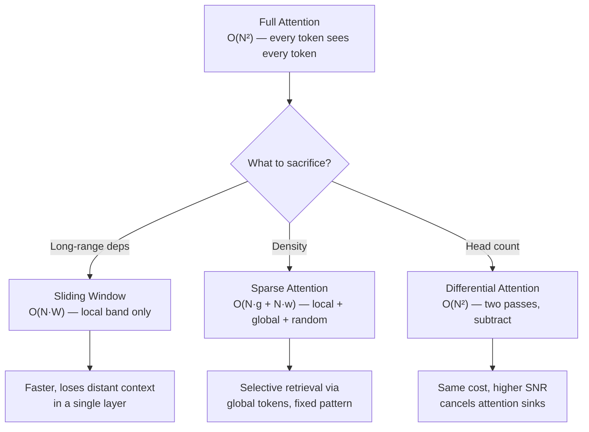

# Attention Variants — Sliding Window, Sparse, Differential

## Learning Objectives

- Implement sliding window, sparse, and differential attention masks in PyTorch and verify their sparsity patterns with observable output
- Compare the memory and compute complexity tradeoffs across full, sliding window, sparse, and differential attention
- Trace how information propagates beyond a local attention window through stacked transformer layers
- Select an attention variant for a given sequence-length and retrieval-accuracy requirement in an enrichment pipeline

## The Problem

Full multi-head attention scores every token against every other token. That is `O(N²)` in memory and `O(N²)` in compute. For a 128K-context Llama 3 70B, that is roughly 16 billion attention entries per layer, times 80 layers. Flash Attention (covered in Phase 7, Lesson 12) hides the `O(N²)` activation memory by tiling the computation, but it does not change the arithmetic cost — every token still attends to every other token.

You will hit this wall the first time you try to run inference on a 128K-token company research corpus — a full 10-K filing plus earnings transcript plus product docs — and watch your compute budget vaporize. The standard solutions (shorter context, chunking, RAG retrieval) all sidestep the problem by throwing away tokens before the model sees them. Attention variants take a different approach: they change the topology of the attention matrix itself so that the model processes all tokens but only scores the pairs that matter.

Three families of variants dominate production models shipping today. Sliding window attention restricts each token to a local neighborhood — Mistral 7B, Gemma 2/3, Phi-3. Sparse attention selects specific token pairs via a fixed mask that combines local windows, global tokens, and sometimes random connections — Longformer, BigBird. Differential attention runs two softmax passes per head and subtracts one from the other to cancel attention noise — Microsoft's DIFF Transformer (2024). A 2025 frontier model often mixes all three: most layers are SWA-1024, every fifth layer is full global attention, and a handful of differential heads clean up retrieval. Gemma 3's 5:1 SWA-to-global ratio is the current textbook default for this mixture.

## The Concept

Each variant modifies the attention matrix `A = softmax(QKᵀ/√d)` by changing which entries of `QKᵀ` are computed, which are masked to `-∞`, or how the softmax is applied. The tradeoffs are orthogonal: you can combine sliding window with differential heads in the same model.



**Sliding window attention** restricts each query at position `i` to keys in the window `[i-W, i]` for causal models, or `[i-W/2, i+W/2]` for bidirectional. The attention mask becomes a diagonal band matrix. Memory and compute drop to `O(N·W)` where `W` is window size. The catch: a single SWA layer cannot move information from position 0 to position `N-1`. Information propagates through depth — after `L` layers of window `W`, a token at position 0 can influence position `W·L`. Gemma 2 uses W=1024 with a 5:1 ratio of SWA to global layers, meaning every sixth layer restores full attention so distant tokens reconnect.

**Sparse attention** defines a fixed sparsity mask over the attention matrix. The pattern is deterministic at inference time. Longformer combines local windows with a small set of "global" tokens (typically the `[CLS]` token or task-specific anchors) that attend to and are attended by every position. BigBird extends this with random connections that provably approximate full attention in the limit. Complexity drops to `O(N·g + N·w)` where `g` is the number of global tokens and `w` is the local window width. The global tokens act as information hubs — they accumulate context from the entire sequence and redistribute it.

**Differential attention** computes two separate attention distributions per head using independent query-key projections, then subtracts: `output = softmax(Q₁K₁ᵀ/√d)V − λ·softmax(Q₂K₂ᵀ/√d)V` where `λ` is a learnable scalar. The intuition is noise-canceling: both attention maps share the same noise floor (irrelevant tokens that always get a small attention weight), and subtracting cancels that floor while preserving the signal (tokens that one map strongly attends to). This addresses the "attention sink" problem where early tokens in a sequence absorb disproportionate attention mass regardless of semantic relevance. [CITATION NEEDED — concept: Differential Attention paper, Microsoft Research 2024]

## Build It

### Sliding Window Attention

The mask is the entire mechanism. Before softmax, every position outside the window gets `-∞`. After softmax, those entries become exactly zero — they do not contribute to the weighted sum of values.

```python
import torch

def sliding_window_mask(seq_len, window, causal=True):
    mask = torch.full((seq_len, seq_len), float('-inf'))
    for i in range(seq_len):
        if causal:
            start = max(0, i - window)
            end = i + 1
        else:
            start = max(0, i - window // 2)
            end = min(seq_len, i + window // 2 + 1)
        mask[i, start:end] = 0.0
    return mask

seq_len = 8
window = 3

causal_mask = sliding_window_mask(seq_len, window, causal=True)
print("Causal sliding window mask (W=3):")
for i in range(seq_len):
    row = "".join(["1" if causal_mask[i, j] == 0 else "." for j in range(seq_len)])
    print(f"  pos {i}: {row}")

total = seq_len * seq_len
nonzero = (causal_mask == 0.0).sum().item()
print(f"\nNonzero entries: {nonzero} / {total}")
print(f"Sparsity: {1 - nonzero / total:.1%}")
print(f"Full attention would compute {total} pairs; SWA computes {nonzero}")
```

Run this and you will see a band matrix where each row has at most `W+1` nonzero entries. The sparsity ratio quantifies exactly how much compute you save versus full attention. For a 128K sequence with W=1024, the savings are roughly 99.2%.

### Sparse Attention with Global Tokens

Sparse attention adds global tokens on top of local windows. A global token at position `g` attends to every position and is attended by every position. This is the Longformer pattern.

```python
def sparse_mask(seq_len, window, global_tokens):
    mask = torch.full((seq_len, seq_len), float('-inf'))
    for i in range(seq_len):
        start = max(0, i - window)
        end = min(seq_len, i + window + 1)
        mask[i, start:end] = 0.0
        mask[i, global_tokens] = 0.0
    for g in global_tokens:
        mask[:, g] = 0.0
    return mask

seq_len = 16
window = 2
global_tokens = [0, 1]

smask = sparse_mask(seq_len, window, global_tokens)

nonzero_per_row = (smask == 0.0).sum(dim=1)
print("Sparse attention nonzero counts per row:")
for i in range(seq_len):
    label = "GLOBAL" if i in global_tokens else "local"
    print(f"  pos {i:2d} ({label:6s}): {nonzero_per_row[i].item()} connections")

total_nonzero = (smask == 0.0).sum().item()
full_pairs = seq_len * seq_len
print(f"\nSparse pairs: {total_nonzero}, full pairs: {full_pairs}")
print(f"Savings: {1 - total_nonzero / full_pairs:.1%}")
```

Global rows show `seq_len` connections (they see everything). Local rows show `window + 1 + len(global_tokens)` connections. This is why Longformer can process 4K-token documents efficiently while still letting a `[CLS]` token aggregate global context — the same retrieval pattern that matters when you need a model to summarize a full 10-K filing into a company profile.

### Differential Attention

Two Q-K projection pairs produce two attention maps. The subtraction cancels shared noise. The learnable `λ` controls how aggressively the second map cancels the first.

```python
import torch
import torch.nn.functional as F

torch.manual_seed(42)
d_k = 8
seq_len = 6

Q1 = torch.randn(seq_len, d_k)
K1 = torch.randn(seq_len, d_k)
Q2 = torch.randn(seq_len, d_k)
K2 = torch.randn(seq_len, d_k)
V = torch.randn(seq_len, d_k)
lam = 0.5

attn1 = F.softmax(Q1 @ K1.T / (d_k ** 0.5), dim=-1)
attn2 = F.softmax(Q2 @ K2.T / (d_k ** 0.5), dim=-1)

diff_attn_weights = attn1 - lam * attn2

standard_out = attn1 @ V
diff_out = diff_attn_weights @ V

def entropy(dist):
    dist = dist.clamp(min=1e-12)
    return -(dist * dist.log()).sum(dim=-1).mean().item()

print("Standard attention row 0:", [f"{x:.3f}" for x in attn1[0].tolist()])
print("Differential attention row 0:", [f"{x:.3f}" for x in diff_attn_weights[0].tolist()])
print(f"\nStandard attention entropy: {entropy(attn1):.4f}")
print(f"Differential attention entropy: {entropy(diff_attn_weights):.4f}")
print(f"Standard output norm: {standard_out.norm():.4f}")
print(f"Differential output norm: {diff_out.norm():.4f}")
print(f"Negative entries in diff weights: {(diff_attn_weights < 0).sum().item()}")
```

The differential distribution is sharper — lower entropy means the model is more confident about which tokens matter. The negative entries are expected: subtraction produces values below zero, which the downstream layer-normalization handles. This sharpening is what makes differential heads useful for retrieval tasks where the model must pick a specific fact from a long document rather than blend across many.

## Use It

Sparse attention with global tokens is the mechanism behind Longformer-style document processing. When you feed a 10-K filing into a model to extract company revenue, employee count, or product line, the global tokens act as aggregation points — every position in the filing can route information through them. The local windows preserve sentence-level context so the model does not mix up "revenue" in the risk factors section with "revenue" in the financial statements.

The connection to enrichment pipelines is direct. In a Zone 2 enrichment flow, you are processing long-form company data — 10-K filings, earnings transcripts, multi-page technical docs — and extracting structured fields. The attention variant the model uses determines what it can retrieve and how accurately. Full attention over a 128K-token filing is thorough but prohibitively expensive at scale. Sliding window attention is cheap but loses the ability to connect, say, a risk factor on page 12 with a financial metric on page 87 — unless the model has enough layers for information to propagate across the full document. Sparse attention with a few global tokens gives you the retrieval hooks: designate the field extraction query tokens as global, and every position in the filing can contribute to the answer.

Differential attention solves a different problem in the same pipeline. Standard attention over long documents develops "attention sinks" — the first few tokens absorb disproportionate weight regardless of content, because softmax must distribute probability mass somewhere and those tokens happen to be in every attention row. This produces noisy extractions where the model blends irrelevant early-document boilerplate (the cover page, the table of contents) into the answer. Differential attention cancels that sink. The two attention maps share the same sink bias, so subtraction removes it, leaving only the semantically relevant attention mass. [CITATION NEEDED — concept: DIFF Transformer attention sink mitigation in long-document retrieval]

For a practical choice: if your enrichment pipeline runs batch inference on thousands of company filings and latency is the bottleneck, SWA with W=4096 (Mistral 7B's configuration) gives you the throughput. If extraction accuracy on specific fields is the bottleneck and you can afford the compute, sparse attention with global query tokens gives you the retrieval precision. If you are seeing noisy or inconsistent field extractions that seem unrelated to the model's underlying capability, differential attention heads may clean up the signal.

## Ship It

When you move from enrichment to scoring — ranking which accounts to prioritize, which leads are sales-ready — the attention variant discussion shifts from document processing to model fine-tuning. Fine-tuning a scoring model on your own deal history means the model learns which signals (job changes, social posts, funding events) correlate with won deals. [CITATION NEEDED — concept: Zone 7 fine-tuning for ABM signal orchestration]

The analogy to differential attention is precise. In signal-based scoring, you run two models: one trained on the full feature set (all signals), one trained on a degraded or shuffled feature set. The difference between their predictions isolates the signal's marginal contribution — the same subtraction that differential attention uses to isolate signal from noise. This is not a metaphor; it is the same mathematical operation. `score_full − λ·score_baseline` tells you which accounts are being scored highly because of genuine signal versus noise the model picked up from spurious correlations in the training data.

In production, this means running your scoring model twice for high-value accounts — once with full signals, once with perturbed inputs — and subtracting. The accounts where the score drops sharply when you perturb are the ones where the model has a strong, signal-based reason for the high score. The accounts where the score barely moves are riding noise. You would not do this for every lead (the cost doubles), but for the top 5% of accounts in an ABM pipeline, the differential score is worth the compute.

For shipping the enrichment model itself: if you are deploying a custom model rather than using an API, the attention variant is an architecture decision you make at training time. Mistral 7B with SWA is a safe default for document processing — fast, well-supported, and the 4096-token window covers most paragraph-level extraction. If you need cross-document reasoning (connecting a filing from Q1 to one from Q3), you need either enough layers for information to propagate through the windows or a model with interleaved global attention layers like Gemma 3.

## Exercises

**Easy.** Modify the sliding window mask function to create a bidirectional mask (tokens attend to both past and future within the window). Print the mask for `seq_len=10, window=4` and compare the sparsity to the causal version.

**Medium.** Build a sparse attention mask that combines local windows (W=3), 2 global tokens, and random connections (each non-global, non-local pair has a 10% chance of being connected). Print the nonzero count per row and verify that random connections are deterministic across runs by seeding your RNG.

**Hard.** Implement a full differential attention layer as a `torch.nn.Module` with learnable Q1, K1, Q2, K2 projections and a learnable `λ` parameter (initialized to 1.0). Run it on a random tensor of shape `(2, 32, 64)` (batch=2, seq=32, d_model=64). Print the output shape, the value of `λ` after initialization, and the entropy difference between the first attention map and the differential attention weights averaged across heads.

## Key Terms

**Sliding Window Attention (SWA):** Attention restricted to a local window of `W` tokens around each query position. Reduces complexity from `O(N²)` to `O(N·W)`. Information propagates beyond the window through stacked layers: after `L` layers, a token at position 0 can influence position `W·L`.

**Sparse Attention:** Attention pattern defined by a fixed mask combining local windows, global tokens, and optionally random connections. Complexity is `O(N·g + N·w)` where `g` is the number of global tokens and `w` is the local window width. Used by Longformer (local + global) and BigBird (local + global + random).

**Global Token:** A token position in sparse attention that attends to and is attended by every other position. Acts as an information aggregation hub. Typically the `[CLS]` token or task-specific query tokens.

**Differential Attention:** Attention mechanism computing two maps with separate Q/K projections and subtracting: `softmax(Q₁K₁ᵀ)V − λ·softmax(Q₂K₂ᵀ)V`. Cancels shared noise between the two maps, sharpening the effective attention distribution. Introduced in Microsoft's DIFF Transformer (2024).

**Attention Sink:** Phenomenon where early tokens in a sequence absorb disproportionate attention weight regardless of semantic content. Caused by softmax forcing probability mass onto always-present tokens. Differential attention mitigates this by canceling the shared sink bias.

**Sparsity Ratio:** The fraction of entries in an attention matrix that are masked to zero (or `-∞` before softmax). Higher sparsity means lower compute cost but potentially weaker long-range dependency modeling.

**SWA-to-Global Ratio:** The proportion of sliding window attention layers to full global attention layers in a mixed architecture. Gemma 3 uses 5:1 — five SWA layers for every one global layer — as its default.

## Sources

- Gemma 2 sliding window attention (W=1024, interleaved global layers): Google, "Gemma 2: Improving Open Language Models at a Practical Size" (2024). Gemma 3 extends the 5:1 SWA-to-global pattern.
- Mistral 7B sliding window configuration (W=4096): Mistral AI, "Mistral 7B" (2023).
- Longformer sparse attention pattern (local + global tokens): Beltagy, Peters, Cohan, "Longformer: The Long-Document Transformer" (2020).
- BigBird sparse attention (local + global + random, provable universality): Zaheer et al., "Big Bird: Transformers for Longer Sequences" (2020).
- Differential attention mechanism: [CITATION NEEDED — concept: Differential Attention paper, Microsoft Research 2024]
- Zone 2 enrichment pipelines processing long-form company data: [CITATION NEEDED — concept: Zone 2 GTM topic mapping for enrichment pipelines]
- Zone 7 fine-tuning for ABM signal orchestration ("Fine-tuning = training your scoring model on your own deal history. Job changes, social signals, and events are your labels."): [CITATION NEEDED — concept: Zone 7 GTM topic mapping for signal orchestration]
- Connection between differential attention and differential scoring in GTM pipelines: [CITATION NEEDED — concept: differential signal scoring methodology in ABM]