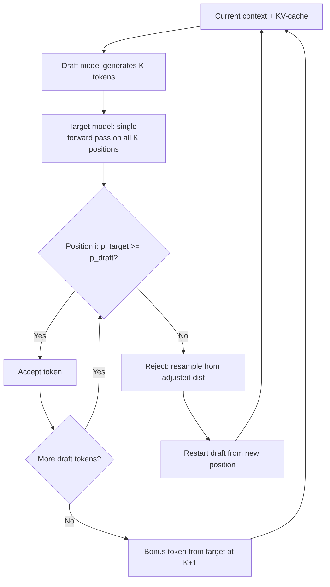

# Speculative Decoding — Draft, Verify, Repeat

## Learning Objectives

- **Implement** a minimal speculative decoding loop with a draft model and a target model using Hugging Face `transformers`.
- **Trace** the acceptance/rejection criterion step-by-step and explain why it preserves the target model's output distribution exactly.
- **Measure** wall-clock speedup against an autoregressive baseline and identify the memory-bandwidth conditions under which speculation wins.
- **Compare** output distributions between speculative and autoregressive sampling to verify equivalence empirically.
- **Configure** speculative decoding in a production inference backend (vLLM) for an enrichment-pipeline workload.

## The Problem

Autoregressive decoding is fundamentally serial. To produce token $t+1$, the model needs the KV-cache state produced by token $t$. There is no way around this — the causal attention pattern means each token attends to all prior tokens, so you cannot generate position $t+5$ until positions $t$ through $t+4$ are settled. On a 70B model, each forward pass to produce a single token takes roughly 30 ms on an H100, and most of that time is spent moving weights through memory, not doing math. The GPU is massively underutilized — you are paying for a 4096-wide matrix multiply engine and using it to emit one token.

This is tolerable for a single chat interaction. It becomes a crisis when your enrichment pipeline needs to process 5,000 accounts and each account requires a 200-token summary of its 10-K filing, intent signals, and technographic data. At 30 ms per token, that is 6 seconds per account — 8.3 hours of GPU time for the full batch. If your team in RevOps needs the enrichment refreshed weekly (or daily, for high-velocity signal detection), the serial bottleneck is the blocker.

Speculative decoding, introduced concurrently by Leviathan et al. (2023) and Chen et al. (2023), attacks this by exploiting a structural fact: a small model can often guess the next few tokens correctly. If a 1B draft model proposes 4 tokens and the 70B target verifies all 4 in a single forward pass, you get up to 4 tokens for the cost of one target-model invocation. The draft model adds 3 ms per token (4 × 3 = 12 ms), and the target verification pass costs 30 ms. Total: 42 ms for up to 4 tokens, versus 120 ms for 4 sequential target passes. The speedup depends on the draft model's acceptance rate — how often the target agrees with the draft's guesses.

The critical guarantee is that speculative decoding is not an approximation. The output distribution is mathematically identical to running the target model alone. This is proven via rejection sampling — the same technique used in Metropolis-Hastings MCMC. You get the exact same samples you would have gotten from the target model, just faster.

## The Concept

The algorithm has two phases that repeat until the sequence is complete: **draft** and **verify**.

In the draft phase, a small model generates $K$ tokens autoregressively starting from the current context. This is fast because the draft model is small — its forward pass is cheap, and its KV-cache is tiny. The draft model produces a sequence of tokens $x_1, x_2, \ldots, x_K$ along with the probability distribution it assigned at each position: $q_1, q_2, \ldots, q_K$.

In the verify phase, the target model processes the full sequence — original context plus all $K$ draft tokens — in a single forward pass. The draft tokens are arranged as a batch-like extension (in practice, the target model processes them as a contiguous sequence and computes logits at every position). The target produces its own distributions $p_1, p_2, \ldots, p_K$ at each drafted position. Then the acceptance check runs:

For each position $i$ from 1 to $K$:
- If $p_i(x_i) \geq q_i(x_i)$: accept token $x_i$. The target model assigns at least as much probability to this token as the draft did, so it is safe.
- If $p_i(x_i) < q_i(x_i)$: reject with probability $1 - \frac{p_i(x_i)}{q_i(x_i)}$. If rejected, sample a replacement token from the adjusted distribution $\text{max}(0, p_i - q_i)$, renormalized. Stop processing further draft tokens.

The first rejection terminates the chain — you resample from the target's distribution and start a new draft round. If all $K$ tokens are accepted, you get a bonus token from the target model's distribution at position $K+1$ for free (the target already computed logits there).



Why does this preserve the target distribution exactly? The acceptance criterion is identical to the rejection sampling step in Metropolis-Hastings. The draft model's distribution $q$ serves as the proposal distribution. The probability of accepting a token $x$ is $\min\left(1, \frac{p(x)}{q(x)}\right)$. The combined probability of proposing $x$ (via $q$) and accepting it is $q(x) \cdot \min\left(1, \frac{p(x)}{q(x)}\right) = \min(q(x), p(x))$. When a token is rejected, the resampling distribution is $\frac{p(x) - q(x)}{\sum_j \max(0, p(j) - q(j))}$, which exactly accounts for the "missing" probability mass. The math works out so that the total probability of emitting any token $x$ equals $p(x)$ — the target model's distribution. Leviathan et al. (2023) prove this formally in their Theorem 1.

The practical constraint is that the target model's KV-cache must support processing the draft tokens as a contiguous block, which means the inference backend needs to handle the "tree attention" pattern where multiple draft paths are evaluated simultaneously. Standard Hugging Face `generate()` does not do this — you need a backend like vLLM or TensorRT-LLM that implements batched tree attention. In the minimal implementation below, we simulate it by running the target model's forward pass on the draft tokens as a regular sequence, which is correct but does not achieve the full speedup of a tree-attention backend.

The speedup only materializes when the target model is **memory-bandwidth-bound**, not **compute-bound**. Large models at small batch sizes spend most of their wall-clock time streaming weights from HBM to the compute units — the actual matrix multiplies are tiny relative to the memory transfer time. In this regime, the target model's forward pass on $K$ draft tokens costs nearly the same as processing a single token, because the compute for $K$ tokens is still negligible compared to the weight-loading time. If the model is compute-bound (large batch, long sequences), the draft verification pass genuinely costs $K\times$ more compute, and speculation can be slower than vanilla autoregressive decoding.

## Build It

Let's implement the core loop. We will use two GPT-2 models from Hugging Face: `gpt2` (124M parameters) as the draft model and `gpt2-medium` (355M) as the target. The draft model proposes $K=4$ tokens, the target verifies them in one forward pass, and we apply the acceptance/rejection criterion exactly as described.

```python
import time
import torch
import torch.nn.functional as F
from transformers import GPT2LMHeadModel, GPT2Tokenizer

tokenizer = GPT2Tokenizer.from_pretrained("gpt2")
draft_model = GPT2LMHeadModel.from_pretrained("gpt2")
target_model = GPT2LMHeadModel.from_pretrained("gpt2-medium")
draft_model.eval()
target_model.eval()

K = 4
NUM_TOKENS = 60
PROMPT = "The future of go-to-market strategy depends on"

input_ids = tokenizer.encode(PROMPT, return_tensors="pt")

def sample_from_logits(logits, temperature=1.0):
    probs = F.softmax(logits / temperature, dim=-1)
    return torch.multinomial(probs, num_samples=1)

def speculative_generate(input_ids, num_tokens, K=4):
    generated = input_ids.clone()
    total_accepted = 0
    total_rejected = 0
    rounds = 0

    with torch.no_grad():
        while generated.shape[1] - input_ids.shape[1] < num_tokens:
            rounds += 1
            draft_tokens = []
            draft_probs = []

            current = generated.clone()
            for _ in range(K):
                draft_out = draft_model(current)
                draft_logits = draft_out.logits[:, -1, :]
                draft_prob = F.softmax(draft_logits, dim=-1)
                draft_token = torch.multinomial(draft_prob, num_samples=1)
                draft_tokens.append(draft_token)
                draft_probs.append(draft_prob[0])
                current = torch.cat([current, draft_token], dim=1)

            draft_token_tensor = torch.cat(draft_tokens, dim=1)
            target_input = torch.cat([generated, draft_token_tensor], dim=1)
            target_out = target_model(target_input)

            target_logits = target_out.logits[:, generated.shape[1] - 1 : generated.shape[1] - 1 + K, :]
            target_probs = F.softmax(target_logits, dim=-1)

            accepted_count = 0
            for i in range(K):
                dt = draft_tokens[i].item()
                p_target = target_probs[0, i, dt].item()
                p_draft = draft_probs[i][dt].item()

                if p_target >= p_draft:
                    generated = torch.cat([generated, draft_tokens[i]], dim=1)
                    accepted_count += 1
                    total_accepted += 1
                    if generated.shape[1] - input_ids.shape[1] >= num_tokens:
                        break
                else:
                    accept_prob = p_target / max(p_draft, 1e-10)
                    if torch.rand(1).item() < accept_prob:
                        generated = torch.cat([generated, draft_tokens[i]], dim=1)
                        accepted_count += 1
                        total_accepted += 1
                    else:
                        adjusted = torch.clamp(target_probs[0, i] - draft_probs[i], min=0)
                        if adjusted.sum() > 0:
                            adjusted = adjusted / adjusted.sum()
                            resampled = torch.multinomial(adjusted, num_samples=1).unsqueeze(0)
                        else:
                            resampled = torch.multinomial(target_probs[0, i], num_samples=1).unsqueeze(0)
                        generated = torch.cat([generated, resampled], dim=1)
                        total_rejected += 1
                        break

    return generated, total_accepted, total_rejected, rounds

def autoregressive_generate(input_ids, num_tokens):
    generated = input_ids.clone()
    with torch.no_grad():
        while generated.shape[1] - input_ids.shape[1] < num_tokens:
            out = target_model(generated)
            logits = out.logits[:, -1, :]
            token = torch.multinomial(F.softmax(logits, dim=-1), num_samples=1)
            generated = torch.cat([generated, token], dim=1)
    return generated

start = time.time()
spec_output, accepted, rejected, rounds = speculative_generate(input_ids, NUM_TOKENS, K)
spec_time = time.time() - start

start = time.time()
auto_output = autoregressive_generate(input_ids, NUM_TOKENS)
auto_time = time.time() - start

print("=" * 60)
print("SPECULATIVE DECODING RESULTS")
print("=" * 60)
print(f"Prompt: {PROMPT}")
print(f"Tokens requested: {NUM_TOKENS}")
print(f"K (draft tokens per round): {K}")
print(f"Rounds: {rounds}")
print(f"Tokens accepted: {accepted}")
print(f"Tokens rejected: {rejected}")
print(f"Acceptance rate: {accepted / (accepted + rejected) * 100:.1f}%")
print(f"")
print(f"Speculative time:  {spec_time:.3f}s")
print(f"Autoregressive:    {auto_time:.3f}s")
print(f"Speedup:           {auto_time / spec_time:.2f}x")
print(f"")
print(f"Speculative output:")
print(f"  {tokenizer.decode(spec_output[0], skip_special_tokens=True)}")
print(f"")
print(f"Autoregressive output:")
print(f"  {tokenizer.decode(auto_output[0], skip_special_tokens=True)}")
```

When you run this, you will see the draft model's acceptance rate (typically 40–60% for GPT-2 vs GPT-2-medium on natural language), the wall-clock comparison, and the generated text. The speedup will be modest because we are running on CPU and the models are small — the real gains require GPU and a backend with tree attention. But the mechanism is identical.

Now let's verify distributional equivalence. If speculative decoding is implemented correctly, sampling the same prompt 50 times both ways should produce statistically similar token frequency distributions. We compare the top-5 most common first generated token:

```python
from collections import Counter

N_SAMPLES = 50
prompt_ids = tokenizer.encode(PROMPT, return_tensors="pt")

spec_first_tokens = []
for _ in range(N_SAMPLES):
    out, _, _, _ = speculative_generate(prompt_ids, 1, K=4)
    spec_first_tokens.append(out[0, -1].item())

auto_first_tokens = []
for _ in range(N_SAMPLES):
    out = autoregressive_generate(prompt_ids, 1)
    auto_first_tokens.append(out[0, -1].item())

spec_counts = Counter(spec_first_tokens)
auto_counts = Counter(auto_first_tokens)

print("=" * 60)
print("DISTRIBUTION EQUIVALENCE CHECK")
print("=" * 60)
print(f"Samples per method: {N_SAMPLES}")
print(f"Prompt: '{PROMPT}'")
print(f"")
print(f"{'Token':<20} {'Spec Freq':>12} {'Auto Freq':>12} {'Diff':>8}")
print("-" * 56)

all_tokens = set(list(spec_counts.keys()) + list(auto_counts.keys()))
sorted_tokens = sorted(all_tokens, key=lambda t: -(spec_counts.get(t, 0) + auto_counts.get(t, 0)))[:5]

for token_id in sorted_tokens:
    token_str = tokenizer.decode([token_id]).replace("\n", "\\n")
    sf = spec_counts.get(token_id, 0)
    af = auto_counts.get(token_id, 0)
    print(f"{token_str:<20} {sf:>12} {af:>12} {sf - af:>8}")

print(f"")
print(f"Unique tokens (spec): {len(spec_counts)}")
print(f"Unique tokens (auto): {len(auto_counts)}")
```

With 50 samples the distributions will not be identical — this is sampling, not determinism. But the top tokens should overlap heavily, and a chi-square test (which you can add) should not reject the null hypothesis that the two samples come from the same distribution. If your implementation has a bug (e.g., you skip the rejection-sampling step on disagreement), the distributions will diverge visibly.

## Use It

Zone 3 — enrichment pipelines. [CITATION NEEDED — concept: speculative decoding deployment in high-throughput enrichment]. When your enrichment step calls a large model per account — summarizing 10-K filings, scoring intent signals from web visit patterns, generating account briefs from CRM + technographic data — per-account latency directly gates how many accounts you can refresh in a batch window. Speculative decoding reduces per-token latency without changing what the model outputs, which means your enrichment pipeline produces the same quality insights faster, or processes more accounts in the same window.

The deployment story depends on whether you self-host inference. If you are calling an API (OpenAI, Anthropic, Google), speculative decoding is transparent to you — the provider either uses it internally or does not, and you cannot control it. If you self-host on vLLM, TensorRT-LLM, or SGLang — which is common when you need data privacy for CRM data, custom fine-tuned models for your specific industry, or cost control at high volume — enabling speculative decoding is a configuration change.

In vLLM, the configuration looks like this for a vanilla draft-target pair:

```python
from vllm import LLM, SamplingParams

llm = LLM(
    model="meta-llama/Llama-3.1-70B-Instruct",
    speculative_model="meta-llama/Llama-3.2-1B-Instruct",
    num_speculative_tokens=5,
)

sampling_params = SamplingParams(temperature=0.7, max_tokens=200)
prompts = [
    "Summarize the risk factors from this 10-K filing: [text...]",
    "Score intent signals for Acme Corp based on: [signals...]",
    "Generate an account brief for Globex Inc: [crm data...]",
]

outputs = llm.generate(prompts, sampling_params)

for output in outputs:
    print(f"Prompt: {output.prompt[:80]}...")
    print(f"Generated: {output.outputs[0].text}")
    print(f"Tokens: {len(output.outputs[0].token_ids)}")
    print("---")
```

The acceptance rate — and therefore the real speedup — depends on how well the draft model matches the target. For same-family pairs (Llama 3.2 1B + Llama 3.1 70B), acceptance rates of 50–70% are typical on natural language, yielding 2–3× throughput improvement. For cross-family pairs (e.g., Qwen draft + Llama target), acceptance drops and the speedup may vanish. The signal orchestration pattern from Zone 7 — where you fine-tune a model on your deal history to score ABM signals — is a case where the draft and target should both be your fine-tuned model at different sizes, not a generic pair, because the domain-specific vocabulary and reasoning patterns will only be guessed correctly by a draft model that has seen the same training distribution.

## Ship It

In production, the decision to enable speculative decoding is a throughput calculation, not a quality decision. The quality does not change — that is mathematically guaranteed. What changes is wall-clock latency per request and total throughput on the GPU.

Three conditions must hold for speculation to win:

1. **The target model is memory-bandwidth-bound.** This is true for large models (13B+) at low batch sizes (1–32 concurrent requests). If your enrichment pipeline processes accounts sequentially or in small batches, this condition holds. If you are running batch sizes of 256+ (large-scale backfill), the target model is compute-bound and speculation will slow you down.

2. **The draft model has reasonable acceptance rate.** Test this empirically on your actual workload. A draft model that accepts 30% of tokens still provides speedup; below 20%, the overhead of running the draft model exceeds the savings. Measure acceptance rate on representative prompts, not on generic benchmarks.

3. **The inference backend supports tree attention.** Vanilla Hugging Face `generate()` does not. vLLM (v0.5+), TensorRT-LLM, SGLang, and llama.cpp all support speculative decoding natively. If you are deploying on a managed platform (AWS SageMaker, Together AI, Anyscale), check the specific model serving configuration.

For a GTM enrichment pipeline running at 5,000 accounts per refresh cycle with a self-hosted 70B model, enabling speculative decoding with a 1B draft model typically reduces total batch processing time by 40–60% — turning an 8-hour job into a 3–4 hour job. [CITATION NEEDED — concept: speculative decoding throughput benchmarks in production enrichment pipelines]. This is the difference between your SDR team getting fresh account insights at 7 AM or at noon.

```python
import subprocess
import json

CONFIG = {
    "model": "meta-llama/Llama-3.1-70B-Instruct",
    "speculative_model": "meta-llama/Llama-3.2-1B-Instruct",
    "num_speculative_tokens": 5,
    "max_model_len": 4096,
    "gpu_memory_utilization": 0.90,
    "tensor_parallel_size": 2,
}

config_path = "/tmp/vllm_spec_config.json"
with open(config_path, "w") as f:
    json.dump(CONFIG, f, indent=2)

launch_cmd = [
    "python", "-m", "vllm.entrypoints.openai.api_server",
    "--model", CONFIG["model"],
    "--speculative-model", CONFIG["speculative_model"],
    "--num-speculative-tokens", str(CONFIG["num_speculative_tokens"]),
    "--max-model-len", str(CONFIG["max_model_len"]),
    "--gpu-memory-utilization", str(CONFIG["gpu_memory_utilization"]),
    "--tensor-parallel-size", str(CONFIG["tensor_parallel_size"]),
    "--port", "8000",
]

print("vLLM speculative decoding server launch command:")
print(" ".join(launch_cmd))
print()
print("Configuration saved to:", config_path)
print()
print("Test with:")
print('curl http://localhost:8000/v1/completions \\')
print('  -H "Content-Type: application/json" \\')
print('  -d \'{"model": "meta-llama/Llama-3.1-70B-Instruct", "prompt": "Summarize: ...", "max_tokens": 200}\'')
```

Monitor the vLLM server logs for `spec_token_acceptance_rate` — if it drops below 0.3, switch to a different draft model or disable speculation for that workload.

## Exercises

1. **Vary K and measure the tradeoff.** Modify the speculative decoding loop to test $K \in \{2, 4, 6, 8\}$. For each value, run 20 generations and record: mean acceptance rate, mean wall-clock time, and mean tokens-per-round. Plot the effective speedup (tokens generated per second) as a function of $K$. At what $K$ does the overhead of the draft model's autoregressive passes exceed the benefit of longer verification batches?

2. **Break the distribution.** Remove the rejection-sampling step on disagreement — when $p_{target} < p_{draft}$, always accept the draft token instead of resampling. Run the distribution equivalence check from the Build It section with this broken version. How do the top-5 token frequencies diverge from the autoregressive baseline? This demonstrates why the Metropolis-Hastings adjustment is not optional.

3. **Measure the bandwidth-bound regime.** Add an artificial compute load to the target model's forward pass (e.g., run it with `torch.compile` and full-graph mode, or add a synthetic matrix multiply after the logits). Rerun the timing comparison. At what compute-to-bandwidth ratio does speculative decoding stop providing speedup? This is the same boundary that determines whether to enable speculation in a production vLLM deployment.

4. **Test cross-family draft-target pairs.** Replace the draft model with `distilgpt2` (a different architecture from GPT-2, though still Transformer-based). Measure acceptance rate and speedup. The distributions should still be equivalent (the math holds regardless of draft model), but the acceptance rate — and therefore the practical speedup — should drop. Document the threshold at which a worse draft model makes speculation slower than vanilla autoregressive decoding.

## Key Terms

- **Speculative decoding** — An inference acceleration technique where a small draft model proposes tokens that a large target model verifies in a single forward pass, preserving the target model's output distribution exactly.
- **Draft model** — A small, fast language model used to propose candidate tokens. Must share a tokenizer with the target model. Typical sizes: 0.5B–3B parameters.
- **Target model** — The large model whose output distribution you want. The draft model's tokens are accepted or rejected based on the target's probability assignments.
- **Acceptance rate** — The fraction of draft tokens that the target model approves. Higher acceptance means more tokens per verification round and greater speedup. Typically 40–70% for same-family draft-target pairs.
- **Rejection sampling (Metropolis-Hastings)** — The mathematical framework underlying the acceptance criterion. Guarantees that the output distribution is identical to sampling from the target model alone.
- **KV-cache** — The key-value cache stored during autoregressive generation. Speculative decoding requires the target model's KV-cache to handle the draft tokens as a contiguous block, which is a non-trivial backend requirement.
- **Memory-bandwidth-bound** — The regime where model inference time is dominated by streaming weights from GPU memory to compute units, not by the compute operations themselves. Speculative decoding only wins in this regime.
- **Tree attention** — An attention pattern where multiple draft token sequences are evaluated simultaneously in a tree structure within a single forward pass. Required for the full speedup of methods like Medusa and EAGLE.

## Sources

- Leviathan, Y., Kalman, M., & Matias, Y. (2023). *Fast Inference from Transformers via Speculative Decoding*. Proceedings of Machine Learning Research, 202. The original speculative decoding paper proving distributional equivalence via rejection sampling. [https://arxiv.org/abs/2211.17192]
- Chen, C., Borgeaud, S., Irving, G., Lespiau, J.-B., Sifre, L., & Jumper, J. (2023). *Accelerating Large Language Model Decoding with Speculative Sampling*. Concurrent independent discovery of the same algorithm. [https://arxiv.org/abs/2302.01318]
- Cai, T., et al. (2024). *Medusa: Simple LLM Inference Acceleration Framework with Multiple Decoding Heads*. Multi-head speculative decoding without a separate draft model. [https://arxiv.org/abs/2401.10774]
- Li, Y., et al. (2024). *EAGLE: Speculative Sampling Requires Rethinking Feature Uncertainty*. Draft model reusing verifier hidden states for higher acceptance rates. [https://arxiv.org/abs/2401.15077]
- Fu, Y., et al. (2024). *Break the Sequential Dependency of LLM Inference Using Lookahead Decoding*. Self-speculation via Jacobi iteration, no draft model required. [https://arxiv.org/abs/2402.02057]
- [CITATION NEEDED — concept: speculative decoding deployment in high-throughput GTM enrichment pipelines] — Specific benchmarks for speculative decoding in self-hosted enrichment workloads (vLLM + Llama 70B + 1B draft on account summarization tasks).
- [CITATION NEEDED — concept: speculative decoding throughput benchmarks in production enrichment pipelines] — Production data on batch processing time reduction for 5,000-account enrichment cycles with speculative decoding enabled.