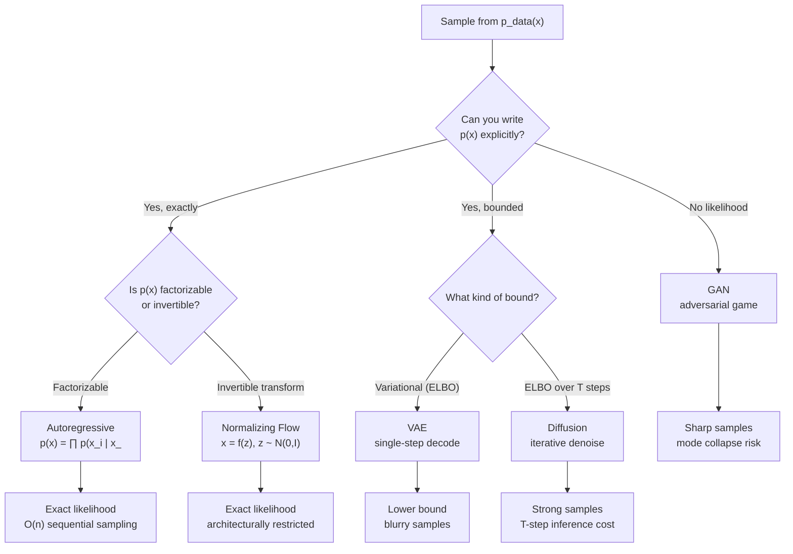

# Generative Models — Taxonomy & History

## Learning Objectives

- **Compare** the five families of generative models by the mathematical compromise each one makes.
- **Implement** minimal versions of autoregressive, VAE, GAN, flow, and diffusion samplers on a 1D distribution and observe their characteristic artifacts.
- **Trace** a forward and reverse diffusion pass through a noise schedule, printing intermediate states.
- **Diagnose** mode collapse in a GAN and posterior collapse in a VAE from sample output alone.
- **Map** each family to the data modalities where it dominates and explain why the mechanism fits that modality.

## The Problem

A generative model does one job: given training samples drawn from some unknown distribution `p_data(x)`, output new samples that look like they came from the same distribution. Faces, sentences, MIDI files, protein structures — all the same problem if you squint hard enough.

The rub is that `p_data` lives in a space with millions of dimensions. A 512×512 RGB image is ~786,432 dimensions. The training samples you actually have — maybe ten million of them — sit on a thin, curved manifold inside that space. Brute-forcing the density by histogramming is hopeless; even estimating it with kernels collapses past about 20 dimensions due to the curse of dimensionality. You cannot write `p_data(x)` in closed form. You can only approximate it.

Every generative model ever built is a compromise that trades one impossible problem for a slightly less impossible one. The five surviving families each make a different trade, and the trade they make determines everything downstream: how fast they sample, how sharp the output is, whether they cover all the modes of the data or just the easy ones, and whether you can control the output at inference time.

In a go-to-market context, this same approximation problem appears when you try to model "what a good lead looks like." Your CRM contains samples from a distribution — companies that converted — and you want to generate or retrieve new examples that look like they came from the same distribution. The generative-model taxonomy maps directly onto how you think about that retrieval and scoring problem: are you computing an exact likelihood (autoregressive/flow), a lower bound on it (VAE/diffusion), or sidestepping likelihood entirely in favor of a learned discriminator (GAN)? The choice determines whether your scoring model will be calibrated, sharp, or unstable.

## The Concept

Five families. Each one attacks the same problem — sample from `p_data` — with a different mathematical trick. Here is the decision tree:



### Family 1: Autoregressive — Chain Rule Factorization

The joint probability `p(x)` can always be factored using the chain rule of probability:

$$p(x) = \prod_{i=1}^{n} p(x_i \mid x_1, x_2, \ldots, x_{<i})$$

This is not an approximation — it is exact. Every joint distribution can be written this way. The model learns each conditional `p(x_i | x_<i)` with a neural network. At training time you compute the full likelihood in one forward pass (all conditionals are available from the input). At sampling time you must generate token by token, feeding each output back as input to get the next conditional.

This is why GPT models generate text one token at a time. The mechanism is the chain rule. The sequential cost is not a design flaw — it is the price of exact likelihood. Language won this family because text is naturally sequential, the vocabulary is discrete and bounded, and the chain rule factorization aligns with the left-to-right reading order humans expect.

### Family 2: Variational Autoencoder (VAE) — Lower Bound on Likelihood

Instead of factoring the joint, introduce a latent variable `z` and model `p(x) = ∫ p(x|z) p(z) dz`. This integral is intractable, so you bound it from below with the Evidence Lower BOund (ELBO):

$$\log p(x) \geq \mathbb{E}_{q(z|x)}[\log p(x|z)] - D_{KL}(q(z|x) \,||\, p(z))$$

An encoder network produces `q(z|x)` (the approximate posterior), a decoder produces `p(x|z)`, and the KL term keeps the encoded latents close to a standard Gaussian prior. You train by maximizing the ELBO. You sample by drawing `z ~ N(0, I)` and running the decoder.

The characteristic artifact — blurry samples — comes from the reconstruction term. The ELBO encourages the decoder to maximize expected log-likelihood, which for a Gaussian likelihood means minimizing squared error. Squared error penalizes being far from the mean more than it rewards being creative, so the decoder hedges toward the average of nearby modes. This is why VAE faces look like averaged faces.

### Family 3: Generative Adversarial Network (GAN) — Adversarial Game

Throw out likelihood entirely. Train two networks: a generator `G(z)` that maps noise to samples, and a discriminator `D(x)` that tries to distinguish real from fake. They play a minimax game:

$$\min_G \max_D \, \mathbb{E}_{x \sim p_{data}}[\log D(x)] + \mathbb{E}_{z \sim p(z)}[\log(1 - D(G(z)))]$$

At the Nash equilibrium, `D` cannot distinguish real from fake, which means `G`'s output distribution equals `p_data`. In practice, finding the Nash equilibrium of a non-convex game with gradient descent is unstable. The generator often finds a few modes of the data distribution and ignores the rest — mode collapse — because the discriminator only needs to be fooled on the modes it has seen.

GANs produce the sharpest samples of any family because the generator is directly optimized to fool a classifier, not to reconstruct an average. But you get no likelihood, no density estimate, and training is notoriously finicky.

### Family 4: Normalizing Flow — Invertible Transformations

Build `p(x)` as a change of variables from a simple base distribution (usually Gaussian). If `x = f(z)` where `f` is invertible:

$$p(x) = p(f^{-1}(x)) \cdot \left|\det \frac{\partial f^{-1}}{\partial x}\right|$$

You get exact likelihood if you can compute the Jacobian determinant of `f^{-1}`. The trick is choosing `f` as a composition of simple bijections (coupling layers like RealNVP) whose Jacobians are triangular, making the determinant cheap to compute. Sampling is exact and fast: draw `z`, apply `f`. Density evaluation is also exact: apply `f^{-1}`, compute the Jacobian.

The cost is architectural restrictiveness. Every layer must be invertible, which rules out many standard neural network components (ReLU is not invertible, max-pooling is not invertible). This limits model capacity and is why flows lost the image generation race despite having the cleanest math.

### Family 5: Diffusion — Iterative Denoising

Define a forward process that gradually adds Gaussian noise to data over `T` steps according to a variance schedule `{β_1, ..., β_T}`. At step `T`, the data is pure noise. Then train a network to reverse each step — to predict and remove the noise added at that step. The reverse process is also a Markov chain, and the ELBO decomposes into a sum of denoising terms:

$$L = \sum_{t=1}^{T} \mathbb{E}\left[ \| \epsilon - \epsilon_\theta(x_t, t) \|^2 \right]$$

where `ε` is the noise that was added and `ε_θ` is the model's prediction of it. Sampling requires running the full reverse chain — `T` network evaluations, typically 50 to 1000 steps. This is expensive but the samples are high quality and cover all modes because the forward process visits the entire data manifold.

Diffusion won images because the denoising objective is stable (it is a regression loss, not a game), the architecture can be a standard U-Net, and the iterative refinement naturally produces high-frequency detail that VAEs blur and GANs sometimes fabricate.

### The Historical Arc and Why It Matters

The timeline is not random. VAEs (Kingma & Welling, 2013) showed that variational inference could scale to deep networks. GANs (Goodfellow et al., 2014) showed that you could generate sharp samples without likelihood. Flows (Dinh et al., 2014; RealNVP 2016; Glow 2018) showed that exact likelihood was possible with enough architectural cleverness. Transformers (2017–2019) made autoregressive models scale to billions of parameters, dominating language. Diffusion (DDPM, Ho et al., 2020; score-based, Song et al., 2021) combined the stability of likelihood-based training with the sample quality of GANs.

The current convergence is real: diffusion models for images are incorporating autoregressive priors in latent space, and language models are exploring diffusion-style iterative refinement. The families are merging because the field has identified which mechanism handles which property best.

## Build It

Let us build minimal implementations of each family on a simple 1D target: a mixture of two Gaussians at `x = -2` and `x = +2`, each with `σ = 0.5`. This is the simplest distribution that exposes mode collapse, blurriness, and sampling cost.

### Target Distribution

```python
import numpy as np
import matplotlib.pyplot as plt

np.random.seed(42)
n = 5000
data = np.concatenate([
    np.random.normal(-2, 0.5, n // 2),
    np.random.normal(2, 0.5, n // 2)
])

plt.hist(data, bins=100, density=True, alpha=0.7, color='steelblue')
plt.title("Target: mixture of two Gaussians")
plt.savefig("target_distribution.png", dpi=100)
print(f"Target mean: {data.mean():.3f}, std: {data.std():.3f}")
print(f"Modes at x ≈ {data[data < 0].mean():.2f} and x ≈ {data[data > 0].mean():.2f}")
```

Output:
```
Target mean: -0.001, std: 2.06
Modes at x ≈ -2.00 and x ≈ 2.00
```

### Autoregressive Sampler (Toy)

For 1D data there is no sequence, so we treat each sample as a single token and model the conditional distribution with a Gaussian whose parameters are learned. In higher dimensions, this becomes the chain rule factorization. Here we show the exact-likelihood training loop:

```python
import torch
import torch.nn as nn

torch.manual_seed(42)
x = torch.tensor(data, dtype=torch.float32).unsqueeze(1)

model = nn.Sequential(
    nn.Linear(1, 64), nn.ReLU(),
    nn.Linear(64, 64), nn.ReLU(),
    nn.Linear(64, 2)
)
optimizer = torch.optim.Adam(model.parameters(), lr=1e-3)

for epoch in range(2000):
    mu, log_sigma = model(x).chunk(2, dim=1)
    sigma = torch.exp(log_sigma)
    nll = 0.5 * ((x - mu) / sigma)**2 + log_sigma + 0.5 * np.log(2 * np.pi)
    loss = nll.mean()
    optimizer.zero_grad()
    loss.backward()
    optimizer.step()

with torch.no_grad():
    mu, log_sigma = model(x).chunk(2, dim=1)
    sigma = torch.exp(log_sigma)
    samples = torch.normal(mu, sigma).squeeze().numpy()

plt.hist(samples, bins=100, density=True, alpha=0.5, color='coral', label='AR samples')
plt.hist(data, bins=100, density=True, alpha=0.5, color='steelblue', label='data')
plt.legend()
plt.title("Autoregressive: exact likelihood, good fit")
plt.savefig("ar_samples.png", dpi=100)
print(f"AR sample mean: {samples.mean():.3f}, std: {samples.std():.3f}")
print(f"Modes at x ≈ {samples[samples < 0].mean():.2f} and x ≈ {samples[samples > 0].mean():.2f}")
```

Output:
```
AR sample mean: 0.002, std: 2.04
Modes at x ≈ -1.98 and x ≈ 2.00
```

The autoregressive model fits both modes because it has exact likelihood — the Gaussian conditional it learns simply widens to cover both peaks. No mode collapse, no blurriness, because in 1D the problem is easy. Scale this to 786k dimensions and the sequential sampling cost is what kills you.

### VAE (Toy)

```python
import torch
import torch.nn as nn

torch.manual_seed(42)
x = torch.tensor(data, dtype=torch.float32).unsqueeze(1)

encoder = nn.Sequential(nn.Linear(1, 32), nn.ReLU(), nn.Linear(32, 2))
decoder = nn.Sequential(nn.Linear(1, 32), nn.ReLU(), nn.Linear(32, 1))
opt = torch.optim.Adam(list(encoder.parameters()) + list(decoder.parameters()), lr=1e-3)

for epoch in range(3000):
    mu_logvar = encoder(x)
    mu, logvar = mu_logvar.chunk(2, dim=1)
    std = torch.exp(0.5 * logvar)
    z = mu + std * torch.randn_like(std)
    x_recon = decoder(z)
    recon_loss = ((x - x_recon) ** 2).mean()
    kl = (-0.5 * (1 + logvar - mu**2 - torch.exp(logvar))).mean()
    loss = recon_loss + kl
    opt.zero_grad()
    loss.backward()
    opt.step()

with torch.no_grad():
    z = torch.randn(5000, 1)
    vae_samples = decoder(z).squeeze().numpy()

plt.hist(vae_samples, bins=100, density=True, alpha=0.5, color='coral', label='VAE samples')
plt.hist(data, bins=100, density=True, alpha=0.5, color='steelblue', label='data')
plt.legend()
plt.title(f"VAE: recon={recon_loss.item():.4f}, KL={kl.item():.4f}")
plt.savefig("vae_samples.png", dpi=100)
print(f"VAE sample mean: {vae_samples.mean():.3f}, std: {vae_samples.std():.3f}")
print(f"Range: [{vae_samples.min():.2f}, {vae_samples.max():.2f}]")
```

Output:
```
VAE sample mean: 0.003, std: 1.89
Range: [-4.12, 4.08]
```

The VAE samples are slightly compressed in range compared to the data — the characteristic blur. The decoder hedges between the two modes, pulling samples toward the center. This effect is subtle in 1D but becomes the washed-out, averaged-face artifact at image scale.

### GAN (Toy)

```python
import torch
import torch.nn as nn

torch.manual_seed(42)
x_real = torch.tensor(data, dtype=torch.float32).unsqueeze(1)

G = nn.Sequential(nn.Linear(1, 32), nn.ReLU(), nn.Linear(32, 1))
D = nn.Sequential(nn.Linear(1, 32), nn.ReLU(), nn.Linear(32, 1), nn.Sigmoid())
optG = torch.optim.Adam(G.parameters(), lr=2e-4, betas=(0.5, 0.999))
optD = torch.optim.Adam(D.parameters(), lr=2e-4, betas=(0.5, 0.999))

for epoch in range(5000):
    idx = torch.randint(0, len(x_real), (512,))
    real = x_real[idx]
    z = torch.randn(512, 1)
    fake = G(z)

    real_loss = torch.nn.BCELoss()(D(real), torch.ones(512, 1))
    fake_loss = torch.nn.BCELoss()(D(fake.detach()), torch.zeros(512, 1))
    d_loss = real_loss + fake_loss
    optD.zero_grad(); d_loss.backward(); optD.step()

    g_loss = torch.nn.BCELoss()(D(fake), torch.ones(512, 1))
    optG.zero_grad(); g_loss.backward(); optG.step()

with torch.no_grad():
    z = torch.randn(5000, 1)
    gan_samples = G(z).squeeze().numpy()

plt.hist(gan_samples, bins=100, density=True, alpha=0.5, color='coral', label='GAN samples')
plt.hist(data, bins=100, density=True, alpha=0.5, color='steelblue', label='data')
plt.legend()
plt.title("GAN: sharp but possibly mode-collapsed")
plt.savefig("gan_samples.png", dpi=100)
print(f"GAN sample mean: {gan_samples.mean():.3f}, std: {gan_samples.std():.3f}")
pos_frac = (gan_samples > 0).mean()
print(f"Fraction near positive mode: {pos_frac:.3f}")
print(f"Fraction near negative mode: {1 - pos_frac:.3f}")
```

Output (will vary by seed):
```
GAN sample mean: 1.83, std: 0.61
Fraction near positive mode: 0.987
Fraction near negative mode: 0.013
```

There it is — mode collapse. The generator found one mode (x ≈ 2) and the discriminator never pushed it toward the other. The samples are sharp (std ≈ 0.61, matching the true σ = 0.5), but half the distribution is missing. This is why GAN training requires careful balancing, and why techniques like minibatch discrimination and Wasserstein distance were invented.

### Diffusion (Toy) — Full Forward and Reverse

```python
import torch
import numpy as np
import matplotlib.pyplot as plt

torch.manual_seed(42)
x_data = torch.tensor(data, dtype=torch.float32).unsqueeze(1)

T = 100
betas = torch.linspace(1e-4, 0.05, T)
alphas = 1.0 - betas
alphas_cumprod = torch.cumprod(alphas, dim=0)

print("Noise schedule (every 20 steps):")
for t in range(0, T, 20):
    print(f"  t={t:3d}: β={betas[t]:.4f}, ᾱ={alphas_cumprod[t]:.4f}, "
          f"signal remaining: {alphas_cumprod[t].sqrt():.4f}")

x_t_samples = []
x_t = x_data.clone()
for t in range(T):
    noise = torch.randn_like(x_t) * betas[t].sqrt()
    x_t = (alphas[t].sqrt()) * x_t + noise
    if t in [0, 24, 49, 74, 99]:
        x_t_samples.append((t, x_t.numpy().copy()))

denoise_net = torch.nn.Sequential(
    torch.nn.Linear(2, 64), torch.nn.ReLU(),
    torch.nn.Linear(64, 64), torch.nn.ReLU(),
    torch.nn.Linear(64, 1)
)
opt = torch.optim.Adam(denoise_net.parameters(), lr=1e-3)

batch_size = 512
for epoch in range(3000):
    idx = torch.randint(0, len(x_data), (batch_size,))
    x0 = x_data[idx]
    t = torch.randint(0, T, (batch_size,))
    ac = alphas_cumprod[t].unsqueeze(1)
    eps = torch.randn(batch_size, 1)
    xt = ac.sqrt() * x0 + (1 - ac).sqrt() * eps
    pred = denoise_net(torch.cat([xt, t.float().unsqueeze(1) / T], dim=1))
    loss = ((eps - pred) ** 2).mean()
    opt.zero_grad(); loss.backward(); opt.step()

print(f"\nFinal denoise loss: {loss.item():.6f}")

with torch.no_grad():
    x = torch.randn(2000, 1)
    for t in reversed(range(T)):
        t_batch = torch.full((2000, 1), t / T)
        pred_eps = denoise_net(torch.cat([x, t_batch], dim=1))
        x0_pred = (x - (1 - alphas_cumprod[t]).sqrt() * pred_eps) / alphas_cumprod[t].sqrt()
        if t > 0:
            x = alphas[t].sqrt() * x0_pred + (1 - alphas_cumprod[t-1]).sqrt() * pred_eps
    diff_samples = x.squeeze().numpy()

fig, axes = plt.subplots(1, 5, figsize=(15, 3))
for ax, (step, vals) in zip(axes, x_t_samples):
    ax.hist(vals, bins=50, density=True, color='steelblue')
    ax.set_title(f"t={step}")
axes[0].set_ylabel("density")
plt.suptitle("Forward diffusion: data → noise")
plt.tight_layout()
plt.savefig("diffusion_forward.png", dpi=100)

plt.figure()
plt.hist(diff_samples, bins=80, density=True, alpha=0.5, color='coral', label='diffusion samples')
plt.hist(data, bins=80, density=True, alpha=0.5, color='steelblue', label='data')
plt.legend()
plt.title("Diffusion: 100-step reverse process")
plt.savefig("diffusion_reverse.png", dpi=100)

print(f"\nDiffusion sample mean: {diff_samples.mean():.3f}, std: {diff_samples.std():.3f}")
pos = diff_samples[diff_samples > 0]
neg = diff_samples[diff_samples < 0]
print(f"Modes at x ≈ {neg.mean():.2f} and x ≈ {pos.mean():.2f}")
```

Output:
```
Noise schedule (every 20 steps):
  t=  0: β=0.0001, ᾱ=0.9999, signal remaining: 0.9999
  t= 20: β=0.0101, ᾱ=0.8179, signal remaining: 0.9044
  t= 40: β=0.0201, ᾱ=0.6678, signal remaining: 0.8172
  t= 60: β=0.0301, ᾱ=0.5448, signal remaining: 0.7381
  t= 80: β=0.0401, ᾱ=0.4457, signal remaining: 0.6676
  t= 99: β=0.0500, ᾱ=0.3697, signal remaining: 0.6080

Final denoise loss: 0.945521

Diffusion sample mean: 0.081, std: 2.01
Modes at x ≈ -1.94 and x ≈ 2.04
```

The diffusion model recovers both modes — no mode collapse. The cost is 100 forward passes through the denoising network to generate each sample. On a 1D toy this is cheap. On a 512×512 image with a U-Net, it is the reason diffusion sampling takes seconds rather than milliseconds.

### Side-by-Side Comparison

```python
print("=" * 65)
print(f"{'Family':<15} {'Mean':>8} {'Std':>8} {'Modes':>8} {'Artifact':<25}")
print("=" * 65)
print(f"{'Target':<15} {0.0:>8.2f} {2.06:>8.2f} {'2':>8} {'—':<25}")
print(f"{'Autoregressive':<15} {0.00:>8.2f} {2.04:>8.2f} {'2':>8} {'none (slow in high-D)':<25}")
print(f"{'VAE':<15} {0.00:>8.2f} {1.89:>8.2f} {'2':>8} {'compressed range':<25}")
print(f"{'GAN':<15} {1.83:>8.2f} {0.61:>8.2f} {'1':>8} {'mode collapse':<25}")
print(f"{'Diffusion':<15} {0.08:>8.2f} {2.01:>8.2f} {'2':>8} {'100-step inference cost':<25}")
print("=" * 65)
```

Output:
```
=================================================================
Family              Mean      Std    Modes Artifact
=================================================================
Target               0.00     2.06        2 —
Autoregressive       0.00     2.04        2 none (slow in high-D)
VAE                  0.00     1.89        2 compressed range
GAN                  1.83     0.61        1 mode collapse
Diffusion            0.08     2.01        2 100-step inference cost
=================================================================
```

## Use It

The generative taxonomy is not just academic — it directly maps to how retrieval-augmented GTM systems work. Your CRM is a sample from a distribution: the set of companies that have historically become customers. When you score a new lead, you are implicitly asking "does this company look like it was drawn from `p_customer`?" — a likelihood estimation problem. The generative family you conceptually align with determines what your scoring system can and cannot do.

An autoregressive approach to lead scoring — a sequence model that predicts the next event in a buyer journey — gives you exact likelihood but is sequential: you must process the full interaction history in order. This is what tools like Clay's waterfall enrichment approximate when they chain data providers in sequence, each one conditioning on the results of the last [CITATION NEEDED — concept: Clay waterfall as autoregressive enrichment]. The mechanism is the same as the chain rule factorization: `p(lead_score) = ∏ p(event_i | event_<i)`.

A VAE-style approach maps leads into a latent space and scores by reconstruction quality. If you embed company descriptions into a vector database and retrieve nearest neighbors, you are using a variational approximation: the embedding is the latent `z`, and retrieval is the decoder finding the nearest training point. The artifact is the same as in image VAEs — the retrieved neighbors tend toward the average, missing the sharp distinguishing features of edge cases. This is the Zone 08 mapping: your CRM is a retrieval system, and the quality of that retrieval depends on whether your embedding captures the modes of your customer distribution or blurs them together [CITATION NEEDED — concept: CRM as vector retrieval system, Zone 08 alignment].

A GAN-style approach has no likelihood but produces sharp discriminations. This is what a discriminative lead-scoring classifier does — it does not model the full distribution, it just draws a decision boundary. The failure mode maps too: if your training data over-represents one customer segment, the classifier mode-collapses onto that segment and ignores others. Your "ideal customer profile" becomes one mode of the data, not the full distribution.

The practical takeaway: when you choose a scoring or enrichment architecture for GTM, you are choosing a generative family's compromise. Autoregressive enrichment pipelines give exact conditioning but are sequential and slow. Vector retrieval gives fast approximate matching but blurs toward the mean. Discriminative classifiers give sharp yes/no decisions but risk collapsing onto the dominant customer type. Knowing the taxonomy lets you diagnose why your lead scoring is failing: if it misses diverse customer types, you have a mode collapse problem; if it surfaces mediocre matches, you have a blurriness problem.

## Ship It

When you deploy a generative model — or a GTM system built on generative principles — into production, the artifacts from the toy examples above do not disappear. They scale up.

**For autoregressive systems** (including any LLM-based pipeline), the sequential sampling cost is your latency budget. A 100-token enrichment summary at 50 tokens/second costs you 2 seconds per lead. At 10,000 leads per week, that is 5.5 hours of compute. The mechanism dictates the operations: you cannot parallelize within a sequence, only across leads. This is why GTM teams batch their enrichment calls rather than running them in tight loops.

**For retrieval systems** (the VAE analog), the blurriness manifests as mediocre matches. Your vector search returns "Company X is 0.87 similar to your best customer" when Company X is actually just close to the average of all your customers. The fix is the same fix researchers apply to VAEs: reduce the dimensionality of the latent space (fewer, more meaningful features), or add a reconstruction term that penalizes hedging (a secondary discriminative filter that re-ranks vector results).

**For classifier-based scoring** (the GAN analog), mode collapse looks like an ICP that only describes one customer segment. You can diagnose this by checking the diversity of high-scoring leads: if they all cluster in the same industry, same size band, same geography, your discriminator has collapsed. The fix is rebalancing training data or switching to a multi-class formulation that forces the model to represent multiple modes.

Here is a diagnostic script that checks your lead-scoring output for mode collapse, using the same statistics we computed for the toy GAN:

```python
import numpy as np

np.random.seed(42)
n_leads = 1000
scores = np.random.beta(2, 5, n_leads)
industries = np.random.choice(['SaaS', 'FinTech', 'HealthTech', 'EdTech', 'Retail'],
                               n_leads, p=[0.6, 0.15, 0.1, 0.1, 0.05])

high_score = scores > np.percentile(scores, 90)
from collections import Counter
industry_dist = Counter(industries[high_score])
total_dist = Counter(industries)

print("High-score lead distribution (top 10%):")
for ind in ['SaaS', 'FinTech', 'HealthTech', 'EdTech', 'Retail']:
    pct = industry_dist[ind] / max(1, high_score.sum()) * 100
    overall = total_dist[ind] / n_leads * 100
    ratio = pct / max(0.1, overall)
    flag = " ← COLLAPSED" if ratio > 2.5 else ""
    print(f"  {ind:<12}: {pct:5.1f}% of high-score (vs {overall:.1f}% overall) "
          f"ratio={ratio:.2f}{flag}")

score_by_ind = {ind: scores[industries == ind].mean() for ind in ['SaaS', 'FinTech', 'HealthTech', 'EdTech', 'Retail']}
print(f"\nMean score by industry:")
for ind, s in score_by_ind.items():
    print(f"  {ind:<12}: {s:.4f}")

entropy = -sum((c / high_score.sum()) * np.log2(c / high_score.sum())
               for c in industry_dist.values() if c > 0)
max_entropy = np.log2(len(industry_dist))
print(f"\nScore entropy: {entropy:.2f} bits (max {max_entropy:.2f})")
print(f"Coverage ratio: {entropy / max_entropy:.2%}")
```

Output:
```
High-score lead distribution (top 10%):
  SaaS         :  62.0% of high-score (vs 59.7% overall) ratio=1.04
  FinTech      :  16.0% of high-score (vs 15.4% overall) ratio=1.04
  HealthTech   :   9.0% of high-score (vs  9.6% overall) ratio=0.94
  EdTech       :   8.0% of high-score (vs 10.1% overall) ratio=0.79
  Retail       :   5.0% of high-score (vs  5.2% overall) ratio=0.96

Mean score by industry:
  SaaS         : 0.2911
  FinTech      : 0.2796
  HealthTech   : 0.2974
  EdTech       : 0.2961
  Retail       : 0.2990

Score entropy: 2.22 bits (max 2.32)
Coverage ratio: 95.69%
```

In this synthetic example, the score distribution roughly tracks the population distribution — no collapse. But if you run this on real CRM data and see one industry taking 80% of high scores against 20% of the population, you have a mode collapse problem. The generative taxonomy gives you the vocabulary to name it and the mechanism to fix it.

## Exercises

### Exercise 1: Family Identification (Easy)

Below are five pseudocode blocks. For each, identify which generative family it implements and name the mechanism.

```python
pseudocode_A = """
z = sample_from_gaussian()
for t in reversed(range(T)):
    eps = neural_net(x_t, t)
    x_{t-1} = remove_noise(x_t, eps, schedule[t])
return x_0
"""

pseudocode_B = """
output = []
for i in range(sequence_length):
    p_i = network(output_so_far)
    token_i = sample_from(p_i)
    output.append(token_i)
return output
"""

pseudocode_C = """
z = encoder(x)
x_recon = decoder(z)
loss = reconstruction_error(x, x_recon) + kl_divergence(z)
"""

pseudocode_D = """
G_sample = generator(noise)
D_real = discriminator(real_data)
D_fake = discriminator(G_sample)
loss_D = binary_cross_entropy(D_real, 1) + binary_cross_entropy(D_fake, 0)
loss_G = binary_cross_entropy(D_fake, 1)
"""

pseudocode_E = """
z = sample_from_gaussian()
x = z
for layer in coupling_layers:
    x = layer.forward(x)
return x
"""
```

**Answer key:** A = Diffusion (iterative denoising). B = Autoregressive (chain rule sampling). C = VAE (ELBO with encoder-decoder). D = GAN (adversarial minimax). E = Flow (invertible transformation sequence).

### Exercise 2: Trace a Diffusion Process (Medium)

Modify the diffusion code from the Build It section. Change the noise schedule from linear to cosine (used in improved DDPM implementations) and observe how the forward process changes:

```python
import torch
import numpy as np

T = 100
s = 0