# Autoencoders & Variational Autoencoders (VAE)

## Learning Objectives

- Build a standard autoencoder that compresses input data into a low-dimensional latent vector and reconstructs it, measuring reconstruction error as an anomaly signal.
- Implement a variational autoencoder with the reparameterization trick (`z = μ + σ·ε`) that produces a smooth, samplable latent space.
- Compare the latent geometry of a standard autoencoder against a VAE by computing reconstruction error and KL divergence on held-out data.
- Trace how the KL penalty regularizes the VAE's encoder output toward `N(0, I)` and why this makes the latent space generative.
- Evaluate reconstruction error as a qualification score on CRM-shaped data, mapping the compression-reconstruction pattern to account scoring and data hygiene.

## The Problem

You have a 784-pixel image of a handwritten digit. You want to compress it to a 16-number code, then reconstruct it. A plain autoencoder will ace this — reconstruction MSE will be low, training will converge, and the latent codes will cluster by digit class. But try something else: pick a random point in that 16-dimensional latent space, feed it to the decoder, and see what comes out. You get noise. Garbage pixels. The code space is a lumpy mess of isolated islands with dead space between them. The model can reconstruct what it has seen, but it cannot generate anything new.

This matters beyond images. The same compression-reconstruction pattern shows up when you try to represent customer accounts as dense vectors for retrieval. If the embedding space is unstructured — if arbitrary points decode to nonsense — then nearest-neighbor queries in that space return garbage. You need a latent space where every point is meaningful, where interpolation between two points produces a smooth transition, and where you can sample uniformly and get plausible outputs.

Kingma and Welling solved this in 2013 with the variational autoencoder. The fix is one architectural change: instead of encoding each input to a single point, encode it to a distribution — parameters μ and σ of a Gaussian. Then add a penalty (KL divergence) that pulls those distributions toward a standard normal `N(0, I)`. The result is a latent space that is continuous, smooth, and generative. Sample any point from `N(0, I)`, decode it, and you get a plausible output. In 2026, this is not a niche technique — it is the input encoder of every latent-diffusion image model you use, from Stable Diffusion to Flux.

## The Concept

### The Standard Autoencoder

An autoencoder is two neural networks joined at a bottleneck. The **encoder** maps input `x` to a latent vector `z` of lower dimensionality. The **decoder** maps `z` back to a reconstruction `x̂`. Training minimizes reconstruction loss — typically mean squared error between `x` and `x̂`. No labels are needed; the input itself is the supervisory signal.

The bottleneck is the entire mechanism. If your input is 784-dimensional and your latent code is 16-dimensional, the network cannot memorize — it must learn which features matter and discard the rest. The latent vector `z` becomes a compressed representation of the input distribution. But nothing constrains the geometry of that space. Two nearby inputs might map to distant codes, and the space between clusters is dead.

### The Variational Autoencoder

A VAE changes one thing: the encoder outputs two vectors per input — `μ(x)` and `log σ²(x)` — defining a Gaussian distribution `q(z|x) = N(μ, σ²)`. Instead of using a fixed code, you sample `z` from that distribution before decoding. Training optimizes two losses simultaneously:

**Reconstruction loss** (same as the standard autoencoder): how well does `x̂` match `x`? This keeps the compression meaningful.

**KL divergence**: `D_KL(q(z|x) || N(0, I))`, which penalizes the learned distribution for drifting away from a standard normal. This term forces the encoded distributions to cluster around the origin with unit variance.

```mermaid
flowchart TD
    subgraph Standard["Standard Autoencoder"]
        X1["Input x"] --> ENC1["Encoder network"]
        ENC1 --> Z1["z (single point)"]
        Z1 --> DEC1["Decoder network"]
        DEC1 --> XHAT1["Reconstruction x̂"]
    end

    subgraph Variational["Variational Autoencoder"]
        X2["Input x"] --> ENC2["Encoder network"]
        ENC2 --> MU["μ(x)"]
        ENC2 --> LOGVAR["log σ²(x)"]
        MU --> REPARAM["z = μ + σ · ε<br/>(ε ~ N(0,I))"]
        LOGVAR --> REPARAM
        REPARAM --> DEC2["Decoder network"]
        DEC2 --> XHAT2["Reconstruction x̂"]
        REPARAM -.->|"KL penalty pulls<br/>q(z|x) toward N(0,I)"| PRIOR["Prior: N(0,I)"]
    end

    style Standard fill:#1a1a2e,stroke:#e94560
    style Variational fill:#1a1a2e,stroke:#0f3460
```



The KL term is what makes the space generative. Without it, encoded distributions could collapse to narrow spikes scattered across the latent space — essentially recreating the standard autoencoder's dead zones. With it, the distributions overlap around the origin, filling the space with meaningful codes. At inference time, you drop the encoder entirely, sample `z ~ N(0, I)`, and decode.

### The Reparameterization Trick

There is a problem: sampling `z ~ N(μ, σ²)` is not differentiable. You cannot backpropagate through a random sampling operation. The reparameterization trick fixes this by rewriting the sample as `z = μ + σ · ε`, where `ε ~ N(0, I)`. Now the randomness lives in `ε`, which is treated as an external input — not a function of the parameters. Gradients flow cleanly through `μ` and `σ`, and the model trains with standard backpropagation.

This is the single line of code that separates a compression model from a generative model. Every latent-diffusion architecture you use — Stable Diffusion 1/2/XL/3, Flux, AudioCraft — has a VAE encoder at the input stage precisely because it produces a structured latent space that the diffusion model can then denoise.

### Anomaly Detection via Reconstruction

Both architectures double as anomaly detectors. Train on "normal" data. At inference, feed new data through the model. If reconstruction error is low, the input resembles the training distribution. If reconstruction error is high, the input is an outlier — it does not match the learned structure. The VAE adds a second signal: the KL divergence for that input, which measures how far the encoder had to push the distribution away from `N(0, I)` to accommodate it.

## Build It

First, the standard autoencoder. We generate synthetic data with a known structure so the code runs without external datasets — 20-dimensional vectors where the first 10 features carry signal and the last 10 are noise. We also generate anomalous data that deviates from the learned distribution.

```python
import torch
import torch.nn as nn
import torch.optim as optim
import numpy as np

np.random.seed(42)
torch.manual_seed(42)

normal_data = np.random.randn(2000, 20).astype(np.float32)
normal_data[:, :10] = normal_data[:, :10] * 2.0 + 1.0
normal_data[:, 10:] = normal_data[:, 10:] * 0.5 - 0.3

anomaly_data = np.random.randn(200, 20).astype(np.float32)
anomaly_data[:, :10] = anomaly_data[:, :10] * 5.0 + 3.0
anomaly_data[:, 10:] = anomaly_data[:, 10:] * 3.0 + 1.0

x_train = torch.from_numpy(normal_data[:1600])
x_val_normal = torch.from_numpy(normal_data[1600:])
x_val_anomaly = torch.from_numpy(anomaly_data)

class Autoencoder(nn.Module):
    def __init__(self, input_dim=20, latent_dim=4):
        super().__init__()
        self.encoder = nn.Sequential(
            nn.Linear(input_dim, 16),
            nn.ReLU(),
            nn.Linear(16, latent_dim)
        )
        self.decoder = nn.Sequential(
            nn.Linear(latent_dim, 16),
            nn.ReLU(),
            nn.Linear(16, input_dim)
        )

    def forward(self, x):
        z = self.encoder(x)
        x_hat = self.decoder(z)
        return x_hat, z

ae = Autoencoder(input_dim=20, latent_dim=4)
optimizer = optim.Adam(ae.parameters(), lr=1e-3)
criterion = nn.MSELoss()

for epoch in range(300):
    optimizer.zero_grad()
    x_hat, z = ae(x_train)
    loss = criterion(x_hat, x_train)
    loss.backward()
    optimizer.step()

with torch.no_grad():
    recon_normal, z_normal = ae(x_val_normal)
    recon_anomaly, z_anomaly = ae(x_val_anomaly)
    normal_errors = torch.mean((recon_normal - x_val_normal) ** 2, dim=1)
    anomaly_errors = torch.mean((recon_anomaly - x_val_anomaly) ** 2, dim=1)

    threshold = normal_errors.mean() + 2 * normal_errors.std()
    print(f"Normal reconstruction error:  mean={normal_errors.mean():.4f}  std={normal_errors.std():.4f}")
    print(f"Anomaly reconstruction error: mean={anomaly_errors.mean():.4f}  std={anomaly_errors.std():.4f}")
    print(f"Anomaly threshold (mean+2σ):  {threshold:.4f}")
    print(f"Anomalies caught: {(anomaly_errors > threshold).sum().item()}/{len(anomaly_errors)}")
    print(f"False positives:  {(normal_errors > threshold).sum().item()}/{len(normal_errors)}")

    random_z = torch.randn(3, 4)
    random_output = ae.decoder(random_z)
    print(f"\nDecoded random z — shape={random_output.shape}")
    print(f"Decoded stats: mean={random_output.mean():.4f}  std={random_output.std():.4f}")
    print(f"Training stats: mean={x_train.mean():.4f}  std={x_train.std():.4f}")
```

Run this and look at two things. First, the anomaly detection works — reconstruction error separates normal from anomalous data. Second, the decoded random `z` produces output whose statistics barely resemble the training data. The latent space is not generative. Random points decode to nonsense.

Now the VAE. The encoder produces `μ` and `log σ²`, we apply the reparameterization trick, and the loss adds the KL divergence term:

```python
class VAE(nn.Module):
    def __init__(self, input_dim=20, latent_dim=4):
        super().__init__()
        self.enc_shared = nn.Sequential(
            nn.Linear(input_dim, 16),
            nn.ReLU()
        )
        self.mu_head = nn.Linear(16, latent_dim)
        self.logvar_head = nn.Linear(16, latent_dim)
        self.decoder = nn.Sequential(
            nn.Linear(latent_dim, 16),
            nn.ReLU(),
            nn.Linear(16, input_dim)
        )

    def encode(self, x):
        h = self.enc_shared(x)
        return self.mu_head(h), self.logvar_head(h)

    def reparameterize(self, mu, logvar):
        std = torch.exp(0.5 * logvar)
        eps = torch.randn_like(std)
        return mu + std * eps

    def decode(self, z):
        return self.decoder(z)

    def forward(self, x):
        mu, logvar = self.encode(x)
        z = self.reparameterize(mu, logvar)
        x_hat = self.decode(z)
        return x_hat, mu, logvar

def vae_loss(x_hat, x, mu, logvar):
    recon = nn.functional.mse_loss(x_hat, x, reduction="sum")
    kl = -0.5 * torch.sum(1 + logvar - mu.pow(2) - logvar.exp())
    return recon + kl, recon, kl

vae = VAE(input_dim=20, latent_dim=4)
optimizer = optim.Adam(vae.parameters(), lr=1e-3)

for epoch in range(500):
    optimizer.zero_grad()
    x_hat, mu, logvar = vae(x_train)
    loss, recon, kl = vae_loss(x_hat, x_train, mu, logvar)
    loss.backward()
    optimizer.step()
    if epoch % 100 == 0:
        print(f"Epoch {epoch:3d}  total={loss.item():.1f}  recon={recon.item():.1f}  kl={kl.item():.1f}")

with torch.no_grad():
    x_hat_n, mu_n, logvar_n = vae(x_val_normal)
    x_hat_a, mu_a, logvar_a = vae(x_val_anomaly)

    recon_n = torch.sum((x_hat_n - x_val_normal) ** 2, dim=1)
    recon_a = torch.sum((x_hat_a - x_val_anomaly) ** 2, dim=1)
    kl_n = -0.5 * torch.sum(1 + logvar_n - mu_n.pow(2) - logvar_n.exp(), dim=1)
    kl_a = -0.5 * torch.sum(1 + logvar_a - mu_a.pow(2) - logvar_a.exp(), dim=1)

    print(f"\nNormal samples  — recon={recon_n.mean():.2f}  kl={kl_n.mean():.2f}")
    print(f"Anomaly samples — recon={recon_a.mean():.2f}  kl={kl_a.mean():.2f}")

    z_sampled = torch.randn(5, 4)
    generated = vae.decode(z_sampled)
    print(f"\nDecoded 5 samples from N(0, I):")
    print(f"Generated stats: mean={generated.mean():.4f}  std={generated.std():.4f}")
    print(f"Training stats:  mean={x_train.mean():.4f}  std={x_train.std():.4f}")
    print(f"Per-sample means: {generated.mean(dim=1).tolist()}")
```

Compare the two outputs. The VAE's decoded random samples should have statistics much closer to the training data than the standard autoencoder's. That is the KL penalty at work — it forces the latent space to be structured around `N(0, I)`, so random samples decode to plausible data.

## Use It

The compression-reconstruction pattern maps directly to account scoring and CRM data hygiene. Your CRM is a retrieval system — each account is a feature vector, and your ICP (ideal customer profile) is the learned distribution. Train an autoencoder on your closed-won accounts' feature vectors (firmographics, technographics, engagement signals). At inference, feed new accounts through the model. Low reconstruction error means the account "looks like" your training set — a strong fit signal. High reconstruction error means the account is structurally different from your winners — either a bad fit or a data quality problem.

This is Zone 08 applied: vector representations feed retrieval, and the autoencoder's reconstruction error is the qualification score. The mechanism is identical to the anomaly detection code above — you are computing how well a new input reconstructs against a learned distribution. The only difference is what the features represent. Instead of synthetic 20-dimensional vectors, your input is an account embedding: company size, industry code, tech stack indicators, engagement velocity, timeline to purchase. The autoencoder compresses all of that into a latent code and reconstructs it. If the reconstruction is poor, the account sits outside your ICP manifold.

The VAE adds a second qualification signal that the standard autoencoder cannot provide: the KL divergence per account. High KL means the encoder had to push the distribution far from the prior to represent this account — it is a deep outlier. This gives you a two-dimensional scoring surface: reconstruction error (does this account look like our customers?) and KL divergence (how weird is this account relative to the learned space?). You can threshold both and route accordingly. High reconstruction error + high KL: disqualify or route to SDR for manual review. Low reconstruction error + low KL: fast-track to sales. High reconstruction error but low KL: potentially interesting adjacency — the account is unusual but not deeply alien. [CITATION NEEDED — concept: VAE-based KL divergence as account qualification signal in GTM systems]

For CRM data hygiene specifically, the autoencoder catches a different failure mode than rule-based validation. A rule says "reject records with missing industry code." The autoencoder says "this record's combination of features — 5 employees, enterprise ARR, Fortune 500 tech stack — does not reconstruct well because no real account has that combination." It catches internally consistent but implausible records, which are the ones that poison downstream scoring models and pollute your vector database retrieval results.

## Ship It

To deploy a VAE-based scoring model in a production CRM pipeline, you need three artifacts: the trained model weights, a feature extraction layer that converts raw CRM fields to the model's input format, and a threshold policy that maps reconstruction error and KL to routing decisions. The model itself is small — a VAE with a 4-dimensional latent space on 20 features is under 1,000 parameters. Inference is a single forward pass, sub-millisecond on CPU. There is no reason to run this on a GPU.

The harder engineering problem is feature consistency. The model was trained on a specific feature distribution. If your CRM schema changes — a new field added, an existing field's enum values change, a data source goes stale — the input distribution shifts and reconstruction error becomes meaningless. You need the same feature pipeline at training time and inference time, which means versioning the feature extractor alongside the model weights. This is the same data hygiene discipline that Zone 08 demands for any vector database: garbage in, garbage retrieval out.

For the routing logic, start simple. Log reconstruction error and KL for every account for 30 days before activating any automated routing. Build the distribution empirically. Your threshold should be a percentile of observed errors, not a theoretical value — the synthetic data above used mean + 2σ, but real CRM data is rarely Gaussian. Watch for drift: if the median reconstruction error climbs week over week, your feature pipeline has changed or your incoming accounts have shifted, and the model needs retraining.

One practical note on the VAE vs standard autoencoder choice for GTM scoring: if you only care about anomaly detection (is this account a fit or not?), a standard autoencoder is sufficient and simpler to deploy. The VAE's advantage — the structured, generative latent space — matters when you want to do something with the embeddings beyond scoring, like similarity search, clustering, or interpolating between ICP archetypes. If your CRM has a vector database for account similarity (Pinecone, Weaviate, pgvector), the VAE's latent codes are better retrieval keys than the standard autoencoder's because the space is smooth and continuous — nearest neighbors are semantically meaningful, not artifacts of an unstructured code space. [CITATION NEEDED — concept: VAE latent codes as retrieval keys in CRM vector databases vs standard autoencoder embeddings]

## Exercises

1. **Latent dimension sweep.** Modify the standard autoencoder to use `latent_dim=2`. Retrain, then scatter-plot the latent codes for normal and anomaly validation sets. Repeat with `latent_dim=8` and `latent_dim=16`. How does the bottleneck width affect anomaly detection performance (measured by true positive rate at a fixed false positive rate)?

2. **KL weight tuning.** The VAE loss sums reconstruction and KL equally. Modify the loss to `recon + β * kl` and sweep β over `[0.0, 0.1, 0.5, 1.0, 2.0, 5.0]`. For each value, report the generated sample statistics (mean and std of decoded `N(0, I)` samples). At what β does the latent space become generative? At what β does reconstruction quality degrade?

3. **CRM feature pipeline.** Replace the synthetic data with a function that generates realistic account feature vectors: 3 firmographic features (log employee count, log ARR, industry one-hot encoded to 5 dims), 4 technographic adoption signals (binary), and 8 engagement metrics (count-based, log-scaled). Train the VAE on "closed-won" accounts (cluster 1) and measure reconstruction error on "closed-lost" accounts (cluster 2). Report the separation.

4. **Latent interpolation.** Take two normal validation samples, encode them with the VAE to get `μ₁` and `μ₂`, then linearly interpolate between them in 10 steps. Decode each interpolation. Print the reconstruction error at each step. Does the error stay low across the interpolation path? Compare with the standard autoencoder — interpolate between two latent codes and observe whether the decoded output stays plausible.

5. **Reparameterization ablation.** Remove the reparameterization trick from the VAE — instead of `z = μ + σ·ε`, use `z = μ` directly (deterministic). Keep the KL loss. Retrain and compare generated sample quality against the full VAE. Does the model still produce a generative latent space? Why or why not?

## Key Terms

**Autoencoder** — A pair of neural networks (encoder and decoder) joined at a low-dimensional bottleneck, trained to reconstruct input via minimizing reconstruction loss. Learns compressed representations without labels.

**Latent space (z)** — The lower-dimensional space to which the encoder maps inputs. In a standard autoencoder, this space is unstructured. In a VAE, it is regularized toward `N(0, I)`.

**Variational Autoencoder (VAE)** — An autoencoder whose encoder outputs parameters of a Gaussian distribution (`μ` and `σ²`) rather than a single point. Trained with reconstruction loss plus KL divergence.

**KL Divergence** — A measure of how one probability distribution differs from another. In VAEs, `D_KL(q(z|x) || N(0, I))` penalizes the encoder for producing distributions that deviate from the standard normal prior.

**Reparameterization Trick** — Rewriting `z ~ N(μ, σ²)` as `z = μ + σ · ε` where `ε ~ N(0, I)`, making the sampling operation differentiable and allowing gradients to flow through `μ` and `σ` during backpropagation.

**Reconstruction Error** — The distance (typically MSE) between the original input `x` and the decoder's output `x̂`. Used as an anomaly signal: high error indicates the input does not match the learned distribution.

**Reconstruction Loss** — The training objective component measuring how faithfully the decoder reproduces the input from the latent code.

**Prior** — In VAEs, the target distribution for the latent space: `N(0, I)` (standard normal). The KL term pulls the encoder's output distributions toward this prior.

## Sources

- Kingma, D. P., & Welling, M. (2013). "Auto-Encoding Variational Bayes." *arXiv:1312.6114*. — Original VAE paper introducing the reparameterization trick and KL-regularized latent space.
- [CITATION NEEDED — concept: VAE-based KL divergence as account qualification signal in GTM systems]
- [CITATION NEEDED — concept: VAE latent codes as retrieval keys in CRM vector databases vs standard autoencoder embeddings]
- Zone 08 GTM mapping: Vector databases, retrieval → CRM Architecture & Data Hygiene (4.2), PLG Playbook (4.1) → Score & Qualify. Source: `stages/00-b-gtm-content-mapping/output/gtm-topic-map.md`