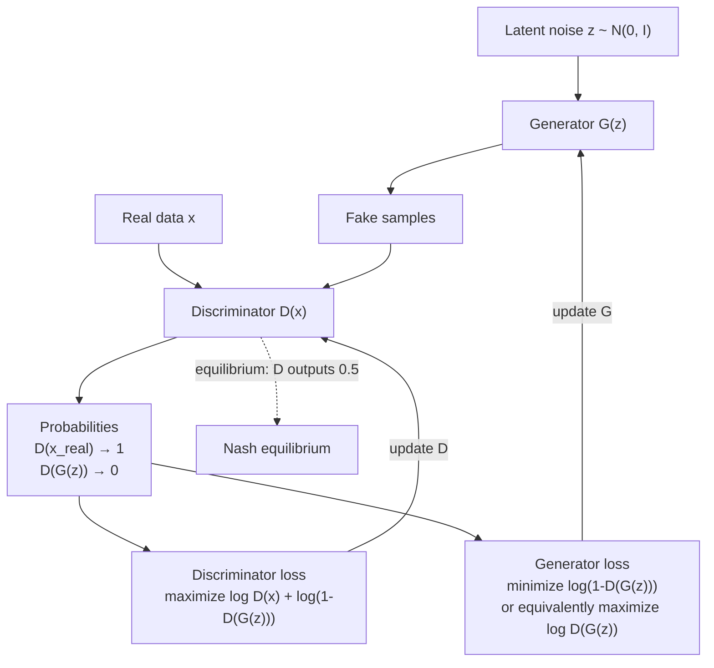

# GANs — Generator vs Discriminator

## Learning Objectives

- Implement a generator and discriminator as competing MLPs and train them through alternating gradient updates on synthetic 2D data.
- Trace the minimax objective function to identify which network maximizes and which minimizes, and explain why equilibrium occurs when the discriminator outputs 0.5.
- Diagnose mode collapse and training instability from loss curves and generated sample distributions.
- Compare adversarial loss to reconstruction loss (as used in VAEs) and articulate why GAN samples are sharper but harder to train.
- Apply the discriminator-as-classifier pattern to CRM data quality pipelines, where a binary classifier evaluates whether enriched or synthetic records are plausible.

## The Problem

Your VAE produces blurry samples. You know why: the MSE reconstruction loss is Bayes-optimal for the *mean* of all plausible outputs, and the average of many plausible digits is a smudge. You want a loss function that rewards *plausibility* — does this look like it came from the data distribution? — not pixel-wise proximity to any particular training example.

The problem is that plausibility has no closed form. You cannot write `plausibility(x)` and differentiate it. You can only learn it by comparison: show a model real examples and fake examples, and let it internalize the difference. But then your generator needs a teacher that can tell it what's plausible, and that teacher needs to be better than the generator — otherwise its feedback is worthless. So you need the teacher to improve alongside the generator, always staying one step ahead until the gap closes.

This is why GANs are hard. The loss signal is not a fixed target — it is a moving target defined by another network that is itself learning. Two optimizers running in lockstep, each one's success measured against the other's current state. When it works, the generator has learned the data distribution without ever computing `log p(x)`. When it fails, you get mode collapse, vanishing gradients, or oscillation where neither network converges.

## The Concept

The GAN objective is a two-player zero-sum game. The generator `G(z)` maps a latent noise vector `z ~ N(0, I)` to a synthetic sample. The discriminator `D(x)` maps a sample — real or generated — to a scalar probability in `[0, 1]` representing its confidence that the sample is real. The generator wants `D(G(z))` to be high (the discriminator is fooled). The discriminator wants `D(x_real)` to be high and `D(G(z))` to be low.

The combined objective:

```
min_G  max_D  E_x[log D(x)] + E_z[log(1 - D(G(z)))]
```

The discriminator maximizes this expression by correctly classifying real and fake. The generator minimizes it by making fakes that the discriminator rates as real. Training alternates: first update `D` on a batch of real and generated samples (with `G` frozen), then update `G` on a batch of generated samples evaluated by the updated `D` (with `D` frozen). Each network improves against the other's current state.



Equilibrium is a Nash equilibrium where the generator's distribution matches the data distribution exactly. At that point, every sample — real or fake — is equally likely to be real, so the optimal discriminator outputs 0.5 for everything. The generator cannot improve further because the discriminator provides no useful gradient. This is the theoretical endpoint. In practice, you rarely reach it cleanly — you stop training when the samples look good or when losses plateau.

Two failure modes dominate GAN training. **Mode collapse** occurs when the generator finds a single output (or a small set) that fools the discriminator and produces it for every latent input. The discriminator cannot penalize this because it only sees individual samples, not the full distribution. **Training instability** occurs when the discriminator becomes too confident too quickly — its gradients flatten, and the generator receives no useful signal to improve. If `D` outputs 0.99 for real and 0.01 for fake, the generator's gradient `∇_G log(1 - D(G(z)))` is near zero. The standard fixes: use the non-saturating generator loss `minimize -log D(G(z))` (gradients stay large even when `D` is confident), use smaller discriminator learning rates, or add regularization like gradient penalties (WGAN-GP).

## Build It

Build a minimal GAN on 2D synthetic data. The target distribution is a bimodal Gaussian — two clusters at `(-2, 0)` and `(2, 0)`. The generator maps 2D noise to 2D space. The discriminator classifies 2D points as real or fake. This trains in under 60 seconds on CPU and produces a visualization you can inspect.

```python
import torch
import torch.nn as nn
import numpy as np
import matplotlib
matplotlib.use('Agg')
import matplotlib.pyplot as plt

torch.manual_seed(42)
np.random.seed(42)

def real_data(n):
    cluster = np.random.choice([0, 1], n)
    x = np.where(cluster == 0, -2.0, 2.0) + np.random.randn(n) * 0.4
    y = np.random.randn(n) * 0.4
    return torch.FloatTensor(np.stack([x, y], axis=1))

class Generator(nn.Module):
    def __init__(self):
        super().__init__()
        self.net = nn.Sequential(
            nn.Linear(2, 16),
            nn.ReLU(),
            nn.Linear(16, 16),
            nn.ReLU(),
            nn.Linear(16, 2)
        )
    def forward(self, z):
        return self.net(z)

class Discriminator(nn.Module):
    def __init__(self):
        super().__init__()
        self.net = nn.Sequential(
            nn.Linear(2, 16),
            nn.LeakyReLU(0.2),
            nn.Linear(16, 16),
            nn.LeakyReLU(0.2),
            nn.Linear(16, 1),
            nn.Sigmoid()
        )
    def forward(self, x):
        return self.net(x)

G = Generator()
D = Discriminator()
opt_G = torch.optim.Adam(G.parameters(), lr=0.005)
opt_D = torch.optim.Adam(D.parameters(), lr=0.005)
bce = nn.BCELoss()

steps = 1000
batch = 128
snapshot_steps = [0, 500, 1000]
snapshots = {}

with torch.no_grad():
    snapshots[0] = G(torch.randn(500, 2)).numpy()

for step in range(steps):
    real = real_data(batch)
    z = torch.randn(batch, 2)
    fake = G(z)

    opt_D.zero_grad()
    d_real = D(real)
    d_fake_detached = D(fake.detach())
    loss_D = bce(d_real, torch.ones(batch, 1)) + bce(d_fake_detached, torch.zeros(batch, 1))
    loss_D.backward()
    opt_D.step()

    opt_G.zero_grad()
    z2 = torch.randn(batch, 2)
    fake2 = G(z2)
    d_fake = D(fake2)
    loss_G = bce(d_fake, torch.ones(batch, 1))
    loss_G.backward()
    opt_G.step()

    if step % 200 == 0:
        with torch.no_grad():
            d_acc = ((d_real > 0.5).float().mean() + (d_fake_detached < 0.5).float().mean()) / 2
            print(f"Step {step:4d} | D_loss={loss_D.item():.4f} | G_loss={loss_G.item():.4f} | D_acc={d_acc.item():.3f}")

    if step + 1 in snapshot_steps:
        with torch.no_grad():
            snapshots[step + 1] = G(torch.randn(500, 2)).numpy()

fig, axes = plt.subplots(1, 3, figsize=(15, 5))
real_sample = real_data(500).numpy()

for idx, s in enumerate([0, 500, 1000]):
    axes[idx].scatter(real_sample[:, 0], real_sample[:, 1], alpha=0.3, s=10, c='blue', label='real')
    gen = snapshots[s]
    axes[idx].scatter(gen[:, 0], gen[:, 1], alpha=0.3, s=10, c='red', label='generated')
    axes[idx].set_title(f'Step {s}')
    axes[idx].legend()
    axes[idx].set_xlim(-5, 5)
    axes[idx].set_ylim(-5, 5)

plt.tight_layout()
plt.savefig('gan_training.png', dpi=100)
print("Saved gan_training.png")
```

The output will show discriminator accuracy starting near 1.0 (it easily separates random noise from the bimodal target) and declining toward 0.5 as the generator learns to produce points in the right region. At step 0, the generated points are scattered across the plane. By step 500, they should concentrate near the two clusters. By step 1000, the overlap should be substantial — though with this small architecture and aggressive learning rate, you may see mode collapse (generator hits one cluster but misses the other).

The key detail in the training loop is `fake.detach()` in the discriminator update. This severs the gradient connection between the discriminator's loss and the generator's parameters. Without it, the discriminator optimizer would update `G`'s weights — which is the generator's job. The generator update then uses fresh noise `z2` and computes gradients through `D` (which is frozen this step because `opt_D.zero_grad()` was called but `opt_D.step()` already ran). This alternation is what makes the two networks train against each other rather than jointly.

## Use It

The discriminator is a binary classifier. Strip away the generator and the adversarial loop, and what remains is a model that takes an input and outputs `P(real | x)` — which is functionally identical to a model that outputs `P(lead is qualified | features)` or `P(industry tag is correct | firmographic data)`. The discriminator architecture in the code above is a 2-layer MLP with LeakyReLU and a sigmoid output. Swap the input dimension from 2 to whatever your feature vector is, and you have a lead-scoring model.

In CRM data hygiene, this classifier pattern shows up directly. When you enrich a CRM record through a tool like Clay, the enrichment output needs validation — did the inferred industry, company size, or tech stack come back plausible? A discriminator-style classifier trained on your historical CRM data can flag enriched records that deviate from the patterns you have observed in hand-verified records. This is the discriminator's job: it has learned what "real" looks like, and it assigns low probability to inputs that deviate. [CITATION NEEDED — concept: discriminator-based CRM enrichment validation]

The adversarial loop itself — two systems in competition — has a weaker but real parallel in GTM experimentation. When you run two outbound sequences against the same list (direct pitch vs. content hook vs. research invite), you are running a competitive evaluation where each sequence's performance is measured relative to the alternatives. The "discriminator" is your conversion analytics: it determines which approach is distinguishable from random noise. The "generator" is your copywriting process: it iterates to produce messaging that the analytics cannot distinguish from a winning sequence. This analogy breaks down quickly — you do not backpropagate through reply rates — but the structural pattern of two systems co-adapting through competition is the same. [CITATION NEEDED — concept: reply rate benchmarks per sequence type]

The most concrete application of GAN-style synthetic data in GTM is generating test fixtures for CRM pipelines. If you need to test a scoring workflow, a routing rule, or an enrichment waterfall, you need records to test against. Rather than using production data (privacy risk) or hand-crafted CSVs (too small to catch edge cases), a generator trained on your real record distributions can produce thousands of synthetic company or contact records that preserve the statistical structure of your actual CRM — without containing any real PII. The discriminator ensures these synthetic records are close enough to real data that your workflows behave the same way on both. This is an emerging application, not a mature one — diffusion models and tabular VAEs are currently more common for this task. [CITATION NEEDED — concept: synthetic CRM test data generation]

## Ship It

To deploy a GAN in production, you face three engineering decisions that the toy 2D example hides.

**Checkpointing two optimizers.** A GAN checkpoint is not one model — it is two models and two optimizer states, all of which must be saved and loaded atomically. If you save `G` from step 500 but `D` from step 501, the generator is being evaluated against a discriminator it has never seen. Use a single `torch.save` call with a dictionary containing both model state dicts and both optimizer state dicts. Tag checkpoints with the step number and log the discriminator accuracy alongside — if `D_acc` is at 0.5, you are at or near equilibrium. If it is at 0.99, the generator has collapsed or stalled.

**Inference vs. training separation.** At inference time, you only need the generator. The discriminator exists to provide gradients during training — once you ship, it is dead weight. Strip it from the deployment artifact. The generator takes a latent vector `z ~ N(0, I)` of fixed dimension and produces a sample. For tabular data (the CRM use case), this is a tensor of company attributes. For images, it is a pixel grid. The interface is the same: sample noise, forward pass, return output.

**Monitoring for mode collapse in production.** If you are generating synthetic CRM records, mode collapse means your generator produces the same handful of company profiles for every input. You detect this by tracking the diversity of generated outputs — compute pairwise distances or a silhouette score across batches of generated samples. If diversity drops below a threshold, alert. In the CRM enrichment-validation use case (where you deployed only the discriminator), monitor the classifier's calibration drift: if the fraction of records flagged as "implausible" shifts by more than a few percentage points week over week, either your input distribution changed or the model is degrading. [CITATION NEEDED — concept: production GAN monitoring practices]

For the CRM-as-retrieval-system framing: your CRM is a vector database (Zone 08). When you query it — "find companies similar to this one" — you are doing retrieval over embeddings. If those embeddings were trained on data with systematic gaps (missing industries, sparse tech stacks), your retrieval is biased. A GAN or any generative model can fill those gaps with synthetic embeddings that preserve distributional structure, but this is a research-grade technique, not something you bolt onto a production CRM without rigorous evaluation. The honest statement: GANs are foundational for understanding adversarial objectives and learned plausibility metrics, which underpin how you evaluate the quality of retrieved CRM records. The direct production use case — synthetic CRM data generation — is viable but nascent.

## Exercises

1. **Induce mode collapse.** Reduce the generator's latent dimension from 2 to 1. The generator now maps a scalar to a 2D point. Run training and observe whether the generator can still cover both clusters. Print the variance of generated x-coordinates at step 1000 — if it is near zero, the generator has collapsed to a single mode.

2. **Break the discriminator.** Set the discriminator learning rate to 0.1 (20x the generator). Train for 500 steps. Print discriminator accuracy every 50 steps. You should see `D_acc` approach 1.0 quickly, followed by the generator loss plateauing — the discriminator is too strong, and the generator's gradients have vanished.

3. **Swap the loss.** Replace the generator's non-saturating loss `bce(d_fake, ones)` with the saturating loss `bce(d_fake, zeros)` (which is equivalent to minimizing `log(1 - D(G(z)))`). Compare training dynamics — the saturating loss should produce slower early convergence because gradients are small when the discriminator is confident.

4. **Add a gradient penalty.** Implement the WGAN-GP penalty: sample points on the line between real and fake data, compute the gradient of the discriminator's output with respect to those points, and penalize the squared deviation of the gradient norm from 1.0. This is 15–20 lines of code. Run it and observe whether training stability improves.

5. **CRM discriminator.** Replace the 2D toy data with a CSV of company features (employee count, revenue, industry code, founding year). Build a discriminator that classifies real CRM records vs. randomly sampled noise. Train it and evaluate on a held-out set. This discriminator is now a plausibility model — you can use it to flag enriched records that deviate from your CRM's learned distribution.

## Key Terms

- **Latent vector `z`:** A noise vector sampled from a distribution (typically `N(0, I)`) that the generator maps to a synthetic sample. The dimension of `z` controls how much variation the generator can express.
- **Discriminator `D(x)`:** A binary classifier that outputs `P(real | x)`. Trained on real samples (label 1) and generated samples (label 0). Functionally identical to any binary classifier — the adversarial framing is about how its labels are produced, not its architecture.
- **Minimax objective:** The combined loss function where the generator minimizes and the discriminator maximizes the same expression. Equilibrium is a Nash equilibrium where neither player can improve unilaterally.
- **Non-saturating loss:** The generator loss `-log D(G(z))`, which maintains large gradients even when the discriminator is confident. The original saturating formulation `log(1 - D(G(z)))` suffers from vanishing gradients early in training.
- **Mode collapse:** A failure mode where the generator produces a narrow set of outputs regardless of input. The discriminator cannot detect this because it evaluates samples individually, not collectively.
- **Nash equilibrium:** The theoretical endpoint of GAN training where the generator's output distribution matches the data distribution exactly and the discriminator outputs 0.5 for every input. Rarely achieved in practice.
- **Gradient penalty (WGAN-GP):** A regularization term that penalizes deviation of the discriminator's gradient norm from 1.0, enforcing the Lipschitz constraint required for Wasserstein GAN training.

## Sources

- Goodfellow, I. et al. (2014). "Generative Adversarial Nets." *NeurIPS*. The original minimax formulation: `min_G max_D E[log D(x)] + E[log(1 - D(G(z)))]`.
- Radford, A. et al. (2015). "Deep Convolutional Generative Adversarial Networks." DCGAN architecture, establishing stable training practices (LeakyReLU discriminators, batch norm, Adam).
- Gulrajani, I. et al. (2017). "Improved Training of Wasserstein GANs." Gradient penalty formulation for Lipschitz enforcement.
- [CITATION NEEDED — concept: discriminator-based CRM enrichment validation] — no published source found for using GAN discriminators specifically as CRM data quality validators. The classifier pattern is general; the CRM application is inferred.
- [CITATION NEEDED — concept: reply rate benchmarks per sequence type] — handbook context references direct pitch vs. content hook vs. research invite reply rates but no primary source was provided.
- [CITATION NEEDED — concept: synthetic CRM test data generation] — emerging practice; no widely cited reference for GAN-generated synthetic CRM records in production GTM workflows.
- [CITATION NEEDED — concept: production GAN monitoring practices] — mode collapse detection via diversity metrics is discussed in the GAN evaluation literature (Lucic et al. 2018, "Are GANs Created Equal?") but not specifically for CRM/tabular data.