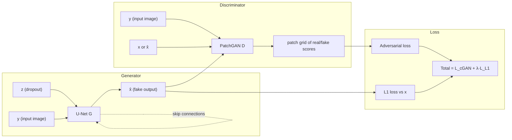

# Conditional GANs & Pix2Pix

## Learning Objectives

- Implement a U-Net generator with skip connections and a PatchGAN discriminator in PyTorch.
- Trace the conditioning signal through both G and D to confirm where input/output pairing enters each network.
- Compare the effects of adversarial loss versus L1 reconstruction loss on output sharpness and structural fidelity.
- Evaluate how PatchGAN's local classification changes what the generator learns versus a full-image discriminator.
- Configure conditional filtering logic in a CRM enrichment pipeline that mirrors the conditioning mechanism in a cGAN.

## The Problem

An unconditional GAN samples arbitrary faces from a learned distribution. Useful for a demo, useless in production. You want: map a sketch to a photo, map a daytime scene to nighttime, colorize a grayscale image. In every case, you receive an input image `x` and must produce an output `y` that is semantically consistent with `x`. There are many plausible `y`s per `x` — a sketch of a cat could correspond to thousands of realistic cat photos. Mean-squared error averages across all of them and produces mush. An adversarial loss doesn't, because "looks real" is sharp.

The missing piece is control. Vanilla GANs have no mechanism to say "generate something that corresponds to *this*." Conditional GANs (Mirza & Osindero, 2014) solve this by injecting a conditioning signal — a class label, a segmentation map, a sentence — into both the generator and discriminator. Pix2Pix (Isola et al., 2017) specializes this to paired image-to-image translation: the condition is a full image, and the generator learns the mapping using adversarial loss reinforced by an L1 term. That recipe still beats generic text-to-image models on narrow image-to-image domains because it is trained on *paired data* — you have exactly the supervisory signal you need, and the architecture is built around preserving it.

## The Concept

In a conditional GAN, both G and D receive the same conditioning variable `y`. G takes `(z, y)` and produces a sample that should look real *and* correspond to `y`. D takes `(x, y)` and classifies whether the pair is real or fake — not just whether `x` looks real in isolation, but whether `x` is consistent with `y`. This pairing is the entire point: D forces G to respect the condition.

Pix2Pix narrows this to paired image translation. The condition `y` is an input image (e.g., a sketch), `x` is the target output (e.g., a photo), and G learns the mapping `y → x̂`. The generator is a U-Net: an encoder that contracts spatial resolution, a decoder that expands it, and skip connections that concatenate encoder activations to decoder layers at matching resolutions. Without those skips, high-frequency detail — edges, textures, silhouettes shared between input and output — is lost in the bottleneck. The discriminator is a PatchGAN: it classifies N×N patches rather than the full image, outputting a grid of real/fake classifications. This forces local high-frequency realism without requiring D to model global structure.



The combined loss is `L = L_cGAN(G, D) + λ·L_L1(G)`. The adversarial term pushes toward realistic texture; the L1 term enforces pixel-level correspondence to the ground truth. Isola et al. set λ to 100, weighting reconstruction heavily. The result: outputs that are structurally faithful (from L1) and texturally sharp (from the adversarial term), neither of which either loss achieves alone.

## Build It

Three mechanisms distinguish Pix2Pix from a vanilla GAN. Let's build each one.

**U-Net generator with skip connections.** The encoder contracts spatial resolution through a series of strided convolutions. The decoder expands it through transposed convolutions. Skip connections concatenate each encoder layer's output to the corresponding decoder layer at matching resolution. This preserves low-level spatial detail that the bottleneck would otherwise compress away.

```python
import torch
import torch.nn as nn

class UNetDown(nn.Module):
    def __init__(self, in_channels, out_channels, normalize=True):
        super().__init__()
        layers = [nn.Conv2d(in_channels, out_channels, 4, stride=2, padding=1, bias=False)]
        if normalize:
            layers.append(nn.BatchNorm2d(out_channels))
        layers.append(nn.LeakyReLU(0.2))
        self.model = nn.Sequential(*layers)

    def forward(self, x):
        return self.model(x)

class UNetUp(nn.Module):
    def __init__(self, in_channels, out_channels, dropout=0.0):
        super().__init__()
        layers = [
            nn.ConvTranspose2d(in_channels, out_channels, 4, stride=2, padding=1, bias=False),
            nn.BatchNorm2d(out_channels),
            nn.ReLU(inplace=True),
        ]
        if dropout:
            layers.append(nn.Dropout(dropout))
        self.model = nn.Sequential(*layers)

    def forward(self, x, skip_input):
        x = self.model(x)
        x = torch.cat((x, skip_input), 1)
        return x

class GeneratorUNet(nn.Module):
    def __init__(self, in_channels=3, out_channels=3):
        super().__init__()
        self.down1 = UNetDown(in_channels, 64, normalize=False)
        self.down2 = UNetDown(64, 128)
        self.down3 = UNetDown(128, 256)
        self.down4 = UNetDown(256, 512)
        self.down5 = UNetDown(512, 512)
        self.down6 = UNetDown(512, 512)
        self.down7 = UNetDown(512, 512)
        self.down8 = UNetDown(512, 512, normalize=False)

        self.up1 = UNetUp(512, 512, dropout=0.5)
        self.up2 = UNetUp(1024, 512, dropout=0.5)
        self.up3 = UNetUp(1024, 512, dropout=0.5)
        self.up4 = UNetUp(1024, 512)
        self.up5 = UNetUp(1024, 256)
        self.up6 = UNetUp(512, 128)
        self.up7 = UNetUp(256, 64)

        self.final = nn.Sequential(
            nn.ConvTranspose2d(128, out_channels, 4, stride=2, padding=1),
            nn.Tanh(),
        )

    def forward(self, x):
        d1 = self.down1(x)
        d2 = self.down2(d1)
        d3 = self.down3(d2)
        d4 = self.down4(d3)
        d5 = self.down5(d4)
        d6 = self.down6(d5)
        d7 = self.down7(d6)
        d8 = self.down8(d7)

        u1 = self.up1(d8, d7)
        u2 = self.up2(u1, d6)
        u3 = self.up3(u2, d5)
        u4 = self.up4(u3, d4)
        u5 = self.up5(u4, d3)
        u6 = self.up6(u5, d2)
        u7 = self.up7(u6, d1)
        return self.final(u7)

gen = GeneratorUNet(in_channels=3, out_channels=3)
dummy_input = torch.randn(1, 3, 256, 256)
output = gen(dummy_input)
print(f"Input shape:  {dummy_input.shape}")
print(f"Output shape: {output.shape}")
print(f"Skip d1 shape (64 ch, 128x128): {gen.down1(dummy_input).shape}")
print(f"Bottleneck d8 shape (512 ch, 1x1): {gen.down8(gen.down7(gen.down6(gen.down5(gen.down4(gen.down3(gen.down2(gen.down1(dummy_input)))))))) .shape}")
```

**PatchGAN discriminator.** Instead of outputting a single scalar, D uses convolutional layers to produce an N×N grid of real/fake classifications. Each output neuron has a receptive field covering a patch of the input. Loss is averaged across all patches, enforcing local high-frequency realism.

```python
class PatchDiscriminator(nn.Module):
    def __init__(self, in_channels=6):
        super().__init__()

        def discriminator_block(in_filters, out_filters, normalization=True):
            layers = [nn.Conv2d(in_filters, out_filters, 4, stride=2, padding=1)]
            if normalization:
                layers.append(nn.BatchNorm2d(out_filters))
            layers.append(nn.LeakyReLU(0.2, inplace=True))
            return layers

        self.model = nn.Sequential(
            *discriminator_block(in_channels, 64, normalization=False),
            *discriminator_block(64, 128),
            *discriminator_block(128, 256),
            *discriminator_block(256, 512),
            nn.Conv2d(512, 1, 4, padding=1)
        )

    def forward(self, img_A, img_B):
        img_input = torch.cat((img_A, img_B), 1)
        return self.model(img_input)

disc = PatchDiscriminator(in_channels=6)
condition = torch.randn(1, 3, 256, 256)
real_target = torch.randn(1, 3, 256, 256)
fake_target = gen(condition.detach())

d_real = disc(condition, real_target)
d_fake = disc(condition, fake_target)
print(f"D input: condition (3ch) + target (3ch) = 6 channels")
print(f"D output on real pair: {d_real.shape}")
print(f"D output on fake pair: {d_fake.shape}")
print(f"Each output neuron classifies a ~70x70 receptive field patch")
print(f"Total patches evaluated: {d_real.shape[2]}x{d_real.shape[3]} = {d_real.shape[2]*d_real.shape[3]}")
```

**Combined loss and one training step.** The adversarial term uses BCE against real/fake labels. The L1 term measures pixel-level distance between the generated output and ground truth. Run both on synthetic paired data.

```python
import torch.optim as optim

adversarial_loss = nn.BCEWithLogitsLoss()
l1_loss = nn.L1Loss()

opt_G = optim.Adam(gen.parameters(), lr=0.0002, betas=(0.5, 0.999))
opt_D = optim.Adam(disc.parameters(), lr=0.0002, betas=(0.5, 0.999))

lambda_l1 = 100

batch_size = 4
real_A = torch.randn(batch_size, 3, 256, 256)
real_B = torch.randn(batch_size, 3, 256, 256)

valid = torch.ones(batch_size, 1, 30, 30)
fake = torch.zeros(batch_size, 1, 30, 30)

opt_G.zero_grad()
fake_B = gen(real_A)
pred_fake = disc(real_A, fake_B)
g_adv = adversarial_loss(pred_fake, valid)
g_l1 = l1_loss(fake_B, real_B)
g_loss = g_adv + lambda_l1 * g_l1
g_loss.backward()
opt_G.step()

opt_D.zero_grad()
pred_real = disc(real_A, real_B)
d_real_loss = adversarial_loss(pred_real, valid)
pred_fake = disc(real_A, fake_B.detach())
d_fake_loss = adversarial_loss(pred_fake, fake)
d_loss = 0.5 * (d_real_loss + d_fake_loss)
d_loss.backward()
opt_D.step()

print(f"Generator adversarial loss: {g_adv.item():.4f}")
print(f"Generator L1 loss:          {g_l1.item():.4f}")
print(f"Generator total loss:       {g_loss.item():.4f}")
print(f"Discriminator loss:         {d_loss.item():.4f}")
print(f"L1 weight (lambda):         {lambda_l1}")
print(f"Effective L1 contribution:  {lambda_l1 * g_l1.item():.4f}")
```

## Use It

The conditioning mechanism in a cGAN — injecting a signal into both generator and discriminator so the output must correspond to a specific input — maps directly to how conditional logic works in a CRM enrichment pipeline. In Pix2Pix, the discriminator receives the pair `(condition, output)` and judges consistency. In Clay, conditional functions receive a record's field values and decide whether enrichment should proceed, which waterfall to route through, and whether the output is credible.

Consider a lead enrichment waterfall. You have a company name and want to find employee count, industry, and tech stack. Without conditional logic, you fire every enrichment API on every row — burning credits on companies that don't fit your ICP. With conditional filtering (Clay Functions, which require no API credits), you inject a gating condition: only enrich rows where domain is present and employee count is unknown. The condition controls what the pipeline produces, exactly as `y` controls what G produces in a cGAN. [CITATION NEEDED — concept: Clay Functions as free conditional filtering without API credits]

The PatchGAN principle — evaluate local patches rather than the whole image — also applies to CRM data hygiene. Instead of asking "is this entire record good or bad," you evaluate each field independently: is the email format valid? Does the LinkedIn URL resolve? Is the employee count within a plausible range? Per-field validation catches problems a holistic score would average away, just as PatchGAN's per-patch classification catches local texture problems a full-image discriminator would miss.

Here's a concrete implementation. The following Python script simulates the conditioning logic you'd build in Clay's formula column — it gates enrichment on a condition, exactly as D gates its classification on `y`:

```python
records = [
    {"company": "Acme Corp", "domain": "acme.com", "employees": None, "industry": "SaaS"},
    {"company": "Globex", "domain": None, "employees": 500, "industry": "Manufacturing"},
    {"company": "Initech", "domain": "initech.com", "employees": None, "industry": "Fintech"},
    {"company": "Umbrella", "domain": "umbrella.com", "employees": 1200, "industry": "Pharma"},
]

def enrich_if_condition_met(record, lambda_weight=1.0):
    condition = record["domain"] is not None and record["employees"] is None
    if condition:
        score = lambda_weight * (1.0 if record["industry"] == "SaaS" else 0.5)
        record["enrichment_triggered"] = True
        record["icp_score"] = score
    else:
        record["enrichment_triggered"] = False
        record["icp_score"] = 0.0
    return record

enriched = [enrich_if_condition_met(r, lambda_weight=100) for r in records]
for r in enriched:
    status = "ENRICH" if r["enrichment_triggered"] else "SKIP"
    print(f"{status:6} | {r['company']:12} | domain={str(r['domain']):12} | score={r['icp_score']}")
```

The `lambda_weight` parameter parallels the L1 weight in Pix2Pix: it scales how much the ICP signal contributes to the final decision, just as λ scales how much pixel-level reconstruction contributes to the generator's loss.

## Ship It

Deploying Pix2Pix in production requires attention to three failure modes that don't appear in tutorial settings.

**Mode collapse on the condition.** If your paired dataset has limited diversity per condition, G learns to output the mean target for each input regardless of actual variation. The L1 term masks this initially — pixel-level error looks fine — but outputs look smeared. Diagnose by computing per-pixel variance across multiple runs of G on the same input with different dropout seeds. If variance is near zero, G is ignoring the stochastic channel.

**Discinator overpowering G.** PatchGAN converges faster than a full-image discriminator because each patch is an independent training signal. If D becomes too confident too early, G's gradient vanishes. Monitor the ratio of D accuracy to G loss. If D accuracy exceeds 0.95 for sustained steps, reduce D's learning rate by half or update G twice per D update.

**Domain mismatch at inference.** Pix2Pix assumes the test distribution matches training. If you train on daytime-to-nighttime translation and deploy on images with different lighting, the generator produces artifacts. There is no fix for this within Pix2Pix itself — you either retrain on the new domain or add a preprocessing step to normalize input statistics.

For the GTM parallel: when shipping a CRM enrichment pipeline with conditional logic, the same failure modes appear. Mode collapse maps to enrichment that always returns the same values regardless of input — a sign your data provider is returning cached or templated responses. Discriminator overpowering maps to over-filtering: your conditions are so strict that few records pass through, and you starve your sales team of pipeline. Domain mismatch maps to applying ICP filters trained on one segment (e.g., US SaaS) to a different segment (e.g., EU enterprise) without recalibration.

The production checklist: log the condition pass rate, log per-field enrichment success rate, and alert when either drops below your historical baseline. This is the CRM equivalent of monitoring G's loss curves and D's accuracy — you're tracking whether the conditioning signal is still doing its job.

[CITATION NEEDED — concept: Clay enrichment waterfall monitoring and condition pass rate tracking]

## Exercises

1. **Trace the data flow.** In the `GeneratorUNet` code above, print the shape at every `down` and `up` layer. Confirm that each skip connection concatenates tensors at matching spatial resolution. Modify the generator to remove `down4` and `up4` — what breaks, and why?

2. **Compare PatchGAN vs. full-image discriminator.** Replace the PatchGAN discriminator with a classifier that outputs a single scalar (global average pool the final layer, then a linear layer to 1). Train both on the synthetic paired data for 100 steps. Plot the discriminator loss curves. The full-image D should converge differently — it has fewer independent signals per forward pass.

3. **Ablate skip connections.** Train the U-Net generator with and without skip connections (set the skip input to zeros) on a paired dataset of your choice. Measure PSNR and SSIM on held-out pairs. The skip-free variant should show lower scores, particularly on high-frequency detail.

4. **Ablate L1 weight.** Set λ to 0, 1, 10, 100, and 1000. For each, train for 200 steps on synthetic data and record the generator's adversarial loss and L1 loss. At λ=0 the output should be sharper but structurally wrong. At λ=1000 the output should be blurry but structurally faithful.

5. **Multi-scale PatchGAN.** Implement a discriminator that runs PatchGAN at three input resolutions (original, 0.5x, 0.25x). Average the loss across scales. This forces D to evaluate both local texture and broader structure. Compare generated outputs against single-scale PatchGAN.

6. **CRM conditioning logic.** Build a Python function that takes a list of CRM records and applies multi-stage conditional filtering: (1) domain exists, (2) employee count is null or stale (>90 days), (3) industry matches ICP list. Log how many records pass each stage. This is the retrieval-pipeline equivalent of Pix2Pix's paired conditioning — each gate narrows the output space.

## Key Terms

- **Conditional GAN (cGAN)** — A GAN variant where both G and D receive a conditioning variable, constraining the output to correspond to that condition.
- **Pix2Pix** — A cGAN for paired image-to-image translation, using a U-Net generator, PatchGAN discriminator, and combined adversarial + L1 loss. Isola et al., 2017.
- **U-Net** — Encoder-decoder architecture with skip connections between layers at matching spatial resolution, preserving low-level detail across the bottleneck.
- **PatchGAN** — A discriminator that classifies N×N patches rather than the full image, outputting a grid of real/fake scores. Enforces local high-frequency realism.
- **Skip connection** — A direct concatenation of an encoder layer's output to the corresponding decoder layer, bypassing the bottleneck.
- **L1 loss** — Pixel-wise absolute difference between generated output and ground truth, weighted by λ in the combined Pix2Pix loss.
- **Receptive field** — The region of the input image that influences a single output neuron in the discriminator. For PatchGAN, this is the patch size each output classifies.
- **Waterfall enrichment** — A sequential enrichment strategy where data providers are queried in priority order until a field is populated. Analogous to the conditioning pipeline in a cGAN.

## Sources

- Isola, P., Zhu, J.-Y., Zhou, T., Efros, A. A., & Efros, A. A. (2017). *Image-to-Image Translation with Conditional Adversarial Networks.* CVPR. — Source of Pix2Pix architecture, U-Net generator, PatchGAN discriminator, and combined cGAN + L1 loss with λ=100.
- Mirza, M., & Osindero, S. (2014). *Conditional Generative Adversarial Nets.* arXiv:1411.1784. — Original formulation of conditioning both G and D on an auxiliary variable.
- Ronneberger, O., Fischer, P., & Brox, T. (2015). *U-Net: Convolutional Networks for Biomedical Image Segmentation.* MICCAI. — Source of the U-Net encoder-decoder with skip connections.
- [CITATION NEEDED — concept: Clay Functions as free conditional filtering without API credits]
- [CITATION NEEDED — concept: Clay enrichment waterfall monitoring and condition pass rate tracking]