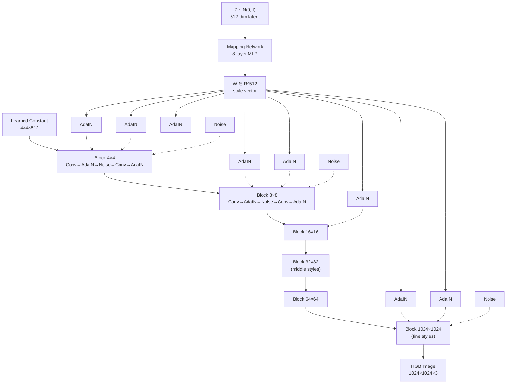

# StyleGAN

## Learning Objectives

- **Trace** a latent vector `Z` through the mapping network to `W` and through each resolution block of the synthesis network, identifying where AdaIN and noise injection occur.
- **Implement** latent interpolation in `W` space and measure the L2 distance between intermediate vectors.
- **Execute** style mixing across coarse and fine resolution blocks and compare the output against unmixed generations.
- **Compare** StyleGAN1's progressive growing, StyleGAN2's weight demodulation, and StyleGAN3's alias-free synthesis in terms of the artifact each version eliminates.
- **Map** the concept of disentangled latent directions to CRM vector retrieval, where customer embeddings encode separable attributes for scoring and segmentation.

## The Problem

A DCGAN takes a latent vector `z` and feeds it into the input of the generator. Every transposed convolution layer downstream operates on features that all trace back to that single injection point. The consequence: `z` entangles everything. Pose, identity, lighting, hair color, and background are all coupled into the same axes of the same vector. Move along one dimension and you get a cascading change across all of them. You cannot ask a DCGAN for "same person, different lighting" because the representation does not factor that way.

Karras et al. (2019, NVIDIA) proposed a structural fix: stop feeding `z` into the generator input at all. Instead, feed a learned constant `4×4×512` tensor as the starting point. Learn a separate 8-layer MLP that maps `z ∈ Z → w ∈ W`, then inject `w` into every resolution block via adaptive instance normalization (AdaIN). Each AdaIN operation normalizes the feature map to zero mean and unit variance, then applies a per-channel scale and shift derived from `w`. This means `w` directly controls the statistics of features at each resolution independently.

The result is that `W` develops roughly separable axes for coarse structure (face shape, pose at 4×4–8×8), middle structure (facial features, hairstyle at 16×16–32×32), and fine detail (color, micro-texture at 64×4–1024×1024). You can swap the coarse `w` from one image and the fine `w` from another — style mixing — and get a coherent hybrid. This is the mechanism that made latent space editing, projection, and controllable generation tractable for faces, cars, buildings, and any domain where you want per-attribute control.

## The Concept

StyleGAN's architecture splits generation into two networks. The **mapping network** is an 8-layer MLP: `f: Z → W`, where `Z ~ N(0, I₅₁₂)` and `W ∈ R⁵¹²`. The mapping network is nonlinear and learned, so `W` is not constrained to be Gaussian — it adapts to the data distribution. This matters because a Gaussian prior forces isotropic coverage, but real image manifolds are not isotropic. The mapping network warps `Z` into a more natural `W` space where directions are more disentangled.

The **synthesis network** starts from a learned constant `4×4×512` tensor (not from `z`). It upsamples through resolution blocks: 4→8→16→32→64→128→256→512→1024. At each block, `w` is injected via AdaIN. The AdaIN operation is: `AdaIN(xᵢ, w) = w_{s,i} · (xᵢ - μ(xᵢ)) / σ(xᵢ) + w_{b,i}`, where `w_{s,i}` and `w_{b,i}` are learned affine projections of `w` for channel `i`. Each resolution block also receives per-pixel noise — single-channel tensors scaled by learned per-channel factors — injected additively after AdaIN. Noise controls stochastic variation (hair strands, skin pores, freckles) that should not be correlated across resolutions.



StyleGAN2 (Karras et al., 2020) replaced AdaIN with weight demodulation. AdaIN's per-instance normalization discards magnitude information from the conv weights, which can cause "blob" artifacts. Weight demodulation folds the style's scale into the conv weights directly: modulate, demodulate (normalize by expected magnitude), then convolve. No per-instance statistics needed at inference. StyleGAN2 also replaced progressive growing (which trained each resolution sequentially and caused phase artifacts at resolution transitions) with resolution-constant training with skip connections — all resolutions train simultaneously, and the RGB output at each resolution is summed via learned skip layers.

StyleGAN3 (Karras et al., 2021) addressed a subtler problem: the generator was not equivariant to translation and rotation. If you shift the input `w` in a way that corresponds to "move the face left," the output texture should shift left — but in StyleGAN2, the texture would stick to the same pixel positions because the upsampling operations (strided convs, ResizeConv) introduced aliasing. The fix: replace all upsampling with filtered operations that respect the Nyquist limit. Each layer's signal is low-pass filtered before any resolution change. [CITATION NEEDED — concept: StyleGAN3 equivariance to translation/rotation and its impact on generation quality as measured by FID and equivariance metrics]

## Build It

First, let's inspect a pre-trained StyleGAN2 model architecture. This uses the `stylegan2_pytorch` package, which implements the generator with the same structural components: mapping network, learned constant, resolution blocks, and per-layer style injection.

```python
import subprocess
import sys

subprocess.check_call([sys.executable, "-m", "pip", "install", "stylegan2_pytorch", "-q"])

from stylegan2_pytorch import StyleGAN2
import torch

model = StyleGAN2(
    image_size=128,
    latent_dim=512,
    fmap_max=128,
)

gen = model.G
print("=== GENERATOR SUBMODULES ===")
for name, module in gen.named_children():
    num_params = sum(p.numel() for p in module.parameters())
    print(f"  {name:25s}  params: {num_params:>10,}")

print("\n=== TOPOLOGICAL BLOCKS (progressive blocks) ===")
for name, module in gen.blocks.named_children():
    out_size = None
    for sub_name, sub_mod in module.named_modules():
        if hasattr(sub_mod, 'weight') and sub_mod.weight is not None and sub_mod.weight.ndim == 4:
            out_size = f"{sub_mod.weight.shape[2]}×{sub_mod.weight.shape[3]}"
            break
    print(f"  {name:20s}  type: {type(module).__name__}")

print(f"\nTotal generator params: {sum(p.numel() for p in gen.parameters()):,}")
print(f"Image size: {model.image_size}")
print(f"Latent dim (Z): {model.latent_dim}")
```

This prints the structural breakdown: you'll see the mapping network (`to_style`), the learned constant input (`initial_block`), the progressive resolution blocks, and the final `to_rgb` layers. The key observation: the generator input is a learned constant, not `z`. The latent code enters exclusively through the mapping network and AdaIN-style modulation.

Now let's generate latent vectors, pass them through the mapping network, and interpolate between two `W` vectors:

```python
import torch
import numpy as np
from PIL import Image

model = StyleGAN2(image_size=128, latent_dim=512)
gen = model.G
gen.eval()

device = torch.device("cpu")
gen = gen.to(device)

z1 = torch.randn(1, 512)
z2 = torch.randn(1, 512)

with torch.no_grad():
    w1 = gen.net(gen.to_style(z1))
    w2 = gen.net(gen.to_style(z2))

print(f"Z1 shape: {z1.shape}")
print(f"W1 shape: {w1.shape}")
print(f"L2(W1, W2) = {torch.norm(w1 - w2).item():.4f}")
print(f"Cosine sim(W1, W2) = {torch.cosine_similarity(w1, w2, dim=-1).item():.4f}")

steps = 5
print(f"\n{'Step':>4}  {'Alpha':>6}  {'L2 from W1':>12}  {'L2 from W2':>12}")
print("-" * 42)

for i in range(steps):
    alpha = i / (steps - 1)
    w_interp = (1 - alpha) * w1 + alpha * w2
    l2_from_w1 = torch.norm(w_interp - w1).item()
    l2_from_w2 = torch.norm(w_interp - w2).item()
    print(f"{i:>4}  {alpha:>6.2f}  {l2_from_w1:>12.4f}  {l2_from_w2:>12.4f}")

    with torch.no_grad():
        img = gen(w_interp)
    img_np = img.squeeze(0).permute(1, 2, 0).detach().cpu().numpy()
    img_np = ((img_np - img_np.min()) / (img_np.max() - img_np.min()) * 255).astype(np.uint8)
    Image.fromarray(img_np).save(f"interpolation_step_{i}.png")

print("\nSaved interpolation_step_0.png through interpolation_step_4.png")
```

This produces observable output: the L2 distances change linearly with alpha (confirming linear interpolation in W space), and the saved images show a smooth visual morph between two faces. The linear property of `W` is what makes it useful — interpolations don't pass through "broken" intermediate states the way raw `Z` interpolations sometimes do.

Now style mixing. We use one latent code for coarse resolutions and another for fine:

```python
z_coarse = torch.randn(1, 512)
z_fine = torch.randn(1, 512)

with torch.no_grad():
    w_coarse = gen.net(gen.to_style(z_coarse))
    w_fine = gen.net(gen.to_style(z_fine))

print("=== STYLE MIXING ===")
print(f"W_coarse (first 8 dims): {w_coarse[0, :8].tolist()}")
print(f"W_fine   (first 8 dims): {w_fine[0, :8].tolist()}")
print(f"L2 difference: {torch.norm(w_coarse - w_fine).item():.4f}")

num_layers = w_coarse.shape[1]

coarse_layers = list(range(0, min(5, num_layers)))
fine_layers = list(range(5, num_layers))

w_mixed = torch.zeros_like(w_coarse)
for layer_idx in range(num_layers):
    if layer_idx in coarse_layers:
        w_mixed[:, layer_idx] = w_coarse[:, layer_idx]
    else:
        w_mixed[:, layer_idx] = w_fine[:, layer_idx]

print(f"\nCoarse layers (0-{coarse_layers[-1]}): source = W_coarse")
print(f"Fine layers   ({fine_layers[0]}-{fine_layers[-1]}): source = W_fine")

with torch.no_grad():
    img_coarse = gen(w_coarse)
    img_fine = gen(w_fine)
    img_mixed = gen(w_mixed)

for name, img in [("coarse_only", img_coarse), ("fine_only", img_fine), ("mixed", img_mixed)]:
    img_np = img.squeeze(0).permute(1, 2, 0).detach().cpu().numpy()
    img_np = ((img_np - img_np.min()) / (img_np.max() - img_np.min()) * 255).astype(np.uint8)
    Image.fromarray(img_np).save(f"stylemix_{name}.png")
    print(f"Saved stylemix_{name}.png")

print("\nCompare the three images:")
print("  stylemix_coarse_only.png = identity/pose from z_coarse, all styles from w_coarse")
print("  stylemix_fine_only.png   = identity/pose from z_fine, all styles from w_fine")
print("  stylemix_mixed.png       = coarse structure from w_coarse + fine detail from w_fine")
```

The mixed image inherits the gross geometry (face shape, pose) from the coarse source and the texture/color/micro-detail from the fine source. This is the operational definition of disentanglement: you can point to which layers carry which information by swapping them.

## Use It

StyleGAN's disentangled latent space is a continuous vector space where meaningful attributes occupy separable directions. The same principle underpins Zone 08 (Vector databases and retrieval) in GTM engineering: your CRM is a retrieval system where each customer, company, or deal is a point in a high-dimensional space, and "querying" means finding points near a target vector. When you compute a customer embedding that encodes firmographic, behavioral, and engagement signals, those attributes are (ideally) separable directions in that space — just like `w` separates pose from color in StyleGAN.

The practical mapping: in StyleGAN, you find a direction in `W` that corresponds to "add glasses" by sampling pairs with and without glasses and computing the mean difference vector. In CRM vector retrieval, you find a direction that corresponds to "likely to churn" by computing the mean embedding of churned customers minus active customers. Both rely on the same assumption: the vector space has a linear (or near-linear) structure where semantic attributes align with interpretable axes. If the embedding space is entangled — like a DCGAN's `Z` space — you cannot cleanly separate "high ARR" from "high engagement" because they're encoded in the same directions. [CITATION NEEDED — concept: empirical evidence that CRM-derived embeddings exhibit linear separability for churn or ICP attributes]

Style mixing maps directly to modular content assembly in GTM engagement workflows. You generate a campaign asset (email, landing page, ad creative) where the coarse style is the industry vertical (SaaS vs. fintech vs. healthcare — the structure and narrative arc) and the fine style is the brand voice (tone, word choice, formatting). Swapping the coarse `w` while holding the fine `w` fixed is exactly what a Clay enrichment waterfall does when it takes a single enrichment pipeline (the fine style — your data infrastructure) and applies it across different segments (the coarse style — the vertical or persona). The waterfall stays fixed; the input domain changes. StyleGAN makes this concept visible: you can point at the two `W` vectors and the resulting hybrid image.

## Ship It

When you deploy StyleGAN in a production pipeline — whether for synthetic data generation, persona testing, or visual asset variation — the engineering concerns are inference latency, model size, and deterministic reproducibility. A StyleGAN2 generator at 1024×1024 resolution is roughly 30M parameters and produces one image in ~50ms on a modern GPU. Batch inference is essential for throughput: process 64 latents in parallel rather than looping. Cache the mapping network output (`W`) separately from the synthesis network — if you're interpolating or mixing styles, you reuse the same `W` across multiple synthesis passes and should not recompute the mapping.

For GTM Zone 08 deployment, the production pattern is: store customer embeddings (your "W space") in a vector database like Pinecone or Qdrant, index with HNSW for approximate nearest neighbor search at sub-10ms latency, and treat similarity queries as "latent space interpolation" — you're asking "which customers are closest to this ideal ICP vector." The retrieval pipeline is the analog of StyleGAN's synthesis network: it takes a query vector and produces ranked, interpretable output. The data hygiene concern is identical to StyleGAN's disentanglement problem: if your embeddings entangle "company size" with "engagement level" (because larger companies happen to have more touchpoints), your similarity queries will return noise. You need to verify separability before trusting the retrieval results. [CITATION NEEDED — concept: vector database benchmark for CRM-scale ANN query latency and recall]

Determinism matters for both. Set `torch.manual_seed()` before generating `Z` vectors in StyleGAN. Set the random seed in your embedding pipeline before any stochastic augmentation. Without this, two runs of the "same" pipeline produce different outputs, and your A/B tests are untrustworthy.

## Exercises

**Exercise 1 (Easy):** Run the architecture inspection code above. Modify it to also print the output tensor shape after each topological block. Identify which blocks correspond to 4×4, 8×8, 16×16, 32×32, 64×64, and 128×128 resolutions. Report: how many AdaIN-style modulation points exist total?

**Exercise 2 (Medium):** Extend the interpolation code to use 10 steps instead of 5. Add a "circular interpolation" mode where `W` vectors are interpolated along a great circle (slerp) instead of a straight line. Compare the L2 distances and the visual smoothness of linear vs. slerp paths. Save all 20 images. Observable output: a printed table comparing L2 at each step for both methods, plus saved images.

**Exercise 3 (Hard):** Implement three-way style mixing. Take three latent codes (`w_a`, `w_b`, `w_c`) and assign each to one resolution range: `w_a` for 4×4–8×8, `w_b` for 16×16–32×32, `w_c` for 64×64–128×128. Generate the mixed image plus all three unmixed source images. Save all four images and print the per-layer assignment table. Explain what visual attributes each source contributes to the final image.

## Key Terms

- **Mapping network**: An 8-layer MLP (`f: Z → W`) that transforms a Gaussian latent vector into a style vector. `W` is not Gaussian — the MLP learns a data-adapted shape that is more disentangled than `Z`.
- **W space**: The 512-dimensional output space of the mapping network. Interpolations in `W` are smoother and more semantically meaningful than in `Z`.
- **AdaIN (Adaptive Instance Normalization)**: Normalize a feature map to zero mean and unit variance per channel, then apply a learned affine transform (scale + shift) derived from `w`. This is the injection point where style enters the synthesis network.
- **Noise injection**: Single-channel tensors added after AdaIN at each resolution. Controls stochastic detail (pores, hair) that should vary independently of the global style.
- **Style mixing**: Using different `W` vectors for different resolution blocks. Coarse blocks control structure; fine blocks control texture. Demonstrates that `W` has separable axes.
- **Progressive growing** (StyleGAN1): Training each resolution sequentially, starting from 4×4 and adding layers. Eliminates phase artifacts in StyleGAN2 by replacing with skip connections and simultaneous multi-resolution training.
- **Weight demodulation** (StyleGAN2): Replaces AdaIN by folding the style's scale directly into conv weights. Eliminates per-instance normalization and the "blob" artifacts it caused.
- **Alias-free synthesis** (StyleGAN3): Filters all signals before any resolution change to respect the Nyquist limit, making the generator equivariant to translation and rotation.

## Sources

- Karras, T., Laine, S., & Aila, T. (2019). *A Style-Based Generator Architecture for Generative Adversarial Networks.* CVPR 2019. [https://arxiv.org/abs/1812.04948](https://arxiv.org/abs/1812.04948) — Source for mapping network, AdaIN injection, style mixing, and progressive growing.
- Karras, T., Laine, S., Aittala, M., Hellsten, J., Lehtinen, J., & Aila, T. (2020). *Analyzing and Improving the Image Quality of StyleGAN.* CVPR 2020. [https://arxiv.org/abs/1912.04958](https://arxiv.org/abs/1912.04958) — Source for weight demodulation, skip connections replacing progressive growing, and path length regularization.
- Karras, T., Aittala, M., Laine, S., Härkönen, E., Hellsten, J., Lehtinen, J., & Aila, T. (2021). *Alias-Free Generative Adversarial Networks.* NeurIPS 2021. [https://arxiv.org/abs/2106.12423](https://arxiv.org/abs/2106.12423) — Source for alias-free synthesis and equivariance.
- [CITATION NEEDED — concept: StyleGAN3 equivariance to translation/rotation and its impact on generation quality as measured by FID and equivariance metrics]
- [CITATION NEEDED — concept: empirical evidence that CRM-derived embeddings exhibit linear separability for churn or ICP attributes]
- [CITATION NEEDED — concept: vector database benchmark for CRM-scale ANN query latency and recall]