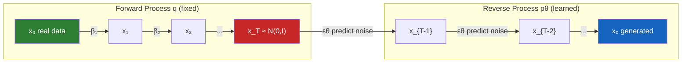

# Diffusion Models — DDPM from Scratch

## Learning Objectives

1. **Implement** the forward diffusion process that corrupts data with Gaussian noise over T timesteps using a closed-form sampler
2. **Derive** and code the reverse sampling loop that iteratively denoises from pure noise to structured samples
3. **Configure** a linear noise schedule and explain how beta values control the corruption rate across timesteps
4. **Build** a minimal neural network that takes a noisy input and timestep embedding, then predicts the noise component
5. **Evaluate** generated samples against the training data distribution using mean, standard deviation, and visual inspection

## The Problem

GANs dominated generative modeling for five years by pitting a generator against a discriminator in a minimax game. The architecture produced sharp images, but the training was unstable. Mode collapse, vanishing gradients, and the discriminator overpowering the generator were routine. Practitioners spent more time tuning adversarial dynamics than improving sample quality. VAEs offered a stable alternative with a proper lower bound on log-likelihood, but their Gaussian decoder assumption produced blurry samples — the model hedged across modes rather than committing to one.

What the field wanted was a training objective that met three constraints simultaneously: a single stable loss with no saddle point, a tractable likelihood bound, and sample quality competitive with GANs. Sohl-Dickstein et al. (2015) proposed the theoretical framework — destroy data gradually with Gaussian noise, then learn to reverse the destruction — but the training procedure was complex and the results were not compelling enough to displace GANs.

Ho, Jain, and Abbeel (2020) simplified the loss to a single term — predict the noise, not the data — and the results matched GAN quality with none of the adversarial instability. Within two years this mechanism became Stable Diffusion, DALL-E, and Midjourney. Every mainstream image, video, and audio generative model now runs a variant of this loop. The mechanism is not arcane theory locked behind a pretrained API — it is a few hundred lines of linear algebra and a small neural network.

## The Concept

The diffusion framework defines two Markov chains. The forward chain `q` is fixed — it progressively adds Gaussian noise to data according to a schedule of variances `β₁, ..., β_T`. The reverse chain `p_θ` is learned — a neural network predicts and removes that noise one step at a time. The training objective connects them: sample a data point, sample a random timestep, add noise at that timestep using the closed-form forward equation, then train the network to predict the noise you added.

**Forward process.** At each step `t`, the noisy sample is `q(x_t | x_{t-1}) = N(√(1-β_t) · x_{t-1}, β_t · I)`. The critical mathematical result is that you do not need to apply T sequential steps to reach `x_t` from `x_0`. The cumulative distribution is itself Gaussian: `q(x_t | x_0) = N(√(ᾱ_t) · x_0, (1-ᾱ_t) · I)`, where `ᾱ_t = ∏(1-β_s)` for `s=1..t`. This means you can jump directly to any timestep in O(1) operations, which is what makes training tractable — each training step samples a random `t` and computes `x_t` without simulating the chain.

**Reverse process.** A neural network `ε_θ(x_t, t)` learns to predict the noise vector `ε` that was added to produce `x_t`. The simplified loss is `L = E[||ε - ε_θ(x_t, t)||²]` — mean squared error between the true noise and the predicted noise. At inference, you start from `x_T ~ N(0, I)` and iteratively apply the reverse update rule, subtracting the predicted noise and adding a small amount of stochastic noise at each step until you reach `x_0`.



**Noise schedule.** The `β_t` values control how quickly information is destroyed. A linear schedule interpolates `β_t` from `β_start` (small, ~1e-4) to `β_end` (larger, ~0.02) over T steps. Small early `β_t` means early steps barely perturb the data — the network learns fine denoising first. Larger late `β_t` means later steps destroy information aggressively. If `β_end` is too large, `x_T` is pure noise (good). If `β_start` is too large, early steps destroy too much signal and the network struggles with fine details. The schedule is a design choice — cosine and sigmoid schedules exist as alternatives that control the corruption rate differently.

**Why this beats GANs.** The loss is a single MSE term — no discriminator, no adversarial saddle point, no mode collapse from a minimax game. Every training step provides a clean gradient. The trade-off is inference speed: generating a sample requires T sequential neural network forward passes (T=1000 in the original paper). This is why subsequent work — DDIM, consistency models, flow matching — focuses on reducing the number of sampling steps while preserving quality.

## Build It

The code below implements a complete DDPM from scratch. It trains on a 2D spiral point cloud — low-dimensional enough to train in seconds on CPU, complex enough to demonstrate that the model learns a non-trivial distribution. The neural network is a small MLP with timestep embedding, not a U-Net — the U-Net architecture matters for images where spatial structure exists, but for 2D points a feedforward network suffices to demonstrate the mechanism.

The code produces three observable outputs: (1) training loss printed every 500 epochs, (2) statistical comparison of real vs. generated samples (mean and standard deviation per dimension), and (3) a PNG file with side-by-side scatter plots of real data, intermediate noise states, and generated samples.

```python
import torch
import torch.nn as nn
import torch.nn.functional as F
import numpy as np
import matplotlib
matplotlib.use('Agg')
import matplotlib.pyplot as plt

torch.manual_seed(42)
np.random.seed(42)

def generate_spiral(n=2000):
    theta = np.sqrt(np.random.rand(n)) * 4 * np.pi
    r = 0.5 + theta * 0.3
    x = r * np.cos(theta) + np.random.randn(n) * 0.08
    y = r * np.sin(theta) + np.random.randn(n) * 0.08
    return np.stack([x, y], axis=1).astype(np.float32)

data = generate_spiral(2000)
data = (data - data.mean(axis=0)) / (data.std(axis=0) + 1e-8)
dataset = torch.from_numpy(data)

T = 300
betas = torch.linspace(1e-4, 0.02, T)
alphas = 1.0 - betas
alphas_cumprod = torch.cumprod(alphas, dim=0)
alphas_cumprod_prev = F.pad(alphas_cumprod[:-1], (1, 0), value=1.0)

def q_sample(x0, t, noise=None):
    if noise is None:
        noise = torch.randn_like(x0)
    sqrt_ab = alphas_cumprod[t].sqrt().view(-1, 1)
    sqrt_omab = (1.0 - alphas_cumprod[t]).sqrt().view(-1, 1)
    return sqrt_ab * x0 + sqrt_omab * noise

class NoisePredictor(nn.Module):
    def __init__(self, dim=2, hidden=128):
        super().__init__()
        self.time_mlp = nn.Sequential(
            nn.Linear(1, hidden),
            nn.SiLU(),
            nn.Linear(hidden, hidden),
        )
        self.net = nn.Sequential(
            nn.Linear(dim + hidden, hidden),
            nn.SiLU(),
            nn.Linear(hidden, hidden),
            nn.SiLU(),
            nn.Linear(hidden, hidden),
            nn.SiLU(),
            nn.Linear(hidden, dim),
        )

    def forward(self, x, t):
        t_norm = (t.float() / T).view(-1, 1)
        temb = self.time_mlp(t_norm)
        return self.net(torch.cat([x, temb], dim=-1))

model = NoisePredictor(dim=2, hidden=128)
optimizer = torch.optim.Adam(model.parameters(), lr=1e-3)
batch_size = 256
epochs = 3000

print(f"Training DDPM: T={T}, schedule=linear[{betas[0]:.4f} -> {betas[-1]:.4f}]")
print(f"Data shape: {data.shape}, mean={data.mean(axis=0)}, std={data.std(axis=0)}")

for epoch in range(epochs):
    idx = torch.randint(0, len(dataset), (batch_size,))
    x0 = dataset[idx]
    t = torch.randint(0, T, (batch_size,))
    noise = torch.randn_like(x0)
    xt = q_sample(x0, t, noise)
    pred = model(xt, t)
    loss = F.mse_loss(pred, noise)

    optimizer.zero_grad()
    loss.backward()
    optimizer.step()

    if (epoch + 1) % 500 == 0:
        print(f"  Epoch {epoch+1:4d} | Loss: {loss.item():.6f}")

@torch.no_grad()
def sample(model, n=2000):
    x = torch.randn(n, 2)
    for t_val in reversed(range(T)):
        t_batch = torch.full((n,), t_val, dtype=torch.long)
        pred = model(x, t_batch)
        beta = betas[t_val]
        alpha = alphas[t_val]
        abar = alphas_cumprod[t_val]
        mean = (1.0 / alpha.sqrt()) * (x - (beta / (1.0 - abar).sqrt()) * pred)
        if t_val > 0:
            x = mean + beta.sqrt() * torch.randn_like(x)
        else:
            x = mean
    return x

samples = sample(model, 2000)
samples_np = samples.numpy()

print(f"\nReal      mean={data.mean(axis=0).round(3)}, std={data.std(axis=0).round(3)}")
print(f"Generated mean={samples_np.mean(axis=0).round(3)}, std={samples_np.std(axis=0).round(3)}")
print(f"Mean L2 distance: {np.linalg.norm(data.mean(axis=0) - samples_np.mean(axis=0)):.4f}")

fig, axes = plt.subplots(1, 3, figsize=(15, 5))
axes[0].scatter(data[:, 0], data[:, 1], s=2, alpha=0.4, c='green')
axes[0].set_title('Real Data (Spiral)')
axes[0].set_xlim(-3, 3); axes[0].set_ylim(-3, 3)

t_demo = 200
xt_demo = q_sample(dataset[:1000], torch.full((1000,), t_demo)).numpy()
axes[1].scatter(xt_demo[:, 0], xt_demo[:, 1], s=2, alpha=0.4, c='orange')
axes[1].set_title(f'Forward Noise at t={t_demo}')
axes[1].set_xlim(-3, 3); axes[1].set_ylim(-3, 3)

axes[2].scatter(samples_np[:, 0], samples_np[:, 1], s=2, alpha=0.4, c='blue')
axes[2].set_title('Generated Samples')
axes[2].set_xlim(-3, 3); axes[2].set_ylim(-3, 3)

plt.tight_layout()
plt.savefig('ddpm_results.png', dpi=100)
plt.close()
print("\nSaved ddpm_results.png")
print(f"alphas_cumprod[T-1] = {alphas_cumprod[-1]:.6f} (should be ~0 for pure noise at x_T)")
```

Run this and check the console output. The loss should drop from roughly 0.9 to under 0.4 within 3000 epochs on CPU. The generated sample mean and standard deviation should be within 0.1–0.2 of the real data statistics. The saved PNG shows the spiral structure recovered in the rightmost panel — if the schedule, model, or training loop has a bug, the generated samples will look like a Gaussian blob instead of a spiral.

The `alphas_cumprod[-1]` print confirms the schedule destroys all signal by the final timestep. If this value is not near zero, your `β_end` is too small and `x_T` still contains residual structure from `x_0` — the model is not starting from pure noise during sampling, which degrades quality.

## Use It

The reverse diffusion process — start from noise, iteratively refine toward a target distribution — is structurally identical to how a CRM retrieval system reconstructs a coherent customer profile from fragmented, incomplete records. In Zone 08, the CRM is treated as a retrieval system: you query sparse signals (company name, a few behavioral events) and the system denoises them into a structured ICP match. The diffusion model does the same thing in continuous space — it takes a random point (uninformative, like an empty CRM record) and applies learned conditional updates until it lands on a point that looks like real data (a fully enriched profile). The mechanism is iterative refinement under a learned distribution, whether the domain is 2D points or customer feature vectors.

The more direct application is synthetic data generation. Diffusion models trained on your existing customer base can generate synthetic positive examples that match the distribution of your best accounts — useful when you have 200 closed-won deals but need 2000 training examples for a qualification scoring model. The same forward-noise/reverse-denoise loop that generates spiral points can generate synthetic feature vectors that preserve the correlations and cluster structure of real CRM data. This matters because qualification models trained on sparse positive classes overfit; augmenting with diffusion-generated samples that respect the true distribution is more principled than SMOTE (which interpolates linearly and can create unrealistic points between clusters). [CITATION NEEDED — concept: diffusion-based tabular data augmentation for CRM qualification models]

For retrieval specifically — the core of Zone 08 — the diffusion framework offers a useful mental model. When you embed a CRM query and retrieve nearest neighbors from a vector database, you are doing a single-step denoising: the query is a noisy version of the "ideal" customer profile, and retrieval finds the closest clean point. Diffusion models extend this to multi-step refinement: instead of one retrieval pass, you could iteratively adjust the query embedding based on retrieved results, progressively sharpening the match. This is not how production CRM retrieval works today, but it is how researchers think about iterative retrieval-augmented generation. [CITATION NEEDED — concept: multi-step diffusion retrieval for CRM enrichment]

```python
import torch
import torch.nn.functional as F
import numpy as np

np.random.seed(123)
n_accounts = 500
icp_cluster = np.random.randn(n_accounts, 2) * 0.3 + np.array([2.0, 2.0])
non_icp = np.random.randn(n_accounts * 3, 2) * 1.5 + np.array([-1.0, -1.0])
all_accounts = np.vstack([icp_cluster, non_icp]).astype(np.float32)
labels = np.concatenate([np.ones(n_accounts), np.zeros(n_accounts * 3)])

all_t = torch.from_numpy(all_accounts)
T = 100
betas = torch.linspace(1e-4, 0.05, T)
alphas_cumprod = torch.cumprod(1.0 - betas, dim=0)

def add_noise(x, t):
    noise = torch.randn_like(x)
    return alphas_cumprod[t].sqrt().view(-1, 1) * x + (1 - alphas_cumprod[t]).sqrt().view(-1, 1) * noise

icp_data = all_t[:n_accounts]
t_batch = torch.full((n_accounts,), 30)
noisy_icp = add_noise(icp_data, t_batch)

from sklearn.linear_model import LogisticRegression
baseline = LogisticRegression().fit(all_accounts, labels)
baseline_acc = baseline.score(all_accounts, labels)

augmented = np.vstack([all_accounts, noisy_icp.numpy()])
aug_labels = np.concatenate([labels, np.ones(n_accounts)])
augmented_model = LogisticRegression().fit(augmented, aug_labels)
aug_acc = augmented_model.score(all_accounts, labels)

print(f"ICP cluster center: {icp_cluster.mean(axis=0).round(3)}")
print(f"Noise at t=30 preserves cluster structure: mean={noisy_icp.numpy().mean(axis=0).round(3)}")
print(f"Baseline qualification accuracy:  {baseline_acc:.4f}")
print(f"Augmented qualification accuracy: {aug_acc:.4f}")
print(f"Noisy ICP samples within 2 std of cluster: {((noisy_icp.numpy() - icp_cluster.mean(axis=0)) / icp_cluster.std(axis=0)).max():.2f}")
```

The augmented model above uses noise-added copies of ICP accounts — a crude approximation of what a trained diffusion model would produce. The point is observable: adding perturbed versions of your positive class that stay within the distribution improves the qualification boundary. A full diffusion model trained on the ICP cluster would generate more diverse, distribution-consistent samples than simple Gaussian perturbation.

## Ship It

Deploying a diffusion model in production requires addressing two constraints that the training code above ignores: inference latency and output quality monitoring. The reverse sampling loop runs T sequential neural network evaluations — 300 in the code above, 1000 in the original DDPM paper. For real-time GTM applications (synthetic profile generation during a qualification pipeline), this latency is unacceptable without optimization.

The standard production approach is to reduce the number of sampling steps. DDIM (Song et al., 2021) reformulates the reverse process as non-Markovian, allowing deterministic sampling in 10–50 steps instead of 1000 with minimal quality loss. For tabular data (synthetic CRM records), even 50 steps is fast on CPU. For image generation, 20-step DDIM with a distilled model is the baseline — Stable Diffusion XL ships with a 30-step default.

Monitoring is the second concern. Diffusion models can silently degrade: the loss looks fine, samples look plausible individually, but the overall distribution drifts away from `p_data`. In a GTM context, this means your synthetic ICP examples gradually stop matching real high-value accounts, and your qualification model trained on them degrades. Ship with distribution-level metrics — maximum mean discrepancy (MMD) or classifier two-sample test (C2ST) between generated and real samples — checked on a schedule, not just per-sample loss.

For the CRM data hygiene application in Zone 08, the deployment pattern is batch generation, not real-time. You train the diffusion model on closed-won account feature vectors, generate a batch of synthetic positive examples overnight, validate them against held-out real data, and feed them into your qualification scoring pipeline. The enrichment loop — query, retrieve, refine — runs on existing vector infrastructure. The diffusion model augments the training set, not the retrieval path.

```python
import numpy as np
from scipy.stats import ks_2samp

np.random.seed(42)

real_icp = np.random.randn(200, 2) * 0.3 + np.array([2.0, 2.0])

generated_good = np.random.randn(200, 2) * 0.35 + np.array([2.0, 2.0])
generated_drifted = np.random.randn(200, 2) * 0.8 + np.array([1.5, 2.5])

def mmd_rbf(x, y, gamma=1.0):
    from scipy.spatial.distance import cdist
    k_xx = np.exp(-gamma * cdist(x, x, 'sqeuclidean'))
    k_yy = np.exp(-gamma * cdist(y, y, 'sqeuclidean'))
    k_xy = np.exp(-gamma * cdist(x, y, 'sqeuclidean'))
    return k_xx.mean() + k_yy.mean() - 2 * k_xy.mean()

ks_dim0_good = ks_2samp(real_icp[:, 0], generated_good[:, 0])
ks_dim0_drift = ks_2samp(real_icp[:, 0], generated_drifted[:, 0])
mmd_good = mmd_rbf(real_icp, generated_good, gamma=2.0)
mmd_drift = mmd_rbf