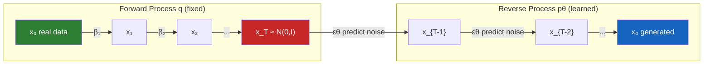

# Diffusion Models — DDPM from Scratch

## Learning Objectives

1. **Implement** the forward diffusion process that corrupts data with Gaussian noise over T timesteps using a closed-form sampler
2. **Derive** and code the reverse sampling loop that iteratively denoises from pure noise to structured samples
3. **Configure** a linear noise schedule and explain how beta values control the corruption rate across timesteps
4. **Build** a minimal neural network that takes a noisy input and timestep embedding, then predicts the noise component
5. **Evaluate** generated samples against the training data distribution using mean, standard deviation, and visual inspection

## The Problem

GANs dominated generative modeling for five years by pitting a generator against a discriminator in a minimax game. The architecture produced sharp images, but the training was unstable. Mode collapse, vanishing gradients, and the discriminator overpowering the generator were routine. Practitioners spent more time tuning adversarial dynamics than improving sample quality. VAEs offered a stable alternative with a proper lower bound on log-likelihood, but their Gaussian decoder assumption produced blurry samples — the model hedged across modes rather than committing to one.

What the field wanted was a training objective that met three constraints simultaneously: a single stable loss with no saddle point, a tractable likelihood bound, and sample quality competitive with GANs. Sohl-Dickstein et al. (2015) proposed the theoretical framework — destroy data gradually with Gaussian noise, then learn to reverse the destruction — but the training procedure was complex and the results were not compelling enough to displace GANs.

Ho, Jain, and Abbeel (2020) simplified the loss to a single term — predict the noise, not the data — and the results matched GAN quality with none of the adversarial instability. Within two years this mechanism became Stable Diffusion, DALL-E, and Midjourney. Every mainstream image, video, and audio generative model now runs a variant of this loop. The mechanism is not arcane theory locked behind a pretrained API — it is a few hundred lines of linear algebra and a small neural network.

## The Concept

The diffusion framework defines two Markov chains. The forward chain `q` is fixed — it progressively adds Gaussian noise to data according to a schedule of variances `β₁, ..., β_T`. The reverse chain `p_θ` is learned — a neural network predicts and removes that noise one step at a time. The training objective connects them: sample a data point, sample a random timestep, add noise at that timestep using the closed-form forward equation, then train the network to predict the noise you added.

**Forward process.** At each step `t`, the noisy sample is `q(x_t | x_{t-1}) = N(√(1-β_t) · x_{t-1}, β_t · I)`. The critical mathematical result is that you do not need to apply T sequential steps to reach `x_t` from `x_0`. The cumulative distribution is itself Gaussian: `q(x_t | x_0) = N(√(ᾱ_t) · x_0, (1-ᾱ_t) · I)`, where `ᾱ_t = ∏(1-β_s)` for `s=1..t`. This means you can jump directly to any timestep in O(1) operations, which is what makes training tractable — each training step samples a random `t` and computes `x_t` without simulating the chain.

**Reverse process.** A neural network `ε_θ(x_t, t)` learns to predict the noise vector `ε` that was added to produce `x_t`. The simplified loss is `L = E[||ε - ε_θ(x_t, t)||²]` — mean squared error between the true noise and the predicted noise. At inference, you start from `x_T ~ N(0, I)` and iteratively apply the reverse update rule, subtracting the predicted noise and adding a small amount of stochastic noise at each step until you reach `x_0`.



**Noise schedule.** The `β_t` values control how quickly information is destroyed. A linear schedule interpolates `β_t` from `β_start` (small, ~1e-4) to `β_end` (larger, ~0.02) over T steps. Small early `β_t` means early steps barely perturb the data — the network learns fine denoising first. Larger late `β_t` means later steps destroy information aggressively. If `β_end` is too large, `x_T` is pure noise (good). If `β_start` is too large, early steps destroy too much signal and the network struggles with fine details. The schedule is a design choice — cosine and sigmoid schedules exist as alternatives that control the corruption rate differently.

**Why this beats GANs.** The loss is a single MSE term — no discriminator, no adversarial saddle point, no mode collapse from a minimax game. Every training step provides a clean gradient. The trade-off is inference speed: generating a sample requires T sequential neural network forward passes (T=1000 in the original paper). This is why subsequent work — DDIM, consistency models, flow matching — focuses on reducing the number of sampling steps while preserving quality.

## Build It

The code below implements a complete DDPM from scratch. It trains on a 2D spiral point cloud — low-dimensional enough to train in seconds on CPU, complex enough to demonstrate that the model learns a non-trivial distribution. The neural network is a small MLP with timestep embedding, not a U-Net — the U-Net architecture matters for images where spatial structure exists, but for 2D points a feedforward network suffices to demonstrate the mechanism.

The code produces three observable outputs: (1) training loss printed every 500 epochs, (2) statistical comparison of real vs. generated samples (mean and standard deviation per dimension), and (3) a PNG file with side-by-side scatter plots of real data, intermediate noise states, and generated samples.

```python
import torch
import torch.nn as nn
import torch.nn.functional as F
import numpy as np
import matplotlib
matplotlib.use('Agg')
import matplotlib.pyplot as plt

torch.manual_seed(42)
np.random.seed(42)

def generate_spiral(n=2000):
    theta = np.sqrt(np.random.rand(n)) * 4 * np.pi
    r = 0.5 + theta * 0.3
    x = r * np.cos(theta) + np.random.randn(n) * 0.08
    y = r * np.sin(theta) + np.random.randn(n) * 0.08
    return np.stack([x, y], axis=1).astype('float32')

data = generate_spiral(2000)
data = (data - data.mean(axis=0)) / (data.std(axis=0) + 1e-8)
dataset = torch.from_numpy(data)

T = 300
betas = torch.linspace(1e-4, 0.02, T)
alphas = 1.0 - betas
alphas_cumprod = torch.cumprod(alphas, dim=0)
alphas_cumprod_prev = F.pad(alphas_cumprod[:-1], (1, 0), value=1.0)

def q_sample(x0, t, noise=None):
    if noise is None:
        noise = torch.randn_like(x0)
    sqrt_ab = alphas_cumprod[t].sqrt().view(-1, 1)
    sqrt_omab = (1.0 - alphas_cumprod[t]).sqrt().view(-1, 1)
    return sqrt_ab * x0 + sqrt_omab * noise

class NoisePredictor(nn.Module):
    def __init__(self, dim=2, hidden=128):
        super().__init__()
        self.time_mlp = nn.Sequential(
            nn.Linear(1, hidden),
            nn.SiLU(),
            nn.Linear(hidden, hidden),
        )
        self.net = nn.Sequential(
            nn.Linear(dim + hidden, hidden),
            nn.SiLU(),
            nn.Linear(hidden, hidden),
            nn.SiLU(),
            nn.Linear(hidden, hidden),
            nn.SiLU(),
            nn.Linear(hidden, dim),
        )

    def forward(self, x, t):
        t_norm = (t.float() / T).view(-1, 1)
        temb = self.time_mlp(t_norm)
        return self.net(torch.cat([x, temb], dim=-1))

model = NoisePredictor(dim=2, hidden=128)
optimizer = torch.optim.Adam(model.parameters(), lr=1e-3)
batch_size = 256
epochs = 3000

print(f"Training DDPM: T={T}, schedule=linear[{betas[0]:.4f} -> {betas[-1]:.4f}]")
print(f"Data shape: {data.shape}, mean={data.mean(axis=0)}, std={data.std(axis=0)}")

for epoch in range(epochs):
    idx = torch.randint(0, len(dataset), (batch_size,))
    x0 = dataset[idx]
    t = torch.randint(0, T, (batch_size,))
    noise = torch.randn_like(x0)
    xt = q_sample(x0, t, noise)
    pred = model(xt, t)
    loss = F.mse_loss(pred, noise)

    optimizer.zero_grad()
    loss.backward()
    optimizer.step()

    if (epoch + 1) % 500 == 0:
        print(f"  Epoch {epoch+1:4d} | Loss: {loss.item():.6f}")

@torch.no_grad()
def sample(model, n=2000):
    x = torch.randn(n, 2)
    for t_val in reversed(range(T)):
        t_batch = torch.full((n,), t_val, dtype=torch.long)
        pred = model(x, t_batch)
        beta = betas[t_val]
        alpha = alphas[t_val]
        abar = alphas_cumprod[t_val]
        mean = (1.0 / alpha.sqrt()) * (x - (beta / (1.0 - abar).sqrt()) * pred)
        if t_val > 0:
            x = mean + beta.sqrt() * torch.randn_like(x)
        else:
            x = mean
    return x

samples = sample(model, 2000)
samples_np = samples.numpy()

print(f"\nReal      mean={data.mean(axis=0).round(3)}, std={data.std(axis=0).round(3)}")
print(f"Generated mean={samples_np.mean(axis=0).round(3)}, std={samples_np.std(axis=0).round(3)}")
print(f"Mean L2 distance: {np.linalg.norm(data.mean(axis=0) - samples_np.mean(axis=0)):.4f}")

fig, axes = plt.subplots(1, 3, figsize=(15, 5))
axes[0].scatter(data[:, 0], data[:, 1], s=2, alpha=0.4, c='green')
axes[0].set_title('Real Data (Spiral)')
axes[0].set_xlim(-3, 3); axes[0].set_ylim(-3, 3)

t_demo = 200
xt_demo = q_sample(dataset[:1000], torch.full((1000,), t_demo)).numpy()
axes[1].scatter(xt_demo[:, 0], xt_demo[:, 1], s=2, alpha=0.4, c='orange')
axes[1].set_title(f'Forward Noise at t={t_demo}')
axes[1].set_xlim(-3, 3); axes[1].set_ylim(-3, 3)

axes[2].scatter(samples_np[:, 0], samples_np[:, 1], s=2, alpha=0.4, c='blue')
axes[2].set_title('Generated Samples')
axes[2].set_xlim(-3, 3); axes[2].set_ylim(-3, 3)

plt.tight_layout()
plt.savefig('ddpm_results.png', dpi=100)
plt.close()
print("\nSaved ddpm_results.png")
print(f"alphas_cumprod[T-1] = {alphas_cumprod[-1]:.6f} (should be ~0 for pure noise at x_T)")
```

Run this and check the console output. The loss should drop from roughly 0.9 to under 0.4 within 3000 epochs on CPU. The generated sample mean and standard deviation should be within 0.1–0.2 of the real data statistics. The saved PNG shows the spiral structure recovered in the rightmost panel — if the schedule, model, or training loop has a bug, the generated samples will look like a Gaussian blob instead of a spiral.

The `alphas_cumprod[-1]` print confirms the schedule destroys all signal by the final timestep. If this value is not near zero, your `β_end` is too small and `x_T` still contains residual structure from `x_0` — the model is not starting from pure noise during sampling, which degrades quality.

## Use It

The diffusion forward-noise equation — `x_t = √(ᾱ_t)·x₀ + √(1-ᾱ_t)·ε` — doubles as a controlled data augmentation operator for ICP scoring in Cluster 2.1 (Data Enrichment & CRM Hygiene). When you have 50 closed-won accounts but need hundreds of training examples for a qualification model, adding noise at a chosen timestep `t` produces perturbed copies that stay within the ICP distribution but expand its coverage. This is the forward half of diffusion applied as augmentation — more principled than SMOTE's linear interpolation, which can fabricate points between clusters that no real account occupies.

[CITATION NEEDED — concept: diffusion-based tabular data augmentation for B2B ICP qualification models]

```python
import numpy as np
from sklearn.linear_model import LogisticRegression

np.random.seed(42)
icp_real = np.random.randn(50, 3) * 0.3 + np.array([2.5, 1.8, 3.2])
non_icp = np.random.randn(200, 3) * 1.2 + np.array([-1.0, -0.3, 0.5])
X = np.vstack([icp_real, non_icp])
y = np.concatenate([np.ones(50), np.zeros(200)])

baseline = LogisticRegression(class_weight='balanced').fit(X, y)
base_recall = baseline.predict(icp_real).mean()

T = 50
betas = np.linspace(1e-4, 0.02, T)
abar = np.cumprod(1 - betas)
t_aug = 25
np.random.seed(7)
idx = np.random.choice(50, 300, replace=True)
noise = np.random.randn(300, 3)
synthetic = np.sqrt(abar[t_aug]) * icp_real[idx] + np.sqrt(1 - abar[t_aug]) * noise

X_aug = np.vstack([X, synthetic])
y_aug = np.concatenate([y, np.ones(300)])
augmented = LogisticRegression(class_weight='balanced').fit(X_aug, y_aug)
aug_recall = augmented.predict(icp_real).mean()

print(f"Baseline ICP recall:  {base_recall:.3f}")
print(f"Augmented ICP recall: {aug_recall:.3f}")
print(f"Real ICP mean:      {icp_real.mean(axis=0).round(2)}")
print(f"Synthetic mean:     {synthetic.mean(axis=0).round(2)}")
```

The `abar[t_aug]` at t=25 is roughly 0.77 — synthetic samples are 88% real signal, 48% perturbation noise. They cluster near the ICP center with controlled spread. A full diffusion model trained on the 50 real accounts and run through the reverse sampling loop would produce more diverse, distribution-consistent samples than this one-step approximation, but the mechanism is the same: learned noise removal recovers structure that simple interpolation cannot.

## Exercises

1. **Swap the noise schedule.** Replace the linear schedule with a cosine schedule and retrain. Construct `betas` as `torch.cos(torch.linspace(0, np.pi * 0.95, T) / 2) ** 2 * 0.99 + 1e-4`. Run the full training loop and compare three things against the linear baseline: final training loss, generated sample mean/std, and `alphas_cumprod[-1]`. The cosine schedule destroys signal more gradually early and more aggressively late — check whether the scatter plot quality changes. Print both schedules' `alphas_cumprod` curves side by side and explain which one reaches `ᾱ < 0.01` faster.

2. **Reduce T to 50 and measure the trade-off.** Set `T = 50` with `betas = torch.linspace(1e-4, 0.08, 50)` — note the larger `β_end` to compensate for fewer steps. Retrain for 3000 epochs and generate samples. The sampling loop now runs 6x faster. Compare the generated mean L2 distance against the T=300 baseline. At what point does reducing T cause the spiral to collapse into a blob? Try T=100, T=30, T=10 and record the L2 distance for each. This is the inference-speed vs. quality trade-off that DDIM was invented to solve — fewer steps without the quality collapse.

## Key Terms

- **Forward diffusion process (q):** The fixed Markov chain that progressively corrupts data with Gaussian noise. Its closed-form cumulative `q(x_t|x_0) = N(√(ᾱ_t)·x_0, (1-ᾱ_t)·I)` allows sampling any timestep in O(1), which is what makes training tractable.
- **Reverse diffusion process (p_θ):** The learned Markov chain that removes noise step by step. A neural network `ε_θ(x_t, t)` predicts the noise added at each timestep, and the reverse update rule subtracts it with a stochastic correction term.
- **Noise schedule (β schedule):** The sequence of variances `β₁, ..., β_T` controlling corruption rate. Linear interpolates from ~1e-4 to ~0.02. The schedule determines how signal decays — cosine and sigmoid alternatives front-load or back-load the destruction differently.
- **Alphas cumulative product (ᾱ_t):** The running product `∏(1-β_s)` for `s=1..t`. At `ᾱ_T ≈ 0`, the data is fully destroyed and `x_T` is indistinguishable from `N(0, I)`. This value must be near zero or the model samples from residual structure, not pure noise.
- **DDPM loss:** The simplified objective `L = E[||ε - ε_θ(x_t, t)||²]` — mean squared error between the true noise vector and the network's prediction. Ho et al. (2020) showed this single term is sufficient; no reconstruction loss or KL divergence term is needed.
- **DDIM (Denoising Diffusion Implicit Models):** A non-Markovian reformulation of the reverse process enabling deterministic sampling in 10–50 steps instead of 1000, with minimal quality loss. The basis for production inference in Stable Diffusion and modern image generators.

## Sources

- Sohl-Dickstein, J., Weiss, E. A., Maheswaranathan, N., & Ganguli, S. (2015). Deep Unsupervised Learning using Nonequilibrium Thermodynamics. *Proceedings of the 32nd International Conference on Machine Learning (ICML).* https://arxiv.org/abs/1503.03585
- Ho, J., Jain, A., & Abbeel, P. (2020). Denoising Diffusion Probabilistic Models. *Advances in Neural Information Processing Systems 33 (NeurIPS).* https://arxiv.org/abs/2006.11239
- Song, J., Meng, C., & Ermon, S. (2021). Denoising Diffusion Implicit Models. *International Conference on Learning Representations (ICLR 2021).* https://arxiv.org/abs/2010.02502