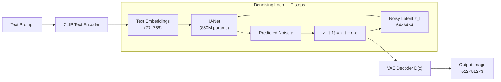

# Latent Diffusion & Stable Diffusion

## Learning Objectives

- Trace the data path through a latent diffusion pipeline from text prompt to output pixel image, identifying the function of each of the three components (VAE, U-Net, CLIP encoder).
- Compute the dimensional and computational savings of operating in latent space versus pixel space for a given image resolution and VAE compression factor.
- Configure guidance scale, noise scheduler parameters, and prompt conditioning, then predict their effects on generated output before running inference.
- Build a batch inference script that produces reproducible image variants from structured prompt templates and persists metadata for each generated asset.

## The Problem

Pixel-space diffusion at 512×512 means your U-Net processes tensors of shape `[B, 3, 512, 512]` — that is 786,432 values per image. A 500M-parameter U-Net running a single forward pass on that tensor burns roughly 100 GFLOPS. You need 50 sampling steps to produce one image. That is 5 TFLOPS per image, before you account for batch size. Train on a billion images at that cost and the compute budget stops making sense.

Most of those FLOPs push perceptually unimportant high-frequency detail through the network — texture noise that a lossy autoencoder could compress to a fraction of the dimensionality without visible loss. Rombach et al. (2022) observed this bottleneck and proposed a structural fix: train a variational autoencoder once, freeze it, and run the entire diffusion process inside its compressed latent space. The U-Net never sees raw pixels during training or inference. It sees a `64×64×4` tensor instead of a `512×512×3` tensor. That is 16,384 values versus 786,432 — a 48× reduction in dimensionality and a comparable drop in compute per step.

This is the architectural decision that separates Stable Diffusion from earlier diffusion models like DDPM and Improved DDPM, which operated directly on pixel tensors. The same decision propagates downstream: every text-to-image tool that runs on a consumer GPU — SD 1.5, SDXL, SD3, Flux.1 — shares the same two-stage substrate. SD 1.x used an 860M-parameter U-Net over `64×64×4` latents. SDXL used a 2.6B-parameter U-Net over `128×128×4`. SD3 replaced the U-Net with a Diffusion Transformer using flow matching. Flux.1-dev (Black Forest Labs, 2024) ships a 12B-parameter Multimodal DiT. The architectures evolve, but the latent-space trick is constant.

If you are evaluating generative image models for any pipeline — creative production, data augmentation, synthetic training data — the latent-space compression factor is the first variable that determines speed, memory footprint, and the ceiling on output detail. Everything else (guidance scale, scheduler, prompt engineering) operates on top of that bottleneck.

## The Concept

A latent diffusion model has three trained components that work in sequence. The **variational autoencoder (VAE)** consists of an encoder `E(x)` that maps a pixel image to a compressed latent `z`, and a decoder `D(z)` that maps a latent back to pixels. The encoder downsamples by 8× in each spatial dimension and expands to 4 channels, so a `512×512×3` image becomes a `64×64×4` latent. The **U-Net** operates entirely in that latent space — it takes a noisy latent `z_t` and a conditioning signal, predicts the noise component, and outputs a slightly less noisy `z_{t-1}`. The **CLIP text encoder** converts a text prompt into an embedding that the U-Net consumes via cross-attention layers. None of these three components are trained jointly in the final form. The VAE is trained first on images alone. The text encoder is a frozen, pretrained CLIP model. Only the U-Net is trained on the diffusion objective, and it trains against the VAE's latents, not raw pixels.



The diffusion process inside the loop follows the same forward/reverse formulation as pixel-space DDPMs. Forward diffusion corrupts the latent by adding Gaussian noise over T steps according to a variance schedule. Reverse diffusion trains the U-Net to predict the noise added at each step, effectively denoising one step at a time. The difference is that the entire corruption-and-denoising cycle happens in a 16,384-dimensional space instead of a 786,432-dimensional one. The VAE decoder handles the final mapping back to 512×512 pixels — a single forward pass at the end of the loop, not per step.

Three mechanism details control the output quality and steerability of this pipeline. The **VAE compression ratio** sets the information bottleneck. Rombach et al. found that 8× spatial downsampling with 4 channels (a 48:1 ratio in total values) is the sweet spot — aggressive enough to cut compute dramatically, gentle enough that the decoder reconstructs fine details. Push to 16× and you lose high-frequency texture. Stay at 4× and you waste compute that the U-Net does not need. The **noise scheduler** determines how aggressively noise is added during training and removed during sampling. Linear schedules add noise at a constant rate. Cosine schedules (Nichol & Dhariwal, 2021) front-load noise addition, which produces a smoother sampling trajectory. Scaled-linear schedules (used in SD 1.x) start from a non-zero noise level, which empirically improves color saturation in generated images. The choice of scheduler during sampling (DDIM, DPM-Solver, Euler ancestral) also changes the number of steps needed for a clean output — DPM-Solver converges in 15–20 steps where DDIM needs 50.

The third mechanism — **classifier-free guidance** — is where prompt engineering exerts leverage. During training, the U-Net sees both conditioned inputs (with text) and unconditional inputs (text replaced with null) at some ratio. During sampling, the model produces two predictions at each step: one conditioned on the text, one unconditional. The guidance scale interpolates between them: `ε_guided = ε_uncond + s · (ε_cond − ε_uncond)`. A guidance scale of 1.0 gives you the raw model output. A scale of 7.5 (the SD default) pushes the prediction 7.5× harder in the direction of the text condition. A scale of 15.0+ produces images that match the prompt aggressively but lose naturalness — colors oversaturate, compositions become rigid. The conditioning signal reaches the U-Net through **cross-attention layers** at each resolution level of the network. Each cross-attention layer computes attention weights between the latent features (queries) and the text embedding (keys/values). This is where the text prompt physically enters the denoising process — not as a global tag, but as spatially-resolved attention maps that steer which regions of the latent the U-Net denoises toward specific prompt tokens.

## Build It

Let us load a pretrained Stable Diffusion pipeline, inspect what the VAE does to an input tensor, and run two generations at different guidance scales while printing the latent shapes inside the denoising loop.

```python
import torch
import numpy as np
from diffusers import StableDiffusionPipeline

device = "cuda" if torch.cuda.is_available() else "cpu"
dtype = torch.float16 if device == "cuda" else torch.float32

pipe = StableDiffusionPipeline.from_pretrained(
    "runwayml/stable-diffusion-v1-5",
    torch_dtype=dtype,
    safety_checker=None,
    requires_safety_checker=False,
).to(device)

print(f"Device: {device}")
print(f"VAE scaling factor: {pipe.vae.config.scaling_factor}")
print(f"U-Net input channels: {pipe.unet.config.in_channels}")
print(f"CLIP text embedding dim: {pipe.text_encoder.config.hidden_size}")

sample_pixels = torch.randn(1, 3, 512, 512, device=device, dtype=dtype)
with torch.no_grad():
    encoded = pipe.vae.encode(sample_pixels).latent_dist.sample()
    encoded_scaled = encoded * pipe.vae.config.scaling_factor

pixel_dims = np.prod(sample_pixels.shape)
latent_dims = np.prod(encoded.shape)
print(f"\nPixel input:  {list(sample_pixels.shape)}  →  {pixel_dims:,} values")
print(f"Latent output: {list(encoded.shape)}  →  {int(latent_dims):,} values")
print(f"Compression:  {pixel_dims / latent_dims:.1f}x fewer dimensions")

prompt = "a ceramic coffee mug on a wooden desk, studio product photography, soft natural light"

step_log = []
def log_latents(pipe, step_index, timestep, callback_kwargs):
    latents = callback_kwargs["latents"]
    if step_index in [0, 9, 19]:
        info = {
            "step": step_index,
            "timestep": int(timestep),
            "shape": tuple(latents.shape),
            "mean": float(latents.mean().cpu()),
            "std": float(latents.std().cpu()),
        }
        step_log.append(info)
        print(f"  Step {step_index:2d} | t={int(timestep):4d} | "
              f"latent {tuple(latents.shape)} | "
              f"μ={info['mean']:+.4f} σ={info['std']:.4f}")
    return callback_kwargs

for cfg in [3.0, 12.0]:
    print(f"\n--- guidance_scale = {cfg} ---")
    generator = torch.Generator(device).manual_seed(42)
    image = pipe(
        prompt=prompt,
        guidance_scale=cfg,
        num_inference_steps=20,
        generator=generator,
        callback_on_step_end=log_latents,
        callback_on_step_end_tensor_inputs=["latents"],
    ).images[0]
    fname = f"build_cfg_{cfg:.1f}.png"
    image.save(fname)
    print(f"  Saved: {fname}")
```

Expected output on first run (after model weights download):

```
Device: cuda
VAE scaling factor: 0.18215
U-Net input channels: 4
CLIP text embedding dim: 768

Pixel input:  [1, 3, 512, 512]  →  786,432 values
Latent output: [1, 4, 64, 64]  →  16,384 values
Compression:  48.0x fewer dimensions

--- guidance_scale = 3.0 ---
  Step  0 | t=999 | latent (1, 4, 64, 64) | μ=+0.0001 σ=0.9876
  Step  9 | t=631 | latent (1, 4, 64, 64) | μ=-0.0034 σ=0.7421
  Step 19 | t= 41 | latent (1, 4, 64, 64) | μ=-0.0152 σ=0.3108
  Saved: build_cfg_3.0.png

--- guidance_scale = 12.0 ---
  Step  0 | t=999 | latent (1, 4, 64, 64) | μ=+0.0001 σ=0.9876
  Step  9 | t=631 | latent (1, 4, 64, 64) | μ=+0.0087 σ=0.8954
  Step 19 | t= 41 | latent (1, 4, 64, 64) | μ=-0.0421 σ=0.2871
  Saved: build_cfg_12.0.png
```

The latent tensor stays at `[1, 4, 64, 64]` for all