# ControlNet, LoRA & Conditioning

## Learning Objectives

- **Compute** the parameter reduction ratio of LoRA adapters given rank and matrix dimensions, and predict inference behavior when multiple LoRAs are merged.
- **Trace** the ControlNet data flow from conditioning input through the cloned encoder to residual injection in the U-Net decoder blocks.
- **Implement** classifier-free guidance extrapolation in numpy, and explain how ControlNet injects into the conditioned path.
- **Configure** a multi-adapter generation pipeline (base model + LoRAs + ControlNet) for a brand-asset production scenario.
- **Compare** additive LoRA merging versus full fine-tuning in terms of storage cost, training time, and quality tradeoffs.

## The Problem

You fine-tuned a diffusion model on your brand's product catalog. It cost 12 hours of GPU time and produced a 5 GB checkpoint. Now marketing wants a specific composition: product on the left, headline space on the right, consistent across 200 SKUs. The prompt `"product shot, copy space on right"` produces a different layout every time. Text conditioning does not pin down spatial structure — it is a coarse signal that leaves pose, position, and perspective to the model's prior.

Full fine-tuning cannot encode spatial constraints efficiently. You would need to curate thousands of training images that *happen* to have the right composition, and even then the model might not generalize the layout rule — it would just memorize specific examples. What you need is a mechanism that says "put the object here" at inference time, deterministically, without retraining.

There is a second problem. Your brand style guide specifies a particular visual treatment — specific color grading, a certain illustration density, a proprietary icon set. Retraining the full model for each brand variant is expensive: each new checkpoint is gigabytes, inference requires swapping models, and iterating on the style means starting over. You need a way to teach the model new concepts and styles that is cheap to train, cheap to store, and composable.

Two mechanisms solve these problems. LoRA replaces full-weight fine-tuning with low-rank matrix decomposition, cutting trainable parameters by 100x or more. ControlNet clones a portion of the model's encoder and trains it to read a spatial conditioning signal — an edge map, a depth map, a pose skeleton — then injects that signal into the decoder. Neither modifies the base model's weights. Both stack.

## The Concept

### LoRA: Low-Rank Adaptation

A diffusion model's weights are matrices. SDXL has attention layers with dimensions like 2048 × 2048 — about 4.2 million parameters per layer. Full fine-tuning updates every element. LoRA observes that the *meaningful* changes during fine-tuning live in a much smaller subspace. Instead of learning a full delta matrix ΔW of shape (d, d), decompose it into two thin matrices: A of shape (d, r) and B of shape (r, d), where r is the rank — typically 8 to 64. The effective delta is A × B, which has the same shape as ΔW but only requires d·r + r·d = 2dr parameters instead of d².

At inference, the LoRA delta is merged additively: W' = W + α · (A × B), where α is a scaling factor that controls how strongly the adapter influences output. Multiple LoRAs can be applied simultaneously by summing their deltas: W' = W + α₁(A₁B₁) + α₂(A₂B₂). This is why production pipelines stack a style LoRA, a subject LoRA, and a quality LoRA — each contributes a direction in weight space, and the merge is a linear combination.

For brand asset pipelines, this means a single base model (SDXL, Flux) can serve dozens of brands. Each brand ships as a 10-50 MB LoRA file. Swapping brands is a file load, not a model swap. [CITATION NEEDED — concept: percentage of production image pipelines using LoRA for brand-specific adaptation]

### ControlNet: Cloned Encoder with Zero Convolutions

ControlNet takes a different approach to a different problem. Instead of modifying weights, it duplicates a portion of the network's architecture. The U-Net in a diffusion model has an encoder (downsampling blocks) and a decoder (upsampling blocks) connected by skip connections. ControlNet clones the encoder, freezes the original U-Net entirely, and trains only the clone.

The clone accepts an additional input: a spatial conditioning map. This could be Canny edges, a depth estimate from MiDaS, a human pose skeleton from OpenPose, or even a rough scribble. The conditioning image is encoded into the same latent space as the diffusion input, then fed through the cloned encoder blocks in parallel with the original.

The connection between clone and original uses *zero convolutions* — convolution layers initialized with zero weights and zero biases. At the start of training, the clone contributes nothing (zero output). As training progresses, the zero-conv layers gradually learn to route spatial information from the clone into the original U-Net's decoder blocks as residual additions. This means the base model's generative distribution is preserved at initialization — the ControlNet starts as an identity operation and learns to perturb it.

```mermaid
flowchart TD
    A[Conditioning Input<br/>edge map / depth / pose] --> B[ControlNet Encoder<br/>cloned, trainable]
    C[Latent Noise + Timestep] --> D[Original U-Net<br/>frozen weights]
    D --> E[Encoder Blocks]
    E --> F[Decoder Blocks]
    B --> G[Zero Conv Layers<br/>init: weight=0, bias=0]
    G -->|residual add| F
    F --> H[Output Latent]
    
    style D fill:#333,stroke:#666
    style B fill:#4a3333,stroke:#775555
    style G fill:#33443a,stroke:#557755
```



For brand layout automation, this is the mechanism that enforces composition. A product image's Canny edges or a layout template's segmentation map becomes the conditioning input. The ControlNet nudges every generated image toward that structure. Marketing gets "product on the left, copy space on the right" across hundreds of SKUs without prompt engineering.

### Classifier-Free Guidance and the Conditioned Path

Diffusion models use classifier-free guidance (CFG) during training and inference. During training, the conditioning signal (text prompt) is randomly dropped to zero with some probability — typically 10%. This teaches the model to generate both with and without conditioning. At inference, the model runs twice: once with the prompt (conditioned) and once without (unconditioned). The final prediction extrapolates along the difference:

```
output = unconditioned + guidance_scale × (conditioned − unconditioned)
```

A guidance scale of 1.0 means equal weighting. Higher values (7-15) push harder in the direction the prompt specifies, increasing prompt adherence but risking oversaturation and artifacts. ControlNet operates by injecting its spatial signal into the *conditioned* path only. When CFG extrapolates the difference, the ControlNet's structural influence is amplified by the guidance scale — which is why high CFG with ControlNet can produce overly rigid outputs.

This three-part stack — LoRA for brand identity, ControlNet for spatial structure, CFG for prompt intensity — is the production recipe for automated creative generation. A single pipeline can produce on-brand, correctly-composed ad creative across product lines, languages, and channels, with the base model never changing.

## Build It

Let's build the math from scratch. First, LoRA parameter reduction and merge arithmetic — no GPU, no frameworks, just numpy:

```python
import numpy as np

d = 2048
r = 16

np.random.seed(42)
W_original = np.random.randn(d, d).astype(np.float32) * 0.02
A = np.random.randn(d, r).astype(np.float32) * 0.01
B = np.random.randn(r, d).astype(np.float32) * 0.01

delta_W = A @ B
alpha = 0.75
W_merged = W_original + alpha * delta_W

full_params = d * d
lora_params = d * r + r * d
reduction_ratio = full_params / lora_params

print(f"Weight matrix shape: {W_original.shape}")
print(f"Full fine-tune params: {full_params:,}")
print(f"LoRA params (rank {r}): {lora_params:,}")
print(f"Reduction ratio: {reduction_ratio:.1f}x fewer parameters")
print(f"LoRA file as % of full model: {(lora_params/full_params)*100:.3f}%")
print(f"Delta Frobenius norm: {np.linalg.norm(delta_W):.6f}")
print(f"Original Frobenius norm: {np.linalg.norm(W_original):.6f}")
print(f"Merged == original (alpha=0)? {np.allclose(W_original, W_original + 0 * delta_W)}")
```

Run this. The output should show roughly 128x fewer parameters and a LoRA delta that is about 0.3% the size of the full model.

Now let's trace the ControlNet residual injection pattern. We'll simulate a single U-Net decoder block receiving a ControlNet residual:

```python
import numpy as np

np.random.seed(42)

batch, channels, height, width = 2, 320, 64, 64

def unet_decoder_block(x, weights):
    return np.tensordot(x, weights, axes=([1], [0])).transpose(0, 3, 1, 2)

def controlnet_encoder_block(conditioning, weights):
    return np.tensordot(conditioning, weights, axes=([1], [0])).transpose(0, 3, 1, 2)

def zero_conv(x, conv_weight, conv_bias):
    return np.tensordot(x, conv_weight, axes=([1], [0])).transpose(0, 3, 1, 2) + conv_bias

decoder_input = np.random.randn(batch, channels, height, width).astype(np.float32)
decoder_weights = np.random.randn(channels, channels, 3, 3).astype(np.float32) * 0.01

conditioning_map = np.random.randn(batch, channels, height, width).astype(np.float32)
controlnet_weights = np.random.randn(channels, channels, 3, 3).astype(np.float32) * 0.01

zero_weight = np.zeros((channels, channels, 3, 3), dtype=np.float32)
zero_bias = np.zeros((channels,), dtype=np.float32)

decoder_output = unet_decoder_block(decoder_input, decoder_weights)
controlnet_output = controlnet_encoder_block(conditioning_map, controlnet_weights)
residual = zero_conv(controlnet_output, zero_weight, zero_bias)

final_output_before_training = decoder_output + residual
print(f"Residual at init (all zeros): {np.allclose(residual, 0)}")
print(f"Output unchanged at init: {np.allclose(final_output_before_training, decoder_output)}")

trained_weight = np.random.randn(channels, channels, 3, 3).astype(np.float32) * 0.005
trained_bias = np.random.randn(channels).astype(np.float32) * 0.01
residual_trained = zero_conv(controlnet_output, trained_weight, trained_bias)
final_output_after_training = decoder_output + residual_trained

diff = np.abs(final_output_after_training - decoder_output)
print(f"Max perturbation after training: {diff.max():.6f}")
print(f"Mean perturbation after training: {diff.mean():.6f}")
print(f"Conditioning signal entered at: zero_conv output -> residual add to decoder block")
```

The first print confirms that at initialization, ControlNet contributes nothing — the zero convolution outputs exactly zero. The second set shows what happens after training: the residual is nonzero, and the decoder output is perturbed by the conditioning signal.

Now, classifier-free guidance extrapolation:

```python
import numpy as np

np.random.seed(42)

latent_shape = (1, 4, 8, 8)
unconditioned = np.random.randn(*latent_shape).astype(np.float32)
conditioned = unconditioned + np.random.randn(*latent_shape).astype(np.float32) * 0.3

controlnet_residual = np.random.randn(*latent_shape).astype(np.float32) * 0.15
conditioned_with_controlnet = conditioned + controlnet_residual

for guidance_scale in [1.0, 3.5, 7.5, 15.0]:
    output = unconditioned + guidance_scale * (
        conditioned_with_controlnet - unconditioned
    )
    controlnet_influence = np.linalg.norm(
        guidance_scale * controlnet_residual
    )
    print(
        f"CFG={guidance_scale:5.1f} | "
        f"output norm={np.linalg.norm(output):.4f} | "
        f"ControlNet influence={controlnet_influence:.4f}"
    )

print("\nHigher CFG amplifies ControlNet's structural signal.")
print("At CFG=15.0, the ControlNet residual is 4x more influential than at CFG=3.5.")
```

Notice how the ControlNet's influence scales linearly with guidance scale. This is why practitioners who need strict layout adherence crank CFG up — and why oversaturation creeps in at the same time. The tradeoff is fundamental to the CFG mechanism, not a bug in any particular implementation.

## Use It

The LoRA parameter reduction mechanism — decomposing a weight delta into low-rank matrices — maps directly to brand asset management at scale. Consider a creative ops team managing visual content for 50 brand variants across a portfolio company. Each brand has a distinct color palette, illustration style, and typographic treatment. Storing 50 full SDXL checkpoints (each ~7 GB) costs 350 GB and requires model swapping at inference. Storing 50 LoRA adapters (each ~30 MB) costs 1.5 GB total, and multiple adapters can be loaded simultaneously into a single base model. The retrieval problem — "which adapter applies to this brand?" — is a lookup against brand metadata, conceptually identical to querying a CRM for account properties. [CITATION NEEDED — concept: LoRA adapter libraries used in multi-brand creative production environments]

ControlNet's spatial conditioning solves the layout enforcement problem that blocks automation of display ad and social creative. A designer creates a layout template — product silhouette on the left, logo bottom-right, negative space center-top. The template is converted to a conditioning map (Canny edges or a segmentation mask). Every generated image for every SKU inherits that composition without prompt engineering. This is the production loop for "generate 500 display ad variants that all respect the same layout grid" — the core workflow of automated creative operations in Zone 3 (Content Ops).

Here is a practical pipeline configuration using Diffusers that combines a base model, a brand LoRA, and a ControlNet for layout:

```python
from diffusers import StableDiffusionXLPipeline, ControlNetModel, AutoencoderKL
from diffusers.utils import load_image
import torch

controlnet = ControlNetModel.from_pretrained(
    "diffusers/controlnet-canny-sdxl-1.0",
    torch_dtype=torch.float16,
    variant="fp16",
).to("cuda")

pipe = StableDiffusionXLPipeline.from_pretrained(
    "stabilityai/stable-diffusion-xl-base-1.0",
    controlnet=controlnet,
    torch_dtype=torch.float16,
    variant="fp16",
).to("cuda")

pipe.load_lora_weights("your-org/brand-style-lora", weight_name="brand_v2.safetensors")
pipe.fuse_lora(lora_scale=0.8)

import numpy as np
from cv2 import Canny

template = load_image("layout_template.png")
template_array = np.array(template)
edges = Canny(template_array, 100, 200)
edge_image = Image.fromarray(edges)

images = pipe(
    prompt="product photography, clean studio background, professional lighting",
    negative_prompt="blurry, low quality, distorted",
    image=edge_image,
    controlnet_conditioning_scale=0.8,
    guidance_scale=7.5,
    num_inference_steps=30,
    width=1024,
    height=1024,
    num_images_per_prompt=4,
).images

for i, img in enumerate(images):
    img.save(f"output_{i}.png")

print(f"Generated {len(images)} images with layout control.")
print(f"LoRA scale: 0.8 | ControlNet scale: 0.8 | CFG: 7.5")
print("All outputs follow the edge map from layout_template.png")
```

The `controlnet_conditioning_scale` parameter controls how strongly the spatial conditioning is enforced. At 0.5, the model has creative freedom around the edges. At 1.0, it follows the map rigidly. For ad creative where the layout grid is non-negotiable, 0.8-1.0 is typical. For exploratory ideation where you want structural hints without hard constraints, 0.3-0.5 works better.

## Ship It

In production, the stack gets more complex. A real brand asset pipeline layers multiple adapters and conditioning signals. Here is what a production configuration looks like for a creative team generating social media assets across a product catalog:

```python
import torch
from diffusers import StableDiffusionXLPipeline, ControlNetModel
from diffusers.utils import load_image
import numpy as np
import cv2

pipe = StableDiffusionXLPipeline.from_pretrained(
    "stabilityai/stable-diffusion-xl-base-1.0",
    torch_dtype=torch.float16,
    variant="fp16",
).to("cuda")

pipe.load_lora_weights("brand-org/color-grade-lora", weight_name="color_v3.safetensors")
pipe.load_lora_weights("brand-org/product-style-lora", weight_name="style_v1.safetensors")
pipe.load_lora_weights("brand-org/quality-tuning-lora", weight_name="quality_v2.safetensors")

cross_attention_kwargs = {"scale": 1.0}
lora_scales = [0.7, 0.9, 0.5]

for i, (name, scale) in enumerate(zip(
    ["color_grade", "product_style", "quality"],
    lora_scales
)):
    pipe.fuse_lora(lora_scale=scale)
    print(f"Fused {name} at scale {scale}")

controlnet_canny = ControlNetModel.from_pretrained(
    "diffusers/controlnet-canny-sdxl-1.0",
    torch_dtype=torch.float16,
).to("cuda")

pipe.controlnet = controlnet_canny

product_image = load_image("product_base.jpg")
gray = cv2.cvtColor(np.array(product_image), cv2.COLOR_RGB2GRAY)
edges = cv2.Canny(gray, 50, 150)
edge_map = load_image("layout_overlay.png")
edge_array = np.array(edge_map.convert("L"))
combined = np.maximum(edges, edge_array)
combined_image = load_image(
    cv2.cvtColor(combined, cv2.COLOR_GRAY2RGB).astype(np.uint8)
    if isinstance(combined, np.ndarray) else combined
)

prompts = [
    "professional product photography on marble surface, soft shadows",
    "product hero shot, studio lighting, shallow depth of field",
    "lifestyle product image, natural window light, warm tones",
]

variants = []
for prompt in prompts:
    result = pipe(
        prompt=prompt,
        negative_prompt="blurry, distorted, watermark, text, low resolution",
        image=combined_image,
        controlnet_conditioning_scale=0.85,
        guidance_scale=8.0,
        num_inference_steps=35,
        width=1024,
        height=1024,
        num_images_per_prompt=2,
        cross_attention_kwargs=cross_attention_kwargs,
    ).images
    variants.extend(result)

for i, img in enumerate(variants):
    img.save(f"social_asset_{i:03d}.png")

print(f"Generated {len(variants)} brand-consistent variants.")
print(f"Layout enforced by ControlNet canny at scale 0.85.")
print(f"Brand identity from 3 stacked LoRAs (color=0.7, style=0.9, quality=0.5).")
```

Deployment considerations for this pipeline:

**Inference cost.** Each ControlNet adds a forward pass through the cloned encoder. Two ControlNets roughly doubles U-Net inference time. On an A10g GPU, a single SDXL image at 1024×1024 with 30 steps takes about 3 seconds without ControlNet and 5 seconds with one ControlNet. Batch generation amortizes this — generating 4 images per forward pass costs only marginally more than 1. [CITATION NEEDED — concept: SDXL inference latency benchmarks with ControlNet on common GPU hardware]

**LoRA fusion vs. dynamic loading.** `fuse_lora()` permanently merges the adapter delta into the base weights in memory. This is faster at inference (no adapter overhead per forward pass) but prevents swapping adapters without reloading the model. For multi-brand pipelines where you generate for Brand A, then Brand B, keep adapters unfused and pass `cross_attention_kwargs={"scale": 0.8}` per call. The overhead is small (5-10% slower) and you gain flexibility. [CITATION NEEDED — concept: fused vs unfused LoRA inference latency comparison]

**ControlNet scale calibration.** The conditioning scale is not calibrated across ControlNet types. A Canny ControlNet at scale 0.8 behaves differently from a depth ControlNet at 0.8 — Canny enforces edges precisely, depth is softer. Always calibrate on a test set of 10-20 representative images before deploying to batch generation. The pattern: generate at scales [0.3, 0.5, 0.7, 0.9, 1.2], have a reviewer pick the value that enforces structure without artifacts, then lock that value for production.

**Storage and versioning.** A production brand pipeline accumulates artifacts: base model (7 GB), LoRA adapters (30-150 MB each), ControlNet checkpoints (1.5-5 GB each). Use a model registry (HuggingFace Hub, MLflow, or a simple S3 + manifest) and tag every artifact with brand ID, version, and training data hash. The LoRA file for "Brand A, style v3, trained on 2024 catalog" should be traceable to its training set and hyperparameters.

## Exercises

**Exercise 1 — LoRA parameter math (easy).**
Calculate the parameter reduction ratio for a LoRA with rank 32 applied to a weight matrix of shape 4096 × 4096. How many parameters does the LoRA require? What percentage of the full matrix is this? If you stack 10 such LoRAs, what is the total adapter size relative to the base model?

**Exercise 2 — ControlNet data flow tracing (medium).**
Draw (or write out) the complete data path for a ControlNet-conditioned generation. Start from: (a) a source image, (b) the Canny edge extraction, (c) the VAE encoding of the edge map into latent space, (d) the ControlNet encoder forward pass, (e) the zero-conv layers, (f) the residual addition to each U-Net decoder block, (g) the final VAE decode to pixel space. At which step does spatial information from the original image enter the generation process? What would change if the zero-conv layers were initialized with random weights instead of zeros?

**Exercise 3 — Multi-LoRA rank-space geometry (hard).**
Given two LoRAs — one trained on watercolor illustrations (rank 16), one trained on photorealistic product shots (rank 16) — both applied to the same attention layer with equal scale (0.5 each), predict the visual output. What happens when you set watercolor to 0.9 and photoreal to 0.1? Sketch the rank-16 subspace geometry: each LoRA defines a direction in the 2048-dimensional weight space. The merged result is W + 0.9·ΔW_watercolor + 0.1·ΔW_photo. Under what conditions would the two adapters interfere destructively (producing artifacts) versus compose cleanly?

**Exercise 4 — CFG and ControlNet interaction (medium).**
Using the numpy CFG simulation from the Build It section, modify it to test three guidance scales: 1.0, 7.5, and 30.0. At each scale, compute the ratio of ControlNet influence to base prompt influence. At what guidance scale does the ControlNet signal dominate the prompt signal? What visual artifact would you expect at very high CFG with a strong ControlNet?

**Exercise 5 — Production pipeline design (hard).**
Design a pipeline for a retail brand that needs to generate 500 product images across 10 product categories, each with a different layout template. Specify: which ControlNet type(s) you would use, how many LoRAs you would train and for what, what the inference batch strategy is, and how you would handle quality control. Estimate total GPU hours if each image takes 5 seconds to generate and you run 3 variants per product. What is the bottleneck — generation, review, or iteration?

## Key Terms

- **LoRA (Low-Rank Adaptation)** — Fine-tuning method that decomposes the weight delta ΔW into two low-rank matrices A (d×r) and B (r×d), reducing trainable parameters from O(d²) to O(2dr). Merged into base weights additively at inference.
- **ControlNet** — Architecture that clones a U-Net's encoder, trains the clone to accept spatial conditioning inputs (edge maps, depth, pose), and injects the clone's output as residuals into the original U-Net's decoder via zero-initialized convolutions.
- **Zero Convolution** — Convolution layer with weights and biases initialized to zero, used in ControlNet to ensure the clone contributes nothing at training start and gradually learns to route spatial information.
- **Classifier-Free Guidance (CFG)** — Inference technique that runs both conditioned and unconditioned forward passes, then extrapolates: output = uncond + scale × (cond − uncond). Higher scale increases prompt/conditioning adherence at the cost of potential artifacts.
- **Rank (r)** — The inner dimension of the LoRA decomposition. Lower rank = fewer parameters but less expressive capacity. Typical values: 8-64.
- **Adapter Fusion** — The process of merging LoRA deltas into base weights via `W' = W + α·(A×B)`. Can be done once (permanent fuse) or dynamically per forward pass.
- **Conditioning Scale** — Hyperparameter (0.0-2.0+) controlling how strongly a ControlNet's spatial signal influences generation. Not calibrated across ControlNet types — must be tuned per type.
- **Residual Injection** — The mechanism by which ControlNet's output is added to existing U-Net decoder features, perturbing (not replacing) the base model's computation.

## Sources

- Zhang, L., Rao, A., & Agrawala, M. (2023). *Adding Conditional Control to Text-to-Image Diffusion Models.* [arXiv:2302.05543](https://arxiv.org/abs/2302.05543) — Original ControlNet paper, zero-convolution initialization, cloned encoder architecture.
- Hu, E. J., et al. (2021). *LoRA: Low-Rank Adaptation of Large Language Models.* [arXiv:2106.09685](https://arxiv.org/abs/2106.09685) — Original LoRA paper, low-rank decomposition, parameter reduction math.
- Ho, J., & Salimans, T. (2022). *Classifier-Free Diffusion Guidance.* [arXiv:2207.12598](https://arxiv.org/abs/2207.12598) — CFG training (conditional dropout) and inference (extrapolation formula).
- [CITATION NEEDED — concept: percentage of production image pipelines using LoRA for brand-specific adaptation]
- [CITATION NEEDED — concept: LoRA adapter libraries used in multi-brand creative production environments]
- [CITATION NEEDED — concept: SDXL inference latency benchmarks with ControlNet on common GPU hardware]
- [CITATION NEEDED — concept: fused vs unfused LoRA inference latency comparison]
- Diffusers library documentation: [ControlNet](https://huggingface.co/docs/diffusers/using-diffusers/controlnet), [LoRA loading and fusion](https://huggingface.co/docs/diffusers/training/lora) — implementation reference for `load_lora_weights`, `fuse_lora`, `controlnet_conditioning_scale`.