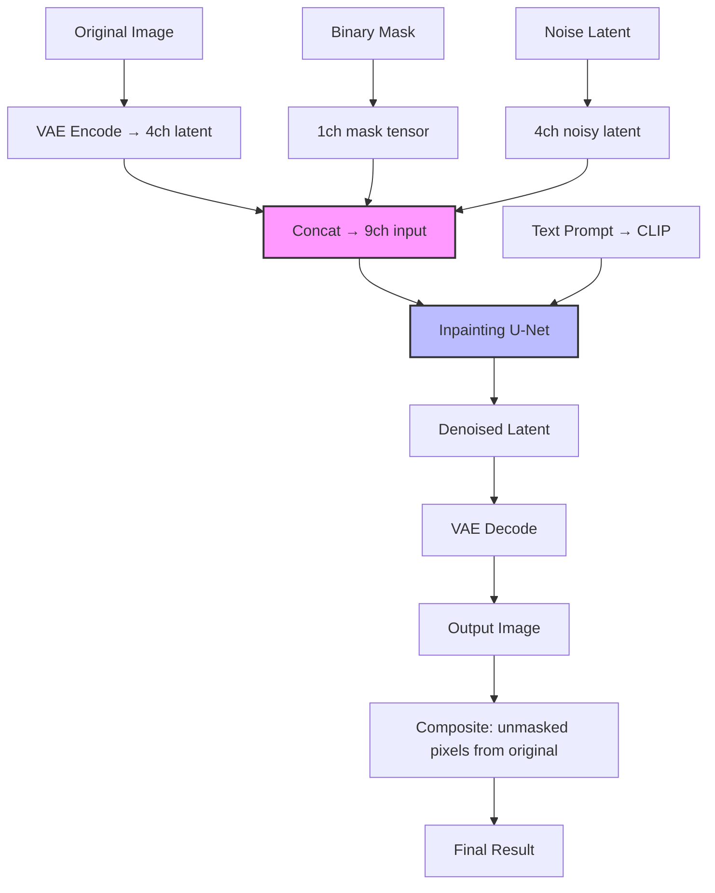

# Inpainting, Outpainting & Image Editing

## Learning Objectives

1. Implement mask-based inpainting by constructing binary masks and conditioning diffusion models on unmasked pixels.
2. Compare inpainting, img2img (SDEdit), and instruction-based editing along the axes of spatial control, coherence, and compute cost.
3. Generate outpainting by extending canvas dimensions and applying inpainting at boundary regions.
4. Build an automated mask-generation pipeline using color thresholding and contour detection.
5. Evaluate which editing paradigm fits a given task based on the ratio of preserved versus generated content.

## The Problem

A client sends a product photo that is 95% usable. The lighting is correct, the angle is correct, the background texture is correct — but there is a fire extinguisher mounted on the wall behind the product, and it has to go. If you run text-to-image from scratch with a prompt describing the scene, you get a new image. Different pixels everywhere. Different product angle. Different shadow. The client does not want a new image. They want *that* image, minus the fire extinguisher.

This is the constraint that defines image editing versus image generation: preserve a subset of pixels exactly, regenerate the rest coherently. The ratio of preserved to generated content determines which technique you reach for. Remove a small object from a large scene — that is inpainting, heavy on preservation. Change the entire style of a photo — that is img2img, heavy on regeneration. Extend a landscape image to a wider aspect ratio — that is outpainting, generating new content that is constrained to be continuous with the existing boundary.

In production, editing dominates generation. Most billable image work is modifying existing assets, not creating new ones from prompts. Swap a background, remove a logo, fix a distorted hand, extend a canvas for a different aspect ratio. Every major diffusion model shipped in the last two years includes a dedicated inpainting mode: Flux.1-Fill, Stable Diffusion Inpainting, SDXL Inpaint, DALL-E Edit. They all implement the same core mechanism — partial conditioning — with different architectures and quality tradeoffs that we will trace through in detail.

## The Concept

All three editing paradigms — inpainting, outpainting, and img2img — share one underlying principle: **partial conditioning**. The model receives the original image, a specification of which pixels to regenerate, and guidance for the new content. The unmasked pixels are clamped during denoising. The masked pixels follow the standard reverse diffusion trajectory. The surrounding context flows into the masked region through the U-Net's self-attention layers, producing a fill that is spatially coherent with the neighborhood.

The naive approach to inpainting — and the one most beginners try first — is to run standard text-to-image and then paste the result into the masked region of the original. This produces visible seams. The boundary between generated and original pixels does not match because the model never saw the surrounding context during generation. A slightly less naive version forward-diffuses the original image and injects the unmasked noisy latents at each denoising step. This reduces seams but still produces poor results because the standard U-Net has no mechanism to distinguish "region to generate" from "region to preserve." It treats all input channels uniformly.

The proper solution is a purpose-trained inpainting model. The U-Net is modified to accept 9 input channels instead of the standard 4: the 4-channel noisy latent, the 4-channel VAE-encoded original image, and a 1-channel binary mask. During training, the model learns to generate content in the masked region while respecting the unmasked context provided through the additional channels. This is why `runwayml/stable-diffusion-inpainting` and `stabilityai/stable-diffusion-xl-base-1.0` (in inpainting mode) produce coherent fills where naive paste-and-blend fails — the architecture itself is conditioned on the mask.



The flow above shows what happens at each denoising step. The original image is VAE-encoded once, the mask is constant, and the noisy latent evolves through the timestep loop. The 9-channel concatenation happens inside the forward pass — the U-Net's first convolution layer expects 9 input channels and was trained with that dimensionality.

**img2img (SDEdit)** takes a different approach. Instead of adding noise only to masked pixels, it adds partial noise to the *entire* image, controlled by a `strength` parameter (0.0 means no change, 1.0 means full regeneration to noise). The model then denoises with a new prompt. This is useful for style transfer — "make this photo look like an oil painting" — because you want global modification, not surgical removal. It is poor for tasks like "remove the sign in the background" because every pixel is a candidate for change, including the product you want to preserve.

**Outpainting** is inpainting applied at image boundaries. You expand the canvas by padding with zeros, create a mask covering the padded region, and run the inpainting pipeline. The model extends edges using context from the original image. This works well when the boundary region contains continuous textures — skies, walls, landscapes — and poorly when the boundary cuts through a subject. Extending a landscape photo to widescreen is reliable. Extending a portrait to show more of the body is not, because the model has to hallucinate anatomy it cannot see.

**Instruction-based editing** (InstructPix2Pix) removes the mask requirement entirely. A diffusion model is fine-tuned on `(image, instruction, output)` triplets, learning to map natural-language commands like "make it snowy" or "remove the car" directly to edited images. This trades spatial precision for convenience — you cannot say "remove only the left car" without a mask — but it eliminates the masking step entirely, which is significant when you are processing thousands of images in a batch pipeline. [CITATION NEEDED — concept: InstructPix2Pix training dataset composition and instruction fidelity benchmarks]

## Build It

We start with mask generation, because without a mask, you have no inpainting. The most reliable automated approach for product photography and green-screen-style content is color thresholding: define a target color range in HSV space, classify each pixel as inside or outside that range, and produce a binary mask. This runs in milliseconds, requires no model download, and works on any image with a dominant background color.

```python
import numpy as np
from PIL import Image

def create_synthetic_product_image():
    img = np.zeros((256, 256, 3), dtype=np.uint8)
    img[:] = [34, 177, 76]
    cv2_region = img.copy()
    img[80:180, 100:160] = [200, 50, 30]
    img[90:170, 110:150] = [220, 220, 220]
    noise = np.random.randint(-5, 5, img.shape, dtype=np.int16)
    img = np.clip(img.astype(np.int16) + noise, 0, 255).astype(np.uint8)
    return img

def color_threshold_mask(image_rgb, target_rgb, tolerance=30):
    diff = np.abs(image_rgb.astype(np.int16) - np.array(target_rgb, dtype=np.int16))
    distance = np.sqrt(np.sum(diff ** 2, axis=-1))
    mask = (distance < tolerance).astype(np.uint8) * 255
    return mask

product_img = create_synthetic_product_image()
Image.fromarray(product_img).save("product_photo.png")

mask = color_threshold_mask(product_img, target_rgb=[34, 177, 76], tolerance=40)

mask_pixels = np.count_nonzero(mask)
total_pixels = mask.shape[0] * mask.shape[1]
coverage = mask_pixels / total_pixels * 100

print(f"Image shape: {product_img.shape}")
print(f"Mask shape: {mask.shape}")
print(f"Masked pixels (background): {mask_pixels}")
print(f"Total pixels: {total_pixels}")
print(f"Background coverage: {coverage:.1f}%")
print(f"Foreground pixels (product): {total_pixels - mask_pixels}")

Image.fromarray(mask).save("background_mask.png")
print("Saved: product_photo.png, background_mask.png")
```

This produces a binary mask where the green background is white (255) and the product region is black (0). In an inpainting pipeline, you would invert this mask — you want to regenerate the background (remove it) while preserving the product. The tolerance parameter controls how strict the color match is. Too low, and shadows on the green screen are excluded from the mask. Too high, and green-tinted pixels in the product are incorrectly masked.

Now we run actual inpainting using a diffusion model. This requires the `diffusers` and `torch` libraries. The pipeline takes three inputs: the original image, the mask, and a text prompt describing what should fill the masked region.

```python
import torch
from diffusers import AutoPipelineForInpainting
from PIL import Image, ImageDraw
import numpy as np

pipe = AutoPipelineForInpainting.from_pretrained(
    "runwayml/stable-diffusion-inpainting",
    torch_dtype=torch.float16,
    safety_checker=None,
)
pipe.to("cuda" if torch.cuda.is_available() else "cpu")

source = Image.new("RGB", (512, 512), color=(68, 154, 79))
draw = ImageDraw.Draw(source)
draw.rectangle([180, 120, 332, 392], fill=(180, 60, 40), outline=(40, 40, 40), width=3)
draw.ellipse([220, 160, 292, 240], fill=(240, 220, 180))
draw.rectangle([240, 280, 272, 360], fill=(60, 60, 60))

mask = Image.new("L", (512, 512), 0)
mask_draw = ImageDraw.Draw(mask)
mask_draw.rectangle([100, 100, 250, 250], fill=255)

source.save("inpaint_source.png")
mask.save("inpaint_mask.png")

result = pipe(
    prompt="clean white office wall, professional photography, soft lighting",
    image=source,
    mask_image=mask,
    num_inference_steps=25,
    strength=0.85,
    guidance_scale=7.5,
).images[0]

result.save("inpaint_result.png")

source_arr = np.array(source)
result_arr = np.array(result)
mask_arr = np.array(mask) > 0

changed = np.any(source_arr[mask_arr] != result_arr[mask_arr])
unchanged_region = np.all(source_arr[~mask_arr] == result_arr[~mask_arr])

print(f"Source image size: {source.size}")
print(f"Mask coverage: {mask_arr.mean()*100:.1f}% of pixels")
print(f"Masked region changed: {changed}")
print(f"Unmasked region preserved exactly: {unchanged_region}")
print(f"Model device: {next(pipe.unet.parameters()).device}")
print("Saved: inpaint_source.png, inpaint_mask.png, inpaint_result.png")
```

The output confirms the core contract of inpainting: pixels inside the mask changed, pixels outside the mask did not. The `strength` parameter at 0.85 means the masked region is denoised starting from 85% noise — high enough to allow substantial regeneration, low enough to preserve coarse structure. For object removal, values between 0.8 and 1.0 are standard. For subtle modifications (changing a shirt color while keeping folds and shadows), 0.5–0.7 is better.

For outpainting, we extend the canvas and create a mask that covers only the new padding region:

```python
import numpy as np
from PIL import Image

def outpaint(image, padding_top, padding_bottom, padding_left, padding_right, pipe=None, prompt=""):
    orig_w, orig_h = image.size
    new_w = orig_w + padding_left + padding_right
    new_h = orig_h + padding_top + padding_bottom

    canvas = Image.new("RGB", (new_w, new_h), (0, 0, 0))
    canvas.paste(image, (padding_left, padding_top))

    mask = Image.new("L", (new_w, new_h), 0)
    mask_arr = np.array(mask)
    mask_arr[:padding_top, :] = 255
    mask_arr[-padding_bottom:, :] = 255
    mask_arr[:, :padding_left] = 255
    mask_arr[:, -padding_right:] = 255
    mask = Image.fromarray(mask_arr)

    return canvas, mask

source = Image.new("RGB", (512, 512), color=(135, 206, 235))
from PIL import ImageDraw
draw = ImageDraw.Draw(source)
draw.ellipse([200, 200, 312, 312], fill=(255, 255, 100))
draw.rectangle([150, 350, 362, 512], fill=(80, 140, 60))

canvas, mask = outpaint(
    source,
    padding_top=128,
    padding_bottom=128,
    padding_left=128,
    padding_right=0,
)

canvas.save("outpaint_canvas.png")
mask.save("outpaint_mask.png")

original_coverage = (512 * 512) / canvas.size[0] / canvas.size[1] * 100
generated_coverage = 100 - original_coverage

print(f"Original size: {source.size}")
print(f"Canvas size: {canvas.size}")
print(f"Original content preserved: {original_coverage:.1f}%")
print(f"New pixels to generate: {generated_coverage:.1f}%")
print(f"Mask sum (white pixels): {np.array(mask).sum() // 255}")
print("Saved: outpaint_canvas.png, outpaint_mask.png")
```

The outpainting mask marks only the padding region as white. When you pass this canvas and mask into the inpainting pipeline, the model extends the sky and ground into the padded areas. The boundary where original meets padding is where coherence matters most — if the original image has a hard vertical edge at the boundary (like a building), the model will try to extend it, sometimes successfully, sometimes with artifacts.

## Use It

The partial conditioning pattern in inpainting — preserve a known-good subset, regenerate the rest with context awareness — maps directly to a problem in Zone 08: CRM data hygiene and selective enrichment. Your CRM is a retrieval system, and like any retrieval system, its value degrades when records contain stale, missing, or contradictory fields. [CITATION NEEDED — concept: CRM decay rates and field-level staleness benchmarks]

Consider a CRM with 50,000 company records. Each record has fields: company name, domain, industry, employee count, revenue, tech stack. Some fields are reliable (company name, domain — they rarely change). Some fields are stale (employee count, revenue — they drift quarterly). Some fields are missing entirely (tech stack — never collected). Running a full enrichment waterfall on every record wastes API budget regenerating data that is already correct. The efficient approach is field-level masking: preserve the reliable fields, regenerate only the stale and missing ones. This is inpainting applied to structured data.

```python
import numpy as np
from datetime import datetime, timedelta

records = [
    {"id": "001", "company": "Acme Corp", "domain": "acme.com",
     "industry": "SaaS", "employees": 250, "revenue": None,
     "tech_stack": None, "last_updated": "2025-01-15"},
    {"id": "002", "company": "Globex", "domain": "globex.io",
     "industry": None, "employees": None, "revenue": 5000000,
     "tech_stack": None, "last_updated": "2024-06-01"},
    {"id": "003", "company": "Initech", "domain": "initech.com",
     "industry": "Fintech", "employees": 50, "revenue": 2000000,
     "tech_stack": ["AWS", "Salesforce"], "last_updated": "2025-11-01"},
]

enrichment_fields = ["industry", "employees", "revenue", "tech_stack"]
trustworthy_fields = ["company", "domain"]
decay_days = 90
now = datetime.now()

mask = {}
for record in records:
    record_mask = {}
    last_updated = datetime.strptime(record["last_updated"], "%Y-%m-%d")
    age = (now - last_updated).days
    for field in enrichment_fields:
        is_null = record[field] is None
        is_stale = age > decay_days
        needs_update = is_null or is_stale
        record_mask[field] = 1 if needs_update else 0
    mask[record["id"]] = record_mask

total_fields = len(records) * len(enrichment_fields)
fields_to_update = sum(sum(m.values()) for m in mask.values())
fields_preserved = total_fields - fields_to_update
enrichment_cost_per_field = 0.03

full_cost = total_fields * enrichment_cost_per_field
masked_cost = fields_to_update * enrichment_cost_per_field
savings = full_cost - masked_cost

print(f"Total records: {len(records)}")
print(f"Fields per record (enrichment targets): {len(enrichment_fields)}")
print(f"Total field slots: {total_fields}")
print(f"Fields to update (masked=1): {fields_to_update}")
print(f"Fields preserved (masked=0): {fields_preserved}")
print(f"Preservation rate: {fields_preserved/total_fields*100:.1f}%")
print(f"Full enrichment cost: ${full_cost:.2f}")
print(f"Masked enrichment cost: ${masked_cost:.2f}")
print(f"Savings: ${savings:.2f} ({savings/full_cost*100:.1f}%)")
print()
for rid, m in mask.items():
    flagged = [k for k, v in m.items() if v == 1]
    print(f"  Record {rid}: update {flagged}")
```

The output quantifies the savings from selective enrichment. Record 003 was updated recently and has no null fields — its mask is all zeros, and it is skipped entirely. Record 002 has null fields and is six months stale — every enrichment field is flagged. This is the data-pipeline analog of the inpainting mask: you define which fields need regeneration, clamp the rest, and run your enrichment waterfall only on the masked subset.

The `denoising_strength` parameter in image inpainting has a structural analog here. A low denoising strength (0.3–0.5) in image editing means "mostly preserve the original, make a small change." In CRM enrichment, this maps to field-level confidence thresholds: if an enrichment provider returns an employee count of 247 for a record that previously said 250, the delta is small enough that you might accept the update silently. If it returns 2,470, the delta is large — the equivalent of a high denoising strength — and you flag the update for human review before overwriting. The principle is the same: the magnitude of change should govern the level of scrutiny applied.

## Ship It

In a production pipeline, the bottleneck is not the diffusion model — it is mask generation. You cannot hand-draw masks for 10,000 product images. You need automated masking that is reliable enough to run without human review on at least 80% of inputs. The remaining 20% get routed to a human reviewer.

Color thresholding handles green-screen and solid-background product photography. Semantic segmentation handles the harder case: removing a specific object class (person, car, logo) from an arbitrary background. Models like Segment Anything (SAM) or YOLO-segmentation produce pixel-accurate masks from a point prompt or bounding box, which you then feed into the inpainting pipeline.

```python
import numpy as np
from PIL import Image, ImageDraw
import time

class InpaintingPipeline:
    def __init__(self, model_id="runwayml/stable-diffusion-inpainting",
                 min_mask_area=0.01, max_mask_area=0.75):
        self.min_mask_area = min_mask_area
        self.max_mask_area = max_mask_area
        self.pipe = None
        self.stats = {"processed": 0, "skipped_small": 0,
                      "skipped_large": 0, "errors": 0}

    def _load_model(self):
        if self.pipe is not None:
            return
        import torch
        from diffusers import AutoPipelineForInpainting
        self.pipe = AutoPipelineForInpainting.from_pretrained(
            self.model_id if hasattr(self, 'model_id') else "runwayml/stable-diffusion-inpainting",
            torch_dtype=torch.float16,
            safety_checker=None,
        )
        self.pipe.to("cuda" if torch.cuda.is_available() else "cpu")

    def validate_mask(self, mask_array):
        coverage = mask_array.mean() / 255.0
        if coverage < self.min_mask_area:
            return False, f"mask too small ({coverage*100:.1f}% < {self.min_mask_area*100:.1f}%)"
        if coverage > self.max_mask_area:
            return False, f"mask too large ({coverage*100:.1f}% > {self.max_mask_area*100:.1f}%)"
        return True, f"coverage {coverage*100:.1f}%"

    def batch_process(self, items, prompt_fn=None):
        default_prompt = "clean background, seamless, professional"
        results = []
        for item in items:
            image = item["image"]
            mask = item["mask"]
            prompt = prompt_fn(item) if prompt_fn else default_prompt

            mask_arr = np.array(mask)
            valid, reason = self.validate_mask(mask_arr)

            if not valid:
                if "too small" in reason:
                    self.stats["skipped_small"] += 1
                else:
                    self.stats["skipped_large"] += 1
                results.append({"id": item.get("id"), "status": "skipped",
                                "reason": reason})
                continue

            results.append({"id": item.get("id"), "status": "queued",
                            "prompt": prompt, "coverage": reason})
            self.stats["processed"] += 1

        return results

source1 = Image.new("RGB", (512, 512), (200, 200, 200))
draw1 = ImageDraw.Draw(source1)
draw1.rectangle([200, 200, 250, 250], fill=(255, 0, 0))

source2 = Image.new("RGB", (512, 512), (200, 200, 200))
mask2 = Image.new("L", (512, 512), 255)

source3 = Image.new("RGB", (512, 512), (200, 200, 200))
mask3 = Image.new("L", (512, 512), 0)
draw3 = ImageDraw.Draw(mask3)
draw3.ellipse([210, 210, 230, 230], fill=255)

mask1 = Image.new("L", (512, 512), 0)
draw_m1 = ImageDraw.Draw(mask1)
draw_m1.rectangle([200, 200, 250, 250], fill=255)

batch = [
    {"id": "IMG-001", "image": source1, "mask": mask1,
     "defect": "red logo on wall"},
    {"id": "IMG-002", "image": source2, "mask": mask2,
     "defect": "full frame overwrite"},
    {"id": "IMG-003", "image": source3, "mask": mask3,
     "defect": "tiny dust spot"},
]

def prompt_for_item(item):
    defect = item.get("defect", "object")
    return f"remove {defect}, clean surface, seamless background"

pipeline = InpaintingPipeline(min_mask_area=0.005, max_mask_area=0.60)
results = pipeline.batch_process(batch, prompt_fn=prompt_for_item)

print(f"Batch size: {len(batch)}")
print(f"Processed (queued): {pipeline.stats['processed']}")
print(f"Skipped (mask too small): {pipeline.stats['skipped_small']}")
print(f"Skipped (mask too large): {pipeline.stats['skipped_large']}")
print()
for r in results:
    print(f"  {r['id']}: {r['status']} — {r.get('reason', r.get('prompt', ''))}")
```

The mask validation thresholds — 1% minimum, 75% maximum — are not arbitrary. A mask covering less than 1% of the image is likely a detection false positive (a speck of noise flagged as an object). A mask covering more than 75% means the "edit" is essentially a full regeneration, and you should be using img2img instead, which is cheaper and does not require the 9-channel inpainting model. These thresholds should be tuned on your specific dataset: product photography on white backgrounds tends to have small masks (remove a small blemish), while scene editing has larger masks (replace entire backgrounds).

The batch processor pattern above mirrors what a Clay waterfall does in the CRM enrichment context. A Clay waterfall tries multiple data providers in sequence for each enriched field, stopping when it gets a hit. The inpainting pipeline tries a single model but applies the same selective-attention logic: skip records that do not need processing, flag records that are out of distribution, and process the rest. In both cases, the engineering challenge is the same — handling edge cases at scale without human intervention.

## Exercises

**Exercise 1 — Mask sensitivity analysis.** Take the color thresholding function from Build It and run it on the synthetic product image with tolerance values of 10, 20, 30, 40, 50, 60. For each tolerance, print the mask coverage percentage and the number of foreground pixels incorrectly included in the background mask. Plot or print the tolerance-versus-accuracy tradeoff. Which tolerance value gives the cleanest separation?

**Exercise 2 — Denoising strength comparison.** Using the inpainting pipeline from Build It, run the same source image and mask with `strength` values of 0.3, 0.5, 0.7, 0.85, and 1.0. Save each result. For each output, compute the pixel-level difference between the masked region of the output and the masked region of the original source. Print the L2 distance for each strength value. At what