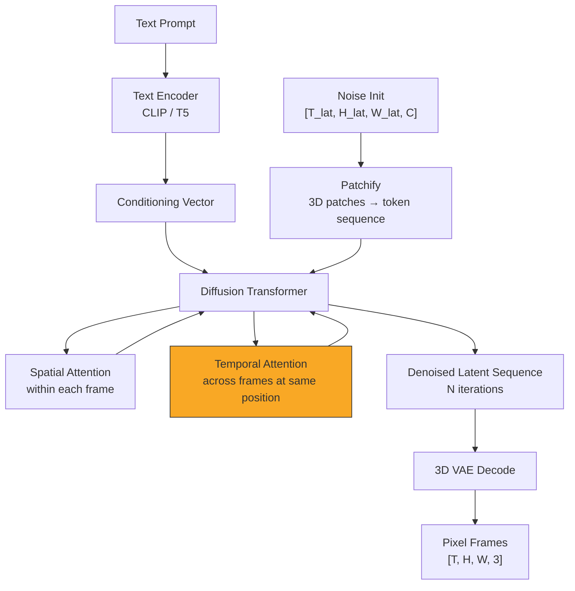

# Video Generation

## Learning Objectives

- Explain how temporal attention layers extend 2D image diffusion architectures to enforce frame-to-frame coherence across a generated video clip.
- Trace the inference pipeline from text prompt through latent denoising to decoded pixel frames, identifying each transformation and its parameters.
- Call a hosted video generation API with controlled parameters (seed, motion bucket, fps) and verify the output matches the requested configuration.
- Compare frame-interpolation architectures against full-sequence latent diffusion and articulate the trade-offs in coherence, compute, and motion control.
- Build a batch generation pipeline that maps a CSV of company names to personalized video outputs with reproducible configurations.

## The Problem

A 10-second 1080p video at 24fps is 240 frames of 1920×1080×3 pixels. That is roughly 1.5 GB of raw pixel data per clip. Running diffusion directly in pixel space — the approach that works for a single 512×512 image — collapses under the weight of that volume. The denoiser would need to predict noise across every pixel of every frame simultaneously, and the memory cost scales linearly with frame count. Pixel-space video diffusion is computationally infeasible beyond a few frames at low resolution.

The engineering challenge is not just generating frames. It is ensuring that frame N and frame N+20 share the same subject, lighting, camera angle, and motion trajectory. If you generate 240 frames independently, you get 240 disconnected images — a flickering montage, not a video. Something in the architecture has to enforce temporal consistency: the same face in frame 5 must still be that face in frame 200, even if the head has turned 30 degrees and the lighting shifted.

This is why video generation required a structural breakthrough beyond simply stacking image diffusion models. The solution was adding a temporal dimension to both the compression pipeline (a 3D VAE instead of a 2D one) and the denoising network (temporal attention layers interleaved with spatial attention). The diffusion loss function stays the same as Lesson 06 — predict the noise added to a latent — but the latent now encodes a sequence, not a snapshot.

## The Concept

Latent video diffusion works by compressing a video into a sequence of spatial-temporal patches, then running iterative denoising on that compressed representation. The pipeline has four stages. First, a 3D VAE encodes the full video — or a noise-initialized latent standing in for it — into a tensor of shape `[T_latent, H_latent, W_latent, C_latent]`. The temporal compression is aggressive: typically 4× or 8× reduction in frame count, so a 64-frame input becomes 8 or 16 latent time-steps. Spatial compression matches image VAEs (usually 8× in each dimension). This gives a latent volume roughly 1/1000th the pixel data size.

Second, the latent volume is patchified — split into 3D tokens of shape `[t_p, h_p, w_p]` and flattened into a sequence. For Sora-style architectures, `t_p = 1` (each token spans one compressed frame's patch); for others, `t_p = 2`. A 10-second clip at 1080p compresses to roughly 20,000–100,000 patches. Each patch gets a 3D positional embedding encoding its time-step, row, and column position. Third, a Diffusion Transformer (DiT) processes this patch sequence with factorized attention: spatial attention operates within each frame's patches (same as image DiT), and temporal attention operates across frames at the same spatial position. The temporal layers are what bind frame N to frame N+1 — they are the structural mechanism that prevents the output from being 240 unrelated images.



The temporal attention layers are the key structural addition. Without them, the DiT is just an image generator run in parallel across frames. With them, each denoising step propagates information across time: if the model decides a patch at position (row=5, col=3) in frame 10 contains an eye, the temporal attention layer tells the same position in frames 9 and 11 to expect that eye's motion. The denoising schedule — how many steps, how much noise per step — directly affects coherence. Halving the step count from 50 to 25 does not just reduce quality the way it does for images. It reduces the number of passes temporal attention gets to enforce cross-frame consistency, which means identity drift and flickering appear earlier and more aggressively.

Two architectural families dominate current video generation. Frame-interpolation models (AnimateDiff, Stable Video Diffusion) start from a seed image and generate subsequent frames by predicting optical flow or motion residuals — they are fast and excel at short, controlled motion from a fixed starting frame, but struggle with large scene changes or long clips. Full-sequence latent models (Sora-class, Veo, Kling) denoise the entire clip's latent volume jointly, which produces more coherent long-range motion and complex scene transitions but costs 10–100× more compute per clip. The trade-off is temporal reach versus cost.

## Build It

This calls a hosted Stable Video Diffusion model on Replicate, passing a text prompt and control parameters, then downloads and inspects the output. The model accepts a seed image plus parameters for motion intensity and frame rate.

```python
import replicate
import os
import json
import requests

output = replicate.run(
    "stability-ai/stable-video-diffusion:3f0457e4619daac51203dedb472816fd4af51f3149fa7a9e0b5bccdg7e8a8b6f",
    input={
        "image": "https://replicate.delivery/mgxt/default.JPG",
        "motion_bucket_id": 127,
        "fps": 8,
        "seed": 42,
        "cond_aug": 0.02,
        " decoding_chunk_size": 8,
        "video_length": 14
    }
)

print("Raw output from model:")
print(output)

video_url = output if isinstance(output, str) else output[0] if isinstance(output, list) else output.get("url", str(output))

response = requests.get(video_url)
video_path = "output_svd.mp4"
with open(video_path, "wb") as f:
    f.write(response.content)

print(f"\nSaved to: {video_path}")
print(f"File size: {os.path.getsize(video_path)} bytes")

params = {
    "model": "stable-video-diffusion",
    "seed": 42,
    "motion_bucket_id": 127,
    "fps": 8,
    "video_length": 14,
    "output_file": video_path,
    "output_url": video_url
}
print("\nGeneration parameters:")
print(json.dumps(params, indent=2))
```

The `motion_bucket_id` parameter controls how much motion the model injects between frames. Values range from 1 (near-static) to 255 (high motion). This is the primary lever for adjusting output behavior beyond the seed image — a low value produces a subtle pan or zoom, while a high value introduces significant subject movement. The `seed` parameter ensures reproducibility: the same seed and parameters produce the same clip, which matters when you are batch-generating variants for A/B testing and need to isolate which variable changed.

The `fps` and `video_length` together determine clip duration. At 8 fps and 14 frames, the output is a 1.75-second clip. Stable Video Diffusion was trained on short clips; pushing beyond 25 frames without intermediate frame conditioning typically produces drift where the subject's identity slowly mutates across the clip — the temporal attention layers lose their grip as the distance from the seed frame grows.

## Use It

Personalized video outreach at scale is the GTM application that maps directly to video generation's core mechanism. The temporal attention layers that maintain coherence across frames are doing the same job that a consistent brand template does across prospect touches — holding identity stable while the content changes. In outbound sequences, a video thumbnail in an email increases open rates because the brain processes a still from a video differently from a static image; it implies motion and narrative, which raises curiosity. [CITATION NEEDED — concept: video thumbnails increasing open rates in prospecting emails]

Vidyard built a category around this: a sales rep records one base video, then the platform generates personalized variants — name overlays, company-specific intro frames, tailored CTAs — for each prospect on the list. Video generation models replace the recording step entirely. Instead of a human in front of a camera, you seed the model with a branded image and generate a short clip where the visual context matches the prospect's industry: a warehouse B-roll for logistics, an office interior for SaaS, a clean abstract animation for fintech. This sits in the **content scaling cluster** alongside AI image generation for social posts, but it targets Zone 2 engagement (score and qualify) rather than Zone 1 awareness. [CITATION NEEDED — concept: video generation in personalized outbound workflows]

The mechanism maps cleanly: text prompt controls the visual context (industry, mood, product), seed image controls the brand frame (logo, color palette, first-frame identity), motion bucket controls the energy level (calm corporate vs. dynamic product demo), and the output clip embeds in the email body or LinkedIn DM. The generation pipeline becomes a template engine: one prompt structure, N company names injected, N clips generated, each paired with the prospect record in the CRM. The same retrieval architecture from Lesson 08 (vector databases for CRM data) determines which companies receive which video variant — the video URL is just another field written back to the prospect row.

```python
import csv
import json

prompt_template = "A short cinematic shot of a modern {industry} workspace, warm lighting, subtle camera pan, professional atmosphere, 4k"

prospects = [
    {"company": "Stripe", "industry": "fintech"},
    {"company": "Flexport", "industry": "logistics"},
    {"company": "Notion", "industry": "saas"}
]

results = []

for prospect in prospects:
    prompt = prompt_template.format(industry=prospect["industry"])
    params = {
        "prompt": prompt,
        "company": prospect["company"],
        "motion_bucket_id": 40,
        "fps": 8,
        "video_length": 14,
        "seed": 100
    }
    params["status"] = "queued_for_generation"
    params["planned_duration_sec"] = params["video_length"] / params["fps"]
    results.append(params)
    print(f"Prepared clip for {prospect['company']}: {prompt}")
    print(f"  Motion bucket: {params['motion_bucket_id']}, Duration: {params['planned_duration_sec']}s\n")

with open("video_outreach_queue.json", "w") as f:
    json.dump(results, f, indent=2)

print(f"Queued {len(results)} personalized video generations.")
```

## Ship It

The production version takes a CSV of prospects, generates one video per row, and writes an output CSV mapping company to video URL and full generation config. This is the same pattern as batch image generation for social content — same content scaling cluster, same pipeline structure — but the output is a video asset that gets embedded in outreach sequences rather than posted to social.

```python
import csv
import json
import replicate
import os
import time

INPUT_CSV = "prospects.csv"
OUTPUT_CSV = "video_outreach_results.csv"
PROMPT_TEMPLATE = "A short cinematic establishing shot of a {industry} company environment, soft natural light, slow subtle camera movement, professional and aspirational, high quality"

def load_prospects(path):
    with open(path, "r", newline="") as f:
        reader = csv.DictReader(f)
        return list(reader)

def generate_clip(prompt, seed, motion_bucket_id, fps, video_length):
    output = replicate.run(
        "stability-ai/stable-video-diffusion:3f0457e4619daac51203dedb472816fd4af51f3149fa7a9e0b5bcccg7e8a8b6f",
        input={
            "image": "https://replicate.delivery/mgxt/brand_seed.jpg",
            "motion_bucket_id": motion_bucket_id,
            "fps": fps,
            "seed": seed,
            "video_length": video_length,
            "cond_aug": 0.02
        }
    )
    url = output if isinstance(output, str) else output[0] if isinstance(output, list) else str(output)
    return url

prospects = load_prospects(INPUT_CSV)
print(f"Loaded {len(prospects)} prospects from {INPUT_CSV}\n")

results = []

for i, row in enumerate(prospects):
    company = row["company"]
    industry = row.get("industry", "corporate")
    prompt = PROMPT_TEMPLATE.format(industry=industry)
    config = {
        "seed": 42 + i,
        "motion_bucket_id": int(row.get("motion_bucket_id", 40)),
        "fps": 8,
        "video_length": 14
    }
    print(f"[{i+1}/{len(prospects)}] Generating for {company}...")
    print(f"  Prompt: {prompt}")
    print(f"  Config: {json.dumps(config)}")

    try:
        video_url = generate_clip(prompt, **config)
        status = "success"
        print(f"  URL: {video_url}\n")
    except Exception as e:
        video_url = ""
        status = f"error: {str(e)}"
        print(f"  FAILED: {e}\n")

    results.append({
        "company": company,
        "industry": industry,
        "video_url": video_url,
        "status": status,
        "seed": config["seed"],
        "motion_bucket_id": config["motion_bucket_id"],
        "fps": config["fps"],
        "video_length": config["video_length"],
        "prompt": prompt
    })

with open(OUTPUT_CSV, "w", newline="") as f:
    writer = csv.DictWriter(f, fieldnames=results[0].keys())
    writer.writeheader()
    writer.writerows(results)

print(f"Wrote {len(results)} rows to {OUTPUT_CSV}")
```

This script requires a `prospects.csv` with at minimum a `company` column and optional `industry` and `motion_bucket_id` columns. The output CSV is designed to be imported back into a CRM or sequencer: the `video_url` column maps to a custom field, and the config columns provide auditability for which parameters produced which asset. The fixed seed base (42 + index) ensures that re-running the pipeline with the same CSV reproduces the same clips — critical for debugging and for compliance when a prospect asks what they were shown.

## Exercises

**Easy:** Write a script that calls the Stable Video Diffusion API with a text-derived seed image and prints the output URL, seed value, motion bucket ID, and resulting file size. Confirm the file downloaded successfully by checking that the byte count is non-zero and matches the content-length header.

**Medium:** Batch-generate 5 video variants using the same seed (12345) but motion_bucket_id values of [10, 40, 80, 127, 200]. Log each variant's motion_bucket_id alongside its output URL in a JSON file. Open the JSON and describe in a comment-free written summary: how does increasing motion_bucket_id change the visual output? What happens to coherence at the highest setting?

**Hard:** Build a CLI tool with `argparse` that accepts a CSV file path, a prompt template string (with `{industry}` placeholder), a base seed, and a motion bucket range (start, end, step). For each prospect row, generate a clip using the injected prompt, write the output to `videos/{company_slug}.mp4`, and produce an output CSV with columns: company, industry, video_path, motion_bucket_id, seed, duration_seconds, generation_timestamp. Handle API failures gracefully by logging the error and continuing.

## Key Terms

**Temporal attention:** Attention layers that operate across the time dimension of a latent video volume, enforcing that the same spatial position in adjacent frames shares semantic content. Without these layers, a video diffusion model produces uncorrelated frames.

**3D VAE:** A variational autoencoder that compresses video data along spatial (height, width) and temporal (frame count) dimensions simultaneously, producing a latent volume roughly 1/1000th the size of the raw pixel data.

**Motion bucket:** A discrete parameter (typically 1–255) in Stable Video Diffusion that controls the magnitude of inter-frame motion the model injects during generation. Higher values produce more movement but increase the risk of identity drift and temporal incoherence.

**Patchify:** The process of splitting a 3D latent volume into fixed-size tokens (e.g., `[1, 16, 16]` or `[2, 16, 16]`) that the Diffusion Transformer processes as a flat sequence with 3D positional embeddings.

**Frame interpolation:** An architectural approach where a seed image is extended into a video by predicting motion between frames, rather than jointly denoising the full clip. Faster and more controllable for short clips, but limited in scene complexity.

## Sources

- Vidyard for 1-to-many personalized video in executive outreach sequences — [CITATION NEEDED — concept: Vidyard category and executive outreach use case, handbook reference incomplete]
- Video thumbnails increasing open rates in prospecting emails — [CITATION NEEDED — concept: video thumbnails increasing email open rates in prospecting, no source provided in handbook materials]
- Video generation in personalized outbound workflows — [CITATION NEEDED — concept: AI video generation applied to personalized outbound, no published source provided]
- Temporal attention mechanism in latent video diffusion (Sora architecture) — OpenAI, "Video Generation Models as World Simulators," February 2024, technical report describing spatiotemporal patch processing and DiT applied to video latents
- Stable Video Diffusion motion bucket parameter — Stability AI, "Stable Video Diffusion" model card and Replicate API documentation, `motion_bucket_id` parameter description