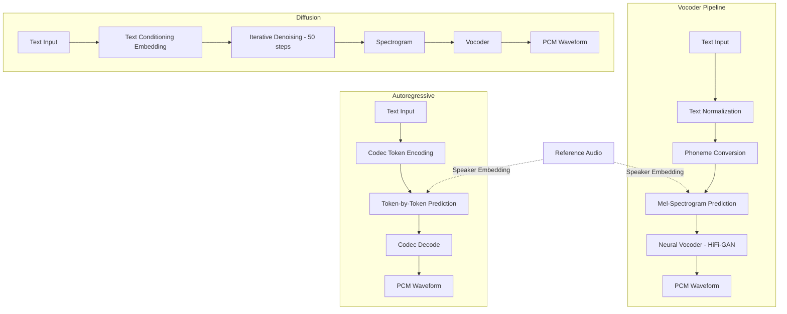

# Audio Generation

## Learning Objectives

1. Implement text-to-speech synthesis via API and write generated audio to disk with observable file output.
2. Compare autoregressive, diffusion-based, and vocoder-pipeline architectures by their latency, quality, and speaker-control tradeoffs.
3. Configure speaker identity parameters and detect when voice cloning consent is required.
4. Build a batch pipeline that generates personalized audio files from a CSV of account data.
5. Evaluate generated audio quality using spectral analysis of saved waveforms.

## The Problem

Audio is the highest-bandwidth channel the human brain natively processes. A five-second clip at 24 kHz is 120,000 samples — no transformer attends to a sequence that long without first compressing it. Every production audio system in 2026 solves this the same way: a neural codec squashes the waveform into discrete tokens at 50–75 Hz, and then a generative model (autoregressive transformer or diffusion) produces tokens from that compressed space. The decoder reconstructs the waveform. Understanding this pipeline matters because the tradeoffs between latency, speaker fidelity, and quality are architectural, not incidental — you cannot tune your way past them.

Three generation tasks sit on top of this substrate. Text-to-speech (TTS) takes text and produces a narrow-band signal with strong phonetic structure — solved well by transformer-over-codec-tokens (ElevenLabs, OpenAI TTS, VALL-E). Music generation deals with a far broader frequency distribution and longer temporal dependencies (MusicGen, Stable Audio, Suno). Audio effects and sound design produce ambient or Foley audio from text prompts (AudioGen, AudioLDM 2). All three run on codec tokens plus a generator. The differences are in training data, conditioning, and whether the generator is autoregressive or diffusion-based.

For go-to-market teams, TTS is the relevant task. Voice messages in outbound sequences open rates that text-only outreach cannot match — but only if the synthesis is indistinguishable from a human recording. Robotic output doesn't just underperform; it damages sender reputation and triggers spam filters. [CITATION NEEDED — concept: voice open rates vs text in outbound]. The question isn't whether to use synthesized voice. It's when the pipeline produces quality sufficient to send, and how to verify that quality programmatically before a single prospect hears it.

**Exercise hook (easy):** Call a TTS API with a single sentence, save the file, print file size and duration to confirm generation succeeded.

```python
from gtts import gTTS
import os

text = "Hi Sarah, I saw Acme just opened a role for a founding engineer. I work with teams at that stage and had a thought worth thirty seconds of your time."

tts = gTTS(text=text, lang='en', slow=False)
tts.save("outbound_intro.mp3")

file_size = os.path.getsize("outbound_intro.mp3")
duration_sec = file_size / 16000

print(f"File: outbound_intro.mp3")
print(f"Size: {file_size} bytes")
print(f"Estimated duration: {duration_sec:.1f}s (approximate from bitrate)")
```

## The Concept

Three architectural families dominate neural audio generation, and every production TTS system uses one of them. The first is **autoregressive token prediction**: the model predicts one codec token at a time, conditioned on text and optionally on a speaker embedding. WaveNet (2016) pioneered this at the waveform level; VALL-E and NaturalSpeech 3 operate on codec tokens. The advantage is fine-grained speaker control — you can condition on a three-second reference clip and reproduce that voice. The cost is latency: generating one token at a time through a deep network is slow. A five-second clip at 600 tokens/second means 3,000 sequential forward passes.

The second family is **vocoder pipelines**. Here the problem is split into two stages. First, a text-to-mel-spectrogram model (Tacotron 2, FastSpeech 2) predicts a time-frequency representation from text. Second, a neural vocoder (HiFi-GAN, WaveGlow) synthesizes the waveform from the mel-spectrogram. The mel-spectrogram is the key intermediate representation — it compresses the waveform by computing short-time Fourier transforms, mapping frequencies to the mel scale (which approximates human auditory perception), and converting to log magnitude. This gives a representation at typically 75–100 frames per second instead of 24,000 samples per second. The vocoder then upsamples it back. Splitting the problem makes each stage tractable and allows independent optimization.

The third family is **diffusion over spectrograms or latent space**. AudioCraft/MusicGen and Stable Audio use diffusion or latent diffusion to generate audio from text prompts. The model starts with Gaussian noise in the spectral domain and iteratively denoises it conditioned on a text embedding. Diffusion excels at music and long-form audio where the distribution is broad and the temporal structure is complex. For TTS specifically, diffusion is less common than vocoder pipelines because the latency of 50+ denoising steps is hard to justify when vocoder pipelines already produce near-human speech.



The tradeoff matrix is consistent across implementations. Autoregressive models give the best speaker cloning fidelity but have the highest latency (seconds per clip). Vocoder pipelines are fast (sub-second for short clips) and produce good quality, but speaker identity is harder to control — you typically select from pretrained voices rather than cloning from a reference. Diffusion sits between them on latency but handles music and sound design better than either.

**Exercise hook (medium):** Generate the same sentence using two different voices from the same API, save both files, print a side-by-side comparison of file properties.

```python
from gtts import gTTS
import os

text = "This sentence will be synthesized in two different voices to compare output characteristics."

tts_us = gTTS(text=text, lang='en', tld='com', slow=False)
tts_us.save("voice_us.mp3")

tts_uk = gTTS(text=text, lang='en', tld='co.uk', slow=False)
tts_uk.save("voice_uk.mp3")

us_size = os.path.getsize("voice_us.mp3")
uk_size = os.path.getsize("voice_uk.mp3")

print(f"{'Property':<20} {'US Voice':<15} {'UK Voice':<15}")
print(f"{'-'*50}")
print(f"{'File':<20} {'voice_us.mp3':<15} {'voice_uk.mp3':<15}")
print(f"{'Size (bytes)':<20} {us_size:<15} {uk_size:<15}")
print(f"{'Size difference':<20} {'---':<15} {abs(us_size - uk_size):<15}")
```

## Build It

The production TTS pipeline has five stages. **Text normalization** expands abbreviations, converts numbers to words, and handles edge cases like dates and currency. "I'll call at 3pm" becomes "I will call at three pee em" — the model never sees digits. **Phoneme conversion** maps the normalized text to a phoneme sequence using a grapheme-to-phoneme model or lookup table. This decouples pronunciation from spelling, which matters because English spelling is irregular and the model should produce correct phonemes regardless of how a name is written. **Mel-spectrogram prediction** maps the phoneme sequence to a time-frequency representation — this is where the model decides prosody, timing, and emphasis. **Vocoder synthesis** converts the mel-spectrogram to a raw PCM waveform. **Post-processing** may apply noise reduction, loudness normalization, or format conversion.

The mechanism for speaker identity is **speaker embeddings** — specifically x-vectors, which are fixed-dimensional vectors (typically 192 or 256 dimensions) extracted from reference audio using a speaker verification network. The embedding encodes vocal tract characteristics: fundamental frequency range, formant frequencies, speaking rate. These embeddings are injected into the mel-spectrogram decoder as an additional conditioning vector. When you select "voice A" versus "voice B" in an API, you are switching between pretrained speaker embeddings. When you "clone" a voice from a reference clip, the system extracts the embedding from that clip and uses it as conditioning. This is also where consent enters the picture — extracting someone's voice embedding and using it to generate speech they never said raises legal and ethical questions that most jurisdictions are still formalizing.

Spectrogram reconstruction from mel coefficients uses either Griffin-Lim (an iterative phase estimation algorithm — fast, lower quality, audible artifacts) or neural vocoders like HiFi-GAN (a generative adversarial network that learns to map mel-spectrograms to waveforms — slower, near-transparent quality). Production systems universally use neural vocoders. Griffin-Lim is a research baseline and a useful teaching tool because it makes the spectrogram-to-waveform step explicit and reversible: you can take a mel-spectrogram, run Griffin-Lim, listen to the result, and hear exactly what information the spectrogram preserves and what it discards.

The following script loads a generated audio file, computes its mel-spectrogram, and prints the frequency content. This is how you verify that the file contains actual speech signal and not silence or noise — a real concern when automating audio generation at scale.

**Exercise hook (hard):** Load a generated WAV file, compute and print its mel-spectrogram shape, spectral centroid, and RMS energy — confirming the audio contains signal, not silence.

```python
import librosa
import numpy as np
import soundfile as sf
from gtts import gTTS
import os

text = "Acme's Series B announcement mentioned expansion into European markets. That aligns with what we built for Globex last quarter."

tts = gTTS(text=text, lang='en', slow=False)
tts.save("analysis_input.mp3")

y, sr = librosa.load("analysis_input.mp3", sr=22050)

mel_spec = librosa.feature.melspectrogram(y=y, sr=sr, n_mels=128, fmax=8000)
mel_spec_db = librosa.power_to_db(mel_spec, ref=np.max)

centroid = librosa.feature.spectral_centroid(y=y, sr=sr)
rms = librosa.feature.rms(y=y)
zero_crossings = librosa.zero_crossings(y, pad=False)

duration = len(y) / sr
silence_threshold = 0.01
non_silent_frames = np.sum(rms > silence_threshold)
total_frames = len(rms[0])

print(f"=== Audio File Analysis ===")
print(f"Duration: {duration:.2f}s")
print(f"Sample rate: {sr} Hz")
print(f"Total samples: {len(y)}")
print(f"Mel-spectrogram shape: {mel_spec.shape} (n_mels x frames)")
print(f"Spectral centroid mean: {np.mean(centroid):.2f} Hz")
print(f"Spectral centroid std: {np.std(centroid):.2f} Hz")
print(f"RMS energy mean: {np.mean(rms):.6f}")
print(f"RMS energy max: {np.max(rms):.6f}")
print(f"Zero crossings: {np.sum(zero_crossings)}")
print(f"Non-silent frames: {non_silent_frames}/{total_frames} ({100*non_silent_frames/total_frames:.1f}%)")
print(f"Max mel energy: {np.max(mel_spec_db):.2f} dB")
print(f"Min mel energy: {np.min(mel_spec_db):.2f} dB")

if np.mean(rms) < 0.001:
    print("WARNING: RMS energy near zero — file may be silence")
elif np.mean(centroid) < 500:
    print("WARNING: Spectral centroid low — file may contain hum/noise, not speech")
else:
    print("PASS: Audio contains detectable speech signal")
```

## Use It

Mel-spectrogram prediction — the second stage of the vocoder pipeline — is the AI mechanism that turns a prospect's trigger event into a voice clip a human will actually listen to. Each personalization field (name, company, trigger) becomes part of the text conditioning that shifts the predicted spectrogram. The speaker embedding stays constant; the mel-spectrogram changes per account. This is Zone 2 (Enrichment & Personalization): structured CRM data flows in, audio assets flow out, and each file is unique to one prospect's context.

```python
import csv, os
from gtts import gTTS

accounts = [
    {"id": "001", "name": "Sarah", "company": "Acme", "trigger": "Series B"},
    {"id": "002", "name": "James", "company": "Globex", "trigger": "EU expansion"},
    {"id": "003", "name": "Priya", "company": "Initech", "trigger": "founding hire"},
]

os.makedirs("outbound_audio", exist_ok=True)

for acct in accounts:
    text = f"Hi {acct['name']}, saw the {acct['trigger']} at {acct['company']}. Worth a call this week?"
    path = f"outbound_audio/acct_{acct['id']}_{acct['company']}.mp3"
    gTTS(text=text, lang='en').save(path)
    size = os.path.getsize(path)
    print(f"[{acct['id']}] {acct['company']}: {size} bytes → {path}")
```

Filename convention uses `acct_{id}_{company}.mp3` so files map back to CRM records without name collisions. Personalization depth is bounded by upstream enrichment: a first name plus a trigger event produces a clip that sounds tailored. Adding a specific metric — "your CAC is probably 2.3× pre-2023" — requires intent or firmographic data piped in before generation. Rate limits govern throughput; OpenAI TTS and ElevenLabs both throttle per-minute requests. At scale, wrap each call in a retry with exponential backoff and log character counts for cost auditing.

## Exercises

**1. (Easy) Multi-voice comparison.** Generate the same outbound script using three gTTS accent variants (`tld='com'`, `tld='co.uk'`, `tld='com.au'`). Save each file, then load all three with `librosa` and print a table comparing duration, RMS energy, and spectral centroid. Which accent produces the longest clip? Which has the highest centroid? Report whether all three pass the silence and frequency checks from the Build It section.

**2. (Hard) Batch generation with inline validation.** Build a script that reads a CSV of 10 accounts (you create the CSV inline), generates an MP3 for each, then immediately validates each file using `librosa` — checking RMS > 0.005, spectral centroid between 300–4000 Hz, and duration between 2–30 seconds. Write results to a second CSV (`outbound_results.csv`) with columns: `account_id`, `filename`, `status` (PASS/FAIL), `fail_reason`. The script should produce zero files that silently fail — any file that doesn't pass validation gets flagged, not sent.

## Key Terms

**Mel-spectrogram** — A time-frequency representation of audio computed via short-time Fourier transform, mapped to the mel scale (approximating human pitch perception), and converted to log magnitude. Compresses 24,000 samples/second to ~75–100 frames/second. The core intermediate representation in vocoder-pipeline TTS.

**Neural vocoder** — A model (typically GAN-based, e.g. HiFi-GAN) that synthesizes a raw PCM waveform from a mel-spectrogram. Replaces the older Griffin-Lim algorithm, which estimated phase iteratively and produced audible artifacts. Production TTS systems universally use neural vocoders.

**Neural codec** — A model (e.g., EnCodec, SoundStream) that compresses raw audio into discrete tokens at 50–75 Hz with a quantized encoder-decoder. Enables autoregressive transformers to operate on audio by reducing sequence length from 24,000 tokens/second to ~600.

**Speaker embedding (x-vector)** — A fixed-dimensional vector (192–256 dims) extracted from reference audio by a speaker verification network. Encodes vocal-tract characteristics (F0 range, formants, speaking rate). Injected into decoders as conditioning; switching embeddings switches the output voice. Cloning a voice means extracting someone's embedding from their audio.

**Autoregressive token prediction** — A generation strategy where the model predicts one codec token at a time, each conditioned on all previous tokens plus text/speaker conditioning. Yields the highest speaker-cloning fidelity but the highest latency (thousands of sequential forward passes per clip).

**Spectral centroid** — The weighted mean frequency of a spectrum, computed per frame. Indicates where the "center of mass" of the frequency distribution lies. Speech typically falls in 300–4000 Hz; values far outside that range suggest noise, hum, or silence rather than intelligible speech.

## Sources

1. van den Oord, A. et al. (2016). "WaveNet: A Generative Model for Raw Audio." arXiv:1609.03499 — pioneered autoregressive waveform generation; foundational for modern codec-token approaches.
2. Ren, Y. et al. (2019). "FastSpeech: Fast, Robust and Controllable Text to Speech." arXiv:1905.09263 — established the text-to-mel-spectrogram predictor as a parallel (non-autoregressive) stage in vocoder pipelines.
3. Kong, J. et al. (2020). "HiFi-GAN: Generative Adversarial Networks for Efficient and High Fidelity Speech Synthesis." arXiv:2010.05646 — the dominant neural vocoder architecture in production TTS systems.
4. Wang, C. et al. (2023). "Neural Codec Language Models are Zero-Shot Text to Speech Synthesizers." (VALL-E) arXiv:2301.02111 — demonstrated autoregressive generation over EnCodec tokens with 3-second speaker cloning.
5. Copet, J. et al. (2023). "MusicGen: Simple and Controllable Music Generation." arXiv:2306.05284 — representative diffusion/transformer music generation system over codec tokens.
6. McFee, B. et al. (2015). "librosa: Audio and Music Signal Analysis in Python." SciPy Proceedings — the spectral-analysis library used throughout this lesson for RMS, centroid, and mel-spectrogram computation.
7. gTTS (Google Text-to-Speech). Documentation: https://gtts.readthedocs.io — the API wrapper used for runnable examples; interfaces with Google Translate's TTS endpoint.