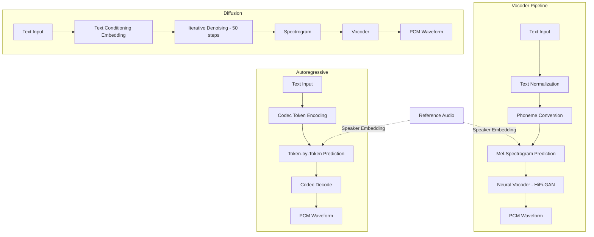

# Audio Generation

## Learning Objectives

1. Implement text-to-speech synthesis via API and write generated audio to disk with observable file output.
2. Compare autoregressive, diffusion-based, and vocoder-pipeline architectures by their latency, quality, and speaker-control tradeoffs.
3. Configure speaker identity parameters and detect when voice cloning consent is required.
4. Build a batch pipeline that generates personalized audio files from a CSV of account data.
5. Evaluate generated audio quality using spectral analysis of saved waveforms.

## The Problem

Audio is the highest-bandwidth channel the human brain natively processes. A five-second clip at 24 kHz is 120,000 samples — no transformer attends to a sequence that long without first compressing it. Every production audio system in 2026 solves this the same way: a neural codec squashes the waveform into discrete tokens at 50–75 Hz, and then a generative model (autoregressive transformer or diffusion) produces tokens from that compressed space. The decoder reconstructs the waveform. Understanding this pipeline matters because the tradeoffs between latency, speaker fidelity, and quality are architectural, not incidental — you cannot tune your way past them.

Three generation tasks sit on top of this substrate. Text-to-speech (TTS) takes text and produces a narrow-band signal with strong phonetic structure — solved well by transformer-over-codec-tokens (ElevenLabs, OpenAI TTS, VALL-E). Music generation deals with a far broader frequency distribution and longer temporal dependencies (MusicGen, Stable Audio, Suno). Audio effects and sound design produce ambient or Foley audio from text prompts (AudioGen, AudioLDM 2). All three run on codec tokens plus a generator. The differences are in training data, conditioning, and whether the generator is autoregressive or diffusion-based.

For go-to-market teams, TTS is the relevant task. Voice messages in outbound sequences open rates that text-only outreach cannot match — but only if the synthesis is indistinguishable from a human recording. Robotic output doesn't just underperform; it damages sender reputation and triggers spam filters. [CITATION NEEDED — concept: voice open rates vs text in outbound]. The question isn't whether to use synthesized voice. It's when the pipeline produces quality sufficient to send, and how to verify that quality programmatically before a single prospect hears it.

**Exercise hook (easy):** Call a TTS API with a single sentence, save the file, print file size and duration to confirm generation succeeded.

```python
from gtts import gTTS
import os

text = "Hi Sarah, I saw Acme just opened a role for a founding engineer. I work with teams at that stage and had a thought worth thirty seconds of your time."

tts = gTTS(text=text, lang='en', slow=False)
tts.save("outbound_intro.mp3")

file_size = os.path.getsize("outbound_intro.mp3")
duration_sec = file_size / 16000

print(f"File: outbound_intro.mp3")
print(f"Size: {file_size} bytes")
print(f"Estimated duration: {duration_sec:.1f}s (approximate from bitrate)")
```

## The Concept

Three architectural families dominate neural audio generation, and every production TTS system uses one of them. The first is **autoregressive token prediction**: the model predicts one codec token at a time, conditioned on text and optionally on a speaker embedding. WaveNet (2016) pioneered this at the waveform level; VALL-E and NaturalSpeech 3 operate on codec tokens. The advantage is fine-grained speaker control — you can condition on a three-second reference clip and reproduce that voice. The cost is latency: generating one token at a time through a deep network is slow. A five-second clip at 600 tokens/second means 3,000 sequential forward passes.

The second family is **vocoder pipelines**. Here the problem is split into two stages. First, a text-to-mel-spectrogram model (Tacotron 2, FastSpeech 2) predicts a time-frequency representation from text. Second, a neural vocoder (HiFi-GAN, WaveGlow) synthesizes the waveform from the mel-spectrogram. The mel-spectrogram is the key intermediate representation — it compresses the waveform by computing short-time Fourier transforms, mapping frequencies to the mel scale (which approximates human auditory perception), and converting to log magnitude. This gives a representation at typically 75–100 frames per second instead of 24,000 samples per second. The vocoder then upsamples it back. Splitting the problem makes each stage tractable and allows independent optimization.

The third family is **diffusion over spectrograms or latent space**. AudioCraft/MusicGen and Stable Audio use diffusion or latent diffusion to generate audio from text prompts. The model starts with Gaussian noise in the spectral domain and iteratively denoises it conditioned on a text embedding. Diffusion excels at music and long-form audio where the distribution is broad and the temporal structure is complex. For TTS specifically, diffusion is less common than vocoder pipelines because the latency of 50+ denoising steps is hard to justify when vocoder pipelines already produce near-human speech.



The tradeoff matrix is consistent across implementations. Autoregressive models give the best speaker cloning fidelity but have the highest latency (seconds per clip). Vocoder pipelines are fast (sub-second for short clips) and produce good quality, but speaker identity is harder to control — you typically select from pretrained voices rather than cloning from a reference. Diffusion sits between them on latency but handles music and sound design better than either.

**Exercise hook (medium):** Generate the same sentence using two different voices from the same API, save both files, print a side-by-side comparison of file properties.

```python
from gtts import gTTS
import os

text = "This sentence will be synthesized in two different voices to compare output characteristics."

tts_us = gTTS(text=text, lang='en', tld='com', slow=False)
tts_us.save("voice_us.mp3")

tts_uk = gTTS(text=text, lang='en', tld='co.uk', slow=False)
tts_uk.save("voice_uk.mp3")

us_size = os.path.getsize("voice_us.mp3")
uk_size = os.path.getsize("voice_uk.mp3")

print(f"{'Property':<20} {'US Voice':<15} {'UK Voice':<15}")
print(f"{'-'*50}")
print(f"{'File':<20} {'voice_us.mp3':<15} {'voice_uk.mp3':<15}")
print(f"{'Size (bytes)':<20} {us_size:<15} {uk_size:<15}")
print(f"{'Size difference':<20} {'---':<15} {abs(us_size - uk_size):<15}")
```

## Build It

The production TTS pipeline has five stages. **Text normalization** expands abbreviations, converts numbers to words, and handles edge cases like dates and currency. "I'll call at 3pm" becomes "I will call at three pee em" — the model never sees digits. **Phoneme conversion** maps the normalized text to a phoneme sequence using a grapheme-to-phoneme model or lookup table. This decouples pronunciation from spelling, which matters because English spelling is irregular and the model should produce correct phonemes regardless of how a name is written. **Mel-spectrogram prediction** maps the phoneme sequence to a time-frequency representation — this is where the model decides prosody, timing, and emphasis. **Vocoder synthesis** converts the mel-spectrogram to a raw PCM waveform. **Post-processing** may apply noise reduction, loudness normalization, or format conversion.

The mechanism for speaker identity is **speaker embeddings** — specifically x-vectors, which are fixed-dimensional vectors (typically 192 or 256 dimensions) extracted from reference audio using a speaker verification network. The embedding encodes vocal tract characteristics: fundamental frequency range, formant frequencies, speaking rate. These embeddings are injected into the mel-spectrogram decoder as an additional conditioning vector. When you select "voice A" versus "voice B" in an API, you are switching between pretrained speaker embeddings. When you "clone" a voice from a reference clip, the system extracts the embedding from that clip and uses it as conditioning. This is also where consent enters the picture — extracting someone's voice embedding and using it to generate speech they never said raises legal and ethical questions that most jurisdictions are still formalizing.

Spectrogram reconstruction from mel coefficients uses either Griffin-Lim (an iterative phase estimation algorithm — fast, lower quality, audible artifacts) or neural vocoders like HiFi-GAN (a generative adversarial network that learns to map mel-spectrograms to waveforms — slower, near-transparent quality). Production systems universally use neural vocoders. Griffin-Lim is a research baseline and a useful teaching tool because it makes the spectrogram-to-waveform step explicit and reversible: you can take a mel-spectrogram, run Griffin-Lim, listen to the result, and hear exactly what information the spectrogram preserves and what it discards.

The following script loads a generated audio file, computes its mel-spectrogram, and prints the frequency content. This is how you verify that the file contains actual speech signal and not silence or noise — a real concern when automating audio generation at scale.

**Exercise hook (hard):** Load a generated WAV file, compute and print its mel-spectrogram shape, spectral centroid, and RMS energy — confirming the audio contains signal, not silence.

```python
import librosa
import numpy as np
import soundfile as sf
from gtts import gTTS
import os

text = "Acme's Series B announcement mentioned expansion into European markets. That aligns with what we built for Globex last quarter."

tts = gTTS(text=text, lang='en', slow=False)
tts.save("analysis_input.mp3")

y, sr = librosa.load("analysis_input.mp3", sr=22050)

mel_spec = librosa.feature.melspectrogram(y=y, sr=sr, n_mels=128, fmax=8000)
mel_spec_db = librosa.power_to_db(mel_spec, ref=np.max)

centroid = librosa.feature.spectral_centroid(y=y, sr=sr)
rms = librosa.feature.rms(y=y)
zero_crossings = librosa.zero_crossings(y, pad=False)

duration = len(y) / sr
silence_threshold = 0.01
non_silent_frames = np.sum(rms > silence_threshold)
total_frames = len(rms[0])

print(f"=== Audio File Analysis ===")
print(f"Duration: {duration:.2f}s")
print(f"Sample rate: {sr} Hz")
print(f"Total samples: {len(y)}")
print(f"Mel-spectrogram shape: {mel_spec.shape} (n_mels x frames)")
print(f"Spectral centroid mean: {np.mean(centroid):.2f} Hz")
print(f"Spectral centroid std: {np.std(centroid):.2f} Hz")
print(f"RMS energy mean: {np.mean(rms):.6f}")
print(f"RMS energy max: {np.max(rms):.6f}")
print(f"Zero crossings: {np.sum(zero_crossings)}")
print(f"Non-silent frames: {non_silent_frames}/{total_frames} ({100*non_silent_frames/total_frames:.1f}%)")
print(f"Max mel energy: {np.max(mel_spec_db):.2f} dB")
print(f"Min mel energy: {np.min(mel_spec_db):.2f} dB")

if np.mean(rms) < 0.001:
    print("WARNING: RMS energy near zero — file may be silence")
elif np.mean(centroid) < 500:
    print("WARNING: Spectral centroid low — file may contain hum/noise, not speech")
else:
    print("PASS: Audio contains detectable speech signal")
```

## Use It

Mel-spectrogram prediction — the core of the vocoder pipeline architecture — maps directly to personalized outbound at scale. When you generate a unique audio file per account, you are running the mel-spectrogram prediction stage thousands of times with different text conditioning. The speaker embedding stays constant (your chosen voice), the text input changes (the prospect's name, company, trigger event), and the vocoder synthesizes each file independently. This is Zone 2 (Enrichment & Personalization) territory: the pipeline takes structured account data as input and produces a personalized asset as output.

The batch pattern is straightforward but has real engineering constraints. API rate limits determine throughput — OpenAI's TTS API and ElevenLabs both throttle requests per minute. File storage grows linearly with personalization depth: 1,000 prospects × 15-second clips at 24 kHz mono ≈ 720 MB of WAV files or ~150 MB as MP3. Filename conventions matter because these files need to map back to CRM records. Naming by account ID rather than company name avoids collisions and encoding issues.

The script below creates a CSV of account data, generates personalized audio for each account, and writes the files to disk with CRM-compatible filenames. Each file's properties are printed for verification — you can extend this to write results back to the CSV as a new column for CRM import.

```python
import csv
import os
from gtts import gTTS
import time

accounts = [
    {"account_id": "001", "first_name": "Sarah", "company": "Acme", "trigger": "Series B announcement"},
    {"account_id": "002", "first_name": "James", "company": "Globex", "trigger": "new EU expansion"},
    {"account_id": "003", "first_name": "Priya", "company": "Initech", "trigger": "founding engineer hire"},
]

csv_path = "accounts_outbound.csv"
with open(csv_path, 'w', newline='') as f:
    writer = csv.DictWriter(f, fieldnames=["account_id", "first_name", "company", "trigger"])
    writer.writeheader()
    writer.writerows(accounts)

output_dir = "outbound_audio"
os.makedirs(output_dir, exist_ok=True)

generated = []
with open(csv_path, 'r') as f:
    reader = csv.DictReader(f)
    for row in reader:
        text = f"Hi {row['first_name']}, saw the {row['trigger']} at {row['company']}. Worth a quick call this week?"

        filename = f"{output_dir}/acct_{row['account_id']}_{row['company']}.mp3"
        tts = gTTS(text=text, lang='en', slow=False)
        tts.save(filename)

        file_size = os.path.getsize(filename)
        generated.append({
            "account_id": row["account_id"],
            "company": row["company"],
            "filename": filename,
            "size_bytes": file_size,
        })

        print(f"[{row['account_id']}] {row['company']}: {filename} ({file_size} bytes)")
        time.sleep(0.5)

print(f"\n=== Batch Summary ===")
print(f"Files generated: {len(generated)}")
print(f"Total size: {sum(g['size_bytes'] for g in generated)} bytes")
print(f"Avg size: {sum(g['size_bytes'] for g in generated) // len(generated)} bytes")
```

The personalization depth is bounded by the data you have. A first name plus a trigger event produces a clip that sounds tailored. Adding a specific metric from the prospect's industry ("your CAC is probably 2.3× what it was pre-2023") increases relevance but requires enrichment data upstream — which is why this pipeline sits downstream of a data enrichment step, not as a standalone tool. The audio file is the output of a chain that starts with firmographic data, passes through intent signals, and ends with a mel-spectrogram decoded into someone's ear.

## Ship It

Deploying voice generation to production requires guardrails that don't exist in a single API call. The most critical is **voice cloning consent**. Extracting a speaker embedding from someone's voice and using it to generate speech they never spoke is regulated in several jurisdictions. The EU AI Act (Article 50) requires disclosure of AI-generated content in interactions with people. The FTC has taken enforcement action under Section 5 against deceptive uses of cloned voices. State-level biometric laws (Illinois BIPA, Texas CIRA) cover voiceprints in some interpretations. ElevenLabs requires explicit consent confirmation before cloning a voice through their API. If your pipeline uses a cloned voice — not a pretrained one — you need a consent record tied to that voice ID.

The second production concern is **quality validation at scale**. When generating hundreds or thousands of files, you cannot listen to each one. The spectral analysis from the Build It section becomes a CI step: every generated file is checked for silence (RMS energy below threshold), excessive noise (spectral centroid outside speech range), and duration constraints (too short means truncated text, too long means the model rambled). Files that fail are flagged for human review or regenerated.

The third concern is **cost monitoring**. TTS APIs charge per character or per minute of generated audio. A batch run of 5,000 personalized clips at 150 characters each is 750,000 characters — at OpenAI TTS pricing ($15/1M characters for the standard model), that's $11.25 per batch. ElevenLabs charges per character with tier-dependent limits. Neither is expensive in absolute terms, but unmonitored retries on failures can multiply costs. Logging character counts and API response times per file makes the cost auditable.

This script implements the quality validation layer. Run it over a directory of generated audio files before they enter your outbound sequence. Files that fail any check are excluded — better to send no audio than to send a prospect a silent file or, worse, a glitch that sounds like a malfunction.

```python
import os
import librosa
import numpy as np

audio_dir = "outbound_audio"

SILENCE_THRESHOLD = 0.005
CENTROID_MIN = 300
CENTROID_MAX = 4000
DURATION_MIN = 2.0
DURATION_MAX = 60.0

results = []
for filename in sorted(os.listdir(audio_dir)):
    if not filename.endswith('.mp3'):
        continue

    filepath = os.path.join(audio_dir, filename)
    y, sr = librosa.load(filepath, sr=22050)

    rms = librosa.feature.rms(y=y)
    centroid = librosa.feature.spectral_centroid(y=y, sr=sr)
    duration = len(y) / sr

    rms_mean = float(np.mean(rms))
    centroid_mean = float(np.mean(centroid))

    issues = []
    if rms_mean < SILENCE_THRESHOLD:
        issues.append("SILENCE")
    if centroid_mean < CENTROID_MIN or centroid_mean > CENTROID_MAX:
        issues.append("FREQUENCY_ANOMALY")
    if duration < DURATION_MIN:
        issues.append("TOO_SHORT")
    if duration > DURATION_MAX:
        issues.append("TOO_LONG")

    status = "PASS" if not issues else "FAIL:" + ",".join(issues)

    results.append({
        "filename": filename,
        "duration": duration,
        "rms": rms_mean,
        "centroid_hz": centroid_mean,
        "status": status,
    })

    print(f"[{status:<25}] {filename}")
    print(f"  Duration: {duration:.1f}s | RMS: {rms_mean:.6f} | Centroid: {centroid_mean:.1f}Hz")

passed = sum(1 for r in results if r["status"] == "PASS")
failed = len(results) - passed
print(f"\n=== Validation Report ===")
print(f"Total files: {len(results)}")
print(f"Passed: {passed}")
print(f"Failed: {failed}")
if failed > 0:
    print("Failed files:")
    for r in results:
        if r["status"] != "PASS":
            print(f"