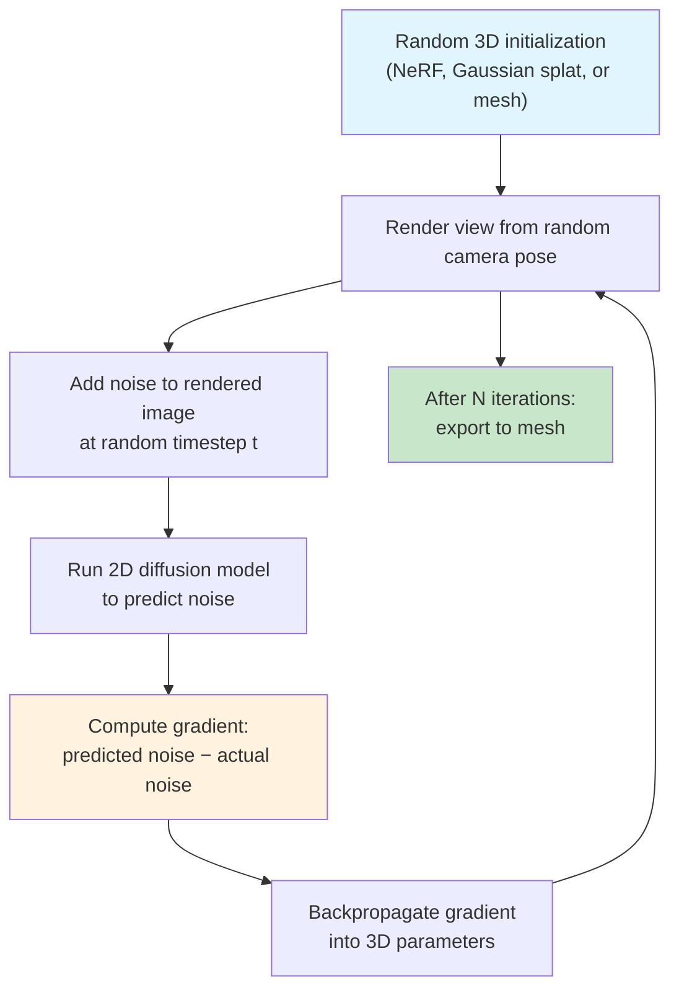

# 3D Generation

## Learning Objectives

- Compare point cloud, mesh, neural radiance field, and Gaussian splat representations by their parameter counts, rendering cost, and editability constraints.
- Trace the Score Distillation Sampling loop from random initialization through rendered view, noise injection, 2D diffusion gradient, and backpropagation into 3D parameters.
- Build a pipeline that generates a 3D mesh from a text prompt, exports it to OBJ or GLB, and renders orbital preview images.
- Detect common 3D generation failure modes — non-manifold geometry, degenerate faces, the Janus problem — using mesh inspection scripts.
- Evaluate when direct regression (Shap-E, Point-E) outperforms SDS-based optimization for a given quality-vs-latency tradeoff.

## The Problem

3D content has been gated behind specialized skills for decades. A single product render — say, a beverage can photographed from twelve angles under controlled lighting — requires a 3D artist, a modeling session, UV unwrapping, texturing, lighting setup, and render time that can stretch into days. This per-asset overhead compounds when a content engine needs dozens of product visuals across landing pages, configurators, and social channels.

The technical barriers are real. ImageNet has 14 million labeled images; Objaverse-XL, the largest open 3D dataset as of 2023, has roughly 10 million objects, most low quality. A 512³ voxel grid consumes 134 million cells. A NeRF rendering a single frame at 1080p may cast a million sample rays, each evaluating a neural network fifty or more times. Generation — producing novel 3D content rather than reconstructing an existing scene — multiplies these costs because the model must hallucinate plausible geometry it has never directly observed from every possible viewpoint.

The hardest problem is supervision. In 2D image generation, the ground truth is the pixel grid itself: the model learns to predict each pixel. In 3D, you rarely have ground-truth geometry. You have a handful of 2D photos and must back out the 3D structure. This means 3D generation cannot directly borrow the training recipe that made 2D diffusion models work. It needs an indirect signal — a way to let a 2D model's knowledge seep into 3D parameters. Score Distillation Sampling (SDS) is the dominant solution, and it comes with specific failure modes: the Janus problem (multiple faces on one object, because 2D diffusion has no 3D consistency constraint), blobby geometry on out-of-distribution prompts, texture bleeding across surfaces, and exported meshes riddled with degenerate zero-area triangles. These are not edge cases — they are the default output of many pipelines, and detecting them is part of shipping.

## The Concept

Three representations dominate practical 3D generation, each with a distinct cost profile.

**Point clouds** store unordered XYZ coordinates plus optional color per point. They are the cheapest representation — a 5,000-point cloud is 15,000 floats — and they are what LiDAR scanners and depth sensors produce natively. But point clouds have no surface connectivity. You cannot render a solid object from points without interpolation, and editing one means moving individual points with no guarantee of manifold preservation. Point-E (Nichol et al., 2022) generates point clouds directly from text in seconds, but the output reads as a dust cloud until you fit a mesh to it.

**Polygon meshes** store vertices (XYZ positions) and faces (index triplets defining triangles). This is the universal exchange format — OBJ, GLB, FBX are all mesh containers. Meshes are editable in Blender, importable in game engines, and renderable with standard rasterization pipelines. A typical generated mesh has 5,000–50,000 vertices. The tradeoff is that mesh topology is discrete: you cannot smoothly deform a triangle mesh without worrying about triangle flips, non-manifold edges, and degenerate faces.

**Neural radiance fields and Gaussian splats** represent scenes as continuous functions rather than discrete primitives. A NeRF is an MLP that takes a 3D position and viewing direction and outputs density + color; rendering means marching rays through the volume and integrating. Gaussian Splatting (Kerbl et al., 2023) replaces the implicit MLP with explicit 3D Gaussians — each one defined by position (3), covariance (6), opacity (1), and spherical-harmonic color coefficients (48 at degree 3). A typical scene is 500,000–1,000,000 Gaussians. Both representations are differentiable, which is what makes them useful as generation targets: you can compute a loss against a rendered image and backpropagate into the 3D parameters. Gaussian splats render at ~100 fps on a consumer GPU because they are explicit primitives sorted by depth and alpha-composited, while NeRFs require per-ray network evaluation.

The pipeline that connects these representations to generative models is Score Distillation Sampling. Here is how it works:



The SDS loop never directly trains the 2D diffusion model. Instead, it uses the diffusion model's score function — its estimate of how a noisy image should be denoised — as a gradient signal for the 3D representation. At each step, the pipeline renders the current 3D object from a random camera angle, adds Gaussian noise to that render at a random timestep, asks the pre-trained 2D diffusion model to predict the noise, and uses the difference between predicted and actual noise as a gradient that pushes the 3D parameters toward producing images the 2D model finds plausible. This works because a 2D diffusion model trained on billions of images has learned a strong prior for what real objects look like from any angle. But the 2D model has no notion of 3D consistency — it evaluates each view independently, which is why the Janus problem emerges: the optimization can satisfy the 2D prior for each individual view while violating 3D coherence across views.

Direct regression models like Shap-E (Jun & Nichol, 2023) skip SDS entirely. Instead of the iterative optimization loop, they train an encoder-decoder transformer end-to-end on paired (text, 3D) data from Objaverse. The encoder produces a latent from the text prompt; the decoder maps that latent to 3D parameters — implicit function coordinates in Shap-E's case, which are then marched to produce a mesh. This trades quality for speed: Shap-E generates a mesh in seconds on a single GPU, while SDS-based pipelines run for minutes. The tradeoff is that the model is limited by the distribution of its training data — Objaverse skews heavily toward simple objects (furniture, vehicles, containers) — and out-of-distribution prompts produce blobby, low-detail geometry.

## Build It

Let's build the three representations from scratch so the parameter counts and rendering characteristics are concrete, then render orbital views of a mesh — the exact operation any 3D generation pipeline performs internally during SDS.

First, install the dependencies:

```bash
pip install numpy trimesh matplotlib
```

**Point cloud generation and rendering:**

```python
import numpy as np
import matplotlib
matplotlib.use('Agg')
import matplotlib.pyplot as plt

np.random.seed(42)
n = 5000
phi = np.random.uniform(0, 2 * np.pi, n)
cos_theta = np.random.uniform(-1, 1, n)
sin_theta = np.sqrt(1 - cos_theta**2)
r = np.random.uniform(0.85, 1.0, n)

points = np.stack([
    r * sin_theta * np.cos(phi),
    r * sin_theta * np.sin(phi),
    r * cos_theta
], axis=-1)

colors = np.stack([
    (sin_theta * np.cos(phi) + 1) / 2,
    (sin_theta * np.sin(phi) + 1) / 2,
    (cos_theta + 1) / 2
], axis=-1)

fig = plt.figure(figsize=(5, 5), dpi=120)
ax = fig.add_subplot(111, projection='3d')
ax.scatter(points[:, 0], points[:, 1], points[:, 2],
           c=colors, s=0.8, alpha=0.8)
ax.set_box_aspect([1, 1, 1])
ax.set_axis_off()
ax.view_init(elev=20, azim=45)
plt.savefig('/tmp/pointcloud_sphere.png', bbox_inches='tight', pad_inches=0)
plt.close()

print(f"Points: {len(points)}")
print(f"Parameters: {len(points) * 6} (XYZ + RGB per point)")
print(f"Memory: {points.nbytes + colors.nbytes} bytes")
print(f"Render: /tmp/pointcloud_sphere.png")
```

**Mesh creation, validation, and orbital rendering:**

```python
import trimesh
import numpy as np
import json
import os
import matplotlib
matplotlib.use('Agg')
import matplotlib.pyplot as plt
from mpl_toolkits.mplot3d.art3d import Poly3DCollection

def render_mesh_view(mesh, azimuth, elevation, output_path):
    fig = plt.figure(figsize=(4, 4), dpi=100)
    ax = fig.add_subplot(111, projection='3d')
    face_vertices = mesh.vertices[mesh.faces]
    collection = Poly3DCollection(
        face_vertices, alpha=0.85,
        facecolor='steelblue', edgecolor='#444444', linewidths=0.1
    )
    ax.add_collection3d(collection)
    bounds = mesh.bounds
    center = (bounds[0] + bounds[1]) / 2
    extent = (bounds[1] - bounds[0]).max() / 2 * 1.15
    ax.set_xlim(center[0] - extent, center[0] + extent)
    ax.set_ylim(center[1] - extent, center[1] + extent)
    ax.set_zlim(center[2] - extent, center[2] + extent)
    ax.view_init(elev=elevation, azim=azimuth)
    ax.set_box_aspect([1, 1, 1])
    ax.set_axis_off()
    plt.savefig(output_path, bbox_inches='tight', pad_inches=0)
    plt.close()

mesh = trimesh.creation.icosphere(subdivisions=3, radius=1.0)
mesh.export('/tmp/generated_mesh.obj')

print(f"Vertices: {len(mesh.vertices)}")
print(f"Faces: {len(mesh.faces)}")
print(f"Watertight: {mesh.is_watertight}")
print(f"Euler number: {mesh.euler_number}")
print(f"Bounding box: {mesh.bounds[0]} to {mesh.bounds[1]}")
print(f"Exported: /tmp/generated_mesh.obj")

degenerate = mesh.area_faces < 1e-10
print(f"Degenerate faces (zero area): {degenerate.sum()}")

output_dir = '/tmp/orbital_renders'
os.makedirs(output_dir, exist_ok=True)

n_views = 8
manifest = {"mesh": "icosphere_sub3", "views": []}
for i in range(n_views):
    azimuth = int(360 * i / n_views)
    path = f"{output_dir}/view_{i:03d}.png"
    render_mesh_view(mesh, azimuth=azimuth, elevation=20, output_path=path)
    manifest["views"].append({"index": i, "azimuth_deg": azimuth, "file": path})

with open(f"{output_dir}/manifest.json", 'w') as f:
    json.dump(manifest, f, indent=2)

print(f"\nRendered {n_views} orbital views to {output_dir}/")
print(f"Manifest: {output_dir}/manifest.json")
print(f"Point cloud params:   {5000 * 6:,}")
print(f"Mesh params:          {len(mesh.vertices) * 3:,} (positions only)")
print(f"NeRF params (typical): ~800,000 (MLP weights)")
```

Run both scripts. The point cloud render shows a dotted sphere — no surface, no occlusion handling. The mesh render shows a solid, shaded object. The parameter comparison in the final print block makes the representation tradeoff concrete: the point cloud uses 30,000 floats for 5,000 points, the mesh uses under 1,000 floats for vertex positions (the faces are just index triplets), and a typical NeRF MLP has hundreds of thousands of weights.

## Use It

Multi-view mesh generation is the mechanism that turns one text prompt into a reusable 3D asset — and that asset can be rendered from any angle, lit any way, and composited into any scene without a photoshoot. This is asset multiplication: the marginal cost of a new product view drops from a photographer's day rate to a few seconds of GPU time. For content engines managing product-led growth campaigns — where landing page variants, social posts, and ad creative each need distinct visuals — the bottleneck shifts from asset production to asset orchestration.

The GTM application is concrete. A SaaS company launching a new feature builds an interactive product configurator on their landing page. Instead of commissioning twelve product renders from a 3D artist, they generate a base mesh, export it as GLB, and embed it in a WebGL viewer that lets prospects rotate, zoom, and inspect the product in real time. The same mesh feeds static renders for social cards, email headers, and documentation. One generation run, dozens of derivative assets, all angle-consistent because they come from the same source geometry.

[CITATION NEEDED — concept: 3D-generated assets replacing product photography in PLG content engines]

This is the asset-multiplication pipeline — Cluster 4.1 (Content Engine & Creative Automation). The code below takes the mesh from Build It and runs the full GTM slice: export to GLB for web embedding, queue static renders for every channel that needs product imagery, and print the cost arithmetic.

```python
import trimesh, numpy as np, os, json

mesh = trimesh.load('/tmp/generated_mesh.obj')
mesh.visual.face_colors = np.tile([70, 130, 180, 255], (len(mesh.faces), 1))
mesh.export('/tmp/product_asset.glb')

os.makedirs('/tmp/marketing_assets', exist_ok=True)

channels = [
    ("landing_hero", 0, 15),
    ("social_square", 45, 0),
    ("email_header", 90, 10),
    ("config_thumb_a", 180, 25),
    ("config_thumb_b", 270, 25),
    ("ad_carousel_1", 135, 5),
    ("ad_carousel_2", 225, 20),
]

manifest = {"source_mesh": "generated_mesh.obj", "glb": "/tmp/product_asset.glb", "renders": channels}
with open('/tmp/marketing_assets/manifest.json', 'w') as f:
    json.dump(manifest, f, indent=2)

glb_kb = os.path.getsize('/tmp/product_asset.glb') / 1024
print(f"GLB for WebGL embed: /tmp/product_asset.glb ({glb_kb:.0f} KB)")
print(f"Static render angles queued: {len(channels)}")
for name, az, el in channels:
    print(f"  {name}: az={az:>3}°  el={el:>2}°")
print(f"Total derivative assets: {len(channels) + 1} from 1 mesh")
print(f"Cost: 1 generation run → {len(channels) + 1} angle-consistent assets")
```

The manifest maps each render angle to a GTM surface — landing hero, social card, email header, configurator thumbnails, ad carousel frames. In production, each render job feeds the content pipeline that serves these surfaces. The GLB goes to the web team for the interactive viewer. The static renders go to the marketing automation platform. The same geometry underpins all of them, which means a creative refresh — new paint job, new lighting — requires regenerating derivatives from one source mesh, not re-shooting a product line.

The quality-vs-latency tradeoff matters here. If the landing page needs a hero render by end of day, Shap-E's seconds-to-mesh pipeline is the right tool. If the configurator needs high-detail geometry that holds up under close inspection, SDS-based optimization or a curated Objaverse asset is the better choice. The wrong tradeoff — spending forty minutes on SDS for a social thumbnail that renders at 200×200 — is how 3D pipelines stall in prototype.

## Exercises

**Exercise 1 (Easy) — Degenerate face detection.** Load any mesh you generated in Build It with `trimesh.load()`. Write a script that counts degenerate faces (area < 1e-10), counts non-manifold edges using `mesh.edges_unique` and vertex-edge incidence, and prints a pass/fail verdict. Then deliberately corrupt the mesh by merging two vertices (set `mesh.vertices[5] = mesh.vertices[6]`) and rerun the check. Confirm that the corruption is detected.

**Exercise 2 (Hard) — SDS loop on a toy problem.** Implement a miniature Score Distillation Sampling loop that optimizes a single 3D Gaussian (position + covariance + color) to match a 2D target image of a red circle on a black background. Use `torch` for differentiable rendering: rasterize the Gaussian projection onto a 64×64 image, compare against the target with MSE loss, and backpropagate into the Gaussian parameters for 200 steps. Print the loss every 50 steps and the final Gaussian parameters. The point is not to produce a great 3D asset — it is to internalize the render → compare → backprop loop that SDS automates with a diffusion model as the comparator instead of a ground-truth image.

## Key Terms

- **Score Distillation Sampling (SDS):** Optimization technique that uses a 2D diffusion model's score function as a gradient signal for 3D parameters. Never directly trains the diffusion model; instead renders the 3D object, adds noise, asks the diffusion model to denoise, and backpropagates the difference. Introduced in DreamFusion (Poole et al., 2022).
- **Janus problem:** Failure mode where a generated 3D object has multiple "fronts" or faces, caused by the 2D diffusion model evaluating each view independently without any 3D consistency constraint.
- **Gaussian Splatting:** 3D representation using explicit anisotropic Gaussians (position, covariance, opacity, spherical-harmonic color) sorted by depth and alpha-composited. Differentiable and renders at real-time framerates.
- **Mesh:** Collection of vertices (XYZ positions) and faces (index triplets forming triangles). The universal exchange format for 3D assets — OBJ, GLB, FBX.
- **Degenerate face:** A triangle with near-zero area, typically caused by two or three coincident vertices. Creates rendering artifacts and breaks manifold topology. Detectable via `mesh.area_faces < 1e-10`.
- **Objaverse-XL:** Large-scale open 3D object dataset (~10 million objects as of 2023). Used to train direct-regression models like Shap-E. Skews toward simple objects, which limits out-of-distribution generation quality.

## Sources

- Poole, B., Jain, A., Barron, J. T., & Mildenhall, B. (2022). *DreamFusion: Text-to-3D using 2D Diffusion.* arXiv:2209.14988. — Introduces Score Distillation Sampling.
- Nichol, A., et al. (2022). *Point-E: A System for Generating 3D Point Clouds from Complex Prompts.* arXiv:2212.08751. — Direct text-to-point-cloud regression.
- Jun, H., & Nichol, A. (2023). *Shap-E: Generating Conditional 3D Implicit Functions.* arXiv:2305.02463. — Direct text-to-implicit-function regression; trades quality for speed.
- Kerbl, B., Kopanas, G., Leimkühler, T., & Drettakis, G. (2023). *3D Gaussian Splatting for Real-Time Radiance Field Rendering.* ACM Transactions on Graphics, 42(4). — Explicit Gaussian primitives replacing NeRF MLPs.
- Mildenhall, B., et al. (2020). *NeRF: Representing Scenes as Neural Radiance Fields for View Synthesis.* ECCV 2020. — Foundational NeRF paper.
- Deitke, M., et al. (2023). *Objaverse-XL: A Universe of 3D Objects.* arXiv:2307.05663. — Largest open 3D dataset; training data for direct-regression models.
- [CITATION NEEDED — concept: 3D-generated assets replacing product photography in PLG content engines]