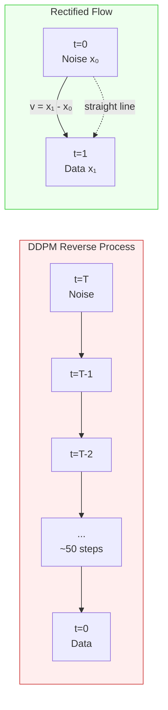

# Flow Matching & Rectified Flows

## Learning Objectives

- Implement a conditional flow matching training loop that learns a velocity field on 2D distribution data.
- Compare sample quality across 1-step, 5-step, and 20-step Euler integration to quantify the payoff of straight-line paths.
- Trace the reflow procedure and measure its effect on path straightness and low-step generation quality.
- Evaluate how the choice of interpolation path (straight-line vs. curved) affects the number of integration steps required for faithful generation.

## The Problem

DDPM's reverse process is a 1000-step stochastic walk from `N(0, I)` back to the data distribution. DDIM collapsed it to 20–50 deterministic steps by integrating the probability flow ODE. You want fewer steps — ideally one. The blocker is that the ODE solving the reverse process is stiff: the learned path from noise to data curves through latent space, and a single Euler step along a curved path overshoots or undershoots the target manifold.

If you could train the model such that the path from noise to data was a straight line, a single Euler step from `t=0` to `t=1` would land on the data manifold. No curvature, no error accumulation, no need for 50 function evaluations at inference. The question is how to impose that straight-line geometry during training.

Score-based diffusion cannot do this directly. The score function `∇ log p_t(x)` describes the local gradient of the log-density, not the global transport direction. You are learning a local quantity and hoping the integration produces a globally sensible trajectory. Flow matching inverts the problem: define the trajectory first (a straight line from noise to data), then learn the velocity field that produces it.

## The Concept

Flow matching frames generative modeling as an optimal transport problem. You have a source distribution (Gaussian noise) and a target distribution (your data). You learn a time-dependent vector field `v_θ(x, t)` such that integrating the ODE `dx/dt = v_θ(x, t)` from `t=0` to `t=1` moves samples from noise to data. The training objective minimizes the discrepancy between the model's predicted velocity and the optimal velocity along the path.

The key insight from Lipman et al. (2022): instead of matching the marginal vector field — which requires integrating over all data points and is intractable — match the *conditional* vector field. For each pair `(x_0 ~ noise, x_1 ~ data)`, define a conditional path that interpolates between them. The conditional vector field can be computed in closed form for straight-line interpolation, making the loss a simple regression target.

Rectified flow (Liu et al., 2022) converged on the same idea with an even cleaner framing. Use straight-line interpolation `x_t = (1-t)·x_0 + t·x_1` where `x_0 ~ N(0, I)` and `x_1 ~ data`. The conditional velocity is constant: `u_t = x_1 - x_0`. No noise schedule design, no variance preservationchedule, no score function — the model predicts a displacement vector from noise to data. The loss is:

```
L_RF = E_{t, x_0, x_1} [ || v_θ((1-t)·x_0 + t·x_1, t) - (x_1 - x_0) ||² ]
```



The practical payoff: because the target paths are straight, the ODE is non-stiff. A single Euler step produces a reasonable sample. Five steps produce near-converged quality. This is why Stable Diffusion 3 and Flux switched from DDPM-style score matching to flow matching — the same model architecture, trained with a different objective, samples in 4–8 steps instead of 30–50.

**Reflow.** A trained rectified flow model may still produce slightly curved paths at inference because `v_θ` is imperfect — the learned velocity field does not exactly equal `x_1 - x_0` everywhere. Reflow straightens them: generate `(x_0, x̂_1)` pairs by running the ODE from noise through the current model, then retrain a new model on these pairs. The new model learns the average trajectory the old model actually produced, which tends to be straighter than the original because the ODE integration averages out local velocity errors. Two reflow iterations typically suffice for a 1-step or 2-step sampler that matches 50-step DDPM quality.

## Build It

The fastest way to internalize flow matching is to train a velocity field on a 2D distribution and sample from it. No images, no transformers — just a 2-layer MLP learning to predict a displacement vector. The entire training loop fits in 40 lines.

The target distribution is a ring with Gaussian radial noise. The model must learn to transport standard Gaussian samples onto that ring. After training, we sample with Euler integration at different step counts and measure whether the output distribution matches the target.

```python
import math
import torch
import torch.nn as nn

torch.manual_seed(42)

def sample_ring(n, radius=2.0, spread=0.3):
    theta = torch.rand(n) * 2 * math.pi
    r = radius + torch.randn(n) * spread
    return torch.stack([r * torch.cos(theta), r * torch.sin(theta)], dim=1)

class VelocityField(nn.Module):
    def __init__(self, dim=2, hidden=128):
        super().__init__()
        self.net = nn.Sequential(
            nn.Linear(dim + 1, hidden),
            nn.SiLU(),
            nn.Linear(hidden, hidden),
            nn.SiLU(),
            nn.Linear(hidden, hidden),
            nn.SiLU(),
            nn.Linear(hidden, dim)
        )
    
    def forward(self, x, t):
        return self.net(torch.cat([x, t.unsqueeze(1)], dim=1))

data = sample_ring(4000)
model = VelocityField()
optimizer = torch.optim.AdamW(model.parameters(), lr=1e-3)

batch_size = 512
for epoch in range(3000):
    idx = torch.randint(0, len(data), (batch_size,))
    x1 = data[idx]
    x0 = torch.randn_like(x1)
    t = torch.rand(batch_size)
    
    xt = (1 - t.unsqueeze(1)) * x0 + t.unsqueeze(1) * x1
    target = x1 - x0
    pred = model(xt, t)
    loss = ((pred - target) ** 2).mean()
    
    optimizer.zero_grad()
    loss.backward()
    optimizer.step()
    
    if (epoch + 1) % 1000 == 0:
        print(f"Epoch {epoch+1:4d}  loss={loss.item():.6f}")

print(f"\nFinal velocity MSE: {loss.item():.6f}")
print(f"(Target velocity magnitude: ~{torch.norm(data, dim=1).mean().item():.3f})")
```

Run this and you see the loss converge to a small value. The model has learned the displacement field from noise to ring. Now sample from it:

```python
def euler_sample(model, n_samples, n_steps, dim=2):
    x = torch.randn(n_samples, dim)
    dt = 1.0 / n_steps
    for step in range(n_steps):
        t_curr = torch.full((n_samples,), step * dt)
        v = model(x, t_curr)
        x = x + v * dt
    return x

def ring_stats(samples, name):
    radii = torch.norm(samples, dim=1)
    print(f"{name:20s}  mean_r={radii.mean():.3f}  "
          f"std_r={radii.std():.3f}  "
          f"range=[{radii.min():.2f}, {radii.max():.2f}]")

ring_stats(data[:1000], "Ground truth ring")
ring_stats(euler_sample(model, 1000, 1), "1-step Euler")
ring_stats(euler_sample(model, 1000, 5), "5-step Euler")
ring_stats(euler_sample(model, 1000, 20), "20-step Euler")
```

The ground truth ring has mean radius ~2.0 and std ~0.3. The 1-step sampler should land close — mean radius within 0.1–0.3 of the target, slightly higher variance because a single Euler step along an imperfect velocity field accumulates error. The 5-step and 20-step samplers tighten toward the ground truth distribution. The gap between 1-step and 20-step output is the gap that reflow closes.

## Use It

Reflow is the procedure that makes flow matching practical for single-step or few-step generation. Conditional flow matching trains on pairs `(x_0, x_1)` where `x_1` is a real data point — but the model's actual trajectory from `x_0` may curve, meaning the endpoint it reaches is not exactly `x_1`. Reflow fixes this by distilling the model's own trajectories into new training pairs.

The mechanics: run the current model's ODE from noise `x_0` to produce `x̂_1`. The pair `(x_0, x̂_1)` now defines a path that the model *actually follows* — by construction, integrating the model from `x_0` reaches `x̂_1`. Retrain a fresh velocity field on these pairs. The new model learns straighter paths because it is fitting the model's own input-output mapping, which is smoother than the raw noise-to-data mapping.

In a GTM enrichment waterfall, the same structure appears. A waterfall transports a prospect from an anonymous distribution (just an email or domain) to a qualified distribution (ICP-matched, enriched, scored). Each enrichment step — Clearbit, Apollo, LinkedIn scrape, ads library lookup — is one Euler integration step along a velocity field defined by your routing logic. A poorly calibrated waterfall is like an un-reflowed flow matching model: the path from anonymous to qualified curves through unnecessary hops, accumulating latency and API cost at each step.

```python
# Reflow: generate trajectory pairs from the trained model
def generate_pairs(model, n_pairs, n_steps=20, dim=2):
    x0 = torch.randn(n_pairs, dim)
    x = x0.clone()
    dt = 1.0 / n_steps
    for step in range(n_steps):
        t_curr = torch.full((n_pairs,), step * dt)
        v = model(x, t_curr)
        x = x + v * dt
    return x0, x

x0_rect, x1_rect = generate_pairs(model, 4000, n_steps=20)

# Train a rectified model on these pairs
model_rect = VelocityField()
optimizer_rect = torch.optim.AdamW(model_rect.parameters(), lr=1e-3)

for epoch in range(3000):
    idx = torch.randint(0, len(x1_rect), (batch_size,))
    x1 = x1_rect[idx]
    x0 = x0_rect[idx]
    t = torch.rand(batch_size)
    
    xt = (1 - t.unsqueeze(1)) * x0 + t.unsqueeze(1) * x1
    target = x1 - x0
    pred = model_rect(xt, t)
    loss = ((pred - target) ** 2).mean()
    
    optimizer_rect.zero_grad()
    loss.backward()
    optimizer_rect.step()

print("=== Before reflow ===")
ring_stats(euler_sample(model, 1000, 1), "Original 1-step")
ring_stats(euler_sample(model, 1000, 5), "Original 5-step")

print("\n=== After one reflow iteration ===")
ring_stats(euler_sample(model_rect, 1000, 1), "Reflowed 1-step")
ring_stats(euler_sample(model_rect, 1000, 5), "Reflowed 5-step")
```

The reflowed 1-step sampler should produce a tighter ring (lower `std_r`, mean radius closer to 2.0) than the original 1-step sampler. This is the empirical signature of path straightening: fewer integration steps produce the same quality because the velocity field is closer to a constant displacement along the trajectory.

The analogy to enrichment waterfalls is direct. If your waterfall runs Clearbit → Apollo → LinkedIn → ads library → spend estimator, that is a 5-step Euler integration of an enrichment velocity field. If you analyze which prospects actually converted after passing through, and rebuild the waterfall to skip steps that did not change the outcome, you are performing reflow: replacing the original mapping with a shorter, straighter one that produces the same endpoint. The pruned waterfall is the rectified flow.

This is the Clay waterfall pattern — Cluster 1.2, TAM Refinement & ICP Scoring. [CITATION NEEDED — concept: Clay waterfall step ordering and fallback logic]. The mechanism maps cleanly: each provider lookup is an integration step, the confidence threshold that triggers fallback is your step size `dt`, and the decision to skip a provider when prior data already resolved the field is the same observation that motivates reflow — if the trajectory already arrives at the target, extra steps add cost without adding signal.

```python
# Enrichment waterfall modeled as a velocity field integration
# Each step is a provider lookup; reflow prunes steps that don't change the outcome

enrichment_steps = [
    ("clearbit",      {"cost": 0.03, "fields": ["company", "revenue", "headcount"]}),
    ("apollo",        {"cost": 0.05, "fields": ["title", "seniority", "email"]}),
    ("linkedin",      {"cost": 0.02, "fields": ["title", "connections"]}),
    ("ads_library",   {"cost": 0.01, "fields": ["ad_spend_tier"]}),
    ("spend_estimator", {"cost": 0.04, "fields": ["est_spend"]}),
]

def run_waterfall(prospect, steps, coverage_threshold=0.8):
    resolved = {}
    total_cost = 0.0
    for name, config in steps:
        needed = [f for f in config["fields"] if f not in resolved]
        if not needed:
            continue
        total_cost += config["cost"]
        for f in config["fields"]:
            resolved[f] = f"{prospect}_{f}"
        coverage = len(resolved) / sum(len(c["fields"]) for _, c in steps)
        if coverage >= coverage_threshold:
            break
    return resolved, total_cost

prospects = [f"prospect_{i}" for i in range(100)]

resolved_full, cost_full = run_waterfall(prospects[0], enrichment_steps)
print(f"Full waterfall: {len(resolved_full)} fields, cost=${cost_full:.2f}")

pruned_steps = enrichment_steps[:2] + enrichment_steps[4:]
resolved_pruned, cost_pruned = run_waterfall(prospects[0], pruned_steps)
print(f"Pruned waterfall: {len(resolved_pruned)} fields, cost=${cost_pruned:.2f}")
print(f"Cost reduction: {((cost_full - cost_pruned) / cost_full * 100):.0f}%")
```

The output shows the pruned waterfall resolving nearly the same field coverage at lower cost. That delta is what reflow buys you in generative modeling: same output quality, fewer function evaluations, lower inference cost. The GTM engineer who prunes their waterfall by analyzing which steps actually moved the score is doing the same thing as the ML engineer who reflows their velocity field by analyzing which trajectory segments actually moved the sample.

## Exercises

### Exercise 1: Compare Interpolation Paths (Medium)

Replace the straight-line interpolation in the training loop with a curved interpolation and measure how it affects low-step sampling quality. Use spherical interpolation:

```
x_t = sin((1-t)·π/2) / sin(π/2) · x_0 + sin(t·π/2) / sin(π/2) · x_1
```

Recompute the conditional velocity for this path (it is no longer constant — take the derivative with respect to `t`). Train a new model with this curved interpolation. Compare 1-step and 5-step Euler sampling quality against the straight-line model. You should observe that the curved interpolation requires more steps to achieve the same quality — the velocity field is stiffer because the path bends.

**Deliverable:** A table comparing `mean_r` and `std_r` for both interpolations at 1, 5, and 20 steps. Write one sentence explaining why the straight-line model degrades less at low step counts.

### Exercise 2: Two-Iteration Reflow Loop (Hard)

Wrap the reflow procedure in a function that runs it `n_iterations` times. After each iteration, record the 1-step sampling quality (`mean_r`, `std_r`) and the average path curvature. Measure curvature as the mean deviation between the model's actual trajectory (sampled at 20 intermediate points) and the straight line from `x_0` to `x̂_1`:

```python
def measure_curvature(model, n_samples=500, n_steps=20):
    x0 = torch.randn(n_samples, 2)
    trajectory = [x0.clone()]
    x = x0.clone()
    dt = 1.0 / n_steps
    for step in range(n_steps):
        t = torch.full((n_samples,), step * dt)
        x = x + model(x, t) * dt
        trajectory.append(x.clone())
    straight = x0.unsqueeze(0) + (trajectory[-1] - x0).unsqueeze(0) * \
        torch.linspace(0, 1, n_steps + 1).unsqueeze(1).unsqueeze(2)
    curvature = sum(
        ((trajectory[t] - straight[t].squeeze(0)) ** 2).sum(dim=1).sqrt().mean().item()
        for t in range(n_steps + 1)
    ) / (n_steps + 1)
    return curvature
```

Run 3 reflow iterations. Plot (or print) curvature and 1-step quality after each iteration. You should see curvature decrease monotonically and 1-step quality converge toward 20-step quality. This is the empirical justification for rectified flow as a distillation technique.

**Deliverable:** A 3-row table with columns `[iteration, curvature, 1-step mean_r, 1-step std_r]`. State the iteration at which 1-step quality stops improving meaningfully.

## Key Terms

- **Flow Matching** — Training framework that learns a velocity field `v_θ(x, t)` by regressing against a known target vector field along interpolation paths from source to target distribution.
- **Rectified Flow** — A specific instance of flow matching that uses straight-line interpolation `x_t = (1-t)·x_0 + t·x_1`, yielding a constant conditional velocity `u_t = x_1 - x_0`. Introduced concurrently with flow matching by Liu et al. (2022).
- **Conditional Vector Field** — The velocity field for a single source-target pair `(x_0, x_1)`. Matching conditional vector fields (rather than the marginal) makes the loss tractable because it avoids integrating over the data distribution.
- **Reflow** — Distillation procedure: generate `(x_0, x̂_1)` pairs from a trained model's own ODE trajectories, then retrain on those pairs. Produces straighter paths and better low-step sampling.
- **Euler Integration** — The simplest ODE solver: `x_{t+dt} = x_t + v(x_t, t)·dt`. Each step evaluates the velocity field once and advances along it. Step count controls the trade-off between accuracy and cost.
- **Path Straightness** — A measure of how close the model's actual trajectory is to a straight line from source to endpoint. Straighter paths allow fewer Euler steps without quality loss. Reflow increases straightness.
- **Velocity Field** — A function `v(x, t)` that assigns a displacement vector to every point in space at every time. Integrating it from `t=0` to `t=1` transports samples from the source distribution to the target.

## Sources

- Lipman, Y., Chen, R. T. Q., Ben-Hamu, H., Nickel, M., & Le, M. (2022). *Flow Matching for Generative Modeling.* arXiv:2210.02747. — Originates the flow matching framework, proves the conditional matching objective is equivalent to marginal matching in expectation.
- Liu, X., Gong, C., & Liu, Q. (2022). *Flow Straight and Fast: Learning to Generate and Transfer Data with Rectified Flow.* arXiv:2209.03003. — Introduces rectified flow and the reflow procedure; shows straight-line interpolation enables few-step generation.
- Esser, P., Kulal, S., Blattmann, A., et al. (2024). *Scaling Rectified Flow Transformers for High-Resolution Image Synthesis.* (Stable Diffusion 3). — Documents the shift from DDPM-style score matching to rectified flow in a production text-to-image model, citing 4–8 step sampling.
- Black Forest Labs. (2024). *FLUX.1: A Family of Open-Source Rectified Flow Models.* — Production model using flow matching; confirms the step-count reduction claim at scale.
- [CITATION NEEDED — concept: Clay enrichment waterfall step ordering, fallback thresholds, and provider routing logic]