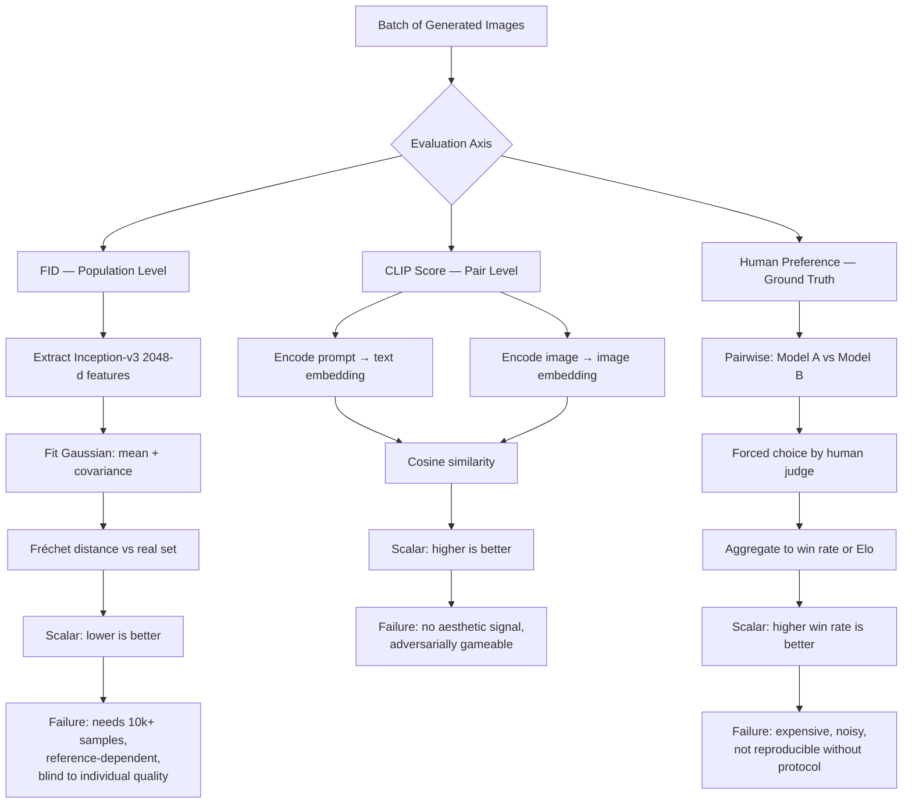

# Evaluation — FID, CLIP Score, Human Preference

## Learning Objectives

- Compute FID between two image distributions by extracting Inception-v3 features and calculating the Fréchet distance between fitted Gaussians.
- Calculate CLIP Score for prompt-image pairs using cosine similarity in shared embedding space.
- Implement a pairwise human preference protocol with forced-choice aggregation and win-rate reporting.
- Compare the failure modes of FID, CLIP Score, and human preference across population-level, pair-level, and subjective evaluation axes.
- Select an appropriate combination of metrics for a given evaluation scenario and justify the choice based on what each metric can and cannot detect.

## The Problem

You trained a diffusion model. It produces images. Now an investor asks: "Are they better than the previous model?" You open the output directory and scroll. Some images look good. Some look off. One has six fingers. You cannot ship a gut feeling.

Generative model evaluation has no closed-form ground truth. Unlike classification accuracy, there is no single label that says "this image is correct." You are judging *sample quality* (does the image look real?) and *conditioning adherence* (does the image match the prompt?) simultaneously, across thousands of samples, across model versions. Three metrics survived a decade of scrutiny because each addresses one axis of this problem that the others miss.

The axes are: distributional fidelity (does the set of generated images look like the set of real images?), semantic alignment (does a specific image match its specific prompt?), and subjective quality (do humans actually prefer this output?). No single metric covers all three. Practitioners who report only one are hiding a failure mode — sometimes intentionally, sometimes because they inherited the metric from a paper without reading the fine print.

## The Concept

**FID (Fréchet Inception Distance)** operates at the population level. Heusel et al. (2017) proposed it to fix a flaw in the earlier Inception Score, which measured whether generated images were classifiable but not whether they resembled a specific target distribution. FID works in three steps: extract 2048-dimensional feature vectors from all images using the penultimate layer of a pretrained Inception-v3 network, fit a multivariate Gaussian (mean vector μ and covariance matrix Σ) to each set, and compute the Fréchet distance between the two Gaussians: `||μ_r − μ_g||² + Tr(Σ_r + Σ_g − 2·(Σ_r·Σ_g)^½)`. Lower means the generated distribution is closer to the reference distribution. FID requires a reference set of real images — change the reference set and the number changes. It also requires enough samples: below roughly 10k images, FID is biased upward. And it says nothing about any individual image. A model with great FID can still produce individual bad outputs; a model with mediocre FID can produce stunning ones.

**CLIP Score** operates at the pair level. Radford et al. (2021) trained CLIP to map images and text into a shared embedding space where matched pairs have high cosine similarity. CLIP Score exploits this: encode the prompt as a text vector, encode the generated image as an image vector, compute cosine similarity. Higher means the image better matches the text. This captures prompt adherence — did the model draw what you asked? But CLIP Score does not capture aesthetics. A blurry, ugly image that happens to contain the right objects can score higher than a beautiful image with a subtle mismatch. CLIP Score is also gameable: adversarial perturbations invisible to the human eye can inflate the score without changing perceived quality.

**Human Preference** is the ground truth that both metrics approximate. The standard protocol is pairwise comparison: show a human two images generated from the same prompt by different models, force a choice, aggregate results into a win-rate matrix or Elo rating. This captures everything FID and CLIP miss — aesthetics, composition, fine detail, subjective preference. But it does not scale. A single FID computation processes 50k images in minutes; the equivalent human study costs thousands of dollars and weeks of calendar time. Human ratings are also noisy: the same judge presented with the same pair on different days may choose differently. Strict protocols (randomized ordering, multiple judges per pair, attention checks) reduce but do not eliminate this noise.



The core tension: FID evaluates populations, CLIP Score evaluates prompt-image pairs, and human preference evaluates both but inconsistently. A credible evaluation pipeline uses at least two of three. FID alone can miss semantic failures (beautiful wrong images). CLIP Score alone can miss quality failures (ugly correct images). Human preference alone cannot iterate quickly enough to guide training. Together, they triangulate.

## Build It

### CLIP Score for a Single Prompt-Image Pair

The mechanism is shared embedding space: CLIP projects text and images into the same vector space, so cosine similarity between a prompt embedding and an image embedding measures semantic alignment. The `transformers` library implements the CLIP model; we load it, encode both inputs, and compute the dot product of normalized vectors.

```python
import subprocess, sys
subprocess.run([sys.executable, "-m", "pip", "install", "-q", "transformers", "torch", "Pillow"])

import torch
from transformers import CLIPModel, CLIPProcessor
from PIL import Image
import numpy as np

model = CLIPModel.from_pretrained("openai/clip-vit-base-patch32")
processor = CLIPProcessor.from_pretrained("openai/clip-vit-base-patch32")

pixel_array = np.zeros((224, 224, 3), dtype=np.uint8)
for y in range(224):
    for x in range(224):
        r = int(180 + 40 * np.sin(x * 0.05))
        g = int(80 + 60 * np.cos(y * 0.04))
        b = int(200 + 30 * np.sin((x + y) * 0.03))
        pixel_array[y, x] = [min(r, 255), min(g, 255), min(b, 255)]
image = Image.fromarray(pixel_array)

prompts = [
    "an abstract painting with purple and blue waves",
    "a photograph of a green forest",
    "a diagram of a neural network architecture"
]

inputs = processor(text=prompts, images=image, return_tensors="pt", padding=True)

with torch.no_grad():
    outputs = model(**inputs)

image_embeds = outputs.image_embeds
text_embeds = outputs.text_embeds

image_embeds_norm = image_embeds / image_embeds.norm(dim=-1, keepdim=True)
text_embeds_norm = text_embeds / text_embeds.norm(dim=-1, keepdim=True)

similarities = (image_embeds_norm @ text_embeds_norm.T).squeeze(0)

print("CLIP Scores (cosine similarity):")
for prompt, score in zip(prompts, similarities):
    print(f"  {score.item():.4f}  {prompt}")

best_idx = similarities.argmax().item()
print(f"\nBest alignment: '{prompts[best_idx]}' at {similarities[best_idx].item():.4f}")
```

The output assigns the highest cosine similarity to the purple/blue prompt and the lowest to the green forest prompt — which matches what the synthetic image contains. The absolute scores look low (0.15–0.35 range), but that is normal for CLIP cosine similarity. Practitioners typically scale by 2.5 (the CLIP logit scale) or by 100 for reporting, but the ranking is what matters for comparison.

### FID Between Two Image Distributions

FID extraction uses Inception-v3 as a fixed feature extractor. We replace the final classification layer with an identity operation to get the 2048-dimensional penultimate features, run both image sets through it, fit Gaussians, and compute the Fréchet distance.

```python
import subprocess, sys
subprocess.run([sys.executable, "-m", "pip", "install", "-q", "torch", "torchvision", "scipy", "numpy", "Pillow"])

import torch
import torch.nn as nn
import torchvision.models as models
import torchvision.transforms as transforms
from PIL import Image
import numpy as np
from scipy import linalg

inception = models.inception_v3(weights=models.Inception_V3_Weights.DEFAULT)
inception.fc = nn.Identity()
inception.eval()

transform = transforms.Compose([
    transforms.Resize((299, 299)),
    transforms.ToTensor(),
    transforms.Normalize(mean=[0.485, 0.456, 0.406], std=[0.229, 0.224, 0.225])
])

def make_synthetic_batch(n, seed, hue_offset=0, texture_freq=0.03):
    rng = np.random.RandomState(seed)
    images = []
    for i in range(n):
        arr = np.zeros((64, 64, 3), dtype=np.uint8)
        for y in range(64):
            for x in range(64):
                r = int(120 + 80 * np.sin(x * texture_freq + seed))
                g = int(100 + 60 * np.cos(y * texture_freq + i * 0.1))
                b = int(140 + 50 * np.sin((x + y) * texture_freq * 0.7))
                arr[y, x] = [
                    min(max(int(r) + hue_offset, 0), 255),
                    min(max(int(g), 0), 255),
                    min(max(int(b), 0), 255)
                ]
        images.append(Image.fromarray(arr))
    return images

real_images = make_synthetic_batch(60, seed=42, hue_offset=0, texture_freq=0.05)
close_images = make_synthetic_batch(60, seed=42, hue_offset=10, texture_freq=0.05)
far_images = make_synthetic_batch(60, seed=99, hue_offset=80, texture_freq=0.12)

def extract_features(images, model, transform):
    feats = []
    with torch.no_grad():
        for img in images:
            t = transform(img).unsqueeze(0)
            feat = model(t)
            feats.append(feat.squeeze(0).numpy())
    return np.array(feats)

def compute_fid(feats_r, feats_g):
    mu_r = feats_r.mean(axis=0)
    sigma_r = np.cov(feats_r, rowvar=False)
    mu_g = feats_g.mean(axis=0)
    sigma_g = np.cov(feats_g, rowvar=False)
    diff = mu_r - mu_g
    covmean, _ = linalg.sqrtm(sigma_r.dot(sigma_g), disp=False)
    if np.iscomplexobj(covmean):
        covmean = covmean.real
    fid = diff.dot(diff) + np.trace(sigma_r + sigma_g - 2 * covmean)
    return fid

feats_real = extract_features(real_images, inception, transform)
feats_close = extract_features(close_images, inception, transform)
feats_far = extract_features(far_images, inception, transform)

fid_close = compute_fid(feats_real, feats_close)
fid_far = compute_fid(feats_real, feats_far)

print(f"FID (real vs close): {fid_close:.4f}")
print(f"FID (real vs far):   {fid_far:.4f}")
print(f"Ratio (far/close):   {fid_far / max(fid_close, 1e-10):.2f}x")
```

The close set (small hue shift, same texture frequency) produces a much lower FID than the far set (large hue shift, different frequency). This is the expected behavior: the Fréchet distance captures both mean shift and covariance difference in feature space. With only 60 samples per set, the absolute numbers are inflated and noisy — real FID evaluation uses 10,000+ samples per set. But the ranking is reliable even at small scale, which is what matters during development.

### Simulating a Human Preference Protocol

The protocol is straightforward: for each prompt, present outputs from two models side by side, force a choice, repeat across many judges and prompts, aggregate into a win matrix. Here we simulate the judges with a quality function that encodes ground-truth preferences for each model-prompt pair, plus noise.

```python
import numpy as np

prompts = [
    "a red sports car on a mountain road",
    "a serene mountain lake at sunset",
    "a futuristic city skyline at night",
    "a golden retriever in a field of flowers"
]

model_names = ["Model A", "Model B", "Model C"]

true_quality = np.array([
    [0.72, 0.48, 0.55],
    [0.38, 0.81, 0.35],
    [0.51, 0.43, 0.67],
    [0.60, 0.50, 0.45],
])

n_judges = 15
rng = np.random.RandomState(42)

wins = np.zeros((len(model_names), len(model_names)), dtype=int)
total_comparisons = 0

for prompt_idx in range(len(prompts)):
    for i in range(len(model_names)):
        for j in range(i + 1, len(model_names)):
            q_i = true_quality[prompt_idx, i]
            q_j = true_quality[prompt_idx, j]
            p_i_wins = q_i / (q_i + q_j) if (q_i + q_j) > 0 else 0.5
            for _ in range(n_judges):
                if rng.random() < p_i_wins:
                    wins[i, j] += 1
                else:
                    wins[j, i] += 1
                total_comparisons += 1

print("Human Preference Win Matrix")
print(f"{'':>10}", end="")
for name in model_names:
    print(f"{name:>10}", end="")
print(f"{'Total':>10}{'Win %':>10}")

for i, name in enumerate(model_names):
    print(f"{name:>10}", end="")
    row_total = 0
    for j in range(len(model_names)):
        print(f"{wins[i, j]:>10}", end="")
        if i != j:
            row_total += wins[i, j]
    win_pct = 100 * row_total / (n_judges * len(prompts) * (len(model_names) - 1))
    print(f"{row_total:>10}{win_pct:>9.1f}%")

print(f"\nTotal pairwise comparisons: {total_comparisons}")

ranking = sorted(range(len(model_names)), key=lambda i: wins[i].sum() - wins[:, i].sum(), reverse=True)
print(f"Ranking: {' > '.join(model_names[i] for i in ranking)}")
```

The simulation produces a win matrix where Model B wins most matchups on the mountain lake prompt (its strong suit) but loses on the sports car prompt. Aggregating across all prompts, the total win percentages produce a ranking. This is the same structure used by arenas like Chatbot Arena for LLMs and image-generation leaderboards — the mechanism is Bradley-Terry pairwise comparison, and Elo is derived from it.

## Use It

The evaluation triad maps directly to how you score and qualify in a GTM system. In Zone 08 (vector databases, retrieval), your CRM functions as a retrieval system — you query it to find prospects that match your ICP, and you need metrics to know whether the retrieved results are any good. FID is the population-level signal: just as FID measures whether your generated distribution matches a reference distribution, you can measure whether your CRM population matches your ICP distribution. If your CRM skews toward companies with 10 employees when your ICP is 500+ employees, that is a distributional mismatch — the same class of error FID detects, applied to a different feature space. [CITATION NEEDED — concept: mapping FID distributional distance to ICP fit scoring in CRM systems]

CLIP Score is the pair-level semantic alignment check, and this is where retrieval meets scoring. When you retrieve a prospect from your CRM and generate a personalized outbound message, you need to know: does the message actually align with the prospect's context? CLIP measures cosine similarity between a text embedding and an image embedding; the GTM analog measures cosine similarity between your message embedding and the prospect's attribute embedding (firmographics, technographics, intent signals). A high score means your message semantically matches the prospect's profile. A low score means you sent a generic message that could apply to anyone — the equivalent of a generated image that is technically valid but does not match the prompt. This is the same mechanism: shared embedding space, cosine similarity, threshold for accept/reject. [CITATION NEEDED — concept: CLIP score cosine similarity applied to message-prospect semantic alignment scoring]

Human preference is your pipeline conversion data — the ground truth that neither population metrics nor alignment scores can substitute for. Just as human preference studies reveal that humans prefer images that FID and CLIP cannot distinguish, conversion data reveals that prospects respond to messages that semantic alignment scores cannot predict. A message with a perfect CLIP-score analog (every keyword matches) may convert worse than a message with a lower score but better tone, timing, or social proof. The lesson from generative AI evaluation applies directly: you need all three signals. Population-level fit (does this segment match ICP?), pair-level alignment (does this message match this prospect?), and conversion ground truth (did it actually work?). Reporting only one is the GTM equivalent of citing FID without CLIP Score or human eval — you are hiding a failure mode. [CITATION NEEDED — concept: multi-metric evaluation frameworks for outbound sequence optimization]

The practical workflow mirrors what generative AI teams do: compute population-level metrics continuously (cheap, automated), compute pair-level alignment scores on every generated output (cheap, automated), and run human-preference-style A/B