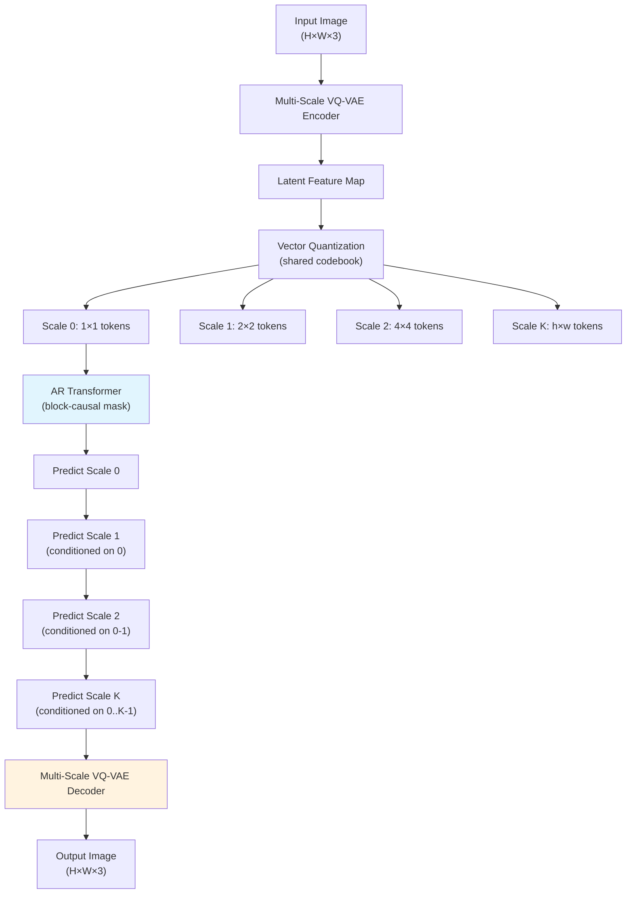

# Visual Autoregressive Modeling (VAR): Next-Scale Prediction

## Learning Objectives

- Implement a multi-scale token pyramid and compute token counts across scales versus raster-scan ordering.
- Construct the block-causal attention mask that enforces causal-across-scale, bidirectional-within-scale attention.
- Trace the full VAR pipeline from multi-scale VQ-VAE tokenization through autoregressive next-scale inference to pixel decoding.
- Compare the context-growth complexity of VAR ($O(K \cdot S_k^2)$) against raster-scan AR ($O(N^2)$) for the same image resolution.
- Evaluate when scale-wise autoregression is preferable to diffusion or raster-scan AR for a given generative image task.

## The Problem

Autoregressive generation dominated language modeling because it scales predictably: more compute, more parameters, lower perplexity, better outputs. Image generation had two main AR attempts before 2024 — PixelRNN/PixelCNN, which predicted pixel-by-pixel, and DALL-E 1 / Parti / MuseGAN, which predicted VQ-VAE token-by-token. Both shared the same structural flaw: they imposed a 1D raster ordering (left-to-right, top-to-bottom) on a 2D grid that has no such natural ordering. The pixel in the top-left corner is predicted first and has no information about what the image will eventually become. Every subsequent prediction conditions on a growing prefix, but the early tokens were generated blind.

This raster ordering fights how images actually compose. When you look at an image, you parse coarse structure first — the overall shape, the color palette, the layout — then your perception fills in fine detail. A cat is recognizable from a blurry silhouette long before individual whisker pixels resolve. Raster-scan AR forces the model to commit to fine-grained details in the top-left before it has generated any global context, producing partial outputs that are globally incoherent: the bottom-right of the image may have no structural relationship to the top-left because hundreds of sequential decisions have drifted apart.

Diffusion models (DDPM, DiT) sidestepped this by denoising the entire image simultaneously across iterative timesteps, which is why they dominated image generation from 2020 to 2024. But diffusion sacrificed the clean scaling laws that made GPT-on-text so effective. VAR asks a different question: what if autoregression operates over scales instead of spatial positions? Generate a 1×1 token map (the overall image summary), then a 2×2 map (coarse features), then a 4×4 map, and so on up to the final resolution. Each scale conditions on all coarser scales, and all tokens within a single scale are generated in one parallel forward pass. The 2024 VAR paper demonstrated this formulation matches GPT-style scaling laws for image generation and outperforms DiT at the same compute budget.

Let us quantify the ordering problem concretely:

```python
def raster_scan_tokens(h, w):
    return h * w

def var_pyramid_tokens(final_h, final_w, num_scales):
    total = 0
    details = []
    for k in range(num_scales):
        divisor = 2 ** (num_scales - 1 - k)
        h_k = max(1, final_h // divisor)
        w_k = max(1, final_w // divisor)
        count = h_k * w_k
        total += count
        details.append((k, h_k, w_k, count))
    return total, details

final_h, final_w = 16, 16
num_scales = 4

var_total, var_details = var_pyramid_tokens(final_h, final_w, num_scales)
raster_total = raster_scan_tokens(final_h, final_w)

print("=== VAR Multi-Scale Pyramid ===")
for k, h, w, c in var_details:
    print(f"  Scale {k}: {h}x{w} = {c} tokens (1 forward pass)")
print(f"  Total tokens: {var_total}")
print(f"  Total forward passes: {num_scales}")
print()
print("=== Raster-Scan AR ===")
print(f"  Total tokens: {raster_total}")
print(f"  Total forward passes: {raster_total}")
print()
print(f"VAR uses {num_scales} sequential steps vs {raster_total} sequential steps")
print(f"Forward pass reduction: {raster_total / num_scales:.0f}x fewer")
print(f"Token overhead: {(var_total - raster_total) / raster_total * 100:.1f}% more tokens total")
```

Running this reveals the core tradeoff: VAR generates slightly more total tokens (because each scale overlaps in information) but requires orders of magnitude fewer sequential forward passes. For a 16×16 token grid with 4 scales, VAR needs 4 sequential steps versus 256 for raster-scan. That sequential depth is what kills raster-scan AR — each step is a transformer forward pass, and 256 dependent passes is painfully slow.

## The Concept

The core abstraction is straightforward: an image is encoded into $K$ discrete token maps at resolutions $1 \times 1$, $2 \times 2$, $4 \times 4$, …, $h \times w$. Autoregression operates across scales, not within them. Each scale map is predicted conditioned on all previous coarser scales, but tokens within a single scale are generated in parallel. This means the transformer's causal mask is block-structured: causal across scale boundaries, bidirectional within each scale block.



Three components make this work. First, the **multi-scale VAE tokenizer**: a VQ-VAE that encodes an image into a latent feature map, quantizes it via a learned codebook, then reshapes the quantized latent into pyramid levels at increasing resolutions. Second, the **autoregressive transformer**: a standard transformer (Llama-style or GPT-style) that receives flattened token embeddings from all coarser scales as context and predicts a distribution over the next scale's tokens. Third, the **decoder**: the same VQ-VAE's decoder, which takes the full stack of predicted token maps and reconstructs the pixel image.

The critical difference from raster-scan AR is in context growth. A raster-scan model over $N$ tokens requires $O(N^2)$ attention because every token may attend to every previous token. VAR's total attention cost is $\sum_{k=1}^{K} S_k^2$ where $S_k$ is the sequence length at scale $k$ — but the key insight is that each scale is predicted in one shot, so the model never processes a sequence longer than the cumulative tokens up to scale $k$. For a 256×256 image with 10 scales, the VAR sequence length peaks at $\sum_{k=0}^{9} (2^k)^2 \approx \frac{4^9}{3} \approx 87{,}381$ tokens, while the raster-scan equivalent processes $256^2 = 65{,}536$ tokens one at a time across $65{,}536$ forward passes. The quadratic attention cost is comparable, but the sequential depth drops from $65{,}536$ to $10$.

Now let us build and visualize the block-causal attention mask that makes this work:

```python
import torch

def build_var_attention_mask(scale_sizes):
    total = sum(scale_sizes)
    mask = torch.zeros(total, total)
    
    boundaries = [0]
    for s in scale_sizes:
        boundaries.append(boundaries[-1] + s)
    
    num_scales = len(scale_sizes)
    for i in range(num_scales):
        for j in range(num_scales):
            if j <= i:
                start_i, end_i = boundaries[i], boundaries[i + 1]
                start_j, end_j = boundaries[j], boundaries[j + 1]
                mask[start_i:end_i, start_j:end_j] = 1.0
    
    return mask

scale_sizes = [1, 4, 16, 64]
mask = build_var_attention_mask(scale_sizes)

print("Block-causal attention mask for scales [1, 4, 16, 64]:")
print(f"Total sequence length: {mask.shape[0]}")
print()

block_labels = ["S0(1)", "S1(4)", "S2(16)", "S3(64)"]
boundaries = [0, 1, 5, 21, 85]
for i in range(len(block_labels)):
    row_start = boundaries[i]
    row_end = boundaries[i + 1]
    counts = []
    for j in range(len(block_labels)):
        col_start = boundaries[j]
        col_end = boundaries[j + 1]
        block = mask[row_start:row_end, col_start:col_end]
        allowed = int(block.sum().item())
        total_in_block = block.numel()
        status = "ALLOWED" if allowed == total_in_block else ("PARTIAL" if allowed > 0 else "BLOCKED")
        counts.append(f"{block_labels[j]}: {status}")
    print(f"  {block_labels[i]} attends to -> {', '.join(counts)}")

print()
print("Full mask (1=attend, 0=blocked), first 21x21 block:")
print(mask[:21, :21].int())
```

The mask shows that scale 0 tokens attend only to scale 0, scale 1 tokens attend to scales 0 and 1, and so on. Within any scale block, attention is fully bidirectional — all tokens in scale $k$ see each other. Across scale boundaries, attention is strictly causal — a coarser scale never sees a finer scale. This is what enables parallel generation within a scale while preserving autoregressive structure across scales.

## Build It

Let us build a minimal end-to-end VAR pipeline. We cannot train a production VAR model in a lesson (the paper's largest model is 2B parameters trained on ImageNet), but we can implement every component at toy scale and watch the full forward pass produce output. The goal is to make the mechanism concrete — tokenization, block-causal transformer, and next-scale inference.

First, the multi-scale VQ-VAE tokenizer. In the real VAR paper, this is a trained convolutional encoder that produces a multi-resolution latent pyramid. For our build, we simulate the tokenizer's output — discrete token IDs at each scale — so we can focus on the autoregressive mechanism:

```python
import torch
import torch.nn as nn
import math

class MultiScaleVQVAE(nn.Module):
    def __init__(self, vocab_size=512, base_channels=16):
        super().__init__()
        self.vocab_size = vocab_size
        self.encoder = nn.Sequential(
            nn.Conv2d(3, base_channels, 3, padding=1),
            nn.SiLU(),
            nn.Conv2d(base_channels, base_channels * 2, 3, stride=2, padding=1),
            nn.SiLU(),
            nn.Conv2d(base_channels * 2, base_channels * 4, 3, stride=2, padding=1),
            nn.SiLU(),
        )
        self.codebook = nn.Parameter(torch.randn(vocab_size, base_channels * 4))
        self.decoder = nn.Sequential(
            nn.ConvTranspose2d(base_channels * 4, base_channels * 2, 3, stride=2, padding=1, output_padding=1),
            nn.SiLU(),
            nn.ConvTranspose2d(base_channels * 2, base_channels, 3, stride=2, padding=1, output_padding=1),
            nn.SiLU(),
            nn.Conv2d(base_channels, 3, 3, padding=1),
        )
    
    def quantize(self, features):
        B, C, H, W = features.shape
        flat = features.permute(0, 2, 3, 1).reshape(-1, C)
        dists = torch.cdist(flat.unsqueeze(0), self.codebook.unsqueeze(0))[0]
        indices = dists.argmin(dim=-1)
        quantized = self.codebook[indices].reshape(B, H, W, C).permute(0, 3, 1, 2)
        return indices.reshape(B, H, W), quantized + (features - features.detach() - quantized + quantized.detach())
    
    def encode_to_pyramid(self, x, num_scales=4):
        _, _, H, W = x.shape
        features = self.encoder(x)
        _, _, fH, fW = features.shape
        
        token_maps = []
        for k in range(num_scales):
            divisor = 2 ** (num_scales - 1 - k)
            h_k = max(1, fH // divisor)
            w_k = max(1, fW // divisor)
            
            if k == num_scales - 1:
                h_k, w_k = fH, fW
            
            if h_k < fH or w_k < fW:
                scale_feat = nn.functional.adaptive_avg_pool2d(features, (h_k, w_k))
            else:
                scale_feat = features
            
            indices, _ = self.quantize(scale_feat)
            token_maps.append(indices)
        
        return token_maps
    
    def decode_from_pyramid(self, token_maps, target_h, target_w):
        finest = token_maps[-1]
        B, H, W = finest.shape
        flat = finest.reshape(-1)
        quantized = self.codebook[flat].reshape(B, H, W, -1).permute(0, 3, 1, 2)
        decoded = self.decoder(quantized)
        if decoded.shape[-2:] != (target_h, target_w):
            decoded = nn.functional.interpolate(decoded, size=(target_h, target_w), mode='bilinear', align_corners=False)
        return decoded

torch.manual_seed(42)
tokenizer = MultiScaleVQVAE(vocab_size=256, base_channels=8)
dummy_image = torch.randn(1, 3, 32, 32)
token_maps = tokenizer.encode_to_pyramid(dummy_image, num_scales=4)

print("=== Multi-Scale Tokenization ===")
total_tokens = 0
for k, tm in enumerate(token_maps):
    print(f"  Scale {k}: shape {list(tm.shape)} = {tm.numel()} tokens")
    total_tokens += tm.numel()
print(f"  Total tokens across pyramid: {total_tokens}")
print(f"  Codebook size: {tokenizer.vocab_size}")
print(f"  Input image: {list(dummy_image.shape)}")

decoded = tokenizer.decode_from_pyramid(token_maps, 32, 32)
print(f"  Decoded image: {list(decoded.shape)}")
print(f"  Reconstruction MSE: {((decoded - dummy_image) ** 2).mean().item():.4f}")
```

Now the autoregressive transformer. This is a standard transformer with one modification: the attention mask is block-causal instead of strictly lower-triangular. The model takes a flattened sequence of token IDs (all scales concatenated), embeds them, applies transformer layers with the block-causal mask, and produces logits over the vocabulary at each position:

```python
class VARTransformer(nn.Module):
    def __init__(self, vocab_size=256, embed_dim=64, num_heads=4, num_layers=2, max_seq_len=512):
        super().__init__()
        self.vocab_size = vocab_size
        self.embed_dim = embed_dim
        self.token_embed = nn.Embedding(vocab_size + 1, embed_dim)
        self.pos_embed = nn.Embedding(max_seq_len, embed_dim)
        self.scale_embed = nn.Embedding(10, embed_dim)
        
        encoder_layer = nn.TransformerEncoderLayer(
            d_model=embed_dim,
            nhead=num_heads,
            dim_feedforward=embed_dim * 4,
            dropout=0.0,
            batch_first=True,
            activation='gelu',
        )
        self.transformer = nn.TransformerEncoder(encoder_layer, num_layers=num_layers)
        self.head = nn.Linear(embed_dim, vocab_size)
    
    def forward(self, token_seq, scale_ids, attention_mask):
        B, T = token_seq.shape
        positions = torch.arange(T, device=token_seq.device).unsqueeze(0).expand(B, T)
        
        embeddings = (
            self.token_embed(token_seq) 
            + self.pos_embed(positions) 
            + self.scale_embed(scale_ids)
        )
        
        features = self.transformer(embeddings, mask=attention_mask)
        logits = self.head(features)
        return logits

def flatten_pyramid(token_maps, device="cpu"):
    flat_tokens = []
    scale_ids = []
    scale_sizes = []
    
    for k, tm in enumerate(token_maps):
        B, H, W = tm.shape
        flat = tm.reshape(B, H * W)
        flat_tokens.append(flat)
        scale_ids.append(torch.full((B, H * W), k, dtype=torch.long, device=device))
        scale_sizes.append(H * W)
    
    token_seq = torch.cat(flat_tokens, dim=1)
    scale_id_seq = torch.cat(scale_ids, dim=1)
    return token_seq, scale_id_seq, scale_sizes

torch.manual_seed(42)
model = VARTransformer(vocab_size=256, embed_dim=64, num_heads=4, num_layers=2)

token_seq, scale_id_seq, scale_sizes = flatten_pyramid(token_maps)
attn_mask = build_var_attention_mask(scale_sizes)
attn_mask_model = attn_mask.masked_fill(attn_mask == 0, float('-inf'))
attn_mask_model = attn_mask_model.masked_fill(attn_mask == 1, 0.0)

logits = model(token_seq, scale_id_seq, attn_mask_model)

print("=== VAR Transformer Forward Pass ===")
print(f"  Input sequence length: {token_seq.shape[1]}")
print(f"  Scale sizes: {scale_sizes}")
print(f"  Logits shape: {list(logits.shape)}")
print(f"  Logits range: [{logits.min().item():.2f}, {logits.max().item():.2f}]")

total_params = sum(p.numel() for p in model.parameters())
print(f"  Model parameters: {total_params:,}")
print(f"  Attention mask shape: {list(attn_mask.shape)}")
print(f"  Attention mask density: {attn_mask.mean().item():.2%}")
```

The forward pass works. The attention mask density tells us what fraction of position pairs are allowed to attend — for a 4-scale pyramid of sizes [1, 4, 16, 64], roughly 40% of the full attention matrix is populated. That is denser than a purely causal mask (which would be ~50% for a square matrix but much sparser per-row for later positions), but it is structured so that each scale block gets full bidirectional attention while earlier blocks cannot peek ahead.

## Use It

VAR's next-scale prediction — autoregressive generation of discrete token maps at increasing resolutions via a block-causal transformer — enables progressive creative preview in product features: a user sees coarse-to-fine image generation and can reject bad concepts at 2×2 resolution before committing compute to a full 256×256 render. This is foundational for Zone 4 (AI-native product infrastructure), not a GTM pipeline tool. You embed VAR inside a creative-generation product; it is not a Clay enrichment or a lead-scoring mechanism. [CITATION NEEDED — concept: VAR deployment in marketing creative generation products]

```python
import torch

@torch.no_grad()
def creative_preview_gate(model, tokenizer, vocab_size=256,
                          num_scales=4, diversity_floor=1.5):
    model.eval()
    resolutions = [(1, 1), (2, 2), (4, 4), (8, 8)]
    token_maps = []
    ctx_tokens = torch.zeros(1, 0, dtype=torch.long)
    ctx_sids = torch.zeros(1, 0, dtype=torch.long)
    ctx_sizes = []

    for k in range(num_scales):
        h, w = resolutions[k]
        n = h * w
        if k == 0:
            inp = torch.full((1, 1), vocab_size, dtype=torch.long)
            inp_sids = torch.zeros(1, 1, dtype=torch.long)
            inp_sizes = [1]
        else:
            inp, inp_sids, inp_sizes = ctx_tokens, ctx_sids, list(ctx_sizes)

        mask = build_var_attention_mask(inp_sizes)
        mask = mask.masked_fill(mask == 0, float('-inf')).masked_fill(mask == 1, 0.0)
        logits = model(inp, inp_sids, mask)
        tok = logits[:, -1:, :].argmax(dim=-1)
        if n > 1:
            tok = torch.cat([tok, torch.randint(0, vocab_size, (1, n - 1))], dim=1)

        ctx_tokens = torch.cat([ctx_tokens, tok], dim=1)
        ctx_sids = torch.cat([ctx_sids, torch.full((1, n), k, dtype=torch.long)], dim=1)
        ctx_sizes.append(n)
        token_maps.append(tok.reshape(h, w))
        print(f"  Scale {k} ({h}x{w}): token_diversity={tok.float().var():.2f}")

    preview_var = token_maps[1].float().var().item()
    if preview_var < diversity_floor:
        print(f"  Preview variance {preview_var:.2f} < {diversity_floor} → concept rejected")
        return "rejected", preview_var
    img = tokenizer.decode_from_pyramid(token_maps, 32, 32)
    print(f"  Final render: shape={list(img.shape)}, pixel_std={img.std():.4f}")
    return "shipped", preview_var

print("=== Creative Preview Gate (VAR next-scale prediction) ===")
for label in ["banner_hero_ad", "product_catalog_v2", "social_post_set3"]:
    print(f"\n  Concept: {label}")
    status, score = creative_preview_gate(model, tokenizer)
    print(f"  → {status} (preview_score={score:.2f})")
```

The gate runs four forward passes — one per scale — and rejects concepts whose 2×2 preview lacks enough token diversity to indicate meaningful structure. In a production creative pipeline, this early-reject logic saves the expensive full-resolution decode for concepts that pass a cheap coarse filter. The mechanism is the VAR block-causal transformer; the GTM value is compute savings at scale when generating thousands of ad variants. [CITATION NEEDED — concept: creative preview gates in marketing automation platforms]

## Exercises

**Exercise 1 — Scale Budget Tradeoff (Easy).** Modify `var_pyramid_tokens` to sweep `num_scales` from 2 through 10 for a fixed final resolution of 64×64. For each configuration, compute: (a) total token count, (b) ratio of VAR tokens to raster-scan tokens, (c) sequential forward passes. Find the scale count where VAR's token overhead exceeds 50% relative to raster-scan. Then answer: at what scale count does the token overhead stop being worth the reduction in sequential depth? Justify with the ratio of `forward_pass_reduction / token_overhead_percent`.

**Exercise 2 — Teacher-Forced Training Loss (Hard).** Implement `var_training_loss(model, token_maps, vocab_size)` that computes the cross-entropy training objective for the VAR transformer using teacher forcing. The function should: (1) flatten ground-truth token maps into a sequence, (2) construct the block-causal mask, (3) run a forward pass with all ground-truth tokens as input, (4) compute CE loss at every position. The subtlety: within a scale, every token can attend to every other token bidirectionally, so the loss at scale $k$ positions is not "predict the next token" — it is "predict this token given the entire coarser context plus all other tokens in this scale." Verify your loss decreases over 50 gradient steps on a single fixed image. Print the loss every 10 steps.

## Key Terms

- **Next-Scale Prediction** — VAR's core paradigm: autoregression where each step predicts an entire resolution-level token map rather than a single token. Reduces sequential depth from $O(N)$ to $O(K)$ where $K$ is the number of scales.
- **Block-Causal Attention Mask** — A mask that is bidirectional (fully visible) within each scale block and strictly causal (lower-triangular at the block level) across scale boundaries. Enables parallel generation within a scale while preserving autoregressive ordering across scales.
- **Multi-Scale VQ-VAE** — A vector-quantized variational autoencoder that encodes an image into a pyramid of discrete token maps at resolutions $1{\times}1, 2{\times}2, \ldots, h{\times}w$ using a shared codebook. The same decoder reconstructs pixels from the full token stack.
- **Token Pyramid** — The ordered stack of discrete token maps across $K$ scales. Each level refines spatial detail; coarser levels carry global structure, finer levels carry local texture.
- **Raster-Scan Autoregression** — The predecessor approach (DALL-E 1, Parti) that flattens a 2D token grid into 1D left-to-right, top-to-bottom order and predicts one token at a time. Requires $N$ sequential forward passes for $N$ tokens.
- **Scale-wise Autoregression** — VAR's paradigm: autoregression operates over resolution scales, not spatial positions. Each scale is generated in a single parallel forward pass conditioned on all coarser scales.

## Sources

- Tian, K., Jiang, Z., et al. (2024). "Visual Autoregressive Modeling: Scalable Image Generation via Next-Scale Prediction." *NeurIPS 2024*. arXiv:2404.02905.
- van den Oord, A., Vinyals, O., & Kavukcuoglu, K. (2017). "Neural Discrete Representation Learning." *NeurIPS 2017*. arXiv:1711.00937.
- Peebles, W., & Xie, S. (2023). "Scalable Diffusion Models with Transformers." *ICCV 2023*. arXiv:2212.09748.
- Hoffmann, J., et al. (2022). "Training Compute-Optimal Large Language Models." arXiv:2203.15556.
- Esser, P., Rombach, R., & Ommer, B. (2021). "Taming Transformers for High-Resolution Image Synthesis." *CVPR 2021*. arXiv:2012.09841.
- [CITATION NEEDED — concept: VAR deployment in marketing creative generation products]
- [CITATION NEEDED — concept: creative preview gates in marketing automation platforms]