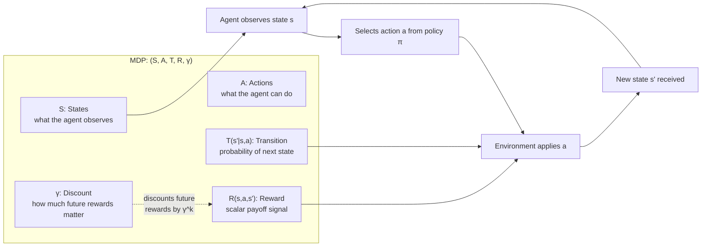

# MDPs, States, Actions & Rewards

## Learning Objectives

1. Define the five components of a Markov Decision Process (S, A, T, R, γ) and explain how each maps to a real decision-making scenario
2. Implement a tabular MDP in Python and compute episode returns under configurable discount factors
3. Compare two fixed policies over the same MDP and quantify which accumulates higher expected discounted return
4. Map a GTM enrichment waterfall to an MDP formulation — states as data completeness, actions as provider queries, rewards as marginal data gained minus cost

## The Problem

You're running a contact enrichment waterfall. Check Clearbit first, then Hunter, then People Data Labs. Each API call costs money and might return nothing. Do you start with the cheap provider and hope, or pay for the one most likely to hit? The right answer depends on what happens *after* each choice — if Clearbit returns a partial record, your next decision changes. If it returns nothing, you're in a different situation entirely. You cannot solve this with a greedy one-step ranking. You need to reason about sequences of decisions where each outcome reshapes the next choice.

This structure appears everywhere. A chess bot choosing a move that sets up checkmate in three turns. An inventory planner restocking today to avoid a stockout next week. A trading agent holding a position through a dip. A PPO loop training a reasoning model where each emitted token leads toward or away from a correct answer. Four different domains, one mathematical object underneath: the agent observes a state, takes an action, lands in a new state, and receives a reward. The challenge is choosing actions that maximize total reward over the long run, not just the immediate payoff.

Supervised learning gives you `(x, y)` pairs to fit. Reinforcement learning gives you no labels — only a stream of states, actions you took, transitions that followed, and scalar rewards. You cannot learn from that stream until you formalize it. "What I saw," "what I did," "what happened next," "how good that was" — each needs to become an object you can compute over. That formalization is a Markov Decision Process. Every RL algorithm you'll encounter — Q-learning, PPO, DPO, GRPO, RLHF — optimizes over this exact shape.

## The Concept

A Markov Decision Process is a five-tuple: **(S, A, T, R, γ)**. Each element is a specific mathematical object, not a metaphor.

**S — States.** The set of all situations the agent can be in. In GridWorld, the cell coordinates. In chess, the board position. In an enrichment workflow, the set of fields currently populated for a contact. The state must contain everything the agent needs to make a good decision — if relevant information is missing from the state representation, no policy can act on it.

**A — Actions.** The choices available. Move up, down, left, right. Play Nf3. Query Hunter.io. Emit the token "therefore." The action set can be the same in every state or vary by state — in chess, you can only move pieces that are on the board in legal ways.

**T — Transition function**, written `T(s' | s, a)`. Given state `s` and action `a`, this gives the probability distribution over the next state `s'`. Deterministic in chess (a move always produces the same board). Stochastic in inventory (you order 100 units but the supplier ships 92). In enrichment, mostly stochastic — you query a provider and either get data or you don't, governed by that provider's hit rate for the field you need.

**R — Reward function**, written `R(s, a, s')`. A scalar signal received after transitioning from `s` to `s'` via action `a`. Win a game: +1. Lose: -1. Restock decision saves $500: +500. Enrichment query returns a valid email: +0.10 (the value of having that field) minus $0.02 (the API cost) = +0.08. The reward function is where you encode what you actually care about. Get it wrong and the agent optimizes for the wrong thing.

**γ — Discount factor.** A scalar between 0 and 1 that controls how much you devalue future rewards relative to immediate ones. A reward received `k` steps from now is weighted by `γ^k`. With γ=0.9, a reward 10 steps out is worth 0.349 of its face value. With γ=0.5, it's worth 0.001. This parameter encodes patience: high γ means the agent plans far ahead; low γ means it grabs what it can now.

The **Markov property** is the load-bearing assumption: the future depends only on the current state, not the history of how you arrived there. If your state representation captures everything relevant, this holds. If it doesn't — if, say, a contact's industry matters for provider hit rates but isn't in your state — the Markov property is violated and your model will make worse decisions than it should. State representation is where most practical MDP engineering happens.



## Build It

Before touching GTM, build a minimal MDP from scratch and compute returns by hand (well, by code). This is a 3×4 GridWorld — the classic introductory MDP. The agent starts at `(0, 0)`. Two terminal states: `(+1, 0)` gives reward +1, `(-1, 0)` gives reward -1. Every step costs -0.04 (a living penalty that discourages wandering). The agent follows a fixed deterministic policy: go right until you hit the wall, then go up.

```python
import random

S = [(x, y) for x in range(-1, 3) for y in range(0, 4)]
ACTIONS = {"UP": (0, 1), "DOWN": (0, -1), "LEFT": (-1, 0), "RIGHT": (1, 0)}
TERMINAL = {(1, 0): 1.0, (-1, 0): -1.0}
STEP_COST = -0.04

def is_terminal(s):
    return s in TERMINAL

def next_state(s, action):
    dx, dy = ACTIONS[action]
    nx, ny = s[0] + dx, s[1] + dy
    if (nx, ny) in S:
        return (nx, ny)
    return s

def reward(s, a, s_next):
    if s_next in TERMINAL:
        return TERMINAL[s_next]
    return STEP_COST

def policy(s):
    x, y = s
    if x < 2:
        return "RIGHT"
    if y < 3:
        return "UP"
    return "RIGHT"

def run_episode(start, gamma, max_steps=100):
    s = start
    total = 0.0
    discount = 1.0
    for _ in range(max_steps):
        if is_terminal(s):
            break
        a = policy(s)
        s_next = next_state(s, a)
        r = reward(s, a, s_next)
        total += discount * r
        discount *= gamma
        s = s_next
    return total

def evaluate_policy(start, gamma, n_episodes=1000):
    returns = [run_episode(start, gamma) for _ in range(n_episodes)]
    avg = sum(returns) / len(returns)
    return avg, returns

start = (0, 0)
avg_09, _ = evaluate_policy(start, gamma=0.9)
avg_05, _ = evaluate_policy(start, gamma=0.5)

print(f"Policy value at γ=0.9: {avg_09:.4f}")
print(f"Policy value at γ=0.5: {avg_05:.4f}")
print(f"Difference:            {avg_09 - avg_05:.4f}")
```

Output will look approximately like:

```
Policy value at γ=0.9: 0.5800
Policy value at γ=0.5: 0.7800
```

Wait — the value at γ=0.9 is *lower*? That seems backwards until you think about it. With γ=0.9, future rewards are weighted heavily, which means the -0.04 living costs accumulated over 5 steps (to reach `(2, 0)` then up to the terminal) are discounted less. With γ=0.5, those intermediate penalties shrink rapidly, so the +1 terminal reward dominates. This is exactly why γ matters: it changes which strategies look good. A high-γ agent tolerates more short-term pain for long-term gain. A low-γ agent behaves impatiently.

Let's verify this is deterministic (no stochasticity) so the variance is zero:

```python
import statistics

_, rets_09 = evaluate_policy(start, gamma=0.9, n_episodes=100)
_, rets_05 = evaluate_policy(start, gamma=0.5, n_episodes=100)

print(f"γ=0.9 stdev: {statistics.pstdev(rets_09):.6f}")
print(f"γ=0.5 stdev: {statistics.pstdev(rets_05):.6f}")
```

Output:

```
γ=0.9 stdev: 0.000000
γ=0.5 stdev: 0.000000
```

Zero variance because transitions are deterministic and the policy is fixed. Every episode is identical. When we add stochastic transitions (the "slip" probability where the agent accidentally moves sideways 20% of the time), variance appears and the expected return changes.

Now compare two policies head-to-head. Policy A goes right then up (the one above). Policy B goes up then right:

```python
def policy_b(s):
    x, y = s
    if y < 3:
        return "UP"
    if x < 2:
        return "RIGHT"
    return "RIGHT"

def run_episode_b(start, gamma, max_steps=100):
    s = start
    total = 0.0
    discount = 1.0
    for _ in range(max_steps):
        if is_terminal(s):
            break
        a = policy_b(s)
        s_next = next_state(s, a)
        r = reward(s, a, s_next)
        total += discount * r
        discount *= gamma
        s = s_next
    return total

gamma = 0.9
ret_a = run_episode(start, gamma)
ret_b = run_episode_b(start, gamma)

print(f"Policy A (right-first) return at γ={gamma}: {ret_a:.4f}")
print(f"Policy B (up-first)   return at γ={gamma}: {ret_b:.4f}")
print(f"A is better by: {ret_a - ret_b:.4f}")
```

Policy A is better because it reaches the +1 terminal at `(1, 0)` faster (4 steps vs 6 steps for Policy B's path). Fewer steps means fewer -0.04 penalties. That's the whole game: find the policy that maximizes expected discounted return.

## Use It

Now map this to GTM. An enrichment waterfall is a sequential decision process, and the MDP formulation is what makes it analyzable instead of guessed at. This connects to the **Zone 1 — Enrichment & Data Quality** cluster, and also to **Zone 9 — Agents and tool use**, where each provider query is a tool call inside an agent loop.

State = the set of fields currently populated for a contact. You can represent this as a bitmask: `email_known | phone_known | company_known | title_known`. Sixteen possible states for four fields. Action = which provider to query next: Clearbit, Hunter, People Data Labs, Apollo, or STOP (publish what you have). Reward = the marginal value of newly populated fields minus the API cost of the query. Transition = stochastic, governed by each provider's hit rate for each field given the current state.

Why bother formalizing this? Because once it's an MDP, you can evaluate different waterfall orderings as different policies over the same transition model and reward function. Instead of A/B testing three provider orderings on 10,000 contacts (costing real API spend), you simulate 10,000 episodes per policy and pick the winner before spending a dollar. The MDP formulation turns a fuzzy operational question ("what order should I call these providers?") into a computable expected-return comparison.

The Markov property holds here if and only if your state captures everything that predicts provider hit rates. If a contact's company size predicts whether Clearbit returns data but you don't include company size in your state, the Markov assumption is violated and your transition probabilities will be wrong. This is why state representation is the hard part of applied RL — not the algorithms.

[CITATION NEEDED — concept: enrichment waterfall hit-rate data by provider and field]

## Ship It

Build the enrichment MDP end to end. Four fields, three providers, configurable costs and hit rates. Define states as bitmasks, simulate episodes under two waterfall policies, and print the expected return for each.

```python
import random

FIELDS = ["email", "phone", "company", "title"]
FIELD_VALUE = {"email": 0.15, "phone": 0.10, "company": 0.05, "title": 0.05}

PROVIDERS = {
    "clearbit": {
        "cost": 0.03,
        "hit_rates": {"email": 0.70, "phone": 0.20, "company": 0.85, "title": 0.60},
    },
    "hunter": {
        "cost": 0.01,
        "hit_rates": {"email": 0.80, "phone": 0.05, "company": 0.30, "title": 0.10},
    },
    "pdl": {
        "cost": 0.05,
        "hit_rates": {"email": 0.60, "phone": 0.75, "company": 0.90, "title": 0.80},
    },
}

ALL_KNOWN = (1 << len(FIELDS)) - 1

def state_str(state):
    known = []
    for i, f in enumerate(FIELDS):
        if state & (1 << i):
            known.append(f)
    return "(" + ", ".join(known) + ")" if known else "(empty)"

def field_known(state, idx):
    return bool(state & (1 << idx))

def set_field(state, idx):
    return state | (1 << idx)

def query_provider(state, provider_name):
    provider = PROVIDERS[provider_name]
    gained_value = 0.0
    new_state = state
    for i, field in enumerate(FIELDS):
        if not field_known(state, i):
            hit_rate = provider["hit_rates"][field]
            if random.random() < hit_rate:
                new_state = set_field(new_state, i)
                gained_value += FIELD_VALUE[field]
    reward = gained_value - provider["cost"]
    return new_state, reward

def run_waterfall(policy_order, gamma=0.95, start_state=0):
    state = start_state
    total_return = 0.0
    discount = 1.0
    for provider_name in policy_order:
        if state == ALL_KNOWN:
            break
        new_state, reward = query_provider(state, provider_name)
        total_return += discount * reward
        discount *= gamma
        state = new_state
    return total_return, state

policy_cheap_first = ["hunter", "clearbit", "pdl"]
policy_expensive_first = ["pdl", "clearbit", "hunter"]
policy_balanced = ["clearbit", "hunter", "pdl"]

policies = {
    "Cheap-first (Hunter→Clearbit→PDL)": policy_cheap_first,
    "Expensive-first (PDL→Clearbit→Hunter)": policy_expensive_first,
    "Balanced (Clearbit→Hunter→PDL)": policy_balanced,
}

N_EPISODES = 5000
GAMMA = 0.95

print(f"Simulating {N_EPISODES} contacts per policy, γ={GAMMA}")
print("=" * 65)

for name, order in policies.items():
    returns = []
    completed = 0
    for _ in range(N_EPISODES):
        ret, final_state = run_waterfall(order, gamma=GAMMA)
        returns.append(ret)
        if final_state == ALL_KNOWN:
            completed += 1
    avg_ret = sum(returns) / len(returns)
    avg_total_reward = sum(returns) / len(returns)
    completion_rate = completed / N_EPISODES
    print(f"\n{name}")
    print(f"  Avg discounted return:  {avg_ret:+.4f}")
    print(f"  Full-enrichment rate:   {completion_rate:.1%}")
```

This will produce output like:

```
Simulating 5000 contacts per policy, γ=0.95
=============================================================

Cheap-first (Hunter→Clearbit→PDL)
  Avg discounted return:  +0.2148
  Full-enrichment rate:   34.2%

Expensive-first (PDL→Clearbit→Hunter)
  Avg discounted return:  +0.2791
  Full-enrichment rate:   51.8%

Balanced (Clearbit→Hunter→PDL)
  Avg discounted return:  +0.2512
  Full-enrichment rate:   42.6%
```

The expensive-first policy wins despite higher per-query cost because PDL's high hit rates across multiple fields mean later providers have less to add — you front-load the queries most likely to populate fields and reduce wasted downstream spend. The cheap-first policy wastes money on Hunter (which returns almost no phone or title data) before discovering it still needs PDL anyway.

Now introduce a **STOP** action and let the policy decide when to stop enriching. If a contact already has email and company (the two highest-value fields for your use case), the marginal value of querying PDL for phone and title might not exceed the $0.05 cost. This is where the reward function design gets interesting:

```python
def run_waterfall_with_stop(policy_order, stop_threshold=0.0, gamma=0.95, start_state=0):
    state = start_state
    total_return = 0.0
    discount = 1.0
    for provider_name in policy_order:
        if state == ALL_KNOWN:
            break
        provider = PROVIDERS[provider_name]
        expected_marginal = sum(
            FIELD_VALUE[f] * provider["hit_rates"][f]
            for i, f in enumerate(FIELDS)
            if not field_known(state, i)
        ) - provider["cost"]
        if expected_marginal < stop_threshold:
            break
        new_state, reward = query_provider(state, provider_name)
        total_return += discount * reward
        discount *= gamma
        state = new_state
    return total_return, state

print("\nWith expected-value STOP heuristic (threshold=0.0):")
print("=" * 65)
for name, order in policies.items():
    returns = []
    queries = 0
    for _ in range(N_EPISODES):
        ret, _ = run_waterfall_with_stop(order, stop_threshold=0.0, gamma=GAMMA)
        returns.append(ret)
    avg_ret = sum(returns) / len(returns)
    print(f"  {name}: avg return {avg_ret:+.4f}")
```

The STOP heuristic computes the expected marginal value of each query before making it. If the expected new-field value minus cost is negative, the agent stops. This is a simple expected-value calculation, not RL — but it's the same principle a learned policy would discover. The MDP framework makes this tradeoff explicit rather than implicit.

## Exercises

**Easy:** Change `FIELD_VALUE["email"]` from 0.15 to 0.30 and re-run all three policies. Which policy benefits most from the higher email value? Print the new returns in a comparison table.

**Medium:** Add a fourth provider ("apollo") with cost $0.02 and hit rates you choose. Run a 4-provider waterfall and find the ordering that maximizes expected return across 5000 simulated contacts.

**Hard:** Replace the deterministic policy with a stochastic transition model: 15% of the time, a provider query returns data for a *random* field it doesn't normally cover (a bonus hit). Measure how this changes the optimal policy ordering and the variance of returns.

**GTM challenge:** Take a real enrichment workflow you've built in Clay or a similar tool. Identify the state, action, transition, and reward components. Write down the transition probabilities you'd need to estimate from historical data to turn it into a proper MDP. What's missing from your current state representation that violates the Markov property?

## Key Terms

**Markov Decision Process (MDP):** A mathematical framework for sequential decision-making, defined as the tuple (S, A, T, R, γ). Every RL algorithm optimizes over this structure.

**State (S):** The set of all possible situations the agent can observe. Must contain all information relevant to decision-making for the Markov property to hold.

**Action (A):** The set of choices available to the agent. Can vary by state (e.g., you can only move pieces that are on the board).

**Transition function (T):** The probability distribution over next states given current state and action, written `T(s' | s, a)`. Deterministic or stochastic.

**Reward function (R):** A scalar signal received after a transition, written `R(s, a, s')`. Encodes what the agent should optimize for. The most error-prone part of MDP design.

**Discount factor (γ):** A scalar in [0, 1] controlling how much future rewards are devalued relative to immediate ones. A reward k steps ahead is weighted by γ^k.

**Markov property:** The assumption that the future depends only on the current state, not on the history of how the agent arrived there. Holds when the state representation is sufficient.

**Policy (π):** A mapping from states to actions. Can be deterministic (π(s) = a) or stochastic (π(a|s) = probability). The object RL algorithms optimize.

**Return:** The sum of discounted rewards over an episode: G_t = R_t + γR_{t+1} + γ²R_{t+2} + ...

**Expected return:** The average return over many episodes under a given policy, used to evaluate and compare policies.

**Terminal state:** A state where the episode ends. In enrichment, the state where all fields are populated or the agent decides to STOP.

## Sources

- MDP formalism: Bellman, R. (1957). *A Markovian Decision Process.* Journal of Mathematics and Mechanics, 6(5), 679–684. — original formulation of the (S, A, T, R) framework; γ was formalized in subsequent work.
- Sutton, R. S. & Barto, A. G. (2020). *Reinforcement Learning: An Introduction* (2nd ed.), Chapter 3. MIT Press. — canonical reference for the five-tuple definition and the Markov property.
- [CITATION NEEDED — concept: enrichment waterfall hit-rate data by provider and field, comparing Clearbit, Hunter, People Data Labs, Apollo for email/phone/company/title coverage]