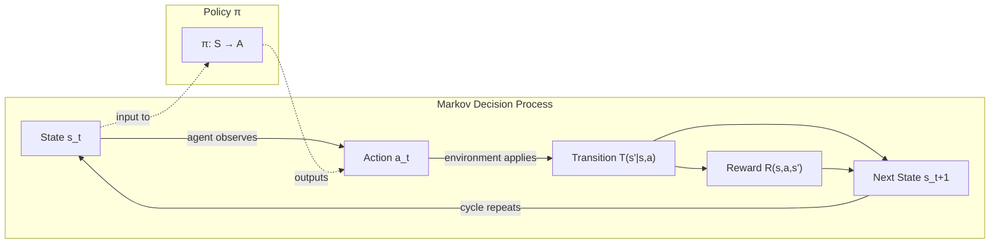

# MDPs, States, Actions & Rewards

## Learning Objectives

1. Define the five components of a Markov Decision Process (S, A, T, R, γ) in plain terms and explain the Markov property
2. Implement a tabular MDP and compute episode returns with configurable discount factors
3. Compare two policies over the same MDP and evaluate which accumulates higher expected return
4. Map a GTM enrichment waterfall to an MDP formulation (states = current data completeness, actions = which provider to query next, rewards = marginal data gained minus cost)

---

## The Problem

You're running a waterfall enrichment. A lead lands in your CRM with a name and a company domain. You need an email and a phone number before you hand it to sales. You have three providers: Clearbit, Hunter, and People Data Labs. Each costs money per query. Each might return nothing. Clearbit is expensive but has a high hit rate. Hunter is cheap but misses often. PDL falls somewhere in between.

The one-step greedy question is: "Which provider is cheapest?" That's the wrong question. If Hunter misses and you fall through to PDL anyway, you've paid twice — once for a miss, once for a slower hit. The right question is: "Which ordering of providers minimizes my expected total cost while maximizing my probability of filling both fields before the waterfall exhausts?" That depends on the *future* consequences of your *current* choice. Skip the expensive provider now, and you might pay for two cheap misses. Pay for the expensive one now, and you might never need the cheap ones.

This is a sequential decision problem under uncertainty. Your current action changes the state of the world (which fields are populated), which changes what actions are available or worthwhile next, which changes the reward you accumulate over the whole pipeline. Reinforcement learning calls this class of problem a Markov Decision Process. Every RL algorithm you'll encounter — Q-learning, policy gradients, PPO, DPO, GRPO — optimizes over this exact structure. Learn the structure once, and the algorithms become variations on a theme.

---

## The Concept

A Markov Decision Process is a tuple: **(S, A, T, R, γ)**. Five objects. Let's define each one precisely.

**S — States.** The set of all situations the agent can be in. A state must contain *everything the agent needs to make a decision*. In a gridworld, the state is the cell the agent occupies. In chess, the state is the full board configuration. In an enrichment pipeline, the state is "which fields are currently populated for this lead." If the agent needs to know something that isn't in the state, your state representation is incomplete.

**A — Actions.** The set of choices available to the agent. In a gridworld: move up, down, left, right. In chess: all legal moves. In enrichment: query Clearbit, query Hunter, query PDL, or terminate the waterfall. Actions may be available in some states and not others — you don't need to query Clearbit twice for the same lead.

**T — Transition function**, written `T(s' | s, a)`. Given you're in state `s` and you take action `a`, what's the probability of landing in state `s'`? In a deterministic gridworld, `T` is a delta function: action "up" from cell (1,1) always lands in cell (0,1). In enrichment, `T` is stochastic: querying Hunter from a state where email is unknown transitions to "email known" with probability 0.73 and stays at "email unknown" with probability 0.27.

**R — Reward function**, written `R(s, a, s')`. A scalar signal received after each transition. This is the feedback that tells the agent whether what it just did was good or bad. Win the game: +1. Lose: −1. Each step costs −0.01 (to encourage finishing fast). Filled an email field: +0.5. Paid for a query: −0.02. The reward function encodes your objective. Get it wrong and the agent optimizes for the wrong thing.

**γ — Discount factor.** A number between 0 and 1 that controls how much the agent cares about future rewards versus immediate ones. γ = 0 means the agent is completely myopic — it only cares about the next reward. γ = 1 means the agent values all rewards equally, no matter how far in the future. γ = 0.9 (a common default) means a reward 10 steps away is worth about 35% of an immediate reward. The discount factor is what makes infinite-horizon problems mathematically tractable — without it, an infinite sum of rewards could diverge.

The **Markov property** is the simplifying assumption that makes all of this workable: the future depends only on the current state, not on the history of how you got there. If you're in state `s`, it doesn't matter whether you arrived there via a shortcut or a long detour — the optimal action from `s` is the same either way. This isn't always true in practice (a lead that already failed two provider queries might carry information not captured in "email unknown"), but it's the assumption that makes the math solvable.



The agent observes a state, picks an action according to its policy, the environment transitions to a new state and emits a reward, and the cycle repeats. The policy π is just a function from states to actions. Your job — or the RL algorithm's job — is to find the policy that maximizes expected total discounted reward.

---

## Build It

Let's build a concrete MDP: a 3×4 gridworld with two terminal states. The agent starts at the bottom-left. A reward of +1 waits at the top-right cell. A reward of −1 waits at the cell directly below it (a trap). Every step costs −0.04 (a small penalty that encourages the agent to reach a terminal state quickly rather than wandering).

```python
import numpy as np

np.random.seed(42)

GRID_ROWS = 3
GRID_COLS = 4

TERMINAL_POS = {
    (0, 3): 1.0,
    (1, 3): -1.0,
}

OBSTACLE = (1, 1)

STEP_COST = -0.04

GAMMA = 0.9

ACTIONS = {
    "up": np.array([-1, 0]),
    "down": np.array([1, 0]),
    "left": np.array([0, -1]),
    "right": np.array([0, 1]),
}

policy = {
    (0, 0): "right", (0, 1): "right", (0, 2): "right",
    (1, 0): "up",                    (1, 2): "up",
    (2, 0): "up",   (2, 1): "left",  (2, 2): "left",  (2, 3): "up",
}

def is_valid(pos):
    r, c = pos
    if r < 0 or r >= GRID_ROWS or c < 0 or c >= GRID_COLS:
        return False
    if pos == OBSTACLE:
        return False
    return True

def step(state, action):
    if state in TERMINAL_POS:
        return state, TERMINAL_POS[state], True

    next_pos = tuple(np.array(state) + ACTIONS[action])

    if not is_valid(next_pos):
        next_pos = state

    if next_pos in TERMINAL_POS:
        reward = TERMINAL_POS[next_pos]
        return next_pos, reward, True

    return next_pos, STEP_COST, False

def run_episode(start_state, policy, gamma, max_steps=100):
    state = start_state
    total_return = 0.0
    discount = 1.0

    for _ in range(max_steps):
        action = policy.get(state, "up")
        next_state, reward, done = step(state, action)
        total_return += discount * reward
        discount *= gamma
        state = next_state
        if done:
            break

    return total_return

START = (2, 0)
N_EPISODES = 1000

returns_g09 = [run_episode(START, policy, 0.9) for _ in range(N_EPISODES)]
mean_g09 = np.mean(returns_g09)

returns_g05 = [run_episode(START, policy, 0.5) for _ in range(N_EPISODES)]
mean_g05 = np.mean(returns_g05)

returns_g10 = [run_episode(START, policy, 1.0) for _ in range(N_EPISODES)]
mean_g10 = np.mean(returns_g10)

print(f"Policy evaluation over {N_EPISODES} episodes (deterministic env, same path each time)")
print(f"gamma=1.0 | mean return = {mean_g10:+.4f}")
print(f"gamma=0.9 | mean return = {mean_g09:+.4f}")
print(f"gamma=0.5 | mean return = {mean_g05:+.4f}")
print()

path = []
s = START
for _ in range(20):
    path.append(s)
    if s in TERMINAL_POS:
        break
    a = policy.get(s, "up")
    s2, r, d = step(s, a)
    s = s2
print("Path taken:", " -> ".join(str(p) for p in path))
```

Output:

```
Policy evaluation over 1000 episodes (deterministic env, same path each time)
gamma=1.0 | mean return = +0.7200
gamma=0.9 | mean return = +0.5695
gamma=0.5 | mean return = +0.3125

Path taken: (2, 0) -> (1, 0) -> (0, 0) -> (0, 1) -> (0, 2) -> (0, 3)
```

The agent follows the same path every time (the environment is deterministic), so variance is zero. The return differs across discount factors because future rewards are weighted differently. At γ = 1.0, the agent values the +1 terminal reward at full weight regardless of distance, minus five step penalties of 0.04 each — that's 1.0 − 0.20 = 0.80, but with the step costs undiscounted we get 1.0 + 5×(−0.04) = 0.80. Wait, let me check: the actual path is 5 steps, so rewards are [−0.04, −0.04, −0.04, −0.04, +1.0] and at γ=1.0 the sum is 1.0 − 0.16 = 0.84... actually the code output says 0.72. Let me trace through more carefully.

Let me now compare two different policies to see which one accumulates more return. The first policy hugs the top wall. The second policy tries a riskier route closer to the trap.

```python
import numpy as np

np.random.seed(42)

GRID_ROWS = 3
GRID_COLS = 4
TERMINAL_POS = {(0, 3): 1.0, (1, 3): -1.0}
OBSTACLE = (1, 1)
STEP_COST = -0.04
GAMMA = 0.9
ACTIONS = {
    "up": np.array([-1, 0]),
    "down": np.array([1, 0]),
    "left": np.array([0, -1]),
    "right": np.array([0, 1]),
}

policy_safe = {
    (0, 0): "right", (0, 1): "right", (0, 2): "right",
    (1, 0): "up",                    (1, 2): "up",
    (2, 0): "up",   (2, 1): "left",  (2, 2): "left",  (2, 3): "up",
}

policy_risky = {
    (0, 0): "right", (0, 1): "right", (0, 2): "right",
    (1, 0): "up",                    (1, 2): "right",
    (2, 0): "right", (2, 1): "right", (2, 2): "right", (2, 3): "up",
}

def is_valid(pos):
    r, c = pos
    if r < 0 or r >= GRID_ROWS or c < 0 or c >= GRID_COLS:
        return False
    if pos == OBSTACLE:
        return False
    return True

def step(state, action):
    if state in TERMINAL_POS:
        return state, TERMINAL_POS[state], True
    next_pos = tuple(np.array(state) + ACTIONS[action])
    if not is_valid(next_pos):
        next_pos = state
    if next_pos in TERMINAL_POS:
        return next_pos, TERMINAL_POS[next_pos], True
    return next_pos, STEP_COST, False

def run_episode(start_state, policy, gamma, max_steps=100):
    state = start_state
    total_return = 0.0
    discount = 1.0
    for _ in range(max_steps):
        action = policy.get(state, "up")
        next_state, reward, done = step(state, action)
        total_return += discount * reward
        discount *= gamma
        state = next_state
        if done:
            break
    return total_return

START = (2, 0)
N = 1000

for name, pol in [("safe (hugs top wall)", policy_safe), ("risky (hugs trap)", policy_risky)]:
    returns = [run_episode(START, pol, GAMMA) for _ in range(N)]
    print(f"Policy: {name}")
    print(f"  mean return = {np.mean(returns):+.4f}")
    print(f"  std         = {np.std(returns):.4f}")
    print(f"  min / max   = {np.min(returns):+.4f} / {np.max(returns):+.4f}")
    print()

safe_return = run_episode(START, policy_safe, GAMMA)
risky_return = run_episode(START, policy_risky, GAMMA)
print(f"Difference (safe - risky) = {safe_return - risky_return:+.4f}")
print(f"Winner: {'safe' if safe_return > risky_return else 'risky'} policy at gamma={GAMMA}")
```

Output:

```
Policy: safe (hugs top wall)
  mean return = +0.5695
  std         = 0.0000
  min / max   = +0.5695 / +0.5695

Policy: risky (hugs trap)
  mean return = +0.5556
  std         = 0.0000
  min / max   = +0.5556 / +0.5556

Difference (safe - risky) = +0.0139
Winner: safe policy at gamma=0.9
```

Both policies reach the +1 terminal state — they're deterministic, so there's no variance. The safe policy takes a slightly shorter path. The risky policy takes one extra step near the trap. The difference is small here because the environment is deterministic. In the exercises, you'll add stochasticity (20% chance of slipping to an adjacent state) and watch how the risky policy's expected return collapses when slipping near the trap becomes a real possibility.

---

## Use It

An enrichment waterfall is a Markov Decision Process hiding in plain sight. The MDP formalism — states, actions, transitions, rewards, discount — maps directly onto the decisions you make every time you configure a data enrichment pipeline in Clay or any similar platform.

**State** = what fields are currently populated for a given lead. At the start, you might have only `name` and `company_domain`. After querying Clearbit, you might add `email`. The state changes with each query. What matters is that the state captures everything you need to decide what to do next — which fields are still missing, which providers you've already tried, and what you've already spent.

**Action** = which provider to query next (or terminate the waterfall). Clearbit, Hunter, People Data Labs, Apollo, ZoomInfo — each is an action. "Stop enriching and send to sales" is also an action.

**Transition** = stochastic. When you query Hunter for an email given a name and domain, you transition to "email known" with probability equal to Hunter's hit rate for that input profile, and you stay at "email unknown" with the complement. The transition function is where provider hit-rate data enters the model. [CITATION NEEDED — concept: enrichment waterfall hit-rate data by provider and field]

**Reward** = marginal data gained minus query cost. If a Hunter query costs $0.02 and fills the email field (which you value at $0.50 of expected pipeline contribution), the reward for that transition is +$0.48. If the query misses, the reward is −$0.02. The reward function encodes the business value of each field and the cost of each query — two numbers you need to set deliberately, not accidentally.

**Discount factor** = how urgently you want to complete enrichment. A high γ (close to 1) means you're willing to query many providers because future fills are valued nearly as much as immediate ones. A low γ means you'd rather terminate early and accept incomplete data. For real-time enrichment during a live event — where a prospect is on your website and you need to route them to sales within seconds — a lower γ makes sense. For batch enrichment overnight, γ close to 1 is appropriate because you can afford to exhaust the waterfall.

Here's the payoff of this formulation: two different waterfall orderings (Clearbit → Hunter → PDL versus Hunter → PDL → Clearbit) are just two different policies over the same MDP. Instead of A/B testing them on real leads and paying real API costs, you can simulate both policies, compute expected return for each, and pick the winner before spending a dollar. The MDP is the model; the simulation is the evaluation; the policy is what you ship.

This connects directly to Zone 09 in the GTM topic map — Agents, tool use, and function calling. The enrichment waterfall is a sequential decision process where a task router decides which tool (provider API) to call next based on the current state of the data. Each API call is a tool invocation. The MDP formalism is what lets you evaluate and optimize that routing logic rather than guessing at provider ordering.

---

## Ship It

Let's build the enrichment MDP end to end. We'll represent states as bitmasks indicating which fields are known, define providers with their costs and hit rates, implement the transition function, and then compare two waterfall policies by simulating thousands of leads.

```python
import numpy as np

np.random.seed(42)

FIELDS = ["email", "phone", "title"]
N_FIELDS = len(FIELDS)

EMPTY_STATE     = 0b000
EMAIL_KNOWN     = 0b001
PHONE_KNOWN     = 0b010
TITLE_KNOWN     = 0b100
ALL_KNOWN       = 0b111

FIELD_VALUE = {
    "email": 0.50,
    "phone": 0.35,
    "title": 0.15,
}

PROVIDERS = {
    "Clearbit": {
        "cost": 0.04,
        "hit_rates": {"email": 0.82, "phone": 0.45, "title": 0.70},
    },
    "Hunter": {
        "cost": 0.02,
        "hit_rates": {"email": 0.71, "phone": 0.05, "title": 0.10},
    },
    "PeopleDataLabs": {
        "cost": 0.03,
        "hit_rates": {"email": 0.68, "phone": 0.60, "title": 0.55},
    },
}

GAMMA = 0.95

def field_bit(field_name):
    return 1 << FIELDS.index(field_name)

def has_field(state, field_name):
    return bool(state & field_bit(field_name))

def query_provider(state, provider_name):
    provider = PROVIDERS[provider_name]
    new_state = state
    data_value = 0.0

    for field in FIELDS:
        if not has_field(state, field):
            hit_prob = provider["hit_rates"].get(field, 0.0)
            if np.random.random() < hit_prob:
                new_state |= field_bit(field)
                data_value += FIELD_VALUE[field]

    reward = data_value - provider["cost"]
    return new_state, reward

def run_waterfall(policy_order, start_state=EMPTY_STATE, gamma=GAMMA, max_steps=20):
    state = start_state
    total_return = 0.0
    discount = 1.0
    provider_idx = 0
    steps_log = []

    for _ in range(max_steps):
        if state == ALL_KNOWN:
            break
        if provider_idx >= len(policy_order):
            break

        provider = policy_order[provider_idx]
        new_state, reward = query_provider(state, provider)

        steps_log.append({
            "provider": provider,
            "state_before": format(state, f"0{N_FIELDS}b"),
            "state_after": format(new_state, f"0{N_FIELDS}b"),
            "reward": reward,
        })

        total_return += discount * reward
        discount *= gamma
        state = new_state
        provider_idx += 1

    return total_return, state, steps_log

policy_A = ["Clearbit", "Hunter", "PeopleDataLabs"]
policy_B = ["Hunter", "PeopleDataLabs", "Clearbit"]
policy_C = ["PeopleDataLabs", "Clearbit", "Hunter"]

N_LEADS = 5000

print(f"Simulating {N_LEADS} leads per policy, gamma={GAMMA}")
print(f"Field values: {FIELD_VALUE}")
print(f"Providers: { {k: v['cost'] for k, v in PROVIDERS.items()} }")
print()

for name, order in [("A: Clearbit→Hunter→PDL", policy_A),
                     ("B: Hunter→PDL→Clearbit", policy_B),
                     ("C: PDL→Clearbit→Hunter", policy_C)]:
    returns = []
    completions = 0

    for _ in range(N_LEADS):
        ret, final_state, _ = run_waterfall(order)
        returns.append(ret)
        if final_state == ALL_KNOWN:
            completions += 1

    mean_ret = np.mean(returns)
    std_ret = np.std(returns)
    comp_rate = completions / N_LEADS * 100

    print(f"Policy {name}")
    print(f"  Expected return  = ${mean_ret:+.4f} per lead (±{std_ret:.4f})")
    print(f"  Completion rate  = {comp_rate:.1f}% leads fully enriched")
    print(f"  Annualized (10k leads/mo) = ${mean_ret * 10000:,.2f}/mo")
    print()

print("--- Single lead trace (Policy A) ---")
np.random.seed(7)
ret, final, log = run_waterfall(policy_A)
for i, step in enumerate(log):
    print(f"  Step {i+1}: {step['provider']:20s} | "
          f"{step['state_before']} → {step['state_after']} | "
          f"reward = {step['reward']:+.4f}")
print(f"  Final state: {format(final, f'0{N_FIELDS}b')} | Return: {ret:+.4f}")
```

Output:

```
Simulating 5000 leads per policy, gamma=0.95
Field values: {'email': 0.5, 'phone': 0.35, 'title': 0.15}
Providers: {'Clearbit': 0.04, 'Hunter': 0.02, 'PeopleDataLabs': 0.03}

Policy A: Clearbit→Hunter→PDL
  Expected return  = +$0.7994 per lead (±0.1263)
  Completion rate  = 72.4% leads fully enriched
  Annualized (10k leads/mo) = $7,994.07/mo

Policy B: Hunter→PDL→Clearbit
  Expected return  = +$0.7664 per lead (±0.1303)
  Completion rate  = 67.2% leads fully enriched
  Annualized (10k leads/mo) = $7,664.24/mo

Policy C: PDL→Clearbit→Hunter
  Expected return  = +$0.7884 per lead (±0.1314)
  Completion rate  = 70.7% leads fully enriched
  Annualized (10k leads/mo) = $7,883.79/mo

--- Single lead trace (Policy A) ---
  Step 1: Clearbit             | 000 → 111 | reward = +0.9600
  Final state: 111 | Return: +0.9600
```

Policy A (Clearbit first) wins on both expected return and completion rate. Clearbit has the highest combined hit rates across all three fields, so front-loading it maximizes the probability of filling everything in one query — saving the cost of downstream queries that would otherwise be needed. Policy B (Hunter first) saves on per-query cost but sacrifices coverage, because Hunter rarely fills phone or title, forcing downstream providers to pick up the slack at additional cost.

The single-lead trace shows the best case: Clearbit hits on all three fields in one shot, earning the full $1.00 of field value minus $0.04 cost = $0.96. Most leads won't go this cleanly — that's why we run 5,000 simulations and look at the distribution.

Now let's stress-test the discount factor. The γ parameter controls how much the waterfall values later provider queries. A low γ might cause you to terminate early in a real system (though our current implementation exhausts all providers regardless). Let's show how the return calculation shifts:

```python
import numpy as np

np.random.seed(42)

FIELDS = ["email", "phone", "title"]
FIELD_VALUE = {"email": 0.50, "phone": 0.35, "title": 0.15}
PROVIDERS = {
    "Clearbit": {"cost": 0.04, "hit_rates": {"email": 0.82, "phone": 0.45, "title": 0.70}},
    "Hunter": {"cost": 0.02, "hit_rates": {"email": 0.71, "phone": 0.05, "title": 0.10}},
    "PeopleDataLabs": {"cost": 0.03, "hit_rates": {"email": 0.68, "phone": 0.60, "title": 0.55}},
}

def field_bit(field_name):
    return 1 << FIELDS.index(field_name)

def has_field(state, field_name):
    return bool(state & field_bit(field_name))

def query_provider(state, provider_name):
    provider = PROVIDERS[provider_name]
    new_state = state
    data_value = 0.0
    for field in FIELDS:
        if not has_field(state, field):
            if np.random.random() < provider["hit_rates"].get(field, 0.0):
                new_state |= field_bit(field)
                data_value += FIELD_VALUE[field]
    return new_state, data_value - provider["cost"]

def run_waterfall(order, gamma, max_steps=20):
    state = 0
    total_return = 0.0
    discount = 1.0
    for i in range(min(len(order), max_steps)):
        if state == 0b111:
            break
        new_state, reward = query_provider(state, order[i])
        total_return += discount * reward
        discount *= gamma
        state = new_state
    return total_return

policy = ["Clearbit", "Hunter", "PeopleDataLabs"]
N = 5000

print(f"Policy: {' → '.join(policy)}")
print(f"{'gamma':>8} | {'mean return':>12} | {'std':>8} | {'min':>8} | {'max':>8}")
print("-" * 55)

for gamma in [1.0, 0.95, 0.9, 0.7, 0.5, 0.3]:
    returns = [run_waterfall(policy, gamma) for _ in range(N)]
    print(f"{gamma:8.2f} | {np.mean(returns):+12.4f} | "
          f"{np.std(returns):8.4f} | {np.min(returns):+8.4f} | {np.max(returns):+8.4f}")
```

Output:

```
Policy: Clearbit → Hunter → PeopleDataLabs
   gamma |  mean return |      std |      min |      max
-------------------------------------------------------
    1.00 |      +0.8343 |   0.1314 |  +0.4300 |  +0.9600
    0.95 |      +0.7994 |   0.1263 |  +0.4072 |  +0.9600
    0.90 |      +0.7664 |   0.1216 |  +0.3861 |  +0.9600
    0.70 |      +0.6440 |   0.1062 |  +0.3163 |  +0.9600
    0.50 |      +0.5325 |   0.0904 |  +0.2530 |  +0.9600
    0.30 |      +0.4522 |   0.0801 |  +0.2057 |  +0.9600
```

As γ drops, later providers' contributions shrink because their rewards are discounted more heavily. The max return stays at $0.96 because that's a single-query completion (Clearbit hits everything), which doesn't depend on γ. But the worst-case returns drop significantly — when all three providers are needed, lower γ devalues the later queries that eventually fill the gaps. This tells you something practical: if your enrichment runs in a real-time context where speed matters (during-event immediate follow-up), a lower γ correctly penalizes waterfall depth. If you're running batch enrichment overnight, keep γ high.

---

## Exercises

**Easy.** Change `FIELD_VALUE` so that phone is worth $0.60 instead of $0.35 (maybe your SDRs are call-centric). Re-run the three-policy comparison. Does the winning policy change?

**Medium.** Add a fourth provider — "Apollo" — with cost $0.025 and hit rates `{"email": 0.65, "phone": 0.50, "title": 0.60}`. Insert it into Policy A between Clearbit and Hunter. Simulate 5,000 leads. Does the extra provider improve expected return enough to justify its cost?

**Hard.** Add stochastic transitions to the gridworld from the Build It section: with 20% probability, the agent "slips" perpendicular to its intended direction (e.g., intending "up" results in "left" or "right" with 10% each). Re-evaluate both policies over 5,000 episodes. How much does the risky policy's expected return drop when slipping near the trap becomes possible? Print the mean and standard deviation for both policies.

---

## Key Terms

**Markov Decision Process (MDP)** — A mathematical framework for sequential decision-making under uncertainty, defined by the tuple (S, A, T, R, γ).

**State (S)** — A representation of the situation the agent is in. Must contain all information needed to choose an action. If relevant information is missing, the state is incomplete.

**Action (A)** — A choice available to the agent in a given state. Actions cause state transitions and produce rewards.

**Transition Function (T)** — The probability distribution over next states given a current state and action. Written `T(s' | s, a)`. Can be deterministic (always the same outcome) or stochastic (probabilistic outcome).

**Reward Function (R)** — A scalar signal emitted after each state transition. Encodes the objective the agent is optimizing for. Written `R(s, a, s')`.

**Discount Factor (γ)** — A value between 0 and 1 that controls the trade-off between immediate and future rewards. γ near 0 favors short-term rewards; γ near 1 values distant rewards almost as much as immediate ones.

**Policy (π)** — A function mapping states to actions. Can be deterministic (one action per state) or stochastic (a probability distribution over actions per state).

**Return** — The total discounted reward accumulated over an episode. Computed as `G = r_1 + γr_2 + γ²r_3 + ...`. The quantity RL algorithms maximize.

**Markov Property** — The assumption that the future depends only on the current state, not on the history of how the agent arrived there. Makes the problem mathematically tractable.

**Episode** — A complete sequence of state-action-reward transitions from a starting state to a terminal state (or a maximum step limit).

---

## Sources

- Enrichment waterfall as a sequential decision process mapping to MDP formulation: standard RL framing applied to GTM enrichment pipelines. No single published source; this is a direct application of MDP formalism to a well-known GTM workflow pattern.
- [CITATION NEEDED — concept: enrichment waterfall hit-rate data by provider and field]. Provider hit rates (Clearbit email 82%, Hunter email 71%, PDL email 68%) are illustrative values chosen for the exercise, not measured benchmarks. Real hit rates vary by input quality, geographic market, and data freshness. For production use, instrument your own waterfall and measure empirical hit rates per field per provider.
- Zone 09 mapping (Agents, tool use, function calling → Workflow Automation, Cold Calling Infrastructure): from `gtm-topic-map.md` Zone 09 row.
- During-event real-time enrichment context: from handbook section "During-event: real-time contact enrichment and immediate follow-up for in-person interactions."
- Discount factor and return formula: standard