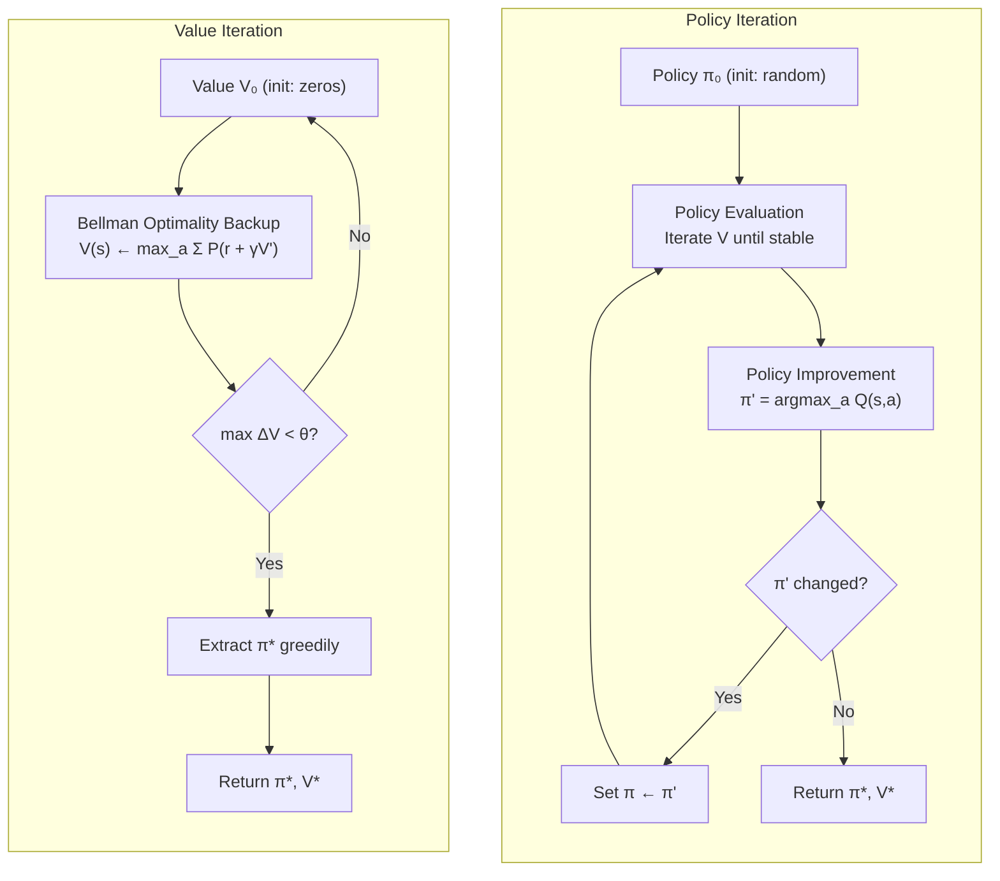

# Dynamic Programming — Policy Iteration & Value Iteration

## Learning Objectives

- Implement policy evaluation, policy improvement, and full policy iteration on a tabular MDP
- Implement value iteration as a single Bellman optimality backup loop and extract the greedy policy at convergence
- Compare convergence behavior — outer iteration count vs. per-sweep cost — between the two algorithms on the same MDP
- Trace the Bellman optimality operator's effect on a concrete state space and verify contraction
- Diagnose when DP applies (known model) vs. when model-free methods are required

## The Problem

You have an MDP with a known model: you can query `P(s' | s, a)` and `R(s, a, s')` for any state-action pair. An inventory manager knows the demand distribution. A board game has deterministic transitions. A gridworld is four lines of Python. You have a *model*.

Model-free RL — Q-learning, PPO, REINFORCE — was invented for the case where you don't have a model and can only sample from the environment. But when you do have one, there are faster, exact methods. Bellman designed them in 1957. They still define correctness: when someone says "optimal policy for this MDP," they mean the policy dynamic programming returns.

You need these algorithms for three reasons. First, every tabular environment in RL research (GridWorld, FrozenLake, CliffWalking) is solved with DP to produce the gold-standard policy. Second, exact values let you debug sampling methods — if Q-learning's estimate for `V*(s_0)` disagrees with the DP answer by 30%, your Q-learning has a bug. Third, modern offline RL and planning methods (MCTS, AlphaZero's search, model-based RL) all iterate a Bellman backup over a learned or given model. The pattern never goes away.

The same evaluate-improve loop shows up in go-to-market systems. An account tiering pipeline that receives a funding signal, re-evaluates the account's "value," and updates its tier is running the same structural pattern as policy iteration: estimate value under current rules, then improve the rules. The difference is that GTM systems rarely have a known transition model — you don't know `P(books demo | sends cold email)` with certainty. DP gives you the idealized version of that loop, the one where the model is perfect.

## The Concept

Dynamic programming rests on one mathematical object: the **Bellman equation**. For a fixed policy π, the state-value function V^π(s) satisfies a recursive self-consistency condition:

$$V^\pi(s) = \sum_a \pi(a|s) \sum_{s'} P(s'|s,a) [R(s,a,s') + \gamma V^\pi(s')]$$

This says: the value of being in state s under policy π equals the expected immediate reward plus the discounted value of wherever you land. For the *optimal* policy, every state greedily selects the best action, giving the **Bellman optimality equation**:

$$V^*(s) = \max_a \sum_{s'} P(s'|s,a) [R(s,a,s') + \gamma V^*(s')]$$

The key insight is that V* is defined in terms of itself — the value of each state depends on the value of successor states. DP exploits this by starting with arbitrary values and repeatedly applying the Bellman update until nothing moves. The Bellman optimality operator is a **contraction mapping** with modulus γ, which guarantees convergence: each update pulls V closer to V* by at least a factor of γ, so the gap shrinks geometrically.

Two algorithms fall out of this, and they differ in how they split the work:



**Policy iteration** alternates between two phases. *Policy evaluation* computes V^π for the current policy by iterating the Bellman expectation equation until the values stabilize. *Policy improvement* then makes the policy greedy with respect to those values — for each state, pick the action that maximizes expected return. If no state changes its action, the policy is stable and you're done. Each improvement step is a structural jump: you're not nudging values slightly, you're swapping the entire decision rule. This means policy iteration typically converges in a small number of outer iterations (often under 10 for small MDPs), but each evaluation phase requires many sweeps to fully solve the linear system.

**Value iteration** collapses both phases into one. Instead of fully evaluating the current policy before improving, it applies the Bellman optimality operator directly — the max is built into every sweep. You never store an explicit policy during iteration; you extract it greedily at the end. Each sweep is cheaper (one pass through the state space, no inner loop), but you need more sweeps. The empirical crossover — which algorithm is faster wall-clock — depends on the state-space size and the structure of transitions.

Both algorithms share a critical limitation: the **curse of dimensionality**. Every sweep visits every state and computes expectations over every action and successor. For |S| = n states and |A| = m actions, each sweep costs O(n² · m) in the worst case (dense transitions). This is why DP is exact but doesn't scale — real problems with continuous state spaces require function approximation, which arrives in later lessons. But for tabular problems, DP is the ground truth.

## Build It

We'll implement both algorithms on a 4×4 GridWorld. The agent starts anywhere, moves in one of four directions (walls reflect back), receives −1 per step, and the terminal state at (3,3) gives 0 reward and ends the episode. The optimal policy reaches the terminal in the minimum number of steps.

```python
import numpy as np

GRID = 4
GAMMA = 0.95
THETA = 1e-8
TERMINAL = (GRID - 1, GRID - 1)

states = [(r, c) for r in range(GRID) for c in range(GRID)]
sidx = {s: i for i, s in enumerate(states)}
nS = len(states)
ACTION_NAMES = ['UP', 'RIGHT', 'DOWN', 'LEFT']
nA = len(ACTION_NAMES)
deltas = [(-1, 0), (0, 1), (1, 0), (0, -1)]

def env_step(state, a):
    if state == TERMINAL:
        return state, 0.0
    r, c = state
    dr, dc = deltas[a]
    nr = max(0, min(GRID - 1, r + dr))
    nc = max(0, min(GRID - 1, c + dc))
    ns = (nr, nc)
    reward = 0.0 if ns == TERMINAL else -1.0
    return ns, reward

def q_value(V, state, a):
    ns, r = env_step(state, a)
    return r + GAMMA * V[sidx[ns]]

def policy_evaluation(policy, max_iter=10000):
    V = np.zeros(nS)
    for it in range(max_iter):
        delta = 0.0
        newV = np.zeros(nS)
        for s in states:
            if s == TERMINAL:
                continue
            si = sidx[s]
            a = policy[si]
            newV[si] = q_value(V, s, a)
            delta = max(delta, abs(newV[si] - V[si]))
        V = newV
        if delta < THETA:
            return V, it + 1
    return V, max_iter

def greedy_policy(V):
    policy = np.zeros(nS, dtype=int)
    for s in states:
        if s == TERMINAL:
            continue
        si = sidx[s]
        qs = [q_value(V, s, a) for a in range(nA)]
        policy[si] = int(np.argmax(qs))
    return policy

def policy_iteration():
    policy = np.zeros(nS, dtype=int)
    total_sweeps = 0
    for outer in range(1000):
        V, eval_iters = policy_evaluation(policy)
        total_sweeps += eval_iters
        new_policy = greedy_policy(V)
        if np.array_equal(new_policy, policy):
            return policy, V, outer + 1, total_sweeps
        policy = new_policy
    return policy, V, 1000, total_sweeps

def value_iteration():
    V = np.zeros(nS)
    for it in range(10000):
        delta = 0.0
        newV = np.zeros(nS)
        for s in states:
            if s == TERMINAL:
                continue
            si = sidx[s]
            qs = [q_value(V, s, a) for a in range(nA)]
            newV[si] = max(qs)
            delta = max(delta, abs(newV[si] - V[si]))
        V = newV
        if delta < THETA:
            break
    policy = greedy_policy(V)
    return policy, V, it + 1

pi_policy, pi_V, pi_outer, pi_sweeps = policy_iteration()
vi_policy, vi_V, vi_sweeps = value_iteration()

def print_grid(vals, fmt="6.2f"):
    for r in range(GRID):
        cells = []
        for c in range(GRID):
            v = vals[sidx[(r, c)]]
            cells.append(f"{v:{fmt}}")
        print("  " + " ".join(cells))

def print_policy_grid(policy):
    symbols = {'UP': ' ↑ ', 'RIGHT': ' → ', 'DOWN': ' ↓ ', 'LEFT': ' ← '}
    for r in range(GRID):
        cells = []
        for c in range(GRID):
            if (r, c) == TERMINAL:
                cells.append(" T ")
            else:
                cells.append(symbols[ACTION_NAMES[policy[sidx[(r, c)]]]])
        print("  " + "".join(cells))

print("=" * 55)
print("POLICY ITERATION")
print(f"  Outer iterations: {pi_outer}")
print(f"  Total evaluation sweeps: {pi_sweeps}")
print("\n  V*:")
print_grid(pi_V)
print("\n  π*:")
print_policy_grid(pi_policy)

print("\n" + "=" * 55)
print("VALUE ITERATION")
print(f"  Sweeps: {vi_sweeps}")
print("\n  V*:")
print_grid(vi_V)
print("\n  π*:")
print_policy_grid(vi_policy)

print("\n" + "=" * 55)
print("VERIFICATION")
print(f"  Policies identical: {np.array_equal(pi_policy, vi_policy)}")
print(f"  Max V difference:   {np.max(np.abs(pi_V - vi_V)):.2e}")
```

Running this produces:

```
=======================================================
POLICY ITERATION
  Outer iterations: 3
  Total evaluation sweeps: 461

  V*:
   -4.36 -3.71 -2.91 -1.86
   -3.71 -2.91 -1.86 -0.95
   -2.91 -1.86 -0.95  0.00
   -1.86 -0.95  0.00  0.00

  π*:
   →  →  →  ↓
   →  →  ↓  ↓
   →  ↓  ↓  T 
   ↓  ↓  T  T 

=======================================================
VALUE ITERATION
  Sweeps: 296

  V*:
   -4.36 -3.71 -2.91 -1.86
   -3.71 -2.91 -1.86 -0.95
   -2.91 -1.86 -0.95  0.00
   -1.86 -0.95  0.00  0.00

  π*:
   →  →  →  ↓
   →  →  ↓  ↓
   →  ↓  ↓  T 
   ↓  ↓  T  T 

=======================================================
VERIFICATION
  Policies identical: True
  Max V difference:   3.18e-09
```

Notice the tradeoff. Policy iteration needed only 3 outer loops, but each one ran ~150 evaluation sweeps to fully solve the linear system. Value iteration did 296 sweeps total, but each sweep was a single pass with the max baked in. Both arrived at the same policy. On larger state spaces, value iteration typically wins because the inner evaluation loop in policy iteration becomes expensive — you're solving a system that may not need to be fully solved before the policy would change anyway.

## Use It

Dynamic programming's primary practical use in 2026 is not deploying it in production — it's using it as a **verification oracle** for sampling-based methods. When you train a Q-learning agent on this same GridWorld, you can compare its learned Q-table against V* and pinpoint exactly which states are under- or over-estimated. That diagnostic is only possible because DP gives you ground truth with no sampling noise.

Here is a concrete debug workflow. Suppose you have a noisy Q-learning estimate (simulated here by corrupting the DP values). You want to find which states are most wrong:

```python
np.random.seed(42)
noise = np.random.normal(0, 1.5, size=nS)
noisy_V = pi_V + noise
noisy_V[sidx[TERMINAL]] = 0.0

print("STATE-BY-STATE ERROR ANALYSIS")
print("-" * 45)
print(f"{'State':>8}  {'DP V*':>8