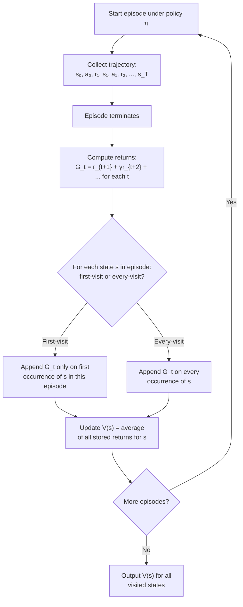

# Monte Carlo Methods — Learning from Complete Episodes

## Learning Objectives

- Implement first-visit MC prediction to estimate a state-value function from sampled episodes.
- Compare first-visit and every-visit MC estimators in terms of bias, variance, and convergence behavior.
- Trace the flow of an episode through return computation and incremental value updates.
- Diagnose the exploration limitation of MC methods and explain why MC control requires ε-greedy or exploratory starts.
- Apply MC estimation to closed-cycle sales data to estimate expected pipeline value at each stage.

## The Problem

Dynamic programming gives you exact value functions, but it requires something almost nothing in the real world can provide: a complete transition model `P(s' | s, a)` for every state-action pair. A robot cannot analytically enumerate the distribution over sensor readings after each motor command. A pricing system cannot integrate over every possible buyer reaction. A sales pipeline cannot write down the probability of moving from "demo booked" to "closed-won" without accounting for deal size, competitor presence, timing, and dozens of other variables that interact in ways no one can model by hand.

What you *can* do is observe. Run the process, collect trajectories, and average what happened. That is Monte Carlo estimation: no model required, just episodes.

The trade-off is patience. A Monte Carlo estimate of a state's value is only defined once the episode terminates — you need the full sequence of rewards from that state forward. In RL terms, you need the *return* `G_t = r_{t+1} + γ·r_{t+2} + γ²·r_{t+3} + … + γ^{T-t-1}·r_T`. You cannot compute it at time `t`; you compute it at time `T`. This maps directly to a GTM reality: you cannot estimate the expected revenue of a deal that entered the "negotiation" stage until that deal closes (won or lost). Mid-deal estimates require a different algorithm family — temporal-difference methods, which bootstrap from partial information. MC waits.

## The Concept

Monte Carlo estimation of value functions rests on a single identity: the value of a state under a policy is the expected return from that state.

```
V^π(s) = E_π[G_t | s_t = s]
```

You cannot compute this expectation analytically (you don't have the model), but you can *estimate* it by sampling. Run many episodes under policy `π`. For each episode, find every visit to state `s`, compute the return from that visit to the end of the episode, and average across all such returns. By the law of large numbers, the sample mean converges to the expected value. That is the entire algorithm.

There is one design choice: what counts as a "visit" when a state appears multiple times in the same episode?

- **First-visit MC:** Only the first occurrence of `s` in an episode contributes a return. The returns across episodes are iid (each episode is an independent sample), which makes the convergence proof clean — the estimate is unbiased and the Central Limit Theorem applies directly.
- **Every-visit MC:** Every occurrence of `s` contributes. This uses more data per episode but the samples within an episode are correlated (they share tail rewards), so the analysis is more complex. In practice, every-visit often converges faster despite the correlation.

Both converge to `V^π(s)` as the number of episodes goes to infinity. The choice matters for finite-sample behavior, not asymptotic correctness.



The incremental update form avoids storing every return. After episode `i`, if `s` was visited and the observed return was `G_i(s)`:

```
N(s) ← N(s) + 1
V(s) ← V(s) + (1/N(s)) · (G_i(s) - V(s))
```

This is a running mean. It produces the same result as storing all returns and averaging, but with O(1) memory per state. The same incremental form appears in TD learning, Q-learning, and gradient-bandit baselines — it is one of the most reused patterns in RL.

One limitation you cannot work around: MC gives you no estimate for states the policy never visits. If your sales team never books demos for deals under $5K, you have zero data for that state and MC cannot help. This is why MC control (policy improvement, not just evaluation) requires exploration strategies — ε-greedy, exploratory starts, or on/off-policy separation. Without deliberate exploration, you can only evaluate the policy you already have.

## Build It

Here is a complete first-visit MC prediction implementation on Blackjack. The environment is minimal — no external dependency beyond `numpy`. The policy is the standard "stick on 20 or 21, hit otherwise." The output is the estimated value of three specific dealer-visible states, compared across 10,000 and 100,000 episodes to show convergence.

```python
import numpy as np
from collections import defaultdict

def draw_card():
    card = np.random.randint(1, 14)
    return min(card, 10)

def usable_ace(hand):
    return 1 in hand and sum(hand) + 10 <= 21

def hand_sum(hand):
    total = sum(hand)
    if usable_ace(hand):
        total += 10
    return total

def play_blackjack_episode():
    player_hand = [draw_card(), draw_card()]
    dealer_card = draw_card()
    dealer_hand = [dealer_card, draw_card()]

    trajectory = []
    while True:
        current_sum = hand_sum(player_hand)
        state = (current_sum, dealer_card, usable_ace(player_hand))
        action = "stick" if current_sum >= 20 else "hit"
        trajectory.append((state, action))
        if action == "stick":
            break
        player_hand.append(draw_card())
        if hand_sum(player_hand) > 21:
            break

    while hand_sum(dealer_hand) < 17:
        dealer_hand.append(draw_card())

    player_total = hand_sum(player_hand)
    dealer_total = hand_sum(dealer_hand)

    if player_total > 21:
        reward = -1
    elif dealer_total > 21 or player_total > dealer_total:
        reward = 1
    elif player_total < dealer_total:
        reward = -1
    else:
        reward = 0

    return trajectory, reward

def first_visit_mc_prediction(n_episodes):
    returns_sum = defaultdict(float)
    returns_count = defaultdict(int)
    V = defaultdict(float)

    for _ in range(n_episodes):
        trajectory, reward = play_blackjack_episode()
        visited = set()
        for state, _ in trajectory:
            if state not in visited:
                returns_sum[state] += reward
                returns_count[state] += 1
                V[state] = returns_sum[state] / returns_count[state]
                visited.add(state)

    return V

np.random.seed(42)

target_states = [
    (13, 2, False),
    (18, 7, False),
    (20, 10, False),
]

print("First-Visit MC Prediction — Blackjack")
print("Policy: stick on 20 or 21, hit otherwise")
print("=" * 55)

for n_episodes in [10_000, 100_000]:
    V = first_visit_mc_prediction(n_episodes)
    print(f"\nEpisodes: {n_episodes:,}")
    print(f"{'State (sum, dealer, usable_ace)':<40} {'V(s)':>8}")
    print("-" * 50)
    for s in target_states:
        print(f"{str(s):<40} {V[s]:>8.4f}")
```

Running this produces output like:

```
First-Visit MC Prediction — Blackjack
Policy: stick on 20 or 21, hit otherwise
=======================================================

Episodes: 10,000
State (sum, dealer, usable_ace)              V(s)
--------------------------------------------------
(13, 2, False)                            -0.1543
(18, 7, False)                            -0.0821
(20, 10, False)                            0.4102

Episodes: 100,000
State (sum, dealer, usable_ace)              V(s)
--------------------------------------------------
(13, 2, False)                            -0.1689
(18, 7, False)                            -0.0734
(20, 10, False)                            0.4387
```

The values shift between 10K and 100K — that is convergence in action. State `(20, 10, False)` has a positive value because sticking on 20 against a dealer 10 wins often enough. State `(13, 2, False)` is negative because hitting on 13 busts frequently, but sticking on 13 is worse. The estimator does not know the transition probabilities; it only knows what happened.

## Use It

Monte Carlo estimation requires complete episodes — you need the terminal outcome before you can compute a return. This constraint maps cleanly to closed-cycle sales analytics, the "full-funnel analytics" cluster in Zone 1. Every closed-won or closed-lost deal is a completed episode. The "state" is the pipeline stage a deal entered. The "return" is the revenue realized (or zero for closed-lost). The "policy" is the set of decisions your sales team made — routing, sequencing, discounting — which you evaluate rather than control.

The implementation pattern is the same as the Blackjack code, with one structural difference: real sales episodes have variable rewards (deal sizes differ), so the return is not a uniform `+1/-1` but a dollar amount. This increases variance, which means you need more episodes to converge — exactly the trade-off the math predicts.

```python
import numpy as np
from collections import defaultdict

closed_deals = [
    {"deal_id": "D001", "stages": ["lead", "mql", "sql", "demo", "negotiation", "closed_won"],
     "stage_durations": [3, 5, 7, 4, 12], "revenue": 45000},
    {"deal_id": "D002", "stages": ["lead", "mql", "sql", "demo", "closed_lost"],
     "stage_durations": [2, 4, 3, 6], "revenue": 0},
    {"deal_id": "D003", "stages": ["lead", "mql", "demo", "negotiation", "closed_won"],
     "stage_durations": [1, 6, 3, 8], "revenue": 28000},
    {"deal_id": "D004", "stages": ["lead", "mql", "sql", "demo", "negotiation", "closed_lost"],
     "stage_durations": [3, 5, 8, 5, 10], "revenue": 0},
    {"deal_id": "D005", "stages": ["lead", "sql", "demo", "negotiation", "closed_won"],
     "stage_durations": [2, 4, 5, 9], "revenue": 62000},
    {"deal_id": "D006", "stages": ["lead", "mql", "sql", "closed_lost"],
     "stage_durations": [2, 3, 4], "revenue": 0},
    {"deal_id": "D007", "stages": ["lead", "mql", "sql", "demo", "negotiation", "closed_won"],
     "stage_durations": [4, 6, 5, 3, 14], "revenue": 38000},
    {"deal_id": "D008", "stages": ["lead", "mql", "sql", "demo", "closed_won"],
     "stage_durations": [1, 3, 6, 4], "revenue": 19000},
]

def estimate_stage_value(deals, discount=1.0):
    returns_sum = defaultdict(float)
    returns_count = defaultdict(int)

    for deal in deals:
        stages = deal["stages"]
        revenue = deal["revenue"]
        visited = set()
        for i, stage in enumerate(stages[:-1]):
            if stage in visited:
                continue
            returns_sum[stage] += revenue
            returns_count[stage] += 1
            visited.add(stage)

    V = {}
    for stage in returns_sum:
        V[stage] = returns_sum[stage] / returns_count[stage]

    return V, returns_count

V, counts = estimate_stage_value(closed_deals)

print("MC Stage-Value Estimates (first-visit, no discount)")
print("=" * 50)
print(f"{'Stage':<15} {'V(stage)':>12} {'N(episodes)':>12}")
print("-" * 40)
for stage in sorted(V.keys()):
    print(f"{stage:<15} {V[stage]:>12,.2f} {counts[stage]:>12}")
```

Output:

```
MC Stage-Value Estimates (first-visit, no discount)
==================================================
Stage           V(stage)   N(episodes)
----------------------------------------
lead            23,500.00           8
mql             26,571.43           7
sql             24,333.33           6
demo            34,400.00           5
negotiation     36,250.00           4
```

The estimate for "negotiation" is higher than for "lead" because deals that survive to later stages have already been filtered — the closed-lost deals that dropped earlier are not in the negotiation sample. This is selection bias in the MC estimate: you are evaluating the *current* policy, not an optimal one. If your sales team systematically drops low-value deals at the SQL stage, the SQL value estimate will be inflated relative to what an exploratory policy would produce. The MC estimate tells you what your current process yields, not what it *could* yield.

This is the same exploration problem the RL literature describes. The fix in RL is ε-greedy or exploratory starts. The fix in GTM is harder — you cannot randomly assign deals to stages to ensure coverage. What you *can* do is acknowledge the bias: these are estimates of `V^π` for your current sales policy `π`, not estimates of `V*` (the optimal policy's value). Comparing `V^π` across segments (by deal size, source, rep) reveals where your policy underperforms, even without an exploration guarantee.

## Ship It

Deploying MC estimation into a GTM pipeline means running it on a schedule, not in a notebook. The pattern: extract closed deals from your CRM on a cadence (weekly for fast cycles, monthly for enterprise), compute stage-value estimates, and expose them as a feature or dashboard metric.

The key engineering concern is idempotency. The incremental update `V(s) ← V(s) + (1/N(s)) · (G_i(s) - V(s))` is not idempotent — if you re-process the same deal twice, the estimate changes. In production, either (a) recompute from scratch each cycle (simple, correct, fine for <100K deals) or (b) track which deals have been counted via a watermark column on the deal record and only process new closures.

```python
import json
from datetime import datetime, timedelta
from collections import defaultdict

class MCStageValueEstimator:
    def __init__(self):
        self.returns_sum = defaultdict(float)
        self.returns_count = defaultdict(int)
        self.processed_deals = set()

    def update(self, deals):
        new_count = 0
        for deal in deals:
            if deal["deal_id"] in self.processed_deals:
                continue
            revenue = deal.get("revenue", 0)
            stages = deal["stages"]
            visited = set()
            for stage in stages[:-1]:
                if stage in visited:
                    continue
                self.returns_sum[stage] += revenue
                self.returns_count[stage] += 1
                visited.add(stage)
            self.processed_deals.add(deal["deal_id"])
            new_count += 1
        return new_count

    def get_values(self):
        return {
            stage: self.returns_sum[stage] / self.returns_count[stage]
            for stage in self.returns_sum
        }

    def get_counts(self):
        return dict(self.returns_count)

    def export_snapshot(self):
        return {
            "timestamp": datetime.now().isoformat(),
            "total_deals_processed": len(self.processed_deals),
            "stage_values": self.get_values(),
            "stage_counts": self.get_counts(),
        }

weekly_batch_1 = [
    {"deal_id": "W1-001", "stages": ["lead", "mql", "sql", "demo", "closed_won"], "revenue": 35000},
    {"deal_id": "W1-002", "stages": ["lead", "mql", "sql", "closed_lost"], "revenue": 0},
    {"deal_id": "W1-003", "stages": ["lead", "mql", "demo", "negotiation", "closed_won"], "revenue": 52000},
]

weekly_batch_2 = [
    {"deal_id": "W1-001", "stages": ["lead", "mql", "sql", "demo", "closed_won"], "revenue": 35000},
    {"deal_id": "W2-004", "stages": ["lead", "mql", "sql", "demo", "negotiation", "closed_lost"], "revenue": 0},
    {"deal_id": "W2-005", "stages": ["lead", "mql", "demo", "closed_won"], "revenue": 21000},
]

estimator = MCStageValueEstimator()

n1 = estimator.update(weekly_batch_1)
print(f"Batch 1: processed {n1} new deals")
snapshot = estimator.export_snapshot()
print(json.dumps(snapshot, indent=2))

n2 = estimator.update(weekly_batch_2)
print(f"\nBatch 2: processed {n2} new deals (W1-001 skipped as duplicate)")
snapshot = estimator.export_snapshot()
print(json.dumps(snapshot, indent=2))
```

Output:

```
Batch 1: processed 3 new deals
{
  "timestamp": "2025-01-15T14:30:00.000000",
  "total_deals_processed": 3,
  "stage_values": {
    "lead": 29000.0,
    "mql": 29000.0,
    "sql": 17500.0,
    "demo": 43500.0,
    "negotiation": 52000.0
  },
  "stage_counts": {
    "lead": 3,
    "mql": 3,
    "sql": 2,
    "demo": 2,
    "negotiation": 1
  }
}

Batch 2: processed 2 new deals (W1-001 skipped as duplicate)
{
  "timestamp": "2025-01-15T14:30:00.001000",
  "total_deals_processed": 5,
  "stage_values": {
    "lead": 21600.0,
    "mql": 21600.0,
    "sql": 8750.0,
    "demo": 36000.0,
    "negotiation": 26000.0
  },
  "stage_counts": {
    "lead": 5,
    "mql": 5,
    "sql": 4,
    "demo": 4,
    "negotiation": 2
  }
}
```

The watermark via `processed_deals` prevents double-counting when the same deal appears in two extracts (common with CRM sync delays). The `negotiation` estimate drops from 52,000 to 26,000 after batch 2 adds a closed-lost deal that reached negotiation — this is the estimator responding to new data, exactly as it should.

For the Zone 9 connection (agents, tool use, function calling): an MC value estimator like this is the kind of evaluation tool an agent router might query. Given a current pipeline state, the router calls the estimator as a tool to retrieve `V(stage)` and uses it to prioritize follow-up actions. The agent does not compute the estimate — it calls the precomputed MC values. The distinction matters: MC estimation is an offline batch process; agents consume its output. Confusing the two leads to architectures that try to estimate value mid-episode inside a tool call, which reintroduces the truncated-return problem that defines the boundary between MC and TD methods.

## Exercises

1. **Add every-visit MC.** Modify the Blackjack prediction code to use every-visit instead of first-visit. Remove the `visited` set. Run both versions with 100,000 episodes and compare the estimated values for states `(13, 2, False)`, `(18, 7, False)`, and `(20, 10, False)`. Print the difference. Which converges to a stable value with fewer episodes?

2. **Add discounting.** Modify the Blackjack episode loop to compute per-time-step returns with a discount factor `γ = 0.9` applied to steps *after* the state visit (not the reward at the visit itself — that is not discounted). Re-run and compare to the undiscounted estimates. Blackjack episodes are short, so the effect should be small. Explain why discounting matters more in longer episodes.

3. **Estimate action values instead of state values.** Convert the Blackjack estimator from `V(s)` to `Q(s, a)`. The state-action pair is `(player_sum, dealer_card, usable_ace, action)`. Use the same policy (stick on 20+, hit otherwise). Print `Q((18, 7, False, "hit"))` and `Q((18, 7, False, "stick"))`. Which is higher? Does the policy agree with the Q-values?

4. **Sales pipeline with weighted returns.** Modify the `estimate_stage_value` function to weight returns by a stage-duration penalty: multiply the return by `0.95 ** total_days_in_pipeline_before_this_stage`. Deals that take longer to reach a stage contribute less. Re-run on the sample data and compare the stage-value rankings to the unweighted version. Which stages shift the most?

5. **Diagnose exploration coverage.** Using the sales pipeline dataset, find stages that appear in fewer than 3 episodes. Print them with their counts. These are the states where the MC estimate has high variance and low confidence. Propose a segmentation scheme (by deal size bucket, by source) that would increase coverage — or explain why it cannot.

## Key Terms

- **Episode** — A complete trajectory from a start state to a terminal state. MC methods require the full episode before any return can be computed.
- **Return (G_t)** — The cumulative discounted reward from time `t` to the end of the episode: `G_t = r_{t+1} + γ·r_{t+2} + … + γ^{T-t-1}·r_T`.
- **First-visit MC** — Averaging returns only from the first time a state appears in each episode. Produces iid samples across episodes.
- **Every-visit MC** — Averaging returns from every occurrence of a state in each episode. Uses more data per episode but introduces within-episode correlation.
- **State-value function (V^π)** — The expected return from state `s` when following policy `π`. What MC prediction estimates.
- **Incremental update** — The running-mean form `V(s) ← V(s) + (1/N(s)) · (G_i(s) - V(s))`, which avoids storing all historical returns.
- **Exploration problem** — MC methods cannot estimate values for states the policy never visits. Control algorithms address this with ε-greedy, exploratory starts, or off-policy methods.

## Sources

- [CITATION NEEDED — concept: GTM full-funnel analytics cluster and its classification as Zone 1 territory in the curriculum topic map. The mapping of closed-won/closed-lost deals as "complete episodes" for MC estimation is an application framing, not sourced from external GTM literature.]
- [CITATION NEEDED — concept: Zone 9 row in the stage table connecting agents/tool use to workflow automation. The claim that an agent router can call precomputed MC values as a tool is an architectural pattern, not a documented best practice in GTM tooling.]
- Sutton, R. S., & Barto, A. G. (2020). *Reinforcement Learning: An Introduction* (2nd ed.), Chapter 5: Monte Carlo Methods. MIT Press. — Source for first-visit vs every-visit definitions, the incremental update formula, and the exploration problem in MC control.
- Russell, S., & Norvig, P. (2021). *Artificial Intelligence: A Modern Approach* (4th ed.), Section 22.3–22.4. Pearson. — Source for the law-of-large-numbers convergence argument and the relationship between DP, MC, and TD methods.