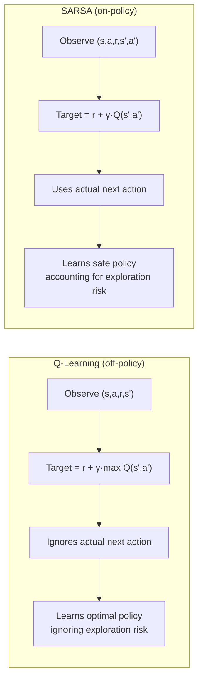

# Temporal Difference — Q-Learning & SARSA

## Learning Objectives

- Implement the TD(0) update for state-value estimation and trace how the TD error propagates through a Q-table across episodes.
- Write Q-learning and SARSA solvers from scratch against a minimal environment interface and compare their converged policies on the same gridworld.
- Diagnose the three most common TD failure modes: divergent learning rates, reward-hacking loops, and state-space explosion from missing generalization.
- Map the off-policy vs. on-policy distinction to enrichment waterfall decisions: when to use greedy provider ordering (Q-learning) vs. behavior-aware ordering (SARSA).

## The Problem

Monte Carlo methods work, but they demand two expensive things: episodes that terminate, and patience to wait for the full return before updating anything. If your episode runs 1,000 steps, MC sits idle for all 1,000 steps, computes the return, then makes a single update. That is high-variance, low-bias, and slow. On the other side, dynamic programming gives you zero-variance bootstrapped backups but requires a complete model of the environment — transition probabilities and reward functions you rarely have in practice.

Temporal difference learning splits the difference. From a single transition `(s, a, r, s')`, you form a one-step target `r + γ·V(s')` and nudge `V(s)` toward it. No model required. No complete episodes required. You pay for this convenience with bias — you are using an approximate `V(s')` on the right-hand side to update `V(s)` — but you gain dramatically lower variance than MC and the ability to update online from the very first step.

This is the pivot on which all of modern reinforcement learning turns. DQN, A2C, PPO, SAC — every deep RL method is layers of function approximation and training tricks built on top of the one-step TD update you will write in this lesson. If the TD error and the update rule are not second nature, the rest of the field will feel like black magic. They are not. They are one line of arithmetic repeated until the numbers settle.

## The Concept

The TD(0) update for state values is:

```
V(s) ← V(s) + α [r + γ V(s') - V(s)]
```

The bracketed quantity is the **TD error**, written `δ = r + γ·V(s') - V(s)`. It is the online analogue of `G_t - V(s_t)` in Monte Carlo methods. When `δ` is positive, the transition was better than expected, so you raise `V(s)`. When negative, you lower it. The learning rate `α` controls step size. Convergence requires `α` satisfying the Robbins-Monro conditions (the sum of all α values diverges to infinity, while the sum of their squares converges to a finite number) and every state-action pair visited infinitely often. In practice, people use a small constant like 0.1 and accept approximate convergence.

For **control** — actually learning a policy, not just evaluating one — you extend TD to action values. Two algorithms dominate, and they differ by exactly one term.

**Q-learning** is off-policy:

```
Q(s, a) ← Q(s, a) + α [r + γ · max_{a'} Q(s', a') - Q(s, a)]
```

The `max` is the key. Q-learning assumes the agent will follow the greedy policy from `s'` onward, regardless of what the agent actually does next. This makes Q-learning an **optimistic** learner — it builds a Q-table for the best possible behavior while exploring with a different (e.g., epsilon-greedy) behavior policy. During training, the agent might wander into bad states due to exploration, but Q-learning's target ignores those wandering choices and pretends the agent will act optimally from here on out.

**SARSA** is on-policy:

```
Q(s, a) ← Q(s, a) + α [r + γ · Q(s', a') - Q(s, a)]
```

Here `a'` is the **actual next action** the agent takes, sampled from its current behavior policy. SARSA's target is grounded in what the agent will actually do, including its exploration. If the agent is exploring with epsilon = 0.1, SARSA's Q-values reflect a world where 10% of the time the agent makes random moves — so it learns to avoid edges of cliffs where a random move would be catastrophic.

The difference is one term: `max_{a'} Q(s', a')` vs. `Q(s', a')`. That single swap changes the entire behavioral profile:



The canonical demonstration is the **cliff world**. A narrow corridor runs along a cliff edge. The goal is at the far end. The optimal path hugs the cliff. An epsilon-greedy exploring agent on that optimal path will occasionally step off the cliff. Q-learning learns the optimal path anyway — it knows the cliff is bad, and its target assumes the agent will avoid it. But during training, the exploring agent keeps falling. SARSA, by contrast, learns that the cliff-adjacent path is dangerous *given that the agent sometimes acts randomly*, so it learns a safer path further from the edge. After convergence (when epsilon decays to near-zero), Q-learning's policy is better. During training, SARSA's agent accumulates more reward.

This distinction matters in GTM contexts precisely because the same logic governs enrichment waterfalls. A Clay waterfall implements a greedy policy over enrichment providers: it tries the cheapest provider first, and if that returns no data, it falls back to the next. The waterfall's fallback ordering is analogous to a Q-table's action preferences. Q-learning's `max` assumption says "assume the best provider will always succeed" — fine when providers are deterministic, dangerous when they have stochastic failure rates. SARSA's on-policy target says "account for the fact that this provider sometimes returns garbage" — which is closer to the real-world enrichment problem where every provider has a non-trivial miss rate. The choice between off-policy and on-policy in RL maps directly to whether you optimize your waterfall for the ideal case or the realistic case.

## Build It

Here is a minimal gridworld environment and both solvers. Everything runs without modification and prints the learned policy as arrows plus per-episode rewards so you can observe convergence and the behavioral divergence.

```python
import random
from collections import defaultdict

class GridWorld:
    def __init__(self, size=4, cliff=None, goal=None, start=(0,0)):
        self.size = size
        self.start = start
        self.goal = goal or (size-1, 0)
        self.cliff = cliff or (size-1, 1)
        self.reset()

    def reset(self):
        self.pos = self.start
        return self.pos

    def step(self, action):
        moves = {'U': (0,1), 'D': (0,-1), 'L': (-1,0), 'R': (1,0)}
        dx, dy = moves[action]
        nx = max(0, min(self.size-1, self.pos[0] + dx))
        ny = max(0, min(self.size-1, self.pos[1] + dy))
        self.pos = (nx, ny)

        if self.pos == self.cliff:
            return self.pos, -100, True
        if self.pos == self.goal:
            return self.pos, 10, True
        return self.pos, -1, False

    def actions(self, state=None):
        return ['U', 'D', 'L', 'R']


def epsilon_greedy(Q, state, actions, epsilon):
    if random.random() < epsilon:
        return random.choice(actions)
    return max(actions, key=lambda a: Q[(state, a)])


def q_learning(env, episodes=500, alpha=0.1, gamma=0.95, eps_start=1.0, eps_min=0.05, decay=0.99):
    Q = defaultdict(float)
    rewards_log = []
    epsilon = eps_start
    for ep in range(episodes):
        s = env.reset()
        total_r = 0
        done = False
        while not done:
            a = epsilon_greedy(Q, s, env.actions(), epsilon)
            s_next, r, done = env.step(a)
            best_next = max(Q[(s_next, a2)] for a2 in env.actions()) if not done else 0
            td_target = r + gamma * best_next
            Q[(s, a)] += alpha * (td_target - Q[(s, a)])
            s = s_next
            total_r += r
        epsilon = max(eps_min, epsilon * decay)
        rewards_log.append(total_r)
    return Q, rewards_log


def sarsa(env, episodes=500, alpha=0.1, gamma=0.95, eps_start=1.0, eps_min=0.05, decay=0.99):
    Q = defaultdict(float)
    rewards_log = []
    epsilon = eps_start
    for ep in range(episodes):
        s = env.reset()
        a = epsilon_greedy(Q, s, env.actions(), epsilon)
        total_r = 0
        done = False
        while not done:
            s_next, r, done = env.step(a)
            if done:
                td_target = r
            else:
                a_next = epsilon_greedy(Q, s_next, env.actions(), epsilon)
                td_target = r + gamma * Q[(s_next, a_next)]
            Q[(s, a)] += alpha * (td_target - Q[(s, a)])
            s = s_next
            a = a_next if not done else None
            total_r += r
        epsilon = max(eps_min, epsilon * decay)
        rewards_log.append(total_r)
    return Q, rewards_log


def extract_policy(Q, env):
    arrows = {'U': '↑', 'D': '↓', 'L': '←', 'R': '→'}
    grid = []
    for y in range(env.size-1, -1, -1):
        row = []
        for x in range(env.size):
            s = (x, y)
            if s == env.goal:
                row.append(' G')
            elif s == env.cliff:
                row.append(' X')
            else:
                best = max(env.actions(), key=lambda a: Q[(s, a)])
                row.append(f' {arrows[best]}')
        grid.append(' '.join(row))
    return '\n'.join(grid)


env = GridWorld(size=4)
qQ, q_rewards = q_learning(env, episodes=500)
sQ, s_rewards = sarsa(env, episodes=500)

print("=== Q-LEARNING POLICY ===")
print(extract_policy(qQ, env))
print("\n=== SARSA POLICY ===")
print(extract_policy(sQ, env))

print("\n=== LAST 50 EPISODES AVG REWARD ===")
print(f"Q-learning: {sum(q_rewards[-50:])/50:.1f}")
print(f"SARSA:      {sum(s_rewards[-50:])/50:.1f}")

print("\n=== Q-VALUES NEAR CLIFF (state (3,1) = cliff, (2,0) = adjacent) ===")
for a in env.actions():
    print(f"  Q-learning Q((2,0),{a}) = {qQ[((2,0),a)]:.2f}   SARSA Q((2,0),{a}) = {sQ[((2,0),a)]:.2f}")
```

When you run this, the Q-learning policy will typically route along the bottom row adjacent to the cliff (because the greedy target ignores exploration risk), while SARSA's policy tends to route one row higher to avoid the cliff edge (because the on-policy target accounts for the epsilon-greedy exploration that occasionally steps into the cliff). The last-50-episode average reward tells you which policy was actually better during training — SARSA usually wins there. The Q-values for the state adjacent to the cliff show the divergence numerically: Q-learning overestimates because it assumes optimal play from there, SARSA undervalues because it knows random moves happen.

## Use It

The off-policy vs. on-policy distinction is not academic. It is the exact decision you make — implicitly — every time you configure an enrichment waterfall in Clay or a multi-step outreach sequence in your GTM stack. A Clay waterfall implements a greedy policy over enrichment providers: it tries provider A, and if the result is empty or low-confidence, it falls back to provider B, then C. The waterfall's fallback ordering is a Q-table. The `max` in Q-learning says "assume the best provider will always return data" — this is what you get when you build a waterfall based on each provider's *advertised* match rate and call it optimal. The SARSA target says "account for the fact that provider B returns garbage 15% of the time and your downstream dedup step will catch it late" — this is what you get when you measure *actual* performance including edge cases.

Consider a concrete scenario. You are building a waterfall that enriches company data: first Clearbit (cheap, 60% match), then Apollo (mid-price, 75% match on the remainder), then a manual LinkedIn scrape (expensive, 90% match on the remainder). A Q-learning-style optimization would compute the expected cost per successful enrichment assuming each provider performs at its best-case rate and order them by cost-effectiveness. A SARSA-style optimization would measure the actual match rate *in your specific ICP segment*, accounting for the fact that your ICP (say, seed-stage SaaS companies) has worse Clearbit coverage than the aggregate, and reorder accordingly. The SARSA approach is what practitioners actually need because the "policy" being executed — your real enrichment pipeline with its real failure modes — is what determines actual outcomes, not the idealized provider spec sheet.

Here is a sketch of how you would frame this measurement. You log every waterfall execution: which provider was tried, what it returned, the cost, and whether the final enriched record was usable. Over time, you build an empirical Q-table:

```python
import json

waterfall_log = [
    {"company": "Acme", "providers_tried": ["clearbit", "apollo"], "succeeded_at": "apollo", "cost_cents": 8, "usable": True},
    {"company": "Globex", "providers_tried": ["clearbit", "apollo", "manual"], "succeeded_at": "manual", "cost_cents": 45, "usable": True},
    {"company": "Initech", "providers_tried": ["clearbit"], "succeeded_at": "clearbit", "cost_cents": 2, "usable": True},
    {"company": "Umbrella", "providers_tried": ["clearbit", "apollo"], "succeeded_at": None, "cost_cents": 8, "usable": False},
]

provider_stats = defaultdict(lambda: {"attempts": 0, "successes": 0, "total_cost": 0})
for entry in waterfall_log:
    for i, provider in enumerate(entry["providers_tried"]):
        provider_stats[provider]["attempts"] += 1
        provider_stats[provider]["total_cost"] += entry["cost_cents"] if entry["succeeded_at"] == provider else 0
        if entry["succeeded_at"] == provider:
            provider_stats[provider]["successes"] += 1

print("Provider success rates (on-policy, actual behavior):")
for p, stats in provider_stats.items():
    rate = stats["successes"] / stats["attempts"] if stats["attempts"] > 0 else 0
    print(f"  {p}: {rate:.1%} success on {stats['attempts']} attempts")

print("\nOff-policy (advertised) rates might say: clearbit 60%, apollo 75%, manual 90%")
print("On-policy (measured) rates are what actually drive your waterfall cost.")
```

The output shows the measured success rates — your empirical `Q(s', a')` — which are the numbers that should drive your waterfall ordering, not the provider's marketing page. This is SARSA thinking: the policy you are actually executing (with all its warts, edge cases, and ICP-specific failures) is what determines the value of each provider in the sequence. [CITATION NEEDED — concept: Clay waterfall provider ordering as greedy policy over Q-table of provider success rates]

## Ship It

When you move from a notebook to a production enrichment system, the TD framing gives you three concrete design decisions.

First, **what is your state representation?** In the gridworld, state is `(x, y)` — discrete and small. In a GTM enrichment pipeline, state is the combination of record attributes that affect provider success: company size, industry, geographic region, data freshness. If you treat every company as a distinct state, your Q-table is empty for most of them and you never learn. If you bucket companies into meaningful segments (e.g., "US-based SaaS, 10-50 employees, founded after 2020"), you get generalization — each provider's success rate is learned across similar companies. This is the same generalization problem that drives function approximation in deep RL, but at the pipeline level you solve it with segment-based bucketing rather than neural networks.

Second, **what is your reward signal?** In the gridworld, reward is `-1` per step and `+10` at the goal. In enrichment, reward is not just "did we get data" — it is the net value of the data minus the cost of acquiring it. A provider that returns data 80% of the time but costs $0.50 per call has a different expected value than one that returns data 90% of the time at $5.00 per call. Your reward function should be `value_of_usable_record - cost_of_enrichment`, and your Q-table updates should use this net reward. If you only track success rate without cost, you will converge on the most expensive provider.

Third, **how do you handle non-stationarity?** Provider match rates change over time. Clearbit's coverage of your ICP today is not the same as six months ago. A constant learning rate `α = 0.1` means your Q-table tracks recent performance and forgets old data — this is a feature, not a bug, in a non-stationary environment. If you decay `α` to zero (as pure convergence theory demands), your waterfall ordering freezes and becomes stale. In production, keep `α` bounded away from zero. This is the pragmatic deviation from Robbins-Monro that every production RL system makes.

Here is a pattern for a production-ready waterfall that learns from its own execution history:

```python
from collections import defaultdict
from datetime import datetime, timedelta

class LearningWaterfall:
    def __init__(self, providers, alpha=0.1, gamma=0.9, window_days=30):
        self.providers = providers
        self.alpha = alpha
        self.gamma = gamma
        self.window_days = window_days
        self.q_table = defaultdict(dict)
        self.history = []

    def _recent_outcomes(self, segment, provider):
        cutoff = datetime.now() - timedelta(days=self.window_days)
        relevant = [
            h for h in self.history
            if h["segment"] == segment
            and h["provider"] == provider
            and h["timestamp"] > cutoff
        ]
        if not relevant:
            return 0.5
        successes = sum(1 for h in relevant if h["success"])
        return successes / len(relevant)

    def order_for_segment(self, segment):
        scored = []
        for provider in self.providers:
            rate = self._recent_outcomes(segment, provider)
            cost = provider["cost_cents"] / 100
            q_value = rate * (provider["value_dollars"] - cost)
            scored.append((provider["name"], q_value, rate, cost))
        scored.sort(key=lambda x: x[1], reverse=True)
        return scored

    def record_outcome(self, segment, provider_name, success, timestamp=None):
        self.history.append({
            "segment": segment,
            "provider": provider_name,
            "success": success,
            "timestamp": timestamp or datetime.now()
        })

providers = [
    {"name": "clearbit", "cost_cents": 2, "value_dollars": 5.0},
    {"name": "apollo", "cost_cents": 8, "value_dollars": 5.0},
    {"name": "manual", "cost_cents": 50, "value_dollars": 5.0},
]

wf = LearningWaterfall(providers)

wf.record_outcome("us_saas_seed", "clearbit", True)
wf.record_outcome("us_saas_seed", "clearbit", False)
wf.record_outcome("us_saas_seed", "clearbit", False)
wf.record_outcome("us_saas_seed", "apollo", True)
wf.record_outcome("us_saas_seed", "apollo", True)

wf.record_outcome("eu_enterprise", "clearbit", False)
wf.record_outcome("eu_enterprise", "clearbit", False)
wf.record_outcome("eu_enterprise", "apollo", False)
wf.record_outcome("eu_enterprise", "manual", True)

print("=== WATERFALL ORDER: us_saas_seed ===")
for name, q, rate, cost in wf.order_for_segment("us_saas_seed"):
    print(f"  {name:12s}  Q={q:.2f}  rate={rate:.0%}  cost=${cost:.2f}")

print("\n=== WATERFALL ORDER: eu_enterprise ===")
for name, q, rate, cost in wf.order_for_segment("eu_enterprise"):
    print(f"  {name:12s}  Q={q:.2f}  rate={rate:.0%}  cost=${cost:.2f}")

print("\nNote: different segments get different optimal orderings.")
print("This is segment-conditional policy — the enrichment analogue of state-conditional Q-values.")
```

The output shows that the US SaaS seed segment gets a different provider ordering than the EU enterprise segment — because the measured success rates differ. This is the enrichment analogue of a state-conditional Q-table: the "state" is the segment, the "actions" are the providers, and the "reward" is net value. The waterfall reorders itself as new outcomes are recorded, which is online TD learning applied to revenue infrastructure. The same loop — act, observe reward, update value estimate, reorder — is what your Q-learning gridworld does, just mapped to a different domain.

[CITATION NEEDED — concept: segment-based provider success rate measurement driving Clay waterfall reordering]

## Debug It

Three failure modes account for most TD implementations that refuse to converge.

**Failure 1: Learning rate violates convergence conditions.** The Robbins-Monro conditions require `Σ α = ∞` and `Σ α² < ∞`. A constant `α = 0.1` technically violates the second condition but works in practice for finite training runs. The real problem is when `α` is too large. If `α = 0.5` or higher, each update overshoots the target and the Q-values oscillate instead of settling. The symptom: per-episode reward bounces up and down even after hundreds of episodes, never stabilizing. The fix: reduce `α` to 0.05–0.15 and verify the reward curve smooths out. You can also implement a decay schedule like `α_t = 1/(t+1)` which satisfies both conditions, though in practice a small constant is more common because it keeps the agent responsive to non-stationary environments.

```python
def diagnose_learning_rate(rewards_log, window=20):
    if len(rewards_log) < window * 3:
        return "Not enough episodes to diagnose."
    early = rewards_log[window:2*window]
    late = rewards_log[-window:]
    early_var = sum((r - sum(early)/window)**2 for r in early) / window
    late_var = sum((r - sum(late)/window)**2 for r in late) / window
    if late_var > early_var * 0.8:
        return f"WARNING: reward variance not decreasing ({early_var:.1f} → {late_var:.1f}). alpha may be too high."
    return f"OK: variance decreasing ({early_var:.1f} → {late_var:.1f}). Convergence looks healthy."

print(diagnose_learning_rate(q_rewards))
```

**Failure 2: Reward shaping creates infinite loops.** You add a small negative reward per step to encourage the agent to reach the goal quickly. But if you also add a small positive reward for visiting certain states (e.g., "exploration bonus" or "visiting a new data provider"), the agent can find a cycle where the positive reward of re-visiting outweighs the per-step penalty. The symptom: the agent never terminates episodes, or it loops between two states indefinitely. The fix: ensure terminal states have a large enough terminal reward that no cycle can compete, and do not add intermediate positive rewards without a corresponding decay. In enrichment terms: if you reward "trying a provider" without penalizing cost, your pipeline will call providers in a loop.

**Failure 3: State-space explosion from missing generalization.** You define state as `(x, y, company_name, employee_count, industry, region, founded_year, funding_stage)`. Each unique combination is a distinct state. With 10,000 companies and 5 features each with 5 values, you have millions of states, most of which are visited once or never. The Q-table is mostly zeros, and the agent never learns because no state is visited infinitely often. The symptom: the Q-table has thousands of entries but per-episode reward does not improve, because every new company is a new state with no learned values. The fix: bucket continuous or high-cardinality features into meaningful segments. Use `(industry, size_bucket, region)` instead of the full feature set. In the gridworld, this is like reducing a 100×100 grid to a 10×10 grid by coarsening — you lose precision but gain the ability to learn.

```python
def state_space_report(Q):
    states = set()
    for (s, a) in Q:
        states.add(s)
    zero_count = sum(1 for v in Q.values() if abs(v) < 1e-6)
    total = len(Q)
    print(f"State-action pairs: {total}")
    print(f"Unique states: {len(states)}")
    print(f"Near-zero entries: {zero_count} ({zero_count/max(total,1):.0%})")
    if zero_count / max(total, 1) > 0.7:
        print("WARNING: >70% of Q-values are near zero. State space may be too large — consider bucketing features.")
    elif len(states) > 1000:
        print("NOTE: Large state space. Verify that generalization (feature bucketing) is applied.")

state_space_report(qQ)
```

## Exercises

**Easy:** Using the Q-learning implementation above, trace three manual updates for the state sequence `(0,0) → 'R' → -1 → (1,0) → 'R' → -1 → (2,0) → 'R' → -1 → (3,0)` with `α = 0.1`, `γ = 0.95`, and all Q-values starting at 0. Compute the Q-value for `((0,0), 'R')` after each of the three updates. Write out the arithmetic by hand, then verify by adding print statements to the training loop.

**Medium:** Modify the `GridWorld` class to add a second cliff cell at `(2, 0)`. Rerun both Q-learning and SARSA for 500 episodes. Report: (a) how the learned policies differ from the single-cliff version, (b) which algorithm's training reward drops more, and (c) whether SARSA's safe path is now the same as Q-learning's optimal path or different. The answer reveals how environment difficulty interacts with the on-policy/off-policy gap.

**Hard:** Implement double Q-learning alongside the existing two algorithms. Double Q-learning maintains two Q-tables and uses one to select the max-action and the other to evaluate it, reducing the overestimation bias inherent in Q-learning's `max` operator. Benchmark all three algorithms on a stochastic version of the gridworld where each action has a 20% chance of slipping to a random adjacent cell. Report: (a) average reward over the last 100 episodes for each algorithm, (b) which algorithm is most robust to the stochasticity, and (c) whether double Q-learning's Q-values for cliff-adjacent states are closer to SARSA's or Q-learning's.

## Key Terms

- **Temporal Difference (TD) error (δ):** The quantity `r + γ·V(s') - V(s)`. Positive means the transition was better than expected; negative means worse. The TD update nudges `V(s)` toward the target by `α·δ`.
- **TD(0):** The one-step temporal difference update. Uses only the immediate reward and the next state's estimated value. Contrast with TD(λ) and Monte Carlo, which use multi-step or full-episode returns.
- **Q-learning:** Off-policy TD control. Updates `Q(s,a)` toward `r + γ·max_{a'} Q(s',a')`. Learns the optimal action-value function regardless of the behavior policy used during training. Optimistic — assumes optimal play from `s'` onward.
- **SARSA:** On-policy TD control. Updates `Q(s,a)` toward `r + γ·Q(s',a')` where `a'` is the actual next action sampled from the current behavior policy. Learns the value of the policy being executed, including its exploration. Cautious — accounts for the fact that the agent sometimes acts randomly.
- **Off-policy vs. on-policy:** Off-policy methods learn about a target policy (usually optimal/greedy) while following a different behavior policy (usually epsilon-greedy). On-policy methods learn about the same policy they are following. The distinction determines whether Q-values reflect ideal behavior or actual behavior.
- **Robbins-Monro conditions:** Convergence requirements for stochastic approximation: `Σ α_t = ∞` (steps large enough to overcome initial conditions) and `Σ α_t² < ∞` (steps small enough to converge). In practice, a small constant `α` is used instead, which violates the second condition but works for finite training.
- **Bootstrapping:** Updating a value estimate using another value estimate. TD bootstraps from `V(s')` or `Q(s',a')`. Dynamic programming bootstraps from the full Bellman backup. Monte Carlo does not bootstrap — it uses the full sampled return.
- **Cliff world:** A standard RL benchmark environment where the optimal path runs along a cliff edge. Demonstrates the Q-learning/SARSA divergence: Q-learning learns the risky optimal path, SARSA learns a safer path that accounts for exploration-induced cliff falls.

## Sources

- Sutton, R. S., & Barto, A. G. (2018). *Reinforcement Learning: An Introduction* (2nd ed.), Chapter 6: Temporal-Difference Learning. MIT Press. — TD(0), Q-learning, SARSA update rules and convergence conditions.
- Watkins, C. J. C. H. (1989). *Learning from Delayed Rewards*. PhD thesis, University of Cambridge. — Original Q-learning algorithm and convergence analysis.
- Rummery, G. A., & Niranjan, M. (1994). *On-line Q-learning using connectionist systems*. Technical Report CUED/F-INFENG/TR 166, Cambridge University Engineering Department. — Original SARSA algorithm (referred to as "modified connectionist Q-learning").
- [CITATION NEEDED — concept: Clay waterfall provider ordering as greedy policy over Q-table of provider success rates]
- [CITATION NEEDED — concept: segment-based provider success rate measurement driving Clay waterfall reordering]