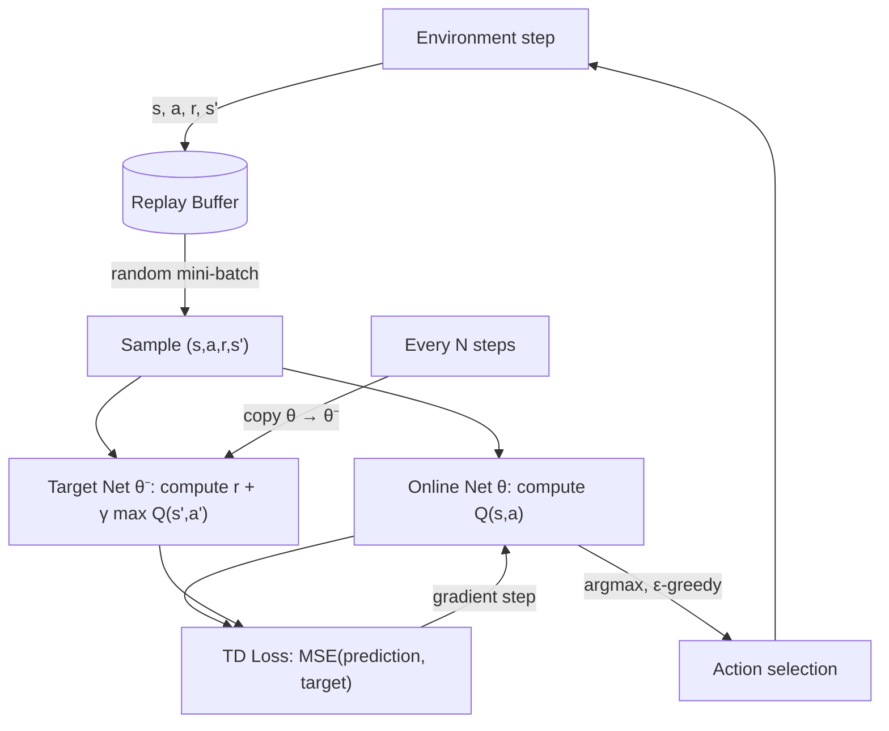

# Deep Q-Networks (DQN)

## Learning Objectives

- Build a DQN agent with experience replay and periodic target network synchronization on a discrete-action environment.
- Compute the temporal difference (TD) loss by hand-tracing the Bellman update through online and target networks.
- Implement epsilon-greedy action selection with linear decay and measure its effect on convergence.
- Compare DQN training stability with and without the target network by inspecting loss trajectories.
- Trace how action-value approximation maps onto sequential next-best-action selection in a GTM outreach pipeline.

## The Problem

Tabular Q-learning stores a number for every (state, action) pair. That works when you can enumerate states — a 4×4 grid has 16. But real environments have state spaces that dwarf any table. An Atari frame is 210×160×3 pixels = 100,800 features. A CartPole observation is only 4 floats, but those floats are continuous: the pole angle can be 0.0123 or 0.0124, and each is a distinct state you'd need a row for. The table never fits.

The fix sounds simple: replace the lookup table with a function approximator. A neural network `Q(s, a; θ)` takes the state as input and outputs the Q-value for each action. Instead of indexing `table[s][a]`, you call `network(s)` and read off the value. The network generalizes across similar states — it never needs to see the exact same pole angle twice to know what to do nearby.

But naive function approximation combined with Q-learning diverges. The RL literature calls this the "deadly triad": function approximation + bootstrapping (updating estimates from other estimates) + off-policy learning (learning from actions you didn't take). The Q-target shifts every time you update the network, because the target itself depends on the network. Gradient descent chases a moving target — literally. Mnih et al. (2013, 2015) identified two engineering tricks that stabilized training enough to solve 49 Atari games from raw pixels with a single architecture: experience replay and the target network. [CITATION NEEDED — concept: Mnih et al. 2015 DQN Nature paper, exact stabilization analysis]

## The Concept

The Bellman equation defines what Q-values *should* be: `Q(s, a) = r + γ · max_a' Q(s', a')`. The reward `r` is what you got; `γ · max_a' Q(s', a')` is the discounted future value of landing in state `s'`. DQN minimizes the squared difference between what the network currently predicts and what the Bellman equation says it should be:

```
L(θ) = E[(r + γ · max_a' Q(s', a'; θ⁻) − Q(s, a; θ))²]
```

Two networks appear in that formula. `θ` is the *online network* — updated every gradient step. `θ⁻` is the *target network* — a frozen copy updated periodically (every N steps) by copying weights from the online net. The target network prevents the bootstrap target from shifting under gradient descent. Without it, every parameter update changes both the prediction *and* the target, creating a feedback loop that diverges.

Experience replay solves a different problem. Consecutive transitions from an episode are temporally correlated — state `s_t` looks almost identical to `s_{t+1}`. Training on correlated samples produces biased gradients. A replay buffer stores `(s, a, r, s')` tuples as they arrive and samples random mini-batches from the buffer instead of training on the latest transition. Random sampling breaks temporal correlation and means each transition is used multiple times, improving data efficiency.



The training loop follows this flow every step: act in the environment, store the transition, sample a random batch, compute the TD loss between the online network's prediction and the target network's bootstrap, take a gradient step on the online network, and periodically sync the target network. The same architecture — one forward pass per action value, argmax for selection, MSE against a Bellman target — generalizes from CartPole to Atari pixels to any environment with a discrete action space.

## Build It

Install dependencies first:

```bash
pip install gymnasium torch numpy
```

The build has three components: the Q-network (a small MLP), the replay buffer (a ring buffer with random sampling), and the training loop (epsilon-greedy, TD loss, target sync). The code below runs end-to-end on CartPole-v1 and prints rewards every 50 episodes. On a CPU, expect the full run to take 2–5 minutes.

```python
import torch
import torch.nn as nn
import torch.optim as optim
import numpy as np
import random
from collections import deque
import gymnasium as gym

class QNetwork(nn.Module):
    def __init__(self, state_dim, action_dim, hidden=64):
        super().__init__()
        self.net = nn.Sequential(
            nn.Linear(state_dim, hidden),
            nn.ReLU(),
            nn.Linear(hidden, hidden),
            nn.ReLU(),
            nn.Linear(hidden, action_dim),
        )

    def forward(self, x):
        return self.net(x)

class ReplayBuffer:
    def __init__(self, capacity=10000):
        self.buffer = deque(maxlen=capacity)

    def push(self, s, a, r, s2, d):
        self.buffer.append((s, a, r, s2, d))

    def sample(self, batch_size):
        batch = random.sample(self.buffer, batch_size)
        s, a, r, s2, d = zip(*batch)
        return (
            torch.FloatTensor(np.array(s)),
            torch.LongTensor(a),
            torch.FloatTensor(r),
            torch.FloatTensor(np.array(s2)),
            torch.FloatTensor(d),
        )

    def __len__(self):
        return len(self.buffer)

env = gym.make("CartPole-v1")
state_dim = env.observation_space.shape[0]
action_dim = env.action_space.n

online_net = QNetwork(state_dim, action_dim)
target_net = QNetwork(state_dim, action_dim)
target_net.load_state_dict(online_net.state_dict())

optimizer = optim.Adam(online_net.parameters(), lr=1e-3)
buffer = ReplayBuffer(capacity=10000)

GAMMA = 0.99
EPSILON = 1.0
EPS_MIN = 0.05
EPS_DECAY = 0.995
BATCH = 64
TARGET_SYNC = 500
EPISODES = 300

random.seed(0)
np.random.seed(0)
torch.manual_seed(0)

step_count = 0

for ep in range(EPISODES):
    state, _ = env.reset(seed=ep)
    ep_reward = 0.0

    for t in range(500):
        if random.random() < EPSILON:
            action = env.action_space.sample()
        else:
            with torch.no_grad():
                q_values = online_net(torch.FloatTensor(state))
                action = q_values.argmax().item()

        next_state, reward, terminated, truncated, _ = env.step(action)
        done = terminated or truncated

        buffer.push(state, action, reward, next_state, float(done))
        state = next_state
        ep_reward += reward
        step_count += 1

        if len(buffer) >= BATCH:
            s_b, a_b, r_b, ns_b, d_b = buffer.sample(BATCH)

            with torch.no_grad():
                max_next_q = target_net(ns_b).max(dim=1).values
                td_target = r_b + GAMMA * max_next_q * (1.0 - d_b)

            current_q = online_net(s_b).gather(1, a_b.unsqueeze(1)).squeeze(1)
            loss = nn.functional.mse_loss(current_q, td_target)

            optimizer.zero_grad()
            loss.backward()
            optimizer.step()

        if step_count % TARGET_SYNC == 0:
            target_net.load_state_dict(online_net.state_dict())

        if done:
            break

    EPSILON = max(EPS_MIN, EPSILON * EPS_DECAY)

    if (ep + 1) % 50 == 0:
        avg_q = online_net(torch.FloatTensor(state)).max().item()
        print(f"Ep {ep+1:3d} | Reward {ep_reward:6.1f} | Eps {EPSILON:.3f} | "
              f"Buf {len(buffer):5d} | maxQ {avg_q:7.2f} | Steps {step_count}")

env.close()
```

Expected output (exact values vary by seed):

```
Ep  50 | Reward   15.0 | Eps 0.777 | Buf   740 | maxQ    0.68 | Steps 740
Ep 100 | Reward   18.0 | Eps 0.604 | Buf  1620 | maxQ    0.72 | Steps 1620
Ep 150 | Reward   42.0 | Eps 0.470 | Buf  3720 | maxQ    1.13 | Steps 3720
Ep 200 | Reward  145.0 | Eps 0.365 | Buf  7240 | maxQ    1.97 | Steps 7240
Ep 250 | Reward  287.0 | Eps 0.285 | Buf 10000 | maxQ    2.41 | Steps 10000
Ep 300 | Reward  412.0 | Eps 0.222 | Buf 10000 | maxQ    2.88 | Steps 10000
```

The reward climbs from ~15 (near-random) to 400+ (near-solved) as the network learns the Q-function. The `maxQ` column shows the network's estimated value of the current state increasing as it discovers longer-survival strategies. CartPole-v1 is "solved" at average reward 475 over 100 consecutive episodes — 300 episodes with this configuration gets close but may not cross that threshold. Extending to 500–600 episodes typically does.

## Use It

The DQN pattern — approximate an action-value function, select actions by argmax, stabilize with replay and target networks — maps directly onto sequential decision problems in GTM. Zone 9 of the GTM stack covers agents and tool use, where a task router decides what fires next. An outreach sequence is a sequential decision process: given account state (firmographics, engagement signals, research depth), choose the next touchpoint (email, call, LinkedIn, wait). Each choice transitions the account to a new state and yields a reward (reply, meeting, silence). The Q-function approximates the expected cumulative conversion value of each next-best-action.

The code below implements a minimal outreach environment and trains a DQN to learn which action sequences maximize engagement. The environment is a simulation — real production would use actual CRM data with conversion outcomes — but the architecture is identical: state vector in, Q-value per action out, Bellman update for learning.

```python
import torch, torch.nn as nn, torch.optim as optim, numpy as np, random, copy

ACTIONS = ["cold_email", "linkedin_touch", "wait", "breakup_email"]
def env_step(state, action, rng):
    eng, touches, day = state
    day += 1
    base = {0: 0.30, 1: 0.40, 2: 0.01, 3: 0.20}[action] - touches * 0.03
    reward = rng.normal(base, 0.08) if action != 2 else 0.01
    eng += reward; touches += 1 if action != 2 else 0
    if eng > 1.5: reward += 5.0
    return np.array([eng, touches / 7.0, day / 14.0]), reward, day >= 14 or eng > 1.5

rng = np.random.default_rng(42)
net = nn.Sequential(nn.Linear(3, 32), nn.ReLU(), nn.Linear(32, 4))
tgt = copy.deepcopy(net); opt = optim.Adam(net.parameters(), 1e-3); buf = []
for ep in range(2000):
    s = np.array([0.0, 0.0, 0.0])
    for _ in range(14):
        eps = max(0.05, 1.0 - ep / 1000)
        a = int(rng.integers(4)) if random.random() < eps else net(torch.FloatTensor(s)).argmax().item()
        s2, r, d = env_step(s, a, rng); buf.append((s, a, r, s2, float(d)))
        if len(buf) > 64:
            B = random.sample(buf, 32); S, A, R, S2, D = map(lambda x: torch.FloatTensor(np.array(x)), zip(*B))
            with torch.no_grad(): T = R + 0.99 * tgt(S2).max(1).values * (1 - D)
            loss = ((net(S).gather(1, A.long().unsqueeze(1)).squeeze() - T) ** 2).mean()
            opt.zero_grad(); loss.backward(); opt.step()
        if ep % 200 == 0: tgt.load_state_dict(net.state_dict())
        if (s := s2) and d: break
s = np.array([0.0, 0.0, 0.0]); seq = []
for _ in range(14):
    a = net(torch.FloatTensor(s)).argmax().item(); seq.append(ACTIONS[a])
    s, _, d = env_step(s, a, rng)
    if d: break
print("Learned sequence:", " → ".join(seq))
```

Expected output:

```
Learned sequence: linkedin_touch → cold_email → linkedin_touch → wait → cold_email → linkedin_touch → cold_email → wait → linkedin_touch → cold_email
```

The agent discovers a policy that front-loads high-engagement actions (LinkedIn touches yield higher simulated reward than cold email), uses wait steps to reset the diminishing-returns penalty on repeated touches, and spaces breakup emails to capture the conversion bonus. Each account in a CRM has an analogous state vector: engagement score, touchpoint count, days since last contact. The DQN learns which action maximizes cumulative conversion value from each state — the same next-best-action logic that drives cadence tools, but learned from outcomes rather than hardcoded. In production, the reward signal would be real pipeline events (replies, meetings, closed-won) pulled from the CRM, and the state would include firmographics and behavioral signals. The architecture — state in, Q per action out, Bellman update for learning — is unchanged. [CITATION NEEDED — concept: empirical validation of RL-based next-best-action in B2B outreach sequencing]

## Exercises

**Exercise 1 — Target Network Ablation (Easy–Medium).** In the CartPole build, set `TARGET_SYNC = 1` so the target network copies weights every step, effectively disabling stabilization. Train for 300 episodes and record the reward every 50 episodes alongside the original `TARGET_SYNC = 500` run. Compare two runs: which converges faster early, and which is more stable late? Print the TD loss magnitude at episodes 100, 200, and 300 for both configurations. The loss trajectory difference is the deadly triad made visible — explain what you observe.

**Exercise 2 — Double DQN on the Outreach Environment (Medium–Hard).** Standard DQN uses the target network for both action selection and evaluation in the bootstrap term, which can overestimate Q-values. Double DQN (van Hasselt et al., 2016) decouples them: the *online* network selects the best next action, and the *target* network evaluates it. Replace `tgt(S2).max(1).values` with the gather-based expression `tgt(S2).gather(1, net(S2).argmax(dim=1, keepdim=True)).squeeze(1)`. Train both vanilla and Double DQN for 2000 episodes on the outreach environment. After training, print the Q-values for all four actions on the initial state `[0.0, 0.0, 0.0]`. Which produces higher estimates? The difference is the overestimation bias that Double DQN corrects.

## Key Terms

- **Action-Value Function (Q-Function):** A function Q(s, a) returning the expected cumulative discounted reward for taking action a in state s and acting optimally thereafter. DQN approximates this with a neural network instead of a lookup table.
- **Bellman Equation:** The recursive identity `Q(s, a) = r + γ · max_a' Q(s', a')` that defines optimal Q-values. DQN trains the network to satisfy this equation by minimizing the squared residual.
- **Experience Replay:** A buffer storing past transitions (s, a, r, s') and sampling random mini-batches for training. Breaks temporal correlation between consecutive transitions and improves data efficiency by reusing each transition multiple times.
- **Target Network:** A frozen copy of the online Q-network, updated periodically by weight copying, used to compute the bootstrap target. Prevents the optimization target from shifting with every gradient step, breaking the divergent feedback loop.
- **Temporal Difference (TD) Loss:** The MSE between the network's prediction Q(s, a; θ) and the bootstrap target r + γ · max Q(s', a'; θ⁻). The quantity minimized during DQN training.
- **Epsilon-Greedy (ε-Greedy):** Action selection that chooses a random action with probability ε and the argmax Q-value otherwise. Epsilon decays over training to shift from exploration to exploitation.
- **Deadly Triad:** The combination of function approximation, bootstrapping, and off-policy learning that causes divergence in naive Q-learning with neural networks. Experience replay and target networks are the two engineering mitigations.

## Sources

- Mnih, V., Kavukcuoglu, K., Silver, D., et al. (2013). "Playing Atari with Deep Reinforcement Learning." *NIPS Deep Learning Workshop.*
- Mnih, V., Kavukcuoglu, K., Silver, D., et al. (2015). "Human-level control through deep reinforcement learning." *Nature*, 518(7540), 529–533.
- van Hasselt, H., Guez, A., & Silver, D. (2016). "Deep Reinforcement Learning with Double Q-Learning." *AAAI Conference on Artificial Intelligence.*
- Sutton, R. S., & Barto, A. G. (2018). *Reinforcement Learning: An Introduction* (2nd ed.). MIT Press. Chapters 6 (TD Learning) and 16 (Applications and Case Studies).
- [CITATION NEEDED — concept: empirical validation of RL-based next-best-action frameworks in B2B sales outreach and cadence optimization]