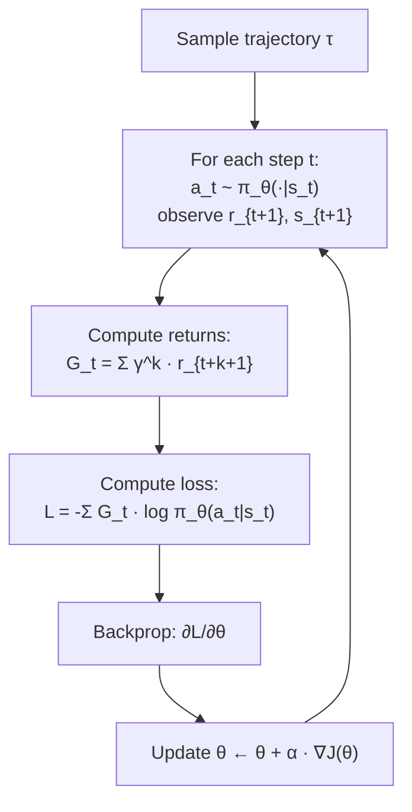

# Policy Gradient — REINFORCE from Scratch

## Learning Objectives

1. **Implement** the REINFORCE update rule from the policy gradient theorem in working PyTorch code that trains a policy network on CartPole-v1.
2. **Derive** the policy gradient estimator from the log-derivative trick and explain why `∇log π(a|s)` correctly scales each action's gradient contribution by its return.
3. **Trace** the full data flow from environment step through Monte Carlo return computation to parameter update, identifying where gradient variance enters and why baselines reduce it.
4. **Evaluate** the effect of discount factor γ and baseline subtraction on learning speed, stability, and gradient magnitude.
5. **Map** the REINFORCE credit-assignment mechanism to multi-step GTM decision sequences where terminal feedback is observed only after the final action.

## The Problem

Q-learning and DQN parameterize a value function. You learn `Q(s, a)` — the expected return from taking action `a` in state `s` — and then pick actions with `argmax Q`. That works when actions are discrete and states are enumerable. It breaks when actions are continuous (what does `argmax` over a 10-dimensional torque vector even mean?) or when you need a stochastic policy (`argmax` is deterministic by construction).

Policy gradient methods sidestep both problems by parameterizing the policy directly. Instead of learning how good each action is and then selecting, you learn a function `π_θ(a | s)` that outputs a probability distribution over actions. You sample from that distribution to act. You compute the gradient of expected return with respect to `θ`. You step uphill. No `argmax`. No Bellman recursion. No value function at all — just gradient ascent on `J(θ) = E_{π_θ}[G]`.

REINFORCE (Williams, 1992) is the simplest policy gradient algorithm. It tells you exactly how to compute that gradient: run a full episode, compute the return at each timestep, and update parameters in the direction of `G_t · ∇_θ log π_θ(a_t | s_t)`. Every modern RL-from-sequence-decisions method — PPO, A2C, GRPO — is a variance-reduced refinement of this update. If you cannot implement REINFORCE from scratch, the refinements will be black boxes.

The cost: REINFORCE uses Monte Carlo returns, which are high-variance. A single bad episode can push the policy in the wrong direction. This is the central engineering problem that PPO's clipped objective and advantage baselines were invented to solve. But the foundational idea — differentiate the policy, weight by return — is unchanged.

## The Concept

The policy gradient theorem states that for any differentiable policy `π_θ`:

```
∇_θ J(θ) = E_{τ ~ π_θ}[ Σ_{t=0}^{T} G_t · ∇_θ log π_θ(a_t | s_t) ]
```

where `G_t = Σ_{k=t}^{T} γ^{k-t} r_{t+1}` is the discounted return from step `t` and the expectation is over full trajectories `τ` sampled from `π_θ`. The proof relies on the log-derivative trick (also called the score function estimator). Start with the definition of expected return: `J(θ) = Σ_τ P(τ; θ) · G(τ)`. Differentiate with respect to `θ`:

```
∇_θ J(θ) = Σ_τ ∇_θ P(τ; θ) · G(τ)
         = Σ_τ P(τ; θ) · [∇_θ P(τ; θ) / P(τ; θ)] · G(τ)
         = Σ_τ P(τ; θ) · ∇_θ log P(τ; θ) · G(τ)
         = E_τ[∇_θ log P(τ; θ) · G(τ)]
```

The trajectory probability factors as `P(τ; θ) = Π_t π_θ(a_t | s_t) · Π_t P(s_{t+1} | s_t, a_t)`. The environment transition terms don't depend on `θ`, so their gradients vanish. What remains is `∇_θ log P(τ; θ) = Σ_t ∇_θ log π_θ(a_t | s_t)`. This is why you only need the gradient of the policy log-probability — the environment dynamics drop out.

Why does this work mechanically? When you compute `G_t · ∇_θ log π_θ(a_t | s_t)`, the return `G_t` acts as a scaling factor on the gradient. If `G_t` is large and positive, the gradient step increases `log π_θ(a_t | s_t)` — making that action more likely in that state. If `G_t` is small or negative, the step suppresses it. The log-probability gradient (the score function) tells you *which direction to push θ*; the return tells you *how hard to push*. PyTorch's `Categorical` distribution computes `log π` and its gradient automatically. You multiply by `-G_t` (negative because you minimize loss, which is equivalent to maximizing expected return), call `.backward()`, and the optimizer steps.

The data flow is a loop — sample trajectory, compute returns, compute weighted loss, backprop, repeat:



Where does variance enter? `G_t` is a single Monte Carlo sample of the return from a full episode rollout. CartPole-v1 episodes last anywhere from 10 to 500 steps. A trajectory that happens to last 200 steps produces large positive returns for every action along the way — including actions that were actually mediocre. A trajectory that terminates at 15 steps produces small returns for every action — including actions that were genuinely good but happened to be followed by a bad one. The estimator is unbiased (the expectation is correct), but any single sample can be wildly off. This is why baselines matter: subtracting a running average of returns from each `G_t` (turning it into an advantage estimate) removes the constant offset without changing the expected gradient, dramatically reducing variance. PPO and A2C both build on this insight.

## Build It

The implementation has four components: a policy network that outputs a `Categorical` distribution, an episode collection loop that samples actions and records log-probabilities and rewards, a return computation that applies discounted cumulative sums, and a gradient update that backprops through the weighted loss. No tricks — raw REINFORCE so