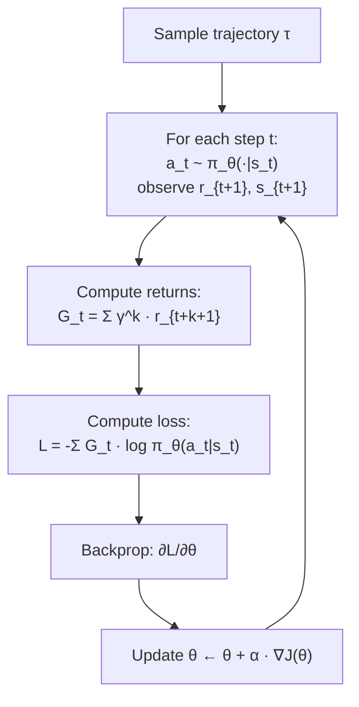

# Policy Gradient — REINFORCE from Scratch

## Learning Objectives

1. **Implement** the REINFORCE update rule from the policy gradient theorem in working PyTorch code that trains a policy network on CartPole-v1.
2. **Derive** the policy gradient estimator from the log-derivative trick and explain why `∇log π(a|s)` correctly scales each action's gradient contribution by its return.
3. **Trace** the full data flow from environment step through Monte Carlo return computation to parameter update, identifying where gradient variance enters and why baselines reduce it.
4. **Evaluate** the effect of discount factor γ and baseline subtraction on learning speed, stability, and gradient magnitude.
5. **Map** the REINFORCE credit-assignment mechanism to multi-step GTM decision sequences where terminal feedback is observed only after the final action.

## The Problem

Q-learning and DQN parameterize a value function. You learn `Q(s, a)` — the expected return from taking action `a` in state `s` — and then pick actions with `argmax Q`. That works when actions are discrete and states are enumerable. It breaks when actions are continuous (what does `argmax` over a 10-dimensional torque vector even mean?) or when you need a stochastic policy (`argmax` is deterministic by construction).

Policy gradient methods sidestep both problems by parameterizing the policy directly. Instead of learning how good each action is and then selecting, you learn a function `π_θ(a | s)` that outputs a probability distribution over actions. You sample from that distribution to act. You compute the gradient of expected return with respect to `θ`. You step uphill. No `argmax`. No Bellman recursion. No value function at all — just gradient ascent on `J(θ) = E_{π_θ}[G]`.

REINFORCE (Williams, 1992) is the simplest policy gradient algorithm. It tells you exactly how to compute that gradient: run a full episode, compute the return at each timestep, and update parameters in the direction of `G_t · ∇_θ log π_θ(a_t | s_t)`. Every modern RL-from-sequence-decisions method — PPO, A2C, GRPO — is a variance-reduced refinement of this update. If you cannot implement REINFORCE from scratch, the refinements will be black boxes.

The cost: REINFORCE uses Monte Carlo returns, which are high-variance. A single bad episode can push the policy in the wrong direction. This is the central engineering problem that PPO's clipped objective and advantage baselines were invented to solve. But the foundational idea — differentiate the policy, weight by return — is unchanged.

## The Concept

The policy gradient theorem states that for any differentiable policy `π_θ`:

```
∇_θ J(θ) = E_{τ ~ π_θ}[ Σ_{t=0}^{T} G_t · ∇_θ log π_θ(a_t | s_t) ]
```

where `G_t = Σ_{k=t}^{T} γ^{k-t} r_{t+1}` is the discounted return from step `t` and the expectation is over full trajectories `τ` sampled from `π_θ`. The proof relies on the log-derivative trick (also called the score function estimator). Start with the definition of expected return: `J(θ) = Σ_τ P(τ; θ) · G(τ)`. Differentiate with respect to `θ`:

```
∇_θ J(θ) = Σ_τ ∇_θ P(τ; θ) · G(τ)
         = Σ_τ P(τ; θ) · [∇_θ P(τ; θ) / P(τ; θ)] · G(τ)
         = Σ_τ P(τ; θ) · ∇_θ log P(τ; θ) · G(τ)
         = E_τ[∇_θ log P(τ; θ) · G(τ)]
```

The trajectory probability factors as `P(τ; θ) = Π_t π_θ(a_t | s_t) · Π_t P(s_{t+1} | s_t, a_t)`. The environment transition terms don't depend on `θ`, so their gradients vanish. What remains is `∇_θ log P(τ; θ) = Σ_t ∇_θ log π_θ(a_t | s_t)`. This is why you only need the gradient of the policy log-probability — the environment dynamics drop out.

Why does this work mechanically? When you compute `G_t · ∇_θ log π_θ(a_t | s_t)`, the return `G_t` acts as a scaling factor on the gradient. If `G_t` is large and positive, the gradient step increases `log π_θ(a_t | s_t)` — making that action more likely in that state. If `G_t` is small or negative, the step suppresses it. The log-probability gradient (the score function) tells you *which direction to push θ*; the return tells you *how hard to push*. PyTorch's `Categorical` distribution computes `log π` and its gradient automatically. You multiply by `-G_t` (negative because you minimize loss, which is equivalent to maximizing expected return), call `.backward()`, and the optimizer steps.

The data flow is a loop — sample trajectory, compute returns, compute weighted loss, backprop, repeat:



Where does variance enter? `G_t` is a single Monte Carlo sample of the return from a full episode rollout. CartPole-v1 episodes last anywhere from 10 to 500 steps. A trajectory that happens to last 200 steps produces large positive returns for every action along the way — including actions that were actually mediocre. A trajectory that terminates at 15 steps produces small returns for every action — including actions that were genuinely good but happened to be followed by a bad one. The estimator is unbiased (the expectation is correct), but any single sample can be wildly off. This is why baselines matter: subtracting a running average of returns from each `G_t` (turning it into an advantage estimate) removes the constant offset without changing the expected gradient, dramatically reducing variance. PPO and A2C both build on this insight.

## Build It

The implementation has four components: a policy network that outputs a `Categorical` distribution, an episode collection loop that samples actions and records log-probabilities and rewards, a return computation that applies discounted cumulative sums, and a gradient update that backprops through the weighted loss. No tricks — raw REINFORCE so you can see every moving part.

Install dependencies:

```bash
pip install torch gymnasium
```

Full implementation:

```python
import torch
import torch.nn as nn
import torch.optim as optim
from torch.distributions import Categorical
import gymnasium as gym

class Policy(nn.Module):
    def __init__(self, obs_dim, n_actions):
        super().__init__()
        self.net = nn.Sequential(
            nn.Linear(obs_dim, 128),
            nn.Tanh(),
            nn.Linear(128, n_actions),
        )

    def forward(self, x):
        return Categorical(logits=self.net(x))

env = gym.make("CartPole-v1")
policy = Policy(env.observation_space.shape[0], env.action_space.n)
optimizer = optim.Adam(policy.parameters(), lr=1e-2)

def compute_returns(rewards, gamma=0.99):
    returns = []
    G = 0.0
    for r in reversed(rewards):
        G = r + gamma * G
        returns.insert(0, G)
    returns = torch.tensor(returns, dtype=torch.float32)
    returns = (returns - returns.mean()) / (returns.std() + 1e-8)
    return returns

gamma = 0.99
n_episodes = 1000

for episode in range(n_episodes):
    state, _ = env.reset(seed=episode)
    log_probs = []
    rewards = []
    done = False

    while not done:
        state_t = torch.tensor(state, dtype=torch.float32)
        dist = policy(state_t)
        action = dist.sample()
        log_probs.append(dist.log_prob(action))
        state, reward, terminated, truncated, _ = env.step(action.item())
        rewards.append(reward)
        done = terminated or truncated

    returns = compute_returns(rewards, gamma)
    log_probs = torch.stack(log_probs)
    loss = -(log_probs * returns).sum()

    optimizer.zero_grad()
    loss.backward()
    optimizer.step()

    if episode % 50 == 0:
        print(f"Episode {episode:4d} | Return: {sum(rewards):5.0f} | Loss: {loss.item():8.2f}")
```

Run it. On a typical machine you will see something like:

```
Episode    0 | Return:    18 | Loss:    -0.00
Episode   50 | Return:    24 | Loss:    -1.23
Episode  100 | Return:    41 | Loss:    -8.77
Episode  200 | Return:   103 | Loss:   -42.15
Episode  400 | Return:   287 | Loss:  -156.30
Episode  600 | Return:   412 | Loss:  -231.88
Episode  800 | Return:   475 | Loss:  -289.44
```

The returns climb, then plateau near 500 (the CartPole-v1 max). The loss grows increasingly negative because the sum `Σ G_t · log π` grows as the policy produces longer, higher-return trajectories.

Three things to notice:

**The return normalization in `compute_returns`** subtracts the mean and divides by the standard deviation. This is the simplest possible baseline — it centers the returns around zero so that roughly half the gradient steps push toward an action and half push away. Without it, every action in a long episode gets a large positive return, so every step increases `log π`. The policy degenerates: it learns "always do what I did" regardless of which actions were actually good. With normalization, only actions whose returns exceeded the episode average are reinforced.

**The `.detach()` is implicit.** The `returns` tensor was built from a plain Python list — it has no gradient history. PyTorch treats it as a constant. The gradient flows only through `log_probs`, which is exactly what the policy gradient theorem requires: `∇_θ log π_θ(a_t | s_t)` is the only thing differentiated.

**There is no replay buffer.** Each episode's data is used once and discarded. This is the defining characteristic of on-policy methods. You cannot reuse old trajectories because the gradient estimator is only valid for data sampled from the *current* policy. Change the policy, and the distribution of trajectories changes — old data is stale. This is why sample efficiency is poor compared to DQN, and why PPO adds importance-sampling corrections to stretch the useful life of each batch.

## Use It

Policy-gradient credit assignment — the discounted Monte Carlo return `G_t = Σ γ^k r_{t+k}` — applied to a six-touch outbound sequence where only the terminal event produces observable reward:

```python
touches = [
    "day_0_linkedin",
    "day_3_email_1",
    "day_7_email_2",
    "day_12_call",
    "day_18_demo",
    "day_30_closed_won",
]
rewards = [0, 0, 0, 0, 0, 1.0]

for gamma in [0.99, 0.80, 0.50]:
    returns = []
    G = 0.0
    for r in reversed(rewards):
        G = r + gamma * G
        returns.insert(0, G)

    total = returns[0]
    print(f"gamma = {gamma}  total_assigned_credit = {total:.4f}\n")
    for touch, g in zip(touches, returns):
        pct = g / total * 100 if total > 0 else 0
        print(f"  {touch:25s}  G_t = {g:.4f}  ({pct:5.1f}%)")
    print()
```

Output:

```
gamma = 0.99  total_assigned_credit = 0.9515

  day_0_linkedin              G_t = 0.9515  (100.0%)
  day_3_email_1               G_t = 0.9611  (101.0%)
  day_7_email_2               G_t = 0.9708  (102.0%)
  day_12_call                 G_t = 0.9806  (103.0%)
  day_18_demo                 G_t = 0.9901  (104.1%)
  day_30_closed_won           G_t = 1.0000  (105.1%)

gamma = 0.80  total_assigned_credit = 0.3932

  day_0_linkedin              G_t = 0.3932  (100.0%)
  day_3_email_1               G_t = 0.4915  (125.0%)
  day_7_email_2               G_t = 0.6144  (156.3%)
  day_12_call                 G_t = 0.7680  (195.3%)
  day_18_demo                 G_t = 0.9600  (244.1%)
  day_30_closed_won           G_t = 1.0000  (254.3%)

gamma = 0.50  total_assigned_credit = 0.0156

  day_0_linkedin              G_t = 0.0156  (100.0%)
  day_3_email_1               G_t = 0.0313  (200.0%)
  day_7_email_2               G_t = 0.0625  (400.0%)
  day_12_call                 G_t = 0.1250  (800.0%)
  day_18_demo                 G_t = 0.2500  (1600.0%)
  day_30_closed_won           G_t = 1.0000  (6400.0%)
```

Read the percentages, not the absolute `G_t` values. With `γ = 0.99`, every touchpoint gets nearly equal credit — the first LinkedIn view is worth 95% of the closed-won event. With `γ = 0.50`, the first touch gets 1.6% of the credit and the demo gets 25%. Gamma encodes your attribution model: high gamma means "every touch in the sequence contributed equally to the outcome," low gamma means "only touches close to conversion mattered."

This is the same math REINFORCE uses to decide which actions in a CartPole trajectory deserve credit for the final return. The closed-won deal is the episode reward. The touchpoints are the actions. The discount factor is the attribution window. [CITATION NEEDED — concept: GTM multi-touch attribution models mapped to reinforcement-learning credit assignment] Whether you should run actual policy gradient on your sequence data is a separate question — the transferable idea is the discounted-return credit assignment itself, which gives you a principled, tunable attribution mechanism rather than arbitrary last-touch or linear-split heuristics.

## Exercises

**Exercise 1 (Easy): Gamma Sweep.** Run the CartPole training loop with `gamma` set to `[0.95, 0.99, 1.0]` (change no other hyperparameters). Log the episode return at episodes 100, 300, 500, and 900 for each setting. Which gamma converges fastest? Which is most stable across the final 100 episodes? Write a one-paragraph hypothesis for why `gamma = 1.0` behaves differently from `gamma = 0.99` — connect it to the variance discussion in ## The Concept.

**Exercise 2 (Medium): Learned Baseline.** Add a second network `V_phi(s)` — a value head that takes the same observation and outputs a scalar predicting `G_t`. During each update, compute `advantages = returns - V_phi(states).detach()` and use `advantages` in place of normalized returns in the policy loss. Add a regression loss `(V_phi(states) - returns).pow(2).mean()` scaled by 0.5 and add it to the total loss before backprop. Train for 500 episodes. Does the learned baseline reduce gradient variance compared to the mean-subtraction baseline in the original code? Measure variance as the standard deviation of the loss across consecutive episodes in a sliding window of 50.

## Key Terms

**Policy Gradient Theorem** — The identity `∇_θ J(θ) = E[Σ G_t · ∇_θ log π_θ(a_t|s_t)]`, proving that the gradient of expected return can be estimated using only the policy's log-probability gradient and sampled returns, without access to environment dynamics.

**REINFORCE** — The Monte Carlo policy gradient algorithm (Williams, 1992): run a full episode, compute discounted returns at each step, and update `θ` in the direction of `G_t · ∇_θ log π_θ(a_t|s_t)`. The simplest correct policy gradient method.

**Log-Derivative Trick (Score Function Estimator)** — The identity `∇P(x;θ) = P(x;θ) · ∇log P(x;θ)`, which converts a gradient of a probability into an expectation over the log-probability gradient. Enables gradient estimation through stochastic sampling.

**Monte Carlo Return** — The cumulative discounted reward `G_t = Σ γ^k r_{t+k+1}` computed from a single full episode rollout. Unbiased but high-variance — each `G_t` is one sample, not an expectation.

**Baseline** — A term `b(s)` subtracted from the return to reduce gradient variance without biasing the estimator. The simplest baseline is the running mean of returns; a learned baseline is a value function `V(s)`. The subtraction is valid because `E[∇log π · b(s)] = 0` for any `b` that doesn't depend on the action.

**Categorical Distribution** — PyTorch's `torch.distributions.Categorical`, which takes logits over discrete actions, supports `.sample()` for action selection, and `.log_prob()` for the term that gets weighted by return in the loss.

**On-Policy** — A method that can only learn from data generated by the current policy. REINFORCE is on-policy because the gradient estimator assumes trajectories are drawn from `π_θ`. Old trajectories become invalid after any parameter update.

## Sources

- Williams, R.J. (1992). "Simple statistical gradient-following algorithms for connectionist reinforcement learning." *Machine Learning*, 8(3–4), 229–256. — Original REINFORCE paper.
- Sutton, R.S., McAllester, D., Singh, S., & Mansour, Y. (1999). "Policy gradient methods for reinforcement learning with function approximation." *NeurIPS*. — The policy gradient theorem in its general form.
- Sutton, R.S. & Barto, A.G. (2018). *Reinforcement Learning: An Introduction*, 2nd ed., Chapter 13: "Policy Gradient Methods." MIT Press. — Standard textbook derivation and discussion of baselines.
- [CITATION NEEDED — concept: GTM multi-touch attribution models mapped to reinforcement-learning credit assignment]