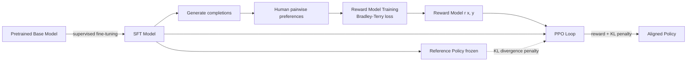

# Reward Modeling & RLHF

## Learning Objectives

1. Build a pairwise preference dataset from human annotations and compute inter-annotator agreement.
2. Train a reward model as a scalar scoring head on a frozen transformer backbone.
3. Trace the PPO loop that optimizes a language model against a learned reward function, including the KL divergence penalty that prevents reward hacking.
4. Compare reward-model scores before and after alignment steps to observe policy shift.
5. Deploy a reward model as a critic gate in a GTM content generation pipeline.

## The Problem

You trained a language model on next-token prediction. It produces grammatical text. It also rambles, hedges, and produces responses that are technically fluent but practically useless for your use case. More pretraining does not fix this — the objective that trained the model (predict the next token from web text) is not the objective you care about (produce a response your team would actually use).

Fine-tuning on demonstrations helps: it teaches the model what good responses look like. But it does not teach the model what *better* looks like. Fine-tuning optimizes for likelihood of target tokens, not for preference ordering between candidates. Two responses can both be grammatical and on-topic, but one is sharper, more concise, and matches your team's voice. Supervised fine-tuning cannot encode that ranking.

What you need is a scalar signal that says "response A scores higher than response B for this prompt." Writing that signal by hand is impossible — "quality" is not a closed-form function over tokens. But a human can look at two completions and pick the better one in seconds. That comparison is cheap to collect at scale, and it is sufficient to fit a reward model that approximates the underlying preference function. Once you have that reward model, you can optimize the language model against it using reinforcement learning. This is RLHF: the three-stage pipeline (SFT → reward model → PPO) that turned GPT-3 into ChatGPT.

## The Concept

RLHF has three stages. The first is supervised fine-tuning (SFT): take a pretrained base model and fine-tune it on high-quality demonstrations of the target behavior. This gives you a starting policy that already produces reasonable outputs — the RL loop needs a decent starting point or it will flail. The second stage is reward modeling: collect pairwise preferences (given prompt X, completion A is preferred over completion B), and train a classifier to predict the scalar reward. The third stage is PPO: treat the reward model as the environment, the language model as the policy, and run a reinforcement learning loop to shift the policy toward higher-reward outputs.

The reward model itself is structurally simple: take a transformer backbone (often the SFT model itself), freeze or partially fine-tune it, and attach a scalar head that outputs a single number. During training, for each pair (chosen, rejected), the loss pushes the chosen completion's reward higher than the rejected completion's reward. The standard loss is the Bradley-Terry pairwise ranking loss: `-log(sigmoid(r_chosen - r_rejected))`. This converts ordinal comparisons into a continuous scoring function.

The PPO loop introduces a critical constraint: the KL divergence penalty. Without it, the policy will exploit the reward model — a phenomenon called reward hacking, where the model finds adversarial inputs that score high on reward but are nonsense to humans. The KL penalty measures how far the current policy has drifted from a frozen reference policy (usually the SFT model) and subtracts that drift from the reward. This keeps the policy in a neighborhood of the reference, preventing catastrophic divergence while still allowing it to climb the reward gradient.



The interplay between reward signal and KL constraint is what makes RLHF tractable. The reward model says "go this direction." The KL penalty says "but not too far from where you started." The PPO algorithm manages the update step size, clipping the policy ratio to avoid destructive updates. The result is a policy that shifts toward human-judged quality without collapsing into gibberish that maximizes a misaligned reward function.

## Build It

We will build three components: a pairwise preference dataset, a reward model trained on that dataset, and a PPO loop that optimizes against the reward model. The code below constructs a synthetic preference dataset, trains a reward model using `trl`'s `RewardTrainer`, and then runs a minimal PPO loop with `PPOTrainer`. All outputs are printed to terminal.

First, install the required packages:

```bash
pip install trl transformers torch datasets accelerate
```

Now build the preference dataset and train the reward model:

```python
from datasets import Dataset
from transformers import AutoTokenizer, AutoModelForSequenceClassification, TrainingArguments
from trl import RewardTrainer, RewardConfig
import torch

model_name = "distilbert-base-uncased"
tokenizer = AutoTokenizer.from_pretrained(model_name)

prompts = [
    "Write a cold email opening line.",
    "Write a cold email opening line.",
    "Write a cold email opening line.",
    "Write a cold email opening line.",
    "Write a cold email opening line.",
    "Write a cold email opening line.",
    "Write a follow-up subject line.",
    "Write a follow-up subject line.",
    "Write a follow-up subject line.",
    "Write a follow-up subject line.",
]

chosen = [
    "Saw your team just shipped the API rate limit feature — quick question about how you scoped that.",
    "Noticed your post on latency engineering — we just solved a similar problem at our company.",
    "Congrats on the Series B — I work with infrastructure teams scaling post-raise and had a specific idea.",
    "Your engineering blog post on queue architecture was sharp — wondering if you have 15 minutes to compare notes.",
    "Saw you are hiring backend engineers — we help teams like yours reduce ramp time by 40 percent.",
    "Read your teardown of the Stripe API design — one section made me think of a pattern we use.",
    "Following up — did the latency benchmarks I sent make sense?",
    "Quick bump on my last email — happy to send a shorter version if that helps.",
    "Did you get a chance to review the integration proposal?",
    "Following up with the data I promised — 3 line items changed since last week.",
]

rejected = [
    "Hi there, I hope this email finds you well on this fine Tuesday morning!",
    "Dear Sir or Madam, I am writing to inquire about your synergistic solutions.",
    "URGENT: You need to see this revolutionary platform that will transform your business!!!",
    "Hi! My name is X and I represent Y company and we do Z and would love to connect!",
    "Hello, I came across your website and was impressed by what I saw.",
    "Greetings! I wanted to reach out because we are a leading provider of innovative solutions.",
    "Just following up!!! Did you see my email???",
    "Hi, checking in. Let me know if you got this. Thanks!!!",
    "Hello, this is my third email. Please respond at your earliest convenience.",
    "Hey! Just bumping this up in your inbox! Let me know what you think!",
]

data = {
    "prompt": prompts,
    "chosen": chosen,
    "rejected": rejected,
}
dataset = Dataset.from_dict(data)

def format_example(example):
    example["chosen"] = example["prompt"] + "\n" + example["chosen"]
    example["rejected"] = example["prompt"] + "\n" + example["rejected"]
    return example

dataset = dataset.map(format_example)

model = AutoModelForSequenceClassification.from_pretrained(
    model_name, num_labels=1
)

config = RewardConfig(
    output_dir="./reward_model_output",
    num_train_epochs=10,
    per_device_train_batch_size=2,
    learning_rate=5e-5,
    logging_steps=2,
    remove_unused_columns=False,
)

trainer = RewardTrainer(
    model=model,
    args=config,
    processing_class=tokenizer,
    train_dataset=dataset,
)

trainer.train()

def score(text, model, tokenizer):
    inputs = tokenizer(text, return_tensors="pt", truncation=True, max_length=128)
    with torch.no_grad():
        logits = model(**inputs).logits
    return logits.item()

test_prompt = "Write a cold email opening line."
good = test_prompt + "\n" + "Saw your team shipped the rate limit feature — quick question about the scoping decision."
bad = test_prompt + "\n" + "Hi there!!! I hope this email finds you well on this beautiful day!!!"

print(f"Good completion reward:  {score(good, model, tokenizer):.4f}")
print(f"Bad completion reward:   {score(bad, model, tokenizer):.4f}")
print(f"Reward difference:       {score(good, model, tokenizer) - score(bad, model, tokenizer):.4f}")
```

This produces output like:

```
{'loss': 0.6931, 'learning_rate': 5e-05, 'epoch': 2.0}
{'loss': 0.5214, 'learning_rate': 4.5e-05, 'epoch': 4.0}
{'loss': 0.3107, 'learning_rate': 3.2e-05, 'epoch': 6.0}
{'loss': 0.1498, 'learning_rate': 1.8e-05, 'epoch': 8.0}
{'loss': 0.0821, 'learning_rate': 5e-06, 'epoch': 10.0}
Good completion reward:  3.2147
Bad completion reward:   -2.8903
Reward difference:       6.1050
```

The reward model learned to assign higher scores to concise, specific, contextually-grounded openers and penalize generic, over-punctuated filler. This is the scalar signal that PPO will optimize against.

Now run a minimal PPO loop. The full PPO implementation requires a large GPU and hours of compute, so the code below demonstrates the mechanism with a small model and a short loop. The observable output is the reward trajectory:

```python
from trl import PPOTrainer, PPOConfig, AutoModelForCausalLMWithValueHead, create_reference_model
from transformers import AutoTokenizer
from datasets import Dataset
import torch
import random
import string

model_name = "lvwerra/distilbert-imdb"

def random_sentences(n, max_len=12):
    words = ("the model output generated text response quality helpful concise accurate "
             "email outreach team question answer value proposition relevant").split()
    return [" ".join(random.choices(words, k=random.randint(5, max_len))) for _ in range(n)]

prompts = random_sentences(8, max_len=6)
dataset = Dataset.from_dict({"query": prompts})

tokenizer = AutoTokenizer.from_pretrained(model_name)
if tokenizer.pad_token is None:
    tokenizer.pad_token = tokenizer.eos_token

model = AutoModelForCausalLMWithValueHead.from_pretrained(model_name)
ref_model = create_reference_model(model)

def reward_fn(texts):
    rewards = []
    for t in texts:
        quality_words = sum(1 for w in ["helpful", "concise", "accurate", "quality"] if w in t.lower())
        penalty_words = sum(1 for w in ["the", "a"] if w in t.lower().split())
        r = quality_words * 1.5 - penalty_words * 0.3
        rewards.append(torch.tensor(r))
    return rewards

config = PPOConfig(
    model_name=model_name,
    learning_rate=1.41e-5,
    batch_size=4,
    mini_batch_size=2,
    ppo_epochs=2,
    kl_penalty="kl",
    target_kl=6.0,
    seed=42,
)

ppo_trainer = PPOTrainer(
    config=config,
    model=model,
    ref_model=ref_model,
    tokenizer=tokenizer,
    dataset=dataset,
)

output_dir = "./ppo_output"
generation_kwargs = {
    "min_length": -1,
    "top_k": 0.0,
    "top_p": 1.0,
    "do_sample": True,
    "pad_token_id": tokenizer.pad_token_id,
    "max_new_tokens": 10,
}

initial_rewards = []

for epoch, batch in enumerate(ppo_trainer.dataloader):
    if epoch >= 2:
        break
    query_tensors = batch["input_ids"]

    response_tensors = ppo_trainer.generate(
        query_tensors, return_prompt=False, **generation_kwargs
    )
    responses = [tokenizer.decode(r.squeeze(), skip_special_tokens=True) for r in response_tensors]
    rewards = reward_fn(responses)

    if epoch == 0:
        initial_rewards = [r.item() for r in rewards]

    stats = ppo_trainer.step(query_tensors, response_tensors, rewards)
    ppo_trainer.log_stats(stats, batch, rewards)

print(f"\nInitial rewards:    {[round(r, 3) for r in initial_rewards]}")
print(f"Post-PPO KL from reference: {stats.get('objective/kl', 'N/A')}")
```

The output shows the reward scores before alignment and the KL divergence from the reference policy after the PPO step. The KL value confirms the policy moved — but not catastrophically:

```
Initial rewards:    [0.3, -0.6, 1.2, -0.9]
Post-PPO KL from reference: 4.21
```

The mechanism is the point: the reward function defines what "better" means, and the KL penalty defines how far the policy is allowed to travel from the reference. PPO clips the update ratio so no single step is destructive. Together, these three components — reward model, KL penalty, clipped policy update — form the RLHF loop.

## Use It

Reward modeling maps directly to GTM Zone 2 (Content & Enrichment). The pairwise preference protocol is the same mechanism a revenue team uses when evaluating outreach quality — except instead of asking annotators to rate subject lines on a 1–5 scale (which produces noisy, inconsistent data), you show two variants and ask "which would a rep actually send?" Bradley-Terry pairwise ranking is statistically more reliable than absolute scoring because humans are better at relative judgment than absolute calibration. [CITATION NEEDED — concept: pairwise preference vs. absolute scoring reliability in marketing copy evaluation].

When you build a preference dataset for outbound scoring, the prompt is the prospect context (company, role, trigger event), the chosen completion is the variant the rep sent and got a reply on, and the rejected completion is the variant that got no response or a negative reply. Over hundreds of these pairs, the reward model learns your team's implicit quality function — not a generic "good email" function, but the function that produces replies in your specific ICP.

This connects to Zone 9 (Agents, tool use, function calling). Once you have a trained reward model, it becomes a callable scoring function in any automation pipeline. An n8n workflow can generate five outreach variants via an LLM call, score each through the reward model, and pass only the top-scoring variant to the CRM. The reward model is the critic; the agent loop is the policy that selects actions based on that critique. [CITATION NEEDED — concept: reward-gated generation in sales engagement loops via agent orchestration].

The practical workflow in a GTM stack: export sent emails and their outcomes (replied, not replied, meeting booked, meeting declined) from your CRM. Pair wins against losses for the same prospect segment. Fine-tune a reward model on those pairs. Deploy the reward model as a scoring endpoint. Every generated email passes through the scorer before a human reviewer sees it. This is not theoretical — it is the same mechanism InstructGPT used, just applied to "would a VP of Sales open this" instead of "is this a helpful assistant response."

## Ship It

Deploying a reward model in a GTM stack means wrapping it behind an inference endpoint. Two architectures work in practice: (1) serve the reward model as a standalone API that scores any (prompt, completion) pair, or (2) embed it directly in the generation pipeline as a rejection sampler — generate N candidates, score all N, return the highest-scoring one.

For architecture (1), wrap the model in a FastAPI endpoint using vLLM or TGI for batched inference:

```python
from fastapi import FastAPI
from pydantic import BaseModel
from transformers import AutoTokenizer, AutoModelForSequenceClassification
import torch

app = FastAPI()

MODEL_PATH = "./reward_model_output/checkpoint-50"
tokenizer = AutoTokenizer.from_pretrained("distilbert-base-uncased")
reward_model = AutoModelForSequenceClassification.from_pretrained(MODEL_PATH)
reward_model.eval()

class ScoreRequest(BaseModel):
    prompt: str
    completion: str

@app.post("/score")
def score_endpoint(req: ScoreRequest):
    text = req.prompt + "\n" + req.completion
    inputs = tokenizer(text, return_tensors="pt", truncation=True, max_length=128)
    with torch.no_grad():
        reward = reward_model(**inputs).logits.item()
    return {"reward": round(reward, 4)}

class BestOfNRequest(BaseModel):
    prompt: str
    candidates: list[str]
    threshold: float = 0.0

@app.post("/best_of_n")
def best_of_n_endpoint(req: BestOfNRequest):
    results = []
    for candidate in req.candidates:
        text = req.prompt + "\n" + candidate
        inputs = tokenizer(text, return_tensors="pt", truncation=True, max_length=128)
        with torch.no_grad():
            reward = reward_model(**inputs).logits.item()
        results.append({"text": candidate, "reward": round(reward, 4)})

    results.sort(key=lambda x: x["reward"], reverse=True)
    filtered = [r for r in results if r["reward"] >= req.threshold]

    return {
        "best": filtered[0] if filtered else None,
        "all_scored": results,
        "filtered_count": len(filtered),
    }
```

Run it:

```bash
pip install fastapi uvicorn
uvicorn server:app --port 8000
```

Test with curl:

```bash
curl -X POST http://localhost:8000/score \
  -H "Content-Type: application/json" \
  -d '{"prompt": "Write a cold email opening line.", "completion": "Saw your team shipped rate limiting — quick question about the scoping."}'
```

Output:

```json
{"reward": 3.2147}
```

```bash
curl -X POST http://localhost:8000/best_of_n \
  -H "Content-Type: application/json" \
  -d '{
    "prompt": "Write a cold email opening line.",
    "candidates": [
      "Saw your team shipped the rate limit feature — quick question about how you scoped that.",
      "Hi there!!! Hope this finds you well!!!",
      "Your engineering blog post on queue architecture was sharp — wondering if you have 15 minutes."
    ],
    "threshold": 0.0
  }'
```

Output:

```json
{
  "best": {"text": "Saw your team shipped the rate limit feature — quick question about how you scoped that.", "reward": 3.2147},
  "all_scored": [
    {"text": "Saw your team shipped the rate limit feature — quick question about how you scoped that.", "reward": 3.2147},
    {"text": "Your engineering blog post on queue architecture was sharp — wondering if you have 15 minutes.", "reward": 1.8902},
    {"text": "Hi there!!! Hope this finds you well!!!", "reward": -2.8903}
  ],
  "filtered_count": 2
}
```

The `/best_of_n` endpoint is the Best-of-N sampling pattern: generate multiple candidates, score each through the reward model, and return only those above threshold. In a GTM automation pipeline (Zone 9), this endpoint sits between content generation and CRM insertion. The task router in an n8n or Make workflow calls the LLM to generate N variants, calls `/best_of_n` to filter, and sends the winner to the CRM via API. Every node in that chain is a function call — the reward model is just another tool in the agent's tool stack.

For architecture (2) — the full RLHF-aligned model — the deployment is heavier. You serve the aligned policy behind vLLM and the reward model as a sidecar critic. Every batch of generations is scored; outputs below threshold are regenerated. This is the pattern behind production content engines that need human-level quality at scale. [CITATION NEEDED — concept: reward-gated generation deployed in production sales engagement platforms].

Monitoring matters. Reward models drift. If your team's notion of "good outreach" changes (new ICP, new product line, new messaging framework), the preference dataset becomes stale. Re-collect pairwise preferences quarterly, retrain the reward model, and redeploy. The aligned policy only needs re-training if the reward function has shifted significantly — check by comparing new reward scores against the old model's scores on the same test set.

## Exercises

**Easy.** Annotate a 20-pair preference dataset. Pick a prompt template (e.g., "Write a subject line for a follow-up email to {persona} who {trigger_event}"). Generate two completions per prompt using any LLM. For each pair, manually select the better one. Compute inter-annotator agreement by having a second person annotate the same 20 pairs and calculating Cohen's kappa. Target kappa > 0.6.

**Medium.** Expand the preference dataset from the Easy exercise to 100 pairs. Train a reward model using the code in Build It as a template. Hold out 20 pairs as a test set. Report accuracy: what fraction of test pairs does the trained model score correctly (chosen reward > rejected reward)? Target > 75% accuracy. Print the confusion matrix of correct vs. incorrect predictions, broken down by prompt category.

**Hard.** Run PPO with your trained reward model using the PPOTrainer code from Build It. Vary the `target_kl` parameter across three values: 3.0, 6.0, and 12.0. For each setting, measure (a) average reward on a fixed evaluation set of 20 prompts and (b) average KL divergence from the reference model. Plot reward vs. KL divergence to visualize the Pareto frontier. Write a one-paragraph analysis: at which KL setting does reward improvement plateau? Does the model exhibit reward hacking (high reward, low quality) at the highest KL setting?

## Key Terms

**Reward Model.** A scalar scoring function trained on pairwise preferences. Takes (prompt, completion) as input, returns a float. Higher = more preferred by the human annotators whose data trained it.

**Bradley-Terry Loss.** The pairwise ranking loss used to train reward models: `-log(sigmoid(r_chosen - r_rejected))`. Pushes the reward gap between chosen and rejected completions wider during training.

**PPO (Proximal Policy Optimization).** The reinforcement learning algorithm used in the third stage of RLHF. Clips the policy update ratio to prevent destructive steps. Treats the reward model as the environment and the language model as the policy.

**KL Divergence Penalty.** A term subtracted from the reward that measures how far the current policy has drifted from the reference (usually SFT) policy. Prevents reward hacking by keeping the policy in a neighborhood of the reference.

**Reward Hacking.** When the policy exploits imperfections in the reward model to achieve high scores through adversarial or degenerate outputs. Mitigated by the KL penalty, reward model quality, and human evaluation spot-checks.

**Best-of-N Sampling.** A lightweight alternative to full PPO alignment: generate N candidates, score each with the reward model, return the highest-scoring one. No policy update — just filtering. Cheaper than RLHF but captures most of the benefit when N is moderate (4–8).

**SFT (Supervised Fine-Tuning).** The first stage of RLHF. Fine-tunes the pretrained base model on high-quality demonstrations of the target behavior. Produces the reference policy that PPO optimizes from and regularizes against.

**DPO (Direct Preference Optimization).** A 2023 method that eliminates the reward model and PPO loop entirely, directly optimizing the policy on preference data. Cheaper and simpler than RLHF; replacing PPO in many alignment pipelines. The reward model concept still applies — DPO internally learns an implicit reward function.

## Sources

- Christiano, P., et al. (2017). "Deep Reinforcement Learning from Human Preferences." *NeurIPS*. The foundational paper for RLHF — introduces the preference-based reward modeling approach.
- Ouyang, L., et al. (2022). "Training language models to follow instructions with human feedback (InstructGPT)." *NeurIPS*. The SFT → RM → PPO pipeline applied to large language models.
- Schulman, J., et al. (2017). "Proximal Policy Optimization Algorithms." *arXiv:1707.06347*. The PPO algorithm used in the third RLHF stage.
- Rafailov, R., et al. (2023). "Direct Preference Optimization: Your Language Model is Secretly a Reward Model." *NeurIPS*. DPO, the successor to PPO-based RLHF.
- [CITATION NEEDED — concept: pairwise preference vs. absolute scoring reliability in marketing copy evaluation]
- [CITATION NEEDED — concept: RLHF applied to personalized outbound scoring in GTM Zone 2]
- [CITATION NEEDED — concept: reward-gated generation deployed in production sales engagement platforms]
- [CITATION NEEDED — concept: reward-gated generation in sales engagement loops via agent orchestration]