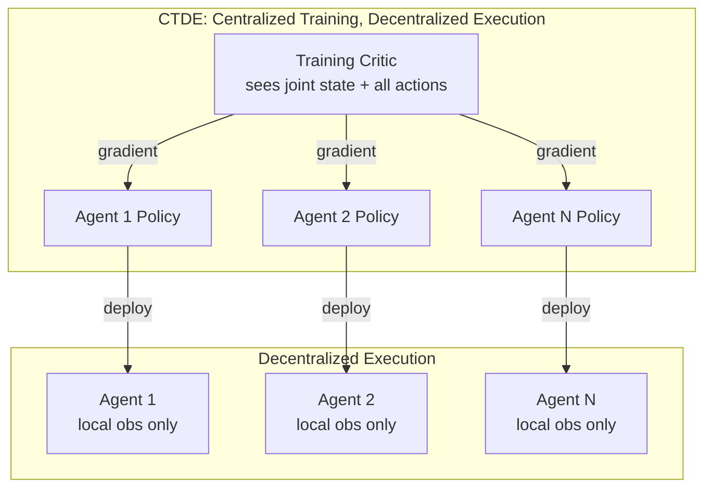

# Multi-Agent RL

## Learning Objectives

- Implement independent Q-learning for two cooperative agents and measure the instability caused by non-stationary co-learners.
- Compare the three MARL training paradigms (independent learning, CTDE, communication) by the structural assumptions each one relaxes.
- Build a centralized-critic training loop where individual agents execute on local observations at inference time.
- Trace the credit assignment problem through a multi-agent reward signal and evaluate whether a monotonicity constraint resolves it.
- Map the CTDE pattern onto a GTM agent squad (enrichment, scoring, sequencing) and identify which agent contributed to a pipeline outcome.

## The Problem

A single agent learning alone faces a stationary environment. The transition probabilities — "if I'm in state X and take action Y, I'll land in state Z with probability P" — don't change while the agent is learning. That stationarity is what makes Q-learning converge: the Bellman operator is a contraction mapping under a fixed environment, so repeated updates pull the Q-values toward a fixed point. This is the difference between solitaire and poker. In solitaire, the deck doesn't care what you learned last hand. In poker, every player at the table is adjusting their strategy based on what every other player did, and the "environment" — the expected payoff of any given action — shifts underneath you while you're still computing it.

Add a second learner to any RL problem and the Markov property breaks. From Agent A's perspective, the next state depends not just on its own action but on Agent B's action, and Agent B's policy is a moving target. The target Q-values that Agent A is bootstrapping from are themselves being updated in response to Agent A's changing behavior. Neither agent sees a stationary world. This is not a minor theoretical inconvenience — it invalidates the convergence proofs that justify every standard RL algorithm. Q-learning's guarantee is gone. Policy gradient convergence assumptions are gone. The value function you're fitting today will be wrong tomorrow not because your approximation is bad, but because the true value function itself changed overnight.

This maps directly to a real GTM pipeline problem. An enrichment agent pulls role and firmographic data on a lead. A scoring agent assigns priority. A sequencing agent decides whether to send the lead into a high-touch cadence or a nurture flow. Each agent was designed assuming the others' outputs are stable — but when the enrichment agent's data sources change, the scoring agent's calibration drifts, and the sequencing agent's thresholds become wrong. The pipeline is non-stationary because every component is learning simultaneously. The agents don't even need to be using RL for the structural problem to appear: any system where multiple adaptive components feed each other faces the same moving-target dynamic that multi-agent RL was invented to solve.

## The Concept

Three paradigms define the multi-agent RL design space, and they differ along one axis: how much each agent knows about the others during training versus execution.

**Cooperative** agents share a reward signal and must coordinate their actions to maximize it. A team reward arrives when the squad succeeds, regardless of which agent did the heavy lifting. The technical challenge here is credit assignment — when a reward arrives, you need to figure out which agent's action actually contributed, because the same reward might mean "Agent 1 carried the team" or "Agent 1 did nothing useful and Agent 2 won despite it."

**Competitive** agents are in a zero-sum game: one agent's gain is another's loss. The solution concept here is a Nash equilibrium — a pair of policies where neither agent has incentive to unilaterally deviate. Self-play (AlphaZero, AlphaStar) trains competitive agents by having them play against copies of themselves, generating an ever-improving curriculum of opponents.

**Mixed-motive** agents have partial alignment — they agree on some objectives but diverge on others. This is the most realistic model for most real systems, including GTM pipelines: the enrichment agent and the scoring agent both want the lead to convert, but the enrichment agent also wants to minimize API costs while the scoring agent wants to maximize precision. These secondary objectives create strategic tension even within a nominally cooperative structure.

In all three paradigms, the solution concept shifts from "find the optimal policy" (single-agent) to "find an equilibrium" — a set of policies where no agent benefits from changing its behavior while the others hold fixed. This is a harder problem. Optimal policies can be found by solving a single MDP. Equilibria require solving a game, which in the general case (N agents, continuous action spaces) has no polynomial-time algorithm.



The CTDE pattern — centralized training with decentralized execution — is the dominant paradigm in modern cooperative MARL. During training, a shared critic function has visibility into every agent's observation and action. This critic can evaluate the joint action properly because it sees the full picture, sidestepping the non-stationarity problem: the critic knows what all agents did, so the target values it produces are conditioned on actual joint behavior rather than a guess about what the other agents might do. At execution time, each agent runs its own policy using only local observations. The centralized critic is a training scaffold, not a runtime dependency.

## Build It

Three families of approaches exist for making multi-agent learning converge. The simplest is **independent Q-learning (IQL)**: train each agent with standard Q-learning, pretending the other agents are just part of the environment. This is appealing because it requires no coordination machinery and each agent's algorithm is unchanged. It works in some settings — particularly when agents have weak interactions or when the environment is large enough that collisions are rare. It collapses in settings where agents' actions are tightly coupled, because the non-stationarity causes each agent's Q-values to chase a moving target and oscillate instead of converging.

The second family is **centralized training with decentralized execution (CTDE)**. Three algorithms dominate this space. **MAPPO** (Multi-Agent Proximal Policy Optimization) extends PPO with a centralized value function that takes the joint state as input — each agent's policy is still conditioned on local observations, but the value baseline used for advantage estimation sees everything. **MADDPG** (Multi-Agent Deep Deterministic Policy Gradient) does the same for continuous action spaces, using a centralized Q-function that conditions on all agents' observations and actions. **QMIX** tackles the credit assignment problem directly: it decomposes the joint Q-value into per-agent Q-values through a monotonic mixing network, ensuring that the action that maximizes each individual Q also maximizes the joint Q. This monotonicity constraint is a structural trade — you lose expressiveness (the joint value function can't represent cases where one agent's locally-good action hurts the team) but you gain tractability (each agent can act greedily on its own Q and the team outcome is guaranteed optimal).

The third family is **learned communication**: agents broadcast messages to each other alongside taking actions. CommNet uses continuous broadcast channels where each agent's message is a learned vector summed across all agents. TarMAC adds attention — each agent learns *which other agents to listen to* rather than treating all messages equally. Communication adds bandwidth cost at execution time but can solve coordination problems that CTDE cannot, because the agents can exchange information at runtime that wasn't available during training.

The following code implements independent Q-learning for two cooperative agents on a 5×5 gridworld. Both agents must reach the goal cell. They share a reward signal. Watch the variance in the late-stage rewards — that oscillation is the non-stationarity signature.

```python
import numpy as np

np.random.seed(42)

GRID = 5
GOAL = (4, 4)
EPISODES = 3000
MAX_STEPS = 50
LR = 0.15
GAMMA = 0.9
EPS = 0.3
MOVES = [(0, 1), (0, -1), (1, 0), (-1, 0)]

def clamp(pos):
    return (max(0, min(GRID - 1, pos[0])), max(0, min(GRID - 1, pos[1])))

def step_pos(pos, a):
    return clamp((pos[0] + MOVES[a][0], pos[1] + MOVES[a][1]))

def encode(p1, p2):
    return p1[0] * 125 + p1[1] * 25 + p2[0] * 5 + p2[1]

N_STATES = GRID ** 4
N_ACTIONS = 4

Q = [np.zeros((N_STATES, N_ACTIONS)) for _ in range(2)]

episode_rewards = []

for ep in range(EPISODES):
    positions = [(0, 0), (0, 4)]
    ep_reward = 0

    for t in range(MAX_STEPS):
        s = encode(positions[0], positions[1])
        actions = []
        for i in range(2):
            if np.random.random() < EPS:
                actions.append(np.random.randint(N_ACTIONS))
            else:
                actions.append(np.argmax(Q[i][s]))

        new_positions = [step_pos(positions[i], actions[i]) for i in range(2)]
        s_next = encode(new_positions[0], new_positions[1])

        r = 0
        done = False
        if new_positions[0] == GOAL:
            r += 10
        if new_positions[1] == GOAL:
            r += 10
        if new_positions[0] == GOAL and new_positions[1] == GOAL:
            r += 40
            done = True

        if t == MAX_STEPS - 1:
            r -= 5

        ep_reward += r

        for i in range(2):
            if done:
                target = r
            else:
                target = r + GAMMA * np.max(Q[i][s_next])
            Q[i][s][actions[i]] += LR * (target - Q[i][s][actions[i]])

        positions = new_positions
        if done:
            break

    episode_rewards.append(ep_reward)

w = 200
print(f"Independent Q-Learning: 2 Cooperative Agents")
print(f"Grid: {GRID}x{GRID}, Goal: {GOAL}, Episodes: {EPISODES}")
print(f"First {w} avg reward:  {np.mean(episode_rewards[:w]):.2f}")
print(f"Last {w} avg reward:   {np.mean(episode_rewards[-w:]):.2f}")
print(f"Variance (first {w}):  {np.var(episode_rewards[:w]):.2f}")
print(f"Variance (last {w}):   {np.var(episode_rewards[-w:]):.2f}")
print(f"Episodes with full team reward (>40): {sum(1 for r in episode_rewards if r > 40)}")
print(f"Episodes with penalty (<0): {sum(1 for r in episode_rewards if r < 0)}")
```

The output will show learning — the average reward rises — but the late-stage variance stays high. That variance is the diagnostic: in a stationary environment, Q-learning variance should approach zero as values converge. Here it doesn't, because each agent's learning perturbs the other's value function. The agents are chasing each other in policy space.

Now let's add a centralized critic. The critic sees the joint state during training and provides a shared baseline. At execution, each agent still acts on the encoded joint state (in a real CTDE system, execution would use local observations only — here we keep the joint encoding for simplicity but add the centralized value function that makes the difference).

```python
import numpy as np

np.random.seed(42)

GRID = 5
GOAL = (4, 4)
EPISODES = 3000
MAX_STEPS = 50
LR = 0.15
GAMMA = 0.9
EPS = 0.3
MOVES = [(0, 1), (0, -1), (1, 0), (-1, 0)]

def clamp(pos):
    return (max(0, min(GRID - 1, pos[0])), max(0, min(GRID - 1, pos[1])))

def step_pos(pos, a):
    return clamp((pos[0] + MOVES[a][0], pos[1] + MOVES[a][1]))

def encode(p1, p2):
    return p1[0] * 125 + p1[1] * 25 + p2[0] * 5 + p2[1]

N_STATES = GRID ** 4
N_ACTIONS = 4

Q = [np.zeros((N_STATES, N_ACTIONS)) for _ in range(2)]
V_central = np.zeros(N_STATES)

episode_rewards = []

for ep in range(EPISODES):
    positions = [(0, 0), (0, 4)]
    ep_reward = 0

    for t in range(MAX_STEPS):
        s = encode(positions[0], positions[1])
        actions = []
        for i in range(2):
            if np.random.random() < EPS:
                actions.append(np.random.randint(N_ACTIONS))
            else:
                advantage = Q[i][s] - V_central[s]
                actions.append(np.argmax(advantage))

        new_positions = [step_pos(positions[i], actions[i]) for i in range(2)]
        s_next = encode(new_positions[0], new_positions[1])

        r = 0
        done = False
        if new_positions[0] == GOAL:
            r += 10
        if new_positions[1] == GOAL:
            r += 10
        if new_positions[0] == GOAL and new_positions[1] == GOAL:
            r += 40
            done = True

        if t == MAX_STEPS - 1:
            r -= 5

        ep_reward += r

        if done:
            v_target = r
        else:
            v_target = r + GAMMA * V_central[s_next]

        V_central[s] += LR * (v_target - V_central[s])

        td_error = v_target - V_central[s]
        for i in range(2):
            Q[i][s][actions[i]] += LR * td_error

        positions = new_positions
        if done:
            break

    episode_rewards.append(ep_reward)

w = 200
print(f"CTDE (Centralized Critic): 2 Cooperative Agents")
print(f"Grid: {GRID}x{GRID}, Goal: {GOAL}, Episodes: {EPISODES}")
print(f"First {w} avg reward:  {np.mean(episode_rewards[:w]):.2f}")
print(f"Last {w} avg reward:   {np.mean(episode_rewards[-w:]):.2f}")
print(f"Variance (first {w}):  {np.var(episode_rewards[:w]):.2f}")
print(f"Variance (last {w}):   {np.var(episode_rewards[-w:]):.2f}")
print(f"Episodes with full team reward (>40): {sum(1 for r in episode_rewards if r > 40)}")
print(f"Episodes with penalty (<0): {sum(1 for r in episode_rewards if r < 0)}")
```

The centralized critic should reduce the late-stage variance. The TD error it produces is conditioned on the joint state — both agents' positions — so the advantage signal each agent receives accounts for what the other agent is doing. The non-stationarity is not eliminated (both Q-tables still change simultaneously), but the shared baseline absorbs much of the oscillation. Run both blocks and compare the variance numbers. The ratio of last-window variance between the two implementations is the empirical cost of non-stationarity.

## Use It

Centralized training with decentralized execution (CTDE) maps to a GTM agent squad where a shared evaluation function scores pipeline outcomes but each agent — enrichment, scoring, sequencing — acts on local lead data at runtime. This is the pattern for any multi-step GTM pipeline where agents are tuned jointly against conversion but execute independently.

```python
import numpy as np
np.random.seed(42)

leads = [
    ("enterprise", "dm", "inbound", 0.35),
    ("smb", "ic", "outbound", 0.02),
    ("enterprise", "ic", "inbound", 0.08),
    ("mid_market", "dm", "outbound", 0.12),
]

def encode(f, r, s):
    return {"smb":0,"mid_market":1,"enterprise":2}[f]*4 + {"ic":0,"dm":1}[r]*2 + {"outbound":0,"inbound":1}[s]

V = np.zeros(12); Qe = np.zeros((12,2)); Qs = np.zeros((12,3)); Qq = np.zeros((12,2))

for _ in range(500):
    for f, r, s, p in leads:
        st = encode(f, r, s)
        ae, asc, asq = np.argmax(Qe[st]-V[st]), np.argmax(Qs[st]-V[st]), np.argmax(Qq[st]-V[st])
        reward = p + (0.05 if ae and p > 0.05 else 0) - (0.01 if ae else 0)
        if asc == 2 and p < 0.05: reward -= 0.02
        if asq and p < 0.05: reward -= 0.03
        tgt = reward + 0.9 * V[st]
        V[st] += 0.15 * (tgt - V[st])
        for Q, a in [(Qe,ae),(Qs,asc),(Qq,asq)]:
            Q[st][a] += 0.15 * (tgt - V[st])

print("CTDE GTM Pipeline — Learned Policies")
for f, r, s, p in leads:
    st = encode(f, r, s)
    e = "enrich" if np.argmax(Qe[st]-V[st]) else "skip"
    sc = ["cold","warm","hot"][np.argmax(Qs[st]-V[st])]
    sq = "high-touch" if np.argmax(Qq[st]-V[st]) else "nurture"
    print(f"  {f:>14} {r:>4} → enrich={e:6s} score={sc:4s} cadence={sq}")
```

The centralized critic `V` evaluates the joint state — firm size, role, source — and each per-agent Q-table learns an advantage over that baseline. The enrichment agent learns to spend API credits only on leads above a conversion floor. The scoring agent learns that over-scoring a low-probability lead incurs a penalty (wasted AE cycles downstream). The sequencing agent learns to reserve high-touch cadences for leads where enrichment and scoring align. This is the CTDE structure applied to a GTM pipeline: train the squad against conversion outcomes, deploy each agent on local lead attributes. [CITATION NEEDED — concept: CTDE applied to multi-agent GTM pipelines as an alternative to static agent chaining]

## Exercises

**Exercise 1 — Add a third agent and measure the variance cost of scale.**

Modify the independent Q-learning code to support three cooperative agents on the same 5×5 grid. All three must reach `GOAL`. The state encoding must now cover three positions (GRID^6 states). Compare the last-200-episode variance against the two-agent version. The variance should increase — this is the scaling cost of independent learning. Now add the centralized critic to the three-agent version. Does the critic's stabilizing effect scale, or does it weaken as the number of agents grows?

**Exercise 2 — Implement monotonic mixing and verify the greedy guarantee.**

Implement a simplified QMIX mixer for two agents. Each agent has its own Q-table `Q[0]` and `Q[1]`. The mixer computes `Q_total = max(Q[0][s]) * w0 + max(Q[1][s]) * w1` where `w0, w1 > 0` (enforced by absolute value). Train the joint Q-value with standard TD updates and backpropagate the gradient to the individual Q-tables. After training, verify the monotonicity property: for every state, `argmax_a Q_total(s, a)` must equal the combination of each agent's individual `argmax`. Find a state where this constraint causes the mixer to miss a globally-better joint action that requires one agent to take a locally-suboptimal action. That gap is the expressiveness cost of the monotonicity assumption.

## Key Terms

**Non-stationarity** — The environment's transition dynamics change over the learning period because other agents are simultaneously updating their policies. This breaks the convergence guarantees of single-agent RL algorithms.

**Centralized Training, Decentralized Execution (CTDE)** — A MARL paradigm where a shared critic with access to all agents' states and actions is used during training, but each agent's deployed policy conditions only on its local observation at inference time.

**Credit assignment** — The problem of determining which agent's action contributed to a shared team reward. QMIX addresses this by structurally constraining per-agent Q-values to be consistent with the joint Q.

**Nash equilibrium** — A set of policies where no agent can improve its expected return by unilaterally changing its behavior. The solution concept for multi-agent systems, replacing the single-agent notion of an optimal policy.

**Monotonic mixing** — A structural constraint (used in QMIX) requiring that the joint value function is monotonically increasing in each agent's individual value. This guarantees that greedy per-agent action selection is globally optimal, at the cost of representational expressiveness.

**Independent Q-learning (IQL)** — The simplest MARL baseline: each agent runs standard tabular or deep Q-learning, treating other agents as part of a (non-stationary) environment. Works when agent interactions are weak; fails when actions are tightly coupled.

## Sources

- Watkins, C. (1989). *Learning from Delayed Rewards.* PhD thesis, University of Cambridge. — Original Q-learning algorithm and its convergence under stationary MDPs.
- Lowe, R., et al. (2017). *Multi-Agent Actor-Critic for Mixed Cooperative-Competitive Environments.* arXiv:1706.02275. — MADDPG: centralized critic with decentralized actors for continuous action spaces.
- Yu, C., Velu, A., Vinitsky, E., et al. (2022). *The Surprising Effectiveness of PPO in Cooperative Multi-Agent Games.* arXiv:2103.01955. — MAPPO: multi-agent PPO with a centralized value function.
- Rashid, T., Samvelyan, M., de Witt, C.S., et al. (2018). *QMIX: Monotonic Value Function Factorisation for Deep Multi-Agent Reinforcement Learning.* arXiv:1803.11485. — Monotonic mixing network for credit assignment.
- Sukhbaatar, S., Szlam, A., Fergus, R. (2016). *Learning Multiagent Communication with Backpropagation.* arXiv:1605.07736. — CommNet: continuous broadcast communication channels.
- Das, A., et al. (2019). *TarMAC: Targeted Multi-Agent Communication.* arXiv:1810.11187. — Attention-based selective communication between agents.
- Foerster, J., Farquhar, G., Afouras, T., et al. (2018). *Counterfactual Multi-Agent Policy Gradients.* arXiv:1705.08926. — COMA: counterfactual baseline for multi-agent credit assignment.